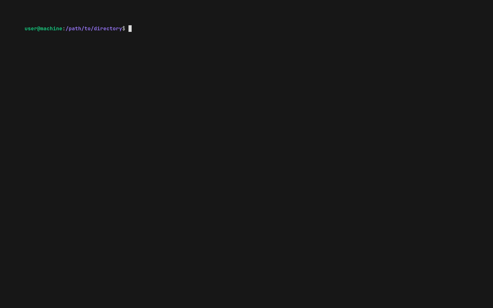

<!--

WARNING: This file is auto-generated by snipinator. Do not edit directly.
SOURCE: `.github/README.md.jinja2`.

-->
<!--


-->

# <div align="center">[![Snipinator][1]][2]</div>

<div align="center">

<!-- Icons from https://lucide.dev/icons/users -->
<!-- Icons from https://lucide.dev/icons/laptop-minimal -->

![**Audience:** Developers][3] ![**Platform:** Linux][4]

</div>

<p align="center">
  <strong>
    <a href="https://github.com/realazthat/snipinator">🏠Home</a>
    &nbsp;&bull;&nbsp;
    <a href="#-features">🎇Features</a>
    &nbsp;&bull;&nbsp;
    <a href="#-install">🔨Install</a>
    &nbsp;&bull;&nbsp;
    <a href="#-usage">🚜Usage</a>
    &nbsp;&bull;&nbsp;
    <a href="#-command-line-options">💻CLI</a>
    &nbsp;&bull;&nbsp;
    <a href="#-examples">💡Examples</a>
  </strong>
</p>
<p align="center">
  <strong>
    <a href="#-jinja2-api">🤖Jinja2 API</a>
    &nbsp;&bull;&nbsp;
    <a href="#-requirements">✅Requirements</a>
    &nbsp;&bull;&nbsp;
    <a href="#-docker-image">🐳Docker</a>
    &nbsp;&bull;&nbsp;
    <a href="#-gotchas-and-limitations">🚸Gotchas</a>
  </strong>
</p>

<div align="center">

![Top language][5] [![GitHub License][6]][7] [![PyPI - Version][8]][9]
[![Python Version][10]][9]

**CLI to embed (testable) snippets from your codebase into your README**

</div>

---

<div align="center">

|                   | Status                      | Stable                    | Unstable                  |                          |
| ----------------- | --------------------------- | ------------------------- | ------------------------- | ------------------------ |
| **[Master][11]**  | [![Build and Test][12]][13] | [![since tagged][14]][15] |                           | [![last commit][16]][17] |
| **[Develop][18]** | [![Build and Test][19]][13] | [![since tagged][20]][21] | [![since tagged][22]][23] | [![last commit][24]][25] |

</div>



## ❔ What

What it does: **Snipinator** lets you take a `EXAMPLE.md` template
and include snippets from your (working and tested) codebase.

Turn this ([./snipinator/examples/EXAMPLE.md.jinja2](./snipinator/examples/EXAMPLE.md.jinja2)):

<!---->
```md
# A README

Here is a code snippet:

<!--{{ pysnippet(path='snipinator/examples/code.py', symbol='MyClass', backtickify='py', decomentify='nl') }}-->

Note that `code.py` has a test:
{{path('./snipinator/examples/code_test.py', link='md')}}.

```
<!---->

Into this ([./snipinator/examples/EXAMPLE.generated.md](./snipinator/examples/EXAMPLE.generated.md)):

<!---->
````md
<!--

WARNING: This file is auto-generated by snipinator. Do not edit directly.
SOURCE: `snipinator/examples/EXAMPLE.md.jinja2`.

-->
# A README

Here is a code snippet:

<!---->
```py
class MyClass:
  """This is a global class"""

  def __init__(self, name):
    self.name = name

  def MyClassMethod(self):
    """This is a method of MyClass"""
    print(self.name)
```
<!---->

Note that `code.py` has a test:
[./snipinator/examples/code_test.py](./snipinator/examples/code_test.py).

````
<!---->

## 🎇 Features

- 📦✅🪄 Supports anything **[Jinja2](https://github.com/pallets/jinja)**
  supports.
- 🥇🐍📜 First-class support for **python** source code.
  - Can include python function signatures, docstrings, entire function source
    code, classes.
- ✂🌐🗂️ Snip from **any source code language**.
  - Put delimiter markers into the code (e.g `# START_SNIPPET`,
    `# END_TEMPLATE`), and use [snippet()](#snippet).
- 🥇🔖📜 First-class support for **Markdown** templates (with `backtickify`,
  `decomentify`).
- 📦🐚🖨️ Can include **[shell](#shell) output**.
  - Supports ANSI colors :heart: :green_heart: :blue_heart: with SVG output
    :camera:.
- ⚙️🔗🗃️ More robust **references/links** to local files using [path()](#path).
- 🐳🌊🖥️ Docker Image (See [README: Docker Image](#-docker-image)).

## 🔨 Install

```bash
# Install from pypi (https://pypi.org/project/snipinator/)
pip install snipinator

# Install from git (https://github.com/realazthat/snipinator)
pip install git+https://github.com/realazthat/snipinator.git@v3.1.1
```

## 🚜 Usage

Example template README:
([./snipinator/examples/EXAMPLE.md.jinja2](./snipinator/examples/EXAMPLE.md.jinja2)):

<!---->
```md
# A README

Here is a code snippet:

<!--{{ pysnippet(path='snipinator/examples/code.py', symbol='MyClass', backtickify='py', decomentify='nl') }}-->

Note that `code.py` has a test:
{{path('./snipinator/examples/code_test.py', link='md')}}.

```
<!---->

Generating the README:

<!---->
````bash
$ python -m snipinator.cli -t snipinator/examples/EXAMPLE.md.jinja2
<!--

WARNING: This file is auto-generated by snipinator. Do not edit directly.
SOURCE: `snipinator/examples/EXAMPLE.md.jinja2`.

-->
# A README

Here is a code snippet:

<!---->
```py
class MyClass:
  """This is a global class"""

  def __init__(self, name):
    self.name = name

  def MyClassMethod(self):
    """This is a method of MyClass"""
    print(self.name)
```
<!---->

Note that `code.py` has a test:
[./snipinator/examples/code_test.py](./snipinator/examples/code_test.py).

````
<!---->

Fuller example:

<!---->

<!---->

## 💻 Command Line Options

<!---->

<!---->

## 💡 Examples

- Snipinator's own `README`:
  - Template: [./.github/README.md.jinja2](./.github/README.md.jinja2).
  - Generated: [./README.md](./README.md).
  - Generation script: [./scripts/generate-readme.sh](./scripts/generate-readme.sh).
- Example:
  - Template: [./snipinator/examples/EXAMPLE.md.jinja2](./snipinator/examples/EXAMPLE.md.jinja2).
  - Generated:
    [./snipinator/examples/EXAMPLE.generated.md](./snipinator/examples/EXAMPLE.generated.md).
  - Generation script:
    [./snipinator/examples/example_example.sh](./snipinator/examples/example_example.sh).
- Long example of many features:
  - Template:
    [./snipinator/examples/LONG-EXAMPLE.md.jinja2](./snipinator/examples/LONG-EXAMPLE.md.jinja2).
  - Generated:
    [./snipinator/examples/LONG-EXAMPLE.generated.md](./snipinator/examples/LONG-EXAMPLE.generated.md).
  - Generation script:
    [./snipinator/examples/long_example.sh](./snipinator/examples/long_example.sh).
- Projects using Snipinator:
  - [realazthat/snipinator][26]
    - Template: [./.github/README.md.jinja2](./.github/README.md.jinja2).
    - Generated: [snipinator/README.md][27].
    - Generation script: [snipinator/scripts/generate-readme.sh#L20][28].
  - [realazthat/mdremotifier][29].
    - Template: [mdremotifier/README.md.jinja2][30].
    - Generated: [mdremotifier/README.md][31].
    - Generation script: [mdremotifier/generate-readme.sh#L20][32].
  - [realazthat/changeguard][33].
    - Template: [changeguard/README.md.jinja2][34].
    - Generated: [changeguard/README.md][35].
    - Generation script: [changeguard/generate-readme.sh#L20][36].
  - [realazthat/excalidraw-brute-export-cli][37],
    - Template: [excalidraw-brute-export-cli/README.md.jinja2][38].
    - Generated: [excalidraw-brute-export-cli/README.md][39].
    - Generation script:
      [excalidraw-brute-export-cli/generate-readme.sh#L65][40].
  - [realazthat/comfy-catapult][41].
    - Template: [comfy-catapult/README.md.jinja2][42].
    - Generated: [comfy-catapult/README.md][43].
    - Generation script: [comfy-catapult/generate-readme.sh#L17][44].
  - [realazthat/comfylowda][45].
    - Template: [comfylowda/README.md.jinja2][46].
    - Generated: [comfylowda/README.md][47].
    - Generation script: [comfylowda/generate-readme.sh#L17][48].

## 🤖 Jinja2 API

The regular Jinja2 v3 template syntax is supported. For more information, see
[Template Designer Documentation](https://jinja.palletsprojects.com/en/3.1.x/templates/).

Additional (Jinja2) functions made available:

### 🐍✂ pysnippet

Used several times in
[./snipinator/examples/LONG-EXAMPLE.md.jinja2](./snipinator/examples/LONG-EXAMPLE.md.jinja2).

Documentation:

<!---->
```py
def pysnippet(path: str,
              symbol: Optional[str],
              *,
              escape: bool = False,
              indent: Union[str, int, None] = None,
              indented: Union[str, int, None] = None,
              backtickify: Union[bool, str] = False,
              decomentify: Union[bool, Literal['nl']] = False,
              _ctx: _Context) -> Union[str, markupsafe.Markup]:
  """Return a python snippet, allowing you to specify a class or function.

  Args:
      path (str): The path to the file.
      symbol (Optional[str]): The symbol to extract. If None, the entire file is
        returned. Defaults to None.
      escape (bool, optional): Should use HTML entities escaping? Defaults to
        False.
      indent (Union[str, int, None], optional): Should indent? By how much, or
        with what prefix? Defaults to None.
      indented (Union[str, int, None], optional): Indents every line except the
        first. By how much, or with what prefix? Defaults to None.
      backtickify (Union[bool, str], optional): Should surround with backticks?
        With what language? Defaults to False.
      decomentify (Union[bool, Literal['nl']], optional): Assuming that you will
        be using HTML comments around this call, setting this to true will add
        correspondingcomments to uncomment the output. This allows you to have
        the Jinja2 call unmolested by markdown formatters, because they will be
        inside of a comment section. "nl" adds additional newlines after the
        newline delimiters. Defaults to False.
      _ctx (_Context): This is used by the system and is not available as an
        argument.

  Returns:
      Union[str, markupsafe.Markup]: The snippet.
  """
```
<!---->

### 🐍📖 pysignature

Used several times in [./.github/README.md.jinja2](./.github/README.md.jinja2).

Documentation:

<!---->
```py
def pysignature(path: str,
                symbol: str,
                *,
                escape: bool = False,
                indent: Union[str, int, None] = None,
                indented: Union[str, int, None] = None,
                backtickify: Union[bool, str] = False,
                decomentify: Union[bool, Literal['nl']] = False,
                _ctx: _Context) -> str:
  """Return the signature of a class or function in a python file.

  Returns the {class,function} signature and the docstring.

  Args:
      path (str): The path to the file.
      symbol (str): The symbol to extract.
      escape (bool, optional): Should use HTML entities escaping? Defaults to
        False.
      indent (Union[str, int, None], optional): Should indent? By how much, or
        with what prefix? Defaults to None.
      indented (Union[str, int, None], optional): Indents every line except the
        first. By how much, or with what prefix? Defaults to None.
      backtickify (Union[bool, str], optional): Should surround with backticks?
        With what language? Defaults to False.
      decomentify (Union[bool, Literal['nl']], optional): Assuming that you will
        be using HTML comments around this call, setting this to true will add
        correspondingcomments to uncomment the output. This allows you to have
        the Jinja2 call unmolested by markdown formatters, because they will be
        inside of a comment section. "nl" adds additional newlines after the
        newline delimiters. Defaults to False.
      _ctx (_Context): This is used by the system and is not available as an
        argument.

  Returns:
      str: The signature and docstring.
  """
```
<!---->

### ✂ rawsnippet

Used several times in [./.github/README.md.jinja2](./.github/README.md.jinja2).

Documentation:

<!---->
```py
def rawsnippet(path: str,
               *,
               escape: bool = False,
               indent: Union[str, int, None] = None,
               indented: Union[str, int, None] = None,
               backtickify: Union[bool, str] = False,
               decomentify: Union[bool, Literal['nl']] = False,
               _ctx: _Context) -> Union[str, markupsafe.Markup]:
  """Return an entire file as a snippet.

  Args:
      path (str): The path to the file.
      escape (bool, optional): Should use HTML entities escaping? Defaults to
        False.
      indent (Union[str, int, None], optional): Should indent? By how much, or
        with what prefix? Defaults to None.
      indented (Union[str, int, None], optional): Indents every line except the
        first. By how much, or with what prefix? Defaults to None.
      backtickify (Union[bool, str], optional): Should surround with backticks?
        With what language? Defaults to False.
      decomentify (Union[bool, Literal['nl']], optional): Assuming that you will
        be using HTML comments around this call, setting this to true will add
        correspondingcomments to uncomment the output. This allows you to have
        the Jinja2 call unmolested by markdown formatters, because they will be
        inside of a comment section. "nl" adds additional newlines after the
        newline delimiters. Defaults to False.
      _ctx (_Context): This is used by the system and is not available as an
        argument.

  Returns:
      Union[str, markupsafe.Markup]: The snippet.
  """

```
<!---->

### ✂ snippet

Example in [./snipinator/examples/LONG-EXAMPLE.md.jinja2](./snipinator/examples/LONG-EXAMPLE.md.jinja2).

Documentation:

<!---->
```py
def snippet(path: str,
            start: str,
            end: str,
            *,
            escape: bool = False,
            indent: Union[str, int, None] = None,
            indented: Union[str, int, None] = None,
            backtickify: Union[bool, str] = False,
            decomentify: Union[bool, Literal['nl']] = False,
            regex: Union[bool, str] = False,
            _ctx: _Context) -> Union[str, markupsafe.Markup]:
  """Returns a _delimited_ snippet from a file.

  Does not return the delimiters themselves.

  Args:
      path (str): The path to the file.
      start (str): A string that indicates the start of the snippet.
      end (str): A string that indicates the end of the snippet.
      escape (bool, optional): Should use HTML entities escaping? Defaults to
        False.
      indent (Union[str, int, None], optional): Should indent? By how much, or
        with what prefix? Defaults to None.
      indented (Union[str, int, None], optional): Indents every line except the
        first. By how much, or with what prefix? Defaults to None.
      backtickify (Union[bool, str], optional): Should surround with backticks?
        With what language? Defaults to False.
      decomentify (Union[bool, Literal['nl']], optional): Assuming that you will
        be using HTML comments around this call, setting this to true will add
        correspondingcomments to uncomment the output. This allows you to have
        the Jinja2 call unmolested by markdown formatters, because they will be
        inside of a comment section. "nl" adds additional newlines after the
        newline delimiters. Defaults to False.
      regex (Union[bool, str], optional): If True, `start` and `end` will be
        treated as regular expressions. Optionally, can pass in python regex
        flags separated by `|` characters, e.g "IGNORECASE|MULTILINE". Defaults
        to False.
      _ctx (_Context): This is used by the system and is not available as an
        argument.

  Returns:
      Union[str, markupsafe.Markup]: The snippet.
  """

```
<!---->

### 🐚 shell

Used several times in [./.github/README.md.jinja2](./.github/README.md.jinja2).

Documentation:

<!---->
```py
def shell(args: str,
          *,
          escape: bool = False,
          indent: Union[str, int, None] = None,
          indented: Union[str, int, None] = None,
          backtickify: Union[bool, str] = False,
          decomentify: Union[bool, Literal['nl']] = False,
          rich: Union[Literal['svg'], Literal['img+b64+svg'], Literal['raw'],
                      str] = 'raw',
          rich_alt: Optional[str] = None,
          rich_bg_color: Optional[str] = None,
          rich_term: Optional[str] = None,
          rich_rows: int = 24,
          rich_cols: int = 80,
          include_args: bool = True,
          start: Optional[str] = None,
          end: Optional[str] = None,
          regex: Union[bool, str] = False,
          _ctx: _Context) -> Union[str, markupsafe.Markup]:
  """Run a shell command and return the output.

  Use at your own risk, this can potentially introduce security vulnerabilities.
  Only use if you know what you are doing. Ensure that no untrusted input can
  be injected into the `args` parameter, or, into anything the command might
  access. If an adversary can control the `args` parameter, they can execute
  arbitrary commands on your system.

  Note: On persistent output colors:

  * I found that the environment variables TERM, COLORTERM and FORCE_COLOR,
    CLI_WIDTH, COLUMNS also influence the outputs for some applications.
  * Also various library versions used in various programs, e.g colorama,
    rich-argparse, Pygments might influence the output.
  * I had to pin all my python packages, and explicitly set TERM, COLORTERM and
    FORCE_COLOR, CLI_WIDTH, COLUMNS to get the output to be consistent across
    two different systems, both using Ubuntu, for a single program.

  Args:
      args (str): The command to run.
      escape (bool, optional): Should use HTML entities escaping? Defaults to
        False.
      indent (Union[str, int, None], optional): Should indent? By how much, or
        with what prefix? Defaults to None.
      indented (Union[str, int, None], optional): Indents every line except the
        first. By how much, or with what prefix? Defaults to None.
      backtickify (Union[bool, str], optional): Should surround with backticks?
        With what language? Defaults to False.
      decomentify (bool, optional): Assuming that you will be using HTML
        comments around this call, setting this to true will add corresponding
        uncomments to uncomment the output. This allows you to have the Jinja2
        call unmolested by markdown formatters, because they will be inside of
        a comment section. Defaults to False.
      rich (Union[Literal['svg'], Literal['img+b64+svg'], Literal['raw'], str],
        optional):
        Optionally outputs colored terminal output as an image.
        * If `rich` is a relative file path that ends with ".svg", the svg will
          be saved to that location and an img tag will be emitted. The path
          will be relative to the template file, which is specified on the
          command line. If the template is from stdin, the path will be relative
          to the current working directory (cwd) which is also specified on the
          command line.
        * If 'svg' a raw svg tag will be dumped into the markdown with the
          colored terminal output. Note that your markdown renderer may not
          support this.
        * If 'img+svg' a base64 encoded image will be dumped into the markdown
          with the colored terminal output.
        * If 'raw' the raw (uncolored) terminal output will be dumped into the
          markdown directly.
        * Defaults to 'raw.
      rich_alt (str, optional): The alt text for the img tag. Defaults
        to None.
      rich_bg_color (str, optional): The background color for the
        terminal output. Valid colors include anything valid for SVG colors. See
        <https://developer.mozilla.org/en-US/docs/Web/CSS/color>. Defaults to
        None (fully transparent).
      rich_term: (str, optional): Sets the TERM env var. Defaults to
        None, which uses whatever the env vars already have.
      rich_rows (int, optional): The number of rows to use for the terminal
        output. Doesn't seem to have much effect. Defaults to 24.
      rich_cols (int, optional): The number of columns to use for the terminal
        output. Defaults to 80.
      include_args (bool, optional): Should include the command that was run in
        the output? Defaults to True.
      start (str, optional): If specified, will return only the text after this
        delimiter. Defaults to None.
      end (str, optional): If specified, will return only the text before this
        delimiter. Defaults to None.
      regex (Union[bool, str], optional): If True, `start` and `end` will be
        treated as regular expressions. Optionally, can pass in python regex
        flags separated by `|` characters, e.g "IGNORECASE|MULTILINE". Defaults
        to False.
      _ctx (_Context): This is used by the system and is not available as an
        argument.

  Returns:
      Union[str, markupsafe.Markup]: Returns the output of the command.
  """
```
<!---->

### 🌀 path

Used several times in [./.github/README.md.jinja2](./.github/README.md.jinja2).

Documentation:

<!---->
```py
def path(path: str,
         *,
         escape: bool = False,
         indent: Union[str, int, None] = None,
         indented: Union[str, int, None] = None,
         backtickify: Union[bool, str] = False,
         decomentify: Union[bool, Literal['nl']] = False,
         link: Optional[Literal['md', 'html']] = None,
         text: Optional[str] = None,
         _ctx: _Context) -> Union[str, markupsafe.Markup]:
  """Verifies that `path` exists, and just returns `path`.

  Unfortunately, I don't know how to use this inside a link, because the
  formatters will destroy it, and it cannot be put into a code block (as the url
  section of a link in markdown does not allow code blocks).

  Args:
      path (str): The path to verify.
      escape (bool, optional): Should use HTML entities escaping? Defaults to
        False.
      indent (Union[str, int, None], optional): Should indent? By how much, or
        with what prefix? Defaults to None.
      indented (Union[str, int, None], optional): Indents every line except the
        first. By how much, or with what prefix? Defaults to None.
      backtickify (Union[bool, str], optional): Should surround with backticks?
        With what language? Defaults to False.
      decomentify (Union[bool, Literal['nl']], optional): Assuming that you will
        be using HTML comments around this call, setting this to true will add
        correspondingcomments to uncomment the output. This allows you to have
        the Jinja2 call unmolested by markdown formatters, because they will be
        inside of a comment section. "nl" adds additional newlines after the
        newline delimiters. Defaults to False.
      link (Literal['md', 'html'], optional): If specified, will
        return a markdown or html link to the path. Defaults to None.
      text (str, optional): If specified, will use this text as the
        return value instead of the path. If used with link, will return this
        text as the link text instead of the path. Defaults to None.
      _ctx (_Context): This is used by the system and is not available as an
        argument.

  Returns:
      Union[str, markupsafe.Markup]: Just returns the path. If the path doesn't
        exist, it will raise an error.
  """
```
<!---->

## ✅ Requirements

- Linux-like environment
  - Why: Uses pexpect.spawn().
- Python 3.8+
  - Why: Some dev dependencies require Python 3.8+.

### Tested Platforms

- WSL2 Ubuntu 20.04, Python `3.8.0`.
- Ubuntu 20.04, Python `3.8.0, 3.9.0, 3.10.0, 3.11.0, 3.12.0`, tested in GitHub Actions
  workflow ([build-and-test.yml](./.github/workflows/build-and-test.yml)).

## 🐳 Docker Image

Docker images are published to [ghcr.io/realazthat/snipinator][49] at each
tag.

<!---->
```bash

# View the template file.
cat "snipinator/examples/EXAMPLE.md.jinja2"

# Use the published images at ghcr.io/realazthat/snipinator.
# /data in the docker image is the working directory, so paths are simpler.
docker run --rm --tty \
  -u "$(id -u):$(id -g)" \
  -v "${PWD}:/data" \
  ghcr.io/realazthat/snipinator:v3.1.1 \
  -t "snipinator/examples/EXAMPLE.md.jinja2" \
  --rm \
  --force \
  --create \
  -o "snipinator/examples/EXAMPLE.generated.md" \
  --chmod-ro \
  --skip-unchanged

# View the generated file.
cat "snipinator/examples/EXAMPLE.generated.md"

```
<!---->

If you want to build the image yourself, you can use the Dockerfile in the
repository.

<!---->
```bash

docker build -t my-snipinator-image .

# View the template file.
cat "snipinator/examples/EXAMPLE.md.jinja2"

# /data in the docker image is the working directory, so paths are simpler.
docker run --rm --tty \
  -u "$(id -u):$(id -g)" \
  -v "${PWD}:/data" \
  my-snipinator-image \
  -t "snipinator/examples/EXAMPLE.md.jinja2" \
  --rm \
  --force \
  --create \
  -o "snipinator/examples/EXAMPLE.generated.md" \
  --chmod-ro \
  --skip-unchanged

# View the generated file.
cat "snipinator/examples/EXAMPLE.generated.md"

```
<!---->

## 🚸 Gotchas and Limitations

- **Security:** This tool is NOT designed to be used with untrusted input. It is
  designed to be used with your own codebase. Even when using your own input, be
  careful that your own code won't be doing anything that might inadvertently
  include untrusted input.
- Be careful to escape `{{` and `}}`,
  or `` or anything jinja2
  is sensitive to, in the templates. You'll have to escape it properly for
  jinja2, which involves using `` and
  `` tags.
- Recursion: Snipinator doesn't directly support recursive
  inclusion of generated content. You can generate the contents of one file
  first, and include that generated content into another template. This would
  mean that you have to worry about order of generation.
- Embedded Backticks: If there are backticks in the included snippet, it might
  ruin the backticks you have in your markdown. This is why `backtickify`
  parameter exists in the API, so that Snipinator provides the
  backticks, and it will detect if there are backticks in the snippet and use a
  different number of backticks on the entire snippet. So if the snippet
  contains ` ```My Snippet``` `, Snipinator will use
  ` ````language ```My Snippet``` ```` ` and this is a method that Markdown uses
  to allow embedded backticks inside a code block.
- Formatting: The `{{` `}}` used to
  surround the snippet calls will unfortunately be formatted by a Markdown
  formatter and make the call invalid. Workarounds:
  - **Decommentify**: Put the snippet call inside a HTML comment, then use
    `decommentify` parameter. See
    [./snipinator/examples/LONG-EXAMPLE.md.jinja2](./snipinator/examples/LONG-EXAMPLE.md.jinja2) for
    examples.
  - [prettier](https://prettier.io/) formatter is pretty good at leaving the
    Jinja2 calls alone, especially if you don't have any spaces. This especially
    helps for markdown "reference-style links" that have Jinja2 calls in them
    generating part of the URL, mdformat will URL encode the Jinja2 calls,
    and/or split them on spaces, which is not what we want. prettier will leave
    them alone.
  - For code blocks: If you embed the snippet call in a code block, it will not
    be formatted. However, because of **Embedded Backticks** gotcha, (see
    above), this is not recommended, unless you know for sure that there are no
    embedded backticks.
  - If your formatter supports a comment that disabled formatting, you can
    surround the snippet call with that comment.
- Editing the wrong file: When you have a template and a generated file, it is
  easy to edit the wrong file. To combat this:
  - Snipinator provides a warning at the top of the generated file
    to remind you that it is auto-generated.
  - Snipinator will optionally chmod the file for you to make it
    read-only.
- Newlines: This program assumes LF newlines. I don't know if it will work for
  anything else.
- Combining `backtickify` and `indent`: Doesn't make much sense, but if you do
  it, it will run backtickify first, then indent everything including the
  backticks.

## 🤏 Versioning

We use SemVer for versioning. For the versions available, see the tags on this
repository.

## 🔑 License

This project is licensed under the MIT License - see the
[./LICENSE.md](./LICENSE.md) file for details.

## 🙏 Thanks

Main libraries used in Snipinator are:

- Templating: [Jinja2](https://github.com/pallets/jinja).
- Snippet inclusion: Python's AST library.
- Colorful CLI help: [rich-argparse](https://github.com/hamdanal/rich-argparse).
- ANSI coloring shell output:
  {[pexpect](https://pexpect.readthedocs.io/en/stable/),
  [rich](https://github.com/Textualize/rich)}.

## 🤝 Related Projects

Not complete, and not necessarily up to date. Make a PR
([contributions](#-contributions)) to insert/modify.

| Project                                                             | Stars     | Last Update  | Language   | Platform                 | Similarity X Obviousness |
| ------------------------------------------------------------------- | --------- | ------------ | ---------- | ------------------------ | ------------------------ |
| [mdx-js / mdx][50]                                                  | 16.8k     | `2024/04/17` | JS         | N/A                      | ⭐⭐⭐⭐⭐               |
| [fletcher / MultiMarkdown-6][51]                                    | 599       | `2023/12/30` | C          | CLI                      | ⭐⭐⭐⭐⭐               |
| [gajus / gitdown][52]                                               | 448       | `2022/03/01` | JS         | CLI                      | ⭐⭐⭐⭐⭐               |
| [gpoore / codebraid][53]                                            | 362       | `2023/10/17` | Python     | CLI                      | ⭐⭐⭐⭐⭐               |
| [amyreese / markdown-pp][54] (archived)                             | 307       | `2021/09/02` | Python     | CLI                      | ⭐⭐⭐⭐⭐               |
| [zakhenry / embedme][55]                                            | 222       | `2023/11/08` | JS         | CLI                      | ⭐⭐⭐⭐⭐               |
| [DCsunset / pandoc-include][56]                                     | 62        | `2024/04/30` | Python     | Pandoc / CLI             | ⭐⭐⭐⭐⭐               |
| [BurdetteLamar / markdown_helper][57]                               | 38        | `2020/03/16` | Ruby       | CLI                      | ⭐⭐⭐⭐⭐               |
| [SimonCropp / MarkdownSnippets][58]                                 | 23        | `2024/04/23` | .NET       | CLI                      | ⭐⭐⭐⭐⭐               |
| [endocode / snippetextractor][59]                                   | 4         | `2014/08/16` | C++        | CLI                      | ⭐⭐⭐⭐⭐               |
| [polywrap / doc-snippets][60]                                       | 3         | `2023/09/26` | JS         | CLI                      | ⭐⭐⭐⭐⭐               |
| [hxtmike / markdown_include][61]                                    | 2         | `2024/05/09` | Python     | CLI                      | ⭐⭐⭐⭐⭐               |
| [JulianCataldo / remark-embed][62]                                  | 2         | `2022/09/22` | JS         | JS / library             | ⭐⭐⭐⭐⭐               |
| [xrd / oreilly-snippets][63]                                        | 2         | `2015/10/15` | Ruby       | Ruby / library           | ⭐⭐⭐⭐⭐               |
| [DamonOehlman / injectcode][64]                                     | 1         | `2021/08/01` | JS         | CLI                      | ⭐⭐⭐⭐⭐               |
| [electrovir / markdown-code-example-inserter][65]                   | 1         | `2024/02/19` | JS         | CLI                      | ⭐⭐⭐⭐⭐               |
| [andersfischernielsen / Simple-Embedded-Markdown-Code-Snippets][66] | 1         | `2021/02/12` | JS         | CLI                      | ⭐⭐⭐⭐⭐               |
| [ildar-shaimordanov / git-markdown-snippet][67]                     | 0         | `2021/09/14` | Perl       | CLI                      | ⭐⭐⭐⭐⭐               |
| [marc-bouvier-graveyard / baldir_markdown][68]                      | 0         | `2020/06/15` | Python     | CLI                      | ⭐⭐⭐⭐⭐               |
| [facelessuser / pymdown-extensions][69] ([snippets][70])            | 903       | `2024/05/05` | Python     | Python / PyMarkdown      | ⭐⭐⭐⭐                 |
| [dineshsonachalam / markdown-autodocs][71]                          | 176       | `2022/09/19` | JS         | GH Action                | ⭐⭐⭐⭐                 |
| [sethen / markdown-include][72]                                     | 148       | `2017/10/26` | JS         | CLI+config               | ⭐⭐⭐⭐                 |
| [cmacmackin / markdown-include][73]                                 | 95        | `2023/02/07` | Python     | Python / library         | ⭐⭐⭐⭐                 |
| [tokusumi / markdown-embed-code][74]                                | 28        | `2022/01/05` | Python     | GH Action                | ⭐⭐⭐⭐                 |
| [sammndhr / gridsome-remark-embed-snippet][75]                      | 2         | `2021/06/14` | JS         | [Gridsome][76]           | ⭐⭐⭐⭐                 |
| [NativeScript / markdown-snippet-injector][77]                      | 4         | `2019/01/24` | JS         | CLI                      | ⭐⭐⭐⭐                 |
| [fossunited/markdown-macros][78]                                    | 0         | `2021/06/10` | Python     | Python / Python-Markdown | ⭐⭐⭐⭐                 |
| [fuxingloh / remark-code-import-replace][79]                        | 0         | `2022/12/21` | JS         | Remark?                  | ⭐⭐⭐⭐                 |
| [teyc / markdown-snippet][80]                                       | 0         | `2024/01/22` | Powershell | Powershell / function    | ⭐⭐⭐⭐                 |
| [szkiba / mdcode][81]                                               | 15        | `2014/02/12` | Go         | CLI                      | ⭐⭐⭐                   |
| [devincornell/pymddoc][82]                                          | 0         | `2023/12/01` | Python     | Python                   | ⭐⭐⭐                   |
| [shiftkey / scribble][83] ([docs][84])                              | 40        | `2013/08/08` | .NET       | CLI                      | ⭐⭐                     |
| [calebpeterson / jest-transformer-test-md][85]                      | 2         | `2020/08/21` | JS         | Jest Tests               | ⭐⭐                     |
| [tjstankus / commitate][86]                                         | 0         | `2014/05/29` | Ruby       | CLI                      | ⭐                       |
| [GitHub Docs: Creating a permanent link to a code snippet][87]      | N/A       | N/A          | N/A        | GitHub                   | ⭐                       |
| [javierfernandes / markdown-exercises][88]                          | 1         | `2017/05/01` | JS         | N/A                      | ⭐                       |
| [gatsby-remark-embed-snippet][89]                                   | N/A (55k) | `2024/01/23` | JS         | [Gatsby][90]             | ⭐                       |
| [ARMmbed / snippet][91] ([docs][92])                                | 6         | `2021/08/05` | Python     | CLI                      | ⭐                       |
| [drewavis / markdowninclude][93]                                    | 1         | `2024/04/06` | JS         | VSCode Extension         | ?                        |
| [romnn / embedme][94]                                               | 0         | `2024/04/18` | Go         | N/A                      | ⭐                       |

## 🫡 Contributions

### Development environment: Linux-like

- For running `pre.sh` (Linux-like environment).

  - From [./.github/dependencies.yml](./.github/dependencies.yml), which is used for
    the GH Action to do a fresh install of everything:

    ```yaml
    bash: scripts.
    findutils: scripts.
    grep: tests.
    xxd: tests.
    git: scripts, tests.
    xxhash: scripts (changeguard).
    rsync: out-of-directory test.
    expect: for `unbuffer`, useful to grab and compare ansi color symbols.
    jq: dependency for [yq](https://github.com/kislyuk/yq), which is used to generate
      the README; the README generator needs to use `tomlq` (which is a part of `yq`)
      to query `pyproject.toml`.
    unzip: scripts (pyenv).
    curl: scripts (pyenv).
    git-core: scripts (pyenv).
    gcc: scripts (pyenv).
    make: scripts (pyenv).
    zlib1g-dev: scripts (pyenv).
    libbz2-dev: scripts (pyenv).
    libreadline-dev: scripts (pyenv).
    libsqlite3-dev: scripts (pyenv).
    libssl-dev: scripts (pyenv).
    libffi-dev: bdist_wheel (otherwise `pip install .` fails). If installing pyenv, this
      must be installed _first_.
    
    ```

    - On Ubuntu: `sudo apt-get update` and then
      `sudo apt-get install -y bash findutils grep xxd git xxhash rsync expect jq unzip curl git-core gcc make zlib1g-dev libbz2-dev libreadline-dev libsqlite3-dev libssl-dev libffi-dev`.

  - Requires `pyenv`, or an exact matching version of python as in
    [./.python-version](./.python-version) (which is currently
    `3.8.0`).
  - act (to run the GH Action locally):
    - Requires nodejs.
    - Requires Go.
    - docker.
  - Generate animation:
    - docker
  - docker (for building the docker image).

### Commit Process

1. (Optionally) Fork the `develop` branch.
2. Stage your files: `git add path/to/file.py`.
3. `bash ./scripts/pre.sh`, this will format, lint, and test the code.
4. `git status` check if anything changed (generated
   [./README.md](./README.md) for example), if so, `git add` the
   changes, and go back to the previous step.
5. `git commit -m "..."`.
6. Make a PR to `develop` (or push to develop if you have the rights).

## 🔄🚀 Release Process

These instructions are for maintainers of the project.

1. In the `develop` branch, run `bash ./scripts/pre.sh` to ensure
   everything is in order.
2. In the `develop` branch, bump the version in
   [./pyproject.toml](./pyproject.toml), following semantic versioning
   principles. Also modify the `last_release` and `last_stable_release` in the
   `[tool.snipinator-project-metadata]` table as appropriate. Run
   `bash ./scripts/pre.sh` to ensure everything is in order.
3. In the `develop` branch, commit these changes with a message like
   `"Prepare release X.Y.Z"`. (See the contributions section
   [above](#commit-process)).
4. Merge the `develop` branch into the `master` branch:
   `git checkout master && git merge develop --no-ff`.
5. `master` branch: Tag the release: Create a git tag for the release with
   `git tag -a vX.Y.Z -m "Version X.Y.Z"`.
6. Publish to PyPI: Publish the release to PyPI with
   `bash ./scripts/deploy-to-pypi.sh`.
7. Push to GitHub: Push the commit and tags to GitHub with
   `git push && git push --tags`.
8. The `--no-ff` option adds a commit to the master branch for the merge, so
   refork the develop branch from the master branch:
   `git checkout develop && git merge master`.
9. Push the develop branch to GitHub: `git push origin develop`.

[1]: ./.github/logo-exported.svg
[2]: https://github.com/realazthat/snipinator
[3]:
  https://img.shields.io/badge/Audience-Developers-0A1E1E?style=plastic&logo=data:image/svg+xml;base64,PHN2ZyB4bWxucz0iaHR0cDovL3d3dy53My5vcmcvMjAwMC9zdmciIHdpZHRoPSIyNCIgaGVpZ2h0PSIyNCIgdmlld0JveD0iMCAwIDI0IDI0IiBmaWxsPSJub25lIiBzdHJva2U9ImN1cnJlbnRDb2xvciIgc3Ryb2tlLXdpZHRoPSIyIiBzdHJva2UtbGluZWNhcD0icm91bmQiIHN0cm9rZS1saW5lam9pbj0icm91bmQiIGNsYXNzPSJsdWNpZGUgbHVjaWRlLXVzZXJzIj48cGF0aCBkPSJNMTYgMjF2LTJhNCA0IDAgMCAwLTQtNEg2YTQgNCAwIDAgMC00IDR2MiIvPjxjaXJjbGUgY3g9IjkiIGN5PSI3IiByPSI0Ii8+PHBhdGggZD0iTTIyIDIxdi0yYTQgNCAwIDAgMC0zLTMuODciLz48cGF0aCBkPSJNMTYgMy4xM2E0IDQgMCAwIDEgMCA3Ljc1Ii8+PC9zdmc+
[4]:
  https://img.shields.io/badge/Platform-Linux-0A1E1E?style=plastic&logo=data:image/svg+xml;base64,PHN2ZyB4bWxucz0iaHR0cDovL3d3dy53My5vcmcvMjAwMC9zdmciIHdpZHRoPSIyNCIgaGVpZ2h0PSIyNCIgdmlld0JveD0iMCAwIDI0IDI0IiBmaWxsPSJub25lIiBzdHJva2U9ImN1cnJlbnRDb2xvciIgc3Ryb2tlLXdpZHRoPSIyIiBzdHJva2UtbGluZWNhcD0icm91bmQiIHN0cm9rZS1saW5lam9pbj0icm91bmQiIGNsYXNzPSJsdWNpZGUgbHVjaWRlLWxhcHRvcC1taW5pbWFsIj48cmVjdCB3aWR0aD0iMTgiIGhlaWdodD0iMTIiIHg9IjMiIHk9IjQiIHJ4PSIyIiByeT0iMiIvPjxsaW5lIHgxPSIyIiB4Mj0iMjIiIHkxPSIyMCIgeTI9IjIwIi8+PC9zdmc+
[5]:
  https://img.shields.io/github/languages/top/realazthat/snipinator.svg?cacheSeconds=28800&style=plastic&color=0A1E1E
[6]:
  https://img.shields.io/github/license/realazthat/snipinator?style=plastic&color=0A1E1E
[7]: ./LICENSE.md
[8]:
  https://img.shields.io/pypi/v/snipinator?style=plastic&color=0A1E1E
[9]: https://pypi.org/project/snipinator/
[10]:
  https://img.shields.io/pypi/pyversions/snipinator?style=plastic&color=0A1E1E
[11]: https://github.com/realazthat/snipinator/tree/master
[12]:
  https://img.shields.io/github/actions/workflow/status/realazthat/snipinator/build-and-test.yml?branch=master&style=plastic
[13]:
  https://github.com/realazthat/snipinator/actions/workflows/build-and-test.yml
[14]:
  https://img.shields.io/github/commits-since/realazthat/snipinator/v3.1.1/master?style=plastic
[15]:
  https://github.com/realazthat/snipinator/compare/v3.1.1...master
[16]:
  https://img.shields.io/github/last-commit/realazthat/snipinator/master?style=plastic
[17]: https://github.com/realazthat/snipinator/commits/master
[18]: https://github.com/realazthat/snipinator/tree/develop
[19]:
  https://img.shields.io/github/actions/workflow/status/realazthat/snipinator/build-and-test.yml?branch=develop&style=plastic
[20]:
  https://img.shields.io/github/commits-since/realazthat/snipinator/v3.1.1/develop?style=plastic
[21]:
  https://github.com/realazthat/snipinator/compare/v3.1.1...develop
[22]:
  https://img.shields.io/github/commits-since/realazthat/snipinator/v3.1.1/develop?style=plastic
[23]:
  https://github.com/realazthat/snipinator/compare/v3.1.1...develop
[24]:
  https://img.shields.io/github/last-commit/realazthat/snipinator/develop?style=plastic
[25]: https://github.com/realazthat/snipinator/commits/develop
[26]: https://github.com/realazthat/snipinator
[27]:
  https://github.com/realazthat/snipinator/blob/376cb1d83124ad00ce7c2a887d713ac2a85b9258/README.md?plain=1
[28]:
  https://github.com/realazthat/snipinator/blob/376cb1d83124ad00ce7c2a887d713ac2a85b9258/scripts/generate-readme.sh#L20
[29]: https://github.com/realazthat/mdremotifier
[30]:
  https://github.com/realazthat/mdremotifier/blob/b1ea58ebb4f1b223719c6103d67ed5d588e66181/README.md.jinja2
[31]:
  https://github.com/realazthat/mdremotifier/blob/b1ea58ebb4f1b223719c6103d67ed5d588e66181/README.md?plain=1
[32]:
  https://github.com/realazthat/mdremotifier/blob/b1ea58ebb4f1b223719c6103d67ed5d588e66181/scripts/generate-readme.sh#L20
[33]: https://github.com/realazthat/changeguard
[34]:
  https://github.com/realazthat/changeguard/blob/909d21314de67f66ea05c6603a6df1d675d86697/README.md.jinja2
[35]:
  https://github.com/realazthat/changeguard/blob/909d21314de67f66ea05c6603a6df1d675d86697/README.md?plain=1
[36]:
  https://github.com/realazthat/changeguard/blob/909d21314de67f66ea05c6603a6df1d675d86697/scripts/generate-readme.sh#L20
[37]: https://github.com/realazthat/excalidraw-brute-export-cli
[38]:
  https://github.com/realazthat/excalidraw-brute-export-cli/blob/4b689ab75cfdec71e5788b3194f8736246e7544f/README.md.jinja2
[39]:
  https://github.com/realazthat/excalidraw-brute-export-cli/blob/4b689ab75cfdec71e5788b3194f8736246e7544f/README.md?plain=1
[40]:
  https://github.com/realazthat/excalidraw-brute-export-cli/blob/4b689ab75cfdec71e5788b3194f8736246e7544f/scripts/generate-readme.sh#L65
[41]: https://github.com/realazthat/comfy-catapult
[42]:
  https://github.com/realazthat/comfy-catapult/blob/ff353d48b25fa7b9c35fa11b31d5f2b3039c41c8/README.md.jinja2
[43]:
  https://github.com/realazthat/comfy-catapult/blob/ff353d48b25fa7b9c35fa11b31d5f2b3039c41c8/README.md?plain=1
[44]:
  https://github.com/realazthat/comfy-catapult/blob/ff353d48b25fa7b9c35fa11b31d5f2b3039c41c8/scripts/gen-readme.sh#L17
[45]: https://github.com/realazthat/comfylowda
[46]:
  https://github.com/realazthat/comfylowda/blob/e01a32c38107aa0b89ccea21c4678d193a186a78/README.md.jinja2
[47]:
  https://github.com/realazthat/comfylowda/blob/e01a32c38107aa0b89ccea21c4678d193a186a78/README.md?plain=1
[48]:
  https://github.com/realazthat/comfylowda/blob/e01a32c38107aa0b89ccea21c4678d193a186a78/scripts/gen-readme.sh#L19
[49]: https://ghcr.io/realazthat/snipinator
[50]: https://github.com/mdx-js/mdx
[51]: https://github.com/fletcher/MultiMarkdown-6
[52]: https://github.com/gajus/gitdown
[53]: https://github.com/gpoore/codebraid
[54]: https://github.com/amyreese/markdown-pp "Archived"
[55]: https://github.com/zakhenry/embedme
[56]: https://github.com/DCsunset/pandoc-include
[57]: https://github.com/BurdetteLamar/markdown_helper
[58]: https://github.com/SimonCropp/MarkdownSnippets
[59]: https://github.com/endocode/snippetextractor
[60]: https://github.com/polywrap/doc-snippets
[61]: https://github.com/hxtmike/markdown_include
[62]: https://github.com/JulianCataldo/remark-embed
[63]: https://github.com/xrd/oreilly-snippets
[64]: https://github.com/DamonOehlman/injectcode
[65]: https://github.com/electrovir/markdown-code-example-inserter
[66]:
  https://github.com/andersfischernielsen/Simple-Embedded-Markdown-Code-Snippets
[67]: https://github.com/ildar-shaimordanov/git-markdown-snippet
[68]: https://github.com/marc-bouvier-graveyard/baldir_markdown
[69]: https://github.com/facelessuser/pymdown-extensions
[70]: https://facelessuser.github.io/pymdown-extensions/extensions/snippets/
[71]: https://github.com/dineshsonachalam/markdown-autodocs
[72]:
  https://github.com/sethen/markdown-include
  "CLI but requires that you make a json file with various optiosn to produce the output"
[73]: https://github.com/cmacmackin/markdown-include
[74]: https://github.com/tokusumi/markdown-embed-code
[75]: https://github.com/sammndhr/gridsome-remark-embed-snippet
[76]: https://gridsome.org/
[77]: https://github.com/NativeScript/markdown-snippet-injector
[78]: https://github.com/fossunited/markdown-macros
[79]: https://github.com/fuxingloh/remark-code-import-replace
[80]: https://github.com/teyc/markdown-snippet
[81]:
  https://github.com/szkiba/mdcode
  "Extracts code blocks from README and produces tests; a similar approach, but quite different"
[82]: https://github.com/devincornell/pymddoc
[83]: https://github.com/shiftkey/scribble
[84]:
  https://github.com/shiftkey/scribble/blob/master/docs/features/code-snippets.md
[85]: https://github.com/calebpeterson/jest-transformer-test-md
[86]: https://github.com/tjstankus/commitate "Missing usage example"
[87]:
  https://docs.github.com/en/get-started/writing-on-github/working-with-advanced-formatting/creating-a-permanent-link-to-a-code-snippet
[88]:
  https://github.com/javierfernandes/markdown-exercises
  "This doesn't embed files, rather allows markdown code sections to be tested, no usage example"
[89]:
  https://github.com/gatsbyjs/gatsby/tree/master/packages/gatsby-remark-embed-snippet
[90]: https://github.com/gatsbyjs/gatsby
[91]:
  https://github.com/ARMmbed/snippet
  "Unclear from documentation on how to embed the code into the template"
[92]: https://github.com/ARMmbed/snippet/blob/master/USAGE.md
[93]: https://github.com/drewavis/markdowninclude
[94]: https://github.com/romnn/embedme "Documentation is lacking"
