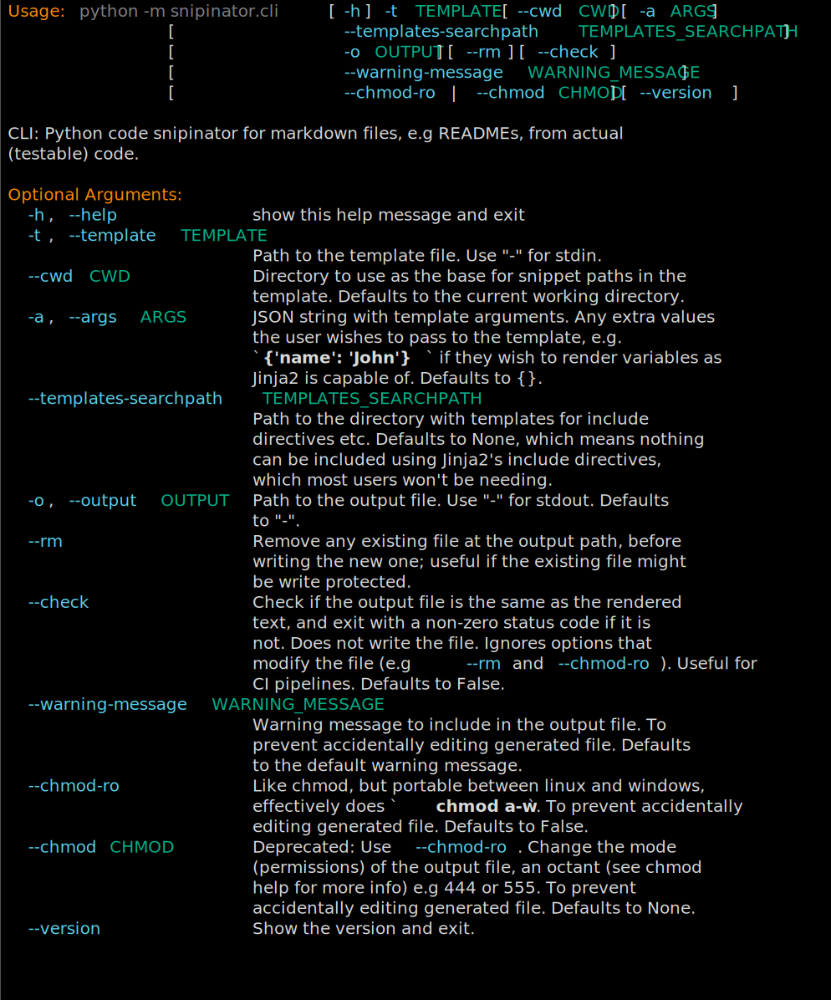
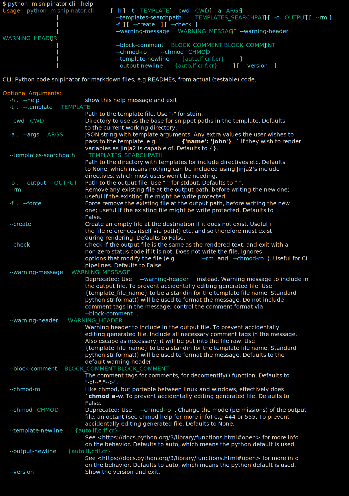

<!--

WARNING: This file is auto-generated by snipinator. Do not edit directly.
SOURCE: `snipinator/examples/LONG-EXAMPLE.md.jinja2`.

-->
# A README

If you are viewing a rendered version of this page, you probably want to see the
source code to see how it's done.

## pysnippet: global class

````py
class MyClass:
  """This is a global class"""

  def __init__(self, name):
    self.name = name

  def MyClassMethod(self):
    """This is a method of MyClass"""
    print(self.name)
````

## pysnippet: global method

````py
async def GlobalMethod():
  """This is a global method"""
  print('Hello')
````

## pysnippet: class member method

````py
  def MyClassMethod(self):
    """This is a method of MyClass"""
    print(self.name)
````

## pysignature: class member method

Same thing but just the signature:

````py
  def MyClassMethod(self):
    """This is a method of MyClass"""
````

## snippet

<!--
-->
```py

  i = 5
  print(i)

```
<!--
-->

## self referencing path

<!--
snipinator/examples/LONG-EXAMPLE.generated.md
-->

## shell, no terminal colors

````console
$ python -m snipinator.cli --help
Usage: python -m snipinator.cli [-h] -t TEMPLATE [--cwd CWD] [-a ARGS]
                                [--templates-searchpath TEMPLATES_SEARCHPATH]
                                [--output-base-path OUTPUT_BASE_PATH]
                                [--artifact-path ARTIFACT_PATH] [-o OUTPUT]
                                [--rm] [--move] [-f] [--create] [--check]
                                [--skip-unchanged]
                                [--warning-message WARNING_MESSAGE | --warning-header WARNING_HEADER]
                                [--block-comment BLOCK_COMMENT BLOCK_COMMENT]
                                [--chmod-ro | --chmod CHMOD]
                                [--make-backup {true,false,True,False,1,0} | --make-tmp-backup {true,false,True,False,1,0}]
                                [--template-newline {auto,lf,crlf,cr}]
                                [--output-newline {auto,lf,crlf,cr}]
                                [--version] [--verbose]

CLI: Python code snipinator for markdown files, e.g READMEs, from actual
(testable) code.

Optional Arguments:
  -h, --help            show this help message and exit
  -t, --template TEMPLATE
                        Path to the template file. Use "-" for stdin.
  --cwd CWD             Directory to use as the base for snippet paths in the
                        template. Defaults to the current working directory.
  -a, --args ARGS       JSON string with template arguments. Any extra values
                        the user wishes to pass to the template, e.g.
                        `{'name': 'John'}` if they wish to render variables as
                        Jinja2 is capable of. Defaults to {}.
  --templates-searchpath TEMPLATES_SEARCHPATH
                        Path to the directory with templates for include
                        directives etc. Defaults to None, which means nothing
                        can be included using Jinja2's include directives,
                        which most users won't be needing.
  --output-base-path OUTPUT_BASE_PATH
                        Base path the output file is relative to, used to
                        construct the relative paths in the README, that point
                        to the artifacts, e.g SVG files. If not specified,
                        -o/--output is used, unless it is '-', in which case
                        --cwd is used.
  --artifact-path ARTIFACT_PATH
                        Path to the directory with artifacts, e.g svg files
                        that are written out. If not specified, -t/--template
                        is used, unless it is '-', in which case --cwd is
                        used.
  -o, --output OUTPUT   Path to the output file. Use "-" for stdout. Defaults
                        to "-".
  --rm                  Remove any existing file at the output path, before
                        writing the new one; useful if the existing file might
                        be write protected.
  --move                Write output to a temporary location, then use
                        filesystem move operation to write it to the
                        destination.
  -f, --force           Combined with --rm, --force removes the existing file
                        at the output path, before writing the new one; useful
                        if the existing file might be write protected.
                        Defaults to False.
  --create              Create an empty file at the destination if it does not
                        exist. Useful if the file references itself via path()
                        etc. and so therefore must exist during rendering.
                        Defaults to False.
  --check               Check if the output file is the same as the rendered
                        text, and exit with a non-zero status code if it is
                        not. Does not write the file. Ignores options that
                        modify the file (e.g --rm and --chmod-ro). Useful for
                        CI pipelines. Defaults to False.
  --skip-unchanged      Skip modifying the file if the rendered text is the
                        same as the existing file.
  --warning-message WARNING_MESSAGE
                        Deprecated: Use --warning-header instead. Warning
                        message to include in the output file. To prevent
                        accidentally editing generated file. Use
                        {template_file_name} to be a standin for the template
                        file name. Standard python str.format() will be used
                        to format the message. Do not include comment tags in
                        the message; control the comment format via
                        --block-comment.
  --warning-header WARNING_HEADER
                        Warning header to include in the output file. To
                        prevent accidentally editing generated file. Include
                        all necessary comment tags in the message. Also escape
                        as necessary; it will be put into the file raw. Use
                        {template_file_name} to be a standin for the template
                        file name. Standard python str.format() will be used
                        to format the message. Defaults to the default warning
                        header.
  --block-comment BLOCK_COMMENT BLOCK_COMMENT
                        The comment tags for comments, for decomentify()
                        function. Defaults to "<!--","-->".
  --chmod-ro            Like chmod, but portable between linux and windows,
                        effectively does `chmod a-w`. To prevent accidentally
                        editing generated file. Defaults to False.
  --chmod CHMOD         Deprecated: Use --chmod-ro. Change the mode
                        (permissions) of the output file, an octant (see chmod
                        help for more info) e.g 444 or 555. To prevent
                        accidentally editing generated file. Defaults to None.
  --make-backup {true,false,True,False,1,0}
                        Make a backup of the output file before writing the
                        new one. Defaults to False.
  --make-tmp-backup {true,false,True,False,1,0}
                        Make a temporary backup of the output file before
                        writing the new one. If snipiniator runs successfully,
                        the backup file will be deleted. Defaults to True if
                        --make-backup is set to False.
  --template-newline {auto,lf,crlf,cr}
                        See
                        <https://docs.python.org/3/library/functions.html#open
                        > for more info on the behavior. Defaults to auto,
                        which means the python default is used.
  --output-newline {auto,lf,crlf,cr}
                        See
                        <https://docs.python.org/3/library/functions.html#open
                        > for more info on the behavior. Defaults to auto,
                        which means the python default is used.
  --version             Show the version and exit.
  --verbose             Print more information.

````

## shell: terminal colors, img tag, external svg

<!--
--><!-- -->

## shell: terminal colors, img tag, external svg, no command in output

Here is a terminal snippet with terminal colors (img tag external svg), without
command included in the svg:

<!--
--><!-- -->

## shell: terminal colors, img tag, external svg, custom dimensions

Here is a terminal snippet with terminal colors (img tag external svg, custom
dimensions), _with_ command included in the svg:

<!--
--><!-- -->

## shell: terminal colors, img tag, svg data uri

**Warning: This breaks on GitHub.**

Here is a terminal snippet with terminal colors (img tag with svg data):

<!--
--><img src="data:image/svg+xml;base64,PD94bWwgdmVyc2lvbj0iMS4wIiA/Pgo8c3ZnIHhtbG5zPSJodHRwOi8vd3d3LnczLm9yZy8yMDAwL3N2ZyIgY2xhc3M9InJpY2gtdGVybWluYWwiIHZpZXdCb3g9IjAgMCA5OTQgMjkyOS4yIj4KPCEtLSBHZW5lcmF0ZWQgd2l0aCBSaWNoIHRleHR1YWxpemUuaW8gLS0+CjxyZWN0IHdpZHRoPSIxMDAlIiBoZWlnaHQ9IjEwMCUiIGZpbGw9InRyYW5zcGFyZW50Ii8+CjxzdHlsZT4KQGZvbnQtZmFjZSB7CmZvbnQtZmFtaWx5OiAmcXVvdDtGaXJhIENvZGUmcXVvdDs7CnNyYzogbG9jYWwoJnF1b3Q7RmlyYUNvZGUtUmVndWxhciZxdW90OyksCnVybCgmcXVvdDtodHRwczovL2NkbmpzLmNsb3VkZmxhcmUuY29tL2FqYXgvbGlicy9maXJhY29kZS82LjIuMC93b2ZmMi9GaXJhQ29kZS1SZWd1bGFyLndvZmYyJnF1b3Q7KSBmb3JtYXQoJnF1b3Q7d29mZjImcXVvdDspLAp1cmwoJnF1b3Q7aHR0cHM6Ly9jZG5qcy5jbG91ZGZsYXJlLmNvbS9hamF4L2xpYnMvZmlyYWNvZGUvNi4yLjAvd29mZi9GaXJhQ29kZS1SZWd1bGFyLndvZmYmcXVvdDspIGZvcm1hdCgmcXVvdDt3b2ZmJnF1b3Q7KTsKZm9udC1zdHlsZTogbm9ybWFsOwpmb250LXdlaWdodDogNDAwOwp9CkBmb250LWZhY2Ugewpmb250LWZhbWlseTogJnF1b3Q7RmlyYSBDb2RlJnF1b3Q7OwpzcmM6IGxvY2FsKCZxdW90O0ZpcmFDb2RlLUJvbGQmcXVvdDspLAp1cmwoJnF1b3Q7aHR0cHM6Ly9jZG5qcy5jbG91ZGZsYXJlLmNvbS9hamF4L2xpYnMvZmlyYWNvZGUvNi4yLjAvd29mZjIvRmlyYUNvZGUtQm9sZC53b2ZmMiZxdW90OykgZm9ybWF0KCZxdW90O3dvZmYyJnF1b3Q7KSwKdXJsKCZxdW90O2h0dHBzOi8vY2RuanMuY2xvdWRmbGFyZS5jb20vYWpheC9saWJzL2ZpcmFjb2RlLzYuMi4wL3dvZmYvRmlyYUNvZGUtQm9sZC53b2ZmJnF1b3Q7KSBmb3JtYXQoJnF1b3Q7d29mZiZxdW90Oyk7CmZvbnQtc3R5bGU6IGJvbGQ7CmZvbnQtd2VpZ2h0OiA3MDA7Cn0KLnRlcm1pbmFsLTE4ODY4NzEzNzUtbWF0cml4IHsKZm9udC1mYW1pbHk6IEZpcmEgQ29kZSwgbW9ub3NwYWNlOwpmb250LXNpemU6IDIwcHg7CmxpbmUtaGVpZ2h0OiAyNC40cHg7CmZvbnQtdmFyaWFudC1lYXN0LWFzaWFuOiBmdWxsLXdpZHRoOwp9Ci50ZXJtaW5hbC0xODg2ODcxMzc1LXRpdGxlIHsKZm9udC1zaXplOiAxOHB4Owpmb250LXdlaWdodDogYm9sZDsKZm9udC1mYW1pbHk6IGFyaWFsOwp9Ci50ZXJtaW5hbC0xODg2ODcxMzc1LXIxIHsgZmlsbDogI2Q5ZDlkOSB9Ci50ZXJtaW5hbC0xODg2ODcxMzc1LXIyIHsgZmlsbDogI2ZmODcwMCB9Ci50ZXJtaW5hbC0xODg2ODcxMzc1LXIzIHsgZmlsbDogIzgwODA4MCB9Ci50ZXJtaW5hbC0xODg2ODcxMzc1LXI0IHsgZmlsbDogIzU4ZDFlYiB9Ci50ZXJtaW5hbC0xODg2ODcxMzc1LXI1IHsgZmlsbDogIzAwYWY4NyB9Ci50ZXJtaW5hbC0xODg2ODcxMzc1LXI2IHsgZmlsbDogI2Q5ZDlkOTtmb250LXdlaWdodDogYm9sZCB9Cjwvc3R5bGU+CjxkZWZzPgo8Y2xpcFBhdGggaWQ9InRlcm1pbmFsLTE4ODY4NzEzNzUtY2xpcC10ZXJtaW5hbCI+CjxyZWN0IHg9IjAiIHk9IjAiIHdpZHRoPSI5NzUuMCIgaGVpZ2h0PSIyODc4LjIiLz4KPC9jbGlwUGF0aD4KPGNsaXBQYXRoIGlkPSJ0ZXJtaW5hbC0xODg2ODcxMzc1LWxpbmUtMCI+CjxyZWN0IHg9IjAiIHk9IjEuNSIgd2lkdGg9Ijk3NiIgaGVpZ2h0PSIyNC42NSIvPgo8L2NsaXBQYXRoPgo8Y2xpcFBhdGggaWQ9InRlcm1pbmFsLTE4ODY4NzEzNzUtbGluZS0xIj4KPHJlY3QgeD0iMCIgeT0iMjUuOSIgd2lkdGg9Ijk3NiIgaGVpZ2h0PSIyNC42NSIvPgo8L2NsaXBQYXRoPgo8Y2xpcFBhdGggaWQ9InRlcm1pbmFsLTE4ODY4NzEzNzUtbGluZS0yIj4KPHJlY3QgeD0iMCIgeT0iNTAuMyIgd2lkdGg9Ijk3NiIgaGVpZ2h0PSIyNC42NSIvPgo8L2NsaXBQYXRoPgo8Y2xpcFBhdGggaWQ9InRlcm1pbmFsLTE4ODY4NzEzNzUtbGluZS0zIj4KPHJlY3QgeD0iMCIgeT0iNzQuNyIgd2lkdGg9Ijk3NiIgaGVpZ2h0PSIyNC42NSIvPgo8L2NsaXBQYXRoPgo8Y2xpcFBhdGggaWQ9InRlcm1pbmFsLTE4ODY4NzEzNzUtbGluZS00Ij4KPHJlY3QgeD0iMCIgeT0iOTkuMSIgd2lkdGg9Ijk3NiIgaGVpZ2h0PSIyNC42NSIvPgo8L2NsaXBQYXRoPgo8Y2xpcFBhdGggaWQ9InRlcm1pbmFsLTE4ODY4NzEzNzUtbGluZS01Ij4KPHJlY3QgeD0iMCIgeT0iMTIzLjUiIHdpZHRoPSI5NzYiIGhlaWdodD0iMjQuNjUiLz4KPC9jbGlwUGF0aD4KPGNsaXBQYXRoIGlkPSJ0ZXJtaW5hbC0xODg2ODcxMzc1LWxpbmUtNiI+CjxyZWN0IHg9IjAiIHk9IjE0Ny45IiB3aWR0aD0iOTc2IiBoZWlnaHQ9IjI0LjY1Ii8+CjwvY2xpcFBhdGg+CjxjbGlwUGF0aCBpZD0idGVybWluYWwtMTg4Njg3MTM3NS1saW5lLTciPgo8cmVjdCB4PSIwIiB5PSIxNzIuMyIgd2lkdGg9Ijk3NiIgaGVpZ2h0PSIyNC42NSIvPgo8L2NsaXBQYXRoPgo8Y2xpcFBhdGggaWQ9InRlcm1pbmFsLTE4ODY4NzEzNzUtbGluZS04Ij4KPHJlY3QgeD0iMCIgeT0iMTk2LjciIHdpZHRoPSI5NzYiIGhlaWdodD0iMjQuNjUiLz4KPC9jbGlwUGF0aD4KPGNsaXBQYXRoIGlkPSJ0ZXJtaW5hbC0xODg2ODcxMzc1LWxpbmUtOSI+CjxyZWN0IHg9IjAiIHk9IjIyMS4xIiB3aWR0aD0iOTc2IiBoZWlnaHQ9IjI0LjY1Ii8+CjwvY2xpcFBhdGg+CjxjbGlwUGF0aCBpZD0idGVybWluYWwtMTg4Njg3MTM3NS1saW5lLTEwIj4KPHJlY3QgeD0iMCIgeT0iMjQ1LjUiIHdpZHRoPSI5NzYiIGhlaWdodD0iMjQuNjUiLz4KPC9jbGlwUGF0aD4KPGNsaXBQYXRoIGlkPSJ0ZXJtaW5hbC0xODg2ODcxMzc1LWxpbmUtMTEiPgo8cmVjdCB4PSIwIiB5PSIyNjkuOSIgd2lkdGg9Ijk3NiIgaGVpZ2h0PSIyNC42NSIvPgo8L2NsaXBQYXRoPgo8Y2xpcFBhdGggaWQ9InRlcm1pbmFsLTE4ODY4NzEzNzUtbGluZS0xMiI+CjxyZWN0IHg9IjAiIHk9IjI5NC4zIiB3aWR0aD0iOTc2IiBoZWlnaHQ9IjI0LjY1Ii8+CjwvY2xpcFBhdGg+CjxjbGlwUGF0aCBpZD0idGVybWluYWwtMTg4Njg3MTM3NS1saW5lLTEzIj4KPHJlY3QgeD0iMCIgeT0iMzE4LjciIHdpZHRoPSI5NzYiIGhlaWdodD0iMjQuNjUiLz4KPC9jbGlwUGF0aD4KPGNsaXBQYXRoIGlkPSJ0ZXJtaW5hbC0xODg2ODcxMzc1LWxpbmUtMTQiPgo8cmVjdCB4PSIwIiB5PSIzNDMuMSIgd2lkdGg9Ijk3NiIgaGVpZ2h0PSIyNC42NSIvPgo8L2NsaXBQYXRoPgo8Y2xpcFBhdGggaWQ9InRlcm1pbmFsLTE4ODY4NzEzNzUtbGluZS0xNSI+CjxyZWN0IHg9IjAiIHk9IjM2Ny41IiB3aWR0aD0iOTc2IiBoZWlnaHQ9IjI0LjY1Ii8+CjwvY2xpcFBhdGg+CjxjbGlwUGF0aCBpZD0idGVybWluYWwtMTg4Njg3MTM3NS1saW5lLTE2Ij4KPHJlY3QgeD0iMCIgeT0iMzkxLjkiIHdpZHRoPSI5NzYiIGhlaWdodD0iMjQuNjUiLz4KPC9jbGlwUGF0aD4KPGNsaXBQYXRoIGlkPSJ0ZXJtaW5hbC0xODg2ODcxMzc1LWxpbmUtMTciPgo8cmVjdCB4PSIwIiB5PSI0MTYuMyIgd2lkdGg9Ijk3NiIgaGVpZ2h0PSIyNC42NSIvPgo8L2NsaXBQYXRoPgo8Y2xpcFBhdGggaWQ9InRlcm1pbmFsLTE4ODY4NzEzNzUtbGluZS0xOCI+CjxyZWN0IHg9IjAiIHk9IjQ0MC43IiB3aWR0aD0iOTc2IiBoZWlnaHQ9IjI0LjY1Ii8+CjwvY2xpcFBhdGg+CjxjbGlwUGF0aCBpZD0idGVybWluYWwtMTg4Njg3MTM3NS1saW5lLTE5Ij4KPHJlY3QgeD0iMCIgeT0iNDY1LjEiIHdpZHRoPSI5NzYiIGhlaWdodD0iMjQuNjUiLz4KPC9jbGlwUGF0aD4KPGNsaXBQYXRoIGlkPSJ0ZXJtaW5hbC0xODg2ODcxMzc1LWxpbmUtMjAiPgo8cmVjdCB4PSIwIiB5PSI0ODkuNSIgd2lkdGg9Ijk3NiIgaGVpZ2h0PSIyNC42NSIvPgo8L2NsaXBQYXRoPgo8Y2xpcFBhdGggaWQ9InRlcm1pbmFsLTE4ODY4NzEzNzUtbGluZS0yMSI+CjxyZWN0IHg9IjAiIHk9IjUxMy45IiB3aWR0aD0iOTc2IiBoZWlnaHQ9IjI0LjY1Ii8+CjwvY2xpcFBhdGg+CjxjbGlwUGF0aCBpZD0idGVybWluYWwtMTg4Njg3MTM3NS1saW5lLTIyIj4KPHJlY3QgeD0iMCIgeT0iNTM4LjMiIHdpZHRoPSI5NzYiIGhlaWdodD0iMjQuNjUiLz4KPC9jbGlwUGF0aD4KPGNsaXBQYXRoIGlkPSJ0ZXJtaW5hbC0xODg2ODcxMzc1LWxpbmUtMjMiPgo8cmVjdCB4PSIwIiB5PSI1NjIuNyIgd2lkdGg9Ijk3NiIgaGVpZ2h0PSIyNC42NSIvPgo8L2NsaXBQYXRoPgo8Y2xpcFBhdGggaWQ9InRlcm1pbmFsLTE4ODY4NzEzNzUtbGluZS0yNCI+CjxyZWN0IHg9IjAiIHk9IjU4Ny4xIiB3aWR0aD0iOTc2IiBoZWlnaHQ9IjI0LjY1Ii8+CjwvY2xpcFBhdGg+CjxjbGlwUGF0aCBpZD0idGVybWluYWwtMTg4Njg3MTM3NS1saW5lLTI1Ij4KPHJlY3QgeD0iMCIgeT0iNjExLjUiIHdpZHRoPSI5NzYiIGhlaWdodD0iMjQuNjUiLz4KPC9jbGlwUGF0aD4KPGNsaXBQYXRoIGlkPSJ0ZXJtaW5hbC0xODg2ODcxMzc1LWxpbmUtMjYiPgo8cmVjdCB4PSIwIiB5PSI2MzUuOSIgd2lkdGg9Ijk3NiIgaGVpZ2h0PSIyNC42NSIvPgo8L2NsaXBQYXRoPgo8Y2xpcFBhdGggaWQ9InRlcm1pbmFsLTE4ODY4NzEzNzUtbGluZS0yNyI+CjxyZWN0IHg9IjAiIHk9IjY2MC4zIiB3aWR0aD0iOTc2IiBoZWlnaHQ9IjI0LjY1Ii8+CjwvY2xpcFBhdGg+CjxjbGlwUGF0aCBpZD0idGVybWluYWwtMTg4Njg3MTM3NS1saW5lLTI4Ij4KPHJlY3QgeD0iMCIgeT0iNjg0LjciIHdpZHRoPSI5NzYiIGhlaWdodD0iMjQuNjUiLz4KPC9jbGlwUGF0aD4KPGNsaXBQYXRoIGlkPSJ0ZXJtaW5hbC0xODg2ODcxMzc1LWxpbmUtMjkiPgo8cmVjdCB4PSIwIiB5PSI3MDkuMSIgd2lkdGg9Ijk3NiIgaGVpZ2h0PSIyNC42NSIvPgo8L2NsaXBQYXRoPgo8Y2xpcFBhdGggaWQ9InRlcm1pbmFsLTE4ODY4NzEzNzUtbGluZS0zMCI+CjxyZWN0IHg9IjAiIHk9IjczMy41IiB3aWR0aD0iOTc2IiBoZWlnaHQ9IjI0LjY1Ii8+CjwvY2xpcFBhdGg+CjxjbGlwUGF0aCBpZD0idGVybWluYWwtMTg4Njg3MTM3NS1saW5lLTMxIj4KPHJlY3QgeD0iMCIgeT0iNzU3LjkiIHdpZHRoPSI5NzYiIGhlaWdodD0iMjQuNjUiLz4KPC9jbGlwUGF0aD4KPGNsaXBQYXRoIGlkPSJ0ZXJtaW5hbC0xODg2ODcxMzc1LWxpbmUtMzIiPgo8cmVjdCB4PSIwIiB5PSI3ODIuMyIgd2lkdGg9Ijk3NiIgaGVpZ2h0PSIyNC42NSIvPgo8L2NsaXBQYXRoPgo8Y2xpcFBhdGggaWQ9InRlcm1pbmFsLTE4ODY4NzEzNzUtbGluZS0zMyI+CjxyZWN0IHg9IjAiIHk9IjgwNi43IiB3aWR0aD0iOTc2IiBoZWlnaHQ9IjI0LjY1Ii8+CjwvY2xpcFBhdGg+CjxjbGlwUGF0aCBpZD0idGVybWluYWwtMTg4Njg3MTM3NS1saW5lLTM0Ij4KPHJlY3QgeD0iMCIgeT0iODMxLjEiIHdpZHRoPSI5NzYiIGhlaWdodD0iMjQuNjUiLz4KPC9jbGlwUGF0aD4KPGNsaXBQYXRoIGlkPSJ0ZXJtaW5hbC0xODg2ODcxMzc1LWxpbmUtMzUiPgo8cmVjdCB4PSIwIiB5PSI4NTUuNSIgd2lkdGg9Ijk3NiIgaGVpZ2h0PSIyNC42NSIvPgo8L2NsaXBQYXRoPgo8Y2xpcFBhdGggaWQ9InRlcm1pbmFsLTE4ODY4NzEzNzUtbGluZS0zNiI+CjxyZWN0IHg9IjAiIHk9Ijg3OS45IiB3aWR0aD0iOTc2IiBoZWlnaHQ9IjI0LjY1Ii8+CjwvY2xpcFBhdGg+CjxjbGlwUGF0aCBpZD0idGVybWluYWwtMTg4Njg3MTM3NS1saW5lLTM3Ij4KPHJlY3QgeD0iMCIgeT0iOTA0LjMiIHdpZHRoPSI5NzYiIGhlaWdodD0iMjQuNjUiLz4KPC9jbGlwUGF0aD4KPGNsaXBQYXRoIGlkPSJ0ZXJtaW5hbC0xODg2ODcxMzc1LWxpbmUtMzgiPgo8cmVjdCB4PSIwIiB5PSI5MjguNyIgd2lkdGg9Ijk3NiIgaGVpZ2h0PSIyNC42NSIvPgo8L2NsaXBQYXRoPgo8Y2xpcFBhdGggaWQ9InRlcm1pbmFsLTE4ODY4NzEzNzUtbGluZS0zOSI+CjxyZWN0IHg9IjAiIHk9Ijk1My4xIiB3aWR0aD0iOTc2IiBoZWlnaHQ9IjI0LjY1Ii8+CjwvY2xpcFBhdGg+CjxjbGlwUGF0aCBpZD0idGVybWluYWwtMTg4Njg3MTM3NS1saW5lLTQwIj4KPHJlY3QgeD0iMCIgeT0iOTc3LjUiIHdpZHRoPSI5NzYiIGhlaWdodD0iMjQuNjUiLz4KPC9jbGlwUGF0aD4KPGNsaXBQYXRoIGlkPSJ0ZXJtaW5hbC0xODg2ODcxMzc1LWxpbmUtNDEiPgo8cmVjdCB4PSIwIiB5PSIxMDAxLjkiIHdpZHRoPSI5NzYiIGhlaWdodD0iMjQuNjUiLz4KPC9jbGlwUGF0aD4KPGNsaXBQYXRoIGlkPSJ0ZXJtaW5hbC0xODg2ODcxMzc1LWxpbmUtNDIiPgo8cmVjdCB4PSIwIiB5PSIxMDI2LjMiIHdpZHRoPSI5NzYiIGhlaWdodD0iMjQuNjUiLz4KPC9jbGlwUGF0aD4KPGNsaXBQYXRoIGlkPSJ0ZXJtaW5hbC0xODg2ODcxMzc1LWxpbmUtNDMiPgo8cmVjdCB4PSIwIiB5PSIxMDUwLjciIHdpZHRoPSI5NzYiIGhlaWdodD0iMjQuNjUiLz4KPC9jbGlwUGF0aD4KPGNsaXBQYXRoIGlkPSJ0ZXJtaW5hbC0xODg2ODcxMzc1LWxpbmUtNDQiPgo8cmVjdCB4PSIwIiB5PSIxMDc1LjEiIHdpZHRoPSI5NzYiIGhlaWdodD0iMjQuNjUiLz4KPC9jbGlwUGF0aD4KPGNsaXBQYXRoIGlkPSJ0ZXJtaW5hbC0xODg2ODcxMzc1LWxpbmUtNDUiPgo8cmVjdCB4PSIwIiB5PSIxMDk5LjUiIHdpZHRoPSI5NzYiIGhlaWdodD0iMjQuNjUiLz4KPC9jbGlwUGF0aD4KPGNsaXBQYXRoIGlkPSJ0ZXJtaW5hbC0xODg2ODcxMzc1LWxpbmUtNDYiPgo8cmVjdCB4PSIwIiB5PSIxMTIzLjkiIHdpZHRoPSI5NzYiIGhlaWdodD0iMjQuNjUiLz4KPC9jbGlwUGF0aD4KPGNsaXBQYXRoIGlkPSJ0ZXJtaW5hbC0xODg2ODcxMzc1LWxpbmUtNDciPgo8cmVjdCB4PSIwIiB5PSIxMTQ4LjMiIHdpZHRoPSI5NzYiIGhlaWdodD0iMjQuNjUiLz4KPC9jbGlwUGF0aD4KPGNsaXBQYXRoIGlkPSJ0ZXJtaW5hbC0xODg2ODcxMzc1LWxpbmUtNDgiPgo8cmVjdCB4PSIwIiB5PSIxMTcyLjciIHdpZHRoPSI5NzYiIGhlaWdodD0iMjQuNjUiLz4KPC9jbGlwUGF0aD4KPGNsaXBQYXRoIGlkPSJ0ZXJtaW5hbC0xODg2ODcxMzc1LWxpbmUtNDkiPgo8cmVjdCB4PSIwIiB5PSIxMTk3LjEiIHdpZHRoPSI5NzYiIGhlaWdodD0iMjQuNjUiLz4KPC9jbGlwUGF0aD4KPGNsaXBQYXRoIGlkPSJ0ZXJtaW5hbC0xODg2ODcxMzc1LWxpbmUtNTAiPgo8cmVjdCB4PSIwIiB5PSIxMjIxLjUiIHdpZHRoPSI5NzYiIGhlaWdodD0iMjQuNjUiLz4KPC9jbGlwUGF0aD4KPGNsaXBQYXRoIGlkPSJ0ZXJtaW5hbC0xODg2ODcxMzc1LWxpbmUtNTEiPgo8cmVjdCB4PSIwIiB5PSIxMjQ1LjkiIHdpZHRoPSI5NzYiIGhlaWdodD0iMjQuNjUiLz4KPC9jbGlwUGF0aD4KPGNsaXBQYXRoIGlkPSJ0ZXJtaW5hbC0xODg2ODcxMzc1LWxpbmUtNTIiPgo8cmVjdCB4PSIwIiB5PSIxMjcwLjMiIHdpZHRoPSI5NzYiIGhlaWdodD0iMjQuNjUiLz4KPC9jbGlwUGF0aD4KPGNsaXBQYXRoIGlkPSJ0ZXJtaW5hbC0xODg2ODcxMzc1LWxpbmUtNTMiPgo8cmVjdCB4PSIwIiB5PSIxMjk0LjciIHdpZHRoPSI5NzYiIGhlaWdodD0iMjQuNjUiLz4KPC9jbGlwUGF0aD4KPGNsaXBQYXRoIGlkPSJ0ZXJtaW5hbC0xODg2ODcxMzc1LWxpbmUtNTQiPgo8cmVjdCB4PSIwIiB5PSIxMzE5LjEiIHdpZHRoPSI5NzYiIGhlaWdodD0iMjQuNjUiLz4KPC9jbGlwUGF0aD4KPGNsaXBQYXRoIGlkPSJ0ZXJtaW5hbC0xODg2ODcxMzc1LWxpbmUtNTUiPgo8cmVjdCB4PSIwIiB5PSIxMzQzLjUiIHdpZHRoPSI5NzYiIGhlaWdodD0iMjQuNjUiLz4KPC9jbGlwUGF0aD4KPGNsaXBQYXRoIGlkPSJ0ZXJtaW5hbC0xODg2ODcxMzc1LWxpbmUtNTYiPgo8cmVjdCB4PSIwIiB5PSIxMzY3LjkiIHdpZHRoPSI5NzYiIGhlaWdodD0iMjQuNjUiLz4KPC9jbGlwUGF0aD4KPGNsaXBQYXRoIGlkPSJ0ZXJtaW5hbC0xODg2ODcxMzc1LWxpbmUtNTciPgo8cmVjdCB4PSIwIiB5PSIxMzkyLjMiIHdpZHRoPSI5NzYiIGhlaWdodD0iMjQuNjUiLz4KPC9jbGlwUGF0aD4KPGNsaXBQYXRoIGlkPSJ0ZXJtaW5hbC0xODg2ODcxMzc1LWxpbmUtNTgiPgo8cmVjdCB4PSIwIiB5PSIxNDE2LjciIHdpZHRoPSI5NzYiIGhlaWdodD0iMjQuNjUiLz4KPC9jbGlwUGF0aD4KPGNsaXBQYXRoIGlkPSJ0ZXJtaW5hbC0xODg2ODcxMzc1LWxpbmUtNTkiPgo8cmVjdCB4PSIwIiB5PSIxNDQxLjEiIHdpZHRoPSI5NzYiIGhlaWdodD0iMjQuNjUiLz4KPC9jbGlwUGF0aD4KPGNsaXBQYXRoIGlkPSJ0ZXJtaW5hbC0xODg2ODcxMzc1LWxpbmUtNjAiPgo8cmVjdCB4PSIwIiB5PSIxNDY1LjUiIHdpZHRoPSI5NzYiIGhlaWdodD0iMjQuNjUiLz4KPC9jbGlwUGF0aD4KPGNsaXBQYXRoIGlkPSJ0ZXJtaW5hbC0xODg2ODcxMzc1LWxpbmUtNjEiPgo8cmVjdCB4PSIwIiB5PSIxNDg5LjkiIHdpZHRoPSI5NzYiIGhlaWdodD0iMjQuNjUiLz4KPC9jbGlwUGF0aD4KPGNsaXBQYXRoIGlkPSJ0ZXJtaW5hbC0xODg2ODcxMzc1LWxpbmUtNjIiPgo8cmVjdCB4PSIwIiB5PSIxNTE0LjMiIHdpZHRoPSI5NzYiIGhlaWdodD0iMjQuNjUiLz4KPC9jbGlwUGF0aD4KPGNsaXBQYXRoIGlkPSJ0ZXJtaW5hbC0xODg2ODcxMzc1LWxpbmUtNjMiPgo8cmVjdCB4PSIwIiB5PSIxNTM4LjciIHdpZHRoPSI5NzYiIGhlaWdodD0iMjQuNjUiLz4KPC9jbGlwUGF0aD4KPGNsaXBQYXRoIGlkPSJ0ZXJtaW5hbC0xODg2ODcxMzc1LWxpbmUtNjQiPgo8cmVjdCB4PSIwIiB5PSIxNTYzLjEiIHdpZHRoPSI5NzYiIGhlaWdodD0iMjQuNjUiLz4KPC9jbGlwUGF0aD4KPGNsaXBQYXRoIGlkPSJ0ZXJtaW5hbC0xODg2ODcxMzc1LWxpbmUtNjUiPgo8cmVjdCB4PSIwIiB5PSIxNTg3LjUiIHdpZHRoPSI5NzYiIGhlaWdodD0iMjQuNjUiLz4KPC9jbGlwUGF0aD4KPGNsaXBQYXRoIGlkPSJ0ZXJtaW5hbC0xODg2ODcxMzc1LWxpbmUtNjYiPgo8cmVjdCB4PSIwIiB5PSIxNjExLjkiIHdpZHRoPSI5NzYiIGhlaWdodD0iMjQuNjUiLz4KPC9jbGlwUGF0aD4KPGNsaXBQYXRoIGlkPSJ0ZXJtaW5hbC0xODg2ODcxMzc1LWxpbmUtNjciPgo8cmVjdCB4PSIwIiB5PSIxNjM2LjMiIHdpZHRoPSI5NzYiIGhlaWdodD0iMjQuNjUiLz4KPC9jbGlwUGF0aD4KPGNsaXBQYXRoIGlkPSJ0ZXJtaW5hbC0xODg2ODcxMzc1LWxpbmUtNjgiPgo8cmVjdCB4PSIwIiB5PSIxNjYwLjciIHdpZHRoPSI5NzYiIGhlaWdodD0iMjQuNjUiLz4KPC9jbGlwUGF0aD4KPGNsaXBQYXRoIGlkPSJ0ZXJtaW5hbC0xODg2ODcxMzc1LWxpbmUtNjkiPgo8cmVjdCB4PSIwIiB5PSIxNjg1LjEiIHdpZHRoPSI5NzYiIGhlaWdodD0iMjQuNjUiLz4KPC9jbGlwUGF0aD4KPGNsaXBQYXRoIGlkPSJ0ZXJtaW5hbC0xODg2ODcxMzc1LWxpbmUtNzAiPgo8cmVjdCB4PSIwIiB5PSIxNzA5LjUiIHdpZHRoPSI5NzYiIGhlaWdodD0iMjQuNjUiLz4KPC9jbGlwUGF0aD4KPGNsaXBQYXRoIGlkPSJ0ZXJtaW5hbC0xODg2ODcxMzc1LWxpbmUtNzEiPgo8cmVjdCB4PSIwIiB5PSIxNzMzLjkiIHdpZHRoPSI5NzYiIGhlaWdodD0iMjQuNjUiLz4KPC9jbGlwUGF0aD4KPGNsaXBQYXRoIGlkPSJ0ZXJtaW5hbC0xODg2ODcxMzc1LWxpbmUtNzIiPgo8cmVjdCB4PSIwIiB5PSIxNzU4LjMiIHdpZHRoPSI5NzYiIGhlaWdodD0iMjQuNjUiLz4KPC9jbGlwUGF0aD4KPGNsaXBQYXRoIGlkPSJ0ZXJtaW5hbC0xODg2ODcxMzc1LWxpbmUtNzMiPgo8cmVjdCB4PSIwIiB5PSIxNzgyLjciIHdpZHRoPSI5NzYiIGhlaWdodD0iMjQuNjUiLz4KPC9jbGlwUGF0aD4KPGNsaXBQYXRoIGlkPSJ0ZXJtaW5hbC0xODg2ODcxMzc1LWxpbmUtNzQiPgo8cmVjdCB4PSIwIiB5PSIxODA3LjEiIHdpZHRoPSI5NzYiIGhlaWdodD0iMjQuNjUiLz4KPC9jbGlwUGF0aD4KPGNsaXBQYXRoIGlkPSJ0ZXJtaW5hbC0xODg2ODcxMzc1LWxpbmUtNzUiPgo8cmVjdCB4PSIwIiB5PSIxODMxLjUiIHdpZHRoPSI5NzYiIGhlaWdodD0iMjQuNjUiLz4KPC9jbGlwUGF0aD4KPGNsaXBQYXRoIGlkPSJ0ZXJtaW5hbC0xODg2ODcxMzc1LWxpbmUtNzYiPgo8cmVjdCB4PSIwIiB5PSIxODU1LjkiIHdpZHRoPSI5NzYiIGhlaWdodD0iMjQuNjUiLz4KPC9jbGlwUGF0aD4KPGNsaXBQYXRoIGlkPSJ0ZXJtaW5hbC0xODg2ODcxMzc1LWxpbmUtNzciPgo8cmVjdCB4PSIwIiB5PSIxODgwLjMiIHdpZHRoPSI5NzYiIGhlaWdodD0iMjQuNjUiLz4KPC9jbGlwUGF0aD4KPGNsaXBQYXRoIGlkPSJ0ZXJtaW5hbC0xODg2ODcxMzc1LWxpbmUtNzgiPgo8cmVjdCB4PSIwIiB5PSIxOTA0LjciIHdpZHRoPSI5NzYiIGhlaWdodD0iMjQuNjUiLz4KPC9jbGlwUGF0aD4KPGNsaXBQYXRoIGlkPSJ0ZXJtaW5hbC0xODg2ODcxMzc1LWxpbmUtNzkiPgo8cmVjdCB4PSIwIiB5PSIxOTI5LjEiIHdpZHRoPSI5NzYiIGhlaWdodD0iMjQuNjUiLz4KPC9jbGlwUGF0aD4KPGNsaXBQYXRoIGlkPSJ0ZXJtaW5hbC0xODg2ODcxMzc1LWxpbmUtODAiPgo8cmVjdCB4PSIwIiB5PSIxOTUzLjUiIHdpZHRoPSI5NzYiIGhlaWdodD0iMjQuNjUiLz4KPC9jbGlwUGF0aD4KPGNsaXBQYXRoIGlkPSJ0ZXJtaW5hbC0xODg2ODcxMzc1LWxpbmUtODEiPgo8cmVjdCB4PSIwIiB5PSIxOTc3LjkiIHdpZHRoPSI5NzYiIGhlaWdodD0iMjQuNjUiLz4KPC9jbGlwUGF0aD4KPGNsaXBQYXRoIGlkPSJ0ZXJtaW5hbC0xODg2ODcxMzc1LWxpbmUtODIiPgo8cmVjdCB4PSIwIiB5PSIyMDAyLjMiIHdpZHRoPSI5NzYiIGhlaWdodD0iMjQuNjUiLz4KPC9jbGlwUGF0aD4KPGNsaXBQYXRoIGlkPSJ0ZXJtaW5hbC0xODg2ODcxMzc1LWxpbmUtODMiPgo8cmVjdCB4PSIwIiB5PSIyMDI2LjciIHdpZHRoPSI5NzYiIGhlaWdodD0iMjQuNjUiLz4KPC9jbGlwUGF0aD4KPGNsaXBQYXRoIGlkPSJ0ZXJtaW5hbC0xODg2ODcxMzc1LWxpbmUtODQiPgo8cmVjdCB4PSIwIiB5PSIyMDUxLjEiIHdpZHRoPSI5NzYiIGhlaWdodD0iMjQuNjUiLz4KPC9jbGlwUGF0aD4KPGNsaXBQYXRoIGlkPSJ0ZXJtaW5hbC0xODg2ODcxMzc1LWxpbmUtODUiPgo8cmVjdCB4PSIwIiB5PSIyMDc1LjUiIHdpZHRoPSI5NzYiIGhlaWdodD0iMjQuNjUiLz4KPC9jbGlwUGF0aD4KPGNsaXBQYXRoIGlkPSJ0ZXJtaW5hbC0xODg2ODcxMzc1LWxpbmUtODYiPgo8cmVjdCB4PSIwIiB5PSIyMDk5LjkiIHdpZHRoPSI5NzYiIGhlaWdodD0iMjQuNjUiLz4KPC9jbGlwUGF0aD4KPGNsaXBQYXRoIGlkPSJ0ZXJtaW5hbC0xODg2ODcxMzc1LWxpbmUtODciPgo8cmVjdCB4PSIwIiB5PSIyMTI0LjMiIHdpZHRoPSI5NzYiIGhlaWdodD0iMjQuNjUiLz4KPC9jbGlwUGF0aD4KPGNsaXBQYXRoIGlkPSJ0ZXJtaW5hbC0xODg2ODcxMzc1LWxpbmUtODgiPgo8cmVjdCB4PSIwIiB5PSIyMTQ4LjciIHdpZHRoPSI5NzYiIGhlaWdodD0iMjQuNjUiLz4KPC9jbGlwUGF0aD4KPGNsaXBQYXRoIGlkPSJ0ZXJtaW5hbC0xODg2ODcxMzc1LWxpbmUtODkiPgo8cmVjdCB4PSIwIiB5PSIyMTczLjEiIHdpZHRoPSI5NzYiIGhlaWdodD0iMjQuNjUiLz4KPC9jbGlwUGF0aD4KPGNsaXBQYXRoIGlkPSJ0ZXJtaW5hbC0xODg2ODcxMzc1LWxpbmUtOTAiPgo8cmVjdCB4PSIwIiB5PSIyMTk3LjUiIHdpZHRoPSI5NzYiIGhlaWdodD0iMjQuNjUiLz4KPC9jbGlwUGF0aD4KPGNsaXBQYXRoIGlkPSJ0ZXJtaW5hbC0xODg2ODcxMzc1LWxpbmUtOTEiPgo8cmVjdCB4PSIwIiB5PSIyMjIxLjkiIHdpZHRoPSI5NzYiIGhlaWdodD0iMjQuNjUiLz4KPC9jbGlwUGF0aD4KPGNsaXBQYXRoIGlkPSJ0ZXJtaW5hbC0xODg2ODcxMzc1LWxpbmUtOTIiPgo8cmVjdCB4PSIwIiB5PSIyMjQ2LjMiIHdpZHRoPSI5NzYiIGhlaWdodD0iMjQuNjUiLz4KPC9jbGlwUGF0aD4KPGNsaXBQYXRoIGlkPSJ0ZXJtaW5hbC0xODg2ODcxMzc1LWxpbmUtOTMiPgo8cmVjdCB4PSIwIiB5PSIyMjcwLjciIHdpZHRoPSI5NzYiIGhlaWdodD0iMjQuNjUiLz4KPC9jbGlwUGF0aD4KPGNsaXBQYXRoIGlkPSJ0ZXJtaW5hbC0xODg2ODcxMzc1LWxpbmUtOTQiPgo8cmVjdCB4PSIwIiB5PSIyMjk1LjEiIHdpZHRoPSI5NzYiIGhlaWdodD0iMjQuNjUiLz4KPC9jbGlwUGF0aD4KPGNsaXBQYXRoIGlkPSJ0ZXJtaW5hbC0xODg2ODcxMzc1LWxpbmUtOTUiPgo8cmVjdCB4PSIwIiB5PSIyMzE5LjUiIHdpZHRoPSI5NzYiIGhlaWdodD0iMjQuNjUiLz4KPC9jbGlwUGF0aD4KPGNsaXBQYXRoIGlkPSJ0ZXJtaW5hbC0xODg2ODcxMzc1LWxpbmUtOTYiPgo8cmVjdCB4PSIwIiB5PSIyMzQzLjkiIHdpZHRoPSI5NzYiIGhlaWdodD0iMjQuNjUiLz4KPC9jbGlwUGF0aD4KPGNsaXBQYXRoIGlkPSJ0ZXJtaW5hbC0xODg2ODcxMzc1LWxpbmUtOTciPgo8cmVjdCB4PSIwIiB5PSIyMzY4LjMiIHdpZHRoPSI5NzYiIGhlaWdodD0iMjQuNjUiLz4KPC9jbGlwUGF0aD4KPGNsaXBQYXRoIGlkPSJ0ZXJtaW5hbC0xODg2ODcxMzc1LWxpbmUtOTgiPgo8cmVjdCB4PSIwIiB5PSIyMzkyLjciIHdpZHRoPSI5NzYiIGhlaWdodD0iMjQuNjUiLz4KPC9jbGlwUGF0aD4KPGNsaXBQYXRoIGlkPSJ0ZXJtaW5hbC0xODg2ODcxMzc1LWxpbmUtOTkiPgo8cmVjdCB4PSIwIiB5PSIyNDE3LjEiIHdpZHRoPSI5NzYiIGhlaWdodD0iMjQuNjUiLz4KPC9jbGlwUGF0aD4KPGNsaXBQYXRoIGlkPSJ0ZXJtaW5hbC0xODg2ODcxMzc1LWxpbmUtMTAwIj4KPHJlY3QgeD0iMCIgeT0iMjQ0MS41IiB3aWR0aD0iOTc2IiBoZWlnaHQ9IjI0LjY1Ii8+CjwvY2xpcFBhdGg+CjxjbGlwUGF0aCBpZD0idGVybWluYWwtMTg4Njg3MTM3NS1saW5lLTEwMSI+CjxyZWN0IHg9IjAiIHk9IjI0NjUuOSIgd2lkdGg9Ijk3NiIgaGVpZ2h0PSIyNC42NSIvPgo8L2NsaXBQYXRoPgo8Y2xpcFBhdGggaWQ9InRlcm1pbmFsLTE4ODY4NzEzNzUtbGluZS0xMDIiPgo8cmVjdCB4PSIwIiB5PSIyNDkwLjMiIHdpZHRoPSI5NzYiIGhlaWdodD0iMjQuNjUiLz4KPC9jbGlwUGF0aD4KPGNsaXBQYXRoIGlkPSJ0ZXJtaW5hbC0xODg2ODcxMzc1LWxpbmUtMTAzIj4KPHJlY3QgeD0iMCIgeT0iMjUxNC43IiB3aWR0aD0iOTc2IiBoZWlnaHQ9IjI0LjY1Ii8+CjwvY2xpcFBhdGg+CjxjbGlwUGF0aCBpZD0idGVybWluYWwtMTg4Njg3MTM3NS1saW5lLTEwNCI+CjxyZWN0IHg9IjAiIHk9IjI1MzkuMSIgd2lkdGg9Ijk3NiIgaGVpZ2h0PSIyNC42NSIvPgo8L2NsaXBQYXRoPgo8Y2xpcFBhdGggaWQ9InRlcm1pbmFsLTE4ODY4NzEzNzUtbGluZS0xMDUiPgo8cmVjdCB4PSIwIiB5PSIyNTYzLjUiIHdpZHRoPSI5NzYiIGhlaWdodD0iMjQuNjUiLz4KPC9jbGlwUGF0aD4KPGNsaXBQYXRoIGlkPSJ0ZXJtaW5hbC0xODg2ODcxMzc1LWxpbmUtMTA2Ij4KPHJlY3QgeD0iMCIgeT0iMjU4Ny45IiB3aWR0aD0iOTc2IiBoZWlnaHQ9IjI0LjY1Ii8+CjwvY2xpcFBhdGg+CjxjbGlwUGF0aCBpZD0idGVybWluYWwtMTg4Njg3MTM3NS1saW5lLTEwNyI+CjxyZWN0IHg9IjAiIHk9IjI2MTIuMyIgd2lkdGg9Ijk3NiIgaGVpZ2h0PSIyNC42NSIvPgo8L2NsaXBQYXRoPgo8Y2xpcFBhdGggaWQ9InRlcm1pbmFsLTE4ODY4NzEzNzUtbGluZS0xMDgiPgo8cmVjdCB4PSIwIiB5PSIyNjM2LjciIHdpZHRoPSI5NzYiIGhlaWdodD0iMjQuNjUiLz4KPC9jbGlwUGF0aD4KPGNsaXBQYXRoIGlkPSJ0ZXJtaW5hbC0xODg2ODcxMzc1LWxpbmUtMTA5Ij4KPHJlY3QgeD0iMCIgeT0iMjY2MS4xIiB3aWR0aD0iOTc2IiBoZWlnaHQ9IjI0LjY1Ii8+CjwvY2xpcFBhdGg+CjxjbGlwUGF0aCBpZD0idGVybWluYWwtMTg4Njg3MTM3NS1saW5lLTExMCI+CjxyZWN0IHg9IjAiIHk9IjI2ODUuNSIgd2lkdGg9Ijk3NiIgaGVpZ2h0PSIyNC42NSIvPgo8L2NsaXBQYXRoPgo8Y2xpcFBhdGggaWQ9InRlcm1pbmFsLTE4ODY4NzEzNzUtbGluZS0xMTEiPgo8cmVjdCB4PSIwIiB5PSIyNzA5LjkiIHdpZHRoPSI5NzYiIGhlaWdodD0iMjQuNjUiLz4KPC9jbGlwUGF0aD4KPGNsaXBQYXRoIGlkPSJ0ZXJtaW5hbC0xODg2ODcxMzc1LWxpbmUtMTEyIj4KPHJlY3QgeD0iMCIgeT0iMjczNC4zIiB3aWR0aD0iOTc2IiBoZWlnaHQ9IjI0LjY1Ii8+CjwvY2xpcFBhdGg+CjxjbGlwUGF0aCBpZD0idGVybWluYWwtMTg4Njg3MTM3NS1saW5lLTExMyI+CjxyZWN0IHg9IjAiIHk9IjI3NTguNyIgd2lkdGg9Ijk3NiIgaGVpZ2h0PSIyNC42NSIvPgo8L2NsaXBQYXRoPgo8Y2xpcFBhdGggaWQ9InRlcm1pbmFsLTE4ODY4NzEzNzUtbGluZS0xMTQiPgo8cmVjdCB4PSIwIiB5PSIyNzgzLjEiIHdpZHRoPSI5NzYiIGhlaWdodD0iMjQuNjUiLz4KPC9jbGlwUGF0aD4KPGNsaXBQYXRoIGlkPSJ0ZXJtaW5hbC0xODg2ODcxMzc1LWxpbmUtMTE1Ij4KPHJlY3QgeD0iMCIgeT0iMjgwNy41IiB3aWR0aD0iOTc2IiBoZWlnaHQ9IjI0LjY1Ii8+CjwvY2xpcFBhdGg+CjxjbGlwUGF0aCBpZD0idGVybWluYWwtMTg4Njg3MTM3NS1saW5lLTExNiI+CjxyZWN0IHg9IjAiIHk9IjI4MzEuOSIgd2lkdGg9Ijk3NiIgaGVpZ2h0PSIyNC42NSIvPgo8L2NsaXBQYXRoPgo8L2RlZnM+CjxnIHRyYW5zZm9ybT0idHJhbnNsYXRlKDksIDApIj4KPGcgY2xhc3M9InRlcm1pbmFsLTE4ODY4NzEzNzUtbWF0cml4Ij4KPHRleHQgY2xhc3M9InRlcm1pbmFsLTE4ODY4NzEzNzUtcjEiIHg9IjAiIHk9IjIwIiB0ZXh0TGVuZ3RoPSI0MDIuNiIgY2xpcC1wYXRoPSJ1cmwoI3Rlcm1pbmFsLTE4ODY4NzEzNzUtbGluZS0wKSI+JMKgcHl0aG9uwqAtbcKgc25pcGluYXRvci5jbGnCoC0taGVscDwvdGV4dD4KPHRleHQgY2xhc3M9InRlcm1pbmFsLTE4ODY4NzEzNzUtcjEiIHg9Ijk3NiIgeT0iMjAiIHRleHRMZW5ndGg9IjEyLjIiIGNsaXAtcGF0aD0idXJsKCN0ZXJtaW5hbC0xODg2ODcxMzc1LWxpbmUtMCkiPgo8L3RleHQ+Cjx0ZXh0IGNsYXNzPSJ0ZXJtaW5hbC0xODg2ODcxMzc1LXIyIiB4PSIwIiB5PSI0NC40IiB0ZXh0TGVuZ3RoPSI3My4yIiBjbGlwLXBhdGg9InVybCgjdGVybWluYWwtMTg4Njg3MTM3NS1saW5lLTEpIj5Vc2FnZTo8L3RleHQ+Cjx0ZXh0IGNsYXNzPSJ0ZXJtaW5hbC0xODg2ODcxMzc1LXIzIiB4PSI4NS40IiB5PSI0NC40IiB0ZXh0TGVuZ3RoPSIyOTIuOCIgY2xpcC1wYXRoPSJ1cmwoI3Rlcm1pbmFsLTE4ODY4NzEzNzUtbGluZS0xKSI+cHl0aG9uwqAtbcKgc25pcGluYXRvci5jbGk8L3RleHQ+Cjx0ZXh0IGNsYXNzPSJ0ZXJtaW5hbC0xODg2ODcxMzc1LXIxIiB4PSIzNzguMiIgeT0iNDQuNCIgdGV4dExlbmd0aD0iMjQuNCIgY2xpcC1wYXRoPSJ1cmwoI3Rlcm1pbmFsLTE4ODY4NzEzNzUtbGluZS0xKSI+wqBbPC90ZXh0Pgo8dGV4dCBjbGFzcz0idGVybWluYWwtMTg4Njg3MTM3NS1yNCIgeD0iNDAyLjYiIHk9IjQ0LjQiIHRleHRMZW5ndGg9IjI0LjQiIGNsaXAtcGF0aD0idXJsKCN0ZXJtaW5hbC0xODg2ODcxMzc1LWxpbmUtMSkiPi1oPC90ZXh0Pgo8dGV4dCBjbGFzcz0idGVybWluYWwtMTg4Njg3MTM3NS1yMSIgeD0iNDI3IiB5PSI0NC40IiB0ZXh0TGVuZ3RoPSIyNC40IiBjbGlwLXBhdGg9InVybCgjdGVybWluYWwtMTg4Njg3MTM3NS1saW5lLTEpIj5dwqA8L3RleHQ+Cjx0ZXh0IGNsYXNzPSJ0ZXJtaW5hbC0xODg2ODcxMzc1LXI0IiB4PSI0NTEuNCIgeT0iNDQuNCIgdGV4dExlbmd0aD0iMjQuNCIgY2xpcC1wYXRoPSJ1cmwoI3Rlcm1pbmFsLTE4ODY4NzEzNzUtbGluZS0xKSI+LXQ8L3RleHQ+Cjx0ZXh0IGNsYXNzPSJ0ZXJtaW5hbC0xODg2ODcxMzc1LXI1IiB4PSI0ODgiIHk9IjQ0LjQiIHRleHRMZW5ndGg9Ijk3LjYiIGNsaXAtcGF0aD0idXJsKCN0ZXJtaW5hbC0xODg2ODcxMzc1LWxpbmUtMSkiPlRFTVBMQVRFPC90ZXh0Pgo8dGV4dCBjbGFzcz0idGVybWluYWwtMTg4Njg3MTM3NS1yMSIgeD0iNTg1LjYiIHk9IjQ0LjQiIHRleHRMZW5ndGg9IjI0LjQiIGNsaXAtcGF0aD0idXJsKCN0ZXJtaW5hbC0xODg2ODcxMzc1LWxpbmUtMSkiPsKgWzwvdGV4dD4KPHRleHQgY2xhc3M9InRlcm1pbmFsLTE4ODY4NzEzNzUtcjQiIHg9IjYxMCIgeT0iNDQuNCIgdGV4dExlbmd0aD0iNjEiIGNsaXAtcGF0aD0idXJsKCN0ZXJtaW5hbC0xODg2ODcxMzc1LWxpbmUtMSkiPi0tY3dkPC90ZXh0Pgo8dGV4dCBjbGFzcz0idGVybWluYWwtMTg4Njg3MTM3NS1yNSIgeD0iNjgzLjIiIHk9IjQ0LjQiIHRleHRMZW5ndGg9IjM2LjYiIGNsaXAtcGF0aD0idXJsKCN0ZXJtaW5hbC0xODg2ODcxMzc1LWxpbmUtMSkiPkNXRDwvdGV4dD4KPHRleHQgY2xhc3M9InRlcm1pbmFsLTE4ODY4NzEzNzUtcjEiIHg9IjcxOS44IiB5PSI0NC40IiB0ZXh0TGVuZ3RoPSIzNi42IiBjbGlwLXBhdGg9InVybCgjdGVybWluYWwtMTg4Njg3MTM3NS1saW5lLTEpIj5dwqBbPC90ZXh0Pgo8dGV4dCBjbGFzcz0idGVybWluYWwtMTg4Njg3MTM3NS1yNCIgeD0iNzU2LjQiIHk9IjQ0LjQiIHRleHRMZW5ndGg9IjI0LjQiIGNsaXAtcGF0aD0idXJsKCN0ZXJtaW5hbC0xODg2ODcxMzc1LWxpbmUtMSkiPi1hPC90ZXh0Pgo8dGV4dCBjbGFzcz0idGVybWluYWwtMTg4Njg3MTM3NS1yNSIgeD0iNzkzIiB5PSI0NC40IiB0ZXh0TGVuZ3RoPSI0OC44IiBjbGlwLXBhdGg9InVybCgjdGVybWluYWwtMTg4Njg3MTM3NS1saW5lLTEpIj5BUkdTPC90ZXh0Pgo8dGV4dCBjbGFzcz0idGVybWluYWwtMTg4Njg3MTM3NS1yMSIgeD0iODQxLjgiIHk9IjQ0LjQiIHRleHRMZW5ndGg9IjEyLjIiIGNsaXAtcGF0aD0idXJsKCN0ZXJtaW5hbC0xODg2ODcxMzc1LWxpbmUtMSkiPl08L3RleHQ+Cjx0ZXh0IGNsYXNzPSJ0ZXJtaW5hbC0xODg2ODcxMzc1LXIxIiB4PSI5NzYiIHk9IjQ0LjQiIHRleHRMZW5ndGg9IjEyLjIiIGNsaXAtcGF0aD0idXJsKCN0ZXJtaW5hbC0xODg2ODcxMzc1LWxpbmUtMSkiPgo8L3RleHQ+Cjx0ZXh0IGNsYXNzPSJ0ZXJtaW5hbC0xODg2ODcxMzc1LXIxIiB4PSIwIiB5PSI2OC44IiB0ZXh0TGVuZ3RoPSI0MDIuNiIgY2xpcC1wYXRoPSJ1cmwoI3Rlcm1pbmFsLTE4ODY4NzEzNzUtbGluZS0yKSI+wqDCoMKgwqDCoMKgwqDCoMKgwqDCoMKgwqDCoMKgwqDCoMKgwqDCoMKgwqDCoMKgwqDCoMKgwqDCoMKgwqDCoFs8L3RleHQ+Cjx0ZXh0IGNsYXNzPSJ0ZXJtaW5hbC0xODg2ODcxMzc1LXI0IiB4PSI0MDIuNiIgeT0iNjguOCIgdGV4dExlbmd0aD0iMjY4LjQiIGNsaXAtcGF0aD0idXJsKCN0ZXJtaW5hbC0xODg2ODcxMzc1LWxpbmUtMikiPi0tdGVtcGxhdGVzLXNlYXJjaHBhdGg8L3RleHQ+Cjx0ZXh0IGNsYXNzPSJ0ZXJtaW5hbC0xODg2ODcxMzc1LXI1IiB4PSI2ODMuMiIgeT0iNjguOCIgdGV4dExlbmd0aD0iMjQ0IiBjbGlwLXBhdGg9InVybCgjdGVybWluYWwtMTg4Njg3MTM3NS1saW5lLTIpIj5URU1QTEFURVNfU0VBUkNIUEFUSDwvdGV4dD4KPHRleHQgY2xhc3M9InRlcm1pbmFsLTE4ODY4NzEzNzUtcjEiIHg9IjkyNy4yIiB5PSI2OC44IiB0ZXh0TGVuZ3RoPSIxMi4yIiBjbGlwLXBhdGg9InVybCgjdGVybWluYWwtMTg4Njg3MTM3NS1saW5lLTIpIj5dPC90ZXh0Pgo8dGV4dCBjbGFzcz0idGVybWluYWwtMTg4Njg3MTM3NS1yMSIgeD0iOTc2IiB5PSI2OC44IiB0ZXh0TGVuZ3RoPSIxMi4yIiBjbGlwLXBhdGg9InVybCgjdGVybWluYWwtMTg4Njg3MTM3NS1saW5lLTIpIj4KPC90ZXh0Pgo8dGV4dCBjbGFzcz0idGVybWluYWwtMTg4Njg3MTM3NS1yMSIgeD0iMCIgeT0iOTMuMiIgdGV4dExlbmd0aD0iNDAyLjYiIGNsaXAtcGF0aD0idXJsKCN0ZXJtaW5hbC0xODg2ODcxMzc1LWxpbmUtMykiPsKgwqDCoMKgwqDCoMKgwqDCoMKgwqDCoMKgwqDCoMKgwqDCoMKgwqDCoMKgwqDCoMKgwqDCoMKgwqDCoMKgwqBbPC90ZXh0Pgo8dGV4dCBjbGFzcz0idGVybWluYWwtMTg4Njg3MTM3NS1yNCIgeD0iNDAyLjYiIHk9IjkzLjIiIHRleHRMZW5ndGg9IjIxOS42IiBjbGlwLXBhdGg9InVybCgjdGVybWluYWwtMTg4Njg3MTM3NS1saW5lLTMpIj4tLW91dHB1dC1iYXNlLXBhdGg8L3RleHQ+Cjx0ZXh0IGNsYXNzPSJ0ZXJtaW5hbC0xODg2ODcxMzc1LXI1IiB4PSI2MzQuNCIgeT0iOTMuMiIgdGV4dExlbmd0aD0iMTk1LjIiIGNsaXAtcGF0aD0idXJsKCN0ZXJtaW5hbC0xODg2ODcxMzc1LWxpbmUtMykiPk9VVFBVVF9CQVNFX1BBVEg8L3RleHQ+Cjx0ZXh0IGNsYXNzPSJ0ZXJtaW5hbC0xODg2ODcxMzc1LXIxIiB4PSI4MjkuNiIgeT0iOTMuMiIgdGV4dExlbmd0aD0iMTIuMiIgY2xpcC1wYXRoPSJ1cmwoI3Rlcm1pbmFsLTE4ODY4NzEzNzUtbGluZS0zKSI+XTwvdGV4dD4KPHRleHQgY2xhc3M9InRlcm1pbmFsLTE4ODY4NzEzNzUtcjEiIHg9Ijk3NiIgeT0iOTMuMiIgdGV4dExlbmd0aD0iMTIuMiIgY2xpcC1wYXRoPSJ1cmwoI3Rlcm1pbmFsLTE4ODY4NzEzNzUtbGluZS0zKSI+CjwvdGV4dD4KPHRleHQgY2xhc3M9InRlcm1pbmFsLTE4ODY4NzEzNzUtcjEiIHg9IjAiIHk9IjExNy42IiB0ZXh0TGVuZ3RoPSI0MDIuNiIgY2xpcC1wYXRoPSJ1cmwoI3Rlcm1pbmFsLTE4ODY4NzEzNzUtbGluZS00KSI+wqDCoMKgwqDCoMKgwqDCoMKgwqDCoMKgwqDCoMKgwqDCoMKgwqDCoMKgwqDCoMKgwqDCoMKgwqDCoMKgwqDCoFs8L3RleHQ+Cjx0ZXh0IGNsYXNzPSJ0ZXJtaW5hbC0xODg2ODcxMzc1LXI0IiB4PSI0MDIuNiIgeT0iMTE3LjYiIHRleHRMZW5ndGg9IjE4MyIgY2xpcC1wYXRoPSJ1cmwoI3Rlcm1pbmFsLTE4ODY4NzEzNzUtbGluZS00KSI+LS1hcnRpZmFjdC1wYXRoPC90ZXh0Pgo8dGV4dCBjbGFzcz0idGVybWluYWwtMTg4Njg3MTM3NS1yNSIgeD0iNTk3LjgiIHk9IjExNy42IiB0ZXh0TGVuZ3RoPSIxNTguNiIgY2xpcC1wYXRoPSJ1cmwoI3Rlcm1pbmFsLTE4ODY4NzEzNzUtbGluZS00KSI+QVJUSUZBQ1RfUEFUSDwvdGV4dD4KPHRleHQgY2xhc3M9InRlcm1pbmFsLTE4ODY4NzEzNzUtcjEiIHg9Ijc1Ni40IiB5PSIxMTcuNiIgdGV4dExlbmd0aD0iMzYuNiIgY2xpcC1wYXRoPSJ1cmwoI3Rlcm1pbmFsLTE4ODY4NzEzNzUtbGluZS00KSI+XcKgWzwvdGV4dD4KPHRleHQgY2xhc3M9InRlcm1pbmFsLTE4ODY4NzEzNzUtcjQiIHg9Ijc5MyIgeT0iMTE3LjYiIHRleHRMZW5ndGg9IjI0LjQiIGNsaXAtcGF0aD0idXJsKCN0ZXJtaW5hbC0xODg2ODcxMzc1LWxpbmUtNCkiPi1vPC90ZXh0Pgo8dGV4dCBjbGFzcz0idGVybWluYWwtMTg4Njg3MTM3NS1yNSIgeD0iODI5LjYiIHk9IjExNy42IiB0ZXh0TGVuZ3RoPSI3My4yIiBjbGlwLXBhdGg9InVybCgjdGVybWluYWwtMTg4Njg3MTM3NS1saW5lLTQpIj5PVVRQVVQ8L3RleHQ+Cjx0ZXh0IGNsYXNzPSJ0ZXJtaW5hbC0xODg2ODcxMzc1LXIxIiB4PSI5MDIuOCIgeT0iMTE3LjYiIHRleHRMZW5ndGg9IjEyLjIiIGNsaXAtcGF0aD0idXJsKCN0ZXJtaW5hbC0xODg2ODcxMzc1LWxpbmUtNCkiPl08L3RleHQ+Cjx0ZXh0IGNsYXNzPSJ0ZXJtaW5hbC0xODg2ODcxMzc1LXIxIiB4PSI5NzYiIHk9IjExNy42IiB0ZXh0TGVuZ3RoPSIxMi4yIiBjbGlwLXBhdGg9InVybCgjdGVybWluYWwtMTg4Njg3MTM3NS1saW5lLTQpIj4KPC90ZXh0Pgo8dGV4dCBjbGFzcz0idGVybWluYWwtMTg4Njg3MTM3NS1yMSIgeD0iMCIgeT0iMTQyIiB0ZXh0TGVuZ3RoPSI0MDIuNiIgY2xpcC1wYXRoPSJ1cmwoI3Rlcm1pbmFsLTE4ODY4NzEzNzUtbGluZS01KSI+wqDCoMKgwqDCoMKgwqDCoMKgwqDCoMKgwqDCoMKgwqDCoMKgwqDCoMKgwqDCoMKgwqDCoMKgwqDCoMKgwqDCoFs8L3RleHQ+Cjx0ZXh0IGNsYXNzPSJ0ZXJtaW5hbC0xODg2ODcxMzc1LXI0IiB4PSI0MDIuNiIgeT0iMTQyIiB0ZXh0TGVuZ3RoPSI0OC44IiBjbGlwLXBhdGg9InVybCgjdGVybWluYWwtMTg4Njg3MTM3NS1saW5lLTUpIj4tLXJtPC90ZXh0Pgo8dGV4dCBjbGFzcz0idGVybWluYWwtMTg4Njg3MTM3NS1yMSIgeD0iNDUxLjQiIHk9IjE0MiIgdGV4dExlbmd0aD0iMzYuNiIgY2xpcC1wYXRoPSJ1cmwoI3Rlcm1pbmFsLTE4ODY4NzEzNzUtbGluZS01KSI+XcKgWzwvdGV4dD4KPHRleHQgY2xhc3M9InRlcm1pbmFsLTE4ODY4NzEzNzUtcjQiIHg9IjQ4OCIgeT0iMTQyIiB0ZXh0TGVuZ3RoPSI3My4yIiBjbGlwLXBhdGg9InVybCgjdGVybWluYWwtMTg4Njg3MTM3NS1saW5lLTUpIj4tLW1vdmU8L3RleHQ+Cjx0ZXh0IGNsYXNzPSJ0ZXJtaW5hbC0xODg2ODcxMzc1LXIxIiB4PSI1NjEuMiIgeT0iMTQyIiB0ZXh0TGVuZ3RoPSIzNi42IiBjbGlwLXBhdGg9InVybCgjdGVybWluYWwtMTg4Njg3MTM3NS1saW5lLTUpIj5dwqBbPC90ZXh0Pgo8dGV4dCBjbGFzcz0idGVybWluYWwtMTg4Njg3MTM3NS1yNCIgeD0iNTk3LjgiIHk9IjE0MiIgdGV4dExlbmd0aD0iMjQuNCIgY2xpcC1wYXRoPSJ1cmwoI3Rlcm1pbmFsLTE4ODY4NzEzNzUtbGluZS01KSI+LWY8L3RleHQ+Cjx0ZXh0IGNsYXNzPSJ0ZXJtaW5hbC0xODg2ODcxMzc1LXIxIiB4PSI2MjIuMiIgeT0iMTQyIiB0ZXh0TGVuZ3RoPSIzNi42IiBjbGlwLXBhdGg9InVybCgjdGVybWluYWwtMTg4Njg3MTM3NS1saW5lLTUpIj5dwqBbPC90ZXh0Pgo8dGV4dCBjbGFzcz0idGVybWluYWwtMTg4Njg3MTM3NS1yNCIgeD0iNjU4LjgiIHk9IjE0MiIgdGV4dExlbmd0aD0iOTcuNiIgY2xpcC1wYXRoPSJ1cmwoI3Rlcm1pbmFsLTE4ODY4NzEzNzUtbGluZS01KSI+LS1jcmVhdGU8L3RleHQ+Cjx0ZXh0IGNsYXNzPSJ0ZXJtaW5hbC0xODg2ODcxMzc1LXIxIiB4PSI3NTYuNCIgeT0iMTQyIiB0ZXh0TGVuZ3RoPSIzNi42IiBjbGlwLXBhdGg9InVybCgjdGVybWluYWwtMTg4Njg3MTM3NS1saW5lLTUpIj5dwqBbPC90ZXh0Pgo8dGV4dCBjbGFzcz0idGVybWluYWwtMTg4Njg3MTM3NS1yNCIgeD0iNzkzIiB5PSIxNDIiIHRleHRMZW5ndGg9Ijg1LjQiIGNsaXAtcGF0aD0idXJsKCN0ZXJtaW5hbC0xODg2ODcxMzc1LWxpbmUtNSkiPi0tY2hlY2s8L3RleHQ+Cjx0ZXh0IGNsYXNzPSJ0ZXJtaW5hbC0xODg2ODcxMzc1LXIxIiB4PSI4NzguNCIgeT0iMTQyIiB0ZXh0TGVuZ3RoPSIxMi4yIiBjbGlwLXBhdGg9InVybCgjdGVybWluYWwtMTg4Njg3MTM3NS1saW5lLTUpIj5dPC90ZXh0Pgo8dGV4dCBjbGFzcz0idGVybWluYWwtMTg4Njg3MTM3NS1yMSIgeD0iOTc2IiB5PSIxNDIiIHRleHRMZW5ndGg9IjEyLjIiIGNsaXAtcGF0aD0idXJsKCN0ZXJtaW5hbC0xODg2ODcxMzc1LWxpbmUtNSkiPgo8L3RleHQ+Cjx0ZXh0IGNsYXNzPSJ0ZXJtaW5hbC0xODg2ODcxMzc1LXIxIiB4PSIwIiB5PSIxNjYuNCIgdGV4dExlbmd0aD0iNDAyLjYiIGNsaXAtcGF0aD0idXJsKCN0ZXJtaW5hbC0xODg2ODcxMzc1LWxpbmUtNikiPsKgwqDCoMKgwqDCoMKgwqDCoMKgwqDCoMKgwqDCoMKgwqDCoMKgwqDCoMKgwqDCoMKgwqDCoMKgwqDCoMKgwqBbPC90ZXh0Pgo8dGV4dCBjbGFzcz0idGVybWluYWwtMTg4Njg3MTM3NS1yNCIgeD0iNDAyLjYiIHk9IjE2Ni40IiB0ZXh0TGVuZ3RoPSIxOTUuMiIgY2xpcC1wYXRoPSJ1cmwoI3Rlcm1pbmFsLTE4ODY4NzEzNzUtbGluZS02KSI+LS1za2lwLXVuY2hhbmdlZDwvdGV4dD4KPHRleHQgY2xhc3M9InRlcm1pbmFsLTE4ODY4NzEzNzUtcjEiIHg9IjU5Ny44IiB5PSIxNjYuNCIgdGV4dExlbmd0aD0iMTIuMiIgY2xpcC1wYXRoPSJ1cmwoI3Rlcm1pbmFsLTE4ODY4NzEzNzUtbGluZS02KSI+XTwvdGV4dD4KPHRleHQgY2xhc3M9InRlcm1pbmFsLTE4ODY4NzEzNzUtcjEiIHg9Ijk3NiIgeT0iMTY2LjQiIHRleHRMZW5ndGg9IjEyLjIiIGNsaXAtcGF0aD0idXJsKCN0ZXJtaW5hbC0xODg2ODcxMzc1LWxpbmUtNikiPgo8L3RleHQ+Cjx0ZXh0IGNsYXNzPSJ0ZXJtaW5hbC0xODg2ODcxMzc1LXIxIiB4PSIwIiB5PSIxOTAuOCIgdGV4dExlbmd0aD0iNDAyLjYiIGNsaXAtcGF0aD0idXJsKCN0ZXJtaW5hbC0xODg2ODcxMzc1LWxpbmUtNykiPsKgwqDCoMKgwqDCoMKgwqDCoMKgwqDCoMKgwqDCoMKgwqDCoMKgwqDCoMKgwqDCoMKgwqDCoMKgwqDCoMKgwqBbPC90ZXh0Pgo8dGV4dCBjbGFzcz0idGVybWluYWwtMTg4Njg3MTM3NS1yNCIgeD0iNDAyLjYiIHk9IjE5MC44IiB0ZXh0TGVuZ3RoPSIyMDcuNCIgY2xpcC1wYXRoPSJ1cmwoI3Rlcm1pbmFsLTE4ODY4NzEzNzUtbGluZS03KSI+LS13YXJuaW5nLW1lc3NhZ2U8L3RleHQ+Cjx0ZXh0IGNsYXNzPSJ0ZXJtaW5hbC0xODg2ODcxMzc1LXI1IiB4PSI2MjIuMiIgeT0iMTkwLjgiIHRleHRMZW5ndGg9IjE4MyIgY2xpcC1wYXRoPSJ1cmwoI3Rlcm1pbmFsLTE4ODY4NzEzNzUtbGluZS03KSI+V0FSTklOR19NRVNTQUdFPC90ZXh0Pgo8dGV4dCBjbGFzcz0idGVybWluYWwtMTg4Njg3MTM3NS1yMSIgeD0iODA1LjIiIHk9IjE5MC44IiB0ZXh0TGVuZ3RoPSIzNi42IiBjbGlwLXBhdGg9InVybCgjdGVybWluYWwtMTg4Njg3MTM3NS1saW5lLTcpIj7CoHzCoDwvdGV4dD4KPHRleHQgY2xhc3M9InRlcm1pbmFsLTE4ODY4NzEzNzUtcjEiIHg9Ijk3NiIgeT0iMTkwLjgiIHRleHRMZW5ndGg9IjEyLjIiIGNsaXAtcGF0aD0idXJsKCN0ZXJtaW5hbC0xODg2ODcxMzc1LWxpbmUtNykiPgo8L3RleHQ+Cjx0ZXh0IGNsYXNzPSJ0ZXJtaW5hbC0xODg2ODcxMzc1LXI0IiB4PSIwIiB5PSIyMTUuMiIgdGV4dExlbmd0aD0iMTk1LjIiIGNsaXAtcGF0aD0idXJsKCN0ZXJtaW5hbC0xODg2ODcxMzc1LWxpbmUtOCkiPi0td2FybmluZy1oZWFkZXI8L3RleHQ+Cjx0ZXh0IGNsYXNzPSJ0ZXJtaW5hbC0xODg2ODcxMzc1LXI1IiB4PSIyMDcuNCIgeT0iMjE1LjIiIHRleHRMZW5ndGg9IjE3MC44IiBjbGlwLXBhdGg9InVybCgjdGVybWluYWwtMTg4Njg3MTM3NS1saW5lLTgpIj5XQVJOSU5HX0hFQURFUjwvdGV4dD4KPHRleHQgY2xhc3M9InRlcm1pbmFsLTE4ODY4NzEzNzUtcjEiIHg9IjM3OC4yIiB5PSIyMTUuMiIgdGV4dExlbmd0aD0iMTIuMiIgY2xpcC1wYXRoPSJ1cmwoI3Rlcm1pbmFsLTE4ODY4NzEzNzUtbGluZS04KSI+XTwvdGV4dD4KPHRleHQgY2xhc3M9InRlcm1pbmFsLTE4ODY4NzEzNzUtcjEiIHg9Ijk3NiIgeT0iMjE1LjIiIHRleHRMZW5ndGg9IjEyLjIiIGNsaXAtcGF0aD0idXJsKCN0ZXJtaW5hbC0xODg2ODcxMzc1LWxpbmUtOCkiPgo8L3RleHQ+Cjx0ZXh0IGNsYXNzPSJ0ZXJtaW5hbC0xODg2ODcxMzc1LXIxIiB4PSIwIiB5PSIyMzkuNiIgdGV4dExlbmd0aD0iNDAyLjYiIGNsaXAtcGF0aD0idXJsKCN0ZXJtaW5hbC0xODg2ODcxMzc1LWxpbmUtOSkiPsKgwqDCoMKgwqDCoMKgwqDCoMKgwqDCoMKgwqDCoMKgwqDCoMKgwqDCoMKgwqDCoMKgwqDCoMKgwqDCoMKgwqBbPC90ZXh0Pgo8dGV4dCBjbGFzcz0idGVybWluYWwtMTg4Njg3MTM3NS1yNCIgeD0iNDAyLjYiIHk9IjIzOS42IiB0ZXh0TGVuZ3RoPSIxODMiIGNsaXAtcGF0aD0idXJsKCN0ZXJtaW5hbC0xODg2ODcxMzc1LWxpbmUtOSkiPi0tYmxvY2stY29tbWVudDwvdGV4dD4KPHRleHQgY2xhc3M9InRlcm1pbmFsLTE4ODY4NzEzNzUtcjUiIHg9IjU5Ny44IiB5PSIyMzkuNiIgdGV4dExlbmd0aD0iMzI5LjQiIGNsaXAtcGF0aD0idXJsKCN0ZXJtaW5hbC0xODg2ODcxMzc1LWxpbmUtOSkiPkJMT0NLX0NPTU1FTlTCoEJMT0NLX0NPTU1FTlQ8L3RleHQ+Cjx0ZXh0IGNsYXNzPSJ0ZXJtaW5hbC0xODg2ODcxMzc1LXIxIiB4PSI5MjcuMiIgeT0iMjM5LjYiIHRleHRMZW5ndGg9IjEyLjIiIGNsaXAtcGF0aD0idXJsKCN0ZXJtaW5hbC0xODg2ODcxMzc1LWxpbmUtOSkiPl08L3RleHQ+Cjx0ZXh0IGNsYXNzPSJ0ZXJtaW5hbC0xODg2ODcxMzc1LXIxIiB4PSI5NzYiIHk9IjIzOS42IiB0ZXh0TGVuZ3RoPSIxMi4yIiBjbGlwLXBhdGg9InVybCgjdGVybWluYWwtMTg4Njg3MTM3NS1saW5lLTkpIj4KPC90ZXh0Pgo8dGV4dCBjbGFzcz0idGVybWluYWwtMTg4Njg3MTM3NS1yMSIgeD0iMCIgeT0iMjY0IiB0ZXh0TGVuZ3RoPSI0MDIuNiIgY2xpcC1wYXRoPSJ1cmwoI3Rlcm1pbmFsLTE4ODY4NzEzNzUtbGluZS0xMCkiPsKgwqDCoMKgwqDCoMKgwqDCoMKgwqDCoMKgwqDCoMKgwqDCoMKgwqDCoMKgwqDCoMKgwqDCoMKgwqDCoMKgwqBbPC90ZXh0Pgo8dGV4dCBjbGFzcz0idGVybWluYWwtMTg4Njg3MTM3NS1yNCIgeD0iNDAyLjYiIHk9IjI2NCIgdGV4dExlbmd0aD0iMTIyIiBjbGlwLXBhdGg9InVybCgjdGVybWluYWwtMTg4Njg3MTM3NS1saW5lLTEwKSI+LS1jaG1vZC1ybzwvdGV4dD4KPHRleHQgY2xhc3M9InRlcm1pbmFsLTE4ODY4NzEzNzUtcjEiIHg9IjUyNC42IiB5PSIyNjQiIHRleHRMZW5ndGg9IjM2LjYiIGNsaXAtcGF0aD0idXJsKCN0ZXJtaW5hbC0xODg2ODcxMzc1LWxpbmUtMTApIj7CoHzCoDwvdGV4dD4KPHRleHQgY2xhc3M9InRlcm1pbmFsLTE4ODY4NzEzNzUtcjQiIHg9IjU2MS4yIiB5PSIyNjQiIHRleHRMZW5ndGg9Ijg1LjQiIGNsaXAtcGF0aD0idXJsKCN0ZXJtaW5hbC0xODg2ODcxMzc1LWxpbmUtMTApIj4tLWNobW9kPC90ZXh0Pgo8dGV4dCBjbGFzcz0idGVybWluYWwtMTg4Njg3MTM3NS1yNSIgeD0iNjU4LjgiIHk9IjI2NCIgdGV4dExlbmd0aD0iNjEiIGNsaXAtcGF0aD0idXJsKCN0ZXJtaW5hbC0xODg2ODcxMzc1LWxpbmUtMTApIj5DSE1PRDwvdGV4dD4KPHRleHQgY2xhc3M9InRlcm1pbmFsLTE4ODY4NzEzNzUtcjEiIHg9IjcxOS44IiB5PSIyNjQiIHRleHRMZW5ndGg9IjEyLjIiIGNsaXAtcGF0aD0idXJsKCN0ZXJtaW5hbC0xODg2ODcxMzc1LWxpbmUtMTApIj5dPC90ZXh0Pgo8dGV4dCBjbGFzcz0idGVybWluYWwtMTg4Njg3MTM3NS1yMSIgeD0iOTc2IiB5PSIyNjQiIHRleHRMZW5ndGg9IjEyLjIiIGNsaXAtcGF0aD0idXJsKCN0ZXJtaW5hbC0xODg2ODcxMzc1LWxpbmUtMTApIj4KPC90ZXh0Pgo8dGV4dCBjbGFzcz0idGVybWluYWwtMTg4Njg3MTM3NS1yMSIgeD0iMCIgeT0iMjg4LjQiIHRleHRMZW5ndGg9IjQwMi42IiBjbGlwLXBhdGg9InVybCgjdGVybWluYWwtMTg4Njg3MTM3NS1saW5lLTExKSI+wqDCoMKgwqDCoMKgwqDCoMKgwqDCoMKgwqDCoMKgwqDCoMKgwqDCoMKgwqDCoMKgwqDCoMKgwqDCoMKgwqDCoFs8L3RleHQ+Cjx0ZXh0IGNsYXNzPSJ0ZXJtaW5hbC0xODg2ODcxMzc1LXI0IiB4PSI0MDIuNiIgeT0iMjg4LjQiIHRleHRMZW5ndGg9IjE1OC42IiBjbGlwLXBhdGg9InVybCgjdGVybWluYWwtMTg4Njg3MTM3NS1saW5lLTExKSI+LS1tYWtlLWJhY2t1cDwvdGV4dD4KPHRleHQgY2xhc3M9InRlcm1pbmFsLTE4ODY4NzEzNzUtcjUiIHg9IjU3My40IiB5PSIyODguNCIgdGV4dExlbmd0aD0iMzI5LjQiIGNsaXAtcGF0aD0idXJsKCN0ZXJtaW5hbC0xODg2ODcxMzc1LWxpbmUtMTEpIj57dHJ1ZSxmYWxzZSxUcnVlLEZhbHNlLDEsMH08L3RleHQ+Cjx0ZXh0IGNsYXNzPSJ0ZXJtaW5hbC0xODg2ODcxMzc1LXIxIiB4PSI5MDIuOCIgeT0iMjg4LjQiIHRleHRMZW5ndGg9IjM2LjYiIGNsaXAtcGF0aD0idXJsKCN0ZXJtaW5hbC0xODg2ODcxMzc1LWxpbmUtMTEpIj7CoHzCoDwvdGV4dD4KPHRleHQgY2xhc3M9InRlcm1pbmFsLTE4ODY4NzEzNzUtcjEiIHg9Ijk3NiIgeT0iMjg4LjQiIHRleHRMZW5ndGg9IjEyLjIiIGNsaXAtcGF0aD0idXJsKCN0ZXJtaW5hbC0xODg2ODcxMzc1LWxpbmUtMTEpIj4KPC90ZXh0Pgo8dGV4dCBjbGFzcz0idGVybWluYWwtMTg4Njg3MTM3NS1yNCIgeD0iMCIgeT0iMzEyLjgiIHRleHRMZW5ndGg9IjIwNy40IiBjbGlwLXBhdGg9InVybCgjdGVybWluYWwtMTg4Njg3MTM3NS1saW5lLTEyKSI+LS1tYWtlLXRtcC1iYWNrdXA8L3RleHQ+Cjx0ZXh0IGNsYXNzPSJ0ZXJtaW5hbC0xODg2ODcxMzc1LXI1IiB4PSIyMTkuNiIgeT0iMzEyLjgiIHRleHRMZW5ndGg9IjMyOS40IiBjbGlwLXBhdGg9InVybCgjdGVybWluYWwtMTg4Njg3MTM3NS1saW5lLTEyKSI+e3RydWUsZmFsc2UsVHJ1ZSxGYWxzZSwxLDB9PC90ZXh0Pgo8dGV4dCBjbGFzcz0idGVybWluYWwtMTg4Njg3MTM3NS1yMSIgeD0iNTQ5IiB5PSIzMTIuOCIgdGV4dExlbmd0aD0iMTIuMiIgY2xpcC1wYXRoPSJ1cmwoI3Rlcm1pbmFsLTE4ODY4NzEzNzUtbGluZS0xMikiPl08L3RleHQ+Cjx0ZXh0IGNsYXNzPSJ0ZXJtaW5hbC0xODg2ODcxMzc1LXIxIiB4PSI5NzYiIHk9IjMxMi44IiB0ZXh0TGVuZ3RoPSIxMi4yIiBjbGlwLXBhdGg9InVybCgjdGVybWluYWwtMTg4Njg3MTM3NS1saW5lLTEyKSI+CjwvdGV4dD4KPHRleHQgY2xhc3M9InRlcm1pbmFsLTE4ODY4NzEzNzUtcjEiIHg9IjAiIHk9IjMzNy4yIiB0ZXh0TGVuZ3RoPSI0MDIuNiIgY2xpcC1wYXRoPSJ1cmwoI3Rlcm1pbmFsLTE4ODY4NzEzNzUtbGluZS0xMykiPsKgwqDCoMKgwqDCoMKgwqDCoMKgwqDCoMKgwqDCoMKgwqDCoMKgwqDCoMKgwqDCoMKgwqDCoMKgwqDCoMKgwqBbPC90ZXh0Pgo8dGV4dCBjbGFzcz0idGVybWluYWwtMTg4Njg3MTM3NS1yNCIgeD0iNDAyLjYiIHk9IjMzNy4yIiB0ZXh0TGVuZ3RoPSIyMTkuNiIgY2xpcC1wYXRoPSJ1cmwoI3Rlcm1pbmFsLTE4ODY4NzEzNzUtbGluZS0xMykiPi0tdGVtcGxhdGUtbmV3bGluZTwvdGV4dD4KPHRleHQgY2xhc3M9InRlcm1pbmFsLTE4ODY4NzEzNzUtcjUiIHg9IjYzNC40IiB5PSIzMzcuMiIgdGV4dExlbmd0aD0iMjA3LjQiIGNsaXAtcGF0aD0idXJsKCN0ZXJtaW5hbC0xODg2ODcxMzc1LWxpbmUtMTMpIj57YXV0byxsZixjcmxmLGNyfTwvdGV4dD4KPHRleHQgY2xhc3M9InRlcm1pbmFsLTE4ODY4NzEzNzUtcjEiIHg9Ijg0MS44IiB5PSIzMzcuMiIgdGV4dExlbmd0aD0iMTIuMiIgY2xpcC1wYXRoPSJ1cmwoI3Rlcm1pbmFsLTE4ODY4NzEzNzUtbGluZS0xMykiPl08L3RleHQ+Cjx0ZXh0IGNsYXNzPSJ0ZXJtaW5hbC0xODg2ODcxMzc1LXIxIiB4PSI5NzYiIHk9IjMzNy4yIiB0ZXh0TGVuZ3RoPSIxMi4yIiBjbGlwLXBhdGg9InVybCgjdGVybWluYWwtMTg4Njg3MTM3NS1saW5lLTEzKSI+CjwvdGV4dD4KPHRleHQgY2xhc3M9InRlcm1pbmFsLTE4ODY4NzEzNzUtcjEiIHg9IjAiIHk9IjM2MS42IiB0ZXh0TGVuZ3RoPSI0MDIuNiIgY2xpcC1wYXRoPSJ1cmwoI3Rlcm1pbmFsLTE4ODY4NzEzNzUtbGluZS0xNCkiPsKgwqDCoMKgwqDCoMKgwqDCoMKgwqDCoMKgwqDCoMKgwqDCoMKgwqDCoMKgwqDCoMKgwqDCoMKgwqDCoMKgwqBbPC90ZXh0Pgo8dGV4dCBjbGFzcz0idGVybWluYWwtMTg4Njg3MTM3NS1yNCIgeD0iNDAyLjYiIHk9IjM2MS42IiB0ZXh0TGVuZ3RoPSIxOTUuMiIgY2xpcC1wYXRoPSJ1cmwoI3Rlcm1pbmFsLTE4ODY4NzEzNzUtbGluZS0xNCkiPi0tb3V0cHV0LW5ld2xpbmU8L3RleHQ+Cjx0ZXh0IGNsYXNzPSJ0ZXJtaW5hbC0xODg2ODcxMzc1LXI1IiB4PSI2MTAiIHk9IjM2MS42IiB0ZXh0TGVuZ3RoPSIyMDcuNCIgY2xpcC1wYXRoPSJ1cmwoI3Rlcm1pbmFsLTE4ODY4NzEzNzUtbGluZS0xNCkiPnthdXRvLGxmLGNybGYsY3J9PC90ZXh0Pgo8dGV4dCBjbGFzcz0idGVybWluYWwtMTg4Njg3MTM3NS1yMSIgeD0iODE3LjQiIHk9IjM2MS42IiB0ZXh0TGVuZ3RoPSIxMi4yIiBjbGlwLXBhdGg9InVybCgjdGVybWluYWwtMTg4Njg3MTM3NS1saW5lLTE0KSI+XTwvdGV4dD4KPHRleHQgY2xhc3M9InRlcm1pbmFsLTE4ODY4NzEzNzUtcjEiIHg9Ijk3NiIgeT0iMzYxLjYiIHRleHRMZW5ndGg9IjEyLjIiIGNsaXAtcGF0aD0idXJsKCN0ZXJtaW5hbC0xODg2ODcxMzc1LWxpbmUtMTQpIj4KPC90ZXh0Pgo8dGV4dCBjbGFzcz0idGVybWluYWwtMTg4Njg3MTM3NS1yMSIgeD0iMCIgeT0iMzg2IiB0ZXh0TGVuZ3RoPSI0MDIuNiIgY2xpcC1wYXRoPSJ1cmwoI3Rlcm1pbmFsLTE4ODY4NzEzNzUtbGluZS0xNSkiPsKgwqDCoMKgwqDCoMKgwqDCoMKgwqDCoMKgwqDCoMKgwqDCoMKgwqDCoMKgwqDCoMKgwqDCoMKgwqDCoMKgwqBbPC90ZXh0Pgo8dGV4dCBjbGFzcz0idGVybWluYWwtMTg4Njg3MTM3NS1yNCIgeD0iNDAyLjYiIHk9IjM4NiIgdGV4dExlbmd0aD0iMTA5LjgiIGNsaXAtcGF0aD0idXJsKCN0ZXJtaW5hbC0xODg2ODcxMzc1LWxpbmUtMTUpIj4tLXZlcnNpb248L3RleHQ+Cjx0ZXh0IGNsYXNzPSJ0ZXJtaW5hbC0xODg2ODcxMzc1LXIxIiB4PSI1MTIuNCIgeT0iMzg2IiB0ZXh0TGVuZ3RoPSIzNi42IiBjbGlwLXBhdGg9InVybCgjdGVybWluYWwtMTg4Njg3MTM3NS1saW5lLTE1KSI+XcKgWzwvdGV4dD4KPHRleHQgY2xhc3M9InRlcm1pbmFsLTE4ODY4NzEzNzUtcjQiIHg9IjU0OSIgeT0iMzg2IiB0ZXh0TGVuZ3RoPSIxMDkuOCIgY2xpcC1wYXRoPSJ1cmwoI3Rlcm1pbmFsLTE4ODY4NzEzNzUtbGluZS0xNSkiPi0tdmVyYm9zZTwvdGV4dD4KPHRleHQgY2xhc3M9InRlcm1pbmFsLTE4ODY4NzEzNzUtcjEiIHg9IjY1OC44IiB5PSIzODYiIHRleHRMZW5ndGg9IjEyLjIiIGNsaXAtcGF0aD0idXJsKCN0ZXJtaW5hbC0xODg2ODcxMzc1LWxpbmUtMTUpIj5dPC90ZXh0Pgo8dGV4dCBjbGFzcz0idGVybWluYWwtMTg4Njg3MTM3NS1yMSIgeD0iOTc2IiB5PSIzODYiIHRleHRMZW5ndGg9IjEyLjIiIGNsaXAtcGF0aD0idXJsKCN0ZXJtaW5hbC0xODg2ODcxMzc1LWxpbmUtMTUpIj4KPC90ZXh0Pgo8dGV4dCBjbGFzcz0idGVybWluYWwtMTg4Njg3MTM3NS1yMSIgeD0iOTc2IiB5PSI0MTAuNCIgdGV4dExlbmd0aD0iMTIuMiIgY2xpcC1wYXRoPSJ1cmwoI3Rlcm1pbmFsLTE4ODY4NzEzNzUtbGluZS0xNikiPgo8L3RleHQ+Cjx0ZXh0IGNsYXNzPSJ0ZXJtaW5hbC0xODg2ODcxMzc1LXIxIiB4PSIwIiB5PSI0MzQuOCIgdGV4dExlbmd0aD0iODc4LjQiIGNsaXAtcGF0aD0idXJsKCN0ZXJtaW5hbC0xODg2ODcxMzc1LWxpbmUtMTcpIj5DTEk6wqBQeXRob27CoGNvZGXCoHNuaXBpbmF0b3LCoGZvcsKgbWFya2Rvd27CoGZpbGVzLMKgZS5nwqBSRUFETUVzLMKgZnJvbcKgYWN0dWFsPC90ZXh0Pgo8dGV4dCBjbGFzcz0idGVybWluYWwtMTg4Njg3MTM3NS1yMSIgeD0iOTc2IiB5PSI0MzQuOCIgdGV4dExlbmd0aD0iMTIuMiIgY2xpcC1wYXRoPSJ1cmwoI3Rlcm1pbmFsLTE4ODY4NzEzNzUtbGluZS0xNykiPgo8L3RleHQ+Cjx0ZXh0IGNsYXNzPSJ0ZXJtaW5hbC0xODg2ODcxMzc1LXIxIiB4PSIwIiB5PSI0NTkuMiIgdGV4dExlbmd0aD0iMTk1LjIiIGNsaXAtcGF0aD0idXJsKCN0ZXJtaW5hbC0xODg2ODcxMzc1LWxpbmUtMTgpIj4odGVzdGFibGUpwqBjb2RlLjwvdGV4dD4KPHRleHQgY2xhc3M9InRlcm1pbmFsLTE4ODY4NzEzNzUtcjEiIHg9Ijk3NiIgeT0iNDU5LjIiIHRleHRMZW5ndGg9IjEyLjIiIGNsaXAtcGF0aD0idXJsKCN0ZXJtaW5hbC0xODg2ODcxMzc1LWxpbmUtMTgpIj4KPC90ZXh0Pgo8dGV4dCBjbGFzcz0idGVybWluYWwtMTg4Njg3MTM3NS1yMSIgeD0iOTc2IiB5PSI0ODMuNiIgdGV4dExlbmd0aD0iMTIuMiIgY2xpcC1wYXRoPSJ1cmwoI3Rlcm1pbmFsLTE4ODY4NzEzNzUtbGluZS0xOSkiPgo8L3RleHQ+Cjx0ZXh0IGNsYXNzPSJ0ZXJtaW5hbC0xODg2ODcxMzc1LXIyIiB4PSIwIiB5PSI1MDgiIHRleHRMZW5ndGg9IjIzMS44IiBjbGlwLXBhdGg9InVybCgjdGVybWluYWwtMTg4Njg3MTM3NS1saW5lLTIwKSI+T3B0aW9uYWzCoEFyZ3VtZW50czo8L3RleHQ+Cjx0ZXh0IGNsYXNzPSJ0ZXJtaW5hbC0xODg2ODcxMzc1LXIxIiB4PSI5NzYiIHk9IjUwOCIgdGV4dExlbmd0aD0iMTIuMiIgY2xpcC1wYXRoPSJ1cmwoI3Rlcm1pbmFsLTE4ODY4NzEzNzUtbGluZS0yMCkiPgo8L3RleHQ+Cjx0ZXh0IGNsYXNzPSJ0ZXJtaW5hbC0xODg2ODcxMzc1LXI0IiB4PSIyNC40IiB5PSI1MzIuNCIgdGV4dExlbmd0aD0iMjQuNCIgY2xpcC1wYXRoPSJ1cmwoI3Rlcm1pbmFsLTE4ODY4NzEzNzUtbGluZS0yMSkiPi1oPC90ZXh0Pgo8dGV4dCBjbGFzcz0idGVybWluYWwtMTg4Njg3MTM3NS1yMSIgeD0iNDguOCIgeT0iNTMyLjQiIHRleHRMZW5ndGg9IjI0LjQiIGNsaXAtcGF0aD0idXJsKCN0ZXJtaW5hbC0xODg2ODcxMzc1LWxpbmUtMjEpIj4swqA8L3RleHQ+Cjx0ZXh0IGNsYXNzPSJ0ZXJtaW5hbC0xODg2ODcxMzc1LXI0IiB4PSI3My4yIiB5PSI1MzIuNCIgdGV4dExlbmd0aD0iNzMuMiIgY2xpcC1wYXRoPSJ1cmwoI3Rlcm1pbmFsLTE4ODY4NzEzNzUtbGluZS0yMSkiPi0taGVscDwvdGV4dD4KPHRleHQgY2xhc3M9InRlcm1pbmFsLTE4ODY4NzEzNzUtcjEiIHg9IjI5Mi44IiB5PSI1MzIuNCIgdGV4dExlbmd0aD0iMzc4LjIiIGNsaXAtcGF0aD0idXJsKCN0ZXJtaW5hbC0xODg2ODcxMzc1LWxpbmUtMjEpIj5zaG93wqB0aGlzwqBoZWxwwqBtZXNzYWdlwqBhbmTCoGV4aXQ8L3RleHQ+Cjx0ZXh0IGNsYXNzPSJ0ZXJtaW5hbC0xODg2ODcxMzc1LXIxIiB4PSI5NzYiIHk9IjUzMi40IiB0ZXh0TGVuZ3RoPSIxMi4yIiBjbGlwLXBhdGg9InVybCgjdGVybWluYWwtMTg4Njg3MTM3NS1saW5lLTIxKSI+CjwvdGV4dD4KPHRleHQgY2xhc3M9InRlcm1pbmFsLTE4ODY4NzEzNzUtcjQiIHg9IjI0LjQiIHk9IjU1Ni44IiB0ZXh0TGVuZ3RoPSIyNC40IiBjbGlwLXBhdGg9InVybCgjdGVybWluYWwtMTg4Njg3MTM3NS1saW5lLTIyKSI+LXQ8L3RleHQ+Cjx0ZXh0IGNsYXNzPSJ0ZXJtaW5hbC0xODg2ODcxMzc1LXIxIiB4PSI0OC44IiB5PSI1NTYuOCIgdGV4dExlbmd0aD0iMjQuNCIgY2xpcC1wYXRoPSJ1cmwoI3Rlcm1pbmFsLTE4ODY4NzEzNzUtbGluZS0yMikiPizCoDwvdGV4dD4KPHRleHQgY2xhc3M9InRlcm1pbmFsLTE4ODY4NzEzNzUtcjQiIHg9IjczLjIiIHk9IjU1Ni44IiB0ZXh0TGVuZ3RoPSIxMjIiIGNsaXAtcGF0aD0idXJsKCN0ZXJtaW5hbC0xODg2ODcxMzc1LWxpbmUtMjIpIj4tLXRlbXBsYXRlPC90ZXh0Pgo8dGV4dCBjbGFzcz0idGVybWluYWwtMTg4Njg3MTM3NS1yNSIgeD0iMjA3LjQiIHk9IjU1Ni44IiB0ZXh0TGVuZ3RoPSI5Ny42IiBjbGlwLXBhdGg9InVybCgjdGVybWluYWwtMTg4Njg3MTM3NS1saW5lLTIyKSI+VEVNUExBVEU8L3RleHQ+Cjx0ZXh0IGNsYXNzPSJ0ZXJtaW5hbC0xODg2ODcxMzc1LXIxIiB4PSI5NzYiIHk9IjU1Ni44IiB0ZXh0TGVuZ3RoPSIxMi4yIiBjbGlwLXBhdGg9InVybCgjdGVybWluYWwtMTg4Njg3MTM3NS1saW5lLTIyKSI+CjwvdGV4dD4KPHRleHQgY2xhc3M9InRlcm1pbmFsLTE4ODY4NzEzNzUtcjEiIHg9IjI5Mi44IiB5PSI1ODEuMiIgdGV4dExlbmd0aD0iNTQ5IiBjbGlwLXBhdGg9InVybCgjdGVybWluYWwtMTg4Njg3MTM3NS1saW5lLTIzKSI+UGF0aMKgdG/CoHRoZcKgdGVtcGxhdGXCoGZpbGUuwqBVc2XCoCZxdW90Oy0mcXVvdDvCoGZvcsKgc3RkaW4uPC90ZXh0Pgo8dGV4dCBjbGFzcz0idGVybWluYWwtMTg4Njg3MTM3NS1yMSIgeD0iOTc2IiB5PSI1ODEuMiIgdGV4dExlbmd0aD0iMTIuMiIgY2xpcC1wYXRoPSJ1cmwoI3Rlcm1pbmFsLTE4ODY4NzEzNzUtbGluZS0yMykiPgo8L3RleHQ+Cjx0ZXh0IGNsYXNzPSJ0ZXJtaW5hbC0xODg2ODcxMzc1LXI0IiB4PSIyNC40IiB5PSI2MDUuNiIgdGV4dExlbmd0aD0iNjEiIGNsaXAtcGF0aD0idXJsKCN0ZXJtaW5hbC0xODg2ODcxMzc1LWxpbmUtMjQpIj4tLWN3ZDwvdGV4dD4KPHRleHQgY2xhc3M9InRlcm1pbmFsLTE4ODY4NzEzNzUtcjUiIHg9Ijk3LjYiIHk9IjYwNS42IiB0ZXh0TGVuZ3RoPSIzNi42IiBjbGlwLXBhdGg9InVybCgjdGVybWluYWwtMTg4Njg3MTM3NS1saW5lLTI0KSI+Q1dEPC90ZXh0Pgo8dGV4dCBjbGFzcz0idGVybWluYWwtMTg4Njg3MTM3NS1yMSIgeD0iMjkyLjgiIHk9IjYwNS42IiB0ZXh0TGVuZ3RoPSI2NDYuNiIgY2xpcC1wYXRoPSJ1cmwoI3Rlcm1pbmFsLTE4ODY4NzEzNzUtbGluZS0yNCkiPkRpcmVjdG9yecKgdG/CoHVzZcKgYXPCoHRoZcKgYmFzZcKgZm9ywqBzbmlwcGV0wqBwYXRoc8KgaW7CoHRoZTwvdGV4dD4KPHRleHQgY2xhc3M9InRlcm1pbmFsLTE4ODY4NzEzNzUtcjEiIHg9Ijk3NiIgeT0iNjA1LjYiIHRleHRMZW5ndGg9IjEyLjIiIGNsaXAtcGF0aD0idXJsKCN0ZXJtaW5hbC0xODg2ODcxMzc1LWxpbmUtMjQpIj4KPC90ZXh0Pgo8dGV4dCBjbGFzcz0idGVybWluYWwtMTg4Njg3MTM3NS1yMSIgeD0iMjkyLjgiIHk9IjYzMCIgdGV4dExlbmd0aD0iNjM0LjQiIGNsaXAtcGF0aD0idXJsKCN0ZXJtaW5hbC0xODg2ODcxMzc1LWxpbmUtMjUpIj50ZW1wbGF0ZS7CoERlZmF1bHRzwqB0b8KgdGhlwqBjdXJyZW50wqB3b3JraW5nwqBkaXJlY3RvcnkuPC90ZXh0Pgo8dGV4dCBjbGFzcz0idGVybWluYWwtMTg4Njg3MTM3NS1yMSIgeD0iOTc2IiB5PSI2MzAiIHRleHRMZW5ndGg9IjEyLjIiIGNsaXAtcGF0aD0idXJsKCN0ZXJtaW5hbC0xODg2ODcxMzc1LWxpbmUtMjUpIj4KPC90ZXh0Pgo8dGV4dCBjbGFzcz0idGVybWluYWwtMTg4Njg3MTM3NS1yNCIgeD0iMjQuNCIgeT0iNjU0LjQiIHRleHRMZW5ndGg9IjI0LjQiIGNsaXAtcGF0aD0idXJsKCN0ZXJtaW5hbC0xODg2ODcxMzc1LWxpbmUtMjYpIj4tYTwvdGV4dD4KPHRleHQgY2xhc3M9InRlcm1pbmFsLTE4ODY4NzEzNzUtcjEiIHg9IjQ4LjgiIHk9IjY1NC40IiB0ZXh0TGVuZ3RoPSIyNC40IiBjbGlwLXBhdGg9InVybCgjdGVybWluYWwtMTg4Njg3MTM3NS1saW5lLTI2KSI+LMKgPC90ZXh0Pgo8dGV4dCBjbGFzcz0idGVybWluYWwtMTg4Njg3MTM3NS1yNCIgeD0iNzMuMiIgeT0iNjU0LjQiIHRleHRMZW5ndGg9IjczLjIiIGNsaXAtcGF0aD0idXJsKCN0ZXJtaW5hbC0xODg2ODcxMzc1LWxpbmUtMjYpIj4tLWFyZ3M8L3RleHQ+Cjx0ZXh0IGNsYXNzPSJ0ZXJtaW5hbC0xODg2ODcxMzc1LXI1IiB4PSIxNTguNiIgeT0iNjU0LjQiIHRleHRMZW5ndGg9IjQ4LjgiIGNsaXAtcGF0aD0idXJsKCN0ZXJtaW5hbC0xODg2ODcxMzc1LWxpbmUtMjYpIj5BUkdTPC90ZXh0Pgo8dGV4dCBjbGFzcz0idGVybWluYWwtMTg4Njg3MTM3NS1yMSIgeD0iMjkyLjgiIHk9IjY1NC40IiB0ZXh0TGVuZ3RoPSI2NDYuNiIgY2xpcC1wYXRoPSJ1cmwoI3Rlcm1pbmFsLTE4ODY4NzEzNzUtbGluZS0yNikiPkpTT07CoHN0cmluZ8Kgd2l0aMKgdGVtcGxhdGXCoGFyZ3VtZW50cy7CoEFuecKgZXh0cmHCoHZhbHVlczwvdGV4dD4KPHRleHQgY2xhc3M9InRlcm1pbmFsLTE4ODY4NzEzNzUtcjEiIHg9Ijk3NiIgeT0iNjU0LjQiIHRleHRMZW5ndGg9IjEyLjIiIGNsaXAtcGF0aD0idXJsKCN0ZXJtaW5hbC0xODg2ODcxMzc1LWxpbmUtMjYpIj4KPC90ZXh0Pgo8dGV4dCBjbGFzcz0idGVybWluYWwtMTg4Njg3MTM3NS1yMSIgeD0iMjkyLjgiIHk9IjY3OC44IiB0ZXh0TGVuZ3RoPSI1NDkiIGNsaXAtcGF0aD0idXJsKCN0ZXJtaW5hbC0xODg2ODcxMzc1LWxpbmUtMjcpIj50aGXCoHVzZXLCoHdpc2hlc8KgdG/CoHBhc3PCoHRvwqB0aGXCoHRlbXBsYXRlLMKgZS5nLjwvdGV4dD4KPHRleHQgY2xhc3M9InRlcm1pbmFsLTE4ODY4NzEzNzUtcjEiIHg9Ijk3NiIgeT0iNjc4LjgiIHRleHRMZW5ndGg9IjEyLjIiIGNsaXAtcGF0aD0idXJsKCN0ZXJtaW5hbC0xODg2ODcxMzc1LWxpbmUtMjcpIj4KPC90ZXh0Pgo8dGV4dCBjbGFzcz0idGVybWluYWwtMTg4Njg3MTM3NS1yMSIgeD0iMjkyLjgiIHk9IjcwMy4yIiB0ZXh0TGVuZ3RoPSIxMi4yIiBjbGlwLXBhdGg9InVybCgjdGVybWluYWwtMTg4Njg3MTM3NS1saW5lLTI4KSI+YDwvdGV4dD4KPHRleHQgY2xhc3M9InRlcm1pbmFsLTE4ODY4NzEzNzUtcjYiIHg9IjMwNSIgeT0iNzAzLjIiIHRleHRMZW5ndGg9IjE5NS4yIiBjbGlwLXBhdGg9InVybCgjdGVybWluYWwtMTg4Njg3MTM3NS1saW5lLTI4KSI+eyduYW1lJzrCoCdKb2huJ308L3RleHQ+Cjx0ZXh0IGNsYXNzPSJ0ZXJtaW5hbC0xODg2ODcxMzc1LXIxIiB4PSI1MDAuMiIgeT0iNzAzLjIiIHRleHRMZW5ndGg9IjQ1MS40IiBjbGlwLXBhdGg9InVybCgjdGVybWluYWwtMTg4Njg3MTM3NS1saW5lLTI4KSI+YMKgaWbCoHRoZXnCoHdpc2jCoHRvwqByZW5kZXLCoHZhcmlhYmxlc8KgYXM8L3RleHQ+Cjx0ZXh0IGNsYXNzPSJ0ZXJtaW5hbC0xODg2ODcxMzc1LXIxIiB4PSI5NzYiIHk9IjcwMy4yIiB0ZXh0TGVuZ3RoPSIxMi4yIiBjbGlwLXBhdGg9InVybCgjdGVybWluYWwtMTg4Njg3MTM3NS1saW5lLTI4KSI+CjwvdGV4dD4KPHRleHQgY2xhc3M9InRlcm1pbmFsLTE4ODY4NzEzNzUtcjEiIHg9IjI5Mi44IiB5PSI3MjcuNiIgdGV4dExlbmd0aD0iNDUxLjQiIGNsaXAtcGF0aD0idXJsKCN0ZXJtaW5hbC0xODg2ODcxMzc1LWxpbmUtMjkpIj5KaW5qYTLCoGlzwqBjYXBhYmxlwqBvZi7CoERlZmF1bHRzwqB0b8Kge30uPC90ZXh0Pgo8dGV4dCBjbGFzcz0idGVybWluYWwtMTg4Njg3MTM3NS1yMSIgeD0iOTc2IiB5PSI3MjcuNiIgdGV4dExlbmd0aD0iMTIuMiIgY2xpcC1wYXRoPSJ1cmwoI3Rlcm1pbmFsLTE4ODY4NzEzNzUtbGluZS0yOSkiPgo8L3RleHQ+Cjx0ZXh0IGNsYXNzPSJ0ZXJtaW5hbC0xODg2ODcxMzc1LXI0IiB4PSIyNC40IiB5PSI3NTIiIHRleHRMZW5ndGg9IjI2OC40IiBjbGlwLXBhdGg9InVybCgjdGVybWluYWwtMTg4Njg3MTM3NS1saW5lLTMwKSI+LS10ZW1wbGF0ZXMtc2VhcmNocGF0aDwvdGV4dD4KPHRleHQgY2xhc3M9InRlcm1pbmFsLTE4ODY4NzEzNzUtcjUiIHg9IjMwNSIgeT0iNzUyIiB0ZXh0TGVuZ3RoPSIyNDQiIGNsaXAtcGF0aD0idXJsKCN0ZXJtaW5hbC0xODg2ODcxMzc1LWxpbmUtMzApIj5URU1QTEFURVNfU0VBUkNIUEFUSDwvdGV4dD4KPHRleHQgY2xhc3M9InRlcm1pbmFsLTE4ODY4NzEzNzUtcjEiIHg9Ijk3NiIgeT0iNzUyIiB0ZXh0TGVuZ3RoPSIxMi4yIiBjbGlwLXBhdGg9InVybCgjdGVybWluYWwtMTg4Njg3MTM3NS1saW5lLTMwKSI+CjwvdGV4dD4KPHRleHQgY2xhc3M9InRlcm1pbmFsLTE4ODY4NzEzNzUtcjEiIHg9IjI5Mi44IiB5PSI3NzYuNCIgdGV4dExlbmd0aD0iNTg1LjYiIGNsaXAtcGF0aD0idXJsKCN0ZXJtaW5hbC0xODg2ODcxMzc1LWxpbmUtMzEpIj5QYXRowqB0b8KgdGhlwqBkaXJlY3RvcnnCoHdpdGjCoHRlbXBsYXRlc8KgZm9ywqBpbmNsdWRlPC90ZXh0Pgo8dGV4dCBjbGFzcz0idGVybWluYWwtMTg4Njg3MTM3NS1yMSIgeD0iOTc2IiB5PSI3NzYuNCIgdGV4dExlbmd0aD0iMTIuMiIgY2xpcC1wYXRoPSJ1cmwoI3Rlcm1pbmFsLTE4ODY4NzEzNzUtbGluZS0zMSkiPgo8L3RleHQ+Cjx0ZXh0IGNsYXNzPSJ0ZXJtaW5hbC0xODg2ODcxMzc1LXIxIiB4PSIyOTIuOCIgeT0iODAwLjgiIHRleHRMZW5ndGg9IjY0Ni42IiBjbGlwLXBhdGg9InVybCgjdGVybWluYWwtMTg4Njg3MTM3NS1saW5lLTMyKSI+ZGlyZWN0aXZlc8KgZXRjLsKgRGVmYXVsdHPCoHRvwqBOb25lLMKgd2hpY2jCoG1lYW5zwqBub3RoaW5nPC90ZXh0Pgo8dGV4dCBjbGFzcz0idGVybWluYWwtMTg4Njg3MTM3NS1yMSIgeD0iOTc2IiB5PSI4MDAuOCIgdGV4dExlbmd0aD0iMTIuMiIgY2xpcC1wYXRoPSJ1cmwoI3Rlcm1pbmFsLTE4ODY4NzEzNzUtbGluZS0zMikiPgo8L3RleHQ+Cjx0ZXh0IGNsYXNzPSJ0ZXJtaW5hbC0xODg2ODcxMzc1LXIxIiB4PSIyOTIuOCIgeT0iODI1LjIiIHRleHRMZW5ndGg9IjYxMCIgY2xpcC1wYXRoPSJ1cmwoI3Rlcm1pbmFsLTE4ODY4NzEzNzUtbGluZS0zMykiPmNhbsKgYmXCoGluY2x1ZGVkwqB1c2luZ8KgSmluamEyJ3PCoGluY2x1ZGXCoGRpcmVjdGl2ZXMsPC90ZXh0Pgo8dGV4dCBjbGFzcz0idGVybWluYWwtMTg4Njg3MTM3NS1yMSIgeD0iOTc2IiB5PSI4MjUuMiIgdGV4dExlbmd0aD0iMTIuMiIgY2xpcC1wYXRoPSJ1cmwoI3Rlcm1pbmFsLTE4ODY4NzEzNzUtbGluZS0zMykiPgo8L3RleHQ+Cjx0ZXh0IGNsYXNzPSJ0ZXJtaW5hbC0xODg2ODcxMzc1LXIxIiB4PSIyOTIuOCIgeT0iODQ5LjYiIHRleHRMZW5ndGg9IjQxNC44IiBjbGlwLXBhdGg9InVybCgjdGVybWluYWwtMTg4Njg3MTM3NS1saW5lLTM0KSI+d2hpY2jCoG1vc3TCoHVzZXJzwqB3b24ndMKgYmXCoG5lZWRpbmcuPC90ZXh0Pgo8dGV4dCBjbGFzcz0idGVybWluYWwtMTg4Njg3MTM3NS1yMSIgeD0iOTc2IiB5PSI4NDkuNiIgdGV4dExlbmd0aD0iMTIuMiIgY2xpcC1wYXRoPSJ1cmwoI3Rlcm1pbmFsLTE4ODY4NzEzNzUtbGluZS0zNCkiPgo8L3RleHQ+Cjx0ZXh0IGNsYXNzPSJ0ZXJtaW5hbC0xODg2ODcxMzc1LXI0IiB4PSIyNC40IiB5PSI4NzQiIHRleHRMZW5ndGg9IjIxOS42IiBjbGlwLXBhdGg9InVybCgjdGVybWluYWwtMTg4Njg3MTM3NS1saW5lLTM1KSI+LS1vdXRwdXQtYmFzZS1wYXRoPC90ZXh0Pgo8dGV4dCBjbGFzcz0idGVybWluYWwtMTg4Njg3MTM3NS1yNSIgeD0iMjU2LjIiIHk9Ijg3NCIgdGV4dExlbmd0aD0iMTk1LjIiIGNsaXAtcGF0aD0idXJsKCN0ZXJtaW5hbC0xODg2ODcxMzc1LWxpbmUtMzUpIj5PVVRQVVRfQkFTRV9QQVRIPC90ZXh0Pgo8dGV4dCBjbGFzcz0idGVybWluYWwtMTg4Njg3MTM3NS1yMSIgeD0iOTc2IiB5PSI4NzQiIHRleHRMZW5ndGg9IjEyLjIiIGNsaXAtcGF0aD0idXJsKCN0ZXJtaW5hbC0xODg2ODcxMzc1LWxpbmUtMzUpIj4KPC90ZXh0Pgo8dGV4dCBjbGFzcz0idGVybWluYWwtMTg4Njg3MTM3NS1yMSIgeD0iMjkyLjgiIHk9Ijg5OC40IiB0ZXh0TGVuZ3RoPSI1OTcuOCIgY2xpcC1wYXRoPSJ1cmwoI3Rlcm1pbmFsLTE4ODY4NzEzNzUtbGluZS0zNikiPkJhc2XCoHBhdGjCoHRoZcKgb3V0cHV0wqBmaWxlwqBpc8KgcmVsYXRpdmXCoHRvLMKgdXNlZMKgdG88L3RleHQ+Cjx0ZXh0IGNsYXNzPSJ0ZXJtaW5hbC0xODg2ODcxMzc1LXIxIiB4PSI5NzYiIHk9Ijg5OC40IiB0ZXh0TGVuZ3RoPSIxMi4yIiBjbGlwLXBhdGg9InVybCgjdGVybWluYWwtMTg4Njg3MTM3NS1saW5lLTM2KSI+CjwvdGV4dD4KPHRleHQgY2xhc3M9InRlcm1pbmFsLTE4ODY4NzEzNzUtcjEiIHg9IjI5Mi44IiB5PSI5MjIuOCIgdGV4dExlbmd0aD0iNjU4LjgiIGNsaXAtcGF0aD0idXJsKCN0ZXJtaW5hbC0xODg2ODcxMzc1LWxpbmUtMzcpIj5jb25zdHJ1Y3TCoHRoZcKgcmVsYXRpdmXCoHBhdGhzwqBpbsKgdGhlwqBSRUFETUUswqB0aGF0wqBwb2ludDwvdGV4dD4KPHRleHQgY2xhc3M9InRlcm1pbmFsLTE4ODY4NzEzNzUtcjEiIHg9Ijk3NiIgeT0iOTIyLjgiIHRleHRMZW5ndGg9IjEyLjIiIGNsaXAtcGF0aD0idXJsKCN0ZXJtaW5hbC0xODg2ODcxMzc1LWxpbmUtMzcpIj4KPC90ZXh0Pgo8dGV4dCBjbGFzcz0idGVybWluYWwtMTg4Njg3MTM3NS1yMSIgeD0iMjkyLjgiIHk9Ijk0Ny4yIiB0ZXh0TGVuZ3RoPSI2MTAiIGNsaXAtcGF0aD0idXJsKCN0ZXJtaW5hbC0xODg2ODcxMzc1LWxpbmUtMzgpIj50b8KgdGhlwqBhcnRpZmFjdHMswqBlLmfCoFNWR8KgZmlsZXMuwqBJZsKgbm90wqBzcGVjaWZpZWQsPC90ZXh0Pgo8dGV4dCBjbGFzcz0idGVybWluYWwtMTg4Njg3MTM3NS1yMSIgeD0iOTc2IiB5PSI5NDcuMiIgdGV4dExlbmd0aD0iMTIuMiIgY2xpcC1wYXRoPSJ1cmwoI3Rlcm1pbmFsLTE4ODY4NzEzNzUtbGluZS0zOCkiPgo8L3RleHQ+Cjx0ZXh0IGNsYXNzPSJ0ZXJtaW5hbC0xODg2ODcxMzc1LXI0IiB4PSIyOTIuOCIgeT0iOTcxLjYiIHRleHRMZW5ndGg9IjI0LjQiIGNsaXAtcGF0aD0idXJsKCN0ZXJtaW5hbC0xODg2ODcxMzc1LWxpbmUtMzkpIj4tbzwvdGV4dD4KPHRleHQgY2xhc3M9InRlcm1pbmFsLTE4ODY4NzEzNzUtcjEiIHg9IjMxNy4yIiB5PSI5NzEuNiIgdGV4dExlbmd0aD0iNjEwIiBjbGlwLXBhdGg9InVybCgjdGVybWluYWwtMTg4Njg3MTM3NS1saW5lLTM5KSI+Ly0tb3V0cHV0wqBpc8KgdXNlZCzCoHVubGVzc8KgaXTCoGlzwqAnLScswqBpbsKgd2hpY2jCoGNhc2U8L3RleHQ+Cjx0ZXh0IGNsYXNzPSJ0ZXJtaW5hbC0xODg2ODcxMzc1LXIxIiB4PSI5NzYiIHk9Ijk3MS42IiB0ZXh0TGVuZ3RoPSIxMi4yIiBjbGlwLXBhdGg9InVybCgjdGVybWluYWwtMTg4Njg3MTM3NS1saW5lLTM5KSI+CjwvdGV4dD4KPHRleHQgY2xhc3M9InRlcm1pbmFsLTE4ODY4NzEzNzUtcjQiIHg9IjI5Mi44IiB5PSI5OTYiIHRleHRMZW5ndGg9IjYxIiBjbGlwLXBhdGg9InVybCgjdGVybWluYWwtMTg4Njg3MTM3NS1saW5lLTQwKSI+LS1jd2Q8L3RleHQ+Cjx0ZXh0IGNsYXNzPSJ0ZXJtaW5hbC0xODg2ODcxMzc1LXIxIiB4PSIzNTMuOCIgeT0iOTk2IiB0ZXh0TGVuZ3RoPSIxMDkuOCIgY2xpcC1wYXRoPSJ1cmwoI3Rlcm1pbmFsLTE4ODY4NzEzNzUtbGluZS00MCkiPsKgaXPCoHVzZWQuPC90ZXh0Pgo8dGV4dCBjbGFzcz0idGVybWluYWwtMTg4Njg3MTM3NS1yMSIgeD0iOTc2IiB5PSI5OTYiIHRleHRMZW5ndGg9IjEyLjIiIGNsaXAtcGF0aD0idXJsKCN0ZXJtaW5hbC0xODg2ODcxMzc1LWxpbmUtNDApIj4KPC90ZXh0Pgo8dGV4dCBjbGFzcz0idGVybWluYWwtMTg4Njg3MTM3NS1yNCIgeD0iMjQuNCIgeT0iMTAyMC40IiB0ZXh0TGVuZ3RoPSIxODMiIGNsaXAtcGF0aD0idXJsKCN0ZXJtaW5hbC0xODg2ODcxMzc1LWxpbmUtNDEpIj4tLWFydGlmYWN0LXBhdGg8L3RleHQ+Cjx0ZXh0IGNsYXNzPSJ0ZXJtaW5hbC0xODg2ODcxMzc1LXI1IiB4PSIyMTkuNiIgeT0iMTAyMC40IiB0ZXh0TGVuZ3RoPSIxNTguNiIgY2xpcC1wYXRoPSJ1cmwoI3Rlcm1pbmFsLTE4ODY4NzEzNzUtbGluZS00MSkiPkFSVElGQUNUX1BBVEg8L3RleHQ+Cjx0ZXh0IGNsYXNzPSJ0ZXJtaW5hbC0xODg2ODcxMzc1LXIxIiB4PSI5NzYiIHk9IjEwMjAuNCIgdGV4dExlbmd0aD0iMTIuMiIgY2xpcC1wYXRoPSJ1cmwoI3Rlcm1pbmFsLTE4ODY4NzEzNzUtbGluZS00MSkiPgo8L3RleHQ+Cjx0ZXh0IGNsYXNzPSJ0ZXJtaW5hbC0xODg2ODcxMzc1LXIxIiB4PSIyOTIuOCIgeT0iMTA0NC44IiB0ZXh0TGVuZ3RoPSI2MjIuMiIgY2xpcC1wYXRoPSJ1cmwoI3Rlcm1pbmFsLTE4ODY4NzEzNzUtbGluZS00MikiPlBhdGjCoHRvwqB0aGXCoGRpcmVjdG9yecKgd2l0aMKgYXJ0aWZhY3RzLMKgZS5nwqBzdmfCoGZpbGVzPC90ZXh0Pgo8dGV4dCBjbGFzcz0idGVybWluYWwtMTg4Njg3MTM3NS1yMSIgeD0iOTc2IiB5PSIxMDQ0LjgiIHRleHRMZW5ndGg9IjEyLjIiIGNsaXAtcGF0aD0idXJsKCN0ZXJtaW5hbC0xODg2ODcxMzc1LWxpbmUtNDIpIj4KPC90ZXh0Pgo8dGV4dCBjbGFzcz0idGVybWluYWwtMTg4Njg3MTM3NS1yMSIgeD0iMjkyLjgiIHk9IjEwNjkuMiIgdGV4dExlbmd0aD0iNDg4IiBjbGlwLXBhdGg9InVybCgjdGVybWluYWwtMTg4Njg3MTM3NS1saW5lLTQzKSI+dGhhdMKgYXJlwqB3cml0dGVuwqBvdXQuwqBJZsKgbm90wqBzcGVjaWZpZWQswqA8L3RleHQ+Cjx0ZXh0IGNsYXNzPSJ0ZXJtaW5hbC0xODg2ODcxMzc1LXI0IiB4PSI3ODAuOCIgeT0iMTA2OS4yIiB0ZXh0TGVuZ3RoPSIyNC40IiBjbGlwLXBhdGg9InVybCgjdGVybWluYWwtMTg4Njg3MTM3NS1saW5lLTQzKSI+LXQ8L3RleHQ+Cjx0ZXh0IGNsYXNzPSJ0ZXJtaW5hbC0xODg2ODcxMzc1LXIxIiB4PSI4MDUuMiIgeT0iMTA2OS4yIiB0ZXh0TGVuZ3RoPSIxMzQuMiIgY2xpcC1wYXRoPSJ1cmwoI3Rlcm1pbmFsLTE4ODY4NzEzNzUtbGluZS00MykiPi8tLXRlbXBsYXRlPC90ZXh0Pgo8dGV4dCBjbGFzcz0idGVybWluYWwtMTg4Njg3MTM3NS1yMSIgeD0iOTc2IiB5PSIxMDY5LjIiIHRleHRMZW5ndGg9IjEyLjIiIGNsaXAtcGF0aD0idXJsKCN0ZXJtaW5hbC0xODg2ODcxMzc1LWxpbmUtNDMpIj4KPC90ZXh0Pgo8dGV4dCBjbGFzcz0idGVybWluYWwtMTg4Njg3MTM3NS1yMSIgeD0iMjkyLjgiIHk9IjEwOTMuNiIgdGV4dExlbmd0aD0iNTAwLjIiIGNsaXAtcGF0aD0idXJsKCN0ZXJtaW5hbC0xODg2ODcxMzc1LWxpbmUtNDQpIj5pc8KgdXNlZCzCoHVubGVzc8KgaXTCoGlzwqAnLScswqBpbsKgd2hpY2jCoGNhc2XCoDwvdGV4dD4KPHRleHQgY2xhc3M9InRlcm1pbmFsLTE4ODY4NzEzNzUtcjQiIHg9Ijc5MyIgeT0iMTA5My42IiB0ZXh0TGVuZ3RoPSI2MSIgY2xpcC1wYXRoPSJ1cmwoI3Rlcm1pbmFsLTE4ODY4NzEzNzUtbGluZS00NCkiPi0tY3dkPC90ZXh0Pgo8dGV4dCBjbGFzcz0idGVybWluYWwtMTg4Njg3MTM3NS1yMSIgeD0iODU0IiB5PSIxMDkzLjYiIHRleHRMZW5ndGg9IjM2LjYiIGNsaXAtcGF0aD0idXJsKCN0ZXJtaW5hbC0xODg2ODcxMzc1LWxpbmUtNDQpIj7CoGlzPC90ZXh0Pgo8dGV4dCBjbGFzcz0idGVybWluYWwtMTg4Njg3MTM3NS1yMSIgeD0iOTc2IiB5PSIxMDkzLjYiIHRleHRMZW5ndGg9IjEyLjIiIGNsaXAtcGF0aD0idXJsKCN0ZXJtaW5hbC0xODg2ODcxMzc1LWxpbmUtNDQpIj4KPC90ZXh0Pgo8dGV4dCBjbGFzcz0idGVybWluYWwtMTg4Njg3MTM3NS1yMSIgeD0iMjkyLjgiIHk9IjExMTgiIHRleHRMZW5ndGg9IjYxIiBjbGlwLXBhdGg9InVybCgjdGVybWluYWwtMTg4Njg3MTM3NS1saW5lLTQ1KSI+dXNlZC48L3RleHQ+Cjx0ZXh0IGNsYXNzPSJ0ZXJtaW5hbC0xODg2ODcxMzc1LXIxIiB4PSI5NzYiIHk9IjExMTgiIHRleHRMZW5ndGg9IjEyLjIiIGNsaXAtcGF0aD0idXJsKCN0ZXJtaW5hbC0xODg2ODcxMzc1LWxpbmUtNDUpIj4KPC90ZXh0Pgo8dGV4dCBjbGFzcz0idGVybWluYWwtMTg4Njg3MTM3NS1yNCIgeD0iMjQuNCIgeT0iMTE0Mi40IiB0ZXh0TGVuZ3RoPSIyNC40IiBjbGlwLXBhdGg9InVybCgjdGVybWluYWwtMTg4Njg3MTM3NS1saW5lLTQ2KSI+LW88L3RleHQ+Cjx0ZXh0IGNsYXNzPSJ0ZXJtaW5hbC0xODg2ODcxMzc1LXIxIiB4PSI0OC44IiB5PSIxMTQyLjQiIHRleHRMZW5ndGg9IjI0LjQiIGNsaXAtcGF0aD0idXJsKCN0ZXJtaW5hbC0xODg2ODcxMzc1LWxpbmUtNDYpIj4swqA8L3RleHQ+Cjx0ZXh0IGNsYXNzPSJ0ZXJtaW5hbC0xODg2ODcxMzc1LXI0IiB4PSI3My4yIiB5PSIxMTQyLjQiIHRleHRMZW5ndGg9Ijk3LjYiIGNsaXAtcGF0aD0idXJsKCN0ZXJtaW5hbC0xODg2ODcxMzc1LWxpbmUtNDYpIj4tLW91dHB1dDwvdGV4dD4KPHRleHQgY2xhc3M9InRlcm1pbmFsLTE4ODY4NzEzNzUtcjUiIHg9IjE4MyIgeT0iMTE0Mi40IiB0ZXh0TGVuZ3RoPSI3My4yIiBjbGlwLXBhdGg9InVybCgjdGVybWluYWwtMTg4Njg3MTM3NS1saW5lLTQ2KSI+T1VUUFVUPC90ZXh0Pgo8dGV4dCBjbGFzcz0idGVybWluYWwtMTg4Njg3MTM3NS1yMSIgeD0iMjkyLjgiIHk9IjExNDIuNCIgdGV4dExlbmd0aD0iNjQ2LjYiIGNsaXAtcGF0aD0idXJsKCN0ZXJtaW5hbC0xODg2ODcxMzc1LWxpbmUtNDYpIj5QYXRowqB0b8KgdGhlwqBvdXRwdXTCoGZpbGUuwqBVc2XCoCZxdW90Oy0mcXVvdDvCoGZvcsKgc3Rkb3V0LsKgRGVmYXVsdHM8L3RleHQ+Cjx0ZXh0IGNsYXNzPSJ0ZXJtaW5hbC0xODg2ODcxMzc1LXIxIiB4PSI5NzYiIHk9IjExNDIuNCIgdGV4dExlbmd0aD0iMTIuMiIgY2xpcC1wYXRoPSJ1cmwoI3Rlcm1pbmFsLTE4ODY4NzEzNzUtbGluZS00NikiPgo8L3RleHQ+Cjx0ZXh0IGNsYXNzPSJ0ZXJtaW5hbC0xODg2ODcxMzc1LXIxIiB4PSIyOTIuOCIgeT0iMTE2Ni44IiB0ZXh0TGVuZ3RoPSI4NS40IiBjbGlwLXBhdGg9InVybCgjdGVybWluYWwtMTg4Njg3MTM3NS1saW5lLTQ3KSI+dG/CoCZxdW90Oy0mcXVvdDsuPC90ZXh0Pgo8dGV4dCBjbGFzcz0idGVybWluYWwtMTg4Njg3MTM3NS1yMSIgeD0iOTc2IiB5PSIxMTY2LjgiIHRleHRMZW5ndGg9IjEyLjIiIGNsaXAtcGF0aD0idXJsKCN0ZXJtaW5hbC0xODg2ODcxMzc1LWxpbmUtNDcpIj4KPC90ZXh0Pgo8dGV4dCBjbGFzcz0idGVybWluYWwtMTg4Njg3MTM3NS1yNCIgeD0iMjQuNCIgeT0iMTE5MS4yIiB0ZXh0TGVuZ3RoPSI0OC44IiBjbGlwLXBhdGg9InVybCgjdGVybWluYWwtMTg4Njg3MTM3NS1saW5lLTQ4KSI+LS1ybTwvdGV4dD4KPHRleHQgY2xhc3M9InRlcm1pbmFsLTE4ODY4NzEzNzUtcjEiIHg9IjI5Mi44IiB5PSIxMTkxLjIiIHRleHRMZW5ndGg9IjYyMi4yIiBjbGlwLXBhdGg9InVybCgjdGVybWluYWwtMTg4Njg3MTM3NS1saW5lLTQ4KSI+UmVtb3ZlwqBhbnnCoGV4aXN0aW5nwqBmaWxlwqBhdMKgdGhlwqBvdXRwdXTCoHBhdGgswqBiZWZvcmU8L3RleHQ+Cjx0ZXh0IGNsYXNzPSJ0ZXJtaW5hbC0xODg2ODcxMzc1LXIxIiB4PSI5NzYiIHk9IjExOTEuMiIgdGV4dExlbmd0aD0iMTIuMiIgY2xpcC1wYXRoPSJ1cmwoI3Rlcm1pbmFsLTE4ODY4NzEzNzUtbGluZS00OCkiPgo8L3RleHQ+Cjx0ZXh0IGNsYXNzPSJ0ZXJtaW5hbC0xODg2ODcxMzc1LXIxIiB4PSIyOTIuOCIgeT0iMTIxNS42IiB0ZXh0TGVuZ3RoPSI2NTguOCIgY2xpcC1wYXRoPSJ1cmwoI3Rlcm1pbmFsLTE4ODY4NzEzNzUtbGluZS00OSkiPndyaXRpbmfCoHRoZcKgbmV3wqBvbmU7wqB1c2VmdWzCoGlmwqB0aGXCoGV4aXN0aW5nwqBmaWxlwqBtaWdodDwvdGV4dD4KPHRleHQgY2xhc3M9InRlcm1pbmFsLTE4ODY4NzEzNzUtcjEiIHg9Ijk3NiIgeT0iMTIxNS42IiB0ZXh0TGVuZ3RoPSIxMi4yIiBjbGlwLXBhdGg9InVybCgjdGVybWluYWwtMTg4Njg3MTM3NS1saW5lLTQ5KSI+CjwvdGV4dD4KPHRleHQgY2xhc3M9InRlcm1pbmFsLTE4ODY4NzEzNzUtcjEiIHg9IjI5Mi44IiB5PSIxMjQwIiB0ZXh0TGVuZ3RoPSIyMzEuOCIgY2xpcC1wYXRoPSJ1cmwoI3Rlcm1pbmFsLTE4ODY4NzEzNzUtbGluZS01MCkiPmJlwqB3cml0ZcKgcHJvdGVjdGVkLjwvdGV4dD4KPHRleHQgY2xhc3M9InRlcm1pbmFsLTE4ODY4NzEzNzUtcjEiIHg9Ijk3NiIgeT0iMTI0MCIgdGV4dExlbmd0aD0iMTIuMiIgY2xpcC1wYXRoPSJ1cmwoI3Rlcm1pbmFsLTE4ODY4NzEzNzUtbGluZS01MCkiPgo8L3RleHQ+Cjx0ZXh0IGNsYXNzPSJ0ZXJtaW5hbC0xODg2ODcxMzc1LXI0IiB4PSIyNC40IiB5PSIxMjY0LjQiIHRleHRMZW5ndGg9IjczLjIiIGNsaXAtcGF0aD0idXJsKCN0ZXJtaW5hbC0xODg2ODcxMzc1LWxpbmUtNTEpIj4tLW1vdmU8L3RleHQ+Cjx0ZXh0IGNsYXNzPSJ0ZXJtaW5hbC0xODg2ODcxMzc1LXIxIiB4PSIyOTIuOCIgeT0iMTI2NC40IiB0ZXh0TGVuZ3RoPSI1NjEuMiIgY2xpcC1wYXRoPSJ1cmwoI3Rlcm1pbmFsLTE4ODY4NzEzNzUtbGluZS01MSkiPldyaXRlwqBvdXRwdXTCoHRvwqBhwqB0ZW1wb3JhcnnCoGxvY2F0aW9uLMKgdGhlbsKgdXNlPC90ZXh0Pgo8dGV4dCBjbGFzcz0idGVybWluYWwtMTg4Njg3MTM3NS1yMSIgeD0iOTc2IiB5PSIxMjY0LjQiIHRleHRMZW5ndGg9IjEyLjIiIGNsaXAtcGF0aD0idXJsKCN0ZXJtaW5hbC0xODg2ODcxMzc1LWxpbmUtNTEpIj4KPC90ZXh0Pgo8dGV4dCBjbGFzcz0idGVybWluYWwtMTg4Njg3MTM3NS1yMSIgeD0iMjkyLjgiIHk9IjEyODguOCIgdGV4dExlbmd0aD0iNTM2LjgiIGNsaXAtcGF0aD0idXJsKCN0ZXJtaW5hbC0xODg2ODcxMzc1LWxpbmUtNTIpIj5maWxlc3lzdGVtwqBtb3ZlwqBvcGVyYXRpb27CoHRvwqB3cml0ZcKgaXTCoHRvwqB0aGU8L3RleHQ+Cjx0ZXh0IGNsYXNzPSJ0ZXJtaW5hbC0xODg2ODcxMzc1LXIxIiB4PSI5NzYiIHk9IjEyODguOCIgdGV4dExlbmd0aD0iMTIuMiIgY2xpcC1wYXRoPSJ1cmwoI3Rlcm1pbmFsLTE4ODY4NzEzNzUtbGluZS01MikiPgo8L3RleHQ+Cjx0ZXh0IGNsYXNzPSJ0ZXJtaW5hbC0xODg2ODcxMzc1LXIxIiB4PSIyOTIuOCIgeT0iMTMxMy4yIiB0ZXh0TGVuZ3RoPSIxNDYuNCIgY2xpcC1wYXRoPSJ1cmwoI3Rlcm1pbmFsLTE4ODY4NzEzNzUtbGluZS01MykiPmRlc3RpbmF0aW9uLjwvdGV4dD4KPHRleHQgY2xhc3M9InRlcm1pbmFsLTE4ODY4NzEzNzUtcjEiIHg9Ijk3NiIgeT0iMTMxMy4yIiB0ZXh0TGVuZ3RoPSIxMi4yIiBjbGlwLXBhdGg9InVybCgjdGVybWluYWwtMTg4Njg3MTM3NS1saW5lLTUzKSI+CjwvdGV4dD4KPHRleHQgY2xhc3M9InRlcm1pbmFsLTE4ODY4NzEzNzUtcjQiIHg9IjI0LjQiIHk9IjEzMzcuNiIgdGV4dExlbmd0aD0iMjQuNCIgY2xpcC1wYXRoPSJ1cmwoI3Rlcm1pbmFsLTE4ODY4NzEzNzUtbGluZS01NCkiPi1mPC90ZXh0Pgo8dGV4dCBjbGFzcz0idGVybWluYWwtMTg4Njg3MTM3NS1yMSIgeD0iNDguOCIgeT0iMTMzNy42IiB0ZXh0TGVuZ3RoPSIyNC40IiBjbGlwLXBhdGg9InVybCgjdGVybWluYWwtMTg4Njg3MTM3NS1saW5lLTU0KSI+LMKgPC90ZXh0Pgo8dGV4dCBjbGFzcz0idGVybWluYWwtMTg4Njg3MTM3NS1yNCIgeD0iNzMuMiIgeT0iMTMzNy42IiB0ZXh0TGVuZ3RoPSI4NS40IiBjbGlwLXBhdGg9InVybCgjdGVybWluYWwtMTg4Njg3MTM3NS1saW5lLTU0KSI+LS1mb3JjZTwvdGV4dD4KPHRleHQgY2xhc3M9InRlcm1pbmFsLTE4ODY4NzEzNzUtcjEiIHg9IjI5Mi44IiB5PSIxMzM3LjYiIHRleHRMZW5ndGg9IjE3MC44IiBjbGlwLXBhdGg9InVybCgjdGVybWluYWwtMTg4Njg3MTM3NS1saW5lLTU0KSI+Q29tYmluZWTCoHdpdGjCoDwvdGV4dD4KPHRleHQgY2xhc3M9InRlcm1pbmFsLTE4ODY4NzEzNzUtcjQiIHg9IjQ2My42IiB5PSIxMzM3LjYiIHRleHRMZW5ndGg9IjQ4LjgiIGNsaXAtcGF0aD0idXJsKCN0ZXJtaW5hbC0xODg2ODcxMzc1LWxpbmUtNTQpIj4tLXJtPC90ZXh0Pgo8dGV4dCBjbGFzcz0idGVybWluYWwtMTg4Njg3MTM3NS1yMSIgeD0iNTEyLjQiIHk9IjEzMzcuNiIgdGV4dExlbmd0aD0iMjQuNCIgY2xpcC1wYXRoPSJ1cmwoI3Rlcm1pbmFsLTE4ODY4NzEzNzUtbGluZS01NCkiPizCoDwvdGV4dD4KPHRleHQgY2xhc3M9InRlcm1pbmFsLTE4ODY4NzEzNzUtcjQiIHg9IjUzNi44IiB5PSIxMzM3LjYiIHRleHRMZW5ndGg9Ijg1LjQiIGNsaXAtcGF0aD0idXJsKCN0ZXJtaW5hbC0xODg2ODcxMzc1LWxpbmUtNTQpIj4tLWZvcmNlPC90ZXh0Pgo8dGV4dCBjbGFzcz0idGVybWluYWwtMTg4Njg3MTM3NS1yMSIgeD0iNjIyLjIiIHk9IjEzMzcuNiIgdGV4dExlbmd0aD0iMzE3LjIiIGNsaXAtcGF0aD0idXJsKCN0ZXJtaW5hbC0xODg2ODcxMzc1LWxpbmUtNTQpIj7CoHJlbW92ZXPCoHRoZcKgZXhpc3RpbmfCoGZpbGU8L3RleHQ+Cjx0ZXh0IGNsYXNzPSJ0ZXJtaW5hbC0xODg2ODcxMzc1LXIxIiB4PSI5NzYiIHk9IjEzMzcuNiIgdGV4dExlbmd0aD0iMTIuMiIgY2xpcC1wYXRoPSJ1cmwoI3Rlcm1pbmFsLTE4ODY4NzEzNzUtbGluZS01NCkiPgo8L3RleHQ+Cjx0ZXh0IGNsYXNzPSJ0ZXJtaW5hbC0xODg2ODcxMzc1LXIxIiB4PSIyOTIuOCIgeT0iMTM2MiIgdGV4dExlbmd0aD0iNjU4LjgiIGNsaXAtcGF0aD0idXJsKCN0ZXJtaW5hbC0xODg2ODcxMzc1LWxpbmUtNTUpIj5hdMKgdGhlwqBvdXRwdXTCoHBhdGgswqBiZWZvcmXCoHdyaXRpbmfCoHRoZcKgbmV3wqBvbmU7wqB1c2VmdWw8L3RleHQ+Cjx0ZXh0IGNsYXNzPSJ0ZXJtaW5hbC0xODg2ODcxMzc1LXIxIiB4PSI5NzYiIHk9IjEzNjIiIHRleHRMZW5ndGg9IjEyLjIiIGNsaXAtcGF0aD0idXJsKCN0ZXJtaW5hbC0xODg2ODcxMzc1LWxpbmUtNTUpIj4KPC90ZXh0Pgo8dGV4dCBjbGFzcz0idGVybWluYWwtMTg4Njg3MTM3NS1yMSIgeD0iMjkyLjgiIHk9IjEzODYuNCIgdGV4dExlbmd0aD0iNTYxLjIiIGNsaXAtcGF0aD0idXJsKCN0ZXJtaW5hbC0xODg2ODcxMzc1LWxpbmUtNTYpIj5pZsKgdGhlwqBleGlzdGluZ8KgZmlsZcKgbWlnaHTCoGJlwqB3cml0ZcKgcHJvdGVjdGVkLjwvdGV4dD4KPHRleHQgY2xhc3M9InRlcm1pbmFsLTE4ODY4NzEzNzUtcjEiIHg9Ijk3NiIgeT0iMTM4Ni40IiB0ZXh0TGVuZ3RoPSIxMi4yIiBjbGlwLXBhdGg9InVybCgjdGVybWluYWwtMTg4Njg3MTM3NS1saW5lLTU2KSI+CjwvdGV4dD4KPHRleHQgY2xhc3M9InRlcm1pbmFsLTE4ODY4NzEzNzUtcjEiIHg9IjI5Mi44IiB5PSIxNDEwLjgiIHRleHRMZW5ndGg9IjIxOS42IiBjbGlwLXBhdGg9InVybCgjdGVybWluYWwtMTg4Njg3MTM3NS1saW5lLTU3KSI+RGVmYXVsdHPCoHRvwqBGYWxzZS48L3RleHQ+Cjx0ZXh0IGNsYXNzPSJ0ZXJtaW5hbC0xODg2ODcxMzc1LXIxIiB4PSI5NzYiIHk9IjE0MTAuOCIgdGV4dExlbmd0aD0iMTIuMiIgY2xpcC1wYXRoPSJ1cmwoI3Rlcm1pbmFsLTE4ODY4NzEzNzUtbGluZS01NykiPgo8L3RleHQ+Cjx0ZXh0IGNsYXNzPSJ0ZXJtaW5hbC0xODg2ODcxMzc1LXI0IiB4PSIyNC40IiB5PSIxNDM1LjIiIHRleHRMZW5ndGg9Ijk3LjYiIGNsaXAtcGF0aD0idXJsKCN0ZXJtaW5hbC0xODg2ODcxMzc1LWxpbmUtNTgpIj4tLWNyZWF0ZTwvdGV4dD4KPHRleHQgY2xhc3M9InRlcm1pbmFsLTE4ODY4NzEzNzUtcjEiIHg9IjI5Mi44IiB5PSIxNDM1LjIiIHRleHRMZW5ndGg9IjY1OC44IiBjbGlwLXBhdGg9InVybCgjdGVybWluYWwtMTg4Njg3MTM3NS1saW5lLTU4KSI+Q3JlYXRlwqBhbsKgZW1wdHnCoGZpbGXCoGF0wqB0aGXCoGRlc3RpbmF0aW9uwqBpZsKgaXTCoGRvZXPCoG5vdDwvdGV4dD4KPHRleHQgY2xhc3M9InRlcm1pbmFsLTE4ODY4NzEzNzUtcjEiIHg9Ijk3NiIgeT0iMTQzNS4yIiB0ZXh0TGVuZ3RoPSIxMi4yIiBjbGlwLXBhdGg9InVybCgjdGVybWluYWwtMTg4Njg3MTM3NS1saW5lLTU4KSI+CjwvdGV4dD4KPHRleHQgY2xhc3M9InRlcm1pbmFsLTE4ODY4NzEzNzUtcjEiIHg9IjI5Mi44IiB5PSIxNDU5LjYiIHRleHRMZW5ndGg9IjY1OC44IiBjbGlwLXBhdGg9InVybCgjdGVybWluYWwtMTg4Njg3MTM3NS1saW5lLTU5KSI+ZXhpc3QuwqBVc2VmdWzCoGlmwqB0aGXCoGZpbGXCoHJlZmVyZW5jZXPCoGl0c2VsZsKgdmlhwqBwYXRoKCk8L3RleHQ+Cjx0ZXh0IGNsYXNzPSJ0ZXJtaW5hbC0xODg2ODcxMzc1LXIxIiB4PSI5NzYiIHk9IjE0NTkuNiIgdGV4dExlbmd0aD0iMTIuMiIgY2xpcC1wYXRoPSJ1cmwoI3Rlcm1pbmFsLTE4ODY4NzEzNzUtbGluZS01OSkiPgo8L3RleHQ+Cjx0ZXh0IGNsYXNzPSJ0ZXJtaW5hbC0xODg2ODcxMzc1LXIxIiB4PSIyOTIuOCIgeT0iMTQ4NCIgdGV4dExlbmd0aD0iNjEwIiBjbGlwLXBhdGg9InVybCgjdGVybWluYWwtMTg4Njg3MTM3NS1saW5lLTYwKSI+ZXRjLsKgYW5kwqBzb8KgdGhlcmVmb3JlwqBtdXN0wqBleGlzdMKgZHVyaW5nwqByZW5kZXJpbmcuPC90ZXh0Pgo8dGV4dCBjbGFzcz0idGVybWluYWwtMTg4Njg3MTM3NS1yMSIgeD0iOTc2IiB5PSIxNDg0IiB0ZXh0TGVuZ3RoPSIxMi4yIiBjbGlwLXBhdGg9InVybCgjdGVybWluYWwtMTg4Njg3MTM3NS1saW5lLTYwKSI+CjwvdGV4dD4KPHRleHQgY2xhc3M9InRlcm1pbmFsLTE4ODY4NzEzNzUtcjEiIHg9IjI5Mi44IiB5PSIxNTA4LjQiIHRleHRMZW5ndGg9IjIxOS42IiBjbGlwLXBhdGg9InVybCgjdGVybWluYWwtMTg4Njg3MTM3NS1saW5lLTYxKSI+RGVmYXVsdHPCoHRvwqBGYWxzZS48L3RleHQ+Cjx0ZXh0IGNsYXNzPSJ0ZXJtaW5hbC0xODg2ODcxMzc1LXIxIiB4PSI5NzYiIHk9IjE1MDguNCIgdGV4dExlbmd0aD0iMTIuMiIgY2xpcC1wYXRoPSJ1cmwoI3Rlcm1pbmFsLTE4ODY4NzEzNzUtbGluZS02MSkiPgo8L3RleHQ+Cjx0ZXh0IGNsYXNzPSJ0ZXJtaW5hbC0xODg2ODcxMzc1LXI0IiB4PSIyNC40IiB5PSIxNTMyLjgiIHRleHRMZW5ndGg9Ijg1LjQiIGNsaXAtcGF0aD0idXJsKCN0ZXJtaW5hbC0xODg2ODcxMzc1LWxpbmUtNjIpIj4tLWNoZWNrPC90ZXh0Pgo8dGV4dCBjbGFzcz0idGVybWluYWwtMTg4Njg3MTM3NS1yMSIgeD0iMjkyLjgiIHk9IjE1MzIuOCIgdGV4dExlbmd0aD0iNjM0LjQiIGNsaXAtcGF0aD0idXJsKCN0ZXJtaW5hbC0xODg2ODcxMzc1LWxpbmUtNjIpIj5DaGVja8KgaWbCoHRoZcKgb3V0cHV0wqBmaWxlwqBpc8KgdGhlwqBzYW1lwqBhc8KgdGhlwqByZW5kZXJlZDwvdGV4dD4KPHRleHQgY2xhc3M9InRlcm1pbmFsLTE4ODY4NzEzNzUtcjEiIHg9Ijk3NiIgeT0iMTUzMi44IiB0ZXh0TGVuZ3RoPSIxMi4yIiBjbGlwLXBhdGg9InVybCgjdGVybWluYWwtMTg4Njg3MTM3NS1saW5lLTYyKSI+CjwvdGV4dD4KPHRleHQgY2xhc3M9InRlcm1pbmFsLTE4ODY4NzEzNzUtcjEiIHg9IjI5Mi44IiB5PSIxNTU3LjIiIHRleHRMZW5ndGg9IjYyMi4yIiBjbGlwLXBhdGg9InVybCgjdGVybWluYWwtMTg4Njg3MTM3NS1saW5lLTYzKSI+dGV4dCzCoGFuZMKgZXhpdMKgd2l0aMKgYcKgbm9uLXplcm/CoHN0YXR1c8KgY29kZcKgaWbCoGl0wqBpczwvdGV4dD4KPHRleHQgY2xhc3M9InRlcm1pbmFsLTE4ODY4NzEzNzUtcjEiIHg9Ijk3NiIgeT0iMTU1Ny4yIiB0ZXh0TGVuZ3RoPSIxMi4yIiBjbGlwLXBhdGg9InVybCgjdGVybWluYWwtMTg4Njg3MTM3NS1saW5lLTYzKSI+CjwvdGV4dD4KPHRleHQgY2xhc3M9InRlcm1pbmFsLTE4ODY4NzEzNzUtcjEiIHg9IjI5Mi44IiB5PSIxNTgxLjYiIHRleHRMZW5ndGg9IjYxMCIgY2xpcC1wYXRoPSJ1cmwoI3Rlcm1pbmFsLTE4ODY4NzEzNzUtbGluZS02NCkiPm5vdC7CoERvZXPCoG5vdMKgd3JpdGXCoHRoZcKgZmlsZS7CoElnbm9yZXPCoG9wdGlvbnPCoHRoYXQ8L3RleHQ+Cjx0ZXh0IGNsYXNzPSJ0ZXJtaW5hbC0xODg2ODcxMzc1LXIxIiB4PSI5NzYiIHk9IjE1ODEuNiIgdGV4dExlbmd0aD0iMTIuMiIgY2xpcC1wYXRoPSJ1cmwoI3Rlcm1pbmFsLTE4ODY4NzEzNzUtbGluZS02NCkiPgo8L3RleHQ+Cjx0ZXh0IGNsYXNzPSJ0ZXJtaW5hbC0xODg2ODcxMzc1LXIxIiB4PSIyOTIuOCIgeT0iMTYwNiIgdGV4dExlbmd0aD0iMjU2LjIiIGNsaXAtcGF0aD0idXJsKCN0ZXJtaW5hbC0xODg2ODcxMzc1LWxpbmUtNjUpIj5tb2RpZnnCoHRoZcKgZmlsZcKgKGUuZ8KgPC90ZXh0Pgo8dGV4dCBjbGFzcz0idGVybWluYWwtMTg4Njg3MTM3NS1yNCIgeD0iNTQ5IiB5PSIxNjA2IiB0ZXh0TGVuZ3RoPSI0OC44IiBjbGlwLXBhdGg9InVybCgjdGVybWluYWwtMTg4Njg3MTM3NS1saW5lLTY1KSI+LS1ybTwvdGV4dD4KPHRleHQgY2xhc3M9InRlcm1pbmFsLTE4ODY4NzEzNzUtcjEiIHg9IjU5Ny44IiB5PSIxNjA2IiB0ZXh0TGVuZ3RoPSI2MSIgY2xpcC1wYXRoPSJ1cmwoI3Rlcm1pbmFsLTE4ODY4NzEzNzUtbGluZS02NSkiPsKgYW5kwqA8L3RleHQ+Cjx0ZXh0IGNsYXNzPSJ0ZXJtaW5hbC0xODg2ODcxMzc1LXI0IiB4PSI2NTguOCIgeT0iMTYwNiIgdGV4dExlbmd0aD0iMTIyIiBjbGlwLXBhdGg9InVybCgjdGVybWluYWwtMTg4Njg3MTM3NS1saW5lLTY1KSI+LS1jaG1vZC1ybzwvdGV4dD4KPHRleHQgY2xhc3M9InRlcm1pbmFsLTE4ODY4NzEzNzUtcjEiIHg9Ijc4MC44IiB5PSIxNjA2IiB0ZXh0TGVuZ3RoPSIxNTguNiIgY2xpcC1wYXRoPSJ1cmwoI3Rlcm1pbmFsLTE4ODY4NzEzNzUtbGluZS02NSkiPikuwqBVc2VmdWzCoGZvcjwvdGV4dD4KPHRleHQgY2xhc3M9InRlcm1pbmFsLTE4ODY4NzEzNzUtcjEiIHg9Ijk3NiIgeT0iMTYwNiIgdGV4dExlbmd0aD0iMTIuMiIgY2xpcC1wYXRoPSJ1cmwoI3Rlcm1pbmFsLTE4ODY4NzEzNzUtbGluZS02NSkiPgo8L3RleHQ+Cjx0ZXh0IGNsYXNzPSJ0ZXJtaW5hbC0xODg2ODcxMzc1LXIxIiB4PSIyOTIuOCIgeT0iMTYzMC40IiB0ZXh0TGVuZ3RoPSIzOTAuNCIgY2xpcC1wYXRoPSJ1cmwoI3Rlcm1pbmFsLTE4ODY4NzEzNzUtbGluZS02NikiPkNJwqBwaXBlbGluZXMuwqBEZWZhdWx0c8KgdG/CoEZhbHNlLjwvdGV4dD4KPHRleHQgY2xhc3M9InRlcm1pbmFsLTE4ODY4NzEzNzUtcjEiIHg9Ijk3NiIgeT0iMTYzMC40IiB0ZXh0TGVuZ3RoPSIxMi4yIiBjbGlwLXBhdGg9InVybCgjdGVybWluYWwtMTg4Njg3MTM3NS1saW5lLTY2KSI+CjwvdGV4dD4KPHRleHQgY2xhc3M9InRlcm1pbmFsLTE4ODY4NzEzNzUtcjQiIHg9IjI0LjQiIHk9IjE2NTQuOCIgdGV4dExlbmd0aD0iMTk1LjIiIGNsaXAtcGF0aD0idXJsKCN0ZXJtaW5hbC0xODg2ODcxMzc1LWxpbmUtNjcpIj4tLXNraXAtdW5jaGFuZ2VkPC90ZXh0Pgo8dGV4dCBjbGFzcz0idGVybWluYWwtMTg4Njg3MTM3NS1yMSIgeD0iMjkyLjgiIHk9IjE2NTQuOCIgdGV4dExlbmd0aD0iNjIyLjIiIGNsaXAtcGF0aD0idXJsKCN0ZXJtaW5hbC0xODg2ODcxMzc1LWxpbmUtNjcpIj5Ta2lwwqBtb2RpZnlpbmfCoHRoZcKgZmlsZcKgaWbCoHRoZcKgcmVuZGVyZWTCoHRleHTCoGlzwqB0aGU8L3RleHQ+Cjx0ZXh0IGNsYXNzPSJ0ZXJtaW5hbC0xODg2ODcxMzc1LXIxIiB4PSI5NzYiIHk9IjE2NTQuOCIgdGV4dExlbmd0aD0iMTIuMiIgY2xpcC1wYXRoPSJ1cmwoI3Rlcm1pbmFsLTE4ODY4NzEzNzUtbGluZS02NykiPgo8L3RleHQ+Cjx0ZXh0IGNsYXNzPSJ0ZXJtaW5hbC0xODg2ODcxMzc1LXIxIiB4PSIyOTIuOCIgeT0iMTY3OS4yIiB0ZXh0TGVuZ3RoPSIzMTcuMiIgY2xpcC1wYXRoPSJ1cmwoI3Rlcm1pbmFsLTE4ODY4NzEzNzUtbGluZS02OCkiPnNhbWXCoGFzwqB0aGXCoGV4aXN0aW5nwqBmaWxlLjwvdGV4dD4KPHRleHQgY2xhc3M9InRlcm1pbmFsLTE4ODY4NzEzNzUtcjEiIHg9Ijk3NiIgeT0iMTY3OS4yIiB0ZXh0TGVuZ3RoPSIxMi4yIiBjbGlwLXBhdGg9InVybCgjdGVybWluYWwtMTg4Njg3MTM3NS1saW5lLTY4KSI+CjwvdGV4dD4KPHRleHQgY2xhc3M9InRlcm1pbmFsLTE4ODY4NzEzNzUtcjQiIHg9IjI0LjQiIHk9IjE3MDMuNiIgdGV4dExlbmd0aD0iMjA3LjQiIGNsaXAtcGF0aD0idXJsKCN0ZXJtaW5hbC0xODg2ODcxMzc1LWxpbmUtNjkpIj4tLXdhcm5pbmctbWVzc2FnZTwvdGV4dD4KPHRleHQgY2xhc3M9InRlcm1pbmFsLTE4ODY4NzEzNzUtcjUiIHg9IjI0NCIgeT0iMTcwMy42IiB0ZXh0TGVuZ3RoPSIxODMiIGNsaXAtcGF0aD0idXJsKCN0ZXJtaW5hbC0xODg2ODcxMzc1LWxpbmUtNjkpIj5XQVJOSU5HX01FU1NBR0U8L3RleHQ+Cjx0ZXh0IGNsYXNzPSJ0ZXJtaW5hbC0xODg2ODcxMzc1LXIxIiB4PSI5NzYiIHk9IjE3MDMuNiIgdGV4dExlbmd0aD0iMTIuMiIgY2xpcC1wYXRoPSJ1cmwoI3Rlcm1pbmFsLTE4ODY4NzEzNzUtbGluZS02OSkiPgo8L3RleHQ+Cjx0ZXh0IGNsYXNzPSJ0ZXJtaW5hbC0xODg2ODcxMzc1LXIxIiB4PSIyOTIuOCIgeT0iMTcyOCIgdGV4dExlbmd0aD0iMTk1LjIiIGNsaXAtcGF0aD0idXJsKCN0ZXJtaW5hbC0xODg2ODcxMzc1LWxpbmUtNzApIj5EZXByZWNhdGVkOsKgVXNlwqA8L3RleHQ+Cjx0ZXh0IGNsYXNzPSJ0ZXJtaW5hbC0xODg2ODcxMzc1LXI0IiB4PSI0ODgiIHk9IjE3MjgiIHRleHRMZW5ndGg9IjE5NS4yIiBjbGlwLXBhdGg9InVybCgjdGVybWluYWwtMTg4Njg3MTM3NS1saW5lLTcwKSI+LS13YXJuaW5nLWhlYWRlcjwvdGV4dD4KPHRleHQgY2xhc3M9InRlcm1pbmFsLTE4ODY4NzEzNzUtcjEiIHg9IjY4My4yIiB5PSIxNzI4IiB0ZXh0TGVuZ3RoPSIyMDcuNCIgY2xpcC1wYXRoPSJ1cmwoI3Rlcm1pbmFsLTE4ODY4NzEzNzUtbGluZS03MCkiPsKgaW5zdGVhZC7CoFdhcm5pbmc8L3RleHQ+Cjx0ZXh0IGNsYXNzPSJ0ZXJtaW5hbC0xODg2ODcxMzc1LXIxIiB4PSI5NzYiIHk9IjE3MjgiIHRleHRMZW5ndGg9IjEyLjIiIGNsaXAtcGF0aD0idXJsKCN0ZXJtaW5hbC0xODg2ODcxMzc1LWxpbmUtNzApIj4KPC90ZXh0Pgo8dGV4dCBjbGFzcz0idGVybWluYWwtMTg4Njg3MTM3NS1yMSIgeD0iMjkyLjgiIHk9IjE3NTIuNCIgdGV4dExlbmd0aD0iNTk3LjgiIGNsaXAtcGF0aD0idXJsKCN0ZXJtaW5hbC0xODg2ODcxMzc1LWxpbmUtNzEpIj5tZXNzYWdlwqB0b8KgaW5jbHVkZcKgaW7CoHRoZcKgb3V0cHV0wqBmaWxlLsKgVG/CoHByZXZlbnQ8L3RleHQ+Cjx0ZXh0IGNsYXNzPSJ0ZXJtaW5hbC0xODg2ODcxMzc1LXIxIiB4PSI5NzYiIHk9IjE3NTIuNCIgdGV4dExlbmd0aD0iMTIuMiIgY2xpcC1wYXRoPSJ1cmwoI3Rlcm1pbmFsLTE4ODY4NzEzNzUtbGluZS03MSkiPgo8L3RleHQ+Cjx0ZXh0IGNsYXNzPSJ0ZXJtaW5hbC0xODg2ODcxMzc1LXIxIiB4PSIyOTIuOCIgeT0iMTc3Ni44IiB0ZXh0TGVuZ3RoPSI0ODgiIGNsaXAtcGF0aD0idXJsKCN0ZXJtaW5hbC0xODg2ODcxMzc1LWxpbmUtNzIpIj5hY2NpZGVudGFsbHnCoGVkaXRpbmfCoGdlbmVyYXRlZMKgZmlsZS7CoFVzZTwvdGV4dD4KPHRleHQgY2xhc3M9InRlcm1pbmFsLTE4ODY4NzEzNzUtcjEiIHg9Ijk3NiIgeT0iMTc3Ni44IiB0ZXh0TGVuZ3RoPSIxMi4yIiBjbGlwLXBhdGg9InVybCgjdGVybWluYWwtMTg4Njg3MTM3NS1saW5lLTcyKSI+CjwvdGV4dD4KPHRleHQgY2xhc3M9InRlcm1pbmFsLTE4ODY4NzEzNzUtcjEiIHg9IjI5Mi44IiB5PSIxODAxLjIiIHRleHRMZW5ndGg9IjY0Ni42IiBjbGlwLXBhdGg9InVybCgjdGVybWluYWwtMTg4Njg3MTM3NS1saW5lLTczKSI+e3RlbXBsYXRlX2ZpbGVfbmFtZX3CoHRvwqBiZcKgYcKgc3RhbmRpbsKgZm9ywqB0aGXCoHRlbXBsYXRlPC90ZXh0Pgo8dGV4dCBjbGFzcz0idGVybWluYWwtMTg4Njg3MTM3NS1yMSIgeD0iOTc2IiB5PSIxODAxLjIiIHRleHRMZW5ndGg9IjEyLjIiIGNsaXAtcGF0aD0idXJsKCN0ZXJtaW5hbC0xODg2ODcxMzc1LWxpbmUtNzMpIj4KPC90ZXh0Pgo8dGV4dCBjbGFzcz0idGVybWluYWwtMTg4Njg3MTM3NS1yMSIgeD0iMjkyLjgiIHk9IjE4MjUuNiIgdGV4dExlbmd0aD0iNjM0LjQiIGNsaXAtcGF0aD0idXJsKCN0ZXJtaW5hbC0xODg2ODcxMzc1LWxpbmUtNzQpIj5maWxlwqBuYW1lLsKgU3RhbmRhcmTCoHB5dGhvbsKgc3RyLmZvcm1hdCgpwqB3aWxswqBiZcKgdXNlZDwvdGV4dD4KPHRleHQgY2xhc3M9InRlcm1pbmFsLTE4ODY4NzEzNzUtcjEiIHg9Ijk3NiIgeT0iMTgyNS42IiB0ZXh0TGVuZ3RoPSIxMi4yIiBjbGlwLXBhdGg9InVybCgjdGVybWluYWwtMTg4Njg3MTM3NS1saW5lLTc0KSI+CjwvdGV4dD4KPHRleHQgY2xhc3M9InRlcm1pbmFsLTE4ODY4NzEzNzUtcjEiIHg9IjI5Mi44IiB5PSIxODUwIiB0ZXh0TGVuZ3RoPSI2NDYuNiIgY2xpcC1wYXRoPSJ1cmwoI3Rlcm1pbmFsLTE4ODY4NzEzNzUtbGluZS03NSkiPnRvwqBmb3JtYXTCoHRoZcKgbWVzc2FnZS7CoERvwqBub3TCoGluY2x1ZGXCoGNvbW1lbnTCoHRhZ3PCoGluPC90ZXh0Pgo8dGV4dCBjbGFzcz0idGVybWluYWwtMTg4Njg3MTM3NS1yMSIgeD0iOTc2IiB5PSIxODUwIiB0ZXh0TGVuZ3RoPSIxMi4yIiBjbGlwLXBhdGg9InVybCgjdGVybWluYWwtMTg4Njg3MTM3NS1saW5lLTc1KSI+CjwvdGV4dD4KPHRleHQgY2xhc3M9InRlcm1pbmFsLTE4ODY4NzEzNzUtcjEiIHg9IjI5Mi44IiB5PSIxODc0LjQiIHRleHRMZW5ndGg9IjUyNC42IiBjbGlwLXBhdGg9InVybCgjdGVybWluYWwtMTg4Njg3MTM3NS1saW5lLTc2KSI+dGhlwqBtZXNzYWdlO8KgY29udHJvbMKgdGhlwqBjb21tZW50wqBmb3JtYXTCoHZpYTwvdGV4dD4KPHRleHQgY2xhc3M9InRlcm1pbmFsLTE4ODY4NzEzNzUtcjEiIHg9Ijk3NiIgeT0iMTg3NC40IiB0ZXh0TGVuZ3RoPSIxMi4yIiBjbGlwLXBhdGg9InVybCgjdGVybWluYWwtMTg4Njg3MTM3NS1saW5lLTc2KSI+CjwvdGV4dD4KPHRleHQgY2xhc3M9InRlcm1pbmFsLTE4ODY4NzEzNzUtcjQiIHg9IjI5Mi44IiB5PSIxODk4LjgiIHRleHRMZW5ndGg9IjE4MyIgY2xpcC1wYXRoPSJ1cmwoI3Rlcm1pbmFsLTE4ODY4NzEzNzUtbGluZS03NykiPi0tYmxvY2stY29tbWVudDwvdGV4dD4KPHRleHQgY2xhc3M9InRlcm1pbmFsLTE4ODY4NzEzNzUtcjEiIHg9IjQ3NS44IiB5PSIxODk4LjgiIHRleHRMZW5ndGg9IjEyLjIiIGNsaXAtcGF0aD0idXJsKCN0ZXJtaW5hbC0xODg2ODcxMzc1LWxpbmUtNzcpIj4uPC90ZXh0Pgo8dGV4dCBjbGFzcz0idGVybWluYWwtMTg4Njg3MTM3NS1yMSIgeD0iOTc2IiB5PSIxODk4LjgiIHRleHRMZW5ndGg9IjEyLjIiIGNsaXAtcGF0aD0idXJsKCN0ZXJtaW5hbC0xODg2ODcxMzc1LWxpbmUtNzcpIj4KPC90ZXh0Pgo8dGV4dCBjbGFzcz0idGVybWluYWwtMTg4Njg3MTM3NS1yNCIgeD0iMjQuNCIgeT0iMTkyMy4yIiB0ZXh0TGVuZ3RoPSIxOTUuMiIgY2xpcC1wYXRoPSJ1cmwoI3Rlcm1pbmFsLTE4ODY4NzEzNzUtbGluZS03OCkiPi0td2FybmluZy1oZWFkZXI8L3RleHQ+Cjx0ZXh0IGNsYXNzPSJ0ZXJtaW5hbC0xODg2ODcxMzc1LXI1IiB4PSIyMzEuOCIgeT0iMTkyMy4yIiB0ZXh0TGVuZ3RoPSIxNzAuOCIgY2xpcC1wYXRoPSJ1cmwoI3Rlcm1pbmFsLTE4ODY4NzEzNzUtbGluZS03OCkiPldBUk5JTkdfSEVBREVSPC90ZXh0Pgo8dGV4dCBjbGFzcz0idGVybWluYWwtMTg4Njg3MTM3NS1yMSIgeD0iOTc2IiB5PSIxOTIzLjIiIHRleHRMZW5ndGg9IjEyLjIiIGNsaXAtcGF0aD0idXJsKCN0ZXJtaW5hbC0xODg2ODcxMzc1LWxpbmUtNzgpIj4KPC90ZXh0Pgo8dGV4dCBjbGFzcz0idGVybWluYWwtMTg4Njg3MTM3NS1yMSIgeD0iMjkyLjgiIHk9IjE5NDcuNiIgdGV4dExlbmd0aD0iNTg1LjYiIGNsaXAtcGF0aD0idXJsKCN0ZXJtaW5hbC0xODg2ODcxMzc1LWxpbmUtNzkpIj5XYXJuaW5nwqBoZWFkZXLCoHRvwqBpbmNsdWRlwqBpbsKgdGhlwqBvdXRwdXTCoGZpbGUuwqBUbzwvdGV4dD4KPHRleHQgY2xhc3M9InRlcm1pbmFsLTE4ODY4NzEzNzUtcjEiIHg9Ijk3NiIgeT0iMTk0Ny42IiB0ZXh0TGVuZ3RoPSIxMi4yIiBjbGlwLXBhdGg9InVybCgjdGVybWluYWwtMTg4Njg3MTM3NS1saW5lLTc5KSI+CjwvdGV4dD4KPHRleHQgY2xhc3M9InRlcm1pbmFsLTE4ODY4NzEzNzUtcjEiIHg9IjI5Mi44IiB5PSIxOTcyIiB0ZXh0TGVuZ3RoPSI2MzQuNCIgY2xpcC1wYXRoPSJ1cmwoI3Rlcm1pbmFsLTE4ODY4NzEzNzUtbGluZS04MCkiPnByZXZlbnTCoGFjY2lkZW50YWxsecKgZWRpdGluZ8KgZ2VuZXJhdGVkwqBmaWxlLsKgSW5jbHVkZTwvdGV4dD4KPHRleHQgY2xhc3M9InRlcm1pbmFsLTE4ODY4NzEzNzUtcjEiIHg9Ijk3NiIgeT0iMTk3MiIgdGV4dExlbmd0aD0iMTIuMiIgY2xpcC1wYXRoPSJ1cmwoI3Rlcm1pbmFsLTE4ODY4NzEzNzUtbGluZS04MCkiPgo8L3RleHQ+Cjx0ZXh0IGNsYXNzPSJ0ZXJtaW5hbC0xODg2ODcxMzc1LXIxIiB4PSIyOTIuOCIgeT0iMTk5Ni40IiB0ZXh0TGVuZ3RoPSI2NTguOCIgY2xpcC1wYXRoPSJ1cmwoI3Rlcm1pbmFsLTE4ODY4NzEzNzUtbGluZS04MSkiPmFsbMKgbmVjZXNzYXJ5wqBjb21tZW50wqB0YWdzwqBpbsKgdGhlwqBtZXNzYWdlLsKgQWxzb8KgZXNjYXBlPC90ZXh0Pgo8dGV4dCBjbGFzcz0idGVybWluYWwtMTg4Njg3MTM3NS1yMSIgeD0iOTc2IiB5PSIxOTk2LjQiIHRleHRMZW5ndGg9IjEyLjIiIGNsaXAtcGF0aD0idXJsKCN0ZXJtaW5hbC0xODg2ODcxMzc1LWxpbmUtODEpIj4KPC90ZXh0Pgo8dGV4dCBjbGFzcz0idGVybWluYWwtMTg4Njg3MTM3NS1yMSIgeD0iMjkyLjgiIHk9IjIwMjAuOCIgdGV4dExlbmd0aD0iNjIyLjIiIGNsaXAtcGF0aD0idXJsKCN0ZXJtaW5hbC0xODg2ODcxMzc1LWxpbmUtODIpIj5hc8KgbmVjZXNzYXJ5O8KgaXTCoHdpbGzCoGJlwqBwdXTCoGludG/CoHRoZcKgZmlsZcKgcmF3LsKgVXNlPC90ZXh0Pgo8dGV4dCBjbGFzcz0idGVybWluYWwtMTg4Njg3MTM3NS1yMSIgeD0iOTc2IiB5PSIyMDIwLjgiIHRleHRMZW5ndGg9IjEyLjIiIGNsaXAtcGF0aD0idXJsKCN0ZXJtaW5hbC0xODg2ODcxMzc1LWxpbmUtODIpIj4KPC90ZXh0Pgo8dGV4dCBjbGFzcz0idGVybWluYWwtMTg4Njg3MTM3NS1yMSIgeD0iMjkyLjgiIHk9IjIwNDUuMiIgdGV4dExlbmd0aD0iNjQ2LjYiIGNsaXAtcGF0aD0idXJsKCN0ZXJtaW5hbC0xODg2ODcxMzc1LWxpbmUtODMpIj57dGVtcGxhdGVfZmlsZV9uYW1lfcKgdG/CoGJlwqBhwqBzdGFuZGluwqBmb3LCoHRoZcKgdGVtcGxhdGU8L3RleHQ+Cjx0ZXh0IGNsYXNzPSJ0ZXJtaW5hbC0xODg2ODcxMzc1LXIxIiB4PSI5NzYiIHk9IjIwNDUuMiIgdGV4dExlbmd0aD0iMTIuMiIgY2xpcC1wYXRoPSJ1cmwoI3Rlcm1pbmFsLTE4ODY4NzEzNzUtbGluZS04MykiPgo8L3RleHQ+Cjx0ZXh0IGNsYXNzPSJ0ZXJtaW5hbC0xODg2ODcxMzc1LXIxIiB4PSIyOTIuOCIgeT0iMjA2OS42IiB0ZXh0TGVuZ3RoPSI2MzQuNCIgY2xpcC1wYXRoPSJ1cmwoI3Rlcm1pbmFsLTE4ODY4NzEzNzUtbGluZS04NCkiPmZpbGXCoG5hbWUuwqBTdGFuZGFyZMKgcHl0aG9uwqBzdHIuZm9ybWF0KCnCoHdpbGzCoGJlwqB1c2VkPC90ZXh0Pgo8dGV4dCBjbGFzcz0idGVybWluYWwtMTg4Njg3MTM3NS1yMSIgeD0iOTc2IiB5PSIyMDY5LjYiIHRleHRMZW5ndGg9IjEyLjIiIGNsaXAtcGF0aD0idXJsKCN0ZXJtaW5hbC0xODg2ODcxMzc1LWxpbmUtODQpIj4KPC90ZXh0Pgo8dGV4dCBjbGFzcz0idGVybWluYWwtMTg4Njg3MTM3NS1yMSIgeD0iMjkyLjgiIHk9IjIwOTQiIHRleHRMZW5ndGg9IjY1OC44IiBjbGlwLXBhdGg9InVybCgjdGVybWluYWwtMTg4Njg3MTM3NS1saW5lLTg1KSI+dG/CoGZvcm1hdMKgdGhlwqBtZXNzYWdlLsKgRGVmYXVsdHPCoHRvwqB0aGXCoGRlZmF1bHTCoHdhcm5pbmc8L3RleHQ+Cjx0ZXh0IGNsYXNzPSJ0ZXJtaW5hbC0xODg2ODcxMzc1LXIxIiB4PSI5NzYiIHk9IjIwOTQiIHRleHRMZW5ndGg9IjEyLjIiIGNsaXAtcGF0aD0idXJsKCN0ZXJtaW5hbC0xODg2ODcxMzc1LWxpbmUtODUpIj4KPC90ZXh0Pgo8dGV4dCBjbGFzcz0idGVybWluYWwtMTg4Njg3MTM3NS1yMSIgeD0iMjkyLjgiIHk9IjIxMTguNCIgdGV4dExlbmd0aD0iODUuNCIgY2xpcC1wYXRoPSJ1cmwoI3Rlcm1pbmFsLTE4ODY4NzEzNzUtbGluZS04NikiPmhlYWRlci48L3RleHQ+Cjx0ZXh0IGNsYXNzPSJ0ZXJtaW5hbC0xODg2ODcxMzc1LXIxIiB4PSI5NzYiIHk9IjIxMTguNCIgdGV4dExlbmd0aD0iMTIuMiIgY2xpcC1wYXRoPSJ1cmwoI3Rlcm1pbmFsLTE4ODY4NzEzNzUtbGluZS04NikiPgo8L3RleHQ+Cjx0ZXh0IGNsYXNzPSJ0ZXJtaW5hbC0xODg2ODcxMzc1LXI0IiB4PSIyNC40IiB5PSIyMTQyLjgiIHRleHRMZW5ndGg9IjE4MyIgY2xpcC1wYXRoPSJ1cmwoI3Rlcm1pbmFsLTE4ODY4NzEzNzUtbGluZS04NykiPi0tYmxvY2stY29tbWVudDwvdGV4dD4KPHRleHQgY2xhc3M9InRlcm1pbmFsLTE4ODY4NzEzNzUtcjUiIHg9IjIxOS42IiB5PSIyMTQyLjgiIHRleHRMZW5ndGg9IjMyOS40IiBjbGlwLXBhdGg9InVybCgjdGVybWluYWwtMTg4Njg3MTM3NS1saW5lLTg3KSI+QkxPQ0tfQ09NTUVOVMKgQkxPQ0tfQ09NTUVOVDwvdGV4dD4KPHRleHQgY2xhc3M9InRlcm1pbmFsLTE4ODY4NzEzNzUtcjEiIHg9Ijk3NiIgeT0iMjE0Mi44IiB0ZXh0TGVuZ3RoPSIxMi4yIiBjbGlwLXBhdGg9InVybCgjdGVybWluYWwtMTg4Njg3MTM3NS1saW5lLTg3KSI+CjwvdGV4dD4KPHRleHQgY2xhc3M9InRlcm1pbmFsLTE4ODY4NzEzNzUtcjEiIHg9IjI5Mi44IiB5PSIyMTY3LjIiIHRleHRMZW5ndGg9IjU4NS42IiBjbGlwLXBhdGg9InVybCgjdGVybWluYWwtMTg4Njg3MTM3NS1saW5lLTg4KSI+VGhlwqBjb21tZW50wqB0YWdzwqBmb3LCoGNvbW1lbnRzLMKgZm9ywqBkZWNvbWVudGlmeSgpPC90ZXh0Pgo8dGV4dCBjbGFzcz0idGVybWluYWwtMTg4Njg3MTM3NS1yMSIgeD0iOTc2IiB5PSIyMTY3LjIiIHRleHRMZW5ndGg9IjEyLjIiIGNsaXAtcGF0aD0idXJsKCN0ZXJtaW5hbC0xODg2ODcxMzc1LWxpbmUtODgpIj4KPC90ZXh0Pgo8dGV4dCBjbGFzcz0idGVybWluYWwtMTg4Njg3MTM3NS1yMSIgeD0iMjkyLjgiIHk9IjIxOTEuNiIgdGV4dExlbmd0aD0iNDI3IiBjbGlwLXBhdGg9InVybCgjdGVybWluYWwtMTg4Njg3MTM3NS1saW5lLTg5KSI+ZnVuY3Rpb24uwqBEZWZhdWx0c8KgdG/CoCZxdW90OyZsdDshLS0mcXVvdDssJnF1b3Q7LS0mZ3Q7JnF1b3Q7LjwvdGV4dD4KPHRleHQgY2xhc3M9InRlcm1pbmFsLTE4ODY4NzEzNzUtcjEiIHg9Ijk3NiIgeT0iMjE5MS42IiB0ZXh0TGVuZ3RoPSIxMi4yIiBjbGlwLXBhdGg9InVybCgjdGVybWluYWwtMTg4Njg3MTM3NS1saW5lLTg5KSI+CjwvdGV4dD4KPHRleHQgY2xhc3M9InRlcm1pbmFsLTE4ODY4NzEzNzUtcjQiIHg9IjI0LjQiIHk9IjIyMTYiIHRleHRMZW5ndGg9IjEyMiIgY2xpcC1wYXRoPSJ1cmwoI3Rlcm1pbmFsLTE4ODY4NzEzNzUtbGluZS05MCkiPi0tY2htb2Qtcm88L3RleHQ+Cjx0ZXh0IGNsYXNzPSJ0ZXJtaW5hbC0xODg2ODcxMzc1LXIxIiB4PSIyOTIuOCIgeT0iMjIxNiIgdGV4dExlbmd0aD0iNjIyLjIiIGNsaXAtcGF0aD0idXJsKCN0ZXJtaW5hbC0xODg2ODcxMzc1LWxpbmUtOTApIj5MaWtlwqBjaG1vZCzCoGJ1dMKgcG9ydGFibGXCoGJldHdlZW7CoGxpbnV4wqBhbmTCoHdpbmRvd3MsPC90ZXh0Pgo8dGV4dCBjbGFzcz0idGVybWluYWwtMTg4Njg3MTM3NS1yMSIgeD0iOTc2IiB5PSIyMjE2IiB0ZXh0TGVuZ3RoPSIxMi4yIiBjbGlwLXBhdGg9InVybCgjdGVybWluYWwtMTg4Njg3MTM3NS1saW5lLTkwKSI+CjwvdGV4dD4KPHRleHQgY2xhc3M9InRlcm1pbmFsLTE4ODY4NzEzNzUtcjEiIHg9IjI5Mi44IiB5PSIyMjQwLjQiIHRleHRMZW5ndGg9IjIxOS42IiBjbGlwLXBhdGg9InVybCgjdGVybWluYWwtMTg4Njg3MTM3NS1saW5lLTkxKSI+ZWZmZWN0aXZlbHnCoGRvZXPCoGA8L3RleHQ+Cjx0ZXh0IGNsYXNzPSJ0ZXJtaW5hbC0xODg2ODcxMzc1LXI2IiB4PSI1MTIuNCIgeT0iMjI0MC40IiB0ZXh0TGVuZ3RoPSIxMDkuOCIgY2xpcC1wYXRoPSJ1cmwoI3Rlcm1pbmFsLTE4ODY4NzEzNzUtbGluZS05MSkiPmNobW9kwqBhLXc8L3RleHQ+Cjx0ZXh0IGNsYXNzPSJ0ZXJtaW5hbC0xODg2ODcxMzc1LXIxIiB4PSI2MjIuMiIgeT0iMjI0MC40IiB0ZXh0TGVuZ3RoPSIzMTcuMiIgY2xpcC1wYXRoPSJ1cmwoI3Rlcm1pbmFsLTE4ODY4NzEzNzUtbGluZS05MSkiPmAuwqBUb8KgcHJldmVudMKgYWNjaWRlbnRhbGx5PC90ZXh0Pgo8dGV4dCBjbGFzcz0idGVybWluYWwtMTg4Njg3MTM3NS1yMSIgeD0iOTc2IiB5PSIyMjQwLjQiIHRleHRMZW5ndGg9IjEyLjIiIGNsaXAtcGF0aD0idXJsKCN0ZXJtaW5hbC0xODg2ODcxMzc1LWxpbmUtOTEpIj4KPC90ZXh0Pgo8dGV4dCBjbGFzcz0idGVybWluYWwtMTg4Njg3MTM3NS1yMSIgeD0iMjkyLjgiIHk9IjIyNjQuOCIgdGV4dExlbmd0aD0iNTEyLjQiIGNsaXAtcGF0aD0idXJsKCN0ZXJtaW5hbC0xODg2ODcxMzc1LWxpbmUtOTIpIj5lZGl0aW5nwqBnZW5lcmF0ZWTCoGZpbGUuwqBEZWZhdWx0c8KgdG/CoEZhbHNlLjwvdGV4dD4KPHRleHQgY2xhc3M9InRlcm1pbmFsLTE4ODY4NzEzNzUtcjEiIHg9Ijk3NiIgeT0iMjI2NC44IiB0ZXh0TGVuZ3RoPSIxMi4yIiBjbGlwLXBhdGg9InVybCgjdGVybWluYWwtMTg4Njg3MTM3NS1saW5lLTkyKSI+CjwvdGV4dD4KPHRleHQgY2xhc3M9InRlcm1pbmFsLTE4ODY4NzEzNzUtcjQiIHg9IjI0LjQiIHk9IjIyODkuMiIgdGV4dExlbmd0aD0iODUuNCIgY2xpcC1wYXRoPSJ1cmwoI3Rlcm1pbmFsLTE4ODY4NzEzNzUtbGluZS05MykiPi0tY2htb2Q8L3RleHQ+Cjx0ZXh0IGNsYXNzPSJ0ZXJtaW5hbC0xODg2ODcxMzc1LXI1IiB4PSIxMjIiIHk9IjIyODkuMiIgdGV4dExlbmd0aD0iNjEiIGNsaXAtcGF0aD0idXJsKCN0ZXJtaW5hbC0xODg2ODcxMzc1LWxpbmUtOTMpIj5DSE1PRDwvdGV4dD4KPHRleHQgY2xhc3M9InRlcm1pbmFsLTE4ODY4NzEzNzUtcjEiIHg9IjI5Mi44IiB5PSIyMjg5LjIiIHRleHRMZW5ndGg9IjE5NS4yIiBjbGlwLXBhdGg9InVybCgjdGVybWluYWwtMTg4Njg3MTM3NS1saW5lLTkzKSI+RGVwcmVjYXRlZDrCoFVzZcKgPC90ZXh0Pgo8dGV4dCBjbGFzcz0idGVybWluYWwtMTg4Njg3MTM3NS1yNCIgeD0iNDg4IiB5PSIyMjg5LjIiIHRleHRMZW5ndGg9IjEyMiIgY2xpcC1wYXRoPSJ1cmwoI3Rlcm1pbmFsLTE4ODY4NzEzNzUtbGluZS05MykiPi0tY2htb2Qtcm88L3RleHQ+Cjx0ZXh0IGNsYXNzPSJ0ZXJtaW5hbC0xODg2ODcxMzc1LXIxIiB4PSI2MTAiIHk9IjIyODkuMiIgdGV4dExlbmd0aD0iMjA3LjQiIGNsaXAtcGF0aD0idXJsKCN0ZXJtaW5hbC0xODg2ODcxMzc1LWxpbmUtOTMpIj4uwqBDaGFuZ2XCoHRoZcKgbW9kZTwvdGV4dD4KPHRleHQgY2xhc3M9InRlcm1pbmFsLTE4ODY4NzEzNzUtcjEiIHg9Ijk3NiIgeT0iMjI4OS4yIiB0ZXh0TGVuZ3RoPSIxMi4yIiBjbGlwLXBhdGg9InVybCgjdGVybWluYWwtMTg4Njg3MTM3NS1saW5lLTkzKSI+CjwvdGV4dD4KPHRleHQgY2xhc3M9InRlcm1pbmFsLTE4ODY4NzEzNzUtcjEiIHg9IjI5Mi44IiB5PSIyMzEzLjYiIHRleHRMZW5ndGg9IjY1OC44IiBjbGlwLXBhdGg9InVybCgjdGVybWluYWwtMTg4Njg3MTM3NS1saW5lLTk0KSI+KHBlcm1pc3Npb25zKcKgb2bCoHRoZcKgb3V0cHV0wqBmaWxlLMKgYW7CoG9jdGFudMKgKHNlZcKgY2htb2Q8L3RleHQ+Cjx0ZXh0IGNsYXNzPSJ0ZXJtaW5hbC0xODg2ODcxMzc1LXIxIiB4PSI5NzYiIHk9IjIzMTMuNiIgdGV4dExlbmd0aD0iMTIuMiIgY2xpcC1wYXRoPSJ1cmwoI3Rlcm1pbmFsLTE4ODY4NzEzNzUtbGluZS05NCkiPgo8L3RleHQ+Cjx0ZXh0IGNsYXNzPSJ0ZXJtaW5hbC0xODg2ODcxMzc1LXIxIiB4PSIyOTIuOCIgeT0iMjMzOCIgdGV4dExlbmd0aD0iNTYxLjIiIGNsaXAtcGF0aD0idXJsKCN0ZXJtaW5hbC0xODg2ODcxMzc1LWxpbmUtOTUpIj5oZWxwwqBmb3LCoG1vcmXCoGluZm8pwqBlLmfCoDQ0NMKgb3LCoDU1NS7CoFRvwqBwcmV2ZW50PC90ZXh0Pgo8dGV4dCBjbGFzcz0idGVybWluYWwtMTg4Njg3MTM3NS1yMSIgeD0iOTc2IiB5PSIyMzM4IiB0ZXh0TGVuZ3RoPSIxMi4yIiBjbGlwLXBhdGg9InVybCgjdGVybWluYWwtMTg4Njg3MTM3NS1saW5lLTk1KSI+CjwvdGV4dD4KPHRleHQgY2xhc3M9InRlcm1pbmFsLTE4ODY4NzEzNzUtcjEiIHg9IjI5Mi44IiB5PSIyMzYyLjQiIHRleHRMZW5ndGg9IjY1OC44IiBjbGlwLXBhdGg9InVybCgjdGVybWluYWwtMTg4Njg3MTM3NS1saW5lLTk2KSI+YWNjaWRlbnRhbGx5wqBlZGl0aW5nwqBnZW5lcmF0ZWTCoGZpbGUuwqBEZWZhdWx0c8KgdG/CoE5vbmUuPC90ZXh0Pgo8dGV4dCBjbGFzcz0idGVybWluYWwtMTg4Njg3MTM3NS1yMSIgeD0iOTc2IiB5PSIyMzYyLjQiIHRleHRMZW5ndGg9IjEyLjIiIGNsaXAtcGF0aD0idXJsKCN0ZXJtaW5hbC0xODg2ODcxMzc1LWxpbmUtOTYpIj4KPC90ZXh0Pgo8dGV4dCBjbGFzcz0idGVybWluYWwtMTg4Njg3MTM3NS1yNCIgeD0iMjQuNCIgeT0iMjM4Ni44IiB0ZXh0TGVuZ3RoPSIxNTguNiIgY2xpcC1wYXRoPSJ1cmwoI3Rlcm1pbmFsLTE4ODY4NzEzNzUtbGluZS05NykiPi0tbWFrZS1iYWNrdXA8L3RleHQ+Cjx0ZXh0IGNsYXNzPSJ0ZXJtaW5hbC0xODg2ODcxMzc1LXI1IiB4PSIxOTUuMiIgeT0iMjM4Ni44IiB0ZXh0TGVuZ3RoPSIzMjkuNCIgY2xpcC1wYXRoPSJ1cmwoI3Rlcm1pbmFsLTE4ODY4NzEzNzUtbGluZS05NykiPnt0cnVlLGZhbHNlLFRydWUsRmFsc2UsMSwwfTwvdGV4dD4KPHRleHQgY2xhc3M9InRlcm1pbmFsLTE4ODY4NzEzNzUtcjEiIHg9Ijk3NiIgeT0iMjM4Ni44IiB0ZXh0TGVuZ3RoPSIxMi4yIiBjbGlwLXBhdGg9InVybCgjdGVybWluYWwtMTg4Njg3MTM3NS1saW5lLTk3KSI+CjwvdGV4dD4KPHRleHQgY2xhc3M9InRlcm1pbmFsLTE4ODY4NzEzNzUtcjEiIHg9IjI5Mi44IiB5PSIyNDExLjIiIHRleHRMZW5ndGg9IjYyMi4yIiBjbGlwLXBhdGg9InVybCgjdGVybWluYWwtMTg4Njg3MTM3NS1saW5lLTk4KSI+TWFrZcKgYcKgYmFja3VwwqBvZsKgdGhlwqBvdXRwdXTCoGZpbGXCoGJlZm9yZcKgd3JpdGluZ8KgdGhlPC90ZXh0Pgo8dGV4dCBjbGFzcz0idGVybWluYWwtMTg4Njg3MTM3NS1yMSIgeD0iOTc2IiB5PSIyNDExLjIiIHRleHRMZW5ndGg9IjEyLjIiIGNsaXAtcGF0aD0idXJsKCN0ZXJtaW5hbC0xODg2ODcxMzc1LWxpbmUtOTgpIj4KPC90ZXh0Pgo8dGV4dCBjbGFzcz0idGVybWluYWwtMTg4Njg3MTM3NS1yMSIgeD0iMjkyLjgiIHk9IjI0MzUuNiIgdGV4dExlbmd0aD0iMzI5LjQiIGNsaXAtcGF0aD0idXJsKCN0ZXJtaW5hbC0xODg2ODcxMzc1LWxpbmUtOTkpIj5uZXfCoG9uZS7CoERlZmF1bHRzwqB0b8KgRmFsc2UuPC90ZXh0Pgo8dGV4dCBjbGFzcz0idGVybWluYWwtMTg4Njg3MTM3NS1yMSIgeD0iOTc2IiB5PSIyNDM1LjYiIHRleHRMZW5ndGg9IjEyLjIiIGNsaXAtcGF0aD0idXJsKCN0ZXJtaW5hbC0xODg2ODcxMzc1LWxpbmUtOTkpIj4KPC90ZXh0Pgo8dGV4dCBjbGFzcz0idGVybWluYWwtMTg4Njg3MTM3NS1yNCIgeD0iMjQuNCIgeT0iMjQ2MCIgdGV4dExlbmd0aD0iMjA3LjQiIGNsaXAtcGF0aD0idXJsKCN0ZXJtaW5hbC0xODg2ODcxMzc1LWxpbmUtMTAwKSI+LS1tYWtlLXRtcC1iYWNrdXA8L3RleHQ+Cjx0ZXh0IGNsYXNzPSJ0ZXJtaW5hbC0xODg2ODcxMzc1LXI1IiB4PSIyNDQiIHk9IjI0NjAiIHRleHRMZW5ndGg9IjMyOS40IiBjbGlwLXBhdGg9InVybCgjdGVybWluYWwtMTg4Njg3MTM3NS1saW5lLTEwMCkiPnt0cnVlLGZhbHNlLFRydWUsRmFsc2UsMSwwfTwvdGV4dD4KPHRleHQgY2xhc3M9InRlcm1pbmFsLTE4ODY4NzEzNzUtcjEiIHg9Ijk3NiIgeT0iMjQ2MCIgdGV4dExlbmd0aD0iMTIuMiIgY2xpcC1wYXRoPSJ1cmwoI3Rlcm1pbmFsLTE4ODY4NzEzNzUtbGluZS0xMDApIj4KPC90ZXh0Pgo8dGV4dCBjbGFzcz0idGVybWluYWwtMTg4Njg3MTM3NS1yMSIgeD0iMjkyLjgiIHk9IjI0ODQuNCIgdGV4dExlbmd0aD0iNTk3LjgiIGNsaXAtcGF0aD0idXJsKCN0ZXJtaW5hbC0xODg2ODcxMzc1LWxpbmUtMTAxKSI+TWFrZcKgYcKgdGVtcG9yYXJ5wqBiYWNrdXDCoG9mwqB0aGXCoG91dHB1dMKgZmlsZcKgYmVmb3JlPC90ZXh0Pgo8dGV4dCBjbGFzcz0idGVybWluYWwtMTg4Njg3MTM3NS1yMSIgeD0iOTc2IiB5PSIyNDg0LjQiIHRleHRMZW5ndGg9IjEyLjIiIGNsaXAtcGF0aD0idXJsKCN0ZXJtaW5hbC0xODg2ODcxMzc1LWxpbmUtMTAxKSI+CjwvdGV4dD4KPHRleHQgY2xhc3M9InRlcm1pbmFsLTE4ODY4NzEzNzUtcjEiIHg9IjI5Mi44IiB5PSIyNTA4LjgiIHRleHRMZW5ndGg9IjY1OC44IiBjbGlwLXBhdGg9InVybCgjdGVybWluYWwtMTg4Njg3MTM3NS1saW5lLTEwMikiPndyaXRpbmfCoHRoZcKgbmV3wqBvbmUuwqBJZsKgc25pcGluaWF0b3LCoHJ1bnPCoHN1Y2Nlc3NmdWxseSw8L3RleHQ+Cjx0ZXh0IGNsYXNzPSJ0ZXJtaW5hbC0xODg2ODcxMzc1LXIxIiB4PSI5NzYiIHk9IjI1MDguOCIgdGV4dExlbmd0aD0iMTIuMiIgY2xpcC1wYXRoPSJ1cmwoI3Rlcm1pbmFsLTE4ODY4NzEzNzUtbGluZS0xMDIpIj4KPC90ZXh0Pgo8dGV4dCBjbGFzcz0idGVybWluYWwtMTg4Njg3MTM3NS1yMSIgeD0iMjkyLjgiIHk9IjI1MzMuMiIgdGV4dExlbmd0aD0iNjM0LjQiIGNsaXAtcGF0aD0idXJsKCN0ZXJtaW5hbC0xODg2ODcxMzc1LWxpbmUtMTAzKSI+dGhlwqBiYWNrdXDCoGZpbGXCoHdpbGzCoGJlwqBkZWxldGVkLsKgRGVmYXVsdHPCoHRvwqBUcnVlwqBpZjwvdGV4dD4KPHRleHQgY2xhc3M9InRlcm1pbmFsLTE4ODY4NzEzNzUtcjEiIHg9Ijk3NiIgeT0iMjUzMy4yIiB0ZXh0TGVuZ3RoPSIxMi4yIiBjbGlwLXBhdGg9InVybCgjdGVybWluYWwtMTg4Njg3MTM3NS1saW5lLTEwMykiPgo8L3RleHQ+Cjx0ZXh0IGNsYXNzPSJ0ZXJtaW5hbC0xODg2ODcxMzc1LXI0IiB4PSIyOTIuOCIgeT0iMjU1Ny42IiB0ZXh0TGVuZ3RoPSIxNTguNiIgY2xpcC1wYXRoPSJ1cmwoI3Rlcm1pbmFsLTE4ODY4NzEzNzUtbGluZS0xMDQpIj4tLW1ha2UtYmFja3VwPC90ZXh0Pgo8dGV4dCBjbGFzcz0idGVybWluYWwtMTg4Njg3MTM3NS1yMSIgeD0iNDUxLjQiIHk9IjI1NTcuNiIgdGV4dExlbmd0aD0iMjA3LjQiIGNsaXAtcGF0aD0idXJsKCN0ZXJtaW5hbC0xODg2ODcxMzc1LWxpbmUtMTA0KSI+wqBpc8Kgc2V0wqB0b8KgRmFsc2UuPC90ZXh0Pgo8dGV4dCBjbGFzcz0idGVybWluYWwtMTg4Njg3MTM3NS1yMSIgeD0iOTc2IiB5PSIyNTU3LjYiIHRleHRMZW5ndGg9IjEyLjIiIGNsaXAtcGF0aD0idXJsKCN0ZXJtaW5hbC0xODg2ODcxMzc1LWxpbmUtMTA0KSI+CjwvdGV4dD4KPHRleHQgY2xhc3M9InRlcm1pbmFsLTE4ODY4NzEzNzUtcjQiIHg9IjI0LjQiIHk9IjI1ODIiIHRleHRMZW5ndGg9IjIxOS42IiBjbGlwLXBhdGg9InVybCgjdGVybWluYWwtMTg4Njg3MTM3NS1saW5lLTEwNSkiPi0tdGVtcGxhdGUtbmV3bGluZTwvdGV4dD4KPHRleHQgY2xhc3M9InRlcm1pbmFsLTE4ODY4NzEzNzUtcjUiIHg9IjI1Ni4yIiB5PSIyNTgyIiB0ZXh0TGVuZ3RoPSIyMDcuNCIgY2xpcC1wYXRoPSJ1cmwoI3Rlcm1pbmFsLTE4ODY4NzEzNzUtbGluZS0xMDUpIj57YXV0byxsZixjcmxmLGNyfTwvdGV4dD4KPHRleHQgY2xhc3M9InRlcm1pbmFsLTE4ODY4NzEzNzUtcjEiIHg9Ijk3NiIgeT0iMjU4MiIgdGV4dExlbmd0aD0iMTIuMiIgY2xpcC1wYXRoPSJ1cmwoI3Rlcm1pbmFsLTE4ODY4NzEzNzUtbGluZS0xMDUpIj4KPC90ZXh0Pgo8dGV4dCBjbGFzcz0idGVybWluYWwtMTg4Njg3MTM3NS1yMSIgeD0iMjkyLjgiIHk9IjI2MDYuNCIgdGV4dExlbmd0aD0iMzYuNiIgY2xpcC1wYXRoPSJ1cmwoI3Rlcm1pbmFsLTE4ODY4NzEzNzUtbGluZS0xMDYpIj5TZWU8L3RleHQ+Cjx0ZXh0IGNsYXNzPSJ0ZXJtaW5hbC0xODg2ODcxMzc1LXIxIiB4PSI5NzYiIHk9IjI2MDYuNCIgdGV4dExlbmd0aD0iMTIuMiIgY2xpcC1wYXRoPSJ1cmwoI3Rlcm1pbmFsLTE4ODY4NzEzNzUtbGluZS0xMDYpIj4KPC90ZXh0Pgo8dGV4dCBjbGFzcz0idGVybWluYWwtMTg4Njg3MTM3NS1yMSIgeD0iMjkyLjgiIHk9IjI2MzAuOCIgdGV4dExlbmd0aD0iNjU4LjgiIGNsaXAtcGF0aD0idXJsKCN0ZXJtaW5hbC0xODg2ODcxMzc1LWxpbmUtMTA3KSI+Jmx0O2h0dHBzOi8vZG9jcy5weXRob24ub3JnLzMvbGlicmFyeS9mdW5jdGlvbnMuaHRtbCNvcGVuPC90ZXh0Pgo8dGV4dCBjbGFzcz0idGVybWluYWwtMTg4Njg3MTM3NS1yMSIgeD0iOTc2IiB5PSIyNjMwLjgiIHRleHRMZW5ndGg9IjEyLjIiIGNsaXAtcGF0aD0idXJsKCN0ZXJtaW5hbC0xODg2ODcxMzc1LWxpbmUtMTA3KSI+CjwvdGV4dD4KPHRleHQgY2xhc3M9InRlcm1pbmFsLTE4ODY4NzEzNzUtcjEiIHg9IjI5Mi44IiB5PSIyNjU1LjIiIHRleHRMZW5ndGg9IjYxMCIgY2xpcC1wYXRoPSJ1cmwoI3Rlcm1pbmFsLTE4ODY4NzEzNzUtbGluZS0xMDgpIj4mZ3Q7wqBmb3LCoG1vcmXCoGluZm/CoG9uwqB0aGXCoGJlaGF2aW9yLsKgRGVmYXVsdHPCoHRvwqBhdXRvLDwvdGV4dD4KPHRleHQgY2xhc3M9InRlcm1pbmFsLTE4ODY4NzEzNzUtcjEiIHg9Ijk3NiIgeT0iMjY1NS4yIiB0ZXh0TGVuZ3RoPSIxMi4yIiBjbGlwLXBhdGg9InVybCgjdGVybWluYWwtMTg4Njg3MTM3NS1saW5lLTEwOCkiPgo8L3RleHQ+Cjx0ZXh0IGNsYXNzPSJ0ZXJtaW5hbC0xODg2ODcxMzc1LXIxIiB4PSIyOTIuOCIgeT0iMjY3OS42IiB0ZXh0TGVuZ3RoPSI0NzUuOCIgY2xpcC1wYXRoPSJ1cmwoI3Rlcm1pbmFsLTE4ODY4NzEzNzUtbGluZS0xMDkpIj53aGljaMKgbWVhbnPCoHRoZcKgcHl0aG9uwqBkZWZhdWx0wqBpc8KgdXNlZC48L3RleHQ+Cjx0ZXh0IGNsYXNzPSJ0ZXJtaW5hbC0xODg2ODcxMzc1LXIxIiB4PSI5NzYiIHk9IjI2NzkuNiIgdGV4dExlbmd0aD0iMTIuMiIgY2xpcC1wYXRoPSJ1cmwoI3Rlcm1pbmFsLTE4ODY4NzEzNzUtbGluZS0xMDkpIj4KPC90ZXh0Pgo8dGV4dCBjbGFzcz0idGVybWluYWwtMTg4Njg3MTM3NS1yNCIgeD0iMjQuNCIgeT0iMjcwNCIgdGV4dExlbmd0aD0iMTk1LjIiIGNsaXAtcGF0aD0idXJsKCN0ZXJtaW5hbC0xODg2ODcxMzc1LWxpbmUtMTEwKSI+LS1vdXRwdXQtbmV3bGluZTwvdGV4dD4KPHRleHQgY2xhc3M9InRlcm1pbmFsLTE4ODY4NzEzNzUtcjUiIHg9IjIzMS44IiB5PSIyNzA0IiB0ZXh0TGVuZ3RoPSIyMDcuNCIgY2xpcC1wYXRoPSJ1cmwoI3Rlcm1pbmFsLTE4ODY4NzEzNzUtbGluZS0xMTApIj57YXV0byxsZixjcmxmLGNyfTwvdGV4dD4KPHRleHQgY2xhc3M9InRlcm1pbmFsLTE4ODY4NzEzNzUtcjEiIHg9Ijk3NiIgeT0iMjcwNCIgdGV4dExlbmd0aD0iMTIuMiIgY2xpcC1wYXRoPSJ1cmwoI3Rlcm1pbmFsLTE4ODY4NzEzNzUtbGluZS0xMTApIj4KPC90ZXh0Pgo8dGV4dCBjbGFzcz0idGVybWluYWwtMTg4Njg3MTM3NS1yMSIgeD0iMjkyLjgiIHk9IjI3MjguNCIgdGV4dExlbmd0aD0iMzYuNiIgY2xpcC1wYXRoPSJ1cmwoI3Rlcm1pbmFsLTE4ODY4NzEzNzUtbGluZS0xMTEpIj5TZWU8L3RleHQ+Cjx0ZXh0IGNsYXNzPSJ0ZXJtaW5hbC0xODg2ODcxMzc1LXIxIiB4PSI5NzYiIHk9IjI3MjguNCIgdGV4dExlbmd0aD0iMTIuMiIgY2xpcC1wYXRoPSJ1cmwoI3Rlcm1pbmFsLTE4ODY4NzEzNzUtbGluZS0xMTEpIj4KPC90ZXh0Pgo8dGV4dCBjbGFzcz0idGVybWluYWwtMTg4Njg3MTM3NS1yMSIgeD0iMjkyLjgiIHk9IjI3NTIuOCIgdGV4dExlbmd0aD0iNjU4LjgiIGNsaXAtcGF0aD0idXJsKCN0ZXJtaW5hbC0xODg2ODcxMzc1LWxpbmUtMTEyKSI+Jmx0O2h0dHBzOi8vZG9jcy5weXRob24ub3JnLzMvbGlicmFyeS9mdW5jdGlvbnMuaHRtbCNvcGVuPC90ZXh0Pgo8dGV4dCBjbGFzcz0idGVybWluYWwtMTg4Njg3MTM3NS1yMSIgeD0iOTc2IiB5PSIyNzUyLjgiIHRleHRMZW5ndGg9IjEyLjIiIGNsaXAtcGF0aD0idXJsKCN0ZXJtaW5hbC0xODg2ODcxMzc1LWxpbmUtMTEyKSI+CjwvdGV4dD4KPHRleHQgY2xhc3M9InRlcm1pbmFsLTE4ODY4NzEzNzUtcjEiIHg9IjI5Mi44IiB5PSIyNzc3LjIiIHRleHRMZW5ndGg9IjYxMCIgY2xpcC1wYXRoPSJ1cmwoI3Rlcm1pbmFsLTE4ODY4NzEzNzUtbGluZS0xMTMpIj4mZ3Q7wqBmb3LCoG1vcmXCoGluZm/CoG9uwqB0aGXCoGJlaGF2aW9yLsKgRGVmYXVsdHPCoHRvwqBhdXRvLDwvdGV4dD4KPHRleHQgY2xhc3M9InRlcm1pbmFsLTE4ODY4NzEzNzUtcjEiIHg9Ijk3NiIgeT0iMjc3Ny4yIiB0ZXh0TGVuZ3RoPSIxMi4yIiBjbGlwLXBhdGg9InVybCgjdGVybWluYWwtMTg4Njg3MTM3NS1saW5lLTExMykiPgo8L3RleHQ+Cjx0ZXh0IGNsYXNzPSJ0ZXJtaW5hbC0xODg2ODcxMzc1LXIxIiB4PSIyOTIuOCIgeT0iMjgwMS42IiB0ZXh0TGVuZ3RoPSI0NzUuOCIgY2xpcC1wYXRoPSJ1cmwoI3Rlcm1pbmFsLTE4ODY4NzEzNzUtbGluZS0xMTQpIj53aGljaMKgbWVhbnPCoHRoZcKgcHl0aG9uwqBkZWZhdWx0wqBpc8KgdXNlZC48L3RleHQ+Cjx0ZXh0IGNsYXNzPSJ0ZXJtaW5hbC0xODg2ODcxMzc1LXIxIiB4PSI5NzYiIHk9IjI4MDEuNiIgdGV4dExlbmd0aD0iMTIuMiIgY2xpcC1wYXRoPSJ1cmwoI3Rlcm1pbmFsLTE4ODY4NzEzNzUtbGluZS0xMTQpIj4KPC90ZXh0Pgo8dGV4dCBjbGFzcz0idGVybWluYWwtMTg4Njg3MTM3NS1yNCIgeD0iMjQuNCIgeT0iMjgyNiIgdGV4dExlbmd0aD0iMTA5LjgiIGNsaXAtcGF0aD0idXJsKCN0ZXJtaW5hbC0xODg2ODcxMzc1LWxpbmUtMTE1KSI+LS12ZXJzaW9uPC90ZXh0Pgo8dGV4dCBjbGFzcz0idGVybWluYWwtMTg4Njg3MTM3NS1yMSIgeD0iMjkyLjgiIHk9IjI4MjYiIHRleHRMZW5ndGg9IjMxNy4yIiBjbGlwLXBhdGg9InVybCgjdGVybWluYWwtMTg4Njg3MTM3NS1saW5lLTExNSkiPlNob3fCoHRoZcKgdmVyc2lvbsKgYW5kwqBleGl0LjwvdGV4dD4KPHRleHQgY2xhc3M9InRlcm1pbmFsLTE4ODY4NzEzNzUtcjEiIHg9Ijk3NiIgeT0iMjgyNiIgdGV4dExlbmd0aD0iMTIuMiIgY2xpcC1wYXRoPSJ1cmwoI3Rlcm1pbmFsLTE4ODY4NzEzNzUtbGluZS0xMTUpIj4KPC90ZXh0Pgo8dGV4dCBjbGFzcz0idGVybWluYWwtMTg4Njg3MTM3NS1yNCIgeD0iMjQuNCIgeT0iMjg1MC40IiB0ZXh0TGVuZ3RoPSIxMDkuOCIgY2xpcC1wYXRoPSJ1cmwoI3Rlcm1pbmFsLTE4ODY4NzEzNzUtbGluZS0xMTYpIj4tLXZlcmJvc2U8L3RleHQ+Cjx0ZXh0IGNsYXNzPSJ0ZXJtaW5hbC0xODg2ODcxMzc1LXIxIiB4PSIyOTIuOCIgeT0iMjg1MC40IiB0ZXh0TGVuZ3RoPSIyODAuNiIgY2xpcC1wYXRoPSJ1cmwoI3Rlcm1pbmFsLTE4ODY4NzEzNzUtbGluZS0xMTYpIj5QcmludMKgbW9yZcKgaW5mb3JtYXRpb24uPC90ZXh0Pgo8dGV4dCBjbGFzcz0idGVybWluYWwtMTg4Njg3MTM3NS1yMSIgeD0iOTc2IiB5PSIyODUwLjQiIHRleHRMZW5ndGg9IjEyLjIiIGNsaXAtcGF0aD0idXJsKCN0ZXJtaW5hbC0xODg2ODcxMzc1LWxpbmUtMTE2KSI+CjwvdGV4dD4KPHRleHQgY2xhc3M9InRlcm1pbmFsLTE4ODY4NzEzNzUtcjEiIHg9Ijk3NiIgeT0iMjg3NC44IiB0ZXh0TGVuZ3RoPSIxMi4yIiBjbGlwLXBhdGg9InVybCgjdGVybWluYWwtMTg4Njg3MTM3NS1saW5lLTExNykiPgo8L3RleHQ+CjwvZz4KPC9nPgo8L3N2Zz4="/><!--
-->

## shell: terminal colors, raw svg

**Warning: This breaks on GitHub.**

Here is a terminal snippet with terminal colors (raw svg):

<!--
--><?xml version="1.0" ?>
<svg xmlns="http://www.w3.org/2000/svg" class="rich-terminal" viewBox="0 0 994 2929.2">
<!-- Generated with Rich textualize.io -->
<rect width="100%" height="100%" fill="transparent"/>
<style>
@font-face {
font-family: &quot;Fira Code&quot;;
src: local(&quot;FiraCode-Regular&quot;),
url(&quot;https://cdnjs.cloudflare.com/ajax/libs/firacode/6.2.0/woff2/FiraCode-Regular.woff2&quot;) format(&quot;woff2&quot;),
url(&quot;https://cdnjs.cloudflare.com/ajax/libs/firacode/6.2.0/woff/FiraCode-Regular.woff&quot;) format(&quot;woff&quot;);
font-style: normal;
font-weight: 400;
}
@font-face {
font-family: &quot;Fira Code&quot;;
src: local(&quot;FiraCode-Bold&quot;),
url(&quot;https://cdnjs.cloudflare.com/ajax/libs/firacode/6.2.0/woff2/FiraCode-Bold.woff2&quot;) format(&quot;woff2&quot;),
url(&quot;https://cdnjs.cloudflare.com/ajax/libs/firacode/6.2.0/woff/FiraCode-Bold.woff&quot;) format(&quot;woff&quot;);
font-style: bold;
font-weight: 700;
}
.terminal-1886871375-matrix {
font-family: Fira Code, monospace;
font-size: 20px;
line-height: 24.4px;
font-variant-east-asian: full-width;
}
.terminal-1886871375-title {
font-size: 18px;
font-weight: bold;
font-family: arial;
}
.terminal-1886871375-r1 { fill: #d9d9d9 }
.terminal-1886871375-r2 { fill: #ff8700 }
.terminal-1886871375-r3 { fill: #808080 }
.terminal-1886871375-r4 { fill: #58d1eb }
.terminal-1886871375-r5 { fill: #00af87 }
.terminal-1886871375-r6 { fill: #d9d9d9;font-weight: bold }
</style>
<defs>
<clipPath id="terminal-1886871375-clip-terminal">
<rect x="0" y="0" width="975.0" height="2878.2"/>
</clipPath>
<clipPath id="terminal-1886871375-line-0">
<rect x="0" y="1.5" width="976" height="24.65"/>
</clipPath>
<clipPath id="terminal-1886871375-line-1">
<rect x="0" y="25.9" width="976" height="24.65"/>
</clipPath>
<clipPath id="terminal-1886871375-line-2">
<rect x="0" y="50.3" width="976" height="24.65"/>
</clipPath>
<clipPath id="terminal-1886871375-line-3">
<rect x="0" y="74.7" width="976" height="24.65"/>
</clipPath>
<clipPath id="terminal-1886871375-line-4">
<rect x="0" y="99.1" width="976" height="24.65"/>
</clipPath>
<clipPath id="terminal-1886871375-line-5">
<rect x="0" y="123.5" width="976" height="24.65"/>
</clipPath>
<clipPath id="terminal-1886871375-line-6">
<rect x="0" y="147.9" width="976" height="24.65"/>
</clipPath>
<clipPath id="terminal-1886871375-line-7">
<rect x="0" y="172.3" width="976" height="24.65"/>
</clipPath>
<clipPath id="terminal-1886871375-line-8">
<rect x="0" y="196.7" width="976" height="24.65"/>
</clipPath>
<clipPath id="terminal-1886871375-line-9">
<rect x="0" y="221.1" width="976" height="24.65"/>
</clipPath>
<clipPath id="terminal-1886871375-line-10">
<rect x="0" y="245.5" width="976" height="24.65"/>
</clipPath>
<clipPath id="terminal-1886871375-line-11">
<rect x="0" y="269.9" width="976" height="24.65"/>
</clipPath>
<clipPath id="terminal-1886871375-line-12">
<rect x="0" y="294.3" width="976" height="24.65"/>
</clipPath>
<clipPath id="terminal-1886871375-line-13">
<rect x="0" y="318.7" width="976" height="24.65"/>
</clipPath>
<clipPath id="terminal-1886871375-line-14">
<rect x="0" y="343.1" width="976" height="24.65"/>
</clipPath>
<clipPath id="terminal-1886871375-line-15">
<rect x="0" y="367.5" width="976" height="24.65"/>
</clipPath>
<clipPath id="terminal-1886871375-line-16">
<rect x="0" y="391.9" width="976" height="24.65"/>
</clipPath>
<clipPath id="terminal-1886871375-line-17">
<rect x="0" y="416.3" width="976" height="24.65"/>
</clipPath>
<clipPath id="terminal-1886871375-line-18">
<rect x="0" y="440.7" width="976" height="24.65"/>
</clipPath>
<clipPath id="terminal-1886871375-line-19">
<rect x="0" y="465.1" width="976" height="24.65"/>
</clipPath>
<clipPath id="terminal-1886871375-line-20">
<rect x="0" y="489.5" width="976" height="24.65"/>
</clipPath>
<clipPath id="terminal-1886871375-line-21">
<rect x="0" y="513.9" width="976" height="24.65"/>
</clipPath>
<clipPath id="terminal-1886871375-line-22">
<rect x="0" y="538.3" width="976" height="24.65"/>
</clipPath>
<clipPath id="terminal-1886871375-line-23">
<rect x="0" y="562.7" width="976" height="24.65"/>
</clipPath>
<clipPath id="terminal-1886871375-line-24">
<rect x="0" y="587.1" width="976" height="24.65"/>
</clipPath>
<clipPath id="terminal-1886871375-line-25">
<rect x="0" y="611.5" width="976" height="24.65"/>
</clipPath>
<clipPath id="terminal-1886871375-line-26">
<rect x="0" y="635.9" width="976" height="24.65"/>
</clipPath>
<clipPath id="terminal-1886871375-line-27">
<rect x="0" y="660.3" width="976" height="24.65"/>
</clipPath>
<clipPath id="terminal-1886871375-line-28">
<rect x="0" y="684.7" width="976" height="24.65"/>
</clipPath>
<clipPath id="terminal-1886871375-line-29">
<rect x="0" y="709.1" width="976" height="24.65"/>
</clipPath>
<clipPath id="terminal-1886871375-line-30">
<rect x="0" y="733.5" width="976" height="24.65"/>
</clipPath>
<clipPath id="terminal-1886871375-line-31">
<rect x="0" y="757.9" width="976" height="24.65"/>
</clipPath>
<clipPath id="terminal-1886871375-line-32">
<rect x="0" y="782.3" width="976" height="24.65"/>
</clipPath>
<clipPath id="terminal-1886871375-line-33">
<rect x="0" y="806.7" width="976" height="24.65"/>
</clipPath>
<clipPath id="terminal-1886871375-line-34">
<rect x="0" y="831.1" width="976" height="24.65"/>
</clipPath>
<clipPath id="terminal-1886871375-line-35">
<rect x="0" y="855.5" width="976" height="24.65"/>
</clipPath>
<clipPath id="terminal-1886871375-line-36">
<rect x="0" y="879.9" width="976" height="24.65"/>
</clipPath>
<clipPath id="terminal-1886871375-line-37">
<rect x="0" y="904.3" width="976" height="24.65"/>
</clipPath>
<clipPath id="terminal-1886871375-line-38">
<rect x="0" y="928.7" width="976" height="24.65"/>
</clipPath>
<clipPath id="terminal-1886871375-line-39">
<rect x="0" y="953.1" width="976" height="24.65"/>
</clipPath>
<clipPath id="terminal-1886871375-line-40">
<rect x="0" y="977.5" width="976" height="24.65"/>
</clipPath>
<clipPath id="terminal-1886871375-line-41">
<rect x="0" y="1001.9" width="976" height="24.65"/>
</clipPath>
<clipPath id="terminal-1886871375-line-42">
<rect x="0" y="1026.3" width="976" height="24.65"/>
</clipPath>
<clipPath id="terminal-1886871375-line-43">
<rect x="0" y="1050.7" width="976" height="24.65"/>
</clipPath>
<clipPath id="terminal-1886871375-line-44">
<rect x="0" y="1075.1" width="976" height="24.65"/>
</clipPath>
<clipPath id="terminal-1886871375-line-45">
<rect x="0" y="1099.5" width="976" height="24.65"/>
</clipPath>
<clipPath id="terminal-1886871375-line-46">
<rect x="0" y="1123.9" width="976" height="24.65"/>
</clipPath>
<clipPath id="terminal-1886871375-line-47">
<rect x="0" y="1148.3" width="976" height="24.65"/>
</clipPath>
<clipPath id="terminal-1886871375-line-48">
<rect x="0" y="1172.7" width="976" height="24.65"/>
</clipPath>
<clipPath id="terminal-1886871375-line-49">
<rect x="0" y="1197.1" width="976" height="24.65"/>
</clipPath>
<clipPath id="terminal-1886871375-line-50">
<rect x="0" y="1221.5" width="976" height="24.65"/>
</clipPath>
<clipPath id="terminal-1886871375-line-51">
<rect x="0" y="1245.9" width="976" height="24.65"/>
</clipPath>
<clipPath id="terminal-1886871375-line-52">
<rect x="0" y="1270.3" width="976" height="24.65"/>
</clipPath>
<clipPath id="terminal-1886871375-line-53">
<rect x="0" y="1294.7" width="976" height="24.65"/>
</clipPath>
<clipPath id="terminal-1886871375-line-54">
<rect x="0" y="1319.1" width="976" height="24.65"/>
</clipPath>
<clipPath id="terminal-1886871375-line-55">
<rect x="0" y="1343.5" width="976" height="24.65"/>
</clipPath>
<clipPath id="terminal-1886871375-line-56">
<rect x="0" y="1367.9" width="976" height="24.65"/>
</clipPath>
<clipPath id="terminal-1886871375-line-57">
<rect x="0" y="1392.3" width="976" height="24.65"/>
</clipPath>
<clipPath id="terminal-1886871375-line-58">
<rect x="0" y="1416.7" width="976" height="24.65"/>
</clipPath>
<clipPath id="terminal-1886871375-line-59">
<rect x="0" y="1441.1" width="976" height="24.65"/>
</clipPath>
<clipPath id="terminal-1886871375-line-60">
<rect x="0" y="1465.5" width="976" height="24.65"/>
</clipPath>
<clipPath id="terminal-1886871375-line-61">
<rect x="0" y="1489.9" width="976" height="24.65"/>
</clipPath>
<clipPath id="terminal-1886871375-line-62">
<rect x="0" y="1514.3" width="976" height="24.65"/>
</clipPath>
<clipPath id="terminal-1886871375-line-63">
<rect x="0" y="1538.7" width="976" height="24.65"/>
</clipPath>
<clipPath id="terminal-1886871375-line-64">
<rect x="0" y="1563.1" width="976" height="24.65"/>
</clipPath>
<clipPath id="terminal-1886871375-line-65">
<rect x="0" y="1587.5" width="976" height="24.65"/>
</clipPath>
<clipPath id="terminal-1886871375-line-66">
<rect x="0" y="1611.9" width="976" height="24.65"/>
</clipPath>
<clipPath id="terminal-1886871375-line-67">
<rect x="0" y="1636.3" width="976" height="24.65"/>
</clipPath>
<clipPath id="terminal-1886871375-line-68">
<rect x="0" y="1660.7" width="976" height="24.65"/>
</clipPath>
<clipPath id="terminal-1886871375-line-69">
<rect x="0" y="1685.1" width="976" height="24.65"/>
</clipPath>
<clipPath id="terminal-1886871375-line-70">
<rect x="0" y="1709.5" width="976" height="24.65"/>
</clipPath>
<clipPath id="terminal-1886871375-line-71">
<rect x="0" y="1733.9" width="976" height="24.65"/>
</clipPath>
<clipPath id="terminal-1886871375-line-72">
<rect x="0" y="1758.3" width="976" height="24.65"/>
</clipPath>
<clipPath id="terminal-1886871375-line-73">
<rect x="0" y="1782.7" width="976" height="24.65"/>
</clipPath>
<clipPath id="terminal-1886871375-line-74">
<rect x="0" y="1807.1" width="976" height="24.65"/>
</clipPath>
<clipPath id="terminal-1886871375-line-75">
<rect x="0" y="1831.5" width="976" height="24.65"/>
</clipPath>
<clipPath id="terminal-1886871375-line-76">
<rect x="0" y="1855.9" width="976" height="24.65"/>
</clipPath>
<clipPath id="terminal-1886871375-line-77">
<rect x="0" y="1880.3" width="976" height="24.65"/>
</clipPath>
<clipPath id="terminal-1886871375-line-78">
<rect x="0" y="1904.7" width="976" height="24.65"/>
</clipPath>
<clipPath id="terminal-1886871375-line-79">
<rect x="0" y="1929.1" width="976" height="24.65"/>
</clipPath>
<clipPath id="terminal-1886871375-line-80">
<rect x="0" y="1953.5" width="976" height="24.65"/>
</clipPath>
<clipPath id="terminal-1886871375-line-81">
<rect x="0" y="1977.9" width="976" height="24.65"/>
</clipPath>
<clipPath id="terminal-1886871375-line-82">
<rect x="0" y="2002.3" width="976" height="24.65"/>
</clipPath>
<clipPath id="terminal-1886871375-line-83">
<rect x="0" y="2026.7" width="976" height="24.65"/>
</clipPath>
<clipPath id="terminal-1886871375-line-84">
<rect x="0" y="2051.1" width="976" height="24.65"/>
</clipPath>
<clipPath id="terminal-1886871375-line-85">
<rect x="0" y="2075.5" width="976" height="24.65"/>
</clipPath>
<clipPath id="terminal-1886871375-line-86">
<rect x="0" y="2099.9" width="976" height="24.65"/>
</clipPath>
<clipPath id="terminal-1886871375-line-87">
<rect x="0" y="2124.3" width="976" height="24.65"/>
</clipPath>
<clipPath id="terminal-1886871375-line-88">
<rect x="0" y="2148.7" width="976" height="24.65"/>
</clipPath>
<clipPath id="terminal-1886871375-line-89">
<rect x="0" y="2173.1" width="976" height="24.65"/>
</clipPath>
<clipPath id="terminal-1886871375-line-90">
<rect x="0" y="2197.5" width="976" height="24.65"/>
</clipPath>
<clipPath id="terminal-1886871375-line-91">
<rect x="0" y="2221.9" width="976" height="24.65"/>
</clipPath>
<clipPath id="terminal-1886871375-line-92">
<rect x="0" y="2246.3" width="976" height="24.65"/>
</clipPath>
<clipPath id="terminal-1886871375-line-93">
<rect x="0" y="2270.7" width="976" height="24.65"/>
</clipPath>
<clipPath id="terminal-1886871375-line-94">
<rect x="0" y="2295.1" width="976" height="24.65"/>
</clipPath>
<clipPath id="terminal-1886871375-line-95">
<rect x="0" y="2319.5" width="976" height="24.65"/>
</clipPath>
<clipPath id="terminal-1886871375-line-96">
<rect x="0" y="2343.9" width="976" height="24.65"/>
</clipPath>
<clipPath id="terminal-1886871375-line-97">
<rect x="0" y="2368.3" width="976" height="24.65"/>
</clipPath>
<clipPath id="terminal-1886871375-line-98">
<rect x="0" y="2392.7" width="976" height="24.65"/>
</clipPath>
<clipPath id="terminal-1886871375-line-99">
<rect x="0" y="2417.1" width="976" height="24.65"/>
</clipPath>
<clipPath id="terminal-1886871375-line-100">
<rect x="0" y="2441.5" width="976" height="24.65"/>
</clipPath>
<clipPath id="terminal-1886871375-line-101">
<rect x="0" y="2465.9" width="976" height="24.65"/>
</clipPath>
<clipPath id="terminal-1886871375-line-102">
<rect x="0" y="2490.3" width="976" height="24.65"/>
</clipPath>
<clipPath id="terminal-1886871375-line-103">
<rect x="0" y="2514.7" width="976" height="24.65"/>
</clipPath>
<clipPath id="terminal-1886871375-line-104">
<rect x="0" y="2539.1" width="976" height="24.65"/>
</clipPath>
<clipPath id="terminal-1886871375-line-105">
<rect x="0" y="2563.5" width="976" height="24.65"/>
</clipPath>
<clipPath id="terminal-1886871375-line-106">
<rect x="0" y="2587.9" width="976" height="24.65"/>
</clipPath>
<clipPath id="terminal-1886871375-line-107">
<rect x="0" y="2612.3" width="976" height="24.65"/>
</clipPath>
<clipPath id="terminal-1886871375-line-108">
<rect x="0" y="2636.7" width="976" height="24.65"/>
</clipPath>
<clipPath id="terminal-1886871375-line-109">
<rect x="0" y="2661.1" width="976" height="24.65"/>
</clipPath>
<clipPath id="terminal-1886871375-line-110">
<rect x="0" y="2685.5" width="976" height="24.65"/>
</clipPath>
<clipPath id="terminal-1886871375-line-111">
<rect x="0" y="2709.9" width="976" height="24.65"/>
</clipPath>
<clipPath id="terminal-1886871375-line-112">
<rect x="0" y="2734.3" width="976" height="24.65"/>
</clipPath>
<clipPath id="terminal-1886871375-line-113">
<rect x="0" y="2758.7" width="976" height="24.65"/>
</clipPath>
<clipPath id="terminal-1886871375-line-114">
<rect x="0" y="2783.1" width="976" height="24.65"/>
</clipPath>
<clipPath id="terminal-1886871375-line-115">
<rect x="0" y="2807.5" width="976" height="24.65"/>
</clipPath>
<clipPath id="terminal-1886871375-line-116">
<rect x="0" y="2831.9" width="976" height="24.65"/>
</clipPath>
</defs>
<g transform="translate(9, 0)">
<g class="terminal-1886871375-matrix">
<text class="terminal-1886871375-r1" x="0" y="20" textLength="402.6" clip-path="url(#terminal-1886871375-line-0)">$ python -m snipinator.cli --help</text>
<text class="terminal-1886871375-r1" x="976" y="20" textLength="12.2" clip-path="url(#terminal-1886871375-line-0)">
</text>
<text class="terminal-1886871375-r2" x="0" y="44.4" textLength="73.2" clip-path="url(#terminal-1886871375-line-1)">Usage:</text>
<text class="terminal-1886871375-r3" x="85.4" y="44.4" textLength="292.8" clip-path="url(#terminal-1886871375-line-1)">python -m snipinator.cli</text>
<text class="terminal-1886871375-r1" x="378.2" y="44.4" textLength="24.4" clip-path="url(#terminal-1886871375-line-1)"> [</text>
<text class="terminal-1886871375-r4" x="402.6" y="44.4" textLength="24.4" clip-path="url(#terminal-1886871375-line-1)">-h</text>
<text class="terminal-1886871375-r1" x="427" y="44.4" textLength="24.4" clip-path="url(#terminal-1886871375-line-1)">] </text>
<text class="terminal-1886871375-r4" x="451.4" y="44.4" textLength="24.4" clip-path="url(#terminal-1886871375-line-1)">-t</text>
<text class="terminal-1886871375-r5" x="488" y="44.4" textLength="97.6" clip-path="url(#terminal-1886871375-line-1)">TEMPLATE</text>
<text class="terminal-1886871375-r1" x="585.6" y="44.4" textLength="24.4" clip-path="url(#terminal-1886871375-line-1)"> [</text>
<text class="terminal-1886871375-r4" x="610" y="44.4" textLength="61" clip-path="url(#terminal-1886871375-line-1)">--cwd</text>
<text class="terminal-1886871375-r5" x="683.2" y="44.4" textLength="36.6" clip-path="url(#terminal-1886871375-line-1)">CWD</text>
<text class="terminal-1886871375-r1" x="719.8" y="44.4" textLength="36.6" clip-path="url(#terminal-1886871375-line-1)">] [</text>
<text class="terminal-1886871375-r4" x="756.4" y="44.4" textLength="24.4" clip-path="url(#terminal-1886871375-line-1)">-a</text>
<text class="terminal-1886871375-r5" x="793" y="44.4" textLength="48.8" clip-path="url(#terminal-1886871375-line-1)">ARGS</text>
<text class="terminal-1886871375-r1" x="841.8" y="44.4" textLength="12.2" clip-path="url(#terminal-1886871375-line-1)">]</text>
<text class="terminal-1886871375-r1" x="976" y="44.4" textLength="12.2" clip-path="url(#terminal-1886871375-line-1)">
</text>
<text class="terminal-1886871375-r1" x="0" y="68.8" textLength="402.6" clip-path="url(#terminal-1886871375-line-2)">                                [</text>
<text class="terminal-1886871375-r4" x="402.6" y="68.8" textLength="268.4" clip-path="url(#terminal-1886871375-line-2)">--templates-searchpath</text>
<text class="terminal-1886871375-r5" x="683.2" y="68.8" textLength="244" clip-path="url(#terminal-1886871375-line-2)">TEMPLATES_SEARCHPATH</text>
<text class="terminal-1886871375-r1" x="927.2" y="68.8" textLength="12.2" clip-path="url(#terminal-1886871375-line-2)">]</text>
<text class="terminal-1886871375-r1" x="976" y="68.8" textLength="12.2" clip-path="url(#terminal-1886871375-line-2)">
</text>
<text class="terminal-1886871375-r1" x="0" y="93.2" textLength="402.6" clip-path="url(#terminal-1886871375-line-3)">                                [</text>
<text class="terminal-1886871375-r4" x="402.6" y="93.2" textLength="219.6" clip-path="url(#terminal-1886871375-line-3)">--output-base-path</text>
<text class="terminal-1886871375-r5" x="634.4" y="93.2" textLength="195.2" clip-path="url(#terminal-1886871375-line-3)">OUTPUT_BASE_PATH</text>
<text class="terminal-1886871375-r1" x="829.6" y="93.2" textLength="12.2" clip-path="url(#terminal-1886871375-line-3)">]</text>
<text class="terminal-1886871375-r1" x="976" y="93.2" textLength="12.2" clip-path="url(#terminal-1886871375-line-3)">
</text>
<text class="terminal-1886871375-r1" x="0" y="117.6" textLength="402.6" clip-path="url(#terminal-1886871375-line-4)">                                [</text>
<text class="terminal-1886871375-r4" x="402.6" y="117.6" textLength="183" clip-path="url(#terminal-1886871375-line-4)">--artifact-path</text>
<text class="terminal-1886871375-r5" x="597.8" y="117.6" textLength="158.6" clip-path="url(#terminal-1886871375-line-4)">ARTIFACT_PATH</text>
<text class="terminal-1886871375-r1" x="756.4" y="117.6" textLength="36.6" clip-path="url(#terminal-1886871375-line-4)">] [</text>
<text class="terminal-1886871375-r4" x="793" y="117.6" textLength="24.4" clip-path="url(#terminal-1886871375-line-4)">-o</text>
<text class="terminal-1886871375-r5" x="829.6" y="117.6" textLength="73.2" clip-path="url(#terminal-1886871375-line-4)">OUTPUT</text>
<text class="terminal-1886871375-r1" x="902.8" y="117.6" textLength="12.2" clip-path="url(#terminal-1886871375-line-4)">]</text>
<text class="terminal-1886871375-r1" x="976" y="117.6" textLength="12.2" clip-path="url(#terminal-1886871375-line-4)">
</text>
<text class="terminal-1886871375-r1" x="0" y="142" textLength="402.6" clip-path="url(#terminal-1886871375-line-5)">                                [</text>
<text class="terminal-1886871375-r4" x="402.6" y="142" textLength="48.8" clip-path="url(#terminal-1886871375-line-5)">--rm</text>
<text class="terminal-1886871375-r1" x="451.4" y="142" textLength="36.6" clip-path="url(#terminal-1886871375-line-5)">] [</text>
<text class="terminal-1886871375-r4" x="488" y="142" textLength="73.2" clip-path="url(#terminal-1886871375-line-5)">--move</text>
<text class="terminal-1886871375-r1" x="561.2" y="142" textLength="36.6" clip-path="url(#terminal-1886871375-line-5)">] [</text>
<text class="terminal-1886871375-r4" x="597.8" y="142" textLength="24.4" clip-path="url(#terminal-1886871375-line-5)">-f</text>
<text class="terminal-1886871375-r1" x="622.2" y="142" textLength="36.6" clip-path="url(#terminal-1886871375-line-5)">] [</text>
<text class="terminal-1886871375-r4" x="658.8" y="142" textLength="97.6" clip-path="url(#terminal-1886871375-line-5)">--create</text>
<text class="terminal-1886871375-r1" x="756.4" y="142" textLength="36.6" clip-path="url(#terminal-1886871375-line-5)">] [</text>
<text class="terminal-1886871375-r4" x="793" y="142" textLength="85.4" clip-path="url(#terminal-1886871375-line-5)">--check</text>
<text class="terminal-1886871375-r1" x="878.4" y="142" textLength="12.2" clip-path="url(#terminal-1886871375-line-5)">]</text>
<text class="terminal-1886871375-r1" x="976" y="142" textLength="12.2" clip-path="url(#terminal-1886871375-line-5)">
</text>
<text class="terminal-1886871375-r1" x="0" y="166.4" textLength="402.6" clip-path="url(#terminal-1886871375-line-6)">                                [</text>
<text class="terminal-1886871375-r4" x="402.6" y="166.4" textLength="195.2" clip-path="url(#terminal-1886871375-line-6)">--skip-unchanged</text>
<text class="terminal-1886871375-r1" x="597.8" y="166.4" textLength="12.2" clip-path="url(#terminal-1886871375-line-6)">]</text>
<text class="terminal-1886871375-r1" x="976" y="166.4" textLength="12.2" clip-path="url(#terminal-1886871375-line-6)">
</text>
<text class="terminal-1886871375-r1" x="0" y="190.8" textLength="402.6" clip-path="url(#terminal-1886871375-line-7)">                                [</text>
<text class="terminal-1886871375-r4" x="402.6" y="190.8" textLength="207.4" clip-path="url(#terminal-1886871375-line-7)">--warning-message</text>
<text class="terminal-1886871375-r5" x="622.2" y="190.8" textLength="183" clip-path="url(#terminal-1886871375-line-7)">WARNING_MESSAGE</text>
<text class="terminal-1886871375-r1" x="805.2" y="190.8" textLength="36.6" clip-path="url(#terminal-1886871375-line-7)"> | </text>
<text class="terminal-1886871375-r1" x="976" y="190.8" textLength="12.2" clip-path="url(#terminal-1886871375-line-7)">
</text>
<text class="terminal-1886871375-r4" x="0" y="215.2" textLength="195.2" clip-path="url(#terminal-1886871375-line-8)">--warning-header</text>
<text class="terminal-1886871375-r5" x="207.4" y="215.2" textLength="170.8" clip-path="url(#terminal-1886871375-line-8)">WARNING_HEADER</text>
<text class="terminal-1886871375-r1" x="378.2" y="215.2" textLength="12.2" clip-path="url(#terminal-1886871375-line-8)">]</text>
<text class="terminal-1886871375-r1" x="976" y="215.2" textLength="12.2" clip-path="url(#terminal-1886871375-line-8)">
</text>
<text class="terminal-1886871375-r1" x="0" y="239.6" textLength="402.6" clip-path="url(#terminal-1886871375-line-9)">                                [</text>
<text class="terminal-1886871375-r4" x="402.6" y="239.6" textLength="183" clip-path="url(#terminal-1886871375-line-9)">--block-comment</text>
<text class="terminal-1886871375-r5" x="597.8" y="239.6" textLength="329.4" clip-path="url(#terminal-1886871375-line-9)">BLOCK_COMMENT BLOCK_COMMENT</text>
<text class="terminal-1886871375-r1" x="927.2" y="239.6" textLength="12.2" clip-path="url(#terminal-1886871375-line-9)">]</text>
<text class="terminal-1886871375-r1" x="976" y="239.6" textLength="12.2" clip-path="url(#terminal-1886871375-line-9)">
</text>
<text class="terminal-1886871375-r1" x="0" y="264" textLength="402.6" clip-path="url(#terminal-1886871375-line-10)">                                [</text>
<text class="terminal-1886871375-r4" x="402.6" y="264" textLength="122" clip-path="url(#terminal-1886871375-line-10)">--chmod-ro</text>
<text class="terminal-1886871375-r1" x="524.6" y="264" textLength="36.6" clip-path="url(#terminal-1886871375-line-10)"> | </text>
<text class="terminal-1886871375-r4" x="561.2" y="264" textLength="85.4" clip-path="url(#terminal-1886871375-line-10)">--chmod</text>
<text class="terminal-1886871375-r5" x="658.8" y="264" textLength="61" clip-path="url(#terminal-1886871375-line-10)">CHMOD</text>
<text class="terminal-1886871375-r1" x="719.8" y="264" textLength="12.2" clip-path="url(#terminal-1886871375-line-10)">]</text>
<text class="terminal-1886871375-r1" x="976" y="264" textLength="12.2" clip-path="url(#terminal-1886871375-line-10)">
</text>
<text class="terminal-1886871375-r1" x="0" y="288.4" textLength="402.6" clip-path="url(#terminal-1886871375-line-11)">                                [</text>
<text class="terminal-1886871375-r4" x="402.6" y="288.4" textLength="158.6" clip-path="url(#terminal-1886871375-line-11)">--make-backup</text>
<text class="terminal-1886871375-r5" x="573.4" y="288.4" textLength="329.4" clip-path="url(#terminal-1886871375-line-11)">{true,false,True,False,1,0}</text>
<text class="terminal-1886871375-r1" x="902.8" y="288.4" textLength="36.6" clip-path="url(#terminal-1886871375-line-11)"> | </text>
<text class="terminal-1886871375-r1" x="976" y="288.4" textLength="12.2" clip-path="url(#terminal-1886871375-line-11)">
</text>
<text class="terminal-1886871375-r4" x="0" y="312.8" textLength="207.4" clip-path="url(#terminal-1886871375-line-12)">--make-tmp-backup</text>
<text class="terminal-1886871375-r5" x="219.6" y="312.8" textLength="329.4" clip-path="url(#terminal-1886871375-line-12)">{true,false,True,False,1,0}</text>
<text class="terminal-1886871375-r1" x="549" y="312.8" textLength="12.2" clip-path="url(#terminal-1886871375-line-12)">]</text>
<text class="terminal-1886871375-r1" x="976" y="312.8" textLength="12.2" clip-path="url(#terminal-1886871375-line-12)">
</text>
<text class="terminal-1886871375-r1" x="0" y="337.2" textLength="402.6" clip-path="url(#terminal-1886871375-line-13)">                                [</text>
<text class="terminal-1886871375-r4" x="402.6" y="337.2" textLength="219.6" clip-path="url(#terminal-1886871375-line-13)">--template-newline</text>
<text class="terminal-1886871375-r5" x="634.4" y="337.2" textLength="207.4" clip-path="url(#terminal-1886871375-line-13)">{auto,lf,crlf,cr}</text>
<text class="terminal-1886871375-r1" x="841.8" y="337.2" textLength="12.2" clip-path="url(#terminal-1886871375-line-13)">]</text>
<text class="terminal-1886871375-r1" x="976" y="337.2" textLength="12.2" clip-path="url(#terminal-1886871375-line-13)">
</text>
<text class="terminal-1886871375-r1" x="0" y="361.6" textLength="402.6" clip-path="url(#terminal-1886871375-line-14)">                                [</text>
<text class="terminal-1886871375-r4" x="402.6" y="361.6" textLength="195.2" clip-path="url(#terminal-1886871375-line-14)">--output-newline</text>
<text class="terminal-1886871375-r5" x="610" y="361.6" textLength="207.4" clip-path="url(#terminal-1886871375-line-14)">{auto,lf,crlf,cr}</text>
<text class="terminal-1886871375-r1" x="817.4" y="361.6" textLength="12.2" clip-path="url(#terminal-1886871375-line-14)">]</text>
<text class="terminal-1886871375-r1" x="976" y="361.6" textLength="12.2" clip-path="url(#terminal-1886871375-line-14)">
</text>
<text class="terminal-1886871375-r1" x="0" y="386" textLength="402.6" clip-path="url(#terminal-1886871375-line-15)">                                [</text>
<text class="terminal-1886871375-r4" x="402.6" y="386" textLength="109.8" clip-path="url(#terminal-1886871375-line-15)">--version</text>
<text class="terminal-1886871375-r1" x="512.4" y="386" textLength="36.6" clip-path="url(#terminal-1886871375-line-15)">] [</text>
<text class="terminal-1886871375-r4" x="549" y="386" textLength="109.8" clip-path="url(#terminal-1886871375-line-15)">--verbose</text>
<text class="terminal-1886871375-r1" x="658.8" y="386" textLength="12.2" clip-path="url(#terminal-1886871375-line-15)">]</text>
<text class="terminal-1886871375-r1" x="976" y="386" textLength="12.2" clip-path="url(#terminal-1886871375-line-15)">
</text>
<text class="terminal-1886871375-r1" x="976" y="410.4" textLength="12.2" clip-path="url(#terminal-1886871375-line-16)">
</text>
<text class="terminal-1886871375-r1" x="0" y="434.8" textLength="878.4" clip-path="url(#terminal-1886871375-line-17)">CLI: Python code snipinator for markdown files, e.g READMEs, from actual</text>
<text class="terminal-1886871375-r1" x="976" y="434.8" textLength="12.2" clip-path="url(#terminal-1886871375-line-17)">
</text>
<text class="terminal-1886871375-r1" x="0" y="459.2" textLength="195.2" clip-path="url(#terminal-1886871375-line-18)">(testable) code.</text>
<text class="terminal-1886871375-r1" x="976" y="459.2" textLength="12.2" clip-path="url(#terminal-1886871375-line-18)">
</text>
<text class="terminal-1886871375-r1" x="976" y="483.6" textLength="12.2" clip-path="url(#terminal-1886871375-line-19)">
</text>
<text class="terminal-1886871375-r2" x="0" y="508" textLength="231.8" clip-path="url(#terminal-1886871375-line-20)">Optional Arguments:</text>
<text class="terminal-1886871375-r1" x="976" y="508" textLength="12.2" clip-path="url(#terminal-1886871375-line-20)">
</text>
<text class="terminal-1886871375-r4" x="24.4" y="532.4" textLength="24.4" clip-path="url(#terminal-1886871375-line-21)">-h</text>
<text class="terminal-1886871375-r1" x="48.8" y="532.4" textLength="24.4" clip-path="url(#terminal-1886871375-line-21)">, </text>
<text class="terminal-1886871375-r4" x="73.2" y="532.4" textLength="73.2" clip-path="url(#terminal-1886871375-line-21)">--help</text>
<text class="terminal-1886871375-r1" x="292.8" y="532.4" textLength="378.2" clip-path="url(#terminal-1886871375-line-21)">show this help message and exit</text>
<text class="terminal-1886871375-r1" x="976" y="532.4" textLength="12.2" clip-path="url(#terminal-1886871375-line-21)">
</text>
<text class="terminal-1886871375-r4" x="24.4" y="556.8" textLength="24.4" clip-path="url(#terminal-1886871375-line-22)">-t</text>
<text class="terminal-1886871375-r1" x="48.8" y="556.8" textLength="24.4" clip-path="url(#terminal-1886871375-line-22)">, </text>
<text class="terminal-1886871375-r4" x="73.2" y="556.8" textLength="122" clip-path="url(#terminal-1886871375-line-22)">--template</text>
<text class="terminal-1886871375-r5" x="207.4" y="556.8" textLength="97.6" clip-path="url(#terminal-1886871375-line-22)">TEMPLATE</text>
<text class="terminal-1886871375-r1" x="976" y="556.8" textLength="12.2" clip-path="url(#terminal-1886871375-line-22)">
</text>
<text class="terminal-1886871375-r1" x="292.8" y="581.2" textLength="549" clip-path="url(#terminal-1886871375-line-23)">Path to the template file. Use &quot;-&quot; for stdin.</text>
<text class="terminal-1886871375-r1" x="976" y="581.2" textLength="12.2" clip-path="url(#terminal-1886871375-line-23)">
</text>
<text class="terminal-1886871375-r4" x="24.4" y="605.6" textLength="61" clip-path="url(#terminal-1886871375-line-24)">--cwd</text>
<text class="terminal-1886871375-r5" x="97.6" y="605.6" textLength="36.6" clip-path="url(#terminal-1886871375-line-24)">CWD</text>
<text class="terminal-1886871375-r1" x="292.8" y="605.6" textLength="646.6" clip-path="url(#terminal-1886871375-line-24)">Directory to use as the base for snippet paths in the</text>
<text class="terminal-1886871375-r1" x="976" y="605.6" textLength="12.2" clip-path="url(#terminal-1886871375-line-24)">
</text>
<text class="terminal-1886871375-r1" x="292.8" y="630" textLength="634.4" clip-path="url(#terminal-1886871375-line-25)">template. Defaults to the current working directory.</text>
<text class="terminal-1886871375-r1" x="976" y="630" textLength="12.2" clip-path="url(#terminal-1886871375-line-25)">
</text>
<text class="terminal-1886871375-r4" x="24.4" y="654.4" textLength="24.4" clip-path="url(#terminal-1886871375-line-26)">-a</text>
<text class="terminal-1886871375-r1" x="48.8" y="654.4" textLength="24.4" clip-path="url(#terminal-1886871375-line-26)">, </text>
<text class="terminal-1886871375-r4" x="73.2" y="654.4" textLength="73.2" clip-path="url(#terminal-1886871375-line-26)">--args</text>
<text class="terminal-1886871375-r5" x="158.6" y="654.4" textLength="48.8" clip-path="url(#terminal-1886871375-line-26)">ARGS</text>
<text class="terminal-1886871375-r1" x="292.8" y="654.4" textLength="646.6" clip-path="url(#terminal-1886871375-line-26)">JSON string with template arguments. Any extra values</text>
<text class="terminal-1886871375-r1" x="976" y="654.4" textLength="12.2" clip-path="url(#terminal-1886871375-line-26)">
</text>
<text class="terminal-1886871375-r1" x="292.8" y="678.8" textLength="549" clip-path="url(#terminal-1886871375-line-27)">the user wishes to pass to the template, e.g.</text>
<text class="terminal-1886871375-r1" x="976" y="678.8" textLength="12.2" clip-path="url(#terminal-1886871375-line-27)">
</text>
<text class="terminal-1886871375-r1" x="292.8" y="703.2" textLength="12.2" clip-path="url(#terminal-1886871375-line-28)">`</text>
<text class="terminal-1886871375-r6" x="305" y="703.2" textLength="195.2" clip-path="url(#terminal-1886871375-line-28)">{'name': 'John'}</text>
<text class="terminal-1886871375-r1" x="500.2" y="703.2" textLength="451.4" clip-path="url(#terminal-1886871375-line-28)">` if they wish to render variables as</text>
<text class="terminal-1886871375-r1" x="976" y="703.2" textLength="12.2" clip-path="url(#terminal-1886871375-line-28)">
</text>
<text class="terminal-1886871375-r1" x="292.8" y="727.6" textLength="451.4" clip-path="url(#terminal-1886871375-line-29)">Jinja2 is capable of. Defaults to {}.</text>
<text class="terminal-1886871375-r1" x="976" y="727.6" textLength="12.2" clip-path="url(#terminal-1886871375-line-29)">
</text>
<text class="terminal-1886871375-r4" x="24.4" y="752" textLength="268.4" clip-path="url(#terminal-1886871375-line-30)">--templates-searchpath</text>
<text class="terminal-1886871375-r5" x="305" y="752" textLength="244" clip-path="url(#terminal-1886871375-line-30)">TEMPLATES_SEARCHPATH</text>
<text class="terminal-1886871375-r1" x="976" y="752" textLength="12.2" clip-path="url(#terminal-1886871375-line-30)">
</text>
<text class="terminal-1886871375-r1" x="292.8" y="776.4" textLength="585.6" clip-path="url(#terminal-1886871375-line-31)">Path to the directory with templates for include</text>
<text class="terminal-1886871375-r1" x="976" y="776.4" textLength="12.2" clip-path="url(#terminal-1886871375-line-31)">
</text>
<text class="terminal-1886871375-r1" x="292.8" y="800.8" textLength="646.6" clip-path="url(#terminal-1886871375-line-32)">directives etc. Defaults to None, which means nothing</text>
<text class="terminal-1886871375-r1" x="976" y="800.8" textLength="12.2" clip-path="url(#terminal-1886871375-line-32)">
</text>
<text class="terminal-1886871375-r1" x="292.8" y="825.2" textLength="610" clip-path="url(#terminal-1886871375-line-33)">can be included using Jinja2's include directives,</text>
<text class="terminal-1886871375-r1" x="976" y="825.2" textLength="12.2" clip-path="url(#terminal-1886871375-line-33)">
</text>
<text class="terminal-1886871375-r1" x="292.8" y="849.6" textLength="414.8" clip-path="url(#terminal-1886871375-line-34)">which most users won't be needing.</text>
<text class="terminal-1886871375-r1" x="976" y="849.6" textLength="12.2" clip-path="url(#terminal-1886871375-line-34)">
</text>
<text class="terminal-1886871375-r4" x="24.4" y="874" textLength="219.6" clip-path="url(#terminal-1886871375-line-35)">--output-base-path</text>
<text class="terminal-1886871375-r5" x="256.2" y="874" textLength="195.2" clip-path="url(#terminal-1886871375-line-35)">OUTPUT_BASE_PATH</text>
<text class="terminal-1886871375-r1" x="976" y="874" textLength="12.2" clip-path="url(#terminal-1886871375-line-35)">
</text>
<text class="terminal-1886871375-r1" x="292.8" y="898.4" textLength="597.8" clip-path="url(#terminal-1886871375-line-36)">Base path the output file is relative to, used to</text>
<text class="terminal-1886871375-r1" x="976" y="898.4" textLength="12.2" clip-path="url(#terminal-1886871375-line-36)">
</text>
<text class="terminal-1886871375-r1" x="292.8" y="922.8" textLength="658.8" clip-path="url(#terminal-1886871375-line-37)">construct the relative paths in the README, that point</text>
<text class="terminal-1886871375-r1" x="976" y="922.8" textLength="12.2" clip-path="url(#terminal-1886871375-line-37)">
</text>
<text class="terminal-1886871375-r1" x="292.8" y="947.2" textLength="610" clip-path="url(#terminal-1886871375-line-38)">to the artifacts, e.g SVG files. If not specified,</text>
<text class="terminal-1886871375-r1" x="976" y="947.2" textLength="12.2" clip-path="url(#terminal-1886871375-line-38)">
</text>
<text class="terminal-1886871375-r4" x="292.8" y="971.6" textLength="24.4" clip-path="url(#terminal-1886871375-line-39)">-o</text>
<text class="terminal-1886871375-r1" x="317.2" y="971.6" textLength="610" clip-path="url(#terminal-1886871375-line-39)">/--output is used, unless it is '-', in which case</text>
<text class="terminal-1886871375-r1" x="976" y="971.6" textLength="12.2" clip-path="url(#terminal-1886871375-line-39)">
</text>
<text class="terminal-1886871375-r4" x="292.8" y="996" textLength="61" clip-path="url(#terminal-1886871375-line-40)">--cwd</text>
<text class="terminal-1886871375-r1" x="353.8" y="996" textLength="109.8" clip-path="url(#terminal-1886871375-line-40)"> is used.</text>
<text class="terminal-1886871375-r1" x="976" y="996" textLength="12.2" clip-path="url(#terminal-1886871375-line-40)">
</text>
<text class="terminal-1886871375-r4" x="24.4" y="1020.4" textLength="183" clip-path="url(#terminal-1886871375-line-41)">--artifact-path</text>
<text class="terminal-1886871375-r5" x="219.6" y="1020.4" textLength="158.6" clip-path="url(#terminal-1886871375-line-41)">ARTIFACT_PATH</text>
<text class="terminal-1886871375-r1" x="976" y="1020.4" textLength="12.2" clip-path="url(#terminal-1886871375-line-41)">
</text>
<text class="terminal-1886871375-r1" x="292.8" y="1044.8" textLength="622.2" clip-path="url(#terminal-1886871375-line-42)">Path to the directory with artifacts, e.g svg files</text>
<text class="terminal-1886871375-r1" x="976" y="1044.8" textLength="12.2" clip-path="url(#terminal-1886871375-line-42)">
</text>
<text class="terminal-1886871375-r1" x="292.8" y="1069.2" textLength="488" clip-path="url(#terminal-1886871375-line-43)">that are written out. If not specified, </text>
<text class="terminal-1886871375-r4" x="780.8" y="1069.2" textLength="24.4" clip-path="url(#terminal-1886871375-line-43)">-t</text>
<text class="terminal-1886871375-r1" x="805.2" y="1069.2" textLength="134.2" clip-path="url(#terminal-1886871375-line-43)">/--template</text>
<text class="terminal-1886871375-r1" x="976" y="1069.2" textLength="12.2" clip-path="url(#terminal-1886871375-line-43)">
</text>
<text class="terminal-1886871375-r1" x="292.8" y="1093.6" textLength="500.2" clip-path="url(#terminal-1886871375-line-44)">is used, unless it is '-', in which case </text>
<text class="terminal-1886871375-r4" x="793" y="1093.6" textLength="61" clip-path="url(#terminal-1886871375-line-44)">--cwd</text>
<text class="terminal-1886871375-r1" x="854" y="1093.6" textLength="36.6" clip-path="url(#terminal-1886871375-line-44)"> is</text>
<text class="terminal-1886871375-r1" x="976" y="1093.6" textLength="12.2" clip-path="url(#terminal-1886871375-line-44)">
</text>
<text class="terminal-1886871375-r1" x="292.8" y="1118" textLength="61" clip-path="url(#terminal-1886871375-line-45)">used.</text>
<text class="terminal-1886871375-r1" x="976" y="1118" textLength="12.2" clip-path="url(#terminal-1886871375-line-45)">
</text>
<text class="terminal-1886871375-r4" x="24.4" y="1142.4" textLength="24.4" clip-path="url(#terminal-1886871375-line-46)">-o</text>
<text class="terminal-1886871375-r1" x="48.8" y="1142.4" textLength="24.4" clip-path="url(#terminal-1886871375-line-46)">, </text>
<text class="terminal-1886871375-r4" x="73.2" y="1142.4" textLength="97.6" clip-path="url(#terminal-1886871375-line-46)">--output</text>
<text class="terminal-1886871375-r5" x="183" y="1142.4" textLength="73.2" clip-path="url(#terminal-1886871375-line-46)">OUTPUT</text>
<text class="terminal-1886871375-r1" x="292.8" y="1142.4" textLength="646.6" clip-path="url(#terminal-1886871375-line-46)">Path to the output file. Use &quot;-&quot; for stdout. Defaults</text>
<text class="terminal-1886871375-r1" x="976" y="1142.4" textLength="12.2" clip-path="url(#terminal-1886871375-line-46)">
</text>
<text class="terminal-1886871375-r1" x="292.8" y="1166.8" textLength="85.4" clip-path="url(#terminal-1886871375-line-47)">to &quot;-&quot;.</text>
<text class="terminal-1886871375-r1" x="976" y="1166.8" textLength="12.2" clip-path="url(#terminal-1886871375-line-47)">
</text>
<text class="terminal-1886871375-r4" x="24.4" y="1191.2" textLength="48.8" clip-path="url(#terminal-1886871375-line-48)">--rm</text>
<text class="terminal-1886871375-r1" x="292.8" y="1191.2" textLength="622.2" clip-path="url(#terminal-1886871375-line-48)">Remove any existing file at the output path, before</text>
<text class="terminal-1886871375-r1" x="976" y="1191.2" textLength="12.2" clip-path="url(#terminal-1886871375-line-48)">
</text>
<text class="terminal-1886871375-r1" x="292.8" y="1215.6" textLength="658.8" clip-path="url(#terminal-1886871375-line-49)">writing the new one; useful if the existing file might</text>
<text class="terminal-1886871375-r1" x="976" y="1215.6" textLength="12.2" clip-path="url(#terminal-1886871375-line-49)">
</text>
<text class="terminal-1886871375-r1" x="292.8" y="1240" textLength="231.8" clip-path="url(#terminal-1886871375-line-50)">be write protected.</text>
<text class="terminal-1886871375-r1" x="976" y="1240" textLength="12.2" clip-path="url(#terminal-1886871375-line-50)">
</text>
<text class="terminal-1886871375-r4" x="24.4" y="1264.4" textLength="73.2" clip-path="url(#terminal-1886871375-line-51)">--move</text>
<text class="terminal-1886871375-r1" x="292.8" y="1264.4" textLength="561.2" clip-path="url(#terminal-1886871375-line-51)">Write output to a temporary location, then use</text>
<text class="terminal-1886871375-r1" x="976" y="1264.4" textLength="12.2" clip-path="url(#terminal-1886871375-line-51)">
</text>
<text class="terminal-1886871375-r1" x="292.8" y="1288.8" textLength="536.8" clip-path="url(#terminal-1886871375-line-52)">filesystem move operation to write it to the</text>
<text class="terminal-1886871375-r1" x="976" y="1288.8" textLength="12.2" clip-path="url(#terminal-1886871375-line-52)">
</text>
<text class="terminal-1886871375-r1" x="292.8" y="1313.2" textLength="146.4" clip-path="url(#terminal-1886871375-line-53)">destination.</text>
<text class="terminal-1886871375-r1" x="976" y="1313.2" textLength="12.2" clip-path="url(#terminal-1886871375-line-53)">
</text>
<text class="terminal-1886871375-r4" x="24.4" y="1337.6" textLength="24.4" clip-path="url(#terminal-1886871375-line-54)">-f</text>
<text class="terminal-1886871375-r1" x="48.8" y="1337.6" textLength="24.4" clip-path="url(#terminal-1886871375-line-54)">, </text>
<text class="terminal-1886871375-r4" x="73.2" y="1337.6" textLength="85.4" clip-path="url(#terminal-1886871375-line-54)">--force</text>
<text class="terminal-1886871375-r1" x="292.8" y="1337.6" textLength="170.8" clip-path="url(#terminal-1886871375-line-54)">Combined with </text>
<text class="terminal-1886871375-r4" x="463.6" y="1337.6" textLength="48.8" clip-path="url(#terminal-1886871375-line-54)">--rm</text>
<text class="terminal-1886871375-r1" x="512.4" y="1337.6" textLength="24.4" clip-path="url(#terminal-1886871375-line-54)">, </text>
<text class="terminal-1886871375-r4" x="536.8" y="1337.6" textLength="85.4" clip-path="url(#terminal-1886871375-line-54)">--force</text>
<text class="terminal-1886871375-r1" x="622.2" y="1337.6" textLength="317.2" clip-path="url(#terminal-1886871375-line-54)"> removes the existing file</text>
<text class="terminal-1886871375-r1" x="976" y="1337.6" textLength="12.2" clip-path="url(#terminal-1886871375-line-54)">
</text>
<text class="terminal-1886871375-r1" x="292.8" y="1362" textLength="658.8" clip-path="url(#terminal-1886871375-line-55)">at the output path, before writing the new one; useful</text>
<text class="terminal-1886871375-r1" x="976" y="1362" textLength="12.2" clip-path="url(#terminal-1886871375-line-55)">
</text>
<text class="terminal-1886871375-r1" x="292.8" y="1386.4" textLength="561.2" clip-path="url(#terminal-1886871375-line-56)">if the existing file might be write protected.</text>
<text class="terminal-1886871375-r1" x="976" y="1386.4" textLength="12.2" clip-path="url(#terminal-1886871375-line-56)">
</text>
<text class="terminal-1886871375-r1" x="292.8" y="1410.8" textLength="219.6" clip-path="url(#terminal-1886871375-line-57)">Defaults to False.</text>
<text class="terminal-1886871375-r1" x="976" y="1410.8" textLength="12.2" clip-path="url(#terminal-1886871375-line-57)">
</text>
<text class="terminal-1886871375-r4" x="24.4" y="1435.2" textLength="97.6" clip-path="url(#terminal-1886871375-line-58)">--create</text>
<text class="terminal-1886871375-r1" x="292.8" y="1435.2" textLength="658.8" clip-path="url(#terminal-1886871375-line-58)">Create an empty file at the destination if it does not</text>
<text class="terminal-1886871375-r1" x="976" y="1435.2" textLength="12.2" clip-path="url(#terminal-1886871375-line-58)">
</text>
<text class="terminal-1886871375-r1" x="292.8" y="1459.6" textLength="658.8" clip-path="url(#terminal-1886871375-line-59)">exist. Useful if the file references itself via path()</text>
<text class="terminal-1886871375-r1" x="976" y="1459.6" textLength="12.2" clip-path="url(#terminal-1886871375-line-59)">
</text>
<text class="terminal-1886871375-r1" x="292.8" y="1484" textLength="610" clip-path="url(#terminal-1886871375-line-60)">etc. and so therefore must exist during rendering.</text>
<text class="terminal-1886871375-r1" x="976" y="1484" textLength="12.2" clip-path="url(#terminal-1886871375-line-60)">
</text>
<text class="terminal-1886871375-r1" x="292.8" y="1508.4" textLength="219.6" clip-path="url(#terminal-1886871375-line-61)">Defaults to False.</text>
<text class="terminal-1886871375-r1" x="976" y="1508.4" textLength="12.2" clip-path="url(#terminal-1886871375-line-61)">
</text>
<text class="terminal-1886871375-r4" x="24.4" y="1532.8" textLength="85.4" clip-path="url(#terminal-1886871375-line-62)">--check</text>
<text class="terminal-1886871375-r1" x="292.8" y="1532.8" textLength="634.4" clip-path="url(#terminal-1886871375-line-62)">Check if the output file is the same as the rendered</text>
<text class="terminal-1886871375-r1" x="976" y="1532.8" textLength="12.2" clip-path="url(#terminal-1886871375-line-62)">
</text>
<text class="terminal-1886871375-r1" x="292.8" y="1557.2" textLength="622.2" clip-path="url(#terminal-1886871375-line-63)">text, and exit with a non-zero status code if it is</text>
<text class="terminal-1886871375-r1" x="976" y="1557.2" textLength="12.2" clip-path="url(#terminal-1886871375-line-63)">
</text>
<text class="terminal-1886871375-r1" x="292.8" y="1581.6" textLength="610" clip-path="url(#terminal-1886871375-line-64)">not. Does not write the file. Ignores options that</text>
<text class="terminal-1886871375-r1" x="976" y="1581.6" textLength="12.2" clip-path="url(#terminal-1886871375-line-64)">
</text>
<text class="terminal-1886871375-r1" x="292.8" y="1606" textLength="256.2" clip-path="url(#terminal-1886871375-line-65)">modify the file (e.g </text>
<text class="terminal-1886871375-r4" x="549" y="1606" textLength="48.8" clip-path="url(#terminal-1886871375-line-65)">--rm</text>
<text class="terminal-1886871375-r1" x="597.8" y="1606" textLength="61" clip-path="url(#terminal-1886871375-line-65)"> and </text>
<text class="terminal-1886871375-r4" x="658.8" y="1606" textLength="122" clip-path="url(#terminal-1886871375-line-65)">--chmod-ro</text>
<text class="terminal-1886871375-r1" x="780.8" y="1606" textLength="158.6" clip-path="url(#terminal-1886871375-line-65)">). Useful for</text>
<text class="terminal-1886871375-r1" x="976" y="1606" textLength="12.2" clip-path="url(#terminal-1886871375-line-65)">
</text>
<text class="terminal-1886871375-r1" x="292.8" y="1630.4" textLength="390.4" clip-path="url(#terminal-1886871375-line-66)">CI pipelines. Defaults to False.</text>
<text class="terminal-1886871375-r1" x="976" y="1630.4" textLength="12.2" clip-path="url(#terminal-1886871375-line-66)">
</text>
<text class="terminal-1886871375-r4" x="24.4" y="1654.8" textLength="195.2" clip-path="url(#terminal-1886871375-line-67)">--skip-unchanged</text>
<text class="terminal-1886871375-r1" x="292.8" y="1654.8" textLength="622.2" clip-path="url(#terminal-1886871375-line-67)">Skip modifying the file if the rendered text is the</text>
<text class="terminal-1886871375-r1" x="976" y="1654.8" textLength="12.2" clip-path="url(#terminal-1886871375-line-67)">
</text>
<text class="terminal-1886871375-r1" x="292.8" y="1679.2" textLength="317.2" clip-path="url(#terminal-1886871375-line-68)">same as the existing file.</text>
<text class="terminal-1886871375-r1" x="976" y="1679.2" textLength="12.2" clip-path="url(#terminal-1886871375-line-68)">
</text>
<text class="terminal-1886871375-r4" x="24.4" y="1703.6" textLength="207.4" clip-path="url(#terminal-1886871375-line-69)">--warning-message</text>
<text class="terminal-1886871375-r5" x="244" y="1703.6" textLength="183" clip-path="url(#terminal-1886871375-line-69)">WARNING_MESSAGE</text>
<text class="terminal-1886871375-r1" x="976" y="1703.6" textLength="12.2" clip-path="url(#terminal-1886871375-line-69)">
</text>
<text class="terminal-1886871375-r1" x="292.8" y="1728" textLength="195.2" clip-path="url(#terminal-1886871375-line-70)">Deprecated: Use </text>
<text class="terminal-1886871375-r4" x="488" y="1728" textLength="195.2" clip-path="url(#terminal-1886871375-line-70)">--warning-header</text>
<text class="terminal-1886871375-r1" x="683.2" y="1728" textLength="207.4" clip-path="url(#terminal-1886871375-line-70)"> instead. Warning</text>
<text class="terminal-1886871375-r1" x="976" y="1728" textLength="12.2" clip-path="url(#terminal-1886871375-line-70)">
</text>
<text class="terminal-1886871375-r1" x="292.8" y="1752.4" textLength="597.8" clip-path="url(#terminal-1886871375-line-71)">message to include in the output file. To prevent</text>
<text class="terminal-1886871375-r1" x="976" y="1752.4" textLength="12.2" clip-path="url(#terminal-1886871375-line-71)">
</text>
<text class="terminal-1886871375-r1" x="292.8" y="1776.8" textLength="488" clip-path="url(#terminal-1886871375-line-72)">accidentally editing generated file. Use</text>
<text class="terminal-1886871375-r1" x="976" y="1776.8" textLength="12.2" clip-path="url(#terminal-1886871375-line-72)">
</text>
<text class="terminal-1886871375-r1" x="292.8" y="1801.2" textLength="646.6" clip-path="url(#terminal-1886871375-line-73)">{template_file_name} to be a standin for the template</text>
<text class="terminal-1886871375-r1" x="976" y="1801.2" textLength="12.2" clip-path="url(#terminal-1886871375-line-73)">
</text>
<text class="terminal-1886871375-r1" x="292.8" y="1825.6" textLength="634.4" clip-path="url(#terminal-1886871375-line-74)">file name. Standard python str.format() will be used</text>
<text class="terminal-1886871375-r1" x="976" y="1825.6" textLength="12.2" clip-path="url(#terminal-1886871375-line-74)">
</text>
<text class="terminal-1886871375-r1" x="292.8" y="1850" textLength="646.6" clip-path="url(#terminal-1886871375-line-75)">to format the message. Do not include comment tags in</text>
<text class="terminal-1886871375-r1" x="976" y="1850" textLength="12.2" clip-path="url(#terminal-1886871375-line-75)">
</text>
<text class="terminal-1886871375-r1" x="292.8" y="1874.4" textLength="524.6" clip-path="url(#terminal-1886871375-line-76)">the message; control the comment format via</text>
<text class="terminal-1886871375-r1" x="976" y="1874.4" textLength="12.2" clip-path="url(#terminal-1886871375-line-76)">
</text>
<text class="terminal-1886871375-r4" x="292.8" y="1898.8" textLength="183" clip-path="url(#terminal-1886871375-line-77)">--block-comment</text>
<text class="terminal-1886871375-r1" x="475.8" y="1898.8" textLength="12.2" clip-path="url(#terminal-1886871375-line-77)">.</text>
<text class="terminal-1886871375-r1" x="976" y="1898.8" textLength="12.2" clip-path="url(#terminal-1886871375-line-77)">
</text>
<text class="terminal-1886871375-r4" x="24.4" y="1923.2" textLength="195.2" clip-path="url(#terminal-1886871375-line-78)">--warning-header</text>
<text class="terminal-1886871375-r5" x="231.8" y="1923.2" textLength="170.8" clip-path="url(#terminal-1886871375-line-78)">WARNING_HEADER</text>
<text class="terminal-1886871375-r1" x="976" y="1923.2" textLength="12.2" clip-path="url(#terminal-1886871375-line-78)">
</text>
<text class="terminal-1886871375-r1" x="292.8" y="1947.6" textLength="585.6" clip-path="url(#terminal-1886871375-line-79)">Warning header to include in the output file. To</text>
<text class="terminal-1886871375-r1" x="976" y="1947.6" textLength="12.2" clip-path="url(#terminal-1886871375-line-79)">
</text>
<text class="terminal-1886871375-r1" x="292.8" y="1972" textLength="634.4" clip-path="url(#terminal-1886871375-line-80)">prevent accidentally editing generated file. Include</text>
<text class="terminal-1886871375-r1" x="976" y="1972" textLength="12.2" clip-path="url(#terminal-1886871375-line-80)">
</text>
<text class="terminal-1886871375-r1" x="292.8" y="1996.4" textLength="658.8" clip-path="url(#terminal-1886871375-line-81)">all necessary comment tags in the message. Also escape</text>
<text class="terminal-1886871375-r1" x="976" y="1996.4" textLength="12.2" clip-path="url(#terminal-1886871375-line-81)">
</text>
<text class="terminal-1886871375-r1" x="292.8" y="2020.8" textLength="622.2" clip-path="url(#terminal-1886871375-line-82)">as necessary; it will be put into the file raw. Use</text>
<text class="terminal-1886871375-r1" x="976" y="2020.8" textLength="12.2" clip-path="url(#terminal-1886871375-line-82)">
</text>
<text class="terminal-1886871375-r1" x="292.8" y="2045.2" textLength="646.6" clip-path="url(#terminal-1886871375-line-83)">{template_file_name} to be a standin for the template</text>
<text class="terminal-1886871375-r1" x="976" y="2045.2" textLength="12.2" clip-path="url(#terminal-1886871375-line-83)">
</text>
<text class="terminal-1886871375-r1" x="292.8" y="2069.6" textLength="634.4" clip-path="url(#terminal-1886871375-line-84)">file name. Standard python str.format() will be used</text>
<text class="terminal-1886871375-r1" x="976" y="2069.6" textLength="12.2" clip-path="url(#terminal-1886871375-line-84)">
</text>
<text class="terminal-1886871375-r1" x="292.8" y="2094" textLength="658.8" clip-path="url(#terminal-1886871375-line-85)">to format the message. Defaults to the default warning</text>
<text class="terminal-1886871375-r1" x="976" y="2094" textLength="12.2" clip-path="url(#terminal-1886871375-line-85)">
</text>
<text class="terminal-1886871375-r1" x="292.8" y="2118.4" textLength="85.4" clip-path="url(#terminal-1886871375-line-86)">header.</text>
<text class="terminal-1886871375-r1" x="976" y="2118.4" textLength="12.2" clip-path="url(#terminal-1886871375-line-86)">
</text>
<text class="terminal-1886871375-r4" x="24.4" y="2142.8" textLength="183" clip-path="url(#terminal-1886871375-line-87)">--block-comment</text>
<text class="terminal-1886871375-r5" x="219.6" y="2142.8" textLength="329.4" clip-path="url(#terminal-1886871375-line-87)">BLOCK_COMMENT BLOCK_COMMENT</text>
<text class="terminal-1886871375-r1" x="976" y="2142.8" textLength="12.2" clip-path="url(#terminal-1886871375-line-87)">
</text>
<text class="terminal-1886871375-r1" x="292.8" y="2167.2" textLength="585.6" clip-path="url(#terminal-1886871375-line-88)">The comment tags for comments, for decomentify()</text>
<text class="terminal-1886871375-r1" x="976" y="2167.2" textLength="12.2" clip-path="url(#terminal-1886871375-line-88)">
</text>
<text class="terminal-1886871375-r1" x="292.8" y="2191.6" textLength="427" clip-path="url(#terminal-1886871375-line-89)">function. Defaults to &quot;&lt;!--&quot;,&quot;--&gt;&quot;.</text>
<text class="terminal-1886871375-r1" x="976" y="2191.6" textLength="12.2" clip-path="url(#terminal-1886871375-line-89)">
</text>
<text class="terminal-1886871375-r4" x="24.4" y="2216" textLength="122" clip-path="url(#terminal-1886871375-line-90)">--chmod-ro</text>
<text class="terminal-1886871375-r1" x="292.8" y="2216" textLength="622.2" clip-path="url(#terminal-1886871375-line-90)">Like chmod, but portable between linux and windows,</text>
<text class="terminal-1886871375-r1" x="976" y="2216" textLength="12.2" clip-path="url(#terminal-1886871375-line-90)">
</text>
<text class="terminal-1886871375-r1" x="292.8" y="2240.4" textLength="219.6" clip-path="url(#terminal-1886871375-line-91)">effectively does `</text>
<text class="terminal-1886871375-r6" x="512.4" y="2240.4" textLength="109.8" clip-path="url(#terminal-1886871375-line-91)">chmod a-w</text>
<text class="terminal-1886871375-r1" x="622.2" y="2240.4" textLength="317.2" clip-path="url(#terminal-1886871375-line-91)">`. To prevent accidentally</text>
<text class="terminal-1886871375-r1" x="976" y="2240.4" textLength="12.2" clip-path="url(#terminal-1886871375-line-91)">
</text>
<text class="terminal-1886871375-r1" x="292.8" y="2264.8" textLength="512.4" clip-path="url(#terminal-1886871375-line-92)">editing generated file. Defaults to False.</text>
<text class="terminal-1886871375-r1" x="976" y="2264.8" textLength="12.2" clip-path="url(#terminal-1886871375-line-92)">
</text>
<text class="terminal-1886871375-r4" x="24.4" y="2289.2" textLength="85.4" clip-path="url(#terminal-1886871375-line-93)">--chmod</text>
<text class="terminal-1886871375-r5" x="122" y="2289.2" textLength="61" clip-path="url(#terminal-1886871375-line-93)">CHMOD</text>
<text class="terminal-1886871375-r1" x="292.8" y="2289.2" textLength="195.2" clip-path="url(#terminal-1886871375-line-93)">Deprecated: Use </text>
<text class="terminal-1886871375-r4" x="488" y="2289.2" textLength="122" clip-path="url(#terminal-1886871375-line-93)">--chmod-ro</text>
<text class="terminal-1886871375-r1" x="610" y="2289.2" textLength="207.4" clip-path="url(#terminal-1886871375-line-93)">. Change the mode</text>
<text class="terminal-1886871375-r1" x="976" y="2289.2" textLength="12.2" clip-path="url(#terminal-1886871375-line-93)">
</text>
<text class="terminal-1886871375-r1" x="292.8" y="2313.6" textLength="658.8" clip-path="url(#terminal-1886871375-line-94)">(permissions) of the output file, an octant (see chmod</text>
<text class="terminal-1886871375-r1" x="976" y="2313.6" textLength="12.2" clip-path="url(#terminal-1886871375-line-94)">
</text>
<text class="terminal-1886871375-r1" x="292.8" y="2338" textLength="561.2" clip-path="url(#terminal-1886871375-line-95)">help for more info) e.g 444 or 555. To prevent</text>
<text class="terminal-1886871375-r1" x="976" y="2338" textLength="12.2" clip-path="url(#terminal-1886871375-line-95)">
</text>
<text class="terminal-1886871375-r1" x="292.8" y="2362.4" textLength="658.8" clip-path="url(#terminal-1886871375-line-96)">accidentally editing generated file. Defaults to None.</text>
<text class="terminal-1886871375-r1" x="976" y="2362.4" textLength="12.2" clip-path="url(#terminal-1886871375-line-96)">
</text>
<text class="terminal-1886871375-r4" x="24.4" y="2386.8" textLength="158.6" clip-path="url(#terminal-1886871375-line-97)">--make-backup</text>
<text class="terminal-1886871375-r5" x="195.2" y="2386.8" textLength="329.4" clip-path="url(#terminal-1886871375-line-97)">{true,false,True,False,1,0}</text>
<text class="terminal-1886871375-r1" x="976" y="2386.8" textLength="12.2" clip-path="url(#terminal-1886871375-line-97)">
</text>
<text class="terminal-1886871375-r1" x="292.8" y="2411.2" textLength="622.2" clip-path="url(#terminal-1886871375-line-98)">Make a backup of the output file before writing the</text>
<text class="terminal-1886871375-r1" x="976" y="2411.2" textLength="12.2" clip-path="url(#terminal-1886871375-line-98)">
</text>
<text class="terminal-1886871375-r1" x="292.8" y="2435.6" textLength="329.4" clip-path="url(#terminal-1886871375-line-99)">new one. Defaults to False.</text>
<text class="terminal-1886871375-r1" x="976" y="2435.6" textLength="12.2" clip-path="url(#terminal-1886871375-line-99)">
</text>
<text class="terminal-1886871375-r4" x="24.4" y="2460" textLength="207.4" clip-path="url(#terminal-1886871375-line-100)">--make-tmp-backup</text>
<text class="terminal-1886871375-r5" x="244" y="2460" textLength="329.4" clip-path="url(#terminal-1886871375-line-100)">{true,false,True,False,1,0}</text>
<text class="terminal-1886871375-r1" x="976" y="2460" textLength="12.2" clip-path="url(#terminal-1886871375-line-100)">
</text>
<text class="terminal-1886871375-r1" x="292.8" y="2484.4" textLength="597.8" clip-path="url(#terminal-1886871375-line-101)">Make a temporary backup of the output file before</text>
<text class="terminal-1886871375-r1" x="976" y="2484.4" textLength="12.2" clip-path="url(#terminal-1886871375-line-101)">
</text>
<text class="terminal-1886871375-r1" x="292.8" y="2508.8" textLength="658.8" clip-path="url(#terminal-1886871375-line-102)">writing the new one. If snipiniator runs successfully,</text>
<text class="terminal-1886871375-r1" x="976" y="2508.8" textLength="12.2" clip-path="url(#terminal-1886871375-line-102)">
</text>
<text class="terminal-1886871375-r1" x="292.8" y="2533.2" textLength="634.4" clip-path="url(#terminal-1886871375-line-103)">the backup file will be deleted. Defaults to True if</text>
<text class="terminal-1886871375-r1" x="976" y="2533.2" textLength="12.2" clip-path="url(#terminal-1886871375-line-103)">
</text>
<text class="terminal-1886871375-r4" x="292.8" y="2557.6" textLength="158.6" clip-path="url(#terminal-1886871375-line-104)">--make-backup</text>
<text class="terminal-1886871375-r1" x="451.4" y="2557.6" textLength="207.4" clip-path="url(#terminal-1886871375-line-104)"> is set to False.</text>
<text class="terminal-1886871375-r1" x="976" y="2557.6" textLength="12.2" clip-path="url(#terminal-1886871375-line-104)">
</text>
<text class="terminal-1886871375-r4" x="24.4" y="2582" textLength="219.6" clip-path="url(#terminal-1886871375-line-105)">--template-newline</text>
<text class="terminal-1886871375-r5" x="256.2" y="2582" textLength="207.4" clip-path="url(#terminal-1886871375-line-105)">{auto,lf,crlf,cr}</text>
<text class="terminal-1886871375-r1" x="976" y="2582" textLength="12.2" clip-path="url(#terminal-1886871375-line-105)">
</text>
<text class="terminal-1886871375-r1" x="292.8" y="2606.4" textLength="36.6" clip-path="url(#terminal-1886871375-line-106)">See</text>
<text class="terminal-1886871375-r1" x="976" y="2606.4" textLength="12.2" clip-path="url(#terminal-1886871375-line-106)">
</text>
<text class="terminal-1886871375-r1" x="292.8" y="2630.8" textLength="658.8" clip-path="url(#terminal-1886871375-line-107)">&lt;https://docs.python.org/3/library/functions.html#open</text>
<text class="terminal-1886871375-r1" x="976" y="2630.8" textLength="12.2" clip-path="url(#terminal-1886871375-line-107)">
</text>
<text class="terminal-1886871375-r1" x="292.8" y="2655.2" textLength="610" clip-path="url(#terminal-1886871375-line-108)">&gt; for more info on the behavior. Defaults to auto,</text>
<text class="terminal-1886871375-r1" x="976" y="2655.2" textLength="12.2" clip-path="url(#terminal-1886871375-line-108)">
</text>
<text class="terminal-1886871375-r1" x="292.8" y="2679.6" textLength="475.8" clip-path="url(#terminal-1886871375-line-109)">which means the python default is used.</text>
<text class="terminal-1886871375-r1" x="976" y="2679.6" textLength="12.2" clip-path="url(#terminal-1886871375-line-109)">
</text>
<text class="terminal-1886871375-r4" x="24.4" y="2704" textLength="195.2" clip-path="url(#terminal-1886871375-line-110)">--output-newline</text>
<text class="terminal-1886871375-r5" x="231.8" y="2704" textLength="207.4" clip-path="url(#terminal-1886871375-line-110)">{auto,lf,crlf,cr}</text>
<text class="terminal-1886871375-r1" x="976" y="2704" textLength="12.2" clip-path="url(#terminal-1886871375-line-110)">
</text>
<text class="terminal-1886871375-r1" x="292.8" y="2728.4" textLength="36.6" clip-path="url(#terminal-1886871375-line-111)">See</text>
<text class="terminal-1886871375-r1" x="976" y="2728.4" textLength="12.2" clip-path="url(#terminal-1886871375-line-111)">
</text>
<text class="terminal-1886871375-r1" x="292.8" y="2752.8" textLength="658.8" clip-path="url(#terminal-1886871375-line-112)">&lt;https://docs.python.org/3/library/functions.html#open</text>
<text class="terminal-1886871375-r1" x="976" y="2752.8" textLength="12.2" clip-path="url(#terminal-1886871375-line-112)">
</text>
<text class="terminal-1886871375-r1" x="292.8" y="2777.2" textLength="610" clip-path="url(#terminal-1886871375-line-113)">&gt; for more info on the behavior. Defaults to auto,</text>
<text class="terminal-1886871375-r1" x="976" y="2777.2" textLength="12.2" clip-path="url(#terminal-1886871375-line-113)">
</text>
<text class="terminal-1886871375-r1" x="292.8" y="2801.6" textLength="475.8" clip-path="url(#terminal-1886871375-line-114)">which means the python default is used.</text>
<text class="terminal-1886871375-r1" x="976" y="2801.6" textLength="12.2" clip-path="url(#terminal-1886871375-line-114)">
</text>
<text class="terminal-1886871375-r4" x="24.4" y="2826" textLength="109.8" clip-path="url(#terminal-1886871375-line-115)">--version</text>
<text class="terminal-1886871375-r1" x="292.8" y="2826" textLength="317.2" clip-path="url(#terminal-1886871375-line-115)">Show the version and exit.</text>
<text class="terminal-1886871375-r1" x="976" y="2826" textLength="12.2" clip-path="url(#terminal-1886871375-line-115)">
</text>
<text class="terminal-1886871375-r4" x="24.4" y="2850.4" textLength="109.8" clip-path="url(#terminal-1886871375-line-116)">--verbose</text>
<text class="terminal-1886871375-r1" x="292.8" y="2850.4" textLength="280.6" clip-path="url(#terminal-1886871375-line-116)">Print more information.</text>
<text class="terminal-1886871375-r1" x="976" y="2850.4" textLength="12.2" clip-path="url(#terminal-1886871375-line-116)">
</text>
<text class="terminal-1886871375-r1" x="976" y="2874.8" textLength="12.2" clip-path="url(#terminal-1886871375-line-117)">
</text>
</g>
</g>
</svg><!--
-->
