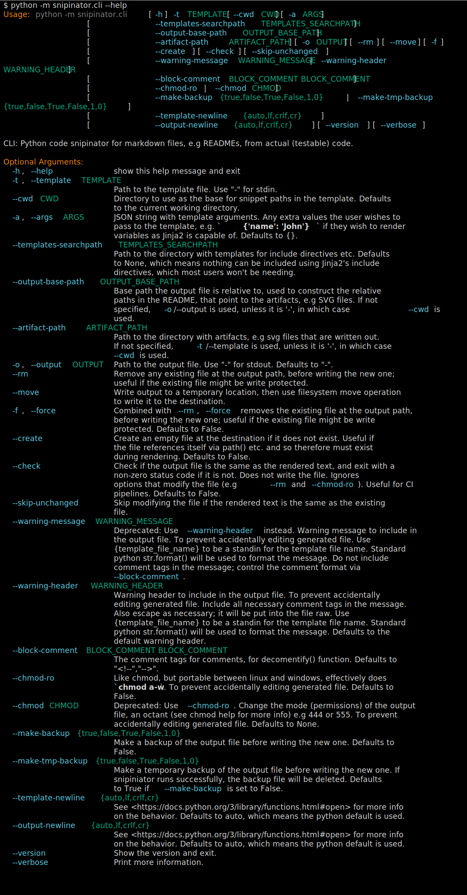

<!--

WARNING: This file is auto-generated by snipinator. Do not edit directly.
SOURCE: `snipinator/examples/LONG-EXAMPLE.md.jinja2`.

-->
# A README

If you are viewing a rendered version of this page, you probably want to see the
source code to see how it's done.

## pysnippet: global class

````py
class MyClass:
  """This is a global class"""

  def __init__(self, name):
    self.name = name

  def MyClassMethod(self):
    """This is a method of MyClass"""
    print(self.name)
````

## pysnippet: global method

````py
async def GlobalMethod():
  """This is a global method"""
  print('Hello')
````

## pysnippet: class member method

````py
  def MyClassMethod(self):
    """This is a method of MyClass"""
    print(self.name)
````

## pysignature: class member method

Same thing but just the signature:

````py
  def MyClassMethod(self):
    """This is a method of MyClass"""
````

## snippet

<!--
-->
```py

  i = 5
  print(i)

```
<!--
-->

## self referencing path

<!--
snipinator/examples/LONG-EXAMPLE.generated.md
-->

## shell, no terminal colors

````console
$ python -m snipinator.cli --help
Usage: python -m snipinator.cli [-h] -t TEMPLATE [--cwd CWD] [-a ARGS]
                                [--templates-searchpath TEMPLATES_SEARCHPATH]
                                [-o OUTPUT] [--rm] [--move] [-f] [--create]
                                [--check]
                                [--warning-message WARNING_MESSAGE | --warning-header WARNING_HEADER]
                                [--block-comment BLOCK_COMMENT BLOCK_COMMENT]
                                [--chmod-ro | --chmod CHMOD]
                                [--make-backup {true,false,True,False,1,0} | --make-tmp-backup {true,false,True,False,1,0}]
                                [--template-newline {auto,lf,crlf,cr}]
                                [--output-newline {auto,lf,crlf,cr}]
                                [--version] [--verbose]

CLI: Python code snipinator for markdown files, e.g READMEs, from actual
(testable) code.

Optional Arguments:
  -h, --help            show this help message and exit
  -t, --template TEMPLATE
                        Path to the template file. Use "-" for stdin.
  --cwd CWD             Directory to use as the base for snippet paths in the
                        template. Defaults to the current working directory.
  -a, --args ARGS       JSON string with template arguments. Any extra values
                        the user wishes to pass to the template, e.g.
                        `{'name': 'John'}` if they wish to render variables as
                        Jinja2 is capable of. Defaults to {}.
  --templates-searchpath TEMPLATES_SEARCHPATH
                        Path to the directory with templates for include
                        directives etc. Defaults to None, which means nothing
                        can be included using Jinja2's include directives,
                        which most users won't be needing.
  -o, --output OUTPUT   Path to the output file. Use "-" for stdout. Defaults
                        to "-".
  --rm                  Remove any existing file at the output path, before
                        writing the new one; useful if the existing file might
                        be write protected.
  --move                Write output to a temporary location, then use
                        filesystem move operation to write it to the
                        destination.
  -f, --force           Force remove the existing file at the output path,
                        before writing the new one; useful if the existing
                        file might be write protected. Defaults to False.
  --create              Create an empty file at the destination if it does not
                        exist. Useful if the file references itself via path()
                        etc. and so therefore must exist during rendering.
                        Defaults to False.
  --check               Check if the output file is the same as the rendered
                        text, and exit with a non-zero status code if it is
                        not. Does not write the file. Ignores options that
                        modify the file (e.g --rm and --chmod-ro). Useful for
                        CI pipelines. Defaults to False.
  --warning-message WARNING_MESSAGE
                        Deprecated: Use --warning-header instead. Warning
                        message to include in the output file. To prevent
                        accidentally editing generated file. Use
                        {template_file_name} to be a standin for the template
                        file name. Standard python str.format() will be used
                        to format the message. Do not include comment tags in
                        the message; control the comment format via
                        --block-comment.
  --warning-header WARNING_HEADER
                        Warning header to include in the output file. To
                        prevent accidentally editing generated file. Include
                        all necessary comment tags in the message. Also escape
                        as necessary; it will be put into the file raw. Use
                        {template_file_name} to be a standin for the template
                        file name. Standard python str.format() will be used
                        to format the message. Defaults to the default warning
                        header.
  --block-comment BLOCK_COMMENT BLOCK_COMMENT
                        The comment tags for comments, for decomentify()
                        function. Defaults to "<!--","-->".
  --chmod-ro            Like chmod, but portable between linux and windows,
                        effectively does `chmod a-w`. To prevent accidentally
                        editing generated file. Defaults to False.
  --chmod CHMOD         Deprecated: Use --chmod-ro. Change the mode
                        (permissions) of the output file, an octant (see chmod
                        help for more info) e.g 444 or 555. To prevent
                        accidentally editing generated file. Defaults to None.
  --make-backup {true,false,True,False,1,0}
                        Make a backup of the output file before writing the
                        new one. Defaults to False.
  --make-tmp-backup {true,false,True,False,1,0}
                        Make a temporary backup of the output file before
                        writing the new one. If snipiniator runs successfully,
                        the backup file will be deleted. Defaults to True if
                        --make-backup is set to False.
  --template-newline {auto,lf,crlf,cr}
                        See
                        <https://docs.python.org/3/library/functions.html#open
                        > for more info on the behavior. Defaults to auto,
                        which means the python default is used.
  --output-newline {auto,lf,crlf,cr}
                        See
                        <https://docs.python.org/3/library/functions.html#open
                        > for more info on the behavior. Defaults to auto,
                        which means the python default is used.
  --version             Show the version and exit.
  --verbose             Print more information.

````

## shell: terminal colors, img tag, external svg

<!--
--><!-- -->

## shell: terminal colors, img tag, external svg, no command in output

Here is a terminal snippet with terminal colors (img tag external svg), without
command included in the svg:

<!--
--><!-- -->

## shell: terminal colors, img tag, external svg, custom dimensions

Here is a terminal snippet with terminal colors (img tag external svg, custom
dimensions), _with_ command included in the svg:

<!--
--><!-- -->

## shell: terminal colors, img tag, svg data uri

**Warning: This breaks on GitHub.**

Here is a terminal snippet with terminal colors (img tag with svg data):

<!--
--><img src="data:image/svg+xml;base64,PD94bWwgdmVyc2lvbj0iMS4wIiA/Pgo8c3ZnIHhtbG5zPSJodHRwOi8vd3d3LnczLm9yZy8yMDAwL3N2ZyIgY2xhc3M9InJpY2gtdGVybWluYWwiIHZpZXdCb3g9IjAgMCA5OTQgMjUzOC43OTk5OTk5OTk5OTk3Ij4KPCEtLSBHZW5lcmF0ZWQgd2l0aCBSaWNoIHRleHR1YWxpemUuaW8gLS0+CjxyZWN0IHdpZHRoPSIxMDAlIiBoZWlnaHQ9IjEwMCUiIGZpbGw9InRyYW5zcGFyZW50Ii8+CjxzdHlsZT4KQGZvbnQtZmFjZSB7CmZvbnQtZmFtaWx5OiAmcXVvdDtGaXJhIENvZGUmcXVvdDs7CnNyYzogbG9jYWwoJnF1b3Q7RmlyYUNvZGUtUmVndWxhciZxdW90OyksCnVybCgmcXVvdDtodHRwczovL2NkbmpzLmNsb3VkZmxhcmUuY29tL2FqYXgvbGlicy9maXJhY29kZS82LjIuMC93b2ZmMi9GaXJhQ29kZS1SZWd1bGFyLndvZmYyJnF1b3Q7KSBmb3JtYXQoJnF1b3Q7d29mZjImcXVvdDspLAp1cmwoJnF1b3Q7aHR0cHM6Ly9jZG5qcy5jbG91ZGZsYXJlLmNvbS9hamF4L2xpYnMvZmlyYWNvZGUvNi4yLjAvd29mZi9GaXJhQ29kZS1SZWd1bGFyLndvZmYmcXVvdDspIGZvcm1hdCgmcXVvdDt3b2ZmJnF1b3Q7KTsKZm9udC1zdHlsZTogbm9ybWFsOwpmb250LXdlaWdodDogNDAwOwp9CkBmb250LWZhY2Ugewpmb250LWZhbWlseTogJnF1b3Q7RmlyYSBDb2RlJnF1b3Q7OwpzcmM6IGxvY2FsKCZxdW90O0ZpcmFDb2RlLUJvbGQmcXVvdDspLAp1cmwoJnF1b3Q7aHR0cHM6Ly9jZG5qcy5jbG91ZGZsYXJlLmNvbS9hamF4L2xpYnMvZmlyYWNvZGUvNi4yLjAvd29mZjIvRmlyYUNvZGUtQm9sZC53b2ZmMiZxdW90OykgZm9ybWF0KCZxdW90O3dvZmYyJnF1b3Q7KSwKdXJsKCZxdW90O2h0dHBzOi8vY2RuanMuY2xvdWRmbGFyZS5jb20vYWpheC9saWJzL2ZpcmFjb2RlLzYuMi4wL3dvZmYvRmlyYUNvZGUtQm9sZC53b2ZmJnF1b3Q7KSBmb3JtYXQoJnF1b3Q7d29mZiZxdW90Oyk7CmZvbnQtc3R5bGU6IGJvbGQ7CmZvbnQtd2VpZ2h0OiA3MDA7Cn0KLnRlcm1pbmFsLTM3MTk0Nzk5MjItbWF0cml4IHsKZm9udC1mYW1pbHk6IEZpcmEgQ29kZSwgbW9ub3NwYWNlOwpmb250LXNpemU6IDIwcHg7CmxpbmUtaGVpZ2h0OiAyNC40cHg7CmZvbnQtdmFyaWFudC1lYXN0LWFzaWFuOiBmdWxsLXdpZHRoOwp9Ci50ZXJtaW5hbC0zNzE5NDc5OTIyLXRpdGxlIHsKZm9udC1zaXplOiAxOHB4Owpmb250LXdlaWdodDogYm9sZDsKZm9udC1mYW1pbHk6IGFyaWFsOwp9Ci50ZXJtaW5hbC0zNzE5NDc5OTIyLXIxIHsgZmlsbDogI2Q5ZDlkOSB9Ci50ZXJtaW5hbC0zNzE5NDc5OTIyLXIyIHsgZmlsbDogI2ZmODcwMCB9Ci50ZXJtaW5hbC0zNzE5NDc5OTIyLXIzIHsgZmlsbDogIzgwODA4MCB9Ci50ZXJtaW5hbC0zNzE5NDc5OTIyLXI0IHsgZmlsbDogIzU4ZDFlYiB9Ci50ZXJtaW5hbC0zNzE5NDc5OTIyLXI1IHsgZmlsbDogIzAwYWY4NyB9Ci50ZXJtaW5hbC0zNzE5NDc5OTIyLXI2IHsgZmlsbDogI2Q5ZDlkOTtmb250LXdlaWdodDogYm9sZCB9Cjwvc3R5bGU+CjxkZWZzPgo8Y2xpcFBhdGggaWQ9InRlcm1pbmFsLTM3MTk0Nzk5MjItY2xpcC10ZXJtaW5hbCI+CjxyZWN0IHg9IjAiIHk9IjAiIHdpZHRoPSI5NzUuMCIgaGVpZ2h0PSIyNDg3Ljc5OTk5OTk5OTk5OTciLz4KPC9jbGlwUGF0aD4KPGNsaXBQYXRoIGlkPSJ0ZXJtaW5hbC0zNzE5NDc5OTIyLWxpbmUtMCI+CjxyZWN0IHg9IjAiIHk9IjEuNSIgd2lkdGg9Ijk3NiIgaGVpZ2h0PSIyNC42NSIvPgo8L2NsaXBQYXRoPgo8Y2xpcFBhdGggaWQ9InRlcm1pbmFsLTM3MTk0Nzk5MjItbGluZS0xIj4KPHJlY3QgeD0iMCIgeT0iMjUuOSIgd2lkdGg9Ijk3NiIgaGVpZ2h0PSIyNC42NSIvPgo8L2NsaXBQYXRoPgo8Y2xpcFBhdGggaWQ9InRlcm1pbmFsLTM3MTk0Nzk5MjItbGluZS0yIj4KPHJlY3QgeD0iMCIgeT0iNTAuMyIgd2lkdGg9Ijk3NiIgaGVpZ2h0PSIyNC42NSIvPgo8L2NsaXBQYXRoPgo8Y2xpcFBhdGggaWQ9InRlcm1pbmFsLTM3MTk0Nzk5MjItbGluZS0zIj4KPHJlY3QgeD0iMCIgeT0iNzQuNyIgd2lkdGg9Ijk3NiIgaGVpZ2h0PSIyNC42NSIvPgo8L2NsaXBQYXRoPgo8Y2xpcFBhdGggaWQ9InRlcm1pbmFsLTM3MTk0Nzk5MjItbGluZS00Ij4KPHJlY3QgeD0iMCIgeT0iOTkuMSIgd2lkdGg9Ijk3NiIgaGVpZ2h0PSIyNC42NSIvPgo8L2NsaXBQYXRoPgo8Y2xpcFBhdGggaWQ9InRlcm1pbmFsLTM3MTk0Nzk5MjItbGluZS01Ij4KPHJlY3QgeD0iMCIgeT0iMTIzLjUiIHdpZHRoPSI5NzYiIGhlaWdodD0iMjQuNjUiLz4KPC9jbGlwUGF0aD4KPGNsaXBQYXRoIGlkPSJ0ZXJtaW5hbC0zNzE5NDc5OTIyLWxpbmUtNiI+CjxyZWN0IHg9IjAiIHk9IjE0Ny45IiB3aWR0aD0iOTc2IiBoZWlnaHQ9IjI0LjY1Ii8+CjwvY2xpcFBhdGg+CjxjbGlwUGF0aCBpZD0idGVybWluYWwtMzcxOTQ3OTkyMi1saW5lLTciPgo8cmVjdCB4PSIwIiB5PSIxNzIuMyIgd2lkdGg9Ijk3NiIgaGVpZ2h0PSIyNC42NSIvPgo8L2NsaXBQYXRoPgo8Y2xpcFBhdGggaWQ9InRlcm1pbmFsLTM3MTk0Nzk5MjItbGluZS04Ij4KPHJlY3QgeD0iMCIgeT0iMTk2LjciIHdpZHRoPSI5NzYiIGhlaWdodD0iMjQuNjUiLz4KPC9jbGlwUGF0aD4KPGNsaXBQYXRoIGlkPSJ0ZXJtaW5hbC0zNzE5NDc5OTIyLWxpbmUtOSI+CjxyZWN0IHg9IjAiIHk9IjIyMS4xIiB3aWR0aD0iOTc2IiBoZWlnaHQ9IjI0LjY1Ii8+CjwvY2xpcFBhdGg+CjxjbGlwUGF0aCBpZD0idGVybWluYWwtMzcxOTQ3OTkyMi1saW5lLTEwIj4KPHJlY3QgeD0iMCIgeT0iMjQ1LjUiIHdpZHRoPSI5NzYiIGhlaWdodD0iMjQuNjUiLz4KPC9jbGlwUGF0aD4KPGNsaXBQYXRoIGlkPSJ0ZXJtaW5hbC0zNzE5NDc5OTIyLWxpbmUtMTEiPgo8cmVjdCB4PSIwIiB5PSIyNjkuOSIgd2lkdGg9Ijk3NiIgaGVpZ2h0PSIyNC42NSIvPgo8L2NsaXBQYXRoPgo8Y2xpcFBhdGggaWQ9InRlcm1pbmFsLTM3MTk0Nzk5MjItbGluZS0xMiI+CjxyZWN0IHg9IjAiIHk9IjI5NC4zIiB3aWR0aD0iOTc2IiBoZWlnaHQ9IjI0LjY1Ii8+CjwvY2xpcFBhdGg+CjxjbGlwUGF0aCBpZD0idGVybWluYWwtMzcxOTQ3OTkyMi1saW5lLTEzIj4KPHJlY3QgeD0iMCIgeT0iMzE4LjciIHdpZHRoPSI5NzYiIGhlaWdodD0iMjQuNjUiLz4KPC9jbGlwUGF0aD4KPGNsaXBQYXRoIGlkPSJ0ZXJtaW5hbC0zNzE5NDc5OTIyLWxpbmUtMTQiPgo8cmVjdCB4PSIwIiB5PSIzNDMuMSIgd2lkdGg9Ijk3NiIgaGVpZ2h0PSIyNC42NSIvPgo8L2NsaXBQYXRoPgo8Y2xpcFBhdGggaWQ9InRlcm1pbmFsLTM3MTk0Nzk5MjItbGluZS0xNSI+CjxyZWN0IHg9IjAiIHk9IjM2Ny41IiB3aWR0aD0iOTc2IiBoZWlnaHQ9IjI0LjY1Ii8+CjwvY2xpcFBhdGg+CjxjbGlwUGF0aCBpZD0idGVybWluYWwtMzcxOTQ3OTkyMi1saW5lLTE2Ij4KPHJlY3QgeD0iMCIgeT0iMzkxLjkiIHdpZHRoPSI5NzYiIGhlaWdodD0iMjQuNjUiLz4KPC9jbGlwUGF0aD4KPGNsaXBQYXRoIGlkPSJ0ZXJtaW5hbC0zNzE5NDc5OTIyLWxpbmUtMTciPgo8cmVjdCB4PSIwIiB5PSI0MTYuMyIgd2lkdGg9Ijk3NiIgaGVpZ2h0PSIyNC42NSIvPgo8L2NsaXBQYXRoPgo8Y2xpcFBhdGggaWQ9InRlcm1pbmFsLTM3MTk0Nzk5MjItbGluZS0xOCI+CjxyZWN0IHg9IjAiIHk9IjQ0MC43IiB3aWR0aD0iOTc2IiBoZWlnaHQ9IjI0LjY1Ii8+CjwvY2xpcFBhdGg+CjxjbGlwUGF0aCBpZD0idGVybWluYWwtMzcxOTQ3OTkyMi1saW5lLTE5Ij4KPHJlY3QgeD0iMCIgeT0iNDY1LjEiIHdpZHRoPSI5NzYiIGhlaWdodD0iMjQuNjUiLz4KPC9jbGlwUGF0aD4KPGNsaXBQYXRoIGlkPSJ0ZXJtaW5hbC0zNzE5NDc5OTIyLWxpbmUtMjAiPgo8cmVjdCB4PSIwIiB5PSI0ODkuNSIgd2lkdGg9Ijk3NiIgaGVpZ2h0PSIyNC42NSIvPgo8L2NsaXBQYXRoPgo8Y2xpcFBhdGggaWQ9InRlcm1pbmFsLTM3MTk0Nzk5MjItbGluZS0yMSI+CjxyZWN0IHg9IjAiIHk9IjUxMy45IiB3aWR0aD0iOTc2IiBoZWlnaHQ9IjI0LjY1Ii8+CjwvY2xpcFBhdGg+CjxjbGlwUGF0aCBpZD0idGVybWluYWwtMzcxOTQ3OTkyMi1saW5lLTIyIj4KPHJlY3QgeD0iMCIgeT0iNTM4LjMiIHdpZHRoPSI5NzYiIGhlaWdodD0iMjQuNjUiLz4KPC9jbGlwUGF0aD4KPGNsaXBQYXRoIGlkPSJ0ZXJtaW5hbC0zNzE5NDc5OTIyLWxpbmUtMjMiPgo8cmVjdCB4PSIwIiB5PSI1NjIuNyIgd2lkdGg9Ijk3NiIgaGVpZ2h0PSIyNC42NSIvPgo8L2NsaXBQYXRoPgo8Y2xpcFBhdGggaWQ9InRlcm1pbmFsLTM3MTk0Nzk5MjItbGluZS0yNCI+CjxyZWN0IHg9IjAiIHk9IjU4Ny4xIiB3aWR0aD0iOTc2IiBoZWlnaHQ9IjI0LjY1Ii8+CjwvY2xpcFBhdGg+CjxjbGlwUGF0aCBpZD0idGVybWluYWwtMzcxOTQ3OTkyMi1saW5lLTI1Ij4KPHJlY3QgeD0iMCIgeT0iNjExLjUiIHdpZHRoPSI5NzYiIGhlaWdodD0iMjQuNjUiLz4KPC9jbGlwUGF0aD4KPGNsaXBQYXRoIGlkPSJ0ZXJtaW5hbC0zNzE5NDc5OTIyLWxpbmUtMjYiPgo8cmVjdCB4PSIwIiB5PSI2MzUuOSIgd2lkdGg9Ijk3NiIgaGVpZ2h0PSIyNC42NSIvPgo8L2NsaXBQYXRoPgo8Y2xpcFBhdGggaWQ9InRlcm1pbmFsLTM3MTk0Nzk5MjItbGluZS0yNyI+CjxyZWN0IHg9IjAiIHk9IjY2MC4zIiB3aWR0aD0iOTc2IiBoZWlnaHQ9IjI0LjY1Ii8+CjwvY2xpcFBhdGg+CjxjbGlwUGF0aCBpZD0idGVybWluYWwtMzcxOTQ3OTkyMi1saW5lLTI4Ij4KPHJlY3QgeD0iMCIgeT0iNjg0LjciIHdpZHRoPSI5NzYiIGhlaWdodD0iMjQuNjUiLz4KPC9jbGlwUGF0aD4KPGNsaXBQYXRoIGlkPSJ0ZXJtaW5hbC0zNzE5NDc5OTIyLWxpbmUtMjkiPgo8cmVjdCB4PSIwIiB5PSI3MDkuMSIgd2lkdGg9Ijk3NiIgaGVpZ2h0PSIyNC42NSIvPgo8L2NsaXBQYXRoPgo8Y2xpcFBhdGggaWQ9InRlcm1pbmFsLTM3MTk0Nzk5MjItbGluZS0zMCI+CjxyZWN0IHg9IjAiIHk9IjczMy41IiB3aWR0aD0iOTc2IiBoZWlnaHQ9IjI0LjY1Ii8+CjwvY2xpcFBhdGg+CjxjbGlwUGF0aCBpZD0idGVybWluYWwtMzcxOTQ3OTkyMi1saW5lLTMxIj4KPHJlY3QgeD0iMCIgeT0iNzU3LjkiIHdpZHRoPSI5NzYiIGhlaWdodD0iMjQuNjUiLz4KPC9jbGlwUGF0aD4KPGNsaXBQYXRoIGlkPSJ0ZXJtaW5hbC0zNzE5NDc5OTIyLWxpbmUtMzIiPgo8cmVjdCB4PSIwIiB5PSI3ODIuMyIgd2lkdGg9Ijk3NiIgaGVpZ2h0PSIyNC42NSIvPgo8L2NsaXBQYXRoPgo8Y2xpcFBhdGggaWQ9InRlcm1pbmFsLTM3MTk0Nzk5MjItbGluZS0zMyI+CjxyZWN0IHg9IjAiIHk9IjgwNi43IiB3aWR0aD0iOTc2IiBoZWlnaHQ9IjI0LjY1Ii8+CjwvY2xpcFBhdGg+CjxjbGlwUGF0aCBpZD0idGVybWluYWwtMzcxOTQ3OTkyMi1saW5lLTM0Ij4KPHJlY3QgeD0iMCIgeT0iODMxLjEiIHdpZHRoPSI5NzYiIGhlaWdodD0iMjQuNjUiLz4KPC9jbGlwUGF0aD4KPGNsaXBQYXRoIGlkPSJ0ZXJtaW5hbC0zNzE5NDc5OTIyLWxpbmUtMzUiPgo8cmVjdCB4PSIwIiB5PSI4NTUuNSIgd2lkdGg9Ijk3NiIgaGVpZ2h0PSIyNC42NSIvPgo8L2NsaXBQYXRoPgo8Y2xpcFBhdGggaWQ9InRlcm1pbmFsLTM3MTk0Nzk5MjItbGluZS0zNiI+CjxyZWN0IHg9IjAiIHk9Ijg3OS45IiB3aWR0aD0iOTc2IiBoZWlnaHQ9IjI0LjY1Ii8+CjwvY2xpcFBhdGg+CjxjbGlwUGF0aCBpZD0idGVybWluYWwtMzcxOTQ3OTkyMi1saW5lLTM3Ij4KPHJlY3QgeD0iMCIgeT0iOTA0LjMiIHdpZHRoPSI5NzYiIGhlaWdodD0iMjQuNjUiLz4KPC9jbGlwUGF0aD4KPGNsaXBQYXRoIGlkPSJ0ZXJtaW5hbC0zNzE5NDc5OTIyLWxpbmUtMzgiPgo8cmVjdCB4PSIwIiB5PSI5MjguNyIgd2lkdGg9Ijk3NiIgaGVpZ2h0PSIyNC42NSIvPgo8L2NsaXBQYXRoPgo8Y2xpcFBhdGggaWQ9InRlcm1pbmFsLTM3MTk0Nzk5MjItbGluZS0zOSI+CjxyZWN0IHg9IjAiIHk9Ijk1My4xIiB3aWR0aD0iOTc2IiBoZWlnaHQ9IjI0LjY1Ii8+CjwvY2xpcFBhdGg+CjxjbGlwUGF0aCBpZD0idGVybWluYWwtMzcxOTQ3OTkyMi1saW5lLTQwIj4KPHJlY3QgeD0iMCIgeT0iOTc3LjUiIHdpZHRoPSI5NzYiIGhlaWdodD0iMjQuNjUiLz4KPC9jbGlwUGF0aD4KPGNsaXBQYXRoIGlkPSJ0ZXJtaW5hbC0zNzE5NDc5OTIyLWxpbmUtNDEiPgo8cmVjdCB4PSIwIiB5PSIxMDAxLjkiIHdpZHRoPSI5NzYiIGhlaWdodD0iMjQuNjUiLz4KPC9jbGlwUGF0aD4KPGNsaXBQYXRoIGlkPSJ0ZXJtaW5hbC0zNzE5NDc5OTIyLWxpbmUtNDIiPgo8cmVjdCB4PSIwIiB5PSIxMDI2LjMiIHdpZHRoPSI5NzYiIGhlaWdodD0iMjQuNjUiLz4KPC9jbGlwUGF0aD4KPGNsaXBQYXRoIGlkPSJ0ZXJtaW5hbC0zNzE5NDc5OTIyLWxpbmUtNDMiPgo8cmVjdCB4PSIwIiB5PSIxMDUwLjciIHdpZHRoPSI5NzYiIGhlaWdodD0iMjQuNjUiLz4KPC9jbGlwUGF0aD4KPGNsaXBQYXRoIGlkPSJ0ZXJtaW5hbC0zNzE5NDc5OTIyLWxpbmUtNDQiPgo8cmVjdCB4PSIwIiB5PSIxMDc1LjEiIHdpZHRoPSI5NzYiIGhlaWdodD0iMjQuNjUiLz4KPC9jbGlwUGF0aD4KPGNsaXBQYXRoIGlkPSJ0ZXJtaW5hbC0zNzE5NDc5OTIyLWxpbmUtNDUiPgo8cmVjdCB4PSIwIiB5PSIxMDk5LjUiIHdpZHRoPSI5NzYiIGhlaWdodD0iMjQuNjUiLz4KPC9jbGlwUGF0aD4KPGNsaXBQYXRoIGlkPSJ0ZXJtaW5hbC0zNzE5NDc5OTIyLWxpbmUtNDYiPgo8cmVjdCB4PSIwIiB5PSIxMTIzLjkiIHdpZHRoPSI5NzYiIGhlaWdodD0iMjQuNjUiLz4KPC9jbGlwUGF0aD4KPGNsaXBQYXRoIGlkPSJ0ZXJtaW5hbC0zNzE5NDc5OTIyLWxpbmUtNDciPgo8cmVjdCB4PSIwIiB5PSIxMTQ4LjMiIHdpZHRoPSI5NzYiIGhlaWdodD0iMjQuNjUiLz4KPC9jbGlwUGF0aD4KPGNsaXBQYXRoIGlkPSJ0ZXJtaW5hbC0zNzE5NDc5OTIyLWxpbmUtNDgiPgo8cmVjdCB4PSIwIiB5PSIxMTcyLjciIHdpZHRoPSI5NzYiIGhlaWdodD0iMjQuNjUiLz4KPC9jbGlwUGF0aD4KPGNsaXBQYXRoIGlkPSJ0ZXJtaW5hbC0zNzE5NDc5OTIyLWxpbmUtNDkiPgo8cmVjdCB4PSIwIiB5PSIxMTk3LjEiIHdpZHRoPSI5NzYiIGhlaWdodD0iMjQuNjUiLz4KPC9jbGlwUGF0aD4KPGNsaXBQYXRoIGlkPSJ0ZXJtaW5hbC0zNzE5NDc5OTIyLWxpbmUtNTAiPgo8cmVjdCB4PSIwIiB5PSIxMjIxLjUiIHdpZHRoPSI5NzYiIGhlaWdodD0iMjQuNjUiLz4KPC9jbGlwUGF0aD4KPGNsaXBQYXRoIGlkPSJ0ZXJtaW5hbC0zNzE5NDc5OTIyLWxpbmUtNTEiPgo8cmVjdCB4PSIwIiB5PSIxMjQ1LjkiIHdpZHRoPSI5NzYiIGhlaWdodD0iMjQuNjUiLz4KPC9jbGlwUGF0aD4KPGNsaXBQYXRoIGlkPSJ0ZXJtaW5hbC0zNzE5NDc5OTIyLWxpbmUtNTIiPgo8cmVjdCB4PSIwIiB5PSIxMjcwLjMiIHdpZHRoPSI5NzYiIGhlaWdodD0iMjQuNjUiLz4KPC9jbGlwUGF0aD4KPGNsaXBQYXRoIGlkPSJ0ZXJtaW5hbC0zNzE5NDc5OTIyLWxpbmUtNTMiPgo8cmVjdCB4PSIwIiB5PSIxMjk0LjciIHdpZHRoPSI5NzYiIGhlaWdodD0iMjQuNjUiLz4KPC9jbGlwUGF0aD4KPGNsaXBQYXRoIGlkPSJ0ZXJtaW5hbC0zNzE5NDc5OTIyLWxpbmUtNTQiPgo8cmVjdCB4PSIwIiB5PSIxMzE5LjEiIHdpZHRoPSI5NzYiIGhlaWdodD0iMjQuNjUiLz4KPC9jbGlwUGF0aD4KPGNsaXBQYXRoIGlkPSJ0ZXJtaW5hbC0zNzE5NDc5OTIyLWxpbmUtNTUiPgo8cmVjdCB4PSIwIiB5PSIxMzQzLjUiIHdpZHRoPSI5NzYiIGhlaWdodD0iMjQuNjUiLz4KPC9jbGlwUGF0aD4KPGNsaXBQYXRoIGlkPSJ0ZXJtaW5hbC0zNzE5NDc5OTIyLWxpbmUtNTYiPgo8cmVjdCB4PSIwIiB5PSIxMzY3LjkiIHdpZHRoPSI5NzYiIGhlaWdodD0iMjQuNjUiLz4KPC9jbGlwUGF0aD4KPGNsaXBQYXRoIGlkPSJ0ZXJtaW5hbC0zNzE5NDc5OTIyLWxpbmUtNTciPgo8cmVjdCB4PSIwIiB5PSIxMzkyLjMiIHdpZHRoPSI5NzYiIGhlaWdodD0iMjQuNjUiLz4KPC9jbGlwUGF0aD4KPGNsaXBQYXRoIGlkPSJ0ZXJtaW5hbC0zNzE5NDc5OTIyLWxpbmUtNTgiPgo8cmVjdCB4PSIwIiB5PSIxNDE2LjciIHdpZHRoPSI5NzYiIGhlaWdodD0iMjQuNjUiLz4KPC9jbGlwUGF0aD4KPGNsaXBQYXRoIGlkPSJ0ZXJtaW5hbC0zNzE5NDc5OTIyLWxpbmUtNTkiPgo8cmVjdCB4PSIwIiB5PSIxNDQxLjEiIHdpZHRoPSI5NzYiIGhlaWdodD0iMjQuNjUiLz4KPC9jbGlwUGF0aD4KPGNsaXBQYXRoIGlkPSJ0ZXJtaW5hbC0zNzE5NDc5OTIyLWxpbmUtNjAiPgo8cmVjdCB4PSIwIiB5PSIxNDY1LjUiIHdpZHRoPSI5NzYiIGhlaWdodD0iMjQuNjUiLz4KPC9jbGlwUGF0aD4KPGNsaXBQYXRoIGlkPSJ0ZXJtaW5hbC0zNzE5NDc5OTIyLWxpbmUtNjEiPgo8cmVjdCB4PSIwIiB5PSIxNDg5LjkiIHdpZHRoPSI5NzYiIGhlaWdodD0iMjQuNjUiLz4KPC9jbGlwUGF0aD4KPGNsaXBQYXRoIGlkPSJ0ZXJtaW5hbC0zNzE5NDc5OTIyLWxpbmUtNjIiPgo8cmVjdCB4PSIwIiB5PSIxNTE0LjMiIHdpZHRoPSI5NzYiIGhlaWdodD0iMjQuNjUiLz4KPC9jbGlwUGF0aD4KPGNsaXBQYXRoIGlkPSJ0ZXJtaW5hbC0zNzE5NDc5OTIyLWxpbmUtNjMiPgo8cmVjdCB4PSIwIiB5PSIxNTM4LjciIHdpZHRoPSI5NzYiIGhlaWdodD0iMjQuNjUiLz4KPC9jbGlwUGF0aD4KPGNsaXBQYXRoIGlkPSJ0ZXJtaW5hbC0zNzE5NDc5OTIyLWxpbmUtNjQiPgo8cmVjdCB4PSIwIiB5PSIxNTYzLjEiIHdpZHRoPSI5NzYiIGhlaWdodD0iMjQuNjUiLz4KPC9jbGlwUGF0aD4KPGNsaXBQYXRoIGlkPSJ0ZXJtaW5hbC0zNzE5NDc5OTIyLWxpbmUtNjUiPgo8cmVjdCB4PSIwIiB5PSIxNTg3LjUiIHdpZHRoPSI5NzYiIGhlaWdodD0iMjQuNjUiLz4KPC9jbGlwUGF0aD4KPGNsaXBQYXRoIGlkPSJ0ZXJtaW5hbC0zNzE5NDc5OTIyLWxpbmUtNjYiPgo8cmVjdCB4PSIwIiB5PSIxNjExLjkiIHdpZHRoPSI5NzYiIGhlaWdodD0iMjQuNjUiLz4KPC9jbGlwUGF0aD4KPGNsaXBQYXRoIGlkPSJ0ZXJtaW5hbC0zNzE5NDc5OTIyLWxpbmUtNjciPgo8cmVjdCB4PSIwIiB5PSIxNjM2LjMiIHdpZHRoPSI5NzYiIGhlaWdodD0iMjQuNjUiLz4KPC9jbGlwUGF0aD4KPGNsaXBQYXRoIGlkPSJ0ZXJtaW5hbC0zNzE5NDc5OTIyLWxpbmUtNjgiPgo8cmVjdCB4PSIwIiB5PSIxNjYwLjciIHdpZHRoPSI5NzYiIGhlaWdodD0iMjQuNjUiLz4KPC9jbGlwUGF0aD4KPGNsaXBQYXRoIGlkPSJ0ZXJtaW5hbC0zNzE5NDc5OTIyLWxpbmUtNjkiPgo8cmVjdCB4PSIwIiB5PSIxNjg1LjEiIHdpZHRoPSI5NzYiIGhlaWdodD0iMjQuNjUiLz4KPC9jbGlwUGF0aD4KPGNsaXBQYXRoIGlkPSJ0ZXJtaW5hbC0zNzE5NDc5OTIyLWxpbmUtNzAiPgo8cmVjdCB4PSIwIiB5PSIxNzA5LjUiIHdpZHRoPSI5NzYiIGhlaWdodD0iMjQuNjUiLz4KPC9jbGlwUGF0aD4KPGNsaXBQYXRoIGlkPSJ0ZXJtaW5hbC0zNzE5NDc5OTIyLWxpbmUtNzEiPgo8cmVjdCB4PSIwIiB5PSIxNzMzLjkiIHdpZHRoPSI5NzYiIGhlaWdodD0iMjQuNjUiLz4KPC9jbGlwUGF0aD4KPGNsaXBQYXRoIGlkPSJ0ZXJtaW5hbC0zNzE5NDc5OTIyLWxpbmUtNzIiPgo8cmVjdCB4PSIwIiB5PSIxNzU4LjMiIHdpZHRoPSI5NzYiIGhlaWdodD0iMjQuNjUiLz4KPC9jbGlwUGF0aD4KPGNsaXBQYXRoIGlkPSJ0ZXJtaW5hbC0zNzE5NDc5OTIyLWxpbmUtNzMiPgo8cmVjdCB4PSIwIiB5PSIxNzgyLjciIHdpZHRoPSI5NzYiIGhlaWdodD0iMjQuNjUiLz4KPC9jbGlwUGF0aD4KPGNsaXBQYXRoIGlkPSJ0ZXJtaW5hbC0zNzE5NDc5OTIyLWxpbmUtNzQiPgo8cmVjdCB4PSIwIiB5PSIxODA3LjEiIHdpZHRoPSI5NzYiIGhlaWdodD0iMjQuNjUiLz4KPC9jbGlwUGF0aD4KPGNsaXBQYXRoIGlkPSJ0ZXJtaW5hbC0zNzE5NDc5OTIyLWxpbmUtNzUiPgo8cmVjdCB4PSIwIiB5PSIxODMxLjUiIHdpZHRoPSI5NzYiIGhlaWdodD0iMjQuNjUiLz4KPC9jbGlwUGF0aD4KPGNsaXBQYXRoIGlkPSJ0ZXJtaW5hbC0zNzE5NDc5OTIyLWxpbmUtNzYiPgo8cmVjdCB4PSIwIiB5PSIxODU1LjkiIHdpZHRoPSI5NzYiIGhlaWdodD0iMjQuNjUiLz4KPC9jbGlwUGF0aD4KPGNsaXBQYXRoIGlkPSJ0ZXJtaW5hbC0zNzE5NDc5OTIyLWxpbmUtNzciPgo8cmVjdCB4PSIwIiB5PSIxODgwLjMiIHdpZHRoPSI5NzYiIGhlaWdodD0iMjQuNjUiLz4KPC9jbGlwUGF0aD4KPGNsaXBQYXRoIGlkPSJ0ZXJtaW5hbC0zNzE5NDc5OTIyLWxpbmUtNzgiPgo8cmVjdCB4PSIwIiB5PSIxOTA0LjciIHdpZHRoPSI5NzYiIGhlaWdodD0iMjQuNjUiLz4KPC9jbGlwUGF0aD4KPGNsaXBQYXRoIGlkPSJ0ZXJtaW5hbC0zNzE5NDc5OTIyLWxpbmUtNzkiPgo8cmVjdCB4PSIwIiB5PSIxOTI5LjEiIHdpZHRoPSI5NzYiIGhlaWdodD0iMjQuNjUiLz4KPC9jbGlwUGF0aD4KPGNsaXBQYXRoIGlkPSJ0ZXJtaW5hbC0zNzE5NDc5OTIyLWxpbmUtODAiPgo8cmVjdCB4PSIwIiB5PSIxOTUzLjUiIHdpZHRoPSI5NzYiIGhlaWdodD0iMjQuNjUiLz4KPC9jbGlwUGF0aD4KPGNsaXBQYXRoIGlkPSJ0ZXJtaW5hbC0zNzE5NDc5OTIyLWxpbmUtODEiPgo8cmVjdCB4PSIwIiB5PSIxOTc3LjkiIHdpZHRoPSI5NzYiIGhlaWdodD0iMjQuNjUiLz4KPC9jbGlwUGF0aD4KPGNsaXBQYXRoIGlkPSJ0ZXJtaW5hbC0zNzE5NDc5OTIyLWxpbmUtODIiPgo8cmVjdCB4PSIwIiB5PSIyMDAyLjMiIHdpZHRoPSI5NzYiIGhlaWdodD0iMjQuNjUiLz4KPC9jbGlwUGF0aD4KPGNsaXBQYXRoIGlkPSJ0ZXJtaW5hbC0zNzE5NDc5OTIyLWxpbmUtODMiPgo8cmVjdCB4PSIwIiB5PSIyMDI2LjciIHdpZHRoPSI5NzYiIGhlaWdodD0iMjQuNjUiLz4KPC9jbGlwUGF0aD4KPGNsaXBQYXRoIGlkPSJ0ZXJtaW5hbC0zNzE5NDc5OTIyLWxpbmUtODQiPgo8cmVjdCB4PSIwIiB5PSIyMDUxLjEiIHdpZHRoPSI5NzYiIGhlaWdodD0iMjQuNjUiLz4KPC9jbGlwUGF0aD4KPGNsaXBQYXRoIGlkPSJ0ZXJtaW5hbC0zNzE5NDc5OTIyLWxpbmUtODUiPgo8cmVjdCB4PSIwIiB5PSIyMDc1LjUiIHdpZHRoPSI5NzYiIGhlaWdodD0iMjQuNjUiLz4KPC9jbGlwUGF0aD4KPGNsaXBQYXRoIGlkPSJ0ZXJtaW5hbC0zNzE5NDc5OTIyLWxpbmUtODYiPgo8cmVjdCB4PSIwIiB5PSIyMDk5LjkiIHdpZHRoPSI5NzYiIGhlaWdodD0iMjQuNjUiLz4KPC9jbGlwUGF0aD4KPGNsaXBQYXRoIGlkPSJ0ZXJtaW5hbC0zNzE5NDc5OTIyLWxpbmUtODciPgo8cmVjdCB4PSIwIiB5PSIyMTI0LjMiIHdpZHRoPSI5NzYiIGhlaWdodD0iMjQuNjUiLz4KPC9jbGlwUGF0aD4KPGNsaXBQYXRoIGlkPSJ0ZXJtaW5hbC0zNzE5NDc5OTIyLWxpbmUtODgiPgo8cmVjdCB4PSIwIiB5PSIyMTQ4LjciIHdpZHRoPSI5NzYiIGhlaWdodD0iMjQuNjUiLz4KPC9jbGlwUGF0aD4KPGNsaXBQYXRoIGlkPSJ0ZXJtaW5hbC0zNzE5NDc5OTIyLWxpbmUtODkiPgo8cmVjdCB4PSIwIiB5PSIyMTczLjEiIHdpZHRoPSI5NzYiIGhlaWdodD0iMjQuNjUiLz4KPC9jbGlwUGF0aD4KPGNsaXBQYXRoIGlkPSJ0ZXJtaW5hbC0zNzE5NDc5OTIyLWxpbmUtOTAiPgo8cmVjdCB4PSIwIiB5PSIyMTk3LjUiIHdpZHRoPSI5NzYiIGhlaWdodD0iMjQuNjUiLz4KPC9jbGlwUGF0aD4KPGNsaXBQYXRoIGlkPSJ0ZXJtaW5hbC0zNzE5NDc5OTIyLWxpbmUtOTEiPgo8cmVjdCB4PSIwIiB5PSIyMjIxLjkiIHdpZHRoPSI5NzYiIGhlaWdodD0iMjQuNjUiLz4KPC9jbGlwUGF0aD4KPGNsaXBQYXRoIGlkPSJ0ZXJtaW5hbC0zNzE5NDc5OTIyLWxpbmUtOTIiPgo8cmVjdCB4PSIwIiB5PSIyMjQ2LjMiIHdpZHRoPSI5NzYiIGhlaWdodD0iMjQuNjUiLz4KPC9jbGlwUGF0aD4KPGNsaXBQYXRoIGlkPSJ0ZXJtaW5hbC0zNzE5NDc5OTIyLWxpbmUtOTMiPgo8cmVjdCB4PSIwIiB5PSIyMjcwLjciIHdpZHRoPSI5NzYiIGhlaWdodD0iMjQuNjUiLz4KPC9jbGlwUGF0aD4KPGNsaXBQYXRoIGlkPSJ0ZXJtaW5hbC0zNzE5NDc5OTIyLWxpbmUtOTQiPgo8cmVjdCB4PSIwIiB5PSIyMjk1LjEiIHdpZHRoPSI5NzYiIGhlaWdodD0iMjQuNjUiLz4KPC9jbGlwUGF0aD4KPGNsaXBQYXRoIGlkPSJ0ZXJtaW5hbC0zNzE5NDc5OTIyLWxpbmUtOTUiPgo8cmVjdCB4PSIwIiB5PSIyMzE5LjUiIHdpZHRoPSI5NzYiIGhlaWdodD0iMjQuNjUiLz4KPC9jbGlwUGF0aD4KPGNsaXBQYXRoIGlkPSJ0ZXJtaW5hbC0zNzE5NDc5OTIyLWxpbmUtOTYiPgo8cmVjdCB4PSIwIiB5PSIyMzQzLjkiIHdpZHRoPSI5NzYiIGhlaWdodD0iMjQuNjUiLz4KPC9jbGlwUGF0aD4KPGNsaXBQYXRoIGlkPSJ0ZXJtaW5hbC0zNzE5NDc5OTIyLWxpbmUtOTciPgo8cmVjdCB4PSIwIiB5PSIyMzY4LjMiIHdpZHRoPSI5NzYiIGhlaWdodD0iMjQuNjUiLz4KPC9jbGlwUGF0aD4KPGNsaXBQYXRoIGlkPSJ0ZXJtaW5hbC0zNzE5NDc5OTIyLWxpbmUtOTgiPgo8cmVjdCB4PSIwIiB5PSIyMzkyLjciIHdpZHRoPSI5NzYiIGhlaWdodD0iMjQuNjUiLz4KPC9jbGlwUGF0aD4KPGNsaXBQYXRoIGlkPSJ0ZXJtaW5hbC0zNzE5NDc5OTIyLWxpbmUtOTkiPgo8cmVjdCB4PSIwIiB5PSIyNDE3LjEiIHdpZHRoPSI5NzYiIGhlaWdodD0iMjQuNjUiLz4KPC9jbGlwUGF0aD4KPGNsaXBQYXRoIGlkPSJ0ZXJtaW5hbC0zNzE5NDc5OTIyLWxpbmUtMTAwIj4KPHJlY3QgeD0iMCIgeT0iMjQ0MS41IiB3aWR0aD0iOTc2IiBoZWlnaHQ9IjI0LjY1Ii8+CjwvY2xpcFBhdGg+CjwvZGVmcz4KPGcgdHJhbnNmb3JtPSJ0cmFuc2xhdGUoOSwgMCkiPgo8ZyBjbGFzcz0idGVybWluYWwtMzcxOTQ3OTkyMi1tYXRyaXgiPgo8dGV4dCBjbGFzcz0idGVybWluYWwtMzcxOTQ3OTkyMi1yMSIgeD0iMCIgeT0iMjAiIHRleHRMZW5ndGg9IjQwMi42IiBjbGlwLXBhdGg9InVybCgjdGVybWluYWwtMzcxOTQ3OTkyMi1saW5lLTApIj4kwqBweXRob27CoC1twqBzbmlwaW5hdG9yLmNsacKgLS1oZWxwPC90ZXh0Pgo8dGV4dCBjbGFzcz0idGVybWluYWwtMzcxOTQ3OTkyMi1yMSIgeD0iOTc2IiB5PSIyMCIgdGV4dExlbmd0aD0iMTIuMiIgY2xpcC1wYXRoPSJ1cmwoI3Rlcm1pbmFsLTM3MTk0Nzk5MjItbGluZS0wKSI+CjwvdGV4dD4KPHRleHQgY2xhc3M9InRlcm1pbmFsLTM3MTk0Nzk5MjItcjIiIHg9IjAiIHk9IjQ0LjQiIHRleHRMZW5ndGg9IjczLjIiIGNsaXAtcGF0aD0idXJsKCN0ZXJtaW5hbC0zNzE5NDc5OTIyLWxpbmUtMSkiPlVzYWdlOjwvdGV4dD4KPHRleHQgY2xhc3M9InRlcm1pbmFsLTM3MTk0Nzk5MjItcjMiIHg9Ijg1LjQiIHk9IjQ0LjQiIHRleHRMZW5ndGg9IjI5Mi44IiBjbGlwLXBhdGg9InVybCgjdGVybWluYWwtMzcxOTQ3OTkyMi1saW5lLTEpIj5weXRob27CoC1twqBzbmlwaW5hdG9yLmNsaTwvdGV4dD4KPHRleHQgY2xhc3M9InRlcm1pbmFsLTM3MTk0Nzk5MjItcjEiIHg9IjM3OC4yIiB5PSI0NC40IiB0ZXh0TGVuZ3RoPSIyNC40IiBjbGlwLXBhdGg9InVybCgjdGVybWluYWwtMzcxOTQ3OTkyMi1saW5lLTEpIj7CoFs8L3RleHQ+Cjx0ZXh0IGNsYXNzPSJ0ZXJtaW5hbC0zNzE5NDc5OTIyLXI0IiB4PSI0MDIuNiIgeT0iNDQuNCIgdGV4dExlbmd0aD0iMjQuNCIgY2xpcC1wYXRoPSJ1cmwoI3Rlcm1pbmFsLTM3MTk0Nzk5MjItbGluZS0xKSI+LWg8L3RleHQ+Cjx0ZXh0IGNsYXNzPSJ0ZXJtaW5hbC0zNzE5NDc5OTIyLXIxIiB4PSI0MjciIHk9IjQ0LjQiIHRleHRMZW5ndGg9IjI0LjQiIGNsaXAtcGF0aD0idXJsKCN0ZXJtaW5hbC0zNzE5NDc5OTIyLWxpbmUtMSkiPl3CoDwvdGV4dD4KPHRleHQgY2xhc3M9InRlcm1pbmFsLTM3MTk0Nzk5MjItcjQiIHg9IjQ1MS40IiB5PSI0NC40IiB0ZXh0TGVuZ3RoPSIyNC40IiBjbGlwLXBhdGg9InVybCgjdGVybWluYWwtMzcxOTQ3OTkyMi1saW5lLTEpIj4tdDwvdGV4dD4KPHRleHQgY2xhc3M9InRlcm1pbmFsLTM3MTk0Nzk5MjItcjUiIHg9IjQ4OCIgeT0iNDQuNCIgdGV4dExlbmd0aD0iOTcuNiIgY2xpcC1wYXRoPSJ1cmwoI3Rlcm1pbmFsLTM3MTk0Nzk5MjItbGluZS0xKSI+VEVNUExBVEU8L3RleHQ+Cjx0ZXh0IGNsYXNzPSJ0ZXJtaW5hbC0zNzE5NDc5OTIyLXIxIiB4PSI1ODUuNiIgeT0iNDQuNCIgdGV4dExlbmd0aD0iMjQuNCIgY2xpcC1wYXRoPSJ1cmwoI3Rlcm1pbmFsLTM3MTk0Nzk5MjItbGluZS0xKSI+wqBbPC90ZXh0Pgo8dGV4dCBjbGFzcz0idGVybWluYWwtMzcxOTQ3OTkyMi1yNCIgeD0iNjEwIiB5PSI0NC40IiB0ZXh0TGVuZ3RoPSI2MSIgY2xpcC1wYXRoPSJ1cmwoI3Rlcm1pbmFsLTM3MTk0Nzk5MjItbGluZS0xKSI+LS1jd2Q8L3RleHQ+Cjx0ZXh0IGNsYXNzPSJ0ZXJtaW5hbC0zNzE5NDc5OTIyLXI1IiB4PSI2ODMuMiIgeT0iNDQuNCIgdGV4dExlbmd0aD0iMzYuNiIgY2xpcC1wYXRoPSJ1cmwoI3Rlcm1pbmFsLTM3MTk0Nzk5MjItbGluZS0xKSI+Q1dEPC90ZXh0Pgo8dGV4dCBjbGFzcz0idGVybWluYWwtMzcxOTQ3OTkyMi1yMSIgeD0iNzE5LjgiIHk9IjQ0LjQiIHRleHRMZW5ndGg9IjM2LjYiIGNsaXAtcGF0aD0idXJsKCN0ZXJtaW5hbC0zNzE5NDc5OTIyLWxpbmUtMSkiPl3CoFs8L3RleHQ+Cjx0ZXh0IGNsYXNzPSJ0ZXJtaW5hbC0zNzE5NDc5OTIyLXI0IiB4PSI3NTYuNCIgeT0iNDQuNCIgdGV4dExlbmd0aD0iMjQuNCIgY2xpcC1wYXRoPSJ1cmwoI3Rlcm1pbmFsLTM3MTk0Nzk5MjItbGluZS0xKSI+LWE8L3RleHQ+Cjx0ZXh0IGNsYXNzPSJ0ZXJtaW5hbC0zNzE5NDc5OTIyLXI1IiB4PSI3OTMiIHk9IjQ0LjQiIHRleHRMZW5ndGg9IjQ4LjgiIGNsaXAtcGF0aD0idXJsKCN0ZXJtaW5hbC0zNzE5NDc5OTIyLWxpbmUtMSkiPkFSR1M8L3RleHQ+Cjx0ZXh0IGNsYXNzPSJ0ZXJtaW5hbC0zNzE5NDc5OTIyLXIxIiB4PSI4NDEuOCIgeT0iNDQuNCIgdGV4dExlbmd0aD0iMTIuMiIgY2xpcC1wYXRoPSJ1cmwoI3Rlcm1pbmFsLTM3MTk0Nzk5MjItbGluZS0xKSI+XTwvdGV4dD4KPHRleHQgY2xhc3M9InRlcm1pbmFsLTM3MTk0Nzk5MjItcjEiIHg9Ijk3NiIgeT0iNDQuNCIgdGV4dExlbmd0aD0iMTIuMiIgY2xpcC1wYXRoPSJ1cmwoI3Rlcm1pbmFsLTM3MTk0Nzk5MjItbGluZS0xKSI+CjwvdGV4dD4KPHRleHQgY2xhc3M9InRlcm1pbmFsLTM3MTk0Nzk5MjItcjEiIHg9IjAiIHk9IjY4LjgiIHRleHRMZW5ndGg9IjQwMi42IiBjbGlwLXBhdGg9InVybCgjdGVybWluYWwtMzcxOTQ3OTkyMi1saW5lLTIpIj7CoMKgwqDCoMKgwqDCoMKgwqDCoMKgwqDCoMKgwqDCoMKgwqDCoMKgwqDCoMKgwqDCoMKgwqDCoMKgwqDCoMKgWzwvdGV4dD4KPHRleHQgY2xhc3M9InRlcm1pbmFsLTM3MTk0Nzk5MjItcjQiIHg9IjQwMi42IiB5PSI2OC44IiB0ZXh0TGVuZ3RoPSIyNjguNCIgY2xpcC1wYXRoPSJ1cmwoI3Rlcm1pbmFsLTM3MTk0Nzk5MjItbGluZS0yKSI+LS10ZW1wbGF0ZXMtc2VhcmNocGF0aDwvdGV4dD4KPHRleHQgY2xhc3M9InRlcm1pbmFsLTM3MTk0Nzk5MjItcjUiIHg9IjY4My4yIiB5PSI2OC44IiB0ZXh0TGVuZ3RoPSIyNDQiIGNsaXAtcGF0aD0idXJsKCN0ZXJtaW5hbC0zNzE5NDc5OTIyLWxpbmUtMikiPlRFTVBMQVRFU19TRUFSQ0hQQVRIPC90ZXh0Pgo8dGV4dCBjbGFzcz0idGVybWluYWwtMzcxOTQ3OTkyMi1yMSIgeD0iOTI3LjIiIHk9IjY4LjgiIHRleHRMZW5ndGg9IjEyLjIiIGNsaXAtcGF0aD0idXJsKCN0ZXJtaW5hbC0zNzE5NDc5OTIyLWxpbmUtMikiPl08L3RleHQ+Cjx0ZXh0IGNsYXNzPSJ0ZXJtaW5hbC0zNzE5NDc5OTIyLXIxIiB4PSI5NzYiIHk9IjY4LjgiIHRleHRMZW5ndGg9IjEyLjIiIGNsaXAtcGF0aD0idXJsKCN0ZXJtaW5hbC0zNzE5NDc5OTIyLWxpbmUtMikiPgo8L3RleHQ+Cjx0ZXh0IGNsYXNzPSJ0ZXJtaW5hbC0zNzE5NDc5OTIyLXIxIiB4PSIwIiB5PSI5My4yIiB0ZXh0TGVuZ3RoPSI0MDIuNiIgY2xpcC1wYXRoPSJ1cmwoI3Rlcm1pbmFsLTM3MTk0Nzk5MjItbGluZS0zKSI+wqDCoMKgwqDCoMKgwqDCoMKgwqDCoMKgwqDCoMKgwqDCoMKgwqDCoMKgwqDCoMKgwqDCoMKgwqDCoMKgwqDCoFs8L3RleHQ+Cjx0ZXh0IGNsYXNzPSJ0ZXJtaW5hbC0zNzE5NDc5OTIyLXI0IiB4PSI0MDIuNiIgeT0iOTMuMiIgdGV4dExlbmd0aD0iMjQuNCIgY2xpcC1wYXRoPSJ1cmwoI3Rlcm1pbmFsLTM3MTk0Nzk5MjItbGluZS0zKSI+LW88L3RleHQ+Cjx0ZXh0IGNsYXNzPSJ0ZXJtaW5hbC0zNzE5NDc5OTIyLXI1IiB4PSI0MzkuMiIgeT0iOTMuMiIgdGV4dExlbmd0aD0iNzMuMiIgY2xpcC1wYXRoPSJ1cmwoI3Rlcm1pbmFsLTM3MTk0Nzk5MjItbGluZS0zKSI+T1VUUFVUPC90ZXh0Pgo8dGV4dCBjbGFzcz0idGVybWluYWwtMzcxOTQ3OTkyMi1yMSIgeD0iNTEyLjQiIHk9IjkzLjIiIHRleHRMZW5ndGg9IjM2LjYiIGNsaXAtcGF0aD0idXJsKCN0ZXJtaW5hbC0zNzE5NDc5OTIyLWxpbmUtMykiPl3CoFs8L3RleHQ+Cjx0ZXh0IGNsYXNzPSJ0ZXJtaW5hbC0zNzE5NDc5OTIyLXI0IiB4PSI1NDkiIHk9IjkzLjIiIHRleHRMZW5ndGg9IjQ4LjgiIGNsaXAtcGF0aD0idXJsKCN0ZXJtaW5hbC0zNzE5NDc5OTIyLWxpbmUtMykiPi0tcm08L3RleHQ+Cjx0ZXh0IGNsYXNzPSJ0ZXJtaW5hbC0zNzE5NDc5OTIyLXIxIiB4PSI1OTcuOCIgeT0iOTMuMiIgdGV4dExlbmd0aD0iMzYuNiIgY2xpcC1wYXRoPSJ1cmwoI3Rlcm1pbmFsLTM3MTk0Nzk5MjItbGluZS0zKSI+XcKgWzwvdGV4dD4KPHRleHQgY2xhc3M9InRlcm1pbmFsLTM3MTk0Nzk5MjItcjQiIHg9IjYzNC40IiB5PSI5My4yIiB0ZXh0TGVuZ3RoPSI3My4yIiBjbGlwLXBhdGg9InVybCgjdGVybWluYWwtMzcxOTQ3OTkyMi1saW5lLTMpIj4tLW1vdmU8L3RleHQ+Cjx0ZXh0IGNsYXNzPSJ0ZXJtaW5hbC0zNzE5NDc5OTIyLXIxIiB4PSI3MDcuNiIgeT0iOTMuMiIgdGV4dExlbmd0aD0iMzYuNiIgY2xpcC1wYXRoPSJ1cmwoI3Rlcm1pbmFsLTM3MTk0Nzk5MjItbGluZS0zKSI+XcKgWzwvdGV4dD4KPHRleHQgY2xhc3M9InRlcm1pbmFsLTM3MTk0Nzk5MjItcjQiIHg9Ijc0NC4yIiB5PSI5My4yIiB0ZXh0TGVuZ3RoPSIyNC40IiBjbGlwLXBhdGg9InVybCgjdGVybWluYWwtMzcxOTQ3OTkyMi1saW5lLTMpIj4tZjwvdGV4dD4KPHRleHQgY2xhc3M9InRlcm1pbmFsLTM3MTk0Nzk5MjItcjEiIHg9Ijc2OC42IiB5PSI5My4yIiB0ZXh0TGVuZ3RoPSIzNi42IiBjbGlwLXBhdGg9InVybCgjdGVybWluYWwtMzcxOTQ3OTkyMi1saW5lLTMpIj5dwqBbPC90ZXh0Pgo8dGV4dCBjbGFzcz0idGVybWluYWwtMzcxOTQ3OTkyMi1yNCIgeD0iODA1LjIiIHk9IjkzLjIiIHRleHRMZW5ndGg9Ijk3LjYiIGNsaXAtcGF0aD0idXJsKCN0ZXJtaW5hbC0zNzE5NDc5OTIyLWxpbmUtMykiPi0tY3JlYXRlPC90ZXh0Pgo8dGV4dCBjbGFzcz0idGVybWluYWwtMzcxOTQ3OTkyMi1yMSIgeD0iOTAyLjgiIHk9IjkzLjIiIHRleHRMZW5ndGg9IjEyLjIiIGNsaXAtcGF0aD0idXJsKCN0ZXJtaW5hbC0zNzE5NDc5OTIyLWxpbmUtMykiPl08L3RleHQ+Cjx0ZXh0IGNsYXNzPSJ0ZXJtaW5hbC0zNzE5NDc5OTIyLXIxIiB4PSI5NzYiIHk9IjkzLjIiIHRleHRMZW5ndGg9IjEyLjIiIGNsaXAtcGF0aD0idXJsKCN0ZXJtaW5hbC0zNzE5NDc5OTIyLWxpbmUtMykiPgo8L3RleHQ+Cjx0ZXh0IGNsYXNzPSJ0ZXJtaW5hbC0zNzE5NDc5OTIyLXIxIiB4PSIwIiB5PSIxMTcuNiIgdGV4dExlbmd0aD0iNDAyLjYiIGNsaXAtcGF0aD0idXJsKCN0ZXJtaW5hbC0zNzE5NDc5OTIyLWxpbmUtNCkiPsKgwqDCoMKgwqDCoMKgwqDCoMKgwqDCoMKgwqDCoMKgwqDCoMKgwqDCoMKgwqDCoMKgwqDCoMKgwqDCoMKgwqBbPC90ZXh0Pgo8dGV4dCBjbGFzcz0idGVybWluYWwtMzcxOTQ3OTkyMi1yNCIgeD0iNDAyLjYiIHk9IjExNy42IiB0ZXh0TGVuZ3RoPSI4NS40IiBjbGlwLXBhdGg9InVybCgjdGVybWluYWwtMzcxOTQ3OTkyMi1saW5lLTQpIj4tLWNoZWNrPC90ZXh0Pgo8dGV4dCBjbGFzcz0idGVybWluYWwtMzcxOTQ3OTkyMi1yMSIgeD0iNDg4IiB5PSIxMTcuNiIgdGV4dExlbmd0aD0iMTIuMiIgY2xpcC1wYXRoPSJ1cmwoI3Rlcm1pbmFsLTM3MTk0Nzk5MjItbGluZS00KSI+XTwvdGV4dD4KPHRleHQgY2xhc3M9InRlcm1pbmFsLTM3MTk0Nzk5MjItcjEiIHg9Ijk3NiIgeT0iMTE3LjYiIHRleHRMZW5ndGg9IjEyLjIiIGNsaXAtcGF0aD0idXJsKCN0ZXJtaW5hbC0zNzE5NDc5OTIyLWxpbmUtNCkiPgo8L3RleHQ+Cjx0ZXh0IGNsYXNzPSJ0ZXJtaW5hbC0zNzE5NDc5OTIyLXIxIiB4PSIwIiB5PSIxNDIiIHRleHRMZW5ndGg9IjQwMi42IiBjbGlwLXBhdGg9InVybCgjdGVybWluYWwtMzcxOTQ3OTkyMi1saW5lLTUpIj7CoMKgwqDCoMKgwqDCoMKgwqDCoMKgwqDCoMKgwqDCoMKgwqDCoMKgwqDCoMKgwqDCoMKgwqDCoMKgwqDCoMKgWzwvdGV4dD4KPHRleHQgY2xhc3M9InRlcm1pbmFsLTM3MTk0Nzk5MjItcjQiIHg9IjQwMi42IiB5PSIxNDIiIHRleHRMZW5ndGg9IjIwNy40IiBjbGlwLXBhdGg9InVybCgjdGVybWluYWwtMzcxOTQ3OTkyMi1saW5lLTUpIj4tLXdhcm5pbmctbWVzc2FnZTwvdGV4dD4KPHRleHQgY2xhc3M9InRlcm1pbmFsLTM3MTk0Nzk5MjItcjUiIHg9IjYyMi4yIiB5PSIxNDIiIHRleHRMZW5ndGg9IjE4MyIgY2xpcC1wYXRoPSJ1cmwoI3Rlcm1pbmFsLTM3MTk0Nzk5MjItbGluZS01KSI+V0FSTklOR19NRVNTQUdFPC90ZXh0Pgo8dGV4dCBjbGFzcz0idGVybWluYWwtMzcxOTQ3OTkyMi1yMSIgeD0iODA1LjIiIHk9IjE0MiIgdGV4dExlbmd0aD0iMzYuNiIgY2xpcC1wYXRoPSJ1cmwoI3Rlcm1pbmFsLTM3MTk0Nzk5MjItbGluZS01KSI+wqB8wqA8L3RleHQ+Cjx0ZXh0IGNsYXNzPSJ0ZXJtaW5hbC0zNzE5NDc5OTIyLXIxIiB4PSI5NzYiIHk9IjE0MiIgdGV4dExlbmd0aD0iMTIuMiIgY2xpcC1wYXRoPSJ1cmwoI3Rlcm1pbmFsLTM3MTk0Nzk5MjItbGluZS01KSI+CjwvdGV4dD4KPHRleHQgY2xhc3M9InRlcm1pbmFsLTM3MTk0Nzk5MjItcjQiIHg9IjAiIHk9IjE2Ni40IiB0ZXh0TGVuZ3RoPSIxOTUuMiIgY2xpcC1wYXRoPSJ1cmwoI3Rlcm1pbmFsLTM3MTk0Nzk5MjItbGluZS02KSI+LS13YXJuaW5nLWhlYWRlcjwvdGV4dD4KPHRleHQgY2xhc3M9InRlcm1pbmFsLTM3MTk0Nzk5MjItcjUiIHg9IjIwNy40IiB5PSIxNjYuNCIgdGV4dExlbmd0aD0iMTcwLjgiIGNsaXAtcGF0aD0idXJsKCN0ZXJtaW5hbC0zNzE5NDc5OTIyLWxpbmUtNikiPldBUk5JTkdfSEVBREVSPC90ZXh0Pgo8dGV4dCBjbGFzcz0idGVybWluYWwtMzcxOTQ3OTkyMi1yMSIgeD0iMzc4LjIiIHk9IjE2Ni40IiB0ZXh0TGVuZ3RoPSIxMi4yIiBjbGlwLXBhdGg9InVybCgjdGVybWluYWwtMzcxOTQ3OTkyMi1saW5lLTYpIj5dPC90ZXh0Pgo8dGV4dCBjbGFzcz0idGVybWluYWwtMzcxOTQ3OTkyMi1yMSIgeD0iOTc2IiB5PSIxNjYuNCIgdGV4dExlbmd0aD0iMTIuMiIgY2xpcC1wYXRoPSJ1cmwoI3Rlcm1pbmFsLTM3MTk0Nzk5MjItbGluZS02KSI+CjwvdGV4dD4KPHRleHQgY2xhc3M9InRlcm1pbmFsLTM3MTk0Nzk5MjItcjEiIHg9IjAiIHk9IjE5MC44IiB0ZXh0TGVuZ3RoPSI0MDIuNiIgY2xpcC1wYXRoPSJ1cmwoI3Rlcm1pbmFsLTM3MTk0Nzk5MjItbGluZS03KSI+wqDCoMKgwqDCoMKgwqDCoMKgwqDCoMKgwqDCoMKgwqDCoMKgwqDCoMKgwqDCoMKgwqDCoMKgwqDCoMKgwqDCoFs8L3RleHQ+Cjx0ZXh0IGNsYXNzPSJ0ZXJtaW5hbC0zNzE5NDc5OTIyLXI0IiB4PSI0MDIuNiIgeT0iMTkwLjgiIHRleHRMZW5ndGg9IjE4MyIgY2xpcC1wYXRoPSJ1cmwoI3Rlcm1pbmFsLTM3MTk0Nzk5MjItbGluZS03KSI+LS1ibG9jay1jb21tZW50PC90ZXh0Pgo8dGV4dCBjbGFzcz0idGVybWluYWwtMzcxOTQ3OTkyMi1yNSIgeD0iNTk3LjgiIHk9IjE5MC44IiB0ZXh0TGVuZ3RoPSIzMjkuNCIgY2xpcC1wYXRoPSJ1cmwoI3Rlcm1pbmFsLTM3MTk0Nzk5MjItbGluZS03KSI+QkxPQ0tfQ09NTUVOVMKgQkxPQ0tfQ09NTUVOVDwvdGV4dD4KPHRleHQgY2xhc3M9InRlcm1pbmFsLTM3MTk0Nzk5MjItcjEiIHg9IjkyNy4yIiB5PSIxOTAuOCIgdGV4dExlbmd0aD0iMTIuMiIgY2xpcC1wYXRoPSJ1cmwoI3Rlcm1pbmFsLTM3MTk0Nzk5MjItbGluZS03KSI+XTwvdGV4dD4KPHRleHQgY2xhc3M9InRlcm1pbmFsLTM3MTk0Nzk5MjItcjEiIHg9Ijk3NiIgeT0iMTkwLjgiIHRleHRMZW5ndGg9IjEyLjIiIGNsaXAtcGF0aD0idXJsKCN0ZXJtaW5hbC0zNzE5NDc5OTIyLWxpbmUtNykiPgo8L3RleHQ+Cjx0ZXh0IGNsYXNzPSJ0ZXJtaW5hbC0zNzE5NDc5OTIyLXIxIiB4PSIwIiB5PSIyMTUuMiIgdGV4dExlbmd0aD0iNDAyLjYiIGNsaXAtcGF0aD0idXJsKCN0ZXJtaW5hbC0zNzE5NDc5OTIyLWxpbmUtOCkiPsKgwqDCoMKgwqDCoMKgwqDCoMKgwqDCoMKgwqDCoMKgwqDCoMKgwqDCoMKgwqDCoMKgwqDCoMKgwqDCoMKgwqBbPC90ZXh0Pgo8dGV4dCBjbGFzcz0idGVybWluYWwtMzcxOTQ3OTkyMi1yNCIgeD0iNDAyLjYiIHk9IjIxNS4yIiB0ZXh0TGVuZ3RoPSIxMjIiIGNsaXAtcGF0aD0idXJsKCN0ZXJtaW5hbC0zNzE5NDc5OTIyLWxpbmUtOCkiPi0tY2htb2Qtcm88L3RleHQ+Cjx0ZXh0IGNsYXNzPSJ0ZXJtaW5hbC0zNzE5NDc5OTIyLXIxIiB4PSI1MjQuNiIgeT0iMjE1LjIiIHRleHRMZW5ndGg9IjM2LjYiIGNsaXAtcGF0aD0idXJsKCN0ZXJtaW5hbC0zNzE5NDc5OTIyLWxpbmUtOCkiPsKgfMKgPC90ZXh0Pgo8dGV4dCBjbGFzcz0idGVybWluYWwtMzcxOTQ3OTkyMi1yNCIgeD0iNTYxLjIiIHk9IjIxNS4yIiB0ZXh0TGVuZ3RoPSI4NS40IiBjbGlwLXBhdGg9InVybCgjdGVybWluYWwtMzcxOTQ3OTkyMi1saW5lLTgpIj4tLWNobW9kPC90ZXh0Pgo8dGV4dCBjbGFzcz0idGVybWluYWwtMzcxOTQ3OTkyMi1yNSIgeD0iNjU4LjgiIHk9IjIxNS4yIiB0ZXh0TGVuZ3RoPSI2MSIgY2xpcC1wYXRoPSJ1cmwoI3Rlcm1pbmFsLTM3MTk0Nzk5MjItbGluZS04KSI+Q0hNT0Q8L3RleHQ+Cjx0ZXh0IGNsYXNzPSJ0ZXJtaW5hbC0zNzE5NDc5OTIyLXIxIiB4PSI3MTkuOCIgeT0iMjE1LjIiIHRleHRMZW5ndGg9IjEyLjIiIGNsaXAtcGF0aD0idXJsKCN0ZXJtaW5hbC0zNzE5NDc5OTIyLWxpbmUtOCkiPl08L3RleHQ+Cjx0ZXh0IGNsYXNzPSJ0ZXJtaW5hbC0zNzE5NDc5OTIyLXIxIiB4PSI5NzYiIHk9IjIxNS4yIiB0ZXh0TGVuZ3RoPSIxMi4yIiBjbGlwLXBhdGg9InVybCgjdGVybWluYWwtMzcxOTQ3OTkyMi1saW5lLTgpIj4KPC90ZXh0Pgo8dGV4dCBjbGFzcz0idGVybWluYWwtMzcxOTQ3OTkyMi1yMSIgeD0iMCIgeT0iMjM5LjYiIHRleHRMZW5ndGg9IjQwMi42IiBjbGlwLXBhdGg9InVybCgjdGVybWluYWwtMzcxOTQ3OTkyMi1saW5lLTkpIj7CoMKgwqDCoMKgwqDCoMKgwqDCoMKgwqDCoMKgwqDCoMKgwqDCoMKgwqDCoMKgwqDCoMKgwqDCoMKgwqDCoMKgWzwvdGV4dD4KPHRleHQgY2xhc3M9InRlcm1pbmFsLTM3MTk0Nzk5MjItcjQiIHg9IjQwMi42IiB5PSIyMzkuNiIgdGV4dExlbmd0aD0iMTU4LjYiIGNsaXAtcGF0aD0idXJsKCN0ZXJtaW5hbC0zNzE5NDc5OTIyLWxpbmUtOSkiPi0tbWFrZS1iYWNrdXA8L3RleHQ+Cjx0ZXh0IGNsYXNzPSJ0ZXJtaW5hbC0zNzE5NDc5OTIyLXI1IiB4PSI1NzMuNCIgeT0iMjM5LjYiIHRleHRMZW5ndGg9IjMyOS40IiBjbGlwLXBhdGg9InVybCgjdGVybWluYWwtMzcxOTQ3OTkyMi1saW5lLTkpIj57dHJ1ZSxmYWxzZSxUcnVlLEZhbHNlLDEsMH08L3RleHQ+Cjx0ZXh0IGNsYXNzPSJ0ZXJtaW5hbC0zNzE5NDc5OTIyLXIxIiB4PSI5MDIuOCIgeT0iMjM5LjYiIHRleHRMZW5ndGg9IjM2LjYiIGNsaXAtcGF0aD0idXJsKCN0ZXJtaW5hbC0zNzE5NDc5OTIyLWxpbmUtOSkiPsKgfMKgPC90ZXh0Pgo8dGV4dCBjbGFzcz0idGVybWluYWwtMzcxOTQ3OTkyMi1yMSIgeD0iOTc2IiB5PSIyMzkuNiIgdGV4dExlbmd0aD0iMTIuMiIgY2xpcC1wYXRoPSJ1cmwoI3Rlcm1pbmFsLTM3MTk0Nzk5MjItbGluZS05KSI+CjwvdGV4dD4KPHRleHQgY2xhc3M9InRlcm1pbmFsLTM3MTk0Nzk5MjItcjQiIHg9IjAiIHk9IjI2NCIgdGV4dExlbmd0aD0iMjA3LjQiIGNsaXAtcGF0aD0idXJsKCN0ZXJtaW5hbC0zNzE5NDc5OTIyLWxpbmUtMTApIj4tLW1ha2UtdG1wLWJhY2t1cDwvdGV4dD4KPHRleHQgY2xhc3M9InRlcm1pbmFsLTM3MTk0Nzk5MjItcjUiIHg9IjIxOS42IiB5PSIyNjQiIHRleHRMZW5ndGg9IjMyOS40IiBjbGlwLXBhdGg9InVybCgjdGVybWluYWwtMzcxOTQ3OTkyMi1saW5lLTEwKSI+e3RydWUsZmFsc2UsVHJ1ZSxGYWxzZSwxLDB9PC90ZXh0Pgo8dGV4dCBjbGFzcz0idGVybWluYWwtMzcxOTQ3OTkyMi1yMSIgeD0iNTQ5IiB5PSIyNjQiIHRleHRMZW5ndGg9IjEyLjIiIGNsaXAtcGF0aD0idXJsKCN0ZXJtaW5hbC0zNzE5NDc5OTIyLWxpbmUtMTApIj5dPC90ZXh0Pgo8dGV4dCBjbGFzcz0idGVybWluYWwtMzcxOTQ3OTkyMi1yMSIgeD0iOTc2IiB5PSIyNjQiIHRleHRMZW5ndGg9IjEyLjIiIGNsaXAtcGF0aD0idXJsKCN0ZXJtaW5hbC0zNzE5NDc5OTIyLWxpbmUtMTApIj4KPC90ZXh0Pgo8dGV4dCBjbGFzcz0idGVybWluYWwtMzcxOTQ3OTkyMi1yMSIgeD0iMCIgeT0iMjg4LjQiIHRleHRMZW5ndGg9IjQwMi42IiBjbGlwLXBhdGg9InVybCgjdGVybWluYWwtMzcxOTQ3OTkyMi1saW5lLTExKSI+wqDCoMKgwqDCoMKgwqDCoMKgwqDCoMKgwqDCoMKgwqDCoMKgwqDCoMKgwqDCoMKgwqDCoMKgwqDCoMKgwqDCoFs8L3RleHQ+Cjx0ZXh0IGNsYXNzPSJ0ZXJtaW5hbC0zNzE5NDc5OTIyLXI0IiB4PSI0MDIuNiIgeT0iMjg4LjQiIHRleHRMZW5ndGg9IjIxOS42IiBjbGlwLXBhdGg9InVybCgjdGVybWluYWwtMzcxOTQ3OTkyMi1saW5lLTExKSI+LS10ZW1wbGF0ZS1uZXdsaW5lPC90ZXh0Pgo8dGV4dCBjbGFzcz0idGVybWluYWwtMzcxOTQ3OTkyMi1yNSIgeD0iNjM0LjQiIHk9IjI4OC40IiB0ZXh0TGVuZ3RoPSIyMDcuNCIgY2xpcC1wYXRoPSJ1cmwoI3Rlcm1pbmFsLTM3MTk0Nzk5MjItbGluZS0xMSkiPnthdXRvLGxmLGNybGYsY3J9PC90ZXh0Pgo8dGV4dCBjbGFzcz0idGVybWluYWwtMzcxOTQ3OTkyMi1yMSIgeD0iODQxLjgiIHk9IjI4OC40IiB0ZXh0TGVuZ3RoPSIxMi4yIiBjbGlwLXBhdGg9InVybCgjdGVybWluYWwtMzcxOTQ3OTkyMi1saW5lLTExKSI+XTwvdGV4dD4KPHRleHQgY2xhc3M9InRlcm1pbmFsLTM3MTk0Nzk5MjItcjEiIHg9Ijk3NiIgeT0iMjg4LjQiIHRleHRMZW5ndGg9IjEyLjIiIGNsaXAtcGF0aD0idXJsKCN0ZXJtaW5hbC0zNzE5NDc5OTIyLWxpbmUtMTEpIj4KPC90ZXh0Pgo8dGV4dCBjbGFzcz0idGVybWluYWwtMzcxOTQ3OTkyMi1yMSIgeD0iMCIgeT0iMzEyLjgiIHRleHRMZW5ndGg9IjQwMi42IiBjbGlwLXBhdGg9InVybCgjdGVybWluYWwtMzcxOTQ3OTkyMi1saW5lLTEyKSI+wqDCoMKgwqDCoMKgwqDCoMKgwqDCoMKgwqDCoMKgwqDCoMKgwqDCoMKgwqDCoMKgwqDCoMKgwqDCoMKgwqDCoFs8L3RleHQ+Cjx0ZXh0IGNsYXNzPSJ0ZXJtaW5hbC0zNzE5NDc5OTIyLXI0IiB4PSI0MDIuNiIgeT0iMzEyLjgiIHRleHRMZW5ndGg9IjE5NS4yIiBjbGlwLXBhdGg9InVybCgjdGVybWluYWwtMzcxOTQ3OTkyMi1saW5lLTEyKSI+LS1vdXRwdXQtbmV3bGluZTwvdGV4dD4KPHRleHQgY2xhc3M9InRlcm1pbmFsLTM3MTk0Nzk5MjItcjUiIHg9IjYxMCIgeT0iMzEyLjgiIHRleHRMZW5ndGg9IjIwNy40IiBjbGlwLXBhdGg9InVybCgjdGVybWluYWwtMzcxOTQ3OTkyMi1saW5lLTEyKSI+e2F1dG8sbGYsY3JsZixjcn08L3RleHQ+Cjx0ZXh0IGNsYXNzPSJ0ZXJtaW5hbC0zNzE5NDc5OTIyLXIxIiB4PSI4MTcuNCIgeT0iMzEyLjgiIHRleHRMZW5ndGg9IjEyLjIiIGNsaXAtcGF0aD0idXJsKCN0ZXJtaW5hbC0zNzE5NDc5OTIyLWxpbmUtMTIpIj5dPC90ZXh0Pgo8dGV4dCBjbGFzcz0idGVybWluYWwtMzcxOTQ3OTkyMi1yMSIgeD0iOTc2IiB5PSIzMTIuOCIgdGV4dExlbmd0aD0iMTIuMiIgY2xpcC1wYXRoPSJ1cmwoI3Rlcm1pbmFsLTM3MTk0Nzk5MjItbGluZS0xMikiPgo8L3RleHQ+Cjx0ZXh0IGNsYXNzPSJ0ZXJtaW5hbC0zNzE5NDc5OTIyLXIxIiB4PSIwIiB5PSIzMzcuMiIgdGV4dExlbmd0aD0iNDAyLjYiIGNsaXAtcGF0aD0idXJsKCN0ZXJtaW5hbC0zNzE5NDc5OTIyLWxpbmUtMTMpIj7CoMKgwqDCoMKgwqDCoMKgwqDCoMKgwqDCoMKgwqDCoMKgwqDCoMKgwqDCoMKgwqDCoMKgwqDCoMKgwqDCoMKgWzwvdGV4dD4KPHRleHQgY2xhc3M9InRlcm1pbmFsLTM3MTk0Nzk5MjItcjQiIHg9IjQwMi42IiB5PSIzMzcuMiIgdGV4dExlbmd0aD0iMTA5LjgiIGNsaXAtcGF0aD0idXJsKCN0ZXJtaW5hbC0zNzE5NDc5OTIyLWxpbmUtMTMpIj4tLXZlcnNpb248L3RleHQ+Cjx0ZXh0IGNsYXNzPSJ0ZXJtaW5hbC0zNzE5NDc5OTIyLXIxIiB4PSI1MTIuNCIgeT0iMzM3LjIiIHRleHRMZW5ndGg9IjM2LjYiIGNsaXAtcGF0aD0idXJsKCN0ZXJtaW5hbC0zNzE5NDc5OTIyLWxpbmUtMTMpIj5dwqBbPC90ZXh0Pgo8dGV4dCBjbGFzcz0idGVybWluYWwtMzcxOTQ3OTkyMi1yNCIgeD0iNTQ5IiB5PSIzMzcuMiIgdGV4dExlbmd0aD0iMTA5LjgiIGNsaXAtcGF0aD0idXJsKCN0ZXJtaW5hbC0zNzE5NDc5OTIyLWxpbmUtMTMpIj4tLXZlcmJvc2U8L3RleHQ+Cjx0ZXh0IGNsYXNzPSJ0ZXJtaW5hbC0zNzE5NDc5OTIyLXIxIiB4PSI2NTguOCIgeT0iMzM3LjIiIHRleHRMZW5ndGg9IjEyLjIiIGNsaXAtcGF0aD0idXJsKCN0ZXJtaW5hbC0zNzE5NDc5OTIyLWxpbmUtMTMpIj5dPC90ZXh0Pgo8dGV4dCBjbGFzcz0idGVybWluYWwtMzcxOTQ3OTkyMi1yMSIgeD0iOTc2IiB5PSIzMzcuMiIgdGV4dExlbmd0aD0iMTIuMiIgY2xpcC1wYXRoPSJ1cmwoI3Rlcm1pbmFsLTM3MTk0Nzk5MjItbGluZS0xMykiPgo8L3RleHQ+Cjx0ZXh0IGNsYXNzPSJ0ZXJtaW5hbC0zNzE5NDc5OTIyLXIxIiB4PSI5NzYiIHk9IjM2MS42IiB0ZXh0TGVuZ3RoPSIxMi4yIiBjbGlwLXBhdGg9InVybCgjdGVybWluYWwtMzcxOTQ3OTkyMi1saW5lLTE0KSI+CjwvdGV4dD4KPHRleHQgY2xhc3M9InRlcm1pbmFsLTM3MTk0Nzk5MjItcjEiIHg9IjAiIHk9IjM4NiIgdGV4dExlbmd0aD0iODc4LjQiIGNsaXAtcGF0aD0idXJsKCN0ZXJtaW5hbC0zNzE5NDc5OTIyLWxpbmUtMTUpIj5DTEk6wqBQeXRob27CoGNvZGXCoHNuaXBpbmF0b3LCoGZvcsKgbWFya2Rvd27CoGZpbGVzLMKgZS5nwqBSRUFETUVzLMKgZnJvbcKgYWN0dWFsPC90ZXh0Pgo8dGV4dCBjbGFzcz0idGVybWluYWwtMzcxOTQ3OTkyMi1yMSIgeD0iOTc2IiB5PSIzODYiIHRleHRMZW5ndGg9IjEyLjIiIGNsaXAtcGF0aD0idXJsKCN0ZXJtaW5hbC0zNzE5NDc5OTIyLWxpbmUtMTUpIj4KPC90ZXh0Pgo8dGV4dCBjbGFzcz0idGVybWluYWwtMzcxOTQ3OTkyMi1yMSIgeD0iMCIgeT0iNDEwLjQiIHRleHRMZW5ndGg9IjE5NS4yIiBjbGlwLXBhdGg9InVybCgjdGVybWluYWwtMzcxOTQ3OTkyMi1saW5lLTE2KSI+KHRlc3RhYmxlKcKgY29kZS48L3RleHQ+Cjx0ZXh0IGNsYXNzPSJ0ZXJtaW5hbC0zNzE5NDc5OTIyLXIxIiB4PSI5NzYiIHk9IjQxMC40IiB0ZXh0TGVuZ3RoPSIxMi4yIiBjbGlwLXBhdGg9InVybCgjdGVybWluYWwtMzcxOTQ3OTkyMi1saW5lLTE2KSI+CjwvdGV4dD4KPHRleHQgY2xhc3M9InRlcm1pbmFsLTM3MTk0Nzk5MjItcjEiIHg9Ijk3NiIgeT0iNDM0LjgiIHRleHRMZW5ndGg9IjEyLjIiIGNsaXAtcGF0aD0idXJsKCN0ZXJtaW5hbC0zNzE5NDc5OTIyLWxpbmUtMTcpIj4KPC90ZXh0Pgo8dGV4dCBjbGFzcz0idGVybWluYWwtMzcxOTQ3OTkyMi1yMiIgeD0iMCIgeT0iNDU5LjIiIHRleHRMZW5ndGg9IjIzMS44IiBjbGlwLXBhdGg9InVybCgjdGVybWluYWwtMzcxOTQ3OTkyMi1saW5lLTE4KSI+T3B0aW9uYWzCoEFyZ3VtZW50czo8L3RleHQ+Cjx0ZXh0IGNsYXNzPSJ0ZXJtaW5hbC0zNzE5NDc5OTIyLXIxIiB4PSI5NzYiIHk9IjQ1OS4yIiB0ZXh0TGVuZ3RoPSIxMi4yIiBjbGlwLXBhdGg9InVybCgjdGVybWluYWwtMzcxOTQ3OTkyMi1saW5lLTE4KSI+CjwvdGV4dD4KPHRleHQgY2xhc3M9InRlcm1pbmFsLTM3MTk0Nzk5MjItcjQiIHg9IjI0LjQiIHk9IjQ4My42IiB0ZXh0TGVuZ3RoPSIyNC40IiBjbGlwLXBhdGg9InVybCgjdGVybWluYWwtMzcxOTQ3OTkyMi1saW5lLTE5KSI+LWg8L3RleHQ+Cjx0ZXh0IGNsYXNzPSJ0ZXJtaW5hbC0zNzE5NDc5OTIyLXIxIiB4PSI0OC44IiB5PSI0ODMuNiIgdGV4dExlbmd0aD0iMjQuNCIgY2xpcC1wYXRoPSJ1cmwoI3Rlcm1pbmFsLTM3MTk0Nzk5MjItbGluZS0xOSkiPizCoDwvdGV4dD4KPHRleHQgY2xhc3M9InRlcm1pbmFsLTM3MTk0Nzk5MjItcjQiIHg9IjczLjIiIHk9IjQ4My42IiB0ZXh0TGVuZ3RoPSI3My4yIiBjbGlwLXBhdGg9InVybCgjdGVybWluYWwtMzcxOTQ3OTkyMi1saW5lLTE5KSI+LS1oZWxwPC90ZXh0Pgo8dGV4dCBjbGFzcz0idGVybWluYWwtMzcxOTQ3OTkyMi1yMSIgeD0iMjkyLjgiIHk9IjQ4My42IiB0ZXh0TGVuZ3RoPSIzNzguMiIgY2xpcC1wYXRoPSJ1cmwoI3Rlcm1pbmFsLTM3MTk0Nzk5MjItbGluZS0xOSkiPnNob3fCoHRoaXPCoGhlbHDCoG1lc3NhZ2XCoGFuZMKgZXhpdDwvdGV4dD4KPHRleHQgY2xhc3M9InRlcm1pbmFsLTM3MTk0Nzk5MjItcjEiIHg9Ijk3NiIgeT0iNDgzLjYiIHRleHRMZW5ndGg9IjEyLjIiIGNsaXAtcGF0aD0idXJsKCN0ZXJtaW5hbC0zNzE5NDc5OTIyLWxpbmUtMTkpIj4KPC90ZXh0Pgo8dGV4dCBjbGFzcz0idGVybWluYWwtMzcxOTQ3OTkyMi1yNCIgeD0iMjQuNCIgeT0iNTA4IiB0ZXh0TGVuZ3RoPSIyNC40IiBjbGlwLXBhdGg9InVybCgjdGVybWluYWwtMzcxOTQ3OTkyMi1saW5lLTIwKSI+LXQ8L3RleHQ+Cjx0ZXh0IGNsYXNzPSJ0ZXJtaW5hbC0zNzE5NDc5OTIyLXIxIiB4PSI0OC44IiB5PSI1MDgiIHRleHRMZW5ndGg9IjI0LjQiIGNsaXAtcGF0aD0idXJsKCN0ZXJtaW5hbC0zNzE5NDc5OTIyLWxpbmUtMjApIj4swqA8L3RleHQ+Cjx0ZXh0IGNsYXNzPSJ0ZXJtaW5hbC0zNzE5NDc5OTIyLXI0IiB4PSI3My4yIiB5PSI1MDgiIHRleHRMZW5ndGg9IjEyMiIgY2xpcC1wYXRoPSJ1cmwoI3Rlcm1pbmFsLTM3MTk0Nzk5MjItbGluZS0yMCkiPi0tdGVtcGxhdGU8L3RleHQ+Cjx0ZXh0IGNsYXNzPSJ0ZXJtaW5hbC0zNzE5NDc5OTIyLXI1IiB4PSIyMDcuNCIgeT0iNTA4IiB0ZXh0TGVuZ3RoPSI5Ny42IiBjbGlwLXBhdGg9InVybCgjdGVybWluYWwtMzcxOTQ3OTkyMi1saW5lLTIwKSI+VEVNUExBVEU8L3RleHQ+Cjx0ZXh0IGNsYXNzPSJ0ZXJtaW5hbC0zNzE5NDc5OTIyLXIxIiB4PSI5NzYiIHk9IjUwOCIgdGV4dExlbmd0aD0iMTIuMiIgY2xpcC1wYXRoPSJ1cmwoI3Rlcm1pbmFsLTM3MTk0Nzk5MjItbGluZS0yMCkiPgo8L3RleHQ+Cjx0ZXh0IGNsYXNzPSJ0ZXJtaW5hbC0zNzE5NDc5OTIyLXIxIiB4PSIyOTIuOCIgeT0iNTMyLjQiIHRleHRMZW5ndGg9IjU0OSIgY2xpcC1wYXRoPSJ1cmwoI3Rlcm1pbmFsLTM3MTk0Nzk5MjItbGluZS0yMSkiPlBhdGjCoHRvwqB0aGXCoHRlbXBsYXRlwqBmaWxlLsKgVXNlwqAmcXVvdDstJnF1b3Q7wqBmb3LCoHN0ZGluLjwvdGV4dD4KPHRleHQgY2xhc3M9InRlcm1pbmFsLTM3MTk0Nzk5MjItcjEiIHg9Ijk3NiIgeT0iNTMyLjQiIHRleHRMZW5ndGg9IjEyLjIiIGNsaXAtcGF0aD0idXJsKCN0ZXJtaW5hbC0zNzE5NDc5OTIyLWxpbmUtMjEpIj4KPC90ZXh0Pgo8dGV4dCBjbGFzcz0idGVybWluYWwtMzcxOTQ3OTkyMi1yNCIgeD0iMjQuNCIgeT0iNTU2LjgiIHRleHRMZW5ndGg9IjYxIiBjbGlwLXBhdGg9InVybCgjdGVybWluYWwtMzcxOTQ3OTkyMi1saW5lLTIyKSI+LS1jd2Q8L3RleHQ+Cjx0ZXh0IGNsYXNzPSJ0ZXJtaW5hbC0zNzE5NDc5OTIyLXI1IiB4PSI5Ny42IiB5PSI1NTYuOCIgdGV4dExlbmd0aD0iMzYuNiIgY2xpcC1wYXRoPSJ1cmwoI3Rlcm1pbmFsLTM3MTk0Nzk5MjItbGluZS0yMikiPkNXRDwvdGV4dD4KPHRleHQgY2xhc3M9InRlcm1pbmFsLTM3MTk0Nzk5MjItcjEiIHg9IjI5Mi44IiB5PSI1NTYuOCIgdGV4dExlbmd0aD0iNjQ2LjYiIGNsaXAtcGF0aD0idXJsKCN0ZXJtaW5hbC0zNzE5NDc5OTIyLWxpbmUtMjIpIj5EaXJlY3RvcnnCoHRvwqB1c2XCoGFzwqB0aGXCoGJhc2XCoGZvcsKgc25pcHBldMKgcGF0aHPCoGluwqB0aGU8L3RleHQ+Cjx0ZXh0IGNsYXNzPSJ0ZXJtaW5hbC0zNzE5NDc5OTIyLXIxIiB4PSI5NzYiIHk9IjU1Ni44IiB0ZXh0TGVuZ3RoPSIxMi4yIiBjbGlwLXBhdGg9InVybCgjdGVybWluYWwtMzcxOTQ3OTkyMi1saW5lLTIyKSI+CjwvdGV4dD4KPHRleHQgY2xhc3M9InRlcm1pbmFsLTM3MTk0Nzk5MjItcjEiIHg9IjI5Mi44IiB5PSI1ODEuMiIgdGV4dExlbmd0aD0iNjM0LjQiIGNsaXAtcGF0aD0idXJsKCN0ZXJtaW5hbC0zNzE5NDc5OTIyLWxpbmUtMjMpIj50ZW1wbGF0ZS7CoERlZmF1bHRzwqB0b8KgdGhlwqBjdXJyZW50wqB3b3JraW5nwqBkaXJlY3RvcnkuPC90ZXh0Pgo8dGV4dCBjbGFzcz0idGVybWluYWwtMzcxOTQ3OTkyMi1yMSIgeD0iOTc2IiB5PSI1ODEuMiIgdGV4dExlbmd0aD0iMTIuMiIgY2xpcC1wYXRoPSJ1cmwoI3Rlcm1pbmFsLTM3MTk0Nzk5MjItbGluZS0yMykiPgo8L3RleHQ+Cjx0ZXh0IGNsYXNzPSJ0ZXJtaW5hbC0zNzE5NDc5OTIyLXI0IiB4PSIyNC40IiB5PSI2MDUuNiIgdGV4dExlbmd0aD0iMjQuNCIgY2xpcC1wYXRoPSJ1cmwoI3Rlcm1pbmFsLTM3MTk0Nzk5MjItbGluZS0yNCkiPi1hPC90ZXh0Pgo8dGV4dCBjbGFzcz0idGVybWluYWwtMzcxOTQ3OTkyMi1yMSIgeD0iNDguOCIgeT0iNjA1LjYiIHRleHRMZW5ndGg9IjI0LjQiIGNsaXAtcGF0aD0idXJsKCN0ZXJtaW5hbC0zNzE5NDc5OTIyLWxpbmUtMjQpIj4swqA8L3RleHQ+Cjx0ZXh0IGNsYXNzPSJ0ZXJtaW5hbC0zNzE5NDc5OTIyLXI0IiB4PSI3My4yIiB5PSI2MDUuNiIgdGV4dExlbmd0aD0iNzMuMiIgY2xpcC1wYXRoPSJ1cmwoI3Rlcm1pbmFsLTM3MTk0Nzk5MjItbGluZS0yNCkiPi0tYXJnczwvdGV4dD4KPHRleHQgY2xhc3M9InRlcm1pbmFsLTM3MTk0Nzk5MjItcjUiIHg9IjE1OC42IiB5PSI2MDUuNiIgdGV4dExlbmd0aD0iNDguOCIgY2xpcC1wYXRoPSJ1cmwoI3Rlcm1pbmFsLTM3MTk0Nzk5MjItbGluZS0yNCkiPkFSR1M8L3RleHQ+Cjx0ZXh0IGNsYXNzPSJ0ZXJtaW5hbC0zNzE5NDc5OTIyLXIxIiB4PSIyOTIuOCIgeT0iNjA1LjYiIHRleHRMZW5ndGg9IjY0Ni42IiBjbGlwLXBhdGg9InVybCgjdGVybWluYWwtMzcxOTQ3OTkyMi1saW5lLTI0KSI+SlNPTsKgc3RyaW5nwqB3aXRowqB0ZW1wbGF0ZcKgYXJndW1lbnRzLsKgQW55wqBleHRyYcKgdmFsdWVzPC90ZXh0Pgo8dGV4dCBjbGFzcz0idGVybWluYWwtMzcxOTQ3OTkyMi1yMSIgeD0iOTc2IiB5PSI2MDUuNiIgdGV4dExlbmd0aD0iMTIuMiIgY2xpcC1wYXRoPSJ1cmwoI3Rlcm1pbmFsLTM3MTk0Nzk5MjItbGluZS0yNCkiPgo8L3RleHQ+Cjx0ZXh0IGNsYXNzPSJ0ZXJtaW5hbC0zNzE5NDc5OTIyLXIxIiB4PSIyOTIuOCIgeT0iNjMwIiB0ZXh0TGVuZ3RoPSI1NDkiIGNsaXAtcGF0aD0idXJsKCN0ZXJtaW5hbC0zNzE5NDc5OTIyLWxpbmUtMjUpIj50aGXCoHVzZXLCoHdpc2hlc8KgdG/CoHBhc3PCoHRvwqB0aGXCoHRlbXBsYXRlLMKgZS5nLjwvdGV4dD4KPHRleHQgY2xhc3M9InRlcm1pbmFsLTM3MTk0Nzk5MjItcjEiIHg9Ijk3NiIgeT0iNjMwIiB0ZXh0TGVuZ3RoPSIxMi4yIiBjbGlwLXBhdGg9InVybCgjdGVybWluYWwtMzcxOTQ3OTkyMi1saW5lLTI1KSI+CjwvdGV4dD4KPHRleHQgY2xhc3M9InRlcm1pbmFsLTM3MTk0Nzk5MjItcjEiIHg9IjI5Mi44IiB5PSI2NTQuNCIgdGV4dExlbmd0aD0iMTIuMiIgY2xpcC1wYXRoPSJ1cmwoI3Rlcm1pbmFsLTM3MTk0Nzk5MjItbGluZS0yNikiPmA8L3RleHQ+Cjx0ZXh0IGNsYXNzPSJ0ZXJtaW5hbC0zNzE5NDc5OTIyLXI2IiB4PSIzMDUiIHk9IjY1NC40IiB0ZXh0TGVuZ3RoPSIxOTUuMiIgY2xpcC1wYXRoPSJ1cmwoI3Rlcm1pbmFsLTM3MTk0Nzk5MjItbGluZS0yNikiPnsnbmFtZSc6wqAnSm9obid9PC90ZXh0Pgo8dGV4dCBjbGFzcz0idGVybWluYWwtMzcxOTQ3OTkyMi1yMSIgeD0iNTAwLjIiIHk9IjY1NC40IiB0ZXh0TGVuZ3RoPSI0NTEuNCIgY2xpcC1wYXRoPSJ1cmwoI3Rlcm1pbmFsLTM3MTk0Nzk5MjItbGluZS0yNikiPmDCoGlmwqB0aGV5wqB3aXNowqB0b8KgcmVuZGVywqB2YXJpYWJsZXPCoGFzPC90ZXh0Pgo8dGV4dCBjbGFzcz0idGVybWluYWwtMzcxOTQ3OTkyMi1yMSIgeD0iOTc2IiB5PSI2NTQuNCIgdGV4dExlbmd0aD0iMTIuMiIgY2xpcC1wYXRoPSJ1cmwoI3Rlcm1pbmFsLTM3MTk0Nzk5MjItbGluZS0yNikiPgo8L3RleHQ+Cjx0ZXh0IGNsYXNzPSJ0ZXJtaW5hbC0zNzE5NDc5OTIyLXIxIiB4PSIyOTIuOCIgeT0iNjc4LjgiIHRleHRMZW5ndGg9IjQ1MS40IiBjbGlwLXBhdGg9InVybCgjdGVybWluYWwtMzcxOTQ3OTkyMi1saW5lLTI3KSI+SmluamEywqBpc8KgY2FwYWJsZcKgb2YuwqBEZWZhdWx0c8KgdG/CoHt9LjwvdGV4dD4KPHRleHQgY2xhc3M9InRlcm1pbmFsLTM3MTk0Nzk5MjItcjEiIHg9Ijk3NiIgeT0iNjc4LjgiIHRleHRMZW5ndGg9IjEyLjIiIGNsaXAtcGF0aD0idXJsKCN0ZXJtaW5hbC0zNzE5NDc5OTIyLWxpbmUtMjcpIj4KPC90ZXh0Pgo8dGV4dCBjbGFzcz0idGVybWluYWwtMzcxOTQ3OTkyMi1yNCIgeD0iMjQuNCIgeT0iNzAzLjIiIHRleHRMZW5ndGg9IjI2OC40IiBjbGlwLXBhdGg9InVybCgjdGVybWluYWwtMzcxOTQ3OTkyMi1saW5lLTI4KSI+LS10ZW1wbGF0ZXMtc2VhcmNocGF0aDwvdGV4dD4KPHRleHQgY2xhc3M9InRlcm1pbmFsLTM3MTk0Nzk5MjItcjUiIHg9IjMwNSIgeT0iNzAzLjIiIHRleHRMZW5ndGg9IjI0NCIgY2xpcC1wYXRoPSJ1cmwoI3Rlcm1pbmFsLTM3MTk0Nzk5MjItbGluZS0yOCkiPlRFTVBMQVRFU19TRUFSQ0hQQVRIPC90ZXh0Pgo8dGV4dCBjbGFzcz0idGVybWluYWwtMzcxOTQ3OTkyMi1yMSIgeD0iOTc2IiB5PSI3MDMuMiIgdGV4dExlbmd0aD0iMTIuMiIgY2xpcC1wYXRoPSJ1cmwoI3Rlcm1pbmFsLTM3MTk0Nzk5MjItbGluZS0yOCkiPgo8L3RleHQ+Cjx0ZXh0IGNsYXNzPSJ0ZXJtaW5hbC0zNzE5NDc5OTIyLXIxIiB4PSIyOTIuOCIgeT0iNzI3LjYiIHRleHRMZW5ndGg9IjU4NS42IiBjbGlwLXBhdGg9InVybCgjdGVybWluYWwtMzcxOTQ3OTkyMi1saW5lLTI5KSI+UGF0aMKgdG/CoHRoZcKgZGlyZWN0b3J5wqB3aXRowqB0ZW1wbGF0ZXPCoGZvcsKgaW5jbHVkZTwvdGV4dD4KPHRleHQgY2xhc3M9InRlcm1pbmFsLTM3MTk0Nzk5MjItcjEiIHg9Ijk3NiIgeT0iNzI3LjYiIHRleHRMZW5ndGg9IjEyLjIiIGNsaXAtcGF0aD0idXJsKCN0ZXJtaW5hbC0zNzE5NDc5OTIyLWxpbmUtMjkpIj4KPC90ZXh0Pgo8dGV4dCBjbGFzcz0idGVybWluYWwtMzcxOTQ3OTkyMi1yMSIgeD0iMjkyLjgiIHk9Ijc1MiIgdGV4dExlbmd0aD0iNjQ2LjYiIGNsaXAtcGF0aD0idXJsKCN0ZXJtaW5hbC0zNzE5NDc5OTIyLWxpbmUtMzApIj5kaXJlY3RpdmVzwqBldGMuwqBEZWZhdWx0c8KgdG/CoE5vbmUswqB3aGljaMKgbWVhbnPCoG5vdGhpbmc8L3RleHQ+Cjx0ZXh0IGNsYXNzPSJ0ZXJtaW5hbC0zNzE5NDc5OTIyLXIxIiB4PSI5NzYiIHk9Ijc1MiIgdGV4dExlbmd0aD0iMTIuMiIgY2xpcC1wYXRoPSJ1cmwoI3Rlcm1pbmFsLTM3MTk0Nzk5MjItbGluZS0zMCkiPgo8L3RleHQ+Cjx0ZXh0IGNsYXNzPSJ0ZXJtaW5hbC0zNzE5NDc5OTIyLXIxIiB4PSIyOTIuOCIgeT0iNzc2LjQiIHRleHRMZW5ndGg9IjYxMCIgY2xpcC1wYXRoPSJ1cmwoI3Rlcm1pbmFsLTM3MTk0Nzk5MjItbGluZS0zMSkiPmNhbsKgYmXCoGluY2x1ZGVkwqB1c2luZ8KgSmluamEyJ3PCoGluY2x1ZGXCoGRpcmVjdGl2ZXMsPC90ZXh0Pgo8dGV4dCBjbGFzcz0idGVybWluYWwtMzcxOTQ3OTkyMi1yMSIgeD0iOTc2IiB5PSI3NzYuNCIgdGV4dExlbmd0aD0iMTIuMiIgY2xpcC1wYXRoPSJ1cmwoI3Rlcm1pbmFsLTM3MTk0Nzk5MjItbGluZS0zMSkiPgo8L3RleHQ+Cjx0ZXh0IGNsYXNzPSJ0ZXJtaW5hbC0zNzE5NDc5OTIyLXIxIiB4PSIyOTIuOCIgeT0iODAwLjgiIHRleHRMZW5ndGg9IjQxNC44IiBjbGlwLXBhdGg9InVybCgjdGVybWluYWwtMzcxOTQ3OTkyMi1saW5lLTMyKSI+d2hpY2jCoG1vc3TCoHVzZXJzwqB3b24ndMKgYmXCoG5lZWRpbmcuPC90ZXh0Pgo8dGV4dCBjbGFzcz0idGVybWluYWwtMzcxOTQ3OTkyMi1yMSIgeD0iOTc2IiB5PSI4MDAuOCIgdGV4dExlbmd0aD0iMTIuMiIgY2xpcC1wYXRoPSJ1cmwoI3Rlcm1pbmFsLTM3MTk0Nzk5MjItbGluZS0zMikiPgo8L3RleHQ+Cjx0ZXh0IGNsYXNzPSJ0ZXJtaW5hbC0zNzE5NDc5OTIyLXI0IiB4PSIyNC40IiB5PSI4MjUuMiIgdGV4dExlbmd0aD0iMjQuNCIgY2xpcC1wYXRoPSJ1cmwoI3Rlcm1pbmFsLTM3MTk0Nzk5MjItbGluZS0zMykiPi1vPC90ZXh0Pgo8dGV4dCBjbGFzcz0idGVybWluYWwtMzcxOTQ3OTkyMi1yMSIgeD0iNDguOCIgeT0iODI1LjIiIHRleHRMZW5ndGg9IjI0LjQiIGNsaXAtcGF0aD0idXJsKCN0ZXJtaW5hbC0zNzE5NDc5OTIyLWxpbmUtMzMpIj4swqA8L3RleHQ+Cjx0ZXh0IGNsYXNzPSJ0ZXJtaW5hbC0zNzE5NDc5OTIyLXI0IiB4PSI3My4yIiB5PSI4MjUuMiIgdGV4dExlbmd0aD0iOTcuNiIgY2xpcC1wYXRoPSJ1cmwoI3Rlcm1pbmFsLTM3MTk0Nzk5MjItbGluZS0zMykiPi0tb3V0cHV0PC90ZXh0Pgo8dGV4dCBjbGFzcz0idGVybWluYWwtMzcxOTQ3OTkyMi1yNSIgeD0iMTgzIiB5PSI4MjUuMiIgdGV4dExlbmd0aD0iNzMuMiIgY2xpcC1wYXRoPSJ1cmwoI3Rlcm1pbmFsLTM3MTk0Nzk5MjItbGluZS0zMykiPk9VVFBVVDwvdGV4dD4KPHRleHQgY2xhc3M9InRlcm1pbmFsLTM3MTk0Nzk5MjItcjEiIHg9IjI5Mi44IiB5PSI4MjUuMiIgdGV4dExlbmd0aD0iNjQ2LjYiIGNsaXAtcGF0aD0idXJsKCN0ZXJtaW5hbC0zNzE5NDc5OTIyLWxpbmUtMzMpIj5QYXRowqB0b8KgdGhlwqBvdXRwdXTCoGZpbGUuwqBVc2XCoCZxdW90Oy0mcXVvdDvCoGZvcsKgc3Rkb3V0LsKgRGVmYXVsdHM8L3RleHQ+Cjx0ZXh0IGNsYXNzPSJ0ZXJtaW5hbC0zNzE5NDc5OTIyLXIxIiB4PSI5NzYiIHk9IjgyNS4yIiB0ZXh0TGVuZ3RoPSIxMi4yIiBjbGlwLXBhdGg9InVybCgjdGVybWluYWwtMzcxOTQ3OTkyMi1saW5lLTMzKSI+CjwvdGV4dD4KPHRleHQgY2xhc3M9InRlcm1pbmFsLTM3MTk0Nzk5MjItcjEiIHg9IjI5Mi44IiB5PSI4NDkuNiIgdGV4dExlbmd0aD0iODUuNCIgY2xpcC1wYXRoPSJ1cmwoI3Rlcm1pbmFsLTM3MTk0Nzk5MjItbGluZS0zNCkiPnRvwqAmcXVvdDstJnF1b3Q7LjwvdGV4dD4KPHRleHQgY2xhc3M9InRlcm1pbmFsLTM3MTk0Nzk5MjItcjEiIHg9Ijk3NiIgeT0iODQ5LjYiIHRleHRMZW5ndGg9IjEyLjIiIGNsaXAtcGF0aD0idXJsKCN0ZXJtaW5hbC0zNzE5NDc5OTIyLWxpbmUtMzQpIj4KPC90ZXh0Pgo8dGV4dCBjbGFzcz0idGVybWluYWwtMzcxOTQ3OTkyMi1yNCIgeD0iMjQuNCIgeT0iODc0IiB0ZXh0TGVuZ3RoPSI0OC44IiBjbGlwLXBhdGg9InVybCgjdGVybWluYWwtMzcxOTQ3OTkyMi1saW5lLTM1KSI+LS1ybTwvdGV4dD4KPHRleHQgY2xhc3M9InRlcm1pbmFsLTM3MTk0Nzk5MjItcjEiIHg9IjI5Mi44IiB5PSI4NzQiIHRleHRMZW5ndGg9IjYyMi4yIiBjbGlwLXBhdGg9InVybCgjdGVybWluYWwtMzcxOTQ3OTkyMi1saW5lLTM1KSI+UmVtb3ZlwqBhbnnCoGV4aXN0aW5nwqBmaWxlwqBhdMKgdGhlwqBvdXRwdXTCoHBhdGgswqBiZWZvcmU8L3RleHQ+Cjx0ZXh0IGNsYXNzPSJ0ZXJtaW5hbC0zNzE5NDc5OTIyLXIxIiB4PSI5NzYiIHk9Ijg3NCIgdGV4dExlbmd0aD0iMTIuMiIgY2xpcC1wYXRoPSJ1cmwoI3Rlcm1pbmFsLTM3MTk0Nzk5MjItbGluZS0zNSkiPgo8L3RleHQ+Cjx0ZXh0IGNsYXNzPSJ0ZXJtaW5hbC0zNzE5NDc5OTIyLXIxIiB4PSIyOTIuOCIgeT0iODk4LjQiIHRleHRMZW5ndGg9IjY1OC44IiBjbGlwLXBhdGg9InVybCgjdGVybWluYWwtMzcxOTQ3OTkyMi1saW5lLTM2KSI+d3JpdGluZ8KgdGhlwqBuZXfCoG9uZTvCoHVzZWZ1bMKgaWbCoHRoZcKgZXhpc3RpbmfCoGZpbGXCoG1pZ2h0PC90ZXh0Pgo8dGV4dCBjbGFzcz0idGVybWluYWwtMzcxOTQ3OTkyMi1yMSIgeD0iOTc2IiB5PSI4OTguNCIgdGV4dExlbmd0aD0iMTIuMiIgY2xpcC1wYXRoPSJ1cmwoI3Rlcm1pbmFsLTM3MTk0Nzk5MjItbGluZS0zNikiPgo8L3RleHQ+Cjx0ZXh0IGNsYXNzPSJ0ZXJtaW5hbC0zNzE5NDc5OTIyLXIxIiB4PSIyOTIuOCIgeT0iOTIyLjgiIHRleHRMZW5ndGg9IjIzMS44IiBjbGlwLXBhdGg9InVybCgjdGVybWluYWwtMzcxOTQ3OTkyMi1saW5lLTM3KSI+YmXCoHdyaXRlwqBwcm90ZWN0ZWQuPC90ZXh0Pgo8dGV4dCBjbGFzcz0idGVybWluYWwtMzcxOTQ3OTkyMi1yMSIgeD0iOTc2IiB5PSI5MjIuOCIgdGV4dExlbmd0aD0iMTIuMiIgY2xpcC1wYXRoPSJ1cmwoI3Rlcm1pbmFsLTM3MTk0Nzk5MjItbGluZS0zNykiPgo8L3RleHQ+Cjx0ZXh0IGNsYXNzPSJ0ZXJtaW5hbC0zNzE5NDc5OTIyLXI0IiB4PSIyNC40IiB5PSI5NDcuMiIgdGV4dExlbmd0aD0iNzMuMiIgY2xpcC1wYXRoPSJ1cmwoI3Rlcm1pbmFsLTM3MTk0Nzk5MjItbGluZS0zOCkiPi0tbW92ZTwvdGV4dD4KPHRleHQgY2xhc3M9InRlcm1pbmFsLTM3MTk0Nzk5MjItcjEiIHg9IjI5Mi44IiB5PSI5NDcuMiIgdGV4dExlbmd0aD0iNTYxLjIiIGNsaXAtcGF0aD0idXJsKCN0ZXJtaW5hbC0zNzE5NDc5OTIyLWxpbmUtMzgpIj5Xcml0ZcKgb3V0cHV0wqB0b8KgYcKgdGVtcG9yYXJ5wqBsb2NhdGlvbizCoHRoZW7CoHVzZTwvdGV4dD4KPHRleHQgY2xhc3M9InRlcm1pbmFsLTM3MTk0Nzk5MjItcjEiIHg9Ijk3NiIgeT0iOTQ3LjIiIHRleHRMZW5ndGg9IjEyLjIiIGNsaXAtcGF0aD0idXJsKCN0ZXJtaW5hbC0zNzE5NDc5OTIyLWxpbmUtMzgpIj4KPC90ZXh0Pgo8dGV4dCBjbGFzcz0idGVybWluYWwtMzcxOTQ3OTkyMi1yMSIgeD0iMjkyLjgiIHk9Ijk3MS42IiB0ZXh0TGVuZ3RoPSI1MzYuOCIgY2xpcC1wYXRoPSJ1cmwoI3Rlcm1pbmFsLTM3MTk0Nzk5MjItbGluZS0zOSkiPmZpbGVzeXN0ZW3CoG1vdmXCoG9wZXJhdGlvbsKgdG/CoHdyaXRlwqBpdMKgdG/CoHRoZTwvdGV4dD4KPHRleHQgY2xhc3M9InRlcm1pbmFsLTM3MTk0Nzk5MjItcjEiIHg9Ijk3NiIgeT0iOTcxLjYiIHRleHRMZW5ndGg9IjEyLjIiIGNsaXAtcGF0aD0idXJsKCN0ZXJtaW5hbC0zNzE5NDc5OTIyLWxpbmUtMzkpIj4KPC90ZXh0Pgo8dGV4dCBjbGFzcz0idGVybWluYWwtMzcxOTQ3OTkyMi1yMSIgeD0iMjkyLjgiIHk9Ijk5NiIgdGV4dExlbmd0aD0iMTQ2LjQiIGNsaXAtcGF0aD0idXJsKCN0ZXJtaW5hbC0zNzE5NDc5OTIyLWxpbmUtNDApIj5kZXN0aW5hdGlvbi48L3RleHQ+Cjx0ZXh0IGNsYXNzPSJ0ZXJtaW5hbC0zNzE5NDc5OTIyLXIxIiB4PSI5NzYiIHk9Ijk5NiIgdGV4dExlbmd0aD0iMTIuMiIgY2xpcC1wYXRoPSJ1cmwoI3Rlcm1pbmFsLTM3MTk0Nzk5MjItbGluZS00MCkiPgo8L3RleHQ+Cjx0ZXh0IGNsYXNzPSJ0ZXJtaW5hbC0zNzE5NDc5OTIyLXI0IiB4PSIyNC40IiB5PSIxMDIwLjQiIHRleHRMZW5ndGg9IjI0LjQiIGNsaXAtcGF0aD0idXJsKCN0ZXJtaW5hbC0zNzE5NDc5OTIyLWxpbmUtNDEpIj4tZjwvdGV4dD4KPHRleHQgY2xhc3M9InRlcm1pbmFsLTM3MTk0Nzk5MjItcjEiIHg9IjQ4LjgiIHk9IjEwMjAuNCIgdGV4dExlbmd0aD0iMjQuNCIgY2xpcC1wYXRoPSJ1cmwoI3Rlcm1pbmFsLTM3MTk0Nzk5MjItbGluZS00MSkiPizCoDwvdGV4dD4KPHRleHQgY2xhc3M9InRlcm1pbmFsLTM3MTk0Nzk5MjItcjQiIHg9IjczLjIiIHk9IjEwMjAuNCIgdGV4dExlbmd0aD0iODUuNCIgY2xpcC1wYXRoPSJ1cmwoI3Rlcm1pbmFsLTM3MTk0Nzk5MjItbGluZS00MSkiPi0tZm9yY2U8L3RleHQ+Cjx0ZXh0IGNsYXNzPSJ0ZXJtaW5hbC0zNzE5NDc5OTIyLXIxIiB4PSIyOTIuOCIgeT0iMTAyMC40IiB0ZXh0TGVuZ3RoPSI2MTAiIGNsaXAtcGF0aD0idXJsKCN0ZXJtaW5hbC0zNzE5NDc5OTIyLWxpbmUtNDEpIj5Gb3JjZcKgcmVtb3ZlwqB0aGXCoGV4aXN0aW5nwqBmaWxlwqBhdMKgdGhlwqBvdXRwdXTCoHBhdGgsPC90ZXh0Pgo8dGV4dCBjbGFzcz0idGVybWluYWwtMzcxOTQ3OTkyMi1yMSIgeD0iOTc2IiB5PSIxMDIwLjQiIHRleHRMZW5ndGg9IjEyLjIiIGNsaXAtcGF0aD0idXJsKCN0ZXJtaW5hbC0zNzE5NDc5OTIyLWxpbmUtNDEpIj4KPC90ZXh0Pgo8dGV4dCBjbGFzcz0idGVybWluYWwtMzcxOTQ3OTkyMi1yMSIgeD0iMjkyLjgiIHk9IjEwNDQuOCIgdGV4dExlbmd0aD0iNjEwIiBjbGlwLXBhdGg9InVybCgjdGVybWluYWwtMzcxOTQ3OTkyMi1saW5lLTQyKSI+YmVmb3JlwqB3cml0aW5nwqB0aGXCoG5ld8Kgb25lO8KgdXNlZnVswqBpZsKgdGhlwqBleGlzdGluZzwvdGV4dD4KPHRleHQgY2xhc3M9InRlcm1pbmFsLTM3MTk0Nzk5MjItcjEiIHg9Ijk3NiIgeT0iMTA0NC44IiB0ZXh0TGVuZ3RoPSIxMi4yIiBjbGlwLXBhdGg9InVybCgjdGVybWluYWwtMzcxOTQ3OTkyMi1saW5lLTQyKSI+CjwvdGV4dD4KPHRleHQgY2xhc3M9InRlcm1pbmFsLTM3MTk0Nzk5MjItcjEiIHg9IjI5Mi44IiB5PSIxMDY5LjIiIHRleHRMZW5ndGg9IjU5Ny44IiBjbGlwLXBhdGg9InVybCgjdGVybWluYWwtMzcxOTQ3OTkyMi1saW5lLTQzKSI+ZmlsZcKgbWlnaHTCoGJlwqB3cml0ZcKgcHJvdGVjdGVkLsKgRGVmYXVsdHPCoHRvwqBGYWxzZS48L3RleHQ+Cjx0ZXh0IGNsYXNzPSJ0ZXJtaW5hbC0zNzE5NDc5OTIyLXIxIiB4PSI5NzYiIHk9IjEwNjkuMiIgdGV4dExlbmd0aD0iMTIuMiIgY2xpcC1wYXRoPSJ1cmwoI3Rlcm1pbmFsLTM3MTk0Nzk5MjItbGluZS00MykiPgo8L3RleHQ+Cjx0ZXh0IGNsYXNzPSJ0ZXJtaW5hbC0zNzE5NDc5OTIyLXI0IiB4PSIyNC40IiB5PSIxMDkzLjYiIHRleHRMZW5ndGg9Ijk3LjYiIGNsaXAtcGF0aD0idXJsKCN0ZXJtaW5hbC0zNzE5NDc5OTIyLWxpbmUtNDQpIj4tLWNyZWF0ZTwvdGV4dD4KPHRleHQgY2xhc3M9InRlcm1pbmFsLTM3MTk0Nzk5MjItcjEiIHg9IjI5Mi44IiB5PSIxMDkzLjYiIHRleHRMZW5ndGg9IjY1OC44IiBjbGlwLXBhdGg9InVybCgjdGVybWluYWwtMzcxOTQ3OTkyMi1saW5lLTQ0KSI+Q3JlYXRlwqBhbsKgZW1wdHnCoGZpbGXCoGF0wqB0aGXCoGRlc3RpbmF0aW9uwqBpZsKgaXTCoGRvZXPCoG5vdDwvdGV4dD4KPHRleHQgY2xhc3M9InRlcm1pbmFsLTM3MTk0Nzk5MjItcjEiIHg9Ijk3NiIgeT0iMTA5My42IiB0ZXh0TGVuZ3RoPSIxMi4yIiBjbGlwLXBhdGg9InVybCgjdGVybWluYWwtMzcxOTQ3OTkyMi1saW5lLTQ0KSI+CjwvdGV4dD4KPHRleHQgY2xhc3M9InRlcm1pbmFsLTM3MTk0Nzk5MjItcjEiIHg9IjI5Mi44IiB5PSIxMTE4IiB0ZXh0TGVuZ3RoPSI2NTguOCIgY2xpcC1wYXRoPSJ1cmwoI3Rlcm1pbmFsLTM3MTk0Nzk5MjItbGluZS00NSkiPmV4aXN0LsKgVXNlZnVswqBpZsKgdGhlwqBmaWxlwqByZWZlcmVuY2VzwqBpdHNlbGbCoHZpYcKgcGF0aCgpPC90ZXh0Pgo8dGV4dCBjbGFzcz0idGVybWluYWwtMzcxOTQ3OTkyMi1yMSIgeD0iOTc2IiB5PSIxMTE4IiB0ZXh0TGVuZ3RoPSIxMi4yIiBjbGlwLXBhdGg9InVybCgjdGVybWluYWwtMzcxOTQ3OTkyMi1saW5lLTQ1KSI+CjwvdGV4dD4KPHRleHQgY2xhc3M9InRlcm1pbmFsLTM3MTk0Nzk5MjItcjEiIHg9IjI5Mi44IiB5PSIxMTQyLjQiIHRleHRMZW5ndGg9IjYxMCIgY2xpcC1wYXRoPSJ1cmwoI3Rlcm1pbmFsLTM3MTk0Nzk5MjItbGluZS00NikiPmV0Yy7CoGFuZMKgc2/CoHRoZXJlZm9yZcKgbXVzdMKgZXhpc3TCoGR1cmluZ8KgcmVuZGVyaW5nLjwvdGV4dD4KPHRleHQgY2xhc3M9InRlcm1pbmFsLTM3MTk0Nzk5MjItcjEiIHg9Ijk3NiIgeT0iMTE0Mi40IiB0ZXh0TGVuZ3RoPSIxMi4yIiBjbGlwLXBhdGg9InVybCgjdGVybWluYWwtMzcxOTQ3OTkyMi1saW5lLTQ2KSI+CjwvdGV4dD4KPHRleHQgY2xhc3M9InRlcm1pbmFsLTM3MTk0Nzk5MjItcjEiIHg9IjI5Mi44IiB5PSIxMTY2LjgiIHRleHRMZW5ndGg9IjIxOS42IiBjbGlwLXBhdGg9InVybCgjdGVybWluYWwtMzcxOTQ3OTkyMi1saW5lLTQ3KSI+RGVmYXVsdHPCoHRvwqBGYWxzZS48L3RleHQ+Cjx0ZXh0IGNsYXNzPSJ0ZXJtaW5hbC0zNzE5NDc5OTIyLXIxIiB4PSI5NzYiIHk9IjExNjYuOCIgdGV4dExlbmd0aD0iMTIuMiIgY2xpcC1wYXRoPSJ1cmwoI3Rlcm1pbmFsLTM3MTk0Nzk5MjItbGluZS00NykiPgo8L3RleHQ+Cjx0ZXh0IGNsYXNzPSJ0ZXJtaW5hbC0zNzE5NDc5OTIyLXI0IiB4PSIyNC40IiB5PSIxMTkxLjIiIHRleHRMZW5ndGg9Ijg1LjQiIGNsaXAtcGF0aD0idXJsKCN0ZXJtaW5hbC0zNzE5NDc5OTIyLWxpbmUtNDgpIj4tLWNoZWNrPC90ZXh0Pgo8dGV4dCBjbGFzcz0idGVybWluYWwtMzcxOTQ3OTkyMi1yMSIgeD0iMjkyLjgiIHk9IjExOTEuMiIgdGV4dExlbmd0aD0iNjM0LjQiIGNsaXAtcGF0aD0idXJsKCN0ZXJtaW5hbC0zNzE5NDc5OTIyLWxpbmUtNDgpIj5DaGVja8KgaWbCoHRoZcKgb3V0cHV0wqBmaWxlwqBpc8KgdGhlwqBzYW1lwqBhc8KgdGhlwqByZW5kZXJlZDwvdGV4dD4KPHRleHQgY2xhc3M9InRlcm1pbmFsLTM3MTk0Nzk5MjItcjEiIHg9Ijk3NiIgeT0iMTE5MS4yIiB0ZXh0TGVuZ3RoPSIxMi4yIiBjbGlwLXBhdGg9InVybCgjdGVybWluYWwtMzcxOTQ3OTkyMi1saW5lLTQ4KSI+CjwvdGV4dD4KPHRleHQgY2xhc3M9InRlcm1pbmFsLTM3MTk0Nzk5MjItcjEiIHg9IjI5Mi44IiB5PSIxMjE1LjYiIHRleHRMZW5ndGg9IjYyMi4yIiBjbGlwLXBhdGg9InVybCgjdGVybWluYWwtMzcxOTQ3OTkyMi1saW5lLTQ5KSI+dGV4dCzCoGFuZMKgZXhpdMKgd2l0aMKgYcKgbm9uLXplcm/CoHN0YXR1c8KgY29kZcKgaWbCoGl0wqBpczwvdGV4dD4KPHRleHQgY2xhc3M9InRlcm1pbmFsLTM3MTk0Nzk5MjItcjEiIHg9Ijk3NiIgeT0iMTIxNS42IiB0ZXh0TGVuZ3RoPSIxMi4yIiBjbGlwLXBhdGg9InVybCgjdGVybWluYWwtMzcxOTQ3OTkyMi1saW5lLTQ5KSI+CjwvdGV4dD4KPHRleHQgY2xhc3M9InRlcm1pbmFsLTM3MTk0Nzk5MjItcjEiIHg9IjI5Mi44IiB5PSIxMjQwIiB0ZXh0TGVuZ3RoPSI2MTAiIGNsaXAtcGF0aD0idXJsKCN0ZXJtaW5hbC0zNzE5NDc5OTIyLWxpbmUtNTApIj5ub3QuwqBEb2VzwqBub3TCoHdyaXRlwqB0aGXCoGZpbGUuwqBJZ25vcmVzwqBvcHRpb25zwqB0aGF0PC90ZXh0Pgo8dGV4dCBjbGFzcz0idGVybWluYWwtMzcxOTQ3OTkyMi1yMSIgeD0iOTc2IiB5PSIxMjQwIiB0ZXh0TGVuZ3RoPSIxMi4yIiBjbGlwLXBhdGg9InVybCgjdGVybWluYWwtMzcxOTQ3OTkyMi1saW5lLTUwKSI+CjwvdGV4dD4KPHRleHQgY2xhc3M9InRlcm1pbmFsLTM3MTk0Nzk5MjItcjEiIHg9IjI5Mi44IiB5PSIxMjY0LjQiIHRleHRMZW5ndGg9IjI1Ni4yIiBjbGlwLXBhdGg9InVybCgjdGVybWluYWwtMzcxOTQ3OTkyMi1saW5lLTUxKSI+bW9kaWZ5wqB0aGXCoGZpbGXCoChlLmfCoDwvdGV4dD4KPHRleHQgY2xhc3M9InRlcm1pbmFsLTM3MTk0Nzk5MjItcjQiIHg9IjU0OSIgeT0iMTI2NC40IiB0ZXh0TGVuZ3RoPSI0OC44IiBjbGlwLXBhdGg9InVybCgjdGVybWluYWwtMzcxOTQ3OTkyMi1saW5lLTUxKSI+LS1ybTwvdGV4dD4KPHRleHQgY2xhc3M9InRlcm1pbmFsLTM3MTk0Nzk5MjItcjEiIHg9IjU5Ny44IiB5PSIxMjY0LjQiIHRleHRMZW5ndGg9IjYxIiBjbGlwLXBhdGg9InVybCgjdGVybWluYWwtMzcxOTQ3OTkyMi1saW5lLTUxKSI+wqBhbmTCoDwvdGV4dD4KPHRleHQgY2xhc3M9InRlcm1pbmFsLTM3MTk0Nzk5MjItcjQiIHg9IjY1OC44IiB5PSIxMjY0LjQiIHRleHRMZW5ndGg9IjEyMiIgY2xpcC1wYXRoPSJ1cmwoI3Rlcm1pbmFsLTM3MTk0Nzk5MjItbGluZS01MSkiPi0tY2htb2Qtcm88L3RleHQ+Cjx0ZXh0IGNsYXNzPSJ0ZXJtaW5hbC0zNzE5NDc5OTIyLXIxIiB4PSI3ODAuOCIgeT0iMTI2NC40IiB0ZXh0TGVuZ3RoPSIxNTguNiIgY2xpcC1wYXRoPSJ1cmwoI3Rlcm1pbmFsLTM3MTk0Nzk5MjItbGluZS01MSkiPikuwqBVc2VmdWzCoGZvcjwvdGV4dD4KPHRleHQgY2xhc3M9InRlcm1pbmFsLTM3MTk0Nzk5MjItcjEiIHg9Ijk3NiIgeT0iMTI2NC40IiB0ZXh0TGVuZ3RoPSIxMi4yIiBjbGlwLXBhdGg9InVybCgjdGVybWluYWwtMzcxOTQ3OTkyMi1saW5lLTUxKSI+CjwvdGV4dD4KPHRleHQgY2xhc3M9InRlcm1pbmFsLTM3MTk0Nzk5MjItcjEiIHg9IjI5Mi44IiB5PSIxMjg4LjgiIHRleHRMZW5ndGg9IjM5MC40IiBjbGlwLXBhdGg9InVybCgjdGVybWluYWwtMzcxOTQ3OTkyMi1saW5lLTUyKSI+Q0nCoHBpcGVsaW5lcy7CoERlZmF1bHRzwqB0b8KgRmFsc2UuPC90ZXh0Pgo8dGV4dCBjbGFzcz0idGVybWluYWwtMzcxOTQ3OTkyMi1yMSIgeD0iOTc2IiB5PSIxMjg4LjgiIHRleHRMZW5ndGg9IjEyLjIiIGNsaXAtcGF0aD0idXJsKCN0ZXJtaW5hbC0zNzE5NDc5OTIyLWxpbmUtNTIpIj4KPC90ZXh0Pgo8dGV4dCBjbGFzcz0idGVybWluYWwtMzcxOTQ3OTkyMi1yNCIgeD0iMjQuNCIgeT0iMTMxMy4yIiB0ZXh0TGVuZ3RoPSIyMDcuNCIgY2xpcC1wYXRoPSJ1cmwoI3Rlcm1pbmFsLTM3MTk0Nzk5MjItbGluZS01MykiPi0td2FybmluZy1tZXNzYWdlPC90ZXh0Pgo8dGV4dCBjbGFzcz0idGVybWluYWwtMzcxOTQ3OTkyMi1yNSIgeD0iMjQ0IiB5PSIxMzEzLjIiIHRleHRMZW5ndGg9IjE4MyIgY2xpcC1wYXRoPSJ1cmwoI3Rlcm1pbmFsLTM3MTk0Nzk5MjItbGluZS01MykiPldBUk5JTkdfTUVTU0FHRTwvdGV4dD4KPHRleHQgY2xhc3M9InRlcm1pbmFsLTM3MTk0Nzk5MjItcjEiIHg9Ijk3NiIgeT0iMTMxMy4yIiB0ZXh0TGVuZ3RoPSIxMi4yIiBjbGlwLXBhdGg9InVybCgjdGVybWluYWwtMzcxOTQ3OTkyMi1saW5lLTUzKSI+CjwvdGV4dD4KPHRleHQgY2xhc3M9InRlcm1pbmFsLTM3MTk0Nzk5MjItcjEiIHg9IjI5Mi44IiB5PSIxMzM3LjYiIHRleHRMZW5ndGg9IjE5NS4yIiBjbGlwLXBhdGg9InVybCgjdGVybWluYWwtMzcxOTQ3OTkyMi1saW5lLTU0KSI+RGVwcmVjYXRlZDrCoFVzZcKgPC90ZXh0Pgo8dGV4dCBjbGFzcz0idGVybWluYWwtMzcxOTQ3OTkyMi1yNCIgeD0iNDg4IiB5PSIxMzM3LjYiIHRleHRMZW5ndGg9IjE5NS4yIiBjbGlwLXBhdGg9InVybCgjdGVybWluYWwtMzcxOTQ3OTkyMi1saW5lLTU0KSI+LS13YXJuaW5nLWhlYWRlcjwvdGV4dD4KPHRleHQgY2xhc3M9InRlcm1pbmFsLTM3MTk0Nzk5MjItcjEiIHg9IjY4My4yIiB5PSIxMzM3LjYiIHRleHRMZW5ndGg9IjIwNy40IiBjbGlwLXBhdGg9InVybCgjdGVybWluYWwtMzcxOTQ3OTkyMi1saW5lLTU0KSI+wqBpbnN0ZWFkLsKgV2FybmluZzwvdGV4dD4KPHRleHQgY2xhc3M9InRlcm1pbmFsLTM3MTk0Nzk5MjItcjEiIHg9Ijk3NiIgeT0iMTMzNy42IiB0ZXh0TGVuZ3RoPSIxMi4yIiBjbGlwLXBhdGg9InVybCgjdGVybWluYWwtMzcxOTQ3OTkyMi1saW5lLTU0KSI+CjwvdGV4dD4KPHRleHQgY2xhc3M9InRlcm1pbmFsLTM3MTk0Nzk5MjItcjEiIHg9IjI5Mi44IiB5PSIxMzYyIiB0ZXh0TGVuZ3RoPSI1OTcuOCIgY2xpcC1wYXRoPSJ1cmwoI3Rlcm1pbmFsLTM3MTk0Nzk5MjItbGluZS01NSkiPm1lc3NhZ2XCoHRvwqBpbmNsdWRlwqBpbsKgdGhlwqBvdXRwdXTCoGZpbGUuwqBUb8KgcHJldmVudDwvdGV4dD4KPHRleHQgY2xhc3M9InRlcm1pbmFsLTM3MTk0Nzk5MjItcjEiIHg9Ijk3NiIgeT0iMTM2MiIgdGV4dExlbmd0aD0iMTIuMiIgY2xpcC1wYXRoPSJ1cmwoI3Rlcm1pbmFsLTM3MTk0Nzk5MjItbGluZS01NSkiPgo8L3RleHQ+Cjx0ZXh0IGNsYXNzPSJ0ZXJtaW5hbC0zNzE5NDc5OTIyLXIxIiB4PSIyOTIuOCIgeT0iMTM4Ni40IiB0ZXh0TGVuZ3RoPSI0ODgiIGNsaXAtcGF0aD0idXJsKCN0ZXJtaW5hbC0zNzE5NDc5OTIyLWxpbmUtNTYpIj5hY2NpZGVudGFsbHnCoGVkaXRpbmfCoGdlbmVyYXRlZMKgZmlsZS7CoFVzZTwvdGV4dD4KPHRleHQgY2xhc3M9InRlcm1pbmFsLTM3MTk0Nzk5MjItcjEiIHg9Ijk3NiIgeT0iMTM4Ni40IiB0ZXh0TGVuZ3RoPSIxMi4yIiBjbGlwLXBhdGg9InVybCgjdGVybWluYWwtMzcxOTQ3OTkyMi1saW5lLTU2KSI+CjwvdGV4dD4KPHRleHQgY2xhc3M9InRlcm1pbmFsLTM3MTk0Nzk5MjItcjEiIHg9IjI5Mi44IiB5PSIxNDEwLjgiIHRleHRMZW5ndGg9IjY0Ni42IiBjbGlwLXBhdGg9InVybCgjdGVybWluYWwtMzcxOTQ3OTkyMi1saW5lLTU3KSI+e3RlbXBsYXRlX2ZpbGVfbmFtZX3CoHRvwqBiZcKgYcKgc3RhbmRpbsKgZm9ywqB0aGXCoHRlbXBsYXRlPC90ZXh0Pgo8dGV4dCBjbGFzcz0idGVybWluYWwtMzcxOTQ3OTkyMi1yMSIgeD0iOTc2IiB5PSIxNDEwLjgiIHRleHRMZW5ndGg9IjEyLjIiIGNsaXAtcGF0aD0idXJsKCN0ZXJtaW5hbC0zNzE5NDc5OTIyLWxpbmUtNTcpIj4KPC90ZXh0Pgo8dGV4dCBjbGFzcz0idGVybWluYWwtMzcxOTQ3OTkyMi1yMSIgeD0iMjkyLjgiIHk9IjE0MzUuMiIgdGV4dExlbmd0aD0iNjM0LjQiIGNsaXAtcGF0aD0idXJsKCN0ZXJtaW5hbC0zNzE5NDc5OTIyLWxpbmUtNTgpIj5maWxlwqBuYW1lLsKgU3RhbmRhcmTCoHB5dGhvbsKgc3RyLmZvcm1hdCgpwqB3aWxswqBiZcKgdXNlZDwvdGV4dD4KPHRleHQgY2xhc3M9InRlcm1pbmFsLTM3MTk0Nzk5MjItcjEiIHg9Ijk3NiIgeT0iMTQzNS4yIiB0ZXh0TGVuZ3RoPSIxMi4yIiBjbGlwLXBhdGg9InVybCgjdGVybWluYWwtMzcxOTQ3OTkyMi1saW5lLTU4KSI+CjwvdGV4dD4KPHRleHQgY2xhc3M9InRlcm1pbmFsLTM3MTk0Nzk5MjItcjEiIHg9IjI5Mi44IiB5PSIxNDU5LjYiIHRleHRMZW5ndGg9IjY0Ni42IiBjbGlwLXBhdGg9InVybCgjdGVybWluYWwtMzcxOTQ3OTkyMi1saW5lLTU5KSI+dG/CoGZvcm1hdMKgdGhlwqBtZXNzYWdlLsKgRG/CoG5vdMKgaW5jbHVkZcKgY29tbWVudMKgdGFnc8KgaW48L3RleHQ+Cjx0ZXh0IGNsYXNzPSJ0ZXJtaW5hbC0zNzE5NDc5OTIyLXIxIiB4PSI5NzYiIHk9IjE0NTkuNiIgdGV4dExlbmd0aD0iMTIuMiIgY2xpcC1wYXRoPSJ1cmwoI3Rlcm1pbmFsLTM3MTk0Nzk5MjItbGluZS01OSkiPgo8L3RleHQ+Cjx0ZXh0IGNsYXNzPSJ0ZXJtaW5hbC0zNzE5NDc5OTIyLXIxIiB4PSIyOTIuOCIgeT0iMTQ4NCIgdGV4dExlbmd0aD0iNTI0LjYiIGNsaXAtcGF0aD0idXJsKCN0ZXJtaW5hbC0zNzE5NDc5OTIyLWxpbmUtNjApIj50aGXCoG1lc3NhZ2U7wqBjb250cm9swqB0aGXCoGNvbW1lbnTCoGZvcm1hdMKgdmlhPC90ZXh0Pgo8dGV4dCBjbGFzcz0idGVybWluYWwtMzcxOTQ3OTkyMi1yMSIgeD0iOTc2IiB5PSIxNDg0IiB0ZXh0TGVuZ3RoPSIxMi4yIiBjbGlwLXBhdGg9InVybCgjdGVybWluYWwtMzcxOTQ3OTkyMi1saW5lLTYwKSI+CjwvdGV4dD4KPHRleHQgY2xhc3M9InRlcm1pbmFsLTM3MTk0Nzk5MjItcjQiIHg9IjI5Mi44IiB5PSIxNTA4LjQiIHRleHRMZW5ndGg9IjE4MyIgY2xpcC1wYXRoPSJ1cmwoI3Rlcm1pbmFsLTM3MTk0Nzk5MjItbGluZS02MSkiPi0tYmxvY2stY29tbWVudDwvdGV4dD4KPHRleHQgY2xhc3M9InRlcm1pbmFsLTM3MTk0Nzk5MjItcjEiIHg9IjQ3NS44IiB5PSIxNTA4LjQiIHRleHRMZW5ndGg9IjEyLjIiIGNsaXAtcGF0aD0idXJsKCN0ZXJtaW5hbC0zNzE5NDc5OTIyLWxpbmUtNjEpIj4uPC90ZXh0Pgo8dGV4dCBjbGFzcz0idGVybWluYWwtMzcxOTQ3OTkyMi1yMSIgeD0iOTc2IiB5PSIxNTA4LjQiIHRleHRMZW5ndGg9IjEyLjIiIGNsaXAtcGF0aD0idXJsKCN0ZXJtaW5hbC0zNzE5NDc5OTIyLWxpbmUtNjEpIj4KPC90ZXh0Pgo8dGV4dCBjbGFzcz0idGVybWluYWwtMzcxOTQ3OTkyMi1yNCIgeD0iMjQuNCIgeT0iMTUzMi44IiB0ZXh0TGVuZ3RoPSIxOTUuMiIgY2xpcC1wYXRoPSJ1cmwoI3Rlcm1pbmFsLTM3MTk0Nzk5MjItbGluZS02MikiPi0td2FybmluZy1oZWFkZXI8L3RleHQ+Cjx0ZXh0IGNsYXNzPSJ0ZXJtaW5hbC0zNzE5NDc5OTIyLXI1IiB4PSIyMzEuOCIgeT0iMTUzMi44IiB0ZXh0TGVuZ3RoPSIxNzAuOCIgY2xpcC1wYXRoPSJ1cmwoI3Rlcm1pbmFsLTM3MTk0Nzk5MjItbGluZS02MikiPldBUk5JTkdfSEVBREVSPC90ZXh0Pgo8dGV4dCBjbGFzcz0idGVybWluYWwtMzcxOTQ3OTkyMi1yMSIgeD0iOTc2IiB5PSIxNTMyLjgiIHRleHRMZW5ndGg9IjEyLjIiIGNsaXAtcGF0aD0idXJsKCN0ZXJtaW5hbC0zNzE5NDc5OTIyLWxpbmUtNjIpIj4KPC90ZXh0Pgo8dGV4dCBjbGFzcz0idGVybWluYWwtMzcxOTQ3OTkyMi1yMSIgeD0iMjkyLjgiIHk9IjE1NTcuMiIgdGV4dExlbmd0aD0iNTg1LjYiIGNsaXAtcGF0aD0idXJsKCN0ZXJtaW5hbC0zNzE5NDc5OTIyLWxpbmUtNjMpIj5XYXJuaW5nwqBoZWFkZXLCoHRvwqBpbmNsdWRlwqBpbsKgdGhlwqBvdXRwdXTCoGZpbGUuwqBUbzwvdGV4dD4KPHRleHQgY2xhc3M9InRlcm1pbmFsLTM3MTk0Nzk5MjItcjEiIHg9Ijk3NiIgeT0iMTU1Ny4yIiB0ZXh0TGVuZ3RoPSIxMi4yIiBjbGlwLXBhdGg9InVybCgjdGVybWluYWwtMzcxOTQ3OTkyMi1saW5lLTYzKSI+CjwvdGV4dD4KPHRleHQgY2xhc3M9InRlcm1pbmFsLTM3MTk0Nzk5MjItcjEiIHg9IjI5Mi44IiB5PSIxNTgxLjYiIHRleHRMZW5ndGg9IjYzNC40IiBjbGlwLXBhdGg9InVybCgjdGVybWluYWwtMzcxOTQ3OTkyMi1saW5lLTY0KSI+cHJldmVudMKgYWNjaWRlbnRhbGx5wqBlZGl0aW5nwqBnZW5lcmF0ZWTCoGZpbGUuwqBJbmNsdWRlPC90ZXh0Pgo8dGV4dCBjbGFzcz0idGVybWluYWwtMzcxOTQ3OTkyMi1yMSIgeD0iOTc2IiB5PSIxNTgxLjYiIHRleHRMZW5ndGg9IjEyLjIiIGNsaXAtcGF0aD0idXJsKCN0ZXJtaW5hbC0zNzE5NDc5OTIyLWxpbmUtNjQpIj4KPC90ZXh0Pgo8dGV4dCBjbGFzcz0idGVybWluYWwtMzcxOTQ3OTkyMi1yMSIgeD0iMjkyLjgiIHk9IjE2MDYiIHRleHRMZW5ndGg9IjY1OC44IiBjbGlwLXBhdGg9InVybCgjdGVybWluYWwtMzcxOTQ3OTkyMi1saW5lLTY1KSI+YWxswqBuZWNlc3NhcnnCoGNvbW1lbnTCoHRhZ3PCoGluwqB0aGXCoG1lc3NhZ2UuwqBBbHNvwqBlc2NhcGU8L3RleHQ+Cjx0ZXh0IGNsYXNzPSJ0ZXJtaW5hbC0zNzE5NDc5OTIyLXIxIiB4PSI5NzYiIHk9IjE2MDYiIHRleHRMZW5ndGg9IjEyLjIiIGNsaXAtcGF0aD0idXJsKCN0ZXJtaW5hbC0zNzE5NDc5OTIyLWxpbmUtNjUpIj4KPC90ZXh0Pgo8dGV4dCBjbGFzcz0idGVybWluYWwtMzcxOTQ3OTkyMi1yMSIgeD0iMjkyLjgiIHk9IjE2MzAuNCIgdGV4dExlbmd0aD0iNjIyLjIiIGNsaXAtcGF0aD0idXJsKCN0ZXJtaW5hbC0zNzE5NDc5OTIyLWxpbmUtNjYpIj5hc8KgbmVjZXNzYXJ5O8KgaXTCoHdpbGzCoGJlwqBwdXTCoGludG/CoHRoZcKgZmlsZcKgcmF3LsKgVXNlPC90ZXh0Pgo8dGV4dCBjbGFzcz0idGVybWluYWwtMzcxOTQ3OTkyMi1yMSIgeD0iOTc2IiB5PSIxNjMwLjQiIHRleHRMZW5ndGg9IjEyLjIiIGNsaXAtcGF0aD0idXJsKCN0ZXJtaW5hbC0zNzE5NDc5OTIyLWxpbmUtNjYpIj4KPC90ZXh0Pgo8dGV4dCBjbGFzcz0idGVybWluYWwtMzcxOTQ3OTkyMi1yMSIgeD0iMjkyLjgiIHk9IjE2NTQuOCIgdGV4dExlbmd0aD0iNjQ2LjYiIGNsaXAtcGF0aD0idXJsKCN0ZXJtaW5hbC0zNzE5NDc5OTIyLWxpbmUtNjcpIj57dGVtcGxhdGVfZmlsZV9uYW1lfcKgdG/CoGJlwqBhwqBzdGFuZGluwqBmb3LCoHRoZcKgdGVtcGxhdGU8L3RleHQ+Cjx0ZXh0IGNsYXNzPSJ0ZXJtaW5hbC0zNzE5NDc5OTIyLXIxIiB4PSI5NzYiIHk9IjE2NTQuOCIgdGV4dExlbmd0aD0iMTIuMiIgY2xpcC1wYXRoPSJ1cmwoI3Rlcm1pbmFsLTM3MTk0Nzk5MjItbGluZS02NykiPgo8L3RleHQ+Cjx0ZXh0IGNsYXNzPSJ0ZXJtaW5hbC0zNzE5NDc5OTIyLXIxIiB4PSIyOTIuOCIgeT0iMTY3OS4yIiB0ZXh0TGVuZ3RoPSI2MzQuNCIgY2xpcC1wYXRoPSJ1cmwoI3Rlcm1pbmFsLTM3MTk0Nzk5MjItbGluZS02OCkiPmZpbGXCoG5hbWUuwqBTdGFuZGFyZMKgcHl0aG9uwqBzdHIuZm9ybWF0KCnCoHdpbGzCoGJlwqB1c2VkPC90ZXh0Pgo8dGV4dCBjbGFzcz0idGVybWluYWwtMzcxOTQ3OTkyMi1yMSIgeD0iOTc2IiB5PSIxNjc5LjIiIHRleHRMZW5ndGg9IjEyLjIiIGNsaXAtcGF0aD0idXJsKCN0ZXJtaW5hbC0zNzE5NDc5OTIyLWxpbmUtNjgpIj4KPC90ZXh0Pgo8dGV4dCBjbGFzcz0idGVybWluYWwtMzcxOTQ3OTkyMi1yMSIgeD0iMjkyLjgiIHk9IjE3MDMuNiIgdGV4dExlbmd0aD0iNjU4LjgiIGNsaXAtcGF0aD0idXJsKCN0ZXJtaW5hbC0zNzE5NDc5OTIyLWxpbmUtNjkpIj50b8KgZm9ybWF0wqB0aGXCoG1lc3NhZ2UuwqBEZWZhdWx0c8KgdG/CoHRoZcKgZGVmYXVsdMKgd2FybmluZzwvdGV4dD4KPHRleHQgY2xhc3M9InRlcm1pbmFsLTM3MTk0Nzk5MjItcjEiIHg9Ijk3NiIgeT0iMTcwMy42IiB0ZXh0TGVuZ3RoPSIxMi4yIiBjbGlwLXBhdGg9InVybCgjdGVybWluYWwtMzcxOTQ3OTkyMi1saW5lLTY5KSI+CjwvdGV4dD4KPHRleHQgY2xhc3M9InRlcm1pbmFsLTM3MTk0Nzk5MjItcjEiIHg9IjI5Mi44IiB5PSIxNzI4IiB0ZXh0TGVuZ3RoPSI4NS40IiBjbGlwLXBhdGg9InVybCgjdGVybWluYWwtMzcxOTQ3OTkyMi1saW5lLTcwKSI+aGVhZGVyLjwvdGV4dD4KPHRleHQgY2xhc3M9InRlcm1pbmFsLTM3MTk0Nzk5MjItcjEiIHg9Ijk3NiIgeT0iMTcyOCIgdGV4dExlbmd0aD0iMTIuMiIgY2xpcC1wYXRoPSJ1cmwoI3Rlcm1pbmFsLTM3MTk0Nzk5MjItbGluZS03MCkiPgo8L3RleHQ+Cjx0ZXh0IGNsYXNzPSJ0ZXJtaW5hbC0zNzE5NDc5OTIyLXI0IiB4PSIyNC40IiB5PSIxNzUyLjQiIHRleHRMZW5ndGg9IjE4MyIgY2xpcC1wYXRoPSJ1cmwoI3Rlcm1pbmFsLTM3MTk0Nzk5MjItbGluZS03MSkiPi0tYmxvY2stY29tbWVudDwvdGV4dD4KPHRleHQgY2xhc3M9InRlcm1pbmFsLTM3MTk0Nzk5MjItcjUiIHg9IjIxOS42IiB5PSIxNzUyLjQiIHRleHRMZW5ndGg9IjMyOS40IiBjbGlwLXBhdGg9InVybCgjdGVybWluYWwtMzcxOTQ3OTkyMi1saW5lLTcxKSI+QkxPQ0tfQ09NTUVOVMKgQkxPQ0tfQ09NTUVOVDwvdGV4dD4KPHRleHQgY2xhc3M9InRlcm1pbmFsLTM3MTk0Nzk5MjItcjEiIHg9Ijk3NiIgeT0iMTc1Mi40IiB0ZXh0TGVuZ3RoPSIxMi4yIiBjbGlwLXBhdGg9InVybCgjdGVybWluYWwtMzcxOTQ3OTkyMi1saW5lLTcxKSI+CjwvdGV4dD4KPHRleHQgY2xhc3M9InRlcm1pbmFsLTM3MTk0Nzk5MjItcjEiIHg9IjI5Mi44IiB5PSIxNzc2LjgiIHRleHRMZW5ndGg9IjU4NS42IiBjbGlwLXBhdGg9InVybCgjdGVybWluYWwtMzcxOTQ3OTkyMi1saW5lLTcyKSI+VGhlwqBjb21tZW50wqB0YWdzwqBmb3LCoGNvbW1lbnRzLMKgZm9ywqBkZWNvbWVudGlmeSgpPC90ZXh0Pgo8dGV4dCBjbGFzcz0idGVybWluYWwtMzcxOTQ3OTkyMi1yMSIgeD0iOTc2IiB5PSIxNzc2LjgiIHRleHRMZW5ndGg9IjEyLjIiIGNsaXAtcGF0aD0idXJsKCN0ZXJtaW5hbC0zNzE5NDc5OTIyLWxpbmUtNzIpIj4KPC90ZXh0Pgo8dGV4dCBjbGFzcz0idGVybWluYWwtMzcxOTQ3OTkyMi1yMSIgeD0iMjkyLjgiIHk9IjE4MDEuMiIgdGV4dExlbmd0aD0iNDI3IiBjbGlwLXBhdGg9InVybCgjdGVybWluYWwtMzcxOTQ3OTkyMi1saW5lLTczKSI+ZnVuY3Rpb24uwqBEZWZhdWx0c8KgdG/CoCZxdW90OyZsdDshLS0mcXVvdDssJnF1b3Q7LS0mZ3Q7JnF1b3Q7LjwvdGV4dD4KPHRleHQgY2xhc3M9InRlcm1pbmFsLTM3MTk0Nzk5MjItcjEiIHg9Ijk3NiIgeT0iMTgwMS4yIiB0ZXh0TGVuZ3RoPSIxMi4yIiBjbGlwLXBhdGg9InVybCgjdGVybWluYWwtMzcxOTQ3OTkyMi1saW5lLTczKSI+CjwvdGV4dD4KPHRleHQgY2xhc3M9InRlcm1pbmFsLTM3MTk0Nzk5MjItcjQiIHg9IjI0LjQiIHk9IjE4MjUuNiIgdGV4dExlbmd0aD0iMTIyIiBjbGlwLXBhdGg9InVybCgjdGVybWluYWwtMzcxOTQ3OTkyMi1saW5lLTc0KSI+LS1jaG1vZC1ybzwvdGV4dD4KPHRleHQgY2xhc3M9InRlcm1pbmFsLTM3MTk0Nzk5MjItcjEiIHg9IjI5Mi44IiB5PSIxODI1LjYiIHRleHRMZW5ndGg9IjYyMi4yIiBjbGlwLXBhdGg9InVybCgjdGVybWluYWwtMzcxOTQ3OTkyMi1saW5lLTc0KSI+TGlrZcKgY2htb2QswqBidXTCoHBvcnRhYmxlwqBiZXR3ZWVuwqBsaW51eMKgYW5kwqB3aW5kb3dzLDwvdGV4dD4KPHRleHQgY2xhc3M9InRlcm1pbmFsLTM3MTk0Nzk5MjItcjEiIHg9Ijk3NiIgeT0iMTgyNS42IiB0ZXh0TGVuZ3RoPSIxMi4yIiBjbGlwLXBhdGg9InVybCgjdGVybWluYWwtMzcxOTQ3OTkyMi1saW5lLTc0KSI+CjwvdGV4dD4KPHRleHQgY2xhc3M9InRlcm1pbmFsLTM3MTk0Nzk5MjItcjEiIHg9IjI5Mi44IiB5PSIxODUwIiB0ZXh0TGVuZ3RoPSIyMTkuNiIgY2xpcC1wYXRoPSJ1cmwoI3Rlcm1pbmFsLTM3MTk0Nzk5MjItbGluZS03NSkiPmVmZmVjdGl2ZWx5wqBkb2VzwqBgPC90ZXh0Pgo8dGV4dCBjbGFzcz0idGVybWluYWwtMzcxOTQ3OTkyMi1yNiIgeD0iNTEyLjQiIHk9IjE4NTAiIHRleHRMZW5ndGg9IjEwOS44IiBjbGlwLXBhdGg9InVybCgjdGVybWluYWwtMzcxOTQ3OTkyMi1saW5lLTc1KSI+Y2htb2TCoGEtdzwvdGV4dD4KPHRleHQgY2xhc3M9InRlcm1pbmFsLTM3MTk0Nzk5MjItcjEiIHg9IjYyMi4yIiB5PSIxODUwIiB0ZXh0TGVuZ3RoPSIzMTcuMiIgY2xpcC1wYXRoPSJ1cmwoI3Rlcm1pbmFsLTM3MTk0Nzk5MjItbGluZS03NSkiPmAuwqBUb8KgcHJldmVudMKgYWNjaWRlbnRhbGx5PC90ZXh0Pgo8dGV4dCBjbGFzcz0idGVybWluYWwtMzcxOTQ3OTkyMi1yMSIgeD0iOTc2IiB5PSIxODUwIiB0ZXh0TGVuZ3RoPSIxMi4yIiBjbGlwLXBhdGg9InVybCgjdGVybWluYWwtMzcxOTQ3OTkyMi1saW5lLTc1KSI+CjwvdGV4dD4KPHRleHQgY2xhc3M9InRlcm1pbmFsLTM3MTk0Nzk5MjItcjEiIHg9IjI5Mi44IiB5PSIxODc0LjQiIHRleHRMZW5ndGg9IjUxMi40IiBjbGlwLXBhdGg9InVybCgjdGVybWluYWwtMzcxOTQ3OTkyMi1saW5lLTc2KSI+ZWRpdGluZ8KgZ2VuZXJhdGVkwqBmaWxlLsKgRGVmYXVsdHPCoHRvwqBGYWxzZS48L3RleHQ+Cjx0ZXh0IGNsYXNzPSJ0ZXJtaW5hbC0zNzE5NDc5OTIyLXIxIiB4PSI5NzYiIHk9IjE4NzQuNCIgdGV4dExlbmd0aD0iMTIuMiIgY2xpcC1wYXRoPSJ1cmwoI3Rlcm1pbmFsLTM3MTk0Nzk5MjItbGluZS03NikiPgo8L3RleHQ+Cjx0ZXh0IGNsYXNzPSJ0ZXJtaW5hbC0zNzE5NDc5OTIyLXI0IiB4PSIyNC40IiB5PSIxODk4LjgiIHRleHRMZW5ndGg9Ijg1LjQiIGNsaXAtcGF0aD0idXJsKCN0ZXJtaW5hbC0zNzE5NDc5OTIyLWxpbmUtNzcpIj4tLWNobW9kPC90ZXh0Pgo8dGV4dCBjbGFzcz0idGVybWluYWwtMzcxOTQ3OTkyMi1yNSIgeD0iMTIyIiB5PSIxODk4LjgiIHRleHRMZW5ndGg9IjYxIiBjbGlwLXBhdGg9InVybCgjdGVybWluYWwtMzcxOTQ3OTkyMi1saW5lLTc3KSI+Q0hNT0Q8L3RleHQ+Cjx0ZXh0IGNsYXNzPSJ0ZXJtaW5hbC0zNzE5NDc5OTIyLXIxIiB4PSIyOTIuOCIgeT0iMTg5OC44IiB0ZXh0TGVuZ3RoPSIxOTUuMiIgY2xpcC1wYXRoPSJ1cmwoI3Rlcm1pbmFsLTM3MTk0Nzk5MjItbGluZS03NykiPkRlcHJlY2F0ZWQ6wqBVc2XCoDwvdGV4dD4KPHRleHQgY2xhc3M9InRlcm1pbmFsLTM3MTk0Nzk5MjItcjQiIHg9IjQ4OCIgeT0iMTg5OC44IiB0ZXh0TGVuZ3RoPSIxMjIiIGNsaXAtcGF0aD0idXJsKCN0ZXJtaW5hbC0zNzE5NDc5OTIyLWxpbmUtNzcpIj4tLWNobW9kLXJvPC90ZXh0Pgo8dGV4dCBjbGFzcz0idGVybWluYWwtMzcxOTQ3OTkyMi1yMSIgeD0iNjEwIiB5PSIxODk4LjgiIHRleHRMZW5ndGg9IjIwNy40IiBjbGlwLXBhdGg9InVybCgjdGVybWluYWwtMzcxOTQ3OTkyMi1saW5lLTc3KSI+LsKgQ2hhbmdlwqB0aGXCoG1vZGU8L3RleHQ+Cjx0ZXh0IGNsYXNzPSJ0ZXJtaW5hbC0zNzE5NDc5OTIyLXIxIiB4PSI5NzYiIHk9IjE4OTguOCIgdGV4dExlbmd0aD0iMTIuMiIgY2xpcC1wYXRoPSJ1cmwoI3Rlcm1pbmFsLTM3MTk0Nzk5MjItbGluZS03NykiPgo8L3RleHQ+Cjx0ZXh0IGNsYXNzPSJ0ZXJtaW5hbC0zNzE5NDc5OTIyLXIxIiB4PSIyOTIuOCIgeT0iMTkyMy4yIiB0ZXh0TGVuZ3RoPSI2NTguOCIgY2xpcC1wYXRoPSJ1cmwoI3Rlcm1pbmFsLTM3MTk0Nzk5MjItbGluZS03OCkiPihwZXJtaXNzaW9ucynCoG9mwqB0aGXCoG91dHB1dMKgZmlsZSzCoGFuwqBvY3RhbnTCoChzZWXCoGNobW9kPC90ZXh0Pgo8dGV4dCBjbGFzcz0idGVybWluYWwtMzcxOTQ3OTkyMi1yMSIgeD0iOTc2IiB5PSIxOTIzLjIiIHRleHRMZW5ndGg9IjEyLjIiIGNsaXAtcGF0aD0idXJsKCN0ZXJtaW5hbC0zNzE5NDc5OTIyLWxpbmUtNzgpIj4KPC90ZXh0Pgo8dGV4dCBjbGFzcz0idGVybWluYWwtMzcxOTQ3OTkyMi1yMSIgeD0iMjkyLjgiIHk9IjE5NDcuNiIgdGV4dExlbmd0aD0iNTYxLjIiIGNsaXAtcGF0aD0idXJsKCN0ZXJtaW5hbC0zNzE5NDc5OTIyLWxpbmUtNzkpIj5oZWxwwqBmb3LCoG1vcmXCoGluZm8pwqBlLmfCoDQ0NMKgb3LCoDU1NS7CoFRvwqBwcmV2ZW50PC90ZXh0Pgo8dGV4dCBjbGFzcz0idGVybWluYWwtMzcxOTQ3OTkyMi1yMSIgeD0iOTc2IiB5PSIxOTQ3LjYiIHRleHRMZW5ndGg9IjEyLjIiIGNsaXAtcGF0aD0idXJsKCN0ZXJtaW5hbC0zNzE5NDc5OTIyLWxpbmUtNzkpIj4KPC90ZXh0Pgo8dGV4dCBjbGFzcz0idGVybWluYWwtMzcxOTQ3OTkyMi1yMSIgeD0iMjkyLjgiIHk9IjE5NzIiIHRleHRMZW5ndGg9IjY1OC44IiBjbGlwLXBhdGg9InVybCgjdGVybWluYWwtMzcxOTQ3OTkyMi1saW5lLTgwKSI+YWNjaWRlbnRhbGx5wqBlZGl0aW5nwqBnZW5lcmF0ZWTCoGZpbGUuwqBEZWZhdWx0c8KgdG/CoE5vbmUuPC90ZXh0Pgo8dGV4dCBjbGFzcz0idGVybWluYWwtMzcxOTQ3OTkyMi1yMSIgeD0iOTc2IiB5PSIxOTcyIiB0ZXh0TGVuZ3RoPSIxMi4yIiBjbGlwLXBhdGg9InVybCgjdGVybWluYWwtMzcxOTQ3OTkyMi1saW5lLTgwKSI+CjwvdGV4dD4KPHRleHQgY2xhc3M9InRlcm1pbmFsLTM3MTk0Nzk5MjItcjQiIHg9IjI0LjQiIHk9IjE5OTYuNCIgdGV4dExlbmd0aD0iMTU4LjYiIGNsaXAtcGF0aD0idXJsKCN0ZXJtaW5hbC0zNzE5NDc5OTIyLWxpbmUtODEpIj4tLW1ha2UtYmFja3VwPC90ZXh0Pgo8dGV4dCBjbGFzcz0idGVybWluYWwtMzcxOTQ3OTkyMi1yNSIgeD0iMTk1LjIiIHk9IjE5OTYuNCIgdGV4dExlbmd0aD0iMzI5LjQiIGNsaXAtcGF0aD0idXJsKCN0ZXJtaW5hbC0zNzE5NDc5OTIyLWxpbmUtODEpIj57dHJ1ZSxmYWxzZSxUcnVlLEZhbHNlLDEsMH08L3RleHQ+Cjx0ZXh0IGNsYXNzPSJ0ZXJtaW5hbC0zNzE5NDc5OTIyLXIxIiB4PSI5NzYiIHk9IjE5OTYuNCIgdGV4dExlbmd0aD0iMTIuMiIgY2xpcC1wYXRoPSJ1cmwoI3Rlcm1pbmFsLTM3MTk0Nzk5MjItbGluZS04MSkiPgo8L3RleHQ+Cjx0ZXh0IGNsYXNzPSJ0ZXJtaW5hbC0zNzE5NDc5OTIyLXIxIiB4PSIyOTIuOCIgeT0iMjAyMC44IiB0ZXh0TGVuZ3RoPSI2MjIuMiIgY2xpcC1wYXRoPSJ1cmwoI3Rlcm1pbmFsLTM3MTk0Nzk5MjItbGluZS04MikiPk1ha2XCoGHCoGJhY2t1cMKgb2bCoHRoZcKgb3V0cHV0wqBmaWxlwqBiZWZvcmXCoHdyaXRpbmfCoHRoZTwvdGV4dD4KPHRleHQgY2xhc3M9InRlcm1pbmFsLTM3MTk0Nzk5MjItcjEiIHg9Ijk3NiIgeT0iMjAyMC44IiB0ZXh0TGVuZ3RoPSIxMi4yIiBjbGlwLXBhdGg9InVybCgjdGVybWluYWwtMzcxOTQ3OTkyMi1saW5lLTgyKSI+CjwvdGV4dD4KPHRleHQgY2xhc3M9InRlcm1pbmFsLTM3MTk0Nzk5MjItcjEiIHg9IjI5Mi44IiB5PSIyMDQ1LjIiIHRleHRMZW5ndGg9IjMyOS40IiBjbGlwLXBhdGg9InVybCgjdGVybWluYWwtMzcxOTQ3OTkyMi1saW5lLTgzKSI+bmV3wqBvbmUuwqBEZWZhdWx0c8KgdG/CoEZhbHNlLjwvdGV4dD4KPHRleHQgY2xhc3M9InRlcm1pbmFsLTM3MTk0Nzk5MjItcjEiIHg9Ijk3NiIgeT0iMjA0NS4yIiB0ZXh0TGVuZ3RoPSIxMi4yIiBjbGlwLXBhdGg9InVybCgjdGVybWluYWwtMzcxOTQ3OTkyMi1saW5lLTgzKSI+CjwvdGV4dD4KPHRleHQgY2xhc3M9InRlcm1pbmFsLTM3MTk0Nzk5MjItcjQiIHg9IjI0LjQiIHk9IjIwNjkuNiIgdGV4dExlbmd0aD0iMjA3LjQiIGNsaXAtcGF0aD0idXJsKCN0ZXJtaW5hbC0zNzE5NDc5OTIyLWxpbmUtODQpIj4tLW1ha2UtdG1wLWJhY2t1cDwvdGV4dD4KPHRleHQgY2xhc3M9InRlcm1pbmFsLTM3MTk0Nzk5MjItcjUiIHg9IjI0NCIgeT0iMjA2OS42IiB0ZXh0TGVuZ3RoPSIzMjkuNCIgY2xpcC1wYXRoPSJ1cmwoI3Rlcm1pbmFsLTM3MTk0Nzk5MjItbGluZS04NCkiPnt0cnVlLGZhbHNlLFRydWUsRmFsc2UsMSwwfTwvdGV4dD4KPHRleHQgY2xhc3M9InRlcm1pbmFsLTM3MTk0Nzk5MjItcjEiIHg9Ijk3NiIgeT0iMjA2OS42IiB0ZXh0TGVuZ3RoPSIxMi4yIiBjbGlwLXBhdGg9InVybCgjdGVybWluYWwtMzcxOTQ3OTkyMi1saW5lLTg0KSI+CjwvdGV4dD4KPHRleHQgY2xhc3M9InRlcm1pbmFsLTM3MTk0Nzk5MjItcjEiIHg9IjI5Mi44IiB5PSIyMDk0IiB0ZXh0TGVuZ3RoPSI1OTcuOCIgY2xpcC1wYXRoPSJ1cmwoI3Rlcm1pbmFsLTM3MTk0Nzk5MjItbGluZS04NSkiPk1ha2XCoGHCoHRlbXBvcmFyecKgYmFja3VwwqBvZsKgdGhlwqBvdXRwdXTCoGZpbGXCoGJlZm9yZTwvdGV4dD4KPHRleHQgY2xhc3M9InRlcm1pbmFsLTM3MTk0Nzk5MjItcjEiIHg9Ijk3NiIgeT0iMjA5NCIgdGV4dExlbmd0aD0iMTIuMiIgY2xpcC1wYXRoPSJ1cmwoI3Rlcm1pbmFsLTM3MTk0Nzk5MjItbGluZS04NSkiPgo8L3RleHQ+Cjx0ZXh0IGNsYXNzPSJ0ZXJtaW5hbC0zNzE5NDc5OTIyLXIxIiB4PSIyOTIuOCIgeT0iMjExOC40IiB0ZXh0TGVuZ3RoPSI2NTguOCIgY2xpcC1wYXRoPSJ1cmwoI3Rlcm1pbmFsLTM3MTk0Nzk5MjItbGluZS04NikiPndyaXRpbmfCoHRoZcKgbmV3wqBvbmUuwqBJZsKgc25pcGluaWF0b3LCoHJ1bnPCoHN1Y2Nlc3NmdWxseSw8L3RleHQ+Cjx0ZXh0IGNsYXNzPSJ0ZXJtaW5hbC0zNzE5NDc5OTIyLXIxIiB4PSI5NzYiIHk9IjIxMTguNCIgdGV4dExlbmd0aD0iMTIuMiIgY2xpcC1wYXRoPSJ1cmwoI3Rlcm1pbmFsLTM3MTk0Nzk5MjItbGluZS04NikiPgo8L3RleHQ+Cjx0ZXh0IGNsYXNzPSJ0ZXJtaW5hbC0zNzE5NDc5OTIyLXIxIiB4PSIyOTIuOCIgeT0iMjE0Mi44IiB0ZXh0TGVuZ3RoPSI2MzQuNCIgY2xpcC1wYXRoPSJ1cmwoI3Rlcm1pbmFsLTM3MTk0Nzk5MjItbGluZS04NykiPnRoZcKgYmFja3VwwqBmaWxlwqB3aWxswqBiZcKgZGVsZXRlZC7CoERlZmF1bHRzwqB0b8KgVHJ1ZcKgaWY8L3RleHQ+Cjx0ZXh0IGNsYXNzPSJ0ZXJtaW5hbC0zNzE5NDc5OTIyLXIxIiB4PSI5NzYiIHk9IjIxNDIuOCIgdGV4dExlbmd0aD0iMTIuMiIgY2xpcC1wYXRoPSJ1cmwoI3Rlcm1pbmFsLTM3MTk0Nzk5MjItbGluZS04NykiPgo8L3RleHQ+Cjx0ZXh0IGNsYXNzPSJ0ZXJtaW5hbC0zNzE5NDc5OTIyLXI0IiB4PSIyOTIuOCIgeT0iMjE2Ny4yIiB0ZXh0TGVuZ3RoPSIxNTguNiIgY2xpcC1wYXRoPSJ1cmwoI3Rlcm1pbmFsLTM3MTk0Nzk5MjItbGluZS04OCkiPi0tbWFrZS1iYWNrdXA8L3RleHQ+Cjx0ZXh0IGNsYXNzPSJ0ZXJtaW5hbC0zNzE5NDc5OTIyLXIxIiB4PSI0NTEuNCIgeT0iMjE2Ny4yIiB0ZXh0TGVuZ3RoPSIyMDcuNCIgY2xpcC1wYXRoPSJ1cmwoI3Rlcm1pbmFsLTM3MTk0Nzk5MjItbGluZS04OCkiPsKgaXPCoHNldMKgdG/CoEZhbHNlLjwvdGV4dD4KPHRleHQgY2xhc3M9InRlcm1pbmFsLTM3MTk0Nzk5MjItcjEiIHg9Ijk3NiIgeT0iMjE2Ny4yIiB0ZXh0TGVuZ3RoPSIxMi4yIiBjbGlwLXBhdGg9InVybCgjdGVybWluYWwtMzcxOTQ3OTkyMi1saW5lLTg4KSI+CjwvdGV4dD4KPHRleHQgY2xhc3M9InRlcm1pbmFsLTM3MTk0Nzk5MjItcjQiIHg9IjI0LjQiIHk9IjIxOTEuNiIgdGV4dExlbmd0aD0iMjE5LjYiIGNsaXAtcGF0aD0idXJsKCN0ZXJtaW5hbC0zNzE5NDc5OTIyLWxpbmUtODkpIj4tLXRlbXBsYXRlLW5ld2xpbmU8L3RleHQ+Cjx0ZXh0IGNsYXNzPSJ0ZXJtaW5hbC0zNzE5NDc5OTIyLXI1IiB4PSIyNTYuMiIgeT0iMjE5MS42IiB0ZXh0TGVuZ3RoPSIyMDcuNCIgY2xpcC1wYXRoPSJ1cmwoI3Rlcm1pbmFsLTM3MTk0Nzk5MjItbGluZS04OSkiPnthdXRvLGxmLGNybGYsY3J9PC90ZXh0Pgo8dGV4dCBjbGFzcz0idGVybWluYWwtMzcxOTQ3OTkyMi1yMSIgeD0iOTc2IiB5PSIyMTkxLjYiIHRleHRMZW5ndGg9IjEyLjIiIGNsaXAtcGF0aD0idXJsKCN0ZXJtaW5hbC0zNzE5NDc5OTIyLWxpbmUtODkpIj4KPC90ZXh0Pgo8dGV4dCBjbGFzcz0idGVybWluYWwtMzcxOTQ3OTkyMi1yMSIgeD0iMjkyLjgiIHk9IjIyMTYiIHRleHRMZW5ndGg9IjM2LjYiIGNsaXAtcGF0aD0idXJsKCN0ZXJtaW5hbC0zNzE5NDc5OTIyLWxpbmUtOTApIj5TZWU8L3RleHQ+Cjx0ZXh0IGNsYXNzPSJ0ZXJtaW5hbC0zNzE5NDc5OTIyLXIxIiB4PSI5NzYiIHk9IjIyMTYiIHRleHRMZW5ndGg9IjEyLjIiIGNsaXAtcGF0aD0idXJsKCN0ZXJtaW5hbC0zNzE5NDc5OTIyLWxpbmUtOTApIj4KPC90ZXh0Pgo8dGV4dCBjbGFzcz0idGVybWluYWwtMzcxOTQ3OTkyMi1yMSIgeD0iMjkyLjgiIHk9IjIyNDAuNCIgdGV4dExlbmd0aD0iNjU4LjgiIGNsaXAtcGF0aD0idXJsKCN0ZXJtaW5hbC0zNzE5NDc5OTIyLWxpbmUtOTEpIj4mbHQ7aHR0cHM6Ly9kb2NzLnB5dGhvbi5vcmcvMy9saWJyYXJ5L2Z1bmN0aW9ucy5odG1sI29wZW48L3RleHQ+Cjx0ZXh0IGNsYXNzPSJ0ZXJtaW5hbC0zNzE5NDc5OTIyLXIxIiB4PSI5NzYiIHk9IjIyNDAuNCIgdGV4dExlbmd0aD0iMTIuMiIgY2xpcC1wYXRoPSJ1cmwoI3Rlcm1pbmFsLTM3MTk0Nzk5MjItbGluZS05MSkiPgo8L3RleHQ+Cjx0ZXh0IGNsYXNzPSJ0ZXJtaW5hbC0zNzE5NDc5OTIyLXIxIiB4PSIyOTIuOCIgeT0iMjI2NC44IiB0ZXh0TGVuZ3RoPSI2MTAiIGNsaXAtcGF0aD0idXJsKCN0ZXJtaW5hbC0zNzE5NDc5OTIyLWxpbmUtOTIpIj4mZ3Q7wqBmb3LCoG1vcmXCoGluZm/CoG9uwqB0aGXCoGJlaGF2aW9yLsKgRGVmYXVsdHPCoHRvwqBhdXRvLDwvdGV4dD4KPHRleHQgY2xhc3M9InRlcm1pbmFsLTM3MTk0Nzk5MjItcjEiIHg9Ijk3NiIgeT0iMjI2NC44IiB0ZXh0TGVuZ3RoPSIxMi4yIiBjbGlwLXBhdGg9InVybCgjdGVybWluYWwtMzcxOTQ3OTkyMi1saW5lLTkyKSI+CjwvdGV4dD4KPHRleHQgY2xhc3M9InRlcm1pbmFsLTM3MTk0Nzk5MjItcjEiIHg9IjI5Mi44IiB5PSIyMjg5LjIiIHRleHRMZW5ndGg9IjQ3NS44IiBjbGlwLXBhdGg9InVybCgjdGVybWluYWwtMzcxOTQ3OTkyMi1saW5lLTkzKSI+d2hpY2jCoG1lYW5zwqB0aGXCoHB5dGhvbsKgZGVmYXVsdMKgaXPCoHVzZWQuPC90ZXh0Pgo8dGV4dCBjbGFzcz0idGVybWluYWwtMzcxOTQ3OTkyMi1yMSIgeD0iOTc2IiB5PSIyMjg5LjIiIHRleHRMZW5ndGg9IjEyLjIiIGNsaXAtcGF0aD0idXJsKCN0ZXJtaW5hbC0zNzE5NDc5OTIyLWxpbmUtOTMpIj4KPC90ZXh0Pgo8dGV4dCBjbGFzcz0idGVybWluYWwtMzcxOTQ3OTkyMi1yNCIgeD0iMjQuNCIgeT0iMjMxMy42IiB0ZXh0TGVuZ3RoPSIxOTUuMiIgY2xpcC1wYXRoPSJ1cmwoI3Rlcm1pbmFsLTM3MTk0Nzk5MjItbGluZS05NCkiPi0tb3V0cHV0LW5ld2xpbmU8L3RleHQ+Cjx0ZXh0IGNsYXNzPSJ0ZXJtaW5hbC0zNzE5NDc5OTIyLXI1IiB4PSIyMzEuOCIgeT0iMjMxMy42IiB0ZXh0TGVuZ3RoPSIyMDcuNCIgY2xpcC1wYXRoPSJ1cmwoI3Rlcm1pbmFsLTM3MTk0Nzk5MjItbGluZS05NCkiPnthdXRvLGxmLGNybGYsY3J9PC90ZXh0Pgo8dGV4dCBjbGFzcz0idGVybWluYWwtMzcxOTQ3OTkyMi1yMSIgeD0iOTc2IiB5PSIyMzEzLjYiIHRleHRMZW5ndGg9IjEyLjIiIGNsaXAtcGF0aD0idXJsKCN0ZXJtaW5hbC0zNzE5NDc5OTIyLWxpbmUtOTQpIj4KPC90ZXh0Pgo8dGV4dCBjbGFzcz0idGVybWluYWwtMzcxOTQ3OTkyMi1yMSIgeD0iMjkyLjgiIHk9IjIzMzgiIHRleHRMZW5ndGg9IjM2LjYiIGNsaXAtcGF0aD0idXJsKCN0ZXJtaW5hbC0zNzE5NDc5OTIyLWxpbmUtOTUpIj5TZWU8L3RleHQ+Cjx0ZXh0IGNsYXNzPSJ0ZXJtaW5hbC0zNzE5NDc5OTIyLXIxIiB4PSI5NzYiIHk9IjIzMzgiIHRleHRMZW5ndGg9IjEyLjIiIGNsaXAtcGF0aD0idXJsKCN0ZXJtaW5hbC0zNzE5NDc5OTIyLWxpbmUtOTUpIj4KPC90ZXh0Pgo8dGV4dCBjbGFzcz0idGVybWluYWwtMzcxOTQ3OTkyMi1yMSIgeD0iMjkyLjgiIHk9IjIzNjIuNCIgdGV4dExlbmd0aD0iNjU4LjgiIGNsaXAtcGF0aD0idXJsKCN0ZXJtaW5hbC0zNzE5NDc5OTIyLWxpbmUtOTYpIj4mbHQ7aHR0cHM6Ly9kb2NzLnB5dGhvbi5vcmcvMy9saWJyYXJ5L2Z1bmN0aW9ucy5odG1sI29wZW48L3RleHQ+Cjx0ZXh0IGNsYXNzPSJ0ZXJtaW5hbC0zNzE5NDc5OTIyLXIxIiB4PSI5NzYiIHk9IjIzNjIuNCIgdGV4dExlbmd0aD0iMTIuMiIgY2xpcC1wYXRoPSJ1cmwoI3Rlcm1pbmFsLTM3MTk0Nzk5MjItbGluZS05NikiPgo8L3RleHQ+Cjx0ZXh0IGNsYXNzPSJ0ZXJtaW5hbC0zNzE5NDc5OTIyLXIxIiB4PSIyOTIuOCIgeT0iMjM4Ni44IiB0ZXh0TGVuZ3RoPSI2MTAiIGNsaXAtcGF0aD0idXJsKCN0ZXJtaW5hbC0zNzE5NDc5OTIyLWxpbmUtOTcpIj4mZ3Q7wqBmb3LCoG1vcmXCoGluZm/CoG9uwqB0aGXCoGJlaGF2aW9yLsKgRGVmYXVsdHPCoHRvwqBhdXRvLDwvdGV4dD4KPHRleHQgY2xhc3M9InRlcm1pbmFsLTM3MTk0Nzk5MjItcjEiIHg9Ijk3NiIgeT0iMjM4Ni44IiB0ZXh0TGVuZ3RoPSIxMi4yIiBjbGlwLXBhdGg9InVybCgjdGVybWluYWwtMzcxOTQ3OTkyMi1saW5lLTk3KSI+CjwvdGV4dD4KPHRleHQgY2xhc3M9InRlcm1pbmFsLTM3MTk0Nzk5MjItcjEiIHg9IjI5Mi44IiB5PSIyNDExLjIiIHRleHRMZW5ndGg9IjQ3NS44IiBjbGlwLXBhdGg9InVybCgjdGVybWluYWwtMzcxOTQ3OTkyMi1saW5lLTk4KSI+d2hpY2jCoG1lYW5zwqB0aGXCoHB5dGhvbsKgZGVmYXVsdMKgaXPCoHVzZWQuPC90ZXh0Pgo8dGV4dCBjbGFzcz0idGVybWluYWwtMzcxOTQ3OTkyMi1yMSIgeD0iOTc2IiB5PSIyNDExLjIiIHRleHRMZW5ndGg9IjEyLjIiIGNsaXAtcGF0aD0idXJsKCN0ZXJtaW5hbC0zNzE5NDc5OTIyLWxpbmUtOTgpIj4KPC90ZXh0Pgo8dGV4dCBjbGFzcz0idGVybWluYWwtMzcxOTQ3OTkyMi1yNCIgeD0iMjQuNCIgeT0iMjQzNS42IiB0ZXh0TGVuZ3RoPSIxMDkuOCIgY2xpcC1wYXRoPSJ1cmwoI3Rlcm1pbmFsLTM3MTk0Nzk5MjItbGluZS05OSkiPi0tdmVyc2lvbjwvdGV4dD4KPHRleHQgY2xhc3M9InRlcm1pbmFsLTM3MTk0Nzk5MjItcjEiIHg9IjI5Mi44IiB5PSIyNDM1LjYiIHRleHRMZW5ndGg9IjMxNy4yIiBjbGlwLXBhdGg9InVybCgjdGVybWluYWwtMzcxOTQ3OTkyMi1saW5lLTk5KSI+U2hvd8KgdGhlwqB2ZXJzaW9uwqBhbmTCoGV4aXQuPC90ZXh0Pgo8dGV4dCBjbGFzcz0idGVybWluYWwtMzcxOTQ3OTkyMi1yMSIgeD0iOTc2IiB5PSIyNDM1LjYiIHRleHRMZW5ndGg9IjEyLjIiIGNsaXAtcGF0aD0idXJsKCN0ZXJtaW5hbC0zNzE5NDc5OTIyLWxpbmUtOTkpIj4KPC90ZXh0Pgo8dGV4dCBjbGFzcz0idGVybWluYWwtMzcxOTQ3OTkyMi1yNCIgeD0iMjQuNCIgeT0iMjQ2MCIgdGV4dExlbmd0aD0iMTA5LjgiIGNsaXAtcGF0aD0idXJsKCN0ZXJtaW5hbC0zNzE5NDc5OTIyLWxpbmUtMTAwKSI+LS12ZXJib3NlPC90ZXh0Pgo8dGV4dCBjbGFzcz0idGVybWluYWwtMzcxOTQ3OTkyMi1yMSIgeD0iMjkyLjgiIHk9IjI0NjAiIHRleHRMZW5ndGg9IjI4MC42IiBjbGlwLXBhdGg9InVybCgjdGVybWluYWwtMzcxOTQ3OTkyMi1saW5lLTEwMCkiPlByaW50wqBtb3JlwqBpbmZvcm1hdGlvbi48L3RleHQ+Cjx0ZXh0IGNsYXNzPSJ0ZXJtaW5hbC0zNzE5NDc5OTIyLXIxIiB4PSI5NzYiIHk9IjI0NjAiIHRleHRMZW5ndGg9IjEyLjIiIGNsaXAtcGF0aD0idXJsKCN0ZXJtaW5hbC0zNzE5NDc5OTIyLWxpbmUtMTAwKSI+CjwvdGV4dD4KPHRleHQgY2xhc3M9InRlcm1pbmFsLTM3MTk0Nzk5MjItcjEiIHg9Ijk3NiIgeT0iMjQ4NC40IiB0ZXh0TGVuZ3RoPSIxMi4yIiBjbGlwLXBhdGg9InVybCgjdGVybWluYWwtMzcxOTQ3OTkyMi1saW5lLTEwMSkiPgo8L3RleHQ+CjwvZz4KPC9nPgo8L3N2Zz4="/><!--
-->

## shell: terminal colors, raw svg

**Warning: This breaks on GitHub.**

Here is a terminal snippet with terminal colors (raw svg):

<!--
--><?xml version="1.0" ?>
<svg xmlns="http://www.w3.org/2000/svg" class="rich-terminal" viewBox="0 0 994 2538.7999999999997">
<!-- Generated with Rich textualize.io -->
<rect width="100%" height="100%" fill="transparent"/>
<style>
@font-face {
font-family: &quot;Fira Code&quot;;
src: local(&quot;FiraCode-Regular&quot;),
url(&quot;https://cdnjs.cloudflare.com/ajax/libs/firacode/6.2.0/woff2/FiraCode-Regular.woff2&quot;) format(&quot;woff2&quot;),
url(&quot;https://cdnjs.cloudflare.com/ajax/libs/firacode/6.2.0/woff/FiraCode-Regular.woff&quot;) format(&quot;woff&quot;);
font-style: normal;
font-weight: 400;
}
@font-face {
font-family: &quot;Fira Code&quot;;
src: local(&quot;FiraCode-Bold&quot;),
url(&quot;https://cdnjs.cloudflare.com/ajax/libs/firacode/6.2.0/woff2/FiraCode-Bold.woff2&quot;) format(&quot;woff2&quot;),
url(&quot;https://cdnjs.cloudflare.com/ajax/libs/firacode/6.2.0/woff/FiraCode-Bold.woff&quot;) format(&quot;woff&quot;);
font-style: bold;
font-weight: 700;
}
.terminal-3719479922-matrix {
font-family: Fira Code, monospace;
font-size: 20px;
line-height: 24.4px;
font-variant-east-asian: full-width;
}
.terminal-3719479922-title {
font-size: 18px;
font-weight: bold;
font-family: arial;
}
.terminal-3719479922-r1 { fill: #d9d9d9 }
.terminal-3719479922-r2 { fill: #ff8700 }
.terminal-3719479922-r3 { fill: #808080 }
.terminal-3719479922-r4 { fill: #58d1eb }
.terminal-3719479922-r5 { fill: #00af87 }
.terminal-3719479922-r6 { fill: #d9d9d9;font-weight: bold }
</style>
<defs>
<clipPath id="terminal-3719479922-clip-terminal">
<rect x="0" y="0" width="975.0" height="2487.7999999999997"/>
</clipPath>
<clipPath id="terminal-3719479922-line-0">
<rect x="0" y="1.5" width="976" height="24.65"/>
</clipPath>
<clipPath id="terminal-3719479922-line-1">
<rect x="0" y="25.9" width="976" height="24.65"/>
</clipPath>
<clipPath id="terminal-3719479922-line-2">
<rect x="0" y="50.3" width="976" height="24.65"/>
</clipPath>
<clipPath id="terminal-3719479922-line-3">
<rect x="0" y="74.7" width="976" height="24.65"/>
</clipPath>
<clipPath id="terminal-3719479922-line-4">
<rect x="0" y="99.1" width="976" height="24.65"/>
</clipPath>
<clipPath id="terminal-3719479922-line-5">
<rect x="0" y="123.5" width="976" height="24.65"/>
</clipPath>
<clipPath id="terminal-3719479922-line-6">
<rect x="0" y="147.9" width="976" height="24.65"/>
</clipPath>
<clipPath id="terminal-3719479922-line-7">
<rect x="0" y="172.3" width="976" height="24.65"/>
</clipPath>
<clipPath id="terminal-3719479922-line-8">
<rect x="0" y="196.7" width="976" height="24.65"/>
</clipPath>
<clipPath id="terminal-3719479922-line-9">
<rect x="0" y="221.1" width="976" height="24.65"/>
</clipPath>
<clipPath id="terminal-3719479922-line-10">
<rect x="0" y="245.5" width="976" height="24.65"/>
</clipPath>
<clipPath id="terminal-3719479922-line-11">
<rect x="0" y="269.9" width="976" height="24.65"/>
</clipPath>
<clipPath id="terminal-3719479922-line-12">
<rect x="0" y="294.3" width="976" height="24.65"/>
</clipPath>
<clipPath id="terminal-3719479922-line-13">
<rect x="0" y="318.7" width="976" height="24.65"/>
</clipPath>
<clipPath id="terminal-3719479922-line-14">
<rect x="0" y="343.1" width="976" height="24.65"/>
</clipPath>
<clipPath id="terminal-3719479922-line-15">
<rect x="0" y="367.5" width="976" height="24.65"/>
</clipPath>
<clipPath id="terminal-3719479922-line-16">
<rect x="0" y="391.9" width="976" height="24.65"/>
</clipPath>
<clipPath id="terminal-3719479922-line-17">
<rect x="0" y="416.3" width="976" height="24.65"/>
</clipPath>
<clipPath id="terminal-3719479922-line-18">
<rect x="0" y="440.7" width="976" height="24.65"/>
</clipPath>
<clipPath id="terminal-3719479922-line-19">
<rect x="0" y="465.1" width="976" height="24.65"/>
</clipPath>
<clipPath id="terminal-3719479922-line-20">
<rect x="0" y="489.5" width="976" height="24.65"/>
</clipPath>
<clipPath id="terminal-3719479922-line-21">
<rect x="0" y="513.9" width="976" height="24.65"/>
</clipPath>
<clipPath id="terminal-3719479922-line-22">
<rect x="0" y="538.3" width="976" height="24.65"/>
</clipPath>
<clipPath id="terminal-3719479922-line-23">
<rect x="0" y="562.7" width="976" height="24.65"/>
</clipPath>
<clipPath id="terminal-3719479922-line-24">
<rect x="0" y="587.1" width="976" height="24.65"/>
</clipPath>
<clipPath id="terminal-3719479922-line-25">
<rect x="0" y="611.5" width="976" height="24.65"/>
</clipPath>
<clipPath id="terminal-3719479922-line-26">
<rect x="0" y="635.9" width="976" height="24.65"/>
</clipPath>
<clipPath id="terminal-3719479922-line-27">
<rect x="0" y="660.3" width="976" height="24.65"/>
</clipPath>
<clipPath id="terminal-3719479922-line-28">
<rect x="0" y="684.7" width="976" height="24.65"/>
</clipPath>
<clipPath id="terminal-3719479922-line-29">
<rect x="0" y="709.1" width="976" height="24.65"/>
</clipPath>
<clipPath id="terminal-3719479922-line-30">
<rect x="0" y="733.5" width="976" height="24.65"/>
</clipPath>
<clipPath id="terminal-3719479922-line-31">
<rect x="0" y="757.9" width="976" height="24.65"/>
</clipPath>
<clipPath id="terminal-3719479922-line-32">
<rect x="0" y="782.3" width="976" height="24.65"/>
</clipPath>
<clipPath id="terminal-3719479922-line-33">
<rect x="0" y="806.7" width="976" height="24.65"/>
</clipPath>
<clipPath id="terminal-3719479922-line-34">
<rect x="0" y="831.1" width="976" height="24.65"/>
</clipPath>
<clipPath id="terminal-3719479922-line-35">
<rect x="0" y="855.5" width="976" height="24.65"/>
</clipPath>
<clipPath id="terminal-3719479922-line-36">
<rect x="0" y="879.9" width="976" height="24.65"/>
</clipPath>
<clipPath id="terminal-3719479922-line-37">
<rect x="0" y="904.3" width="976" height="24.65"/>
</clipPath>
<clipPath id="terminal-3719479922-line-38">
<rect x="0" y="928.7" width="976" height="24.65"/>
</clipPath>
<clipPath id="terminal-3719479922-line-39">
<rect x="0" y="953.1" width="976" height="24.65"/>
</clipPath>
<clipPath id="terminal-3719479922-line-40">
<rect x="0" y="977.5" width="976" height="24.65"/>
</clipPath>
<clipPath id="terminal-3719479922-line-41">
<rect x="0" y="1001.9" width="976" height="24.65"/>
</clipPath>
<clipPath id="terminal-3719479922-line-42">
<rect x="0" y="1026.3" width="976" height="24.65"/>
</clipPath>
<clipPath id="terminal-3719479922-line-43">
<rect x="0" y="1050.7" width="976" height="24.65"/>
</clipPath>
<clipPath id="terminal-3719479922-line-44">
<rect x="0" y="1075.1" width="976" height="24.65"/>
</clipPath>
<clipPath id="terminal-3719479922-line-45">
<rect x="0" y="1099.5" width="976" height="24.65"/>
</clipPath>
<clipPath id="terminal-3719479922-line-46">
<rect x="0" y="1123.9" width="976" height="24.65"/>
</clipPath>
<clipPath id="terminal-3719479922-line-47">
<rect x="0" y="1148.3" width="976" height="24.65"/>
</clipPath>
<clipPath id="terminal-3719479922-line-48">
<rect x="0" y="1172.7" width="976" height="24.65"/>
</clipPath>
<clipPath id="terminal-3719479922-line-49">
<rect x="0" y="1197.1" width="976" height="24.65"/>
</clipPath>
<clipPath id="terminal-3719479922-line-50">
<rect x="0" y="1221.5" width="976" height="24.65"/>
</clipPath>
<clipPath id="terminal-3719479922-line-51">
<rect x="0" y="1245.9" width="976" height="24.65"/>
</clipPath>
<clipPath id="terminal-3719479922-line-52">
<rect x="0" y="1270.3" width="976" height="24.65"/>
</clipPath>
<clipPath id="terminal-3719479922-line-53">
<rect x="0" y="1294.7" width="976" height="24.65"/>
</clipPath>
<clipPath id="terminal-3719479922-line-54">
<rect x="0" y="1319.1" width="976" height="24.65"/>
</clipPath>
<clipPath id="terminal-3719479922-line-55">
<rect x="0" y="1343.5" width="976" height="24.65"/>
</clipPath>
<clipPath id="terminal-3719479922-line-56">
<rect x="0" y="1367.9" width="976" height="24.65"/>
</clipPath>
<clipPath id="terminal-3719479922-line-57">
<rect x="0" y="1392.3" width="976" height="24.65"/>
</clipPath>
<clipPath id="terminal-3719479922-line-58">
<rect x="0" y="1416.7" width="976" height="24.65"/>
</clipPath>
<clipPath id="terminal-3719479922-line-59">
<rect x="0" y="1441.1" width="976" height="24.65"/>
</clipPath>
<clipPath id="terminal-3719479922-line-60">
<rect x="0" y="1465.5" width="976" height="24.65"/>
</clipPath>
<clipPath id="terminal-3719479922-line-61">
<rect x="0" y="1489.9" width="976" height="24.65"/>
</clipPath>
<clipPath id="terminal-3719479922-line-62">
<rect x="0" y="1514.3" width="976" height="24.65"/>
</clipPath>
<clipPath id="terminal-3719479922-line-63">
<rect x="0" y="1538.7" width="976" height="24.65"/>
</clipPath>
<clipPath id="terminal-3719479922-line-64">
<rect x="0" y="1563.1" width="976" height="24.65"/>
</clipPath>
<clipPath id="terminal-3719479922-line-65">
<rect x="0" y="1587.5" width="976" height="24.65"/>
</clipPath>
<clipPath id="terminal-3719479922-line-66">
<rect x="0" y="1611.9" width="976" height="24.65"/>
</clipPath>
<clipPath id="terminal-3719479922-line-67">
<rect x="0" y="1636.3" width="976" height="24.65"/>
</clipPath>
<clipPath id="terminal-3719479922-line-68">
<rect x="0" y="1660.7" width="976" height="24.65"/>
</clipPath>
<clipPath id="terminal-3719479922-line-69">
<rect x="0" y="1685.1" width="976" height="24.65"/>
</clipPath>
<clipPath id="terminal-3719479922-line-70">
<rect x="0" y="1709.5" width="976" height="24.65"/>
</clipPath>
<clipPath id="terminal-3719479922-line-71">
<rect x="0" y="1733.9" width="976" height="24.65"/>
</clipPath>
<clipPath id="terminal-3719479922-line-72">
<rect x="0" y="1758.3" width="976" height="24.65"/>
</clipPath>
<clipPath id="terminal-3719479922-line-73">
<rect x="0" y="1782.7" width="976" height="24.65"/>
</clipPath>
<clipPath id="terminal-3719479922-line-74">
<rect x="0" y="1807.1" width="976" height="24.65"/>
</clipPath>
<clipPath id="terminal-3719479922-line-75">
<rect x="0" y="1831.5" width="976" height="24.65"/>
</clipPath>
<clipPath id="terminal-3719479922-line-76">
<rect x="0" y="1855.9" width="976" height="24.65"/>
</clipPath>
<clipPath id="terminal-3719479922-line-77">
<rect x="0" y="1880.3" width="976" height="24.65"/>
</clipPath>
<clipPath id="terminal-3719479922-line-78">
<rect x="0" y="1904.7" width="976" height="24.65"/>
</clipPath>
<clipPath id="terminal-3719479922-line-79">
<rect x="0" y="1929.1" width="976" height="24.65"/>
</clipPath>
<clipPath id="terminal-3719479922-line-80">
<rect x="0" y="1953.5" width="976" height="24.65"/>
</clipPath>
<clipPath id="terminal-3719479922-line-81">
<rect x="0" y="1977.9" width="976" height="24.65"/>
</clipPath>
<clipPath id="terminal-3719479922-line-82">
<rect x="0" y="2002.3" width="976" height="24.65"/>
</clipPath>
<clipPath id="terminal-3719479922-line-83">
<rect x="0" y="2026.7" width="976" height="24.65"/>
</clipPath>
<clipPath id="terminal-3719479922-line-84">
<rect x="0" y="2051.1" width="976" height="24.65"/>
</clipPath>
<clipPath id="terminal-3719479922-line-85">
<rect x="0" y="2075.5" width="976" height="24.65"/>
</clipPath>
<clipPath id="terminal-3719479922-line-86">
<rect x="0" y="2099.9" width="976" height="24.65"/>
</clipPath>
<clipPath id="terminal-3719479922-line-87">
<rect x="0" y="2124.3" width="976" height="24.65"/>
</clipPath>
<clipPath id="terminal-3719479922-line-88">
<rect x="0" y="2148.7" width="976" height="24.65"/>
</clipPath>
<clipPath id="terminal-3719479922-line-89">
<rect x="0" y="2173.1" width="976" height="24.65"/>
</clipPath>
<clipPath id="terminal-3719479922-line-90">
<rect x="0" y="2197.5" width="976" height="24.65"/>
</clipPath>
<clipPath id="terminal-3719479922-line-91">
<rect x="0" y="2221.9" width="976" height="24.65"/>
</clipPath>
<clipPath id="terminal-3719479922-line-92">
<rect x="0" y="2246.3" width="976" height="24.65"/>
</clipPath>
<clipPath id="terminal-3719479922-line-93">
<rect x="0" y="2270.7" width="976" height="24.65"/>
</clipPath>
<clipPath id="terminal-3719479922-line-94">
<rect x="0" y="2295.1" width="976" height="24.65"/>
</clipPath>
<clipPath id="terminal-3719479922-line-95">
<rect x="0" y="2319.5" width="976" height="24.65"/>
</clipPath>
<clipPath id="terminal-3719479922-line-96">
<rect x="0" y="2343.9" width="976" height="24.65"/>
</clipPath>
<clipPath id="terminal-3719479922-line-97">
<rect x="0" y="2368.3" width="976" height="24.65"/>
</clipPath>
<clipPath id="terminal-3719479922-line-98">
<rect x="0" y="2392.7" width="976" height="24.65"/>
</clipPath>
<clipPath id="terminal-3719479922-line-99">
<rect x="0" y="2417.1" width="976" height="24.65"/>
</clipPath>
<clipPath id="terminal-3719479922-line-100">
<rect x="0" y="2441.5" width="976" height="24.65"/>
</clipPath>
</defs>
<g transform="translate(9, 0)">
<g class="terminal-3719479922-matrix">
<text class="terminal-3719479922-r1" x="0" y="20" textLength="402.6" clip-path="url(#terminal-3719479922-line-0)">$python-msnipinator.cli--help</text>
<text class="terminal-3719479922-r1" x="976" y="20" textLength="12.2" clip-path="url(#terminal-3719479922-line-0)">
</text>
<text class="terminal-3719479922-r2" x="0" y="44.4" textLength="73.2" clip-path="url(#terminal-3719479922-line-1)">Usage:</text>
<text class="terminal-3719479922-r3" x="85.4" y="44.4" textLength="292.8" clip-path="url(#terminal-3719479922-line-1)">python-msnipinator.cli</text>
<text class="terminal-3719479922-r1" x="378.2" y="44.4" textLength="24.4" clip-path="url(#terminal-3719479922-line-1)">[</text>
<text class="terminal-3719479922-r4" x="402.6" y="44.4" textLength="24.4" clip-path="url(#terminal-3719479922-line-1)">-h</text>
<text class="terminal-3719479922-r1" x="427" y="44.4" textLength="24.4" clip-path="url(#terminal-3719479922-line-1)">]</text>
<text class="terminal-3719479922-r4" x="451.4" y="44.4" textLength="24.4" clip-path="url(#terminal-3719479922-line-1)">-t</text>
<text class="terminal-3719479922-r5" x="488" y="44.4" textLength="97.6" clip-path="url(#terminal-3719479922-line-1)">TEMPLATE</text>
<text class="terminal-3719479922-r1" x="585.6" y="44.4" textLength="24.4" clip-path="url(#terminal-3719479922-line-1)">[</text>
<text class="terminal-3719479922-r4" x="610" y="44.4" textLength="61" clip-path="url(#terminal-3719479922-line-1)">--cwd</text>
<text class="terminal-3719479922-r5" x="683.2" y="44.4" textLength="36.6" clip-path="url(#terminal-3719479922-line-1)">CWD</text>
<text class="terminal-3719479922-r1" x="719.8" y="44.4" textLength="36.6" clip-path="url(#terminal-3719479922-line-1)">][</text>
<text class="terminal-3719479922-r4" x="756.4" y="44.4" textLength="24.4" clip-path="url(#terminal-3719479922-line-1)">-a</text>
<text class="terminal-3719479922-r5" x="793" y="44.4" textLength="48.8" clip-path="url(#terminal-3719479922-line-1)">ARGS</text>
<text class="terminal-3719479922-r1" x="841.8" y="44.4" textLength="12.2" clip-path="url(#terminal-3719479922-line-1)">]</text>
<text class="terminal-3719479922-r1" x="976" y="44.4" textLength="12.2" clip-path="url(#terminal-3719479922-line-1)">
</text>
<text class="terminal-3719479922-r1" x="0" y="68.8" textLength="402.6" clip-path="url(#terminal-3719479922-line-2)">[</text>
<text class="terminal-3719479922-r4" x="402.6" y="68.8" textLength="268.4" clip-path="url(#terminal-3719479922-line-2)">--templates-searchpath</text>
<text class="terminal-3719479922-r5" x="683.2" y="68.8" textLength="244" clip-path="url(#terminal-3719479922-line-2)">TEMPLATES_SEARCHPATH</text>
<text class="terminal-3719479922-r1" x="927.2" y="68.8" textLength="12.2" clip-path="url(#terminal-3719479922-line-2)">]</text>
<text class="terminal-3719479922-r1" x="976" y="68.8" textLength="12.2" clip-path="url(#terminal-3719479922-line-2)">
</text>
<text class="terminal-3719479922-r1" x="0" y="93.2" textLength="402.6" clip-path="url(#terminal-3719479922-line-3)">[</text>
<text class="terminal-3719479922-r4" x="402.6" y="93.2" textLength="24.4" clip-path="url(#terminal-3719479922-line-3)">-o</text>
<text class="terminal-3719479922-r5" x="439.2" y="93.2" textLength="73.2" clip-path="url(#terminal-3719479922-line-3)">OUTPUT</text>
<text class="terminal-3719479922-r1" x="512.4" y="93.2" textLength="36.6" clip-path="url(#terminal-3719479922-line-3)">][</text>
<text class="terminal-3719479922-r4" x="549" y="93.2" textLength="48.8" clip-path="url(#terminal-3719479922-line-3)">--rm</text>
<text class="terminal-3719479922-r1" x="597.8" y="93.2" textLength="36.6" clip-path="url(#terminal-3719479922-line-3)">][</text>
<text class="terminal-3719479922-r4" x="634.4" y="93.2" textLength="73.2" clip-path="url(#terminal-3719479922-line-3)">--move</text>
<text class="terminal-3719479922-r1" x="707.6" y="93.2" textLength="36.6" clip-path="url(#terminal-3719479922-line-3)">][</text>
<text class="terminal-3719479922-r4" x="744.2" y="93.2" textLength="24.4" clip-path="url(#terminal-3719479922-line-3)">-f</text>
<text class="terminal-3719479922-r1" x="768.6" y="93.2" textLength="36.6" clip-path="url(#terminal-3719479922-line-3)">][</text>
<text class="terminal-3719479922-r4" x="805.2" y="93.2" textLength="97.6" clip-path="url(#terminal-3719479922-line-3)">--create</text>
<text class="terminal-3719479922-r1" x="902.8" y="93.2" textLength="12.2" clip-path="url(#terminal-3719479922-line-3)">]</text>
<text class="terminal-3719479922-r1" x="976" y="93.2" textLength="12.2" clip-path="url(#terminal-3719479922-line-3)">
</text>
<text class="terminal-3719479922-r1" x="0" y="117.6" textLength="402.6" clip-path="url(#terminal-3719479922-line-4)">[</text>
<text class="terminal-3719479922-r4" x="402.6" y="117.6" textLength="85.4" clip-path="url(#terminal-3719479922-line-4)">--check</text>
<text class="terminal-3719479922-r1" x="488" y="117.6" textLength="12.2" clip-path="url(#terminal-3719479922-line-4)">]</text>
<text class="terminal-3719479922-r1" x="976" y="117.6" textLength="12.2" clip-path="url(#terminal-3719479922-line-4)">
</text>
<text class="terminal-3719479922-r1" x="0" y="142" textLength="402.6" clip-path="url(#terminal-3719479922-line-5)">[</text>
<text class="terminal-3719479922-r4" x="402.6" y="142" textLength="207.4" clip-path="url(#terminal-3719479922-line-5)">--warning-message</text>
<text class="terminal-3719479922-r5" x="622.2" y="142" textLength="183" clip-path="url(#terminal-3719479922-line-5)">WARNING_MESSAGE</text>
<text class="terminal-3719479922-r1" x="805.2" y="142" textLength="36.6" clip-path="url(#terminal-3719479922-line-5)">|</text>
<text class="terminal-3719479922-r1" x="976" y="142" textLength="12.2" clip-path="url(#terminal-3719479922-line-5)">
</text>
<text class="terminal-3719479922-r4" x="0" y="166.4" textLength="195.2" clip-path="url(#terminal-3719479922-line-6)">--warning-header</text>
<text class="terminal-3719479922-r5" x="207.4" y="166.4" textLength="170.8" clip-path="url(#terminal-3719479922-line-6)">WARNING_HEADER</text>
<text class="terminal-3719479922-r1" x="378.2" y="166.4" textLength="12.2" clip-path="url(#terminal-3719479922-line-6)">]</text>
<text class="terminal-3719479922-r1" x="976" y="166.4" textLength="12.2" clip-path="url(#terminal-3719479922-line-6)">
</text>
<text class="terminal-3719479922-r1" x="0" y="190.8" textLength="402.6" clip-path="url(#terminal-3719479922-line-7)">[</text>
<text class="terminal-3719479922-r4" x="402.6" y="190.8" textLength="183" clip-path="url(#terminal-3719479922-line-7)">--block-comment</text>
<text class="terminal-3719479922-r5" x="597.8" y="190.8" textLength="329.4" clip-path="url(#terminal-3719479922-line-7)">BLOCK_COMMENTBLOCK_COMMENT</text>
<text class="terminal-3719479922-r1" x="927.2" y="190.8" textLength="12.2" clip-path="url(#terminal-3719479922-line-7)">]</text>
<text class="terminal-3719479922-r1" x="976" y="190.8" textLength="12.2" clip-path="url(#terminal-3719479922-line-7)">
</text>
<text class="terminal-3719479922-r1" x="0" y="215.2" textLength="402.6" clip-path="url(#terminal-3719479922-line-8)">[</text>
<text class="terminal-3719479922-r4" x="402.6" y="215.2" textLength="122" clip-path="url(#terminal-3719479922-line-8)">--chmod-ro</text>
<text class="terminal-3719479922-r1" x="524.6" y="215.2" textLength="36.6" clip-path="url(#terminal-3719479922-line-8)">|</text>
<text class="terminal-3719479922-r4" x="561.2" y="215.2" textLength="85.4" clip-path="url(#terminal-3719479922-line-8)">--chmod</text>
<text class="terminal-3719479922-r5" x="658.8" y="215.2" textLength="61" clip-path="url(#terminal-3719479922-line-8)">CHMOD</text>
<text class="terminal-3719479922-r1" x="719.8" y="215.2" textLength="12.2" clip-path="url(#terminal-3719479922-line-8)">]</text>
<text class="terminal-3719479922-r1" x="976" y="215.2" textLength="12.2" clip-path="url(#terminal-3719479922-line-8)">
</text>
<text class="terminal-3719479922-r1" x="0" y="239.6" textLength="402.6" clip-path="url(#terminal-3719479922-line-9)">[</text>
<text class="terminal-3719479922-r4" x="402.6" y="239.6" textLength="158.6" clip-path="url(#terminal-3719479922-line-9)">--make-backup</text>
<text class="terminal-3719479922-r5" x="573.4" y="239.6" textLength="329.4" clip-path="url(#terminal-3719479922-line-9)">{true,false,True,False,1,0}</text>
<text class="terminal-3719479922-r1" x="902.8" y="239.6" textLength="36.6" clip-path="url(#terminal-3719479922-line-9)">|</text>
<text class="terminal-3719479922-r1" x="976" y="239.6" textLength="12.2" clip-path="url(#terminal-3719479922-line-9)">
</text>
<text class="terminal-3719479922-r4" x="0" y="264" textLength="207.4" clip-path="url(#terminal-3719479922-line-10)">--make-tmp-backup</text>
<text class="terminal-3719479922-r5" x="219.6" y="264" textLength="329.4" clip-path="url(#terminal-3719479922-line-10)">{true,false,True,False,1,0}</text>
<text class="terminal-3719479922-r1" x="549" y="264" textLength="12.2" clip-path="url(#terminal-3719479922-line-10)">]</text>
<text class="terminal-3719479922-r1" x="976" y="264" textLength="12.2" clip-path="url(#terminal-3719479922-line-10)">
</text>
<text class="terminal-3719479922-r1" x="0" y="288.4" textLength="402.6" clip-path="url(#terminal-3719479922-line-11)">[</text>
<text class="terminal-3719479922-r4" x="402.6" y="288.4" textLength="219.6" clip-path="url(#terminal-3719479922-line-11)">--template-newline</text>
<text class="terminal-3719479922-r5" x="634.4" y="288.4" textLength="207.4" clip-path="url(#terminal-3719479922-line-11)">{auto,lf,crlf,cr}</text>
<text class="terminal-3719479922-r1" x="841.8" y="288.4" textLength="12.2" clip-path="url(#terminal-3719479922-line-11)">]</text>
<text class="terminal-3719479922-r1" x="976" y="288.4" textLength="12.2" clip-path="url(#terminal-3719479922-line-11)">
</text>
<text class="terminal-3719479922-r1" x="0" y="312.8" textLength="402.6" clip-path="url(#terminal-3719479922-line-12)">[</text>
<text class="terminal-3719479922-r4" x="402.6" y="312.8" textLength="195.2" clip-path="url(#terminal-3719479922-line-12)">--output-newline</text>
<text class="terminal-3719479922-r5" x="610" y="312.8" textLength="207.4" clip-path="url(#terminal-3719479922-line-12)">{auto,lf,crlf,cr}</text>
<text class="terminal-3719479922-r1" x="817.4" y="312.8" textLength="12.2" clip-path="url(#terminal-3719479922-line-12)">]</text>
<text class="terminal-3719479922-r1" x="976" y="312.8" textLength="12.2" clip-path="url(#terminal-3719479922-line-12)">
</text>
<text class="terminal-3719479922-r1" x="0" y="337.2" textLength="402.6" clip-path="url(#terminal-3719479922-line-13)">[</text>
<text class="terminal-3719479922-r4" x="402.6" y="337.2" textLength="109.8" clip-path="url(#terminal-3719479922-line-13)">--version</text>
<text class="terminal-3719479922-r1" x="512.4" y="337.2" textLength="36.6" clip-path="url(#terminal-3719479922-line-13)">][</text>
<text class="terminal-3719479922-r4" x="549" y="337.2" textLength="109.8" clip-path="url(#terminal-3719479922-line-13)">--verbose</text>
<text class="terminal-3719479922-r1" x="658.8" y="337.2" textLength="12.2" clip-path="url(#terminal-3719479922-line-13)">]</text>
<text class="terminal-3719479922-r1" x="976" y="337.2" textLength="12.2" clip-path="url(#terminal-3719479922-line-13)">
</text>
<text class="terminal-3719479922-r1" x="976" y="361.6" textLength="12.2" clip-path="url(#terminal-3719479922-line-14)">
</text>
<text class="terminal-3719479922-r1" x="0" y="386" textLength="878.4" clip-path="url(#terminal-3719479922-line-15)">CLI:Pythoncodesnipinatorformarkdownfiles,e.gREADMEs,fromactual</text>
<text class="terminal-3719479922-r1" x="976" y="386" textLength="12.2" clip-path="url(#terminal-3719479922-line-15)">
</text>
<text class="terminal-3719479922-r1" x="0" y="410.4" textLength="195.2" clip-path="url(#terminal-3719479922-line-16)">(testable)code.</text>
<text class="terminal-3719479922-r1" x="976" y="410.4" textLength="12.2" clip-path="url(#terminal-3719479922-line-16)">
</text>
<text class="terminal-3719479922-r1" x="976" y="434.8" textLength="12.2" clip-path="url(#terminal-3719479922-line-17)">
</text>
<text class="terminal-3719479922-r2" x="0" y="459.2" textLength="231.8" clip-path="url(#terminal-3719479922-line-18)">OptionalArguments:</text>
<text class="terminal-3719479922-r1" x="976" y="459.2" textLength="12.2" clip-path="url(#terminal-3719479922-line-18)">
</text>
<text class="terminal-3719479922-r4" x="24.4" y="483.6" textLength="24.4" clip-path="url(#terminal-3719479922-line-19)">-h</text>
<text class="terminal-3719479922-r1" x="48.8" y="483.6" textLength="24.4" clip-path="url(#terminal-3719479922-line-19)">,</text>
<text class="terminal-3719479922-r4" x="73.2" y="483.6" textLength="73.2" clip-path="url(#terminal-3719479922-line-19)">--help</text>
<text class="terminal-3719479922-r1" x="292.8" y="483.6" textLength="378.2" clip-path="url(#terminal-3719479922-line-19)">showthishelpmessageandexit</text>
<text class="terminal-3719479922-r1" x="976" y="483.6" textLength="12.2" clip-path="url(#terminal-3719479922-line-19)">
</text>
<text class="terminal-3719479922-r4" x="24.4" y="508" textLength="24.4" clip-path="url(#terminal-3719479922-line-20)">-t</text>
<text class="terminal-3719479922-r1" x="48.8" y="508" textLength="24.4" clip-path="url(#terminal-3719479922-line-20)">,</text>
<text class="terminal-3719479922-r4" x="73.2" y="508" textLength="122" clip-path="url(#terminal-3719479922-line-20)">--template</text>
<text class="terminal-3719479922-r5" x="207.4" y="508" textLength="97.6" clip-path="url(#terminal-3719479922-line-20)">TEMPLATE</text>
<text class="terminal-3719479922-r1" x="976" y="508" textLength="12.2" clip-path="url(#terminal-3719479922-line-20)">
</text>
<text class="terminal-3719479922-r1" x="292.8" y="532.4" textLength="549" clip-path="url(#terminal-3719479922-line-21)">Pathtothetemplatefile.Use&quot;-&quot;forstdin.</text>
<text class="terminal-3719479922-r1" x="976" y="532.4" textLength="12.2" clip-path="url(#terminal-3719479922-line-21)">
</text>
<text class="terminal-3719479922-r4" x="24.4" y="556.8" textLength="61" clip-path="url(#terminal-3719479922-line-22)">--cwd</text>
<text class="terminal-3719479922-r5" x="97.6" y="556.8" textLength="36.6" clip-path="url(#terminal-3719479922-line-22)">CWD</text>
<text class="terminal-3719479922-r1" x="292.8" y="556.8" textLength="646.6" clip-path="url(#terminal-3719479922-line-22)">Directorytouseasthebaseforsnippetpathsinthe</text>
<text class="terminal-3719479922-r1" x="976" y="556.8" textLength="12.2" clip-path="url(#terminal-3719479922-line-22)">
</text>
<text class="terminal-3719479922-r1" x="292.8" y="581.2" textLength="634.4" clip-path="url(#terminal-3719479922-line-23)">template.Defaultstothecurrentworkingdirectory.</text>
<text class="terminal-3719479922-r1" x="976" y="581.2" textLength="12.2" clip-path="url(#terminal-3719479922-line-23)">
</text>
<text class="terminal-3719479922-r4" x="24.4" y="605.6" textLength="24.4" clip-path="url(#terminal-3719479922-line-24)">-a</text>
<text class="terminal-3719479922-r1" x="48.8" y="605.6" textLength="24.4" clip-path="url(#terminal-3719479922-line-24)">,</text>
<text class="terminal-3719479922-r4" x="73.2" y="605.6" textLength="73.2" clip-path="url(#terminal-3719479922-line-24)">--args</text>
<text class="terminal-3719479922-r5" x="158.6" y="605.6" textLength="48.8" clip-path="url(#terminal-3719479922-line-24)">ARGS</text>
<text class="terminal-3719479922-r1" x="292.8" y="605.6" textLength="646.6" clip-path="url(#terminal-3719479922-line-24)">JSONstringwithtemplatearguments.Anyextravalues</text>
<text class="terminal-3719479922-r1" x="976" y="605.6" textLength="12.2" clip-path="url(#terminal-3719479922-line-24)">
</text>
<text class="terminal-3719479922-r1" x="292.8" y="630" textLength="549" clip-path="url(#terminal-3719479922-line-25)">theuserwishestopasstothetemplate,e.g.</text>
<text class="terminal-3719479922-r1" x="976" y="630" textLength="12.2" clip-path="url(#terminal-3719479922-line-25)">
</text>
<text class="terminal-3719479922-r1" x="292.8" y="654.4" textLength="12.2" clip-path="url(#terminal-3719479922-line-26)">`</text>
<text class="terminal-3719479922-r6" x="305" y="654.4" textLength="195.2" clip-path="url(#terminal-3719479922-line-26)">{'name':'John'}</text>
<text class="terminal-3719479922-r1" x="500.2" y="654.4" textLength="451.4" clip-path="url(#terminal-3719479922-line-26)">`iftheywishtorendervariablesas</text>
<text class="terminal-3719479922-r1" x="976" y="654.4" textLength="12.2" clip-path="url(#terminal-3719479922-line-26)">
</text>
<text class="terminal-3719479922-r1" x="292.8" y="678.8" textLength="451.4" clip-path="url(#terminal-3719479922-line-27)">Jinja2iscapableof.Defaultsto{}.</text>
<text class="terminal-3719479922-r1" x="976" y="678.8" textLength="12.2" clip-path="url(#terminal-3719479922-line-27)">
</text>
<text class="terminal-3719479922-r4" x="24.4" y="703.2" textLength="268.4" clip-path="url(#terminal-3719479922-line-28)">--templates-searchpath</text>
<text class="terminal-3719479922-r5" x="305" y="703.2" textLength="244" clip-path="url(#terminal-3719479922-line-28)">TEMPLATES_SEARCHPATH</text>
<text class="terminal-3719479922-r1" x="976" y="703.2" textLength="12.2" clip-path="url(#terminal-3719479922-line-28)">
</text>
<text class="terminal-3719479922-r1" x="292.8" y="727.6" textLength="585.6" clip-path="url(#terminal-3719479922-line-29)">Pathtothedirectorywithtemplatesforinclude</text>
<text class="terminal-3719479922-r1" x="976" y="727.6" textLength="12.2" clip-path="url(#terminal-3719479922-line-29)">
</text>
<text class="terminal-3719479922-r1" x="292.8" y="752" textLength="646.6" clip-path="url(#terminal-3719479922-line-30)">directivesetc.DefaultstoNone,whichmeansnothing</text>
<text class="terminal-3719479922-r1" x="976" y="752" textLength="12.2" clip-path="url(#terminal-3719479922-line-30)">
</text>
<text class="terminal-3719479922-r1" x="292.8" y="776.4" textLength="610" clip-path="url(#terminal-3719479922-line-31)">canbeincludedusingJinja2'sincludedirectives,</text>
<text class="terminal-3719479922-r1" x="976" y="776.4" textLength="12.2" clip-path="url(#terminal-3719479922-line-31)">
</text>
<text class="terminal-3719479922-r1" x="292.8" y="800.8" textLength="414.8" clip-path="url(#terminal-3719479922-line-32)">whichmostuserswon'tbeneeding.</text>
<text class="terminal-3719479922-r1" x="976" y="800.8" textLength="12.2" clip-path="url(#terminal-3719479922-line-32)">
</text>
<text class="terminal-3719479922-r4" x="24.4" y="825.2" textLength="24.4" clip-path="url(#terminal-3719479922-line-33)">-o</text>
<text class="terminal-3719479922-r1" x="48.8" y="825.2" textLength="24.4" clip-path="url(#terminal-3719479922-line-33)">,</text>
<text class="terminal-3719479922-r4" x="73.2" y="825.2" textLength="97.6" clip-path="url(#terminal-3719479922-line-33)">--output</text>
<text class="terminal-3719479922-r5" x="183" y="825.2" textLength="73.2" clip-path="url(#terminal-3719479922-line-33)">OUTPUT</text>
<text class="terminal-3719479922-r1" x="292.8" y="825.2" textLength="646.6" clip-path="url(#terminal-3719479922-line-33)">Pathtotheoutputfile.Use&quot;-&quot;forstdout.Defaults</text>
<text class="terminal-3719479922-r1" x="976" y="825.2" textLength="12.2" clip-path="url(#terminal-3719479922-line-33)">
</text>
<text class="terminal-3719479922-r1" x="292.8" y="849.6" textLength="85.4" clip-path="url(#terminal-3719479922-line-34)">to&quot;-&quot;.</text>
<text class="terminal-3719479922-r1" x="976" y="849.6" textLength="12.2" clip-path="url(#terminal-3719479922-line-34)">
</text>
<text class="terminal-3719479922-r4" x="24.4" y="874" textLength="48.8" clip-path="url(#terminal-3719479922-line-35)">--rm</text>
<text class="terminal-3719479922-r1" x="292.8" y="874" textLength="622.2" clip-path="url(#terminal-3719479922-line-35)">Removeanyexistingfileattheoutputpath,before</text>
<text class="terminal-3719479922-r1" x="976" y="874" textLength="12.2" clip-path="url(#terminal-3719479922-line-35)">
</text>
<text class="terminal-3719479922-r1" x="292.8" y="898.4" textLength="658.8" clip-path="url(#terminal-3719479922-line-36)">writingthenewone;usefuliftheexistingfilemight</text>
<text class="terminal-3719479922-r1" x="976" y="898.4" textLength="12.2" clip-path="url(#terminal-3719479922-line-36)">
</text>
<text class="terminal-3719479922-r1" x="292.8" y="922.8" textLength="231.8" clip-path="url(#terminal-3719479922-line-37)">bewriteprotected.</text>
<text class="terminal-3719479922-r1" x="976" y="922.8" textLength="12.2" clip-path="url(#terminal-3719479922-line-37)">
</text>
<text class="terminal-3719479922-r4" x="24.4" y="947.2" textLength="73.2" clip-path="url(#terminal-3719479922-line-38)">--move</text>
<text class="terminal-3719479922-r1" x="292.8" y="947.2" textLength="561.2" clip-path="url(#terminal-3719479922-line-38)">Writeoutputtoatemporarylocation,thenuse</text>
<text class="terminal-3719479922-r1" x="976" y="947.2" textLength="12.2" clip-path="url(#terminal-3719479922-line-38)">
</text>
<text class="terminal-3719479922-r1" x="292.8" y="971.6" textLength="536.8" clip-path="url(#terminal-3719479922-line-39)">filesystemmoveoperationtowriteittothe</text>
<text class="terminal-3719479922-r1" x="976" y="971.6" textLength="12.2" clip-path="url(#terminal-3719479922-line-39)">
</text>
<text class="terminal-3719479922-r1" x="292.8" y="996" textLength="146.4" clip-path="url(#terminal-3719479922-line-40)">destination.</text>
<text class="terminal-3719479922-r1" x="976" y="996" textLength="12.2" clip-path="url(#terminal-3719479922-line-40)">
</text>
<text class="terminal-3719479922-r4" x="24.4" y="1020.4" textLength="24.4" clip-path="url(#terminal-3719479922-line-41)">-f</text>
<text class="terminal-3719479922-r1" x="48.8" y="1020.4" textLength="24.4" clip-path="url(#terminal-3719479922-line-41)">,</text>
<text class="terminal-3719479922-r4" x="73.2" y="1020.4" textLength="85.4" clip-path="url(#terminal-3719479922-line-41)">--force</text>
<text class="terminal-3719479922-r1" x="292.8" y="1020.4" textLength="610" clip-path="url(#terminal-3719479922-line-41)">Forceremovetheexistingfileattheoutputpath,</text>
<text class="terminal-3719479922-r1" x="976" y="1020.4" textLength="12.2" clip-path="url(#terminal-3719479922-line-41)">
</text>
<text class="terminal-3719479922-r1" x="292.8" y="1044.8" textLength="610" clip-path="url(#terminal-3719479922-line-42)">beforewritingthenewone;usefuliftheexisting</text>
<text class="terminal-3719479922-r1" x="976" y="1044.8" textLength="12.2" clip-path="url(#terminal-3719479922-line-42)">
</text>
<text class="terminal-3719479922-r1" x="292.8" y="1069.2" textLength="597.8" clip-path="url(#terminal-3719479922-line-43)">filemightbewriteprotected.DefaultstoFalse.</text>
<text class="terminal-3719479922-r1" x="976" y="1069.2" textLength="12.2" clip-path="url(#terminal-3719479922-line-43)">
</text>
<text class="terminal-3719479922-r4" x="24.4" y="1093.6" textLength="97.6" clip-path="url(#terminal-3719479922-line-44)">--create</text>
<text class="terminal-3719479922-r1" x="292.8" y="1093.6" textLength="658.8" clip-path="url(#terminal-3719479922-line-44)">Createanemptyfileatthedestinationifitdoesnot</text>
<text class="terminal-3719479922-r1" x="976" y="1093.6" textLength="12.2" clip-path="url(#terminal-3719479922-line-44)">
</text>
<text class="terminal-3719479922-r1" x="292.8" y="1118" textLength="658.8" clip-path="url(#terminal-3719479922-line-45)">exist.Usefulifthefilereferencesitselfviapath()</text>
<text class="terminal-3719479922-r1" x="976" y="1118" textLength="12.2" clip-path="url(#terminal-3719479922-line-45)">
</text>
<text class="terminal-3719479922-r1" x="292.8" y="1142.4" textLength="610" clip-path="url(#terminal-3719479922-line-46)">etc.andsothereforemustexistduringrendering.</text>
<text class="terminal-3719479922-r1" x="976" y="1142.4" textLength="12.2" clip-path="url(#terminal-3719479922-line-46)">
</text>
<text class="terminal-3719479922-r1" x="292.8" y="1166.8" textLength="219.6" clip-path="url(#terminal-3719479922-line-47)">DefaultstoFalse.</text>
<text class="terminal-3719479922-r1" x="976" y="1166.8" textLength="12.2" clip-path="url(#terminal-3719479922-line-47)">
</text>
<text class="terminal-3719479922-r4" x="24.4" y="1191.2" textLength="85.4" clip-path="url(#terminal-3719479922-line-48)">--check</text>
<text class="terminal-3719479922-r1" x="292.8" y="1191.2" textLength="634.4" clip-path="url(#terminal-3719479922-line-48)">Checkiftheoutputfileisthesameastherendered</text>
<text class="terminal-3719479922-r1" x="976" y="1191.2" textLength="12.2" clip-path="url(#terminal-3719479922-line-48)">
</text>
<text class="terminal-3719479922-r1" x="292.8" y="1215.6" textLength="622.2" clip-path="url(#terminal-3719479922-line-49)">text,andexitwithanon-zerostatuscodeifitis</text>
<text class="terminal-3719479922-r1" x="976" y="1215.6" textLength="12.2" clip-path="url(#terminal-3719479922-line-49)">
</text>
<text class="terminal-3719479922-r1" x="292.8" y="1240" textLength="610" clip-path="url(#terminal-3719479922-line-50)">not.Doesnotwritethefile.Ignoresoptionsthat</text>
<text class="terminal-3719479922-r1" x="976" y="1240" textLength="12.2" clip-path="url(#terminal-3719479922-line-50)">
</text>
<text class="terminal-3719479922-r1" x="292.8" y="1264.4" textLength="256.2" clip-path="url(#terminal-3719479922-line-51)">modifythefile(e.g</text>
<text class="terminal-3719479922-r4" x="549" y="1264.4" textLength="48.8" clip-path="url(#terminal-3719479922-line-51)">--rm</text>
<text class="terminal-3719479922-r1" x="597.8" y="1264.4" textLength="61" clip-path="url(#terminal-3719479922-line-51)">and</text>
<text class="terminal-3719479922-r4" x="658.8" y="1264.4" textLength="122" clip-path="url(#terminal-3719479922-line-51)">--chmod-ro</text>
<text class="terminal-3719479922-r1" x="780.8" y="1264.4" textLength="158.6" clip-path="url(#terminal-3719479922-line-51)">).Usefulfor</text>
<text class="terminal-3719479922-r1" x="976" y="1264.4" textLength="12.2" clip-path="url(#terminal-3719479922-line-51)">
</text>
<text class="terminal-3719479922-r1" x="292.8" y="1288.8" textLength="390.4" clip-path="url(#terminal-3719479922-line-52)">CIpipelines.DefaultstoFalse.</text>
<text class="terminal-3719479922-r1" x="976" y="1288.8" textLength="12.2" clip-path="url(#terminal-3719479922-line-52)">
</text>
<text class="terminal-3719479922-r4" x="24.4" y="1313.2" textLength="207.4" clip-path="url(#terminal-3719479922-line-53)">--warning-message</text>
<text class="terminal-3719479922-r5" x="244" y="1313.2" textLength="183" clip-path="url(#terminal-3719479922-line-53)">WARNING_MESSAGE</text>
<text class="terminal-3719479922-r1" x="976" y="1313.2" textLength="12.2" clip-path="url(#terminal-3719479922-line-53)">
</text>
<text class="terminal-3719479922-r1" x="292.8" y="1337.6" textLength="195.2" clip-path="url(#terminal-3719479922-line-54)">Deprecated:Use</text>
<text class="terminal-3719479922-r4" x="488" y="1337.6" textLength="195.2" clip-path="url(#terminal-3719479922-line-54)">--warning-header</text>
<text class="terminal-3719479922-r1" x="683.2" y="1337.6" textLength="207.4" clip-path="url(#terminal-3719479922-line-54)">instead.Warning</text>
<text class="terminal-3719479922-r1" x="976" y="1337.6" textLength="12.2" clip-path="url(#terminal-3719479922-line-54)">
</text>
<text class="terminal-3719479922-r1" x="292.8" y="1362" textLength="597.8" clip-path="url(#terminal-3719479922-line-55)">messagetoincludeintheoutputfile.Toprevent</text>
<text class="terminal-3719479922-r1" x="976" y="1362" textLength="12.2" clip-path="url(#terminal-3719479922-line-55)">
</text>
<text class="terminal-3719479922-r1" x="292.8" y="1386.4" textLength="488" clip-path="url(#terminal-3719479922-line-56)">accidentallyeditinggeneratedfile.Use</text>
<text class="terminal-3719479922-r1" x="976" y="1386.4" textLength="12.2" clip-path="url(#terminal-3719479922-line-56)">
</text>
<text class="terminal-3719479922-r1" x="292.8" y="1410.8" textLength="646.6" clip-path="url(#terminal-3719479922-line-57)">{template_file_name}tobeastandinforthetemplate</text>
<text class="terminal-3719479922-r1" x="976" y="1410.8" textLength="12.2" clip-path="url(#terminal-3719479922-line-57)">
</text>
<text class="terminal-3719479922-r1" x="292.8" y="1435.2" textLength="634.4" clip-path="url(#terminal-3719479922-line-58)">filename.Standardpythonstr.format()willbeused</text>
<text class="terminal-3719479922-r1" x="976" y="1435.2" textLength="12.2" clip-path="url(#terminal-3719479922-line-58)">
</text>
<text class="terminal-3719479922-r1" x="292.8" y="1459.6" textLength="646.6" clip-path="url(#terminal-3719479922-line-59)">toformatthemessage.Donotincludecommenttagsin</text>
<text class="terminal-3719479922-r1" x="976" y="1459.6" textLength="12.2" clip-path="url(#terminal-3719479922-line-59)">
</text>
<text class="terminal-3719479922-r1" x="292.8" y="1484" textLength="524.6" clip-path="url(#terminal-3719479922-line-60)">themessage;controlthecommentformatvia</text>
<text class="terminal-3719479922-r1" x="976" y="1484" textLength="12.2" clip-path="url(#terminal-3719479922-line-60)">
</text>
<text class="terminal-3719479922-r4" x="292.8" y="1508.4" textLength="183" clip-path="url(#terminal-3719479922-line-61)">--block-comment</text>
<text class="terminal-3719479922-r1" x="475.8" y="1508.4" textLength="12.2" clip-path="url(#terminal-3719479922-line-61)">.</text>
<text class="terminal-3719479922-r1" x="976" y="1508.4" textLength="12.2" clip-path="url(#terminal-3719479922-line-61)">
</text>
<text class="terminal-3719479922-r4" x="24.4" y="1532.8" textLength="195.2" clip-path="url(#terminal-3719479922-line-62)">--warning-header</text>
<text class="terminal-3719479922-r5" x="231.8" y="1532.8" textLength="170.8" clip-path="url(#terminal-3719479922-line-62)">WARNING_HEADER</text>
<text class="terminal-3719479922-r1" x="976" y="1532.8" textLength="12.2" clip-path="url(#terminal-3719479922-line-62)">
</text>
<text class="terminal-3719479922-r1" x="292.8" y="1557.2" textLength="585.6" clip-path="url(#terminal-3719479922-line-63)">Warningheadertoincludeintheoutputfile.To</text>
<text class="terminal-3719479922-r1" x="976" y="1557.2" textLength="12.2" clip-path="url(#terminal-3719479922-line-63)">
</text>
<text class="terminal-3719479922-r1" x="292.8" y="1581.6" textLength="634.4" clip-path="url(#terminal-3719479922-line-64)">preventaccidentallyeditinggeneratedfile.Include</text>
<text class="terminal-3719479922-r1" x="976" y="1581.6" textLength="12.2" clip-path="url(#terminal-3719479922-line-64)">
</text>
<text class="terminal-3719479922-r1" x="292.8" y="1606" textLength="658.8" clip-path="url(#terminal-3719479922-line-65)">allnecessarycommenttagsinthemessage.Alsoescape</text>
<text class="terminal-3719479922-r1" x="976" y="1606" textLength="12.2" clip-path="url(#terminal-3719479922-line-65)">
</text>
<text class="terminal-3719479922-r1" x="292.8" y="1630.4" textLength="622.2" clip-path="url(#terminal-3719479922-line-66)">asnecessary;itwillbeputintothefileraw.Use</text>
<text class="terminal-3719479922-r1" x="976" y="1630.4" textLength="12.2" clip-path="url(#terminal-3719479922-line-66)">
</text>
<text class="terminal-3719479922-r1" x="292.8" y="1654.8" textLength="646.6" clip-path="url(#terminal-3719479922-line-67)">{template_file_name}tobeastandinforthetemplate</text>
<text class="terminal-3719479922-r1" x="976" y="1654.8" textLength="12.2" clip-path="url(#terminal-3719479922-line-67)">
</text>
<text class="terminal-3719479922-r1" x="292.8" y="1679.2" textLength="634.4" clip-path="url(#terminal-3719479922-line-68)">filename.Standardpythonstr.format()willbeused</text>
<text class="terminal-3719479922-r1" x="976" y="1679.2" textLength="12.2" clip-path="url(#terminal-3719479922-line-68)">
</text>
<text class="terminal-3719479922-r1" x="292.8" y="1703.6" textLength="658.8" clip-path="url(#terminal-3719479922-line-69)">toformatthemessage.Defaultstothedefaultwarning</text>
<text class="terminal-3719479922-r1" x="976" y="1703.6" textLength="12.2" clip-path="url(#terminal-3719479922-line-69)">
</text>
<text class="terminal-3719479922-r1" x="292.8" y="1728" textLength="85.4" clip-path="url(#terminal-3719479922-line-70)">header.</text>
<text class="terminal-3719479922-r1" x="976" y="1728" textLength="12.2" clip-path="url(#terminal-3719479922-line-70)">
</text>
<text class="terminal-3719479922-r4" x="24.4" y="1752.4" textLength="183" clip-path="url(#terminal-3719479922-line-71)">--block-comment</text>
<text class="terminal-3719479922-r5" x="219.6" y="1752.4" textLength="329.4" clip-path="url(#terminal-3719479922-line-71)">BLOCK_COMMENTBLOCK_COMMENT</text>
<text class="terminal-3719479922-r1" x="976" y="1752.4" textLength="12.2" clip-path="url(#terminal-3719479922-line-71)">
</text>
<text class="terminal-3719479922-r1" x="292.8" y="1776.8" textLength="585.6" clip-path="url(#terminal-3719479922-line-72)">Thecommenttagsforcomments,fordecomentify()</text>
<text class="terminal-3719479922-r1" x="976" y="1776.8" textLength="12.2" clip-path="url(#terminal-3719479922-line-72)">
</text>
<text class="terminal-3719479922-r1" x="292.8" y="1801.2" textLength="427" clip-path="url(#terminal-3719479922-line-73)">function.Defaultsto&quot;&lt;!--&quot;,&quot;--&gt;&quot;.</text>
<text class="terminal-3719479922-r1" x="976" y="1801.2" textLength="12.2" clip-path="url(#terminal-3719479922-line-73)">
</text>
<text class="terminal-3719479922-r4" x="24.4" y="1825.6" textLength="122" clip-path="url(#terminal-3719479922-line-74)">--chmod-ro</text>
<text class="terminal-3719479922-r1" x="292.8" y="1825.6" textLength="622.2" clip-path="url(#terminal-3719479922-line-74)">Likechmod,butportablebetweenlinuxandwindows,</text>
<text class="terminal-3719479922-r1" x="976" y="1825.6" textLength="12.2" clip-path="url(#terminal-3719479922-line-74)">
</text>
<text class="terminal-3719479922-r1" x="292.8" y="1850" textLength="219.6" clip-path="url(#terminal-3719479922-line-75)">effectivelydoes`</text>
<text class="terminal-3719479922-r6" x="512.4" y="1850" textLength="109.8" clip-path="url(#terminal-3719479922-line-75)">chmoda-w</text>
<text class="terminal-3719479922-r1" x="622.2" y="1850" textLength="317.2" clip-path="url(#terminal-3719479922-line-75)">`.Topreventaccidentally</text>
<text class="terminal-3719479922-r1" x="976" y="1850" textLength="12.2" clip-path="url(#terminal-3719479922-line-75)">
</text>
<text class="terminal-3719479922-r1" x="292.8" y="1874.4" textLength="512.4" clip-path="url(#terminal-3719479922-line-76)">editinggeneratedfile.DefaultstoFalse.</text>
<text class="terminal-3719479922-r1" x="976" y="1874.4" textLength="12.2" clip-path="url(#terminal-3719479922-line-76)">
</text>
<text class="terminal-3719479922-r4" x="24.4" y="1898.8" textLength="85.4" clip-path="url(#terminal-3719479922-line-77)">--chmod</text>
<text class="terminal-3719479922-r5" x="122" y="1898.8" textLength="61" clip-path="url(#terminal-3719479922-line-77)">CHMOD</text>
<text class="terminal-3719479922-r1" x="292.8" y="1898.8" textLength="195.2" clip-path="url(#terminal-3719479922-line-77)">Deprecated:Use</text>
<text class="terminal-3719479922-r4" x="488" y="1898.8" textLength="122" clip-path="url(#terminal-3719479922-line-77)">--chmod-ro</text>
<text class="terminal-3719479922-r1" x="610" y="1898.8" textLength="207.4" clip-path="url(#terminal-3719479922-line-77)">.Changethemode</text>
<text class="terminal-3719479922-r1" x="976" y="1898.8" textLength="12.2" clip-path="url(#terminal-3719479922-line-77)">
</text>
<text class="terminal-3719479922-r1" x="292.8" y="1923.2" textLength="658.8" clip-path="url(#terminal-3719479922-line-78)">(permissions)oftheoutputfile,anoctant(seechmod</text>
<text class="terminal-3719479922-r1" x="976" y="1923.2" textLength="12.2" clip-path="url(#terminal-3719479922-line-78)">
</text>
<text class="terminal-3719479922-r1" x="292.8" y="1947.6" textLength="561.2" clip-path="url(#terminal-3719479922-line-79)">helpformoreinfo)e.g444or555.Toprevent</text>
<text class="terminal-3719479922-r1" x="976" y="1947.6" textLength="12.2" clip-path="url(#terminal-3719479922-line-79)">
</text>
<text class="terminal-3719479922-r1" x="292.8" y="1972" textLength="658.8" clip-path="url(#terminal-3719479922-line-80)">accidentallyeditinggeneratedfile.DefaultstoNone.</text>
<text class="terminal-3719479922-r1" x="976" y="1972" textLength="12.2" clip-path="url(#terminal-3719479922-line-80)">
</text>
<text class="terminal-3719479922-r4" x="24.4" y="1996.4" textLength="158.6" clip-path="url(#terminal-3719479922-line-81)">--make-backup</text>
<text class="terminal-3719479922-r5" x="195.2" y="1996.4" textLength="329.4" clip-path="url(#terminal-3719479922-line-81)">{true,false,True,False,1,0}</text>
<text class="terminal-3719479922-r1" x="976" y="1996.4" textLength="12.2" clip-path="url(#terminal-3719479922-line-81)">
</text>
<text class="terminal-3719479922-r1" x="292.8" y="2020.8" textLength="622.2" clip-path="url(#terminal-3719479922-line-82)">Makeabackupoftheoutputfilebeforewritingthe</text>
<text class="terminal-3719479922-r1" x="976" y="2020.8" textLength="12.2" clip-path="url(#terminal-3719479922-line-82)">
</text>
<text class="terminal-3719479922-r1" x="292.8" y="2045.2" textLength="329.4" clip-path="url(#terminal-3719479922-line-83)">newone.DefaultstoFalse.</text>
<text class="terminal-3719479922-r1" x="976" y="2045.2" textLength="12.2" clip-path="url(#terminal-3719479922-line-83)">
</text>
<text class="terminal-3719479922-r4" x="24.4" y="2069.6" textLength="207.4" clip-path="url(#terminal-3719479922-line-84)">--make-tmp-backup</text>
<text class="terminal-3719479922-r5" x="244" y="2069.6" textLength="329.4" clip-path="url(#terminal-3719479922-line-84)">{true,false,True,False,1,0}</text>
<text class="terminal-3719479922-r1" x="976" y="2069.6" textLength="12.2" clip-path="url(#terminal-3719479922-line-84)">
</text>
<text class="terminal-3719479922-r1" x="292.8" y="2094" textLength="597.8" clip-path="url(#terminal-3719479922-line-85)">Makeatemporarybackupoftheoutputfilebefore</text>
<text class="terminal-3719479922-r1" x="976" y="2094" textLength="12.2" clip-path="url(#terminal-3719479922-line-85)">
</text>
<text class="terminal-3719479922-r1" x="292.8" y="2118.4" textLength="658.8" clip-path="url(#terminal-3719479922-line-86)">writingthenewone.Ifsnipiniatorrunssuccessfully,</text>
<text class="terminal-3719479922-r1" x="976" y="2118.4" textLength="12.2" clip-path="url(#terminal-3719479922-line-86)">
</text>
<text class="terminal-3719479922-r1" x="292.8" y="2142.8" textLength="634.4" clip-path="url(#terminal-3719479922-line-87)">thebackupfilewillbedeleted.DefaultstoTrueif</text>
<text class="terminal-3719479922-r1" x="976" y="2142.8" textLength="12.2" clip-path="url(#terminal-3719479922-line-87)">
</text>
<text class="terminal-3719479922-r4" x="292.8" y="2167.2" textLength="158.6" clip-path="url(#terminal-3719479922-line-88)">--make-backup</text>
<text class="terminal-3719479922-r1" x="451.4" y="2167.2" textLength="207.4" clip-path="url(#terminal-3719479922-line-88)">issettoFalse.</text>
<text class="terminal-3719479922-r1" x="976" y="2167.2" textLength="12.2" clip-path="url(#terminal-3719479922-line-88)">
</text>
<text class="terminal-3719479922-r4" x="24.4" y="2191.6" textLength="219.6" clip-path="url(#terminal-3719479922-line-89)">--template-newline</text>
<text class="terminal-3719479922-r5" x="256.2" y="2191.6" textLength="207.4" clip-path="url(#terminal-3719479922-line-89)">{auto,lf,crlf,cr}</text>
<text class="terminal-3719479922-r1" x="976" y="2191.6" textLength="12.2" clip-path="url(#terminal-3719479922-line-89)">
</text>
<text class="terminal-3719479922-r1" x="292.8" y="2216" textLength="36.6" clip-path="url(#terminal-3719479922-line-90)">See</text>
<text class="terminal-3719479922-r1" x="976" y="2216" textLength="12.2" clip-path="url(#terminal-3719479922-line-90)">
</text>
<text class="terminal-3719479922-r1" x="292.8" y="2240.4" textLength="658.8" clip-path="url(#terminal-3719479922-line-91)">&lt;https://docs.python.org/3/library/functions.html#open</text>
<text class="terminal-3719479922-r1" x="976" y="2240.4" textLength="12.2" clip-path="url(#terminal-3719479922-line-91)">
</text>
<text class="terminal-3719479922-r1" x="292.8" y="2264.8" textLength="610" clip-path="url(#terminal-3719479922-line-92)">&gt;formoreinfoonthebehavior.Defaultstoauto,</text>
<text class="terminal-3719479922-r1" x="976" y="2264.8" textLength="12.2" clip-path="url(#terminal-3719479922-line-92)">
</text>
<text class="terminal-3719479922-r1" x="292.8" y="2289.2" textLength="475.8" clip-path="url(#terminal-3719479922-line-93)">whichmeansthepythondefaultisused.</text>
<text class="terminal-3719479922-r1" x="976" y="2289.2" textLength="12.2" clip-path="url(#terminal-3719479922-line-93)">
</text>
<text class="terminal-3719479922-r4" x="24.4" y="2313.6" textLength="195.2" clip-path="url(#terminal-3719479922-line-94)">--output-newline</text>
<text class="terminal-3719479922-r5" x="231.8" y="2313.6" textLength="207.4" clip-path="url(#terminal-3719479922-line-94)">{auto,lf,crlf,cr}</text>
<text class="terminal-3719479922-r1" x="976" y="2313.6" textLength="12.2" clip-path="url(#terminal-3719479922-line-94)">
</text>
<text class="terminal-3719479922-r1" x="292.8" y="2338" textLength="36.6" clip-path="url(#terminal-3719479922-line-95)">See</text>
<text class="terminal-3719479922-r1" x="976" y="2338" textLength="12.2" clip-path="url(#terminal-3719479922-line-95)">
</text>
<text class="terminal-3719479922-r1" x="292.8" y="2362.4" textLength="658.8" clip-path="url(#terminal-3719479922-line-96)">&lt;https://docs.python.org/3/library/functions.html#open</text>
<text class="terminal-3719479922-r1" x="976" y="2362.4" textLength="12.2" clip-path="url(#terminal-3719479922-line-96)">
</text>
<text class="terminal-3719479922-r1" x="292.8" y="2386.8" textLength="610" clip-path="url(#terminal-3719479922-line-97)">&gt;formoreinfoonthebehavior.Defaultstoauto,</text>
<text class="terminal-3719479922-r1" x="976" y="2386.8" textLength="12.2" clip-path="url(#terminal-3719479922-line-97)">
</text>
<text class="terminal-3719479922-r1" x="292.8" y="2411.2" textLength="475.8" clip-path="url(#terminal-3719479922-line-98)">whichmeansthepythondefaultisused.</text>
<text class="terminal-3719479922-r1" x="976" y="2411.2" textLength="12.2" clip-path="url(#terminal-3719479922-line-98)">
</text>
<text class="terminal-3719479922-r4" x="24.4" y="2435.6" textLength="109.8" clip-path="url(#terminal-3719479922-line-99)">--version</text>
<text class="terminal-3719479922-r1" x="292.8" y="2435.6" textLength="317.2" clip-path="url(#terminal-3719479922-line-99)">Showtheversionandexit.</text>
<text class="terminal-3719479922-r1" x="976" y="2435.6" textLength="12.2" clip-path="url(#terminal-3719479922-line-99)">
</text>
<text class="terminal-3719479922-r4" x="24.4" y="2460" textLength="109.8" clip-path="url(#terminal-3719479922-line-100)">--verbose</text>
<text class="terminal-3719479922-r1" x="292.8" y="2460" textLength="280.6" clip-path="url(#terminal-3719479922-line-100)">Printmoreinformation.</text>
<text class="terminal-3719479922-r1" x="976" y="2460" textLength="12.2" clip-path="url(#terminal-3719479922-line-100)">
</text>
<text class="terminal-3719479922-r1" x="976" y="2484.4" textLength="12.2" clip-path="url(#terminal-3719479922-line-101)">
</text>
</g>
</g>
</svg><!--
-->
