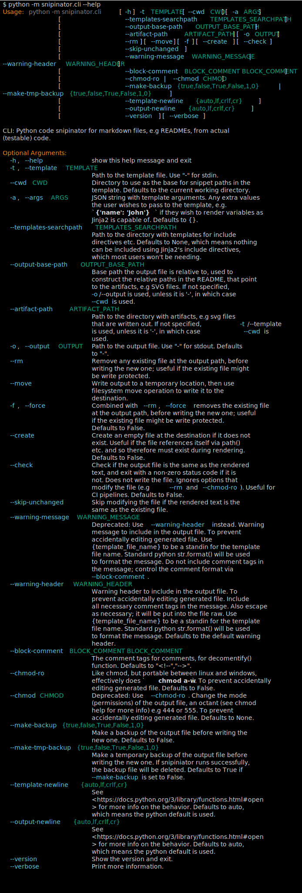

<!--

WARNING: This file is auto-generated. Do not edit directly.
SOURCE: `snipinator/examples/LONG-EXAMPLE.md.jinja2`.

-->
# A README

Here is a code snippet (global class):

````py
class MyClass:
  """This is a global class"""

  def __init__(self, name):
    self.name = name

  def MyClassMethod(self):
    """This is a method of MyClass"""
    print(self.name)
````

______________________________________________________________________

Here is a code snippet (class member method):

````py
  def MyClassMethod(self):
    """This is a method of MyClass"""
    print(self.name)
````

______________________________________________________________________

Same thing but just the signature:

````py
  def MyClassMethod(self):
    """This is a method of MyClass"""
````

______________________________________________________________________

Here is a code snippet (global method):

````py
async def GlobalMethod():
  """This is a global method"""
  print('Hello')
````

______________________________________________________________________

Here is a terminal snippet:

````shell
$ python -m snipinator.cli --help
Usage: python -m snipinator.cli [-h] -t TEMPLATE [--cwd CWD] [-a ARGS]
                                [--templates-searchpath TEMPLATES_SEARCHPATH]
                                [--rm | --no-rm] [-o OUTPUT]
                                [--warning-message WARNING_MESSAGE]
                                [--chmod CHMOD]

CLI: Python code snipinator for markdown files, e.g READMEs, from actual
(testable) code.

Options:
  -h, --help            show this help message and exit
  -t, --template TEMPLATE
                        Path to the template file. Use "-" for stdin.
  --cwd CWD             Directory to use as the base for snippet paths in the
                        template. Defaults to the current working directory.
  -a, --args ARGS       JSON string with template arguments. Any extra values
                        the user wishes to pass to the template, e.g.
                        `{'name': 'John'}` if they wish to render variables as
                        Jinja2 is capable of. Defaults to {}.
  --templates-searchpath TEMPLATES_SEARCHPATH
                        Path to the directory with templates for include
                        directives etc. Defaults to None.
  --rm, --no-rm         Remove any existing file at the output path, before
                        writing the new one; useful if the existing file might
                        be write protected. (default: False)
  -o, --output OUTPUT   Path to the output file. Use "-" for stdout. Defaults
                        to "-".
  --warning-message WARNING_MESSAGE
                        Warning message to include in the output file. To
                        prevent accidentally editing generated file. Defaults
                        to the default warning message.
  --chmod CHMOD         Change the mode (permissions) of the output file, an
                        octant (see chmod help for more info) e.g 444 or 555.
                        To prevent accidentally editing generated file.
                        Defaults to None.

````

______________________________________________________________________

Here is a terminal snippet with terminal colors (img tag external svg):

<!--
--><!-- -->

______________________________________________________________________

Here is a terminal snippet with terminal colors (img tag external svg), without
command included in the svg:

<!--
--><!-- -->

______________________________________________________________________

Here is a terminal snippet with terminal colors (img tag with svg data):

<!--
--><img src="data:image/svg+xml;base64,PD94bWwgdmVyc2lvbj0iMS4wIiA/Pgo8c3ZnIHhtbG5zPSJodHRwOi8vd3d3LnczLm9yZy8yMDAwL3N2ZyIgY2xhc3M9InJpY2gtdGVybWluYWwiIHZpZXdCb3g9IjAgMCA5OTQgOTUyLjgiPgo8IS0tIEdlbmVyYXRlZCB3aXRoIFJpY2ggdGV4dHVhbGl6ZS5pbyAtLT4KPHJlY3Qgd2lkdGg9IjEwMCUiIGhlaWdodD0iMTAwJSIgZmlsbD0idHJhbnNwYXJlbnQiLz4KPHN0eWxlPgpAZm9udC1mYWNlIHsKZm9udC1mYW1pbHk6ICZxdW90O0ZpcmEgQ29kZSZxdW90OzsKc3JjOiBsb2NhbCgmcXVvdDtGaXJhQ29kZS1SZWd1bGFyJnF1b3Q7KSwKdXJsKCZxdW90O2h0dHBzOi8vY2RuanMuY2xvdWRmbGFyZS5jb20vYWpheC9saWJzL2ZpcmFjb2RlLzYuMi4wL3dvZmYyL0ZpcmFDb2RlLVJlZ3VsYXIud29mZjImcXVvdDspIGZvcm1hdCgmcXVvdDt3b2ZmMiZxdW90OyksCnVybCgmcXVvdDtodHRwczovL2NkbmpzLmNsb3VkZmxhcmUuY29tL2FqYXgvbGlicy9maXJhY29kZS82LjIuMC93b2ZmL0ZpcmFDb2RlLVJlZ3VsYXIud29mZiZxdW90OykgZm9ybWF0KCZxdW90O3dvZmYmcXVvdDspOwpmb250LXN0eWxlOiBub3JtYWw7CmZvbnQtd2VpZ2h0OiA0MDA7Cn0KQGZvbnQtZmFjZSB7CmZvbnQtZmFtaWx5OiAmcXVvdDtGaXJhIENvZGUmcXVvdDs7CnNyYzogbG9jYWwoJnF1b3Q7RmlyYUNvZGUtQm9sZCZxdW90OyksCnVybCgmcXVvdDtodHRwczovL2NkbmpzLmNsb3VkZmxhcmUuY29tL2FqYXgvbGlicy9maXJhY29kZS82LjIuMC93b2ZmMi9GaXJhQ29kZS1Cb2xkLndvZmYyJnF1b3Q7KSBmb3JtYXQoJnF1b3Q7d29mZjImcXVvdDspLAp1cmwoJnF1b3Q7aHR0cHM6Ly9jZG5qcy5jbG91ZGZsYXJlLmNvbS9hamF4L2xpYnMvZmlyYWNvZGUvNi4yLjAvd29mZi9GaXJhQ29kZS1Cb2xkLndvZmYmcXVvdDspIGZvcm1hdCgmcXVvdDt3b2ZmJnF1b3Q7KTsKZm9udC1zdHlsZTogYm9sZDsKZm9udC13ZWlnaHQ6IDcwMDsKfQoudGVybWluYWwtMzIwMjY0NzU2OS1tYXRyaXggewpmb250LWZhbWlseTogRmlyYSBDb2RlLCBtb25vc3BhY2U7CmZvbnQtc2l6ZTogMjBweDsKbGluZS1oZWlnaHQ6IDI0LjRweDsKZm9udC12YXJpYW50LWVhc3QtYXNpYW46IGZ1bGwtd2lkdGg7Cn0KLnRlcm1pbmFsLTMyMDI2NDc1NjktdGl0bGUgewpmb250LXNpemU6IDE4cHg7CmZvbnQtd2VpZ2h0OiBib2xkOwpmb250LWZhbWlseTogYXJpYWw7Cn0KLnRlcm1pbmFsLTMyMDI2NDc1NjktcjEgeyBmaWxsOiAjZDlkOWQ5IH0KLnRlcm1pbmFsLTMyMDI2NDc1NjktcjIgeyBmaWxsOiAjZmY4NzAwIH0KLnRlcm1pbmFsLTMyMDI2NDc1NjktcjMgeyBmaWxsOiAjODA4MDgwIH0KLnRlcm1pbmFsLTMyMDI2NDc1NjktcjQgeyBmaWxsOiAjNThkMWViIH0KLnRlcm1pbmFsLTMyMDI2NDc1NjktcjUgeyBmaWxsOiAjMDBhZjg3IH0KLnRlcm1pbmFsLTMyMDI2NDc1NjktcjYgeyBmaWxsOiAjZDlkOWQ5O2ZvbnQtd2VpZ2h0OiBib2xkIH0KLnRlcm1pbmFsLTMyMDI2NDc1NjktcjcgeyBmaWxsOiAjZDlkOWQ5O2ZvbnQtc3R5bGU6IGl0YWxpYzsgfQo8L3N0eWxlPgo8ZGVmcz4KPGNsaXBQYXRoIGlkPSJ0ZXJtaW5hbC0zMjAyNjQ3NTY5LWNsaXAtdGVybWluYWwiPgo8cmVjdCB4PSIwIiB5PSIwIiB3aWR0aD0iOTc1LjAiIGhlaWdodD0iOTAxLjgiLz4KPC9jbGlwUGF0aD4KPGNsaXBQYXRoIGlkPSJ0ZXJtaW5hbC0zMjAyNjQ3NTY5LWxpbmUtMCI+CjxyZWN0IHg9IjAiIHk9IjEuNSIgd2lkdGg9Ijk3NiIgaGVpZ2h0PSIyNC42NSIvPgo8L2NsaXBQYXRoPgo8Y2xpcFBhdGggaWQ9InRlcm1pbmFsLTMyMDI2NDc1NjktbGluZS0xIj4KPHJlY3QgeD0iMCIgeT0iMjUuOSIgd2lkdGg9Ijk3NiIgaGVpZ2h0PSIyNC42NSIvPgo8L2NsaXBQYXRoPgo8Y2xpcFBhdGggaWQ9InRlcm1pbmFsLTMyMDI2NDc1NjktbGluZS0yIj4KPHJlY3QgeD0iMCIgeT0iNTAuMyIgd2lkdGg9Ijk3NiIgaGVpZ2h0PSIyNC42NSIvPgo8L2NsaXBQYXRoPgo8Y2xpcFBhdGggaWQ9InRlcm1pbmFsLTMyMDI2NDc1NjktbGluZS0zIj4KPHJlY3QgeD0iMCIgeT0iNzQuNyIgd2lkdGg9Ijk3NiIgaGVpZ2h0PSIyNC42NSIvPgo8L2NsaXBQYXRoPgo8Y2xpcFBhdGggaWQ9InRlcm1pbmFsLTMyMDI2NDc1NjktbGluZS00Ij4KPHJlY3QgeD0iMCIgeT0iOTkuMSIgd2lkdGg9Ijk3NiIgaGVpZ2h0PSIyNC42NSIvPgo8L2NsaXBQYXRoPgo8Y2xpcFBhdGggaWQ9InRlcm1pbmFsLTMyMDI2NDc1NjktbGluZS01Ij4KPHJlY3QgeD0iMCIgeT0iMTIzLjUiIHdpZHRoPSI5NzYiIGhlaWdodD0iMjQuNjUiLz4KPC9jbGlwUGF0aD4KPGNsaXBQYXRoIGlkPSJ0ZXJtaW5hbC0zMjAyNjQ3NTY5LWxpbmUtNiI+CjxyZWN0IHg9IjAiIHk9IjE0Ny45IiB3aWR0aD0iOTc2IiBoZWlnaHQ9IjI0LjY1Ii8+CjwvY2xpcFBhdGg+CjxjbGlwUGF0aCBpZD0idGVybWluYWwtMzIwMjY0NzU2OS1saW5lLTciPgo8cmVjdCB4PSIwIiB5PSIxNzIuMyIgd2lkdGg9Ijk3NiIgaGVpZ2h0PSIyNC42NSIvPgo8L2NsaXBQYXRoPgo8Y2xpcFBhdGggaWQ9InRlcm1pbmFsLTMyMDI2NDc1NjktbGluZS04Ij4KPHJlY3QgeD0iMCIgeT0iMTk2LjciIHdpZHRoPSI5NzYiIGhlaWdodD0iMjQuNjUiLz4KPC9jbGlwUGF0aD4KPGNsaXBQYXRoIGlkPSJ0ZXJtaW5hbC0zMjAyNjQ3NTY5LWxpbmUtOSI+CjxyZWN0IHg9IjAiIHk9IjIyMS4xIiB3aWR0aD0iOTc2IiBoZWlnaHQ9IjI0LjY1Ii8+CjwvY2xpcFBhdGg+CjxjbGlwUGF0aCBpZD0idGVybWluYWwtMzIwMjY0NzU2OS1saW5lLTEwIj4KPHJlY3QgeD0iMCIgeT0iMjQ1LjUiIHdpZHRoPSI5NzYiIGhlaWdodD0iMjQuNjUiLz4KPC9jbGlwUGF0aD4KPGNsaXBQYXRoIGlkPSJ0ZXJtaW5hbC0zMjAyNjQ3NTY5LWxpbmUtMTEiPgo8cmVjdCB4PSIwIiB5PSIyNjkuOSIgd2lkdGg9Ijk3NiIgaGVpZ2h0PSIyNC42NSIvPgo8L2NsaXBQYXRoPgo8Y2xpcFBhdGggaWQ9InRlcm1pbmFsLTMyMDI2NDc1NjktbGluZS0xMiI+CjxyZWN0IHg9IjAiIHk9IjI5NC4zIiB3aWR0aD0iOTc2IiBoZWlnaHQ9IjI0LjY1Ii8+CjwvY2xpcFBhdGg+CjxjbGlwUGF0aCBpZD0idGVybWluYWwtMzIwMjY0NzU2OS1saW5lLTEzIj4KPHJlY3QgeD0iMCIgeT0iMzE4LjciIHdpZHRoPSI5NzYiIGhlaWdodD0iMjQuNjUiLz4KPC9jbGlwUGF0aD4KPGNsaXBQYXRoIGlkPSJ0ZXJtaW5hbC0zMjAyNjQ3NTY5LWxpbmUtMTQiPgo8cmVjdCB4PSIwIiB5PSIzNDMuMSIgd2lkdGg9Ijk3NiIgaGVpZ2h0PSIyNC42NSIvPgo8L2NsaXBQYXRoPgo8Y2xpcFBhdGggaWQ9InRlcm1pbmFsLTMyMDI2NDc1NjktbGluZS0xNSI+CjxyZWN0IHg9IjAiIHk9IjM2Ny41IiB3aWR0aD0iOTc2IiBoZWlnaHQ9IjI0LjY1Ii8+CjwvY2xpcFBhdGg+CjxjbGlwUGF0aCBpZD0idGVybWluYWwtMzIwMjY0NzU2OS1saW5lLTE2Ij4KPHJlY3QgeD0iMCIgeT0iMzkxLjkiIHdpZHRoPSI5NzYiIGhlaWdodD0iMjQuNjUiLz4KPC9jbGlwUGF0aD4KPGNsaXBQYXRoIGlkPSJ0ZXJtaW5hbC0zMjAyNjQ3NTY5LWxpbmUtMTciPgo8cmVjdCB4PSIwIiB5PSI0MTYuMyIgd2lkdGg9Ijk3NiIgaGVpZ2h0PSIyNC42NSIvPgo8L2NsaXBQYXRoPgo8Y2xpcFBhdGggaWQ9InRlcm1pbmFsLTMyMDI2NDc1NjktbGluZS0xOCI+CjxyZWN0IHg9IjAiIHk9IjQ0MC43IiB3aWR0aD0iOTc2IiBoZWlnaHQ9IjI0LjY1Ii8+CjwvY2xpcFBhdGg+CjxjbGlwUGF0aCBpZD0idGVybWluYWwtMzIwMjY0NzU2OS1saW5lLTE5Ij4KPHJlY3QgeD0iMCIgeT0iNDY1LjEiIHdpZHRoPSI5NzYiIGhlaWdodD0iMjQuNjUiLz4KPC9jbGlwUGF0aD4KPGNsaXBQYXRoIGlkPSJ0ZXJtaW5hbC0zMjAyNjQ3NTY5LWxpbmUtMjAiPgo8cmVjdCB4PSIwIiB5PSI0ODkuNSIgd2lkdGg9Ijk3NiIgaGVpZ2h0PSIyNC42NSIvPgo8L2NsaXBQYXRoPgo8Y2xpcFBhdGggaWQ9InRlcm1pbmFsLTMyMDI2NDc1NjktbGluZS0yMSI+CjxyZWN0IHg9IjAiIHk9IjUxMy45IiB3aWR0aD0iOTc2IiBoZWlnaHQ9IjI0LjY1Ii8+CjwvY2xpcFBhdGg+CjxjbGlwUGF0aCBpZD0idGVybWluYWwtMzIwMjY0NzU2OS1saW5lLTIyIj4KPHJlY3QgeD0iMCIgeT0iNTM4LjMiIHdpZHRoPSI5NzYiIGhlaWdodD0iMjQuNjUiLz4KPC9jbGlwUGF0aD4KPGNsaXBQYXRoIGlkPSJ0ZXJtaW5hbC0zMjAyNjQ3NTY5LWxpbmUtMjMiPgo8cmVjdCB4PSIwIiB5PSI1NjIuNyIgd2lkdGg9Ijk3NiIgaGVpZ2h0PSIyNC42NSIvPgo8L2NsaXBQYXRoPgo8Y2xpcFBhdGggaWQ9InRlcm1pbmFsLTMyMDI2NDc1NjktbGluZS0yNCI+CjxyZWN0IHg9IjAiIHk9IjU4Ny4xIiB3aWR0aD0iOTc2IiBoZWlnaHQ9IjI0LjY1Ii8+CjwvY2xpcFBhdGg+CjxjbGlwUGF0aCBpZD0idGVybWluYWwtMzIwMjY0NzU2OS1saW5lLTI1Ij4KPHJlY3QgeD0iMCIgeT0iNjExLjUiIHdpZHRoPSI5NzYiIGhlaWdodD0iMjQuNjUiLz4KPC9jbGlwUGF0aD4KPGNsaXBQYXRoIGlkPSJ0ZXJtaW5hbC0zMjAyNjQ3NTY5LWxpbmUtMjYiPgo8cmVjdCB4PSIwIiB5PSI2MzUuOSIgd2lkdGg9Ijk3NiIgaGVpZ2h0PSIyNC42NSIvPgo8L2NsaXBQYXRoPgo8Y2xpcFBhdGggaWQ9InRlcm1pbmFsLTMyMDI2NDc1NjktbGluZS0yNyI+CjxyZWN0IHg9IjAiIHk9IjY2MC4zIiB3aWR0aD0iOTc2IiBoZWlnaHQ9IjI0LjY1Ii8+CjwvY2xpcFBhdGg+CjxjbGlwUGF0aCBpZD0idGVybWluYWwtMzIwMjY0NzU2OS1saW5lLTI4Ij4KPHJlY3QgeD0iMCIgeT0iNjg0LjciIHdpZHRoPSI5NzYiIGhlaWdodD0iMjQuNjUiLz4KPC9jbGlwUGF0aD4KPGNsaXBQYXRoIGlkPSJ0ZXJtaW5hbC0zMjAyNjQ3NTY5LWxpbmUtMjkiPgo8cmVjdCB4PSIwIiB5PSI3MDkuMSIgd2lkdGg9Ijk3NiIgaGVpZ2h0PSIyNC42NSIvPgo8L2NsaXBQYXRoPgo8Y2xpcFBhdGggaWQ9InRlcm1pbmFsLTMyMDI2NDc1NjktbGluZS0zMCI+CjxyZWN0IHg9IjAiIHk9IjczMy41IiB3aWR0aD0iOTc2IiBoZWlnaHQ9IjI0LjY1Ii8+CjwvY2xpcFBhdGg+CjxjbGlwUGF0aCBpZD0idGVybWluYWwtMzIwMjY0NzU2OS1saW5lLTMxIj4KPHJlY3QgeD0iMCIgeT0iNzU3LjkiIHdpZHRoPSI5NzYiIGhlaWdodD0iMjQuNjUiLz4KPC9jbGlwUGF0aD4KPGNsaXBQYXRoIGlkPSJ0ZXJtaW5hbC0zMjAyNjQ3NTY5LWxpbmUtMzIiPgo8cmVjdCB4PSIwIiB5PSI3ODIuMyIgd2lkdGg9Ijk3NiIgaGVpZ2h0PSIyNC42NSIvPgo8L2NsaXBQYXRoPgo8Y2xpcFBhdGggaWQ9InRlcm1pbmFsLTMyMDI2NDc1NjktbGluZS0zMyI+CjxyZWN0IHg9IjAiIHk9IjgwNi43IiB3aWR0aD0iOTc2IiBoZWlnaHQ9IjI0LjY1Ii8+CjwvY2xpcFBhdGg+CjxjbGlwUGF0aCBpZD0idGVybWluYWwtMzIwMjY0NzU2OS1saW5lLTM0Ij4KPHJlY3QgeD0iMCIgeT0iODMxLjEiIHdpZHRoPSI5NzYiIGhlaWdodD0iMjQuNjUiLz4KPC9jbGlwUGF0aD4KPGNsaXBQYXRoIGlkPSJ0ZXJtaW5hbC0zMjAyNjQ3NTY5LWxpbmUtMzUiPgo8cmVjdCB4PSIwIiB5PSI4NTUuNSIgd2lkdGg9Ijk3NiIgaGVpZ2h0PSIyNC42NSIvPgo8L2NsaXBQYXRoPgo8L2RlZnM+CjxnIHRyYW5zZm9ybT0idHJhbnNsYXRlKDksIDApIj4KPGcgY2xhc3M9InRlcm1pbmFsLTMyMDI2NDc1NjktbWF0cml4Ij4KPHRleHQgY2xhc3M9InRlcm1pbmFsLTMyMDI2NDc1NjktcjEiIHg9IjAiIHk9IjIwIiB0ZXh0TGVuZ3RoPSI0MDIuNiIgY2xpcC1wYXRoPSJ1cmwoI3Rlcm1pbmFsLTMyMDI2NDc1NjktbGluZS0wKSI+JMKgcHl0aG9uwqAtbcKgc25pcGluYXRvci5jbGnCoC0taGVscDwvdGV4dD4KPHRleHQgY2xhc3M9InRlcm1pbmFsLTMyMDI2NDc1NjktcjEiIHg9Ijk3NiIgeT0iMjAiIHRleHRMZW5ndGg9IjEyLjIiIGNsaXAtcGF0aD0idXJsKCN0ZXJtaW5hbC0zMjAyNjQ3NTY5LWxpbmUtMCkiPgo8L3RleHQ+Cjx0ZXh0IGNsYXNzPSJ0ZXJtaW5hbC0zMjAyNjQ3NTY5LXIyIiB4PSIwIiB5PSI0NC40IiB0ZXh0TGVuZ3RoPSI3My4yIiBjbGlwLXBhdGg9InVybCgjdGVybWluYWwtMzIwMjY0NzU2OS1saW5lLTEpIj5Vc2FnZTo8L3RleHQ+Cjx0ZXh0IGNsYXNzPSJ0ZXJtaW5hbC0zMjAyNjQ3NTY5LXIzIiB4PSI4NS40IiB5PSI0NC40IiB0ZXh0TGVuZ3RoPSIyOTIuOCIgY2xpcC1wYXRoPSJ1cmwoI3Rlcm1pbmFsLTMyMDI2NDc1NjktbGluZS0xKSI+cHl0aG9uwqAtbcKgc25pcGluYXRvci5jbGk8L3RleHQ+Cjx0ZXh0IGNsYXNzPSJ0ZXJtaW5hbC0zMjAyNjQ3NTY5LXIxIiB4PSIzNzguMiIgeT0iNDQuNCIgdGV4dExlbmd0aD0iMjQuNCIgY2xpcC1wYXRoPSJ1cmwoI3Rlcm1pbmFsLTMyMDI2NDc1NjktbGluZS0xKSI+wqBbPC90ZXh0Pgo8dGV4dCBjbGFzcz0idGVybWluYWwtMzIwMjY0NzU2OS1yNCIgeD0iNDAyLjYiIHk9IjQ0LjQiIHRleHRMZW5ndGg9IjI0LjQiIGNsaXAtcGF0aD0idXJsKCN0ZXJtaW5hbC0zMjAyNjQ3NTY5LWxpbmUtMSkiPi1oPC90ZXh0Pgo8dGV4dCBjbGFzcz0idGVybWluYWwtMzIwMjY0NzU2OS1yMSIgeD0iNDI3IiB5PSI0NC40IiB0ZXh0TGVuZ3RoPSIyNC40IiBjbGlwLXBhdGg9InVybCgjdGVybWluYWwtMzIwMjY0NzU2OS1saW5lLTEpIj5dwqA8L3RleHQ+Cjx0ZXh0IGNsYXNzPSJ0ZXJtaW5hbC0zMjAyNjQ3NTY5LXI0IiB4PSI0NTEuNCIgeT0iNDQuNCIgdGV4dExlbmd0aD0iMjQuNCIgY2xpcC1wYXRoPSJ1cmwoI3Rlcm1pbmFsLTMyMDI2NDc1NjktbGluZS0xKSI+LXQ8L3RleHQ+Cjx0ZXh0IGNsYXNzPSJ0ZXJtaW5hbC0zMjAyNjQ3NTY5LXI1IiB4PSI0ODgiIHk9IjQ0LjQiIHRleHRMZW5ndGg9Ijk3LjYiIGNsaXAtcGF0aD0idXJsKCN0ZXJtaW5hbC0zMjAyNjQ3NTY5LWxpbmUtMSkiPlRFTVBMQVRFPC90ZXh0Pgo8dGV4dCBjbGFzcz0idGVybWluYWwtMzIwMjY0NzU2OS1yMSIgeD0iNTg1LjYiIHk9IjQ0LjQiIHRleHRMZW5ndGg9IjI0LjQiIGNsaXAtcGF0aD0idXJsKCN0ZXJtaW5hbC0zMjAyNjQ3NTY5LWxpbmUtMSkiPsKgWzwvdGV4dD4KPHRleHQgY2xhc3M9InRlcm1pbmFsLTMyMDI2NDc1NjktcjQiIHg9IjYxMCIgeT0iNDQuNCIgdGV4dExlbmd0aD0iNjEiIGNsaXAtcGF0aD0idXJsKCN0ZXJtaW5hbC0zMjAyNjQ3NTY5LWxpbmUtMSkiPi0tY3dkPC90ZXh0Pgo8dGV4dCBjbGFzcz0idGVybWluYWwtMzIwMjY0NzU2OS1yNSIgeD0iNjgzLjIiIHk9IjQ0LjQiIHRleHRMZW5ndGg9IjM2LjYiIGNsaXAtcGF0aD0idXJsKCN0ZXJtaW5hbC0zMjAyNjQ3NTY5LWxpbmUtMSkiPkNXRDwvdGV4dD4KPHRleHQgY2xhc3M9InRlcm1pbmFsLTMyMDI2NDc1NjktcjEiIHg9IjcxOS44IiB5PSI0NC40IiB0ZXh0TGVuZ3RoPSIzNi42IiBjbGlwLXBhdGg9InVybCgjdGVybWluYWwtMzIwMjY0NzU2OS1saW5lLTEpIj5dwqBbPC90ZXh0Pgo8dGV4dCBjbGFzcz0idGVybWluYWwtMzIwMjY0NzU2OS1yNCIgeD0iNzU2LjQiIHk9IjQ0LjQiIHRleHRMZW5ndGg9IjI0LjQiIGNsaXAtcGF0aD0idXJsKCN0ZXJtaW5hbC0zMjAyNjQ3NTY5LWxpbmUtMSkiPi1hPC90ZXh0Pgo8dGV4dCBjbGFzcz0idGVybWluYWwtMzIwMjY0NzU2OS1yNSIgeD0iNzkzIiB5PSI0NC40IiB0ZXh0TGVuZ3RoPSI0OC44IiBjbGlwLXBhdGg9InVybCgjdGVybWluYWwtMzIwMjY0NzU2OS1saW5lLTEpIj5BUkdTPC90ZXh0Pgo8dGV4dCBjbGFzcz0idGVybWluYWwtMzIwMjY0NzU2OS1yMSIgeD0iODQxLjgiIHk9IjQ0LjQiIHRleHRMZW5ndGg9IjEyLjIiIGNsaXAtcGF0aD0idXJsKCN0ZXJtaW5hbC0zMjAyNjQ3NTY5LWxpbmUtMSkiPl08L3RleHQ+Cjx0ZXh0IGNsYXNzPSJ0ZXJtaW5hbC0zMjAyNjQ3NTY5LXIxIiB4PSI5NzYiIHk9IjQ0LjQiIHRleHRMZW5ndGg9IjEyLjIiIGNsaXAtcGF0aD0idXJsKCN0ZXJtaW5hbC0zMjAyNjQ3NTY5LWxpbmUtMSkiPgo8L3RleHQ+Cjx0ZXh0IGNsYXNzPSJ0ZXJtaW5hbC0zMjAyNjQ3NTY5LXIxIiB4PSIwIiB5PSI2OC44IiB0ZXh0TGVuZ3RoPSI0MDIuNiIgY2xpcC1wYXRoPSJ1cmwoI3Rlcm1pbmFsLTMyMDI2NDc1NjktbGluZS0yKSI+wqDCoMKgwqDCoMKgwqDCoMKgwqDCoMKgwqDCoMKgwqDCoMKgwqDCoMKgwqDCoMKgwqDCoMKgwqDCoMKgwqDCoFs8L3RleHQ+Cjx0ZXh0IGNsYXNzPSJ0ZXJtaW5hbC0zMjAyNjQ3NTY5LXI0IiB4PSI0MDIuNiIgeT0iNjguOCIgdGV4dExlbmd0aD0iMjY4LjQiIGNsaXAtcGF0aD0idXJsKCN0ZXJtaW5hbC0zMjAyNjQ3NTY5LWxpbmUtMikiPi0tdGVtcGxhdGVzLXNlYXJjaHBhdGg8L3RleHQ+Cjx0ZXh0IGNsYXNzPSJ0ZXJtaW5hbC0zMjAyNjQ3NTY5LXI1IiB4PSI2ODMuMiIgeT0iNjguOCIgdGV4dExlbmd0aD0iMjQ0IiBjbGlwLXBhdGg9InVybCgjdGVybWluYWwtMzIwMjY0NzU2OS1saW5lLTIpIj5URU1QTEFURVNfU0VBUkNIUEFUSDwvdGV4dD4KPHRleHQgY2xhc3M9InRlcm1pbmFsLTMyMDI2NDc1NjktcjEiIHg9IjkyNy4yIiB5PSI2OC44IiB0ZXh0TGVuZ3RoPSIxMi4yIiBjbGlwLXBhdGg9InVybCgjdGVybWluYWwtMzIwMjY0NzU2OS1saW5lLTIpIj5dPC90ZXh0Pgo8dGV4dCBjbGFzcz0idGVybWluYWwtMzIwMjY0NzU2OS1yMSIgeD0iOTc2IiB5PSI2OC44IiB0ZXh0TGVuZ3RoPSIxMi4yIiBjbGlwLXBhdGg9InVybCgjdGVybWluYWwtMzIwMjY0NzU2OS1saW5lLTIpIj4KPC90ZXh0Pgo8dGV4dCBjbGFzcz0idGVybWluYWwtMzIwMjY0NzU2OS1yMSIgeD0iMCIgeT0iOTMuMiIgdGV4dExlbmd0aD0iNDAyLjYiIGNsaXAtcGF0aD0idXJsKCN0ZXJtaW5hbC0zMjAyNjQ3NTY5LWxpbmUtMykiPsKgwqDCoMKgwqDCoMKgwqDCoMKgwqDCoMKgwqDCoMKgwqDCoMKgwqDCoMKgwqDCoMKgwqDCoMKgwqDCoMKgwqBbPC90ZXh0Pgo8dGV4dCBjbGFzcz0idGVybWluYWwtMzIwMjY0NzU2OS1yNCIgeD0iNDAyLjYiIHk9IjkzLjIiIHRleHRMZW5ndGg9IjQ4LjgiIGNsaXAtcGF0aD0idXJsKCN0ZXJtaW5hbC0zMjAyNjQ3NTY5LWxpbmUtMykiPi0tcm08L3RleHQ+Cjx0ZXh0IGNsYXNzPSJ0ZXJtaW5hbC0zMjAyNjQ3NTY5LXIxIiB4PSI0NTEuNCIgeT0iOTMuMiIgdGV4dExlbmd0aD0iMzYuNiIgY2xpcC1wYXRoPSJ1cmwoI3Rlcm1pbmFsLTMyMDI2NDc1NjktbGluZS0zKSI+wqB8wqA8L3RleHQ+Cjx0ZXh0IGNsYXNzPSJ0ZXJtaW5hbC0zMjAyNjQ3NTY5LXI0IiB4PSI0ODgiIHk9IjkzLjIiIHRleHRMZW5ndGg9Ijg1LjQiIGNsaXAtcGF0aD0idXJsKCN0ZXJtaW5hbC0zMjAyNjQ3NTY5LWxpbmUtMykiPi0tbm8tcm08L3RleHQ+Cjx0ZXh0IGNsYXNzPSJ0ZXJtaW5hbC0zMjAyNjQ3NTY5LXIxIiB4PSI1NzMuNCIgeT0iOTMuMiIgdGV4dExlbmd0aD0iMzYuNiIgY2xpcC1wYXRoPSJ1cmwoI3Rlcm1pbmFsLTMyMDI2NDc1NjktbGluZS0zKSI+XcKgWzwvdGV4dD4KPHRleHQgY2xhc3M9InRlcm1pbmFsLTMyMDI2NDc1NjktcjQiIHg9IjYxMCIgeT0iOTMuMiIgdGV4dExlbmd0aD0iMjQuNCIgY2xpcC1wYXRoPSJ1cmwoI3Rlcm1pbmFsLTMyMDI2NDc1NjktbGluZS0zKSI+LW88L3RleHQ+Cjx0ZXh0IGNsYXNzPSJ0ZXJtaW5hbC0zMjAyNjQ3NTY5LXI1IiB4PSI2NDYuNiIgeT0iOTMuMiIgdGV4dExlbmd0aD0iNzMuMiIgY2xpcC1wYXRoPSJ1cmwoI3Rlcm1pbmFsLTMyMDI2NDc1NjktbGluZS0zKSI+T1VUUFVUPC90ZXh0Pgo8dGV4dCBjbGFzcz0idGVybWluYWwtMzIwMjY0NzU2OS1yMSIgeD0iNzE5LjgiIHk9IjkzLjIiIHRleHRMZW5ndGg9IjEyLjIiIGNsaXAtcGF0aD0idXJsKCN0ZXJtaW5hbC0zMjAyNjQ3NTY5LWxpbmUtMykiPl08L3RleHQ+Cjx0ZXh0IGNsYXNzPSJ0ZXJtaW5hbC0zMjAyNjQ3NTY5LXIxIiB4PSI5NzYiIHk9IjkzLjIiIHRleHRMZW5ndGg9IjEyLjIiIGNsaXAtcGF0aD0idXJsKCN0ZXJtaW5hbC0zMjAyNjQ3NTY5LWxpbmUtMykiPgo8L3RleHQ+Cjx0ZXh0IGNsYXNzPSJ0ZXJtaW5hbC0zMjAyNjQ3NTY5LXIxIiB4PSIwIiB5PSIxMTcuNiIgdGV4dExlbmd0aD0iNDAyLjYiIGNsaXAtcGF0aD0idXJsKCN0ZXJtaW5hbC0zMjAyNjQ3NTY5LWxpbmUtNCkiPsKgwqDCoMKgwqDCoMKgwqDCoMKgwqDCoMKgwqDCoMKgwqDCoMKgwqDCoMKgwqDCoMKgwqDCoMKgwqDCoMKgwqBbPC90ZXh0Pgo8dGV4dCBjbGFzcz0idGVybWluYWwtMzIwMjY0NzU2OS1yNCIgeD0iNDAyLjYiIHk9IjExNy42IiB0ZXh0TGVuZ3RoPSIyMDcuNCIgY2xpcC1wYXRoPSJ1cmwoI3Rlcm1pbmFsLTMyMDI2NDc1NjktbGluZS00KSI+LS13YXJuaW5nLW1lc3NhZ2U8L3RleHQ+Cjx0ZXh0IGNsYXNzPSJ0ZXJtaW5hbC0zMjAyNjQ3NTY5LXI1IiB4PSI2MjIuMiIgeT0iMTE3LjYiIHRleHRMZW5ndGg9IjE4MyIgY2xpcC1wYXRoPSJ1cmwoI3Rlcm1pbmFsLTMyMDI2NDc1NjktbGluZS00KSI+V0FSTklOR19NRVNTQUdFPC90ZXh0Pgo8dGV4dCBjbGFzcz0idGVybWluYWwtMzIwMjY0NzU2OS1yMSIgeD0iODA1LjIiIHk9IjExNy42IiB0ZXh0TGVuZ3RoPSIxMi4yIiBjbGlwLXBhdGg9InVybCgjdGVybWluYWwtMzIwMjY0NzU2OS1saW5lLTQpIj5dPC90ZXh0Pgo8dGV4dCBjbGFzcz0idGVybWluYWwtMzIwMjY0NzU2OS1yMSIgeD0iOTc2IiB5PSIxMTcuNiIgdGV4dExlbmd0aD0iMTIuMiIgY2xpcC1wYXRoPSJ1cmwoI3Rlcm1pbmFsLTMyMDI2NDc1NjktbGluZS00KSI+CjwvdGV4dD4KPHRleHQgY2xhc3M9InRlcm1pbmFsLTMyMDI2NDc1NjktcjEiIHg9IjAiIHk9IjE0MiIgdGV4dExlbmd0aD0iNDAyLjYiIGNsaXAtcGF0aD0idXJsKCN0ZXJtaW5hbC0zMjAyNjQ3NTY5LWxpbmUtNSkiPsKgwqDCoMKgwqDCoMKgwqDCoMKgwqDCoMKgwqDCoMKgwqDCoMKgwqDCoMKgwqDCoMKgwqDCoMKgwqDCoMKgwqBbPC90ZXh0Pgo8dGV4dCBjbGFzcz0idGVybWluYWwtMzIwMjY0NzU2OS1yNCIgeD0iNDAyLjYiIHk9IjE0MiIgdGV4dExlbmd0aD0iODUuNCIgY2xpcC1wYXRoPSJ1cmwoI3Rlcm1pbmFsLTMyMDI2NDc1NjktbGluZS01KSI+LS1jaG1vZDwvdGV4dD4KPHRleHQgY2xhc3M9InRlcm1pbmFsLTMyMDI2NDc1NjktcjUiIHg9IjUwMC4yIiB5PSIxNDIiIHRleHRMZW5ndGg9IjYxIiBjbGlwLXBhdGg9InVybCgjdGVybWluYWwtMzIwMjY0NzU2OS1saW5lLTUpIj5DSE1PRDwvdGV4dD4KPHRleHQgY2xhc3M9InRlcm1pbmFsLTMyMDI2NDc1NjktcjEiIHg9IjU2MS4yIiB5PSIxNDIiIHRleHRMZW5ndGg9IjEyLjIiIGNsaXAtcGF0aD0idXJsKCN0ZXJtaW5hbC0zMjAyNjQ3NTY5LWxpbmUtNSkiPl08L3RleHQ+Cjx0ZXh0IGNsYXNzPSJ0ZXJtaW5hbC0zMjAyNjQ3NTY5LXIxIiB4PSI5NzYiIHk9IjE0MiIgdGV4dExlbmd0aD0iMTIuMiIgY2xpcC1wYXRoPSJ1cmwoI3Rlcm1pbmFsLTMyMDI2NDc1NjktbGluZS01KSI+CjwvdGV4dD4KPHRleHQgY2xhc3M9InRlcm1pbmFsLTMyMDI2NDc1NjktcjEiIHg9Ijk3NiIgeT0iMTY2LjQiIHRleHRMZW5ndGg9IjEyLjIiIGNsaXAtcGF0aD0idXJsKCN0ZXJtaW5hbC0zMjAyNjQ3NTY5LWxpbmUtNikiPgo8L3RleHQ+Cjx0ZXh0IGNsYXNzPSJ0ZXJtaW5hbC0zMjAyNjQ3NTY5LXIxIiB4PSIwIiB5PSIxOTAuOCIgdGV4dExlbmd0aD0iODc4LjQiIGNsaXAtcGF0aD0idXJsKCN0ZXJtaW5hbC0zMjAyNjQ3NTY5LWxpbmUtNykiPkNMSTrCoFB5dGhvbsKgY29kZcKgc25pcGluYXRvcsKgZm9ywqBtYXJrZG93bsKgZmlsZXMswqBlLmfCoFJFQURNRXMswqBmcm9twqBhY3R1YWw8L3RleHQ+Cjx0ZXh0IGNsYXNzPSJ0ZXJtaW5hbC0zMjAyNjQ3NTY5LXIxIiB4PSI5NzYiIHk9IjE5MC44IiB0ZXh0TGVuZ3RoPSIxMi4yIiBjbGlwLXBhdGg9InVybCgjdGVybWluYWwtMzIwMjY0NzU2OS1saW5lLTcpIj4KPC90ZXh0Pgo8dGV4dCBjbGFzcz0idGVybWluYWwtMzIwMjY0NzU2OS1yMSIgeD0iMCIgeT0iMjE1LjIiIHRleHRMZW5ndGg9IjE5NS4yIiBjbGlwLXBhdGg9InVybCgjdGVybWluYWwtMzIwMjY0NzU2OS1saW5lLTgpIj4odGVzdGFibGUpwqBjb2RlLjwvdGV4dD4KPHRleHQgY2xhc3M9InRlcm1pbmFsLTMyMDI2NDc1NjktcjEiIHg9Ijk3NiIgeT0iMjE1LjIiIHRleHRMZW5ndGg9IjEyLjIiIGNsaXAtcGF0aD0idXJsKCN0ZXJtaW5hbC0zMjAyNjQ3NTY5LWxpbmUtOCkiPgo8L3RleHQ+Cjx0ZXh0IGNsYXNzPSJ0ZXJtaW5hbC0zMjAyNjQ3NTY5LXIxIiB4PSI5NzYiIHk9IjIzOS42IiB0ZXh0TGVuZ3RoPSIxMi4yIiBjbGlwLXBhdGg9InVybCgjdGVybWluYWwtMzIwMjY0NzU2OS1saW5lLTkpIj4KPC90ZXh0Pgo8dGV4dCBjbGFzcz0idGVybWluYWwtMzIwMjY0NzU2OS1yMiIgeD0iMCIgeT0iMjY0IiB0ZXh0TGVuZ3RoPSI5Ny42IiBjbGlwLXBhdGg9InVybCgjdGVybWluYWwtMzIwMjY0NzU2OS1saW5lLTEwKSI+T3B0aW9uczo8L3RleHQ+Cjx0ZXh0IGNsYXNzPSJ0ZXJtaW5hbC0zMjAyNjQ3NTY5LXIxIiB4PSI5NzYiIHk9IjI2NCIgdGV4dExlbmd0aD0iMTIuMiIgY2xpcC1wYXRoPSJ1cmwoI3Rlcm1pbmFsLTMyMDI2NDc1NjktbGluZS0xMCkiPgo8L3RleHQ+Cjx0ZXh0IGNsYXNzPSJ0ZXJtaW5hbC0zMjAyNjQ3NTY5LXI0IiB4PSIyNC40IiB5PSIyODguNCIgdGV4dExlbmd0aD0iMjQuNCIgY2xpcC1wYXRoPSJ1cmwoI3Rlcm1pbmFsLTMyMDI2NDc1NjktbGluZS0xMSkiPi1oPC90ZXh0Pgo8dGV4dCBjbGFzcz0idGVybWluYWwtMzIwMjY0NzU2OS1yMSIgeD0iNDguOCIgeT0iMjg4LjQiIHRleHRMZW5ndGg9IjI0LjQiIGNsaXAtcGF0aD0idXJsKCN0ZXJtaW5hbC0zMjAyNjQ3NTY5LWxpbmUtMTEpIj4swqA8L3RleHQ+Cjx0ZXh0IGNsYXNzPSJ0ZXJtaW5hbC0zMjAyNjQ3NTY5LXI0IiB4PSI3My4yIiB5PSIyODguNCIgdGV4dExlbmd0aD0iNzMuMiIgY2xpcC1wYXRoPSJ1cmwoI3Rlcm1pbmFsLTMyMDI2NDc1NjktbGluZS0xMSkiPi0taGVscDwvdGV4dD4KPHRleHQgY2xhc3M9InRlcm1pbmFsLTMyMDI2NDc1NjktcjEiIHg9IjI5Mi44IiB5PSIyODguNCIgdGV4dExlbmd0aD0iMzc4LjIiIGNsaXAtcGF0aD0idXJsKCN0ZXJtaW5hbC0zMjAyNjQ3NTY5LWxpbmUtMTEpIj5zaG93wqB0aGlzwqBoZWxwwqBtZXNzYWdlwqBhbmTCoGV4aXQ8L3RleHQ+Cjx0ZXh0IGNsYXNzPSJ0ZXJtaW5hbC0zMjAyNjQ3NTY5LXIxIiB4PSI5NzYiIHk9IjI4OC40IiB0ZXh0TGVuZ3RoPSIxMi4yIiBjbGlwLXBhdGg9InVybCgjdGVybWluYWwtMzIwMjY0NzU2OS1saW5lLTExKSI+CjwvdGV4dD4KPHRleHQgY2xhc3M9InRlcm1pbmFsLTMyMDI2NDc1NjktcjQiIHg9IjI0LjQiIHk9IjMxMi44IiB0ZXh0TGVuZ3RoPSIyNC40IiBjbGlwLXBhdGg9InVybCgjdGVybWluYWwtMzIwMjY0NzU2OS1saW5lLTEyKSI+LXQ8L3RleHQ+Cjx0ZXh0IGNsYXNzPSJ0ZXJtaW5hbC0zMjAyNjQ3NTY5LXIxIiB4PSI0OC44IiB5PSIzMTIuOCIgdGV4dExlbmd0aD0iMjQuNCIgY2xpcC1wYXRoPSJ1cmwoI3Rlcm1pbmFsLTMyMDI2NDc1NjktbGluZS0xMikiPizCoDwvdGV4dD4KPHRleHQgY2xhc3M9InRlcm1pbmFsLTMyMDI2NDc1NjktcjQiIHg9IjczLjIiIHk9IjMxMi44IiB0ZXh0TGVuZ3RoPSIxMjIiIGNsaXAtcGF0aD0idXJsKCN0ZXJtaW5hbC0zMjAyNjQ3NTY5LWxpbmUtMTIpIj4tLXRlbXBsYXRlPC90ZXh0Pgo8dGV4dCBjbGFzcz0idGVybWluYWwtMzIwMjY0NzU2OS1yNSIgeD0iMjA3LjQiIHk9IjMxMi44IiB0ZXh0TGVuZ3RoPSI5Ny42IiBjbGlwLXBhdGg9InVybCgjdGVybWluYWwtMzIwMjY0NzU2OS1saW5lLTEyKSI+VEVNUExBVEU8L3RleHQ+Cjx0ZXh0IGNsYXNzPSJ0ZXJtaW5hbC0zMjAyNjQ3NTY5LXIxIiB4PSI5NzYiIHk9IjMxMi44IiB0ZXh0TGVuZ3RoPSIxMi4yIiBjbGlwLXBhdGg9InVybCgjdGVybWluYWwtMzIwMjY0NzU2OS1saW5lLTEyKSI+CjwvdGV4dD4KPHRleHQgY2xhc3M9InRlcm1pbmFsLTMyMDI2NDc1NjktcjEiIHg9IjI5Mi44IiB5PSIzMzcuMiIgdGV4dExlbmd0aD0iNTQ5IiBjbGlwLXBhdGg9InVybCgjdGVybWluYWwtMzIwMjY0NzU2OS1saW5lLTEzKSI+UGF0aMKgdG/CoHRoZcKgdGVtcGxhdGXCoGZpbGUuwqBVc2XCoCZxdW90Oy0mcXVvdDvCoGZvcsKgc3RkaW4uPC90ZXh0Pgo8dGV4dCBjbGFzcz0idGVybWluYWwtMzIwMjY0NzU2OS1yMSIgeD0iOTc2IiB5PSIzMzcuMiIgdGV4dExlbmd0aD0iMTIuMiIgY2xpcC1wYXRoPSJ1cmwoI3Rlcm1pbmFsLTMyMDI2NDc1NjktbGluZS0xMykiPgo8L3RleHQ+Cjx0ZXh0IGNsYXNzPSJ0ZXJtaW5hbC0zMjAyNjQ3NTY5LXI0IiB4PSIyNC40IiB5PSIzNjEuNiIgdGV4dExlbmd0aD0iNjEiIGNsaXAtcGF0aD0idXJsKCN0ZXJtaW5hbC0zMjAyNjQ3NTY5LWxpbmUtMTQpIj4tLWN3ZDwvdGV4dD4KPHRleHQgY2xhc3M9InRlcm1pbmFsLTMyMDI2NDc1NjktcjUiIHg9Ijk3LjYiIHk9IjM2MS42IiB0ZXh0TGVuZ3RoPSIzNi42IiBjbGlwLXBhdGg9InVybCgjdGVybWluYWwtMzIwMjY0NzU2OS1saW5lLTE0KSI+Q1dEPC90ZXh0Pgo8dGV4dCBjbGFzcz0idGVybWluYWwtMzIwMjY0NzU2OS1yMSIgeD0iMjkyLjgiIHk9IjM2MS42IiB0ZXh0TGVuZ3RoPSI2NDYuNiIgY2xpcC1wYXRoPSJ1cmwoI3Rlcm1pbmFsLTMyMDI2NDc1NjktbGluZS0xNCkiPkRpcmVjdG9yecKgdG/CoHVzZcKgYXPCoHRoZcKgYmFzZcKgZm9ywqBzbmlwcGV0wqBwYXRoc8KgaW7CoHRoZTwvdGV4dD4KPHRleHQgY2xhc3M9InRlcm1pbmFsLTMyMDI2NDc1NjktcjEiIHg9Ijk3NiIgeT0iMzYxLjYiIHRleHRMZW5ndGg9IjEyLjIiIGNsaXAtcGF0aD0idXJsKCN0ZXJtaW5hbC0zMjAyNjQ3NTY5LWxpbmUtMTQpIj4KPC90ZXh0Pgo8dGV4dCBjbGFzcz0idGVybWluYWwtMzIwMjY0NzU2OS1yMSIgeD0iMjkyLjgiIHk9IjM4NiIgdGV4dExlbmd0aD0iNjM0LjQiIGNsaXAtcGF0aD0idXJsKCN0ZXJtaW5hbC0zMjAyNjQ3NTY5LWxpbmUtMTUpIj50ZW1wbGF0ZS7CoERlZmF1bHRzwqB0b8KgdGhlwqBjdXJyZW50wqB3b3JraW5nwqBkaXJlY3RvcnkuPC90ZXh0Pgo8dGV4dCBjbGFzcz0idGVybWluYWwtMzIwMjY0NzU2OS1yMSIgeD0iOTc2IiB5PSIzODYiIHRleHRMZW5ndGg9IjEyLjIiIGNsaXAtcGF0aD0idXJsKCN0ZXJtaW5hbC0zMjAyNjQ3NTY5LWxpbmUtMTUpIj4KPC90ZXh0Pgo8dGV4dCBjbGFzcz0idGVybWluYWwtMzIwMjY0NzU2OS1yNCIgeD0iMjQuNCIgeT0iNDEwLjQiIHRleHRMZW5ndGg9IjI0LjQiIGNsaXAtcGF0aD0idXJsKCN0ZXJtaW5hbC0zMjAyNjQ3NTY5LWxpbmUtMTYpIj4tYTwvdGV4dD4KPHRleHQgY2xhc3M9InRlcm1pbmFsLTMyMDI2NDc1NjktcjEiIHg9IjQ4LjgiIHk9IjQxMC40IiB0ZXh0TGVuZ3RoPSIyNC40IiBjbGlwLXBhdGg9InVybCgjdGVybWluYWwtMzIwMjY0NzU2OS1saW5lLTE2KSI+LMKgPC90ZXh0Pgo8dGV4dCBjbGFzcz0idGVybWluYWwtMzIwMjY0NzU2OS1yNCIgeD0iNzMuMiIgeT0iNDEwLjQiIHRleHRMZW5ndGg9IjczLjIiIGNsaXAtcGF0aD0idXJsKCN0ZXJtaW5hbC0zMjAyNjQ3NTY5LWxpbmUtMTYpIj4tLWFyZ3M8L3RleHQ+Cjx0ZXh0IGNsYXNzPSJ0ZXJtaW5hbC0zMjAyNjQ3NTY5LXI1IiB4PSIxNTguNiIgeT0iNDEwLjQiIHRleHRMZW5ndGg9IjQ4LjgiIGNsaXAtcGF0aD0idXJsKCN0ZXJtaW5hbC0zMjAyNjQ3NTY5LWxpbmUtMTYpIj5BUkdTPC90ZXh0Pgo8dGV4dCBjbGFzcz0idGVybWluYWwtMzIwMjY0NzU2OS1yMSIgeD0iMjkyLjgiIHk9IjQxMC40IiB0ZXh0TGVuZ3RoPSI2NDYuNiIgY2xpcC1wYXRoPSJ1cmwoI3Rlcm1pbmFsLTMyMDI2NDc1NjktbGluZS0xNikiPkpTT07CoHN0cmluZ8Kgd2l0aMKgdGVtcGxhdGXCoGFyZ3VtZW50cy7CoEFuecKgZXh0cmHCoHZhbHVlczwvdGV4dD4KPHRleHQgY2xhc3M9InRlcm1pbmFsLTMyMDI2NDc1NjktcjEiIHg9Ijk3NiIgeT0iNDEwLjQiIHRleHRMZW5ndGg9IjEyLjIiIGNsaXAtcGF0aD0idXJsKCN0ZXJtaW5hbC0zMjAyNjQ3NTY5LWxpbmUtMTYpIj4KPC90ZXh0Pgo8dGV4dCBjbGFzcz0idGVybWluYWwtMzIwMjY0NzU2OS1yMSIgeD0iMjkyLjgiIHk9IjQzNC44IiB0ZXh0TGVuZ3RoPSI1NDkiIGNsaXAtcGF0aD0idXJsKCN0ZXJtaW5hbC0zMjAyNjQ3NTY5LWxpbmUtMTcpIj50aGXCoHVzZXLCoHdpc2hlc8KgdG/CoHBhc3PCoHRvwqB0aGXCoHRlbXBsYXRlLMKgZS5nLjwvdGV4dD4KPHRleHQgY2xhc3M9InRlcm1pbmFsLTMyMDI2NDc1NjktcjEiIHg9Ijk3NiIgeT0iNDM0LjgiIHRleHRMZW5ndGg9IjEyLjIiIGNsaXAtcGF0aD0idXJsKCN0ZXJtaW5hbC0zMjAyNjQ3NTY5LWxpbmUtMTcpIj4KPC90ZXh0Pgo8dGV4dCBjbGFzcz0idGVybWluYWwtMzIwMjY0NzU2OS1yMSIgeD0iMjkyLjgiIHk9IjQ1OS4yIiB0ZXh0TGVuZ3RoPSIxMi4yIiBjbGlwLXBhdGg9InVybCgjdGVybWluYWwtMzIwMjY0NzU2OS1saW5lLTE4KSI+YDwvdGV4dD4KPHRleHQgY2xhc3M9InRlcm1pbmFsLTMyMDI2NDc1NjktcjYiIHg9IjMwNSIgeT0iNDU5LjIiIHRleHRMZW5ndGg9IjE5NS4yIiBjbGlwLXBhdGg9InVybCgjdGVybWluYWwtMzIwMjY0NzU2OS1saW5lLTE4KSI+eyduYW1lJzrCoCdKb2huJ308L3RleHQ+Cjx0ZXh0IGNsYXNzPSJ0ZXJtaW5hbC0zMjAyNjQ3NTY5LXIxIiB4PSI1MDAuMiIgeT0iNDU5LjIiIHRleHRMZW5ndGg9IjQ1MS40IiBjbGlwLXBhdGg9InVybCgjdGVybWluYWwtMzIwMjY0NzU2OS1saW5lLTE4KSI+YMKgaWbCoHRoZXnCoHdpc2jCoHRvwqByZW5kZXLCoHZhcmlhYmxlc8KgYXM8L3RleHQ+Cjx0ZXh0IGNsYXNzPSJ0ZXJtaW5hbC0zMjAyNjQ3NTY5LXIxIiB4PSI5NzYiIHk9IjQ1OS4yIiB0ZXh0TGVuZ3RoPSIxMi4yIiBjbGlwLXBhdGg9InVybCgjdGVybWluYWwtMzIwMjY0NzU2OS1saW5lLTE4KSI+CjwvdGV4dD4KPHRleHQgY2xhc3M9InRlcm1pbmFsLTMyMDI2NDc1NjktcjEiIHg9IjI5Mi44IiB5PSI0ODMuNiIgdGV4dExlbmd0aD0iNDUxLjQiIGNsaXAtcGF0aD0idXJsKCN0ZXJtaW5hbC0zMjAyNjQ3NTY5LWxpbmUtMTkpIj5KaW5qYTLCoGlzwqBjYXBhYmxlwqBvZi7CoERlZmF1bHRzwqB0b8Kge30uPC90ZXh0Pgo8dGV4dCBjbGFzcz0idGVybWluYWwtMzIwMjY0NzU2OS1yMSIgeD0iOTc2IiB5PSI0ODMuNiIgdGV4dExlbmd0aD0iMTIuMiIgY2xpcC1wYXRoPSJ1cmwoI3Rlcm1pbmFsLTMyMDI2NDc1NjktbGluZS0xOSkiPgo8L3RleHQ+Cjx0ZXh0IGNsYXNzPSJ0ZXJtaW5hbC0zMjAyNjQ3NTY5LXI0IiB4PSIyNC40IiB5PSI1MDgiIHRleHRMZW5ndGg9IjI2OC40IiBjbGlwLXBhdGg9InVybCgjdGVybWluYWwtMzIwMjY0NzU2OS1saW5lLTIwKSI+LS10ZW1wbGF0ZXMtc2VhcmNocGF0aDwvdGV4dD4KPHRleHQgY2xhc3M9InRlcm1pbmFsLTMyMDI2NDc1NjktcjUiIHg9IjMwNSIgeT0iNTA4IiB0ZXh0TGVuZ3RoPSIyNDQiIGNsaXAtcGF0aD0idXJsKCN0ZXJtaW5hbC0zMjAyNjQ3NTY5LWxpbmUtMjApIj5URU1QTEFURVNfU0VBUkNIUEFUSDwvdGV4dD4KPHRleHQgY2xhc3M9InRlcm1pbmFsLTMyMDI2NDc1NjktcjEiIHg9Ijk3NiIgeT0iNTA4IiB0ZXh0TGVuZ3RoPSIxMi4yIiBjbGlwLXBhdGg9InVybCgjdGVybWluYWwtMzIwMjY0NzU2OS1saW5lLTIwKSI+CjwvdGV4dD4KPHRleHQgY2xhc3M9InRlcm1pbmFsLTMyMDI2NDc1NjktcjEiIHg9IjI5Mi44IiB5PSI1MzIuNCIgdGV4dExlbmd0aD0iNTg1LjYiIGNsaXAtcGF0aD0idXJsKCN0ZXJtaW5hbC0zMjAyNjQ3NTY5LWxpbmUtMjEpIj5QYXRowqB0b8KgdGhlwqBkaXJlY3RvcnnCoHdpdGjCoHRlbXBsYXRlc8KgZm9ywqBpbmNsdWRlPC90ZXh0Pgo8dGV4dCBjbGFzcz0idGVybWluYWwtMzIwMjY0NzU2OS1yMSIgeD0iOTc2IiB5PSI1MzIuNCIgdGV4dExlbmd0aD0iMTIuMiIgY2xpcC1wYXRoPSJ1cmwoI3Rlcm1pbmFsLTMyMDI2NDc1NjktbGluZS0yMSkiPgo8L3RleHQ+Cjx0ZXh0IGNsYXNzPSJ0ZXJtaW5hbC0zMjAyNjQ3NTY5LXIxIiB4PSIyOTIuOCIgeT0iNTU2LjgiIHRleHRMZW5ndGg9IjQwMi42IiBjbGlwLXBhdGg9InVybCgjdGVybWluYWwtMzIwMjY0NzU2OS1saW5lLTIyKSI+ZGlyZWN0aXZlc8KgZXRjLsKgRGVmYXVsdHPCoHRvwqBOb25lLjwvdGV4dD4KPHRleHQgY2xhc3M9InRlcm1pbmFsLTMyMDI2NDc1NjktcjEiIHg9Ijk3NiIgeT0iNTU2LjgiIHRleHRMZW5ndGg9IjEyLjIiIGNsaXAtcGF0aD0idXJsKCN0ZXJtaW5hbC0zMjAyNjQ3NTY5LWxpbmUtMjIpIj4KPC90ZXh0Pgo8dGV4dCBjbGFzcz0idGVybWluYWwtMzIwMjY0NzU2OS1yNCIgeD0iMjQuNCIgeT0iNTgxLjIiIHRleHRMZW5ndGg9IjQ4LjgiIGNsaXAtcGF0aD0idXJsKCN0ZXJtaW5hbC0zMjAyNjQ3NTY5LWxpbmUtMjMpIj4tLXJtPC90ZXh0Pgo8dGV4dCBjbGFzcz0idGVybWluYWwtMzIwMjY0NzU2OS1yMSIgeD0iNzMuMiIgeT0iNTgxLjIiIHRleHRMZW5ndGg9IjI0LjQiIGNsaXAtcGF0aD0idXJsKCN0ZXJtaW5hbC0zMjAyNjQ3NTY5LWxpbmUtMjMpIj4swqA8L3RleHQ+Cjx0ZXh0IGNsYXNzPSJ0ZXJtaW5hbC0zMjAyNjQ3NTY5LXI0IiB4PSI5Ny42IiB5PSI1ODEuMiIgdGV4dExlbmd0aD0iODUuNCIgY2xpcC1wYXRoPSJ1cmwoI3Rlcm1pbmFsLTMyMDI2NDc1NjktbGluZS0yMykiPi0tbm8tcm08L3RleHQ+Cjx0ZXh0IGNsYXNzPSJ0ZXJtaW5hbC0zMjAyNjQ3NTY5LXIxIiB4PSIyOTIuOCIgeT0iNTgxLjIiIHRleHRMZW5ndGg9IjYyMi4yIiBjbGlwLXBhdGg9InVybCgjdGVybWluYWwtMzIwMjY0NzU2OS1saW5lLTIzKSI+UmVtb3ZlwqBhbnnCoGV4aXN0aW5nwqBmaWxlwqBhdMKgdGhlwqBvdXRwdXTCoHBhdGgswqBiZWZvcmU8L3RleHQ+Cjx0ZXh0IGNsYXNzPSJ0ZXJtaW5hbC0zMjAyNjQ3NTY5LXIxIiB4PSI5NzYiIHk9IjU4MS4yIiB0ZXh0TGVuZ3RoPSIxMi4yIiBjbGlwLXBhdGg9InVybCgjdGVybWluYWwtMzIwMjY0NzU2OS1saW5lLTIzKSI+CjwvdGV4dD4KPHRleHQgY2xhc3M9InRlcm1pbmFsLTMyMDI2NDc1NjktcjEiIHg9IjI5Mi44IiB5PSI2MDUuNiIgdGV4dExlbmd0aD0iNjU4LjgiIGNsaXAtcGF0aD0idXJsKCN0ZXJtaW5hbC0zMjAyNjQ3NTY5LWxpbmUtMjQpIj53cml0aW5nwqB0aGXCoG5ld8Kgb25lO8KgdXNlZnVswqBpZsKgdGhlwqBleGlzdGluZ8KgZmlsZcKgbWlnaHQ8L3RleHQ+Cjx0ZXh0IGNsYXNzPSJ0ZXJtaW5hbC0zMjAyNjQ3NTY5LXIxIiB4PSI5NzYiIHk9IjYwNS42IiB0ZXh0TGVuZ3RoPSIxMi4yIiBjbGlwLXBhdGg9InVybCgjdGVybWluYWwtMzIwMjY0NzU2OS1saW5lLTI0KSI+CjwvdGV4dD4KPHRleHQgY2xhc3M9InRlcm1pbmFsLTMyMDI2NDc1NjktcjEiIHg9IjI5Mi44IiB5PSI2MzAiIHRleHRMZW5ndGg9IjM2NiIgY2xpcC1wYXRoPSJ1cmwoI3Rlcm1pbmFsLTMyMDI2NDc1NjktbGluZS0yNSkiPmJlwqB3cml0ZcKgcHJvdGVjdGVkLsKgKGRlZmF1bHQ6wqA8L3RleHQ+Cjx0ZXh0IGNsYXNzPSJ0ZXJtaW5hbC0zMjAyNjQ3NTY5LXI3IiB4PSI2NTguOCIgeT0iNjMwIiB0ZXh0TGVuZ3RoPSI2MSIgY2xpcC1wYXRoPSJ1cmwoI3Rlcm1pbmFsLTMyMDI2NDc1NjktbGluZS0yNSkiPkZhbHNlPC90ZXh0Pgo8dGV4dCBjbGFzcz0idGVybWluYWwtMzIwMjY0NzU2OS1yMSIgeD0iNzE5LjgiIHk9IjYzMCIgdGV4dExlbmd0aD0iMTIuMiIgY2xpcC1wYXRoPSJ1cmwoI3Rlcm1pbmFsLTMyMDI2NDc1NjktbGluZS0yNSkiPik8L3RleHQ+Cjx0ZXh0IGNsYXNzPSJ0ZXJtaW5hbC0zMjAyNjQ3NTY5LXIxIiB4PSI5NzYiIHk9IjYzMCIgdGV4dExlbmd0aD0iMTIuMiIgY2xpcC1wYXRoPSJ1cmwoI3Rlcm1pbmFsLTMyMDI2NDc1NjktbGluZS0yNSkiPgo8L3RleHQ+Cjx0ZXh0IGNsYXNzPSJ0ZXJtaW5hbC0zMjAyNjQ3NTY5LXI0IiB4PSIyNC40IiB5PSI2NTQuNCIgdGV4dExlbmd0aD0iMjQuNCIgY2xpcC1wYXRoPSJ1cmwoI3Rlcm1pbmFsLTMyMDI2NDc1NjktbGluZS0yNikiPi1vPC90ZXh0Pgo8dGV4dCBjbGFzcz0idGVybWluYWwtMzIwMjY0NzU2OS1yMSIgeD0iNDguOCIgeT0iNjU0LjQiIHRleHRMZW5ndGg9IjI0LjQiIGNsaXAtcGF0aD0idXJsKCN0ZXJtaW5hbC0zMjAyNjQ3NTY5LWxpbmUtMjYpIj4swqA8L3RleHQ+Cjx0ZXh0IGNsYXNzPSJ0ZXJtaW5hbC0zMjAyNjQ3NTY5LXI0IiB4PSI3My4yIiB5PSI2NTQuNCIgdGV4dExlbmd0aD0iOTcuNiIgY2xpcC1wYXRoPSJ1cmwoI3Rlcm1pbmFsLTMyMDI2NDc1NjktbGluZS0yNikiPi0tb3V0cHV0PC90ZXh0Pgo8dGV4dCBjbGFzcz0idGVybWluYWwtMzIwMjY0NzU2OS1yNSIgeD0iMTgzIiB5PSI2NTQuNCIgdGV4dExlbmd0aD0iNzMuMiIgY2xpcC1wYXRoPSJ1cmwoI3Rlcm1pbmFsLTMyMDI2NDc1NjktbGluZS0yNikiPk9VVFBVVDwvdGV4dD4KPHRleHQgY2xhc3M9InRlcm1pbmFsLTMyMDI2NDc1NjktcjEiIHg9IjI5Mi44IiB5PSI2NTQuNCIgdGV4dExlbmd0aD0iNjQ2LjYiIGNsaXAtcGF0aD0idXJsKCN0ZXJtaW5hbC0zMjAyNjQ3NTY5LWxpbmUtMjYpIj5QYXRowqB0b8KgdGhlwqBvdXRwdXTCoGZpbGUuwqBVc2XCoCZxdW90Oy0mcXVvdDvCoGZvcsKgc3Rkb3V0LsKgRGVmYXVsdHM8L3RleHQ+Cjx0ZXh0IGNsYXNzPSJ0ZXJtaW5hbC0zMjAyNjQ3NTY5LXIxIiB4PSI5NzYiIHk9IjY1NC40IiB0ZXh0TGVuZ3RoPSIxMi4yIiBjbGlwLXBhdGg9InVybCgjdGVybWluYWwtMzIwMjY0NzU2OS1saW5lLTI2KSI+CjwvdGV4dD4KPHRleHQgY2xhc3M9InRlcm1pbmFsLTMyMDI2NDc1NjktcjEiIHg9IjI5Mi44IiB5PSI2NzguOCIgdGV4dExlbmd0aD0iODUuNCIgY2xpcC1wYXRoPSJ1cmwoI3Rlcm1pbmFsLTMyMDI2NDc1NjktbGluZS0yNykiPnRvwqAmcXVvdDstJnF1b3Q7LjwvdGV4dD4KPHRleHQgY2xhc3M9InRlcm1pbmFsLTMyMDI2NDc1NjktcjEiIHg9Ijk3NiIgeT0iNjc4LjgiIHRleHRMZW5ndGg9IjEyLjIiIGNsaXAtcGF0aD0idXJsKCN0ZXJtaW5hbC0zMjAyNjQ3NTY5LWxpbmUtMjcpIj4KPC90ZXh0Pgo8dGV4dCBjbGFzcz0idGVybWluYWwtMzIwMjY0NzU2OS1yNCIgeD0iMjQuNCIgeT0iNzAzLjIiIHRleHRMZW5ndGg9IjIwNy40IiBjbGlwLXBhdGg9InVybCgjdGVybWluYWwtMzIwMjY0NzU2OS1saW5lLTI4KSI+LS13YXJuaW5nLW1lc3NhZ2U8L3RleHQ+Cjx0ZXh0IGNsYXNzPSJ0ZXJtaW5hbC0zMjAyNjQ3NTY5LXI1IiB4PSIyNDQiIHk9IjcwMy4yIiB0ZXh0TGVuZ3RoPSIxODMiIGNsaXAtcGF0aD0idXJsKCN0ZXJtaW5hbC0zMjAyNjQ3NTY5LWxpbmUtMjgpIj5XQVJOSU5HX01FU1NBR0U8L3RleHQ+Cjx0ZXh0IGNsYXNzPSJ0ZXJtaW5hbC0zMjAyNjQ3NTY5LXIxIiB4PSI5NzYiIHk9IjcwMy4yIiB0ZXh0TGVuZ3RoPSIxMi4yIiBjbGlwLXBhdGg9InVybCgjdGVybWluYWwtMzIwMjY0NzU2OS1saW5lLTI4KSI+CjwvdGV4dD4KPHRleHQgY2xhc3M9InRlcm1pbmFsLTMyMDI2NDc1NjktcjEiIHg9IjI5Mi44IiB5PSI3MjcuNiIgdGV4dExlbmd0aD0iNTk3LjgiIGNsaXAtcGF0aD0idXJsKCN0ZXJtaW5hbC0zMjAyNjQ3NTY5LWxpbmUtMjkpIj5XYXJuaW5nwqBtZXNzYWdlwqB0b8KgaW5jbHVkZcKgaW7CoHRoZcKgb3V0cHV0wqBmaWxlLsKgVG88L3RleHQ+Cjx0ZXh0IGNsYXNzPSJ0ZXJtaW5hbC0zMjAyNjQ3NTY5LXIxIiB4PSI5NzYiIHk9IjcyNy42IiB0ZXh0TGVuZ3RoPSIxMi4yIiBjbGlwLXBhdGg9InVybCgjdGVybWluYWwtMzIwMjY0NzU2OS1saW5lLTI5KSI+CjwvdGV4dD4KPHRleHQgY2xhc3M9InRlcm1pbmFsLTMyMDI2NDc1NjktcjEiIHg9IjI5Mi44IiB5PSI3NTIiIHRleHRMZW5ndGg9IjY0Ni42IiBjbGlwLXBhdGg9InVybCgjdGVybWluYWwtMzIwMjY0NzU2OS1saW5lLTMwKSI+cHJldmVudMKgYWNjaWRlbnRhbGx5wqBlZGl0aW5nwqBnZW5lcmF0ZWTCoGZpbGUuwqBEZWZhdWx0czwvdGV4dD4KPHRleHQgY2xhc3M9InRlcm1pbmFsLTMyMDI2NDc1NjktcjEiIHg9Ijk3NiIgeT0iNzUyIiB0ZXh0TGVuZ3RoPSIxMi4yIiBjbGlwLXBhdGg9InVybCgjdGVybWluYWwtMzIwMjY0NzU2OS1saW5lLTMwKSI+CjwvdGV4dD4KPHRleHQgY2xhc3M9InRlcm1pbmFsLTMyMDI2NDc1NjktcjEiIHg9IjI5Mi44IiB5PSI3NzYuNCIgdGV4dExlbmd0aD0iMzc4LjIiIGNsaXAtcGF0aD0idXJsKCN0ZXJtaW5hbC0zMjAyNjQ3NTY5LWxpbmUtMzEpIj50b8KgdGhlwqBkZWZhdWx0wqB3YXJuaW5nwqBtZXNzYWdlLjwvdGV4dD4KPHRleHQgY2xhc3M9InRlcm1pbmFsLTMyMDI2NDc1NjktcjEiIHg9Ijk3NiIgeT0iNzc2LjQiIHRleHRMZW5ndGg9IjEyLjIiIGNsaXAtcGF0aD0idXJsKCN0ZXJtaW5hbC0zMjAyNjQ3NTY5LWxpbmUtMzEpIj4KPC90ZXh0Pgo8dGV4dCBjbGFzcz0idGVybWluYWwtMzIwMjY0NzU2OS1yNCIgeD0iMjQuNCIgeT0iODAwLjgiIHRleHRMZW5ndGg9Ijg1LjQiIGNsaXAtcGF0aD0idXJsKCN0ZXJtaW5hbC0zMjAyNjQ3NTY5LWxpbmUtMzIpIj4tLWNobW9kPC90ZXh0Pgo8dGV4dCBjbGFzcz0idGVybWluYWwtMzIwMjY0NzU2OS1yNSIgeD0iMTIyIiB5PSI4MDAuOCIgdGV4dExlbmd0aD0iNjEiIGNsaXAtcGF0aD0idXJsKCN0ZXJtaW5hbC0zMjAyNjQ3NTY5LWxpbmUtMzIpIj5DSE1PRDwvdGV4dD4KPHRleHQgY2xhc3M9InRlcm1pbmFsLTMyMDI2NDc1NjktcjEiIHg9IjI5Mi44IiB5PSI4MDAuOCIgdGV4dExlbmd0aD0iNjM0LjQiIGNsaXAtcGF0aD0idXJsKCN0ZXJtaW5hbC0zMjAyNjQ3NTY5LWxpbmUtMzIpIj5DaGFuZ2XCoHRoZcKgbW9kZcKgKHBlcm1pc3Npb25zKcKgb2bCoHRoZcKgb3V0cHV0wqBmaWxlLMKgYW48L3RleHQ+Cjx0ZXh0IGNsYXNzPSJ0ZXJtaW5hbC0zMjAyNjQ3NTY5LXIxIiB4PSI5NzYiIHk9IjgwMC44IiB0ZXh0TGVuZ3RoPSIxMi4yIiBjbGlwLXBhdGg9InVybCgjdGVybWluYWwtMzIwMjY0NzU2OS1saW5lLTMyKSI+CjwvdGV4dD4KPHRleHQgY2xhc3M9InRlcm1pbmFsLTMyMDI2NDc1NjktcjEiIHg9IjI5Mi44IiB5PSI4MjUuMiIgdGV4dExlbmd0aD0iNjQ2LjYiIGNsaXAtcGF0aD0idXJsKCN0ZXJtaW5hbC0zMjAyNjQ3NTY5LWxpbmUtMzMpIj5vY3RhbnTCoChzZWXCoGNobW9kwqBoZWxwwqBmb3LCoG1vcmXCoGluZm8pwqBlLmfCoDQ0NMKgb3LCoDU1NS48L3RleHQ+Cjx0ZXh0IGNsYXNzPSJ0ZXJtaW5hbC0zMjAyNjQ3NTY5LXIxIiB4PSI5NzYiIHk9IjgyNS4yIiB0ZXh0TGVuZ3RoPSIxMi4yIiBjbGlwLXBhdGg9InVybCgjdGVybWluYWwtMzIwMjY0NzU2OS1saW5lLTMzKSI+CjwvdGV4dD4KPHRleHQgY2xhc3M9InRlcm1pbmFsLTMyMDI2NDc1NjktcjEiIHg9IjI5Mi44IiB5PSI4NDkuNiIgdGV4dExlbmd0aD0iNTczLjQiIGNsaXAtcGF0aD0idXJsKCN0ZXJtaW5hbC0zMjAyNjQ3NTY5LWxpbmUtMzQpIj5Ub8KgcHJldmVudMKgYWNjaWRlbnRhbGx5wqBlZGl0aW5nwqBnZW5lcmF0ZWTCoGZpbGUuPC90ZXh0Pgo8dGV4dCBjbGFzcz0idGVybWluYWwtMzIwMjY0NzU2OS1yMSIgeD0iOTc2IiB5PSI4NDkuNiIgdGV4dExlbmd0aD0iMTIuMiIgY2xpcC1wYXRoPSJ1cmwoI3Rlcm1pbmFsLTMyMDI2NDc1NjktbGluZS0zNCkiPgo8L3RleHQ+Cjx0ZXh0IGNsYXNzPSJ0ZXJtaW5hbC0zMjAyNjQ3NTY5LXIxIiB4PSIyOTIuOCIgeT0iODc0IiB0ZXh0TGVuZ3RoPSIyMDcuNCIgY2xpcC1wYXRoPSJ1cmwoI3Rlcm1pbmFsLTMyMDI2NDc1NjktbGluZS0zNSkiPkRlZmF1bHRzwqB0b8KgTm9uZS48L3RleHQ+Cjx0ZXh0IGNsYXNzPSJ0ZXJtaW5hbC0zMjAyNjQ3NTY5LXIxIiB4PSI5NzYiIHk9Ijg3NCIgdGV4dExlbmd0aD0iMTIuMiIgY2xpcC1wYXRoPSJ1cmwoI3Rlcm1pbmFsLTMyMDI2NDc1NjktbGluZS0zNSkiPgo8L3RleHQ+Cjx0ZXh0IGNsYXNzPSJ0ZXJtaW5hbC0zMjAyNjQ3NTY5LXIxIiB4PSI5NzYiIHk9Ijg5OC40IiB0ZXh0TGVuZ3RoPSIxMi4yIiBjbGlwLXBhdGg9InVybCgjdGVybWluYWwtMzIwMjY0NzU2OS1saW5lLTM2KSI+CjwvdGV4dD4KPC9nPgo8L2c+Cjwvc3ZnPg=="/><!--
-->

______________________________________________________________________

Here is a terminal snippet with terminal colors (raw svg):

<!--
--><?xml version="1.0" ?>
<svg xmlns="http://www.w3.org/2000/svg" class="rich-terminal" viewBox="0 0 994 952.8">
<!-- Generated with Rich textualize.io -->
<rect width="100%" height="100%" fill="transparent"/>
<style>
@font-face {
font-family: &quot;Fira Code&quot;;
src: local(&quot;FiraCode-Regular&quot;),
url(&quot;https://cdnjs.cloudflare.com/ajax/libs/firacode/6.2.0/woff2/FiraCode-Regular.woff2&quot;) format(&quot;woff2&quot;),
url(&quot;https://cdnjs.cloudflare.com/ajax/libs/firacode/6.2.0/woff/FiraCode-Regular.woff&quot;) format(&quot;woff&quot;);
font-style: normal;
font-weight: 400;
}
@font-face {
font-family: &quot;Fira Code&quot;;
src: local(&quot;FiraCode-Bold&quot;),
url(&quot;https://cdnjs.cloudflare.com/ajax/libs/firacode/6.2.0/woff2/FiraCode-Bold.woff2&quot;) format(&quot;woff2&quot;),
url(&quot;https://cdnjs.cloudflare.com/ajax/libs/firacode/6.2.0/woff/FiraCode-Bold.woff&quot;) format(&quot;woff&quot;);
font-style: bold;
font-weight: 700;
}
.terminal-3202647569-matrix {
font-family: Fira Code, monospace;
font-size: 20px;
line-height: 24.4px;
font-variant-east-asian: full-width;
}
.terminal-3202647569-title {
font-size: 18px;
font-weight: bold;
font-family: arial;
}
.terminal-3202647569-r1 { fill: #d9d9d9 }
.terminal-3202647569-r2 { fill: #ff8700 }
.terminal-3202647569-r3 { fill: #808080 }
.terminal-3202647569-r4 { fill: #58d1eb }
.terminal-3202647569-r5 { fill: #00af87 }
.terminal-3202647569-r6 { fill: #d9d9d9;font-weight: bold }
.terminal-3202647569-r7 { fill: #d9d9d9;font-style: italic; }
</style>
<defs>
<clipPath id="terminal-3202647569-clip-terminal">
<rect x="0" y="0" width="975.0" height="901.8"/>
</clipPath>
<clipPath id="terminal-3202647569-line-0">
<rect x="0" y="1.5" width="976" height="24.65"/>
</clipPath>
<clipPath id="terminal-3202647569-line-1">
<rect x="0" y="25.9" width="976" height="24.65"/>
</clipPath>
<clipPath id="terminal-3202647569-line-2">
<rect x="0" y="50.3" width="976" height="24.65"/>
</clipPath>
<clipPath id="terminal-3202647569-line-3">
<rect x="0" y="74.7" width="976" height="24.65"/>
</clipPath>
<clipPath id="terminal-3202647569-line-4">
<rect x="0" y="99.1" width="976" height="24.65"/>
</clipPath>
<clipPath id="terminal-3202647569-line-5">
<rect x="0" y="123.5" width="976" height="24.65"/>
</clipPath>
<clipPath id="terminal-3202647569-line-6">
<rect x="0" y="147.9" width="976" height="24.65"/>
</clipPath>
<clipPath id="terminal-3202647569-line-7">
<rect x="0" y="172.3" width="976" height="24.65"/>
</clipPath>
<clipPath id="terminal-3202647569-line-8">
<rect x="0" y="196.7" width="976" height="24.65"/>
</clipPath>
<clipPath id="terminal-3202647569-line-9">
<rect x="0" y="221.1" width="976" height="24.65"/>
</clipPath>
<clipPath id="terminal-3202647569-line-10">
<rect x="0" y="245.5" width="976" height="24.65"/>
</clipPath>
<clipPath id="terminal-3202647569-line-11">
<rect x="0" y="269.9" width="976" height="24.65"/>
</clipPath>
<clipPath id="terminal-3202647569-line-12">
<rect x="0" y="294.3" width="976" height="24.65"/>
</clipPath>
<clipPath id="terminal-3202647569-line-13">
<rect x="0" y="318.7" width="976" height="24.65"/>
</clipPath>
<clipPath id="terminal-3202647569-line-14">
<rect x="0" y="343.1" width="976" height="24.65"/>
</clipPath>
<clipPath id="terminal-3202647569-line-15">
<rect x="0" y="367.5" width="976" height="24.65"/>
</clipPath>
<clipPath id="terminal-3202647569-line-16">
<rect x="0" y="391.9" width="976" height="24.65"/>
</clipPath>
<clipPath id="terminal-3202647569-line-17">
<rect x="0" y="416.3" width="976" height="24.65"/>
</clipPath>
<clipPath id="terminal-3202647569-line-18">
<rect x="0" y="440.7" width="976" height="24.65"/>
</clipPath>
<clipPath id="terminal-3202647569-line-19">
<rect x="0" y="465.1" width="976" height="24.65"/>
</clipPath>
<clipPath id="terminal-3202647569-line-20">
<rect x="0" y="489.5" width="976" height="24.65"/>
</clipPath>
<clipPath id="terminal-3202647569-line-21">
<rect x="0" y="513.9" width="976" height="24.65"/>
</clipPath>
<clipPath id="terminal-3202647569-line-22">
<rect x="0" y="538.3" width="976" height="24.65"/>
</clipPath>
<clipPath id="terminal-3202647569-line-23">
<rect x="0" y="562.7" width="976" height="24.65"/>
</clipPath>
<clipPath id="terminal-3202647569-line-24">
<rect x="0" y="587.1" width="976" height="24.65"/>
</clipPath>
<clipPath id="terminal-3202647569-line-25">
<rect x="0" y="611.5" width="976" height="24.65"/>
</clipPath>
<clipPath id="terminal-3202647569-line-26">
<rect x="0" y="635.9" width="976" height="24.65"/>
</clipPath>
<clipPath id="terminal-3202647569-line-27">
<rect x="0" y="660.3" width="976" height="24.65"/>
</clipPath>
<clipPath id="terminal-3202647569-line-28">
<rect x="0" y="684.7" width="976" height="24.65"/>
</clipPath>
<clipPath id="terminal-3202647569-line-29">
<rect x="0" y="709.1" width="976" height="24.65"/>
</clipPath>
<clipPath id="terminal-3202647569-line-30">
<rect x="0" y="733.5" width="976" height="24.65"/>
</clipPath>
<clipPath id="terminal-3202647569-line-31">
<rect x="0" y="757.9" width="976" height="24.65"/>
</clipPath>
<clipPath id="terminal-3202647569-line-32">
<rect x="0" y="782.3" width="976" height="24.65"/>
</clipPath>
<clipPath id="terminal-3202647569-line-33">
<rect x="0" y="806.7" width="976" height="24.65"/>
</clipPath>
<clipPath id="terminal-3202647569-line-34">
<rect x="0" y="831.1" width="976" height="24.65"/>
</clipPath>
<clipPath id="terminal-3202647569-line-35">
<rect x="0" y="855.5" width="976" height="24.65"/>
</clipPath>
</defs>
<g transform="translate(9, 0)">
<g class="terminal-3202647569-matrix">
<text class="terminal-3202647569-r1" x="0" y="20" textLength="402.6" clip-path="url(#terminal-3202647569-line-0)">$ python -m snipinator.cli --help</text>
<text class="terminal-3202647569-r1" x="976" y="20" textLength="12.2" clip-path="url(#terminal-3202647569-line-0)">
</text>
<text class="terminal-3202647569-r2" x="0" y="44.4" textLength="73.2" clip-path="url(#terminal-3202647569-line-1)">Usage:</text>
<text class="terminal-3202647569-r3" x="85.4" y="44.4" textLength="292.8" clip-path="url(#terminal-3202647569-line-1)">python -m snipinator.cli</text>
<text class="terminal-3202647569-r1" x="378.2" y="44.4" textLength="24.4" clip-path="url(#terminal-3202647569-line-1)"> [</text>
<text class="terminal-3202647569-r4" x="402.6" y="44.4" textLength="24.4" clip-path="url(#terminal-3202647569-line-1)">-h</text>
<text class="terminal-3202647569-r1" x="427" y="44.4" textLength="24.4" clip-path="url(#terminal-3202647569-line-1)">] </text>
<text class="terminal-3202647569-r4" x="451.4" y="44.4" textLength="24.4" clip-path="url(#terminal-3202647569-line-1)">-t</text>
<text class="terminal-3202647569-r5" x="488" y="44.4" textLength="97.6" clip-path="url(#terminal-3202647569-line-1)">TEMPLATE</text>
<text class="terminal-3202647569-r1" x="585.6" y="44.4" textLength="24.4" clip-path="url(#terminal-3202647569-line-1)"> [</text>
<text class="terminal-3202647569-r4" x="610" y="44.4" textLength="61" clip-path="url(#terminal-3202647569-line-1)">--cwd</text>
<text class="terminal-3202647569-r5" x="683.2" y="44.4" textLength="36.6" clip-path="url(#terminal-3202647569-line-1)">CWD</text>
<text class="terminal-3202647569-r1" x="719.8" y="44.4" textLength="36.6" clip-path="url(#terminal-3202647569-line-1)">] [</text>
<text class="terminal-3202647569-r4" x="756.4" y="44.4" textLength="24.4" clip-path="url(#terminal-3202647569-line-1)">-a</text>
<text class="terminal-3202647569-r5" x="793" y="44.4" textLength="48.8" clip-path="url(#terminal-3202647569-line-1)">ARGS</text>
<text class="terminal-3202647569-r1" x="841.8" y="44.4" textLength="12.2" clip-path="url(#terminal-3202647569-line-1)">]</text>
<text class="terminal-3202647569-r1" x="976" y="44.4" textLength="12.2" clip-path="url(#terminal-3202647569-line-1)">
</text>
<text class="terminal-3202647569-r1" x="0" y="68.8" textLength="402.6" clip-path="url(#terminal-3202647569-line-2)">                                [</text>
<text class="terminal-3202647569-r4" x="402.6" y="68.8" textLength="268.4" clip-path="url(#terminal-3202647569-line-2)">--templates-searchpath</text>
<text class="terminal-3202647569-r5" x="683.2" y="68.8" textLength="244" clip-path="url(#terminal-3202647569-line-2)">TEMPLATES_SEARCHPATH</text>
<text class="terminal-3202647569-r1" x="927.2" y="68.8" textLength="12.2" clip-path="url(#terminal-3202647569-line-2)">]</text>
<text class="terminal-3202647569-r1" x="976" y="68.8" textLength="12.2" clip-path="url(#terminal-3202647569-line-2)">
</text>
<text class="terminal-3202647569-r1" x="0" y="93.2" textLength="402.6" clip-path="url(#terminal-3202647569-line-3)">                                [</text>
<text class="terminal-3202647569-r4" x="402.6" y="93.2" textLength="48.8" clip-path="url(#terminal-3202647569-line-3)">--rm</text>
<text class="terminal-3202647569-r1" x="451.4" y="93.2" textLength="36.6" clip-path="url(#terminal-3202647569-line-3)"> | </text>
<text class="terminal-3202647569-r4" x="488" y="93.2" textLength="85.4" clip-path="url(#terminal-3202647569-line-3)">--no-rm</text>
<text class="terminal-3202647569-r1" x="573.4" y="93.2" textLength="36.6" clip-path="url(#terminal-3202647569-line-3)">] [</text>
<text class="terminal-3202647569-r4" x="610" y="93.2" textLength="24.4" clip-path="url(#terminal-3202647569-line-3)">-o</text>
<text class="terminal-3202647569-r5" x="646.6" y="93.2" textLength="73.2" clip-path="url(#terminal-3202647569-line-3)">OUTPUT</text>
<text class="terminal-3202647569-r1" x="719.8" y="93.2" textLength="12.2" clip-path="url(#terminal-3202647569-line-3)">]</text>
<text class="terminal-3202647569-r1" x="976" y="93.2" textLength="12.2" clip-path="url(#terminal-3202647569-line-3)">
</text>
<text class="terminal-3202647569-r1" x="0" y="117.6" textLength="402.6" clip-path="url(#terminal-3202647569-line-4)">                                [</text>
<text class="terminal-3202647569-r4" x="402.6" y="117.6" textLength="207.4" clip-path="url(#terminal-3202647569-line-4)">--warning-message</text>
<text class="terminal-3202647569-r5" x="622.2" y="117.6" textLength="183" clip-path="url(#terminal-3202647569-line-4)">WARNING_MESSAGE</text>
<text class="terminal-3202647569-r1" x="805.2" y="117.6" textLength="12.2" clip-path="url(#terminal-3202647569-line-4)">]</text>
<text class="terminal-3202647569-r1" x="976" y="117.6" textLength="12.2" clip-path="url(#terminal-3202647569-line-4)">
</text>
<text class="terminal-3202647569-r1" x="0" y="142" textLength="402.6" clip-path="url(#terminal-3202647569-line-5)">                                [</text>
<text class="terminal-3202647569-r4" x="402.6" y="142" textLength="85.4" clip-path="url(#terminal-3202647569-line-5)">--chmod</text>
<text class="terminal-3202647569-r5" x="500.2" y="142" textLength="61" clip-path="url(#terminal-3202647569-line-5)">CHMOD</text>
<text class="terminal-3202647569-r1" x="561.2" y="142" textLength="12.2" clip-path="url(#terminal-3202647569-line-5)">]</text>
<text class="terminal-3202647569-r1" x="976" y="142" textLength="12.2" clip-path="url(#terminal-3202647569-line-5)">
</text>
<text class="terminal-3202647569-r1" x="976" y="166.4" textLength="12.2" clip-path="url(#terminal-3202647569-line-6)">
</text>
<text class="terminal-3202647569-r1" x="0" y="190.8" textLength="878.4" clip-path="url(#terminal-3202647569-line-7)">CLI: Python code snipinator for markdown files, e.g READMEs, from actual</text>
<text class="terminal-3202647569-r1" x="976" y="190.8" textLength="12.2" clip-path="url(#terminal-3202647569-line-7)">
</text>
<text class="terminal-3202647569-r1" x="0" y="215.2" textLength="195.2" clip-path="url(#terminal-3202647569-line-8)">(testable) code.</text>
<text class="terminal-3202647569-r1" x="976" y="215.2" textLength="12.2" clip-path="url(#terminal-3202647569-line-8)">
</text>
<text class="terminal-3202647569-r1" x="976" y="239.6" textLength="12.2" clip-path="url(#terminal-3202647569-line-9)">
</text>
<text class="terminal-3202647569-r2" x="0" y="264" textLength="97.6" clip-path="url(#terminal-3202647569-line-10)">Options:</text>
<text class="terminal-3202647569-r1" x="976" y="264" textLength="12.2" clip-path="url(#terminal-3202647569-line-10)">
</text>
<text class="terminal-3202647569-r4" x="24.4" y="288.4" textLength="24.4" clip-path="url(#terminal-3202647569-line-11)">-h</text>
<text class="terminal-3202647569-r1" x="48.8" y="288.4" textLength="24.4" clip-path="url(#terminal-3202647569-line-11)">, </text>
<text class="terminal-3202647569-r4" x="73.2" y="288.4" textLength="73.2" clip-path="url(#terminal-3202647569-line-11)">--help</text>
<text class="terminal-3202647569-r1" x="292.8" y="288.4" textLength="378.2" clip-path="url(#terminal-3202647569-line-11)">show this help message and exit</text>
<text class="terminal-3202647569-r1" x="976" y="288.4" textLength="12.2" clip-path="url(#terminal-3202647569-line-11)">
</text>
<text class="terminal-3202647569-r4" x="24.4" y="312.8" textLength="24.4" clip-path="url(#terminal-3202647569-line-12)">-t</text>
<text class="terminal-3202647569-r1" x="48.8" y="312.8" textLength="24.4" clip-path="url(#terminal-3202647569-line-12)">, </text>
<text class="terminal-3202647569-r4" x="73.2" y="312.8" textLength="122" clip-path="url(#terminal-3202647569-line-12)">--template</text>
<text class="terminal-3202647569-r5" x="207.4" y="312.8" textLength="97.6" clip-path="url(#terminal-3202647569-line-12)">TEMPLATE</text>
<text class="terminal-3202647569-r1" x="976" y="312.8" textLength="12.2" clip-path="url(#terminal-3202647569-line-12)">
</text>
<text class="terminal-3202647569-r1" x="292.8" y="337.2" textLength="549" clip-path="url(#terminal-3202647569-line-13)">Path to the template file. Use &quot;-&quot; for stdin.</text>
<text class="terminal-3202647569-r1" x="976" y="337.2" textLength="12.2" clip-path="url(#terminal-3202647569-line-13)">
</text>
<text class="terminal-3202647569-r4" x="24.4" y="361.6" textLength="61" clip-path="url(#terminal-3202647569-line-14)">--cwd</text>
<text class="terminal-3202647569-r5" x="97.6" y="361.6" textLength="36.6" clip-path="url(#terminal-3202647569-line-14)">CWD</text>
<text class="terminal-3202647569-r1" x="292.8" y="361.6" textLength="646.6" clip-path="url(#terminal-3202647569-line-14)">Directory to use as the base for snippet paths in the</text>
<text class="terminal-3202647569-r1" x="976" y="361.6" textLength="12.2" clip-path="url(#terminal-3202647569-line-14)">
</text>
<text class="terminal-3202647569-r1" x="292.8" y="386" textLength="634.4" clip-path="url(#terminal-3202647569-line-15)">template. Defaults to the current working directory.</text>
<text class="terminal-3202647569-r1" x="976" y="386" textLength="12.2" clip-path="url(#terminal-3202647569-line-15)">
</text>
<text class="terminal-3202647569-r4" x="24.4" y="410.4" textLength="24.4" clip-path="url(#terminal-3202647569-line-16)">-a</text>
<text class="terminal-3202647569-r1" x="48.8" y="410.4" textLength="24.4" clip-path="url(#terminal-3202647569-line-16)">, </text>
<text class="terminal-3202647569-r4" x="73.2" y="410.4" textLength="73.2" clip-path="url(#terminal-3202647569-line-16)">--args</text>
<text class="terminal-3202647569-r5" x="158.6" y="410.4" textLength="48.8" clip-path="url(#terminal-3202647569-line-16)">ARGS</text>
<text class="terminal-3202647569-r1" x="292.8" y="410.4" textLength="646.6" clip-path="url(#terminal-3202647569-line-16)">JSON string with template arguments. Any extra values</text>
<text class="terminal-3202647569-r1" x="976" y="410.4" textLength="12.2" clip-path="url(#terminal-3202647569-line-16)">
</text>
<text class="terminal-3202647569-r1" x="292.8" y="434.8" textLength="549" clip-path="url(#terminal-3202647569-line-17)">the user wishes to pass to the template, e.g.</text>
<text class="terminal-3202647569-r1" x="976" y="434.8" textLength="12.2" clip-path="url(#terminal-3202647569-line-17)">
</text>
<text class="terminal-3202647569-r1" x="292.8" y="459.2" textLength="12.2" clip-path="url(#terminal-3202647569-line-18)">`</text>
<text class="terminal-3202647569-r6" x="305" y="459.2" textLength="195.2" clip-path="url(#terminal-3202647569-line-18)">{'name': 'John'}</text>
<text class="terminal-3202647569-r1" x="500.2" y="459.2" textLength="451.4" clip-path="url(#terminal-3202647569-line-18)">` if they wish to render variables as</text>
<text class="terminal-3202647569-r1" x="976" y="459.2" textLength="12.2" clip-path="url(#terminal-3202647569-line-18)">
</text>
<text class="terminal-3202647569-r1" x="292.8" y="483.6" textLength="451.4" clip-path="url(#terminal-3202647569-line-19)">Jinja2 is capable of. Defaults to {}.</text>
<text class="terminal-3202647569-r1" x="976" y="483.6" textLength="12.2" clip-path="url(#terminal-3202647569-line-19)">
</text>
<text class="terminal-3202647569-r4" x="24.4" y="508" textLength="268.4" clip-path="url(#terminal-3202647569-line-20)">--templates-searchpath</text>
<text class="terminal-3202647569-r5" x="305" y="508" textLength="244" clip-path="url(#terminal-3202647569-line-20)">TEMPLATES_SEARCHPATH</text>
<text class="terminal-3202647569-r1" x="976" y="508" textLength="12.2" clip-path="url(#terminal-3202647569-line-20)">
</text>
<text class="terminal-3202647569-r1" x="292.8" y="532.4" textLength="585.6" clip-path="url(#terminal-3202647569-line-21)">Path to the directory with templates for include</text>
<text class="terminal-3202647569-r1" x="976" y="532.4" textLength="12.2" clip-path="url(#terminal-3202647569-line-21)">
</text>
<text class="terminal-3202647569-r1" x="292.8" y="556.8" textLength="402.6" clip-path="url(#terminal-3202647569-line-22)">directives etc. Defaults to None.</text>
<text class="terminal-3202647569-r1" x="976" y="556.8" textLength="12.2" clip-path="url(#terminal-3202647569-line-22)">
</text>
<text class="terminal-3202647569-r4" x="24.4" y="581.2" textLength="48.8" clip-path="url(#terminal-3202647569-line-23)">--rm</text>
<text class="terminal-3202647569-r1" x="73.2" y="581.2" textLength="24.4" clip-path="url(#terminal-3202647569-line-23)">, </text>
<text class="terminal-3202647569-r4" x="97.6" y="581.2" textLength="85.4" clip-path="url(#terminal-3202647569-line-23)">--no-rm</text>
<text class="terminal-3202647569-r1" x="292.8" y="581.2" textLength="622.2" clip-path="url(#terminal-3202647569-line-23)">Remove any existing file at the output path, before</text>
<text class="terminal-3202647569-r1" x="976" y="581.2" textLength="12.2" clip-path="url(#terminal-3202647569-line-23)">
</text>
<text class="terminal-3202647569-r1" x="292.8" y="605.6" textLength="658.8" clip-path="url(#terminal-3202647569-line-24)">writing the new one; useful if the existing file might</text>
<text class="terminal-3202647569-r1" x="976" y="605.6" textLength="12.2" clip-path="url(#terminal-3202647569-line-24)">
</text>
<text class="terminal-3202647569-r1" x="292.8" y="630" textLength="366" clip-path="url(#terminal-3202647569-line-25)">be write protected. (default: </text>
<text class="terminal-3202647569-r7" x="658.8" y="630" textLength="61" clip-path="url(#terminal-3202647569-line-25)">False</text>
<text class="terminal-3202647569-r1" x="719.8" y="630" textLength="12.2" clip-path="url(#terminal-3202647569-line-25)">)</text>
<text class="terminal-3202647569-r1" x="976" y="630" textLength="12.2" clip-path="url(#terminal-3202647569-line-25)">
</text>
<text class="terminal-3202647569-r4" x="24.4" y="654.4" textLength="24.4" clip-path="url(#terminal-3202647569-line-26)">-o</text>
<text class="terminal-3202647569-r1" x="48.8" y="654.4" textLength="24.4" clip-path="url(#terminal-3202647569-line-26)">, </text>
<text class="terminal-3202647569-r4" x="73.2" y="654.4" textLength="97.6" clip-path="url(#terminal-3202647569-line-26)">--output</text>
<text class="terminal-3202647569-r5" x="183" y="654.4" textLength="73.2" clip-path="url(#terminal-3202647569-line-26)">OUTPUT</text>
<text class="terminal-3202647569-r1" x="292.8" y="654.4" textLength="646.6" clip-path="url(#terminal-3202647569-line-26)">Path to the output file. Use &quot;-&quot; for stdout. Defaults</text>
<text class="terminal-3202647569-r1" x="976" y="654.4" textLength="12.2" clip-path="url(#terminal-3202647569-line-26)">
</text>
<text class="terminal-3202647569-r1" x="292.8" y="678.8" textLength="85.4" clip-path="url(#terminal-3202647569-line-27)">to &quot;-&quot;.</text>
<text class="terminal-3202647569-r1" x="976" y="678.8" textLength="12.2" clip-path="url(#terminal-3202647569-line-27)">
</text>
<text class="terminal-3202647569-r4" x="24.4" y="703.2" textLength="207.4" clip-path="url(#terminal-3202647569-line-28)">--warning-message</text>
<text class="terminal-3202647569-r5" x="244" y="703.2" textLength="183" clip-path="url(#terminal-3202647569-line-28)">WARNING_MESSAGE</text>
<text class="terminal-3202647569-r1" x="976" y="703.2" textLength="12.2" clip-path="url(#terminal-3202647569-line-28)">
</text>
<text class="terminal-3202647569-r1" x="292.8" y="727.6" textLength="597.8" clip-path="url(#terminal-3202647569-line-29)">Warning message to include in the output file. To</text>
<text class="terminal-3202647569-r1" x="976" y="727.6" textLength="12.2" clip-path="url(#terminal-3202647569-line-29)">
</text>
<text class="terminal-3202647569-r1" x="292.8" y="752" textLength="646.6" clip-path="url(#terminal-3202647569-line-30)">prevent accidentally editing generated file. Defaults</text>
<text class="terminal-3202647569-r1" x="976" y="752" textLength="12.2" clip-path="url(#terminal-3202647569-line-30)">
</text>
<text class="terminal-3202647569-r1" x="292.8" y="776.4" textLength="378.2" clip-path="url(#terminal-3202647569-line-31)">to the default warning message.</text>
<text class="terminal-3202647569-r1" x="976" y="776.4" textLength="12.2" clip-path="url(#terminal-3202647569-line-31)">
</text>
<text class="terminal-3202647569-r4" x="24.4" y="800.8" textLength="85.4" clip-path="url(#terminal-3202647569-line-32)">--chmod</text>
<text class="terminal-3202647569-r5" x="122" y="800.8" textLength="61" clip-path="url(#terminal-3202647569-line-32)">CHMOD</text>
<text class="terminal-3202647569-r1" x="292.8" y="800.8" textLength="634.4" clip-path="url(#terminal-3202647569-line-32)">Change the mode (permissions) of the output file, an</text>
<text class="terminal-3202647569-r1" x="976" y="800.8" textLength="12.2" clip-path="url(#terminal-3202647569-line-32)">
</text>
<text class="terminal-3202647569-r1" x="292.8" y="825.2" textLength="646.6" clip-path="url(#terminal-3202647569-line-33)">octant (see chmod help for more info) e.g 444 or 555.</text>
<text class="terminal-3202647569-r1" x="976" y="825.2" textLength="12.2" clip-path="url(#terminal-3202647569-line-33)">
</text>
<text class="terminal-3202647569-r1" x="292.8" y="849.6" textLength="573.4" clip-path="url(#terminal-3202647569-line-34)">To prevent accidentally editing generated file.</text>
<text class="terminal-3202647569-r1" x="976" y="849.6" textLength="12.2" clip-path="url(#terminal-3202647569-line-34)">
</text>
<text class="terminal-3202647569-r1" x="292.8" y="874" textLength="207.4" clip-path="url(#terminal-3202647569-line-35)">Defaults to None.</text>
<text class="terminal-3202647569-r1" x="976" y="874" textLength="12.2" clip-path="url(#terminal-3202647569-line-35)">
</text>
<text class="terminal-3202647569-r1" x="976" y="898.4" textLength="12.2" clip-path="url(#terminal-3202647569-line-36)">
</text>
</g>
</g>
</svg><!--
-->

______________________________________________________________________
