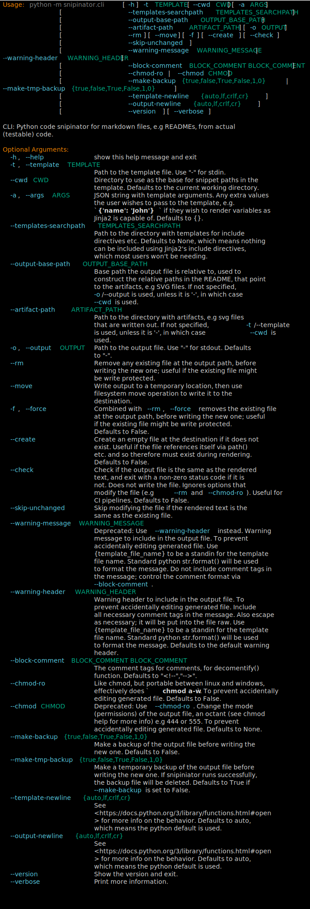

<!--

WARNING: This file is auto-generated by snipinator. Do not edit directly.
SOURCE: `snipinator/examples/LONG-EXAMPLE.md.jinja2`.

-->
# A README

Here is a code snippet (global class):

````py
class MyClass:
  """This is a global class"""

  def __init__(self, name):
    self.name = name

  def MyClassMethod(self):
    """This is a method of MyClass"""
    print(self.name)
````

______________________________________________________________________

Here is a code snippet (class member method):

````py
  def MyClassMethod(self):
    """This is a method of MyClass"""
    print(self.name)
````

______________________________________________________________________

Same thing but just the signature:

````py
  def MyClassMethod(self):
    """This is a method of MyClass"""
````

______________________________________________________________________

Here is a code snippet (global method):

````py
async def GlobalMethod():
  """This is a global method"""
  print('Hello')
````

______________________________________________________________________

Here is a terminal snippet:

````console
$ python -m snipinator.cli --help
Usage: python -m snipinator.cli [-h] -t TEMPLATE [--cwd CWD] [-a ARGS]
                                [--templates-searchpath TEMPLATES_SEARCHPATH]
                                [-o OUTPUT] [--rm] [--check]
                                [--warning-message WARNING_MESSAGE]
                                [--chmod-ro | --chmod CHMOD]

CLI: Python code snipinator for markdown files, e.g READMEs, from actual
(testable) code.

Optional Arguments:
  -h, --help            show this help message and exit
  -t, --template TEMPLATE
                        Path to the template file. Use "-" for stdin.
  --cwd CWD             Directory to use as the base for snippet paths in the
                        template. Defaults to the current working directory.
  -a, --args ARGS       JSON string with template arguments. Any extra values
                        the user wishes to pass to the template, e.g.
                        `{'name': 'John'}` if they wish to render variables as
                        Jinja2 is capable of. Defaults to {}.
  --templates-searchpath TEMPLATES_SEARCHPATH
                        Path to the directory with templates for include
                        directives etc. Defaults to None, which means nothing
                        can be included using Jinja2's include directives,
                        which most users won't be needing.
  -o, --output OUTPUT   Path to the output file. Use "-" for stdout. Defaults
                        to "-".
  --rm                  Remove any existing file at the output path, before
                        writing the new one; useful if the existing file might
                        be write protected.
  --check               Check if the output file is the same as the rendered
                        text, and exit with a non-zero status code if it is
                        not. Does not write the file. Ignores options that
                        modify the file (e.g --rm and --chmod-ro). Useful for
                        CI pipelines. Defaults to False.
  --warning-message WARNING_MESSAGE
                        Warning message to include in the output file. To
                        prevent accidentally editing generated file. Defaults
                        to the default warning message.
  --chmod-ro            Like chmod, but portable between linux and windows,
                        effectively does `chmod a-w`. To prevent accidentally
                        editing generated file. Defaults to False.
  --chmod CHMOD         Deprecated: Use --chmod-ro. Change the mode
                        (permissions) of the output file, an octant (see chmod
                        help for more info) e.g 444 or 555. To prevent
                        accidentally editing generated file. Defaults to None.

````

______________________________________________________________________

Here is a terminal snippet with terminal colors (img tag external svg):

<!--
--><!-- -->

______________________________________________________________________

Here is a terminal snippet with terminal colors (img tag external svg), without
command included in the svg:

<!--
--><!-- -->

______________________________________________________________________

Here is a terminal snippet with terminal colors (img tag with svg data):

<!--
--><img src="data:image/svg+xml;base64,PD94bWwgdmVyc2lvbj0iMS4wIiA/Pgo8c3ZnIHhtbG5zPSJodHRwOi8vd3d3LnczLm9yZy8yMDAwL3N2ZyIgY2xhc3M9InJpY2gtdGVybWluYWwiIHZpZXdCb3g9IjAgMCA5OTQgMTE5Ni44Ij4KPCEtLSBHZW5lcmF0ZWQgd2l0aCBSaWNoIHRleHR1YWxpemUuaW8gLS0+CjxyZWN0IHdpZHRoPSIxMDAlIiBoZWlnaHQ9IjEwMCUiIGZpbGw9InRyYW5zcGFyZW50Ii8+CjxzdHlsZT4KQGZvbnQtZmFjZSB7CmZvbnQtZmFtaWx5OiAmcXVvdDtGaXJhIENvZGUmcXVvdDs7CnNyYzogbG9jYWwoJnF1b3Q7RmlyYUNvZGUtUmVndWxhciZxdW90OyksCnVybCgmcXVvdDtodHRwczovL2NkbmpzLmNsb3VkZmxhcmUuY29tL2FqYXgvbGlicy9maXJhY29kZS82LjIuMC93b2ZmMi9GaXJhQ29kZS1SZWd1bGFyLndvZmYyJnF1b3Q7KSBmb3JtYXQoJnF1b3Q7d29mZjImcXVvdDspLAp1cmwoJnF1b3Q7aHR0cHM6Ly9jZG5qcy5jbG91ZGZsYXJlLmNvbS9hamF4L2xpYnMvZmlyYWNvZGUvNi4yLjAvd29mZi9GaXJhQ29kZS1SZWd1bGFyLndvZmYmcXVvdDspIGZvcm1hdCgmcXVvdDt3b2ZmJnF1b3Q7KTsKZm9udC1zdHlsZTogbm9ybWFsOwpmb250LXdlaWdodDogNDAwOwp9CkBmb250LWZhY2Ugewpmb250LWZhbWlseTogJnF1b3Q7RmlyYSBDb2RlJnF1b3Q7OwpzcmM6IGxvY2FsKCZxdW90O0ZpcmFDb2RlLUJvbGQmcXVvdDspLAp1cmwoJnF1b3Q7aHR0cHM6Ly9jZG5qcy5jbG91ZGZsYXJlLmNvbS9hamF4L2xpYnMvZmlyYWNvZGUvNi4yLjAvd29mZjIvRmlyYUNvZGUtQm9sZC53b2ZmMiZxdW90OykgZm9ybWF0KCZxdW90O3dvZmYyJnF1b3Q7KSwKdXJsKCZxdW90O2h0dHBzOi8vY2RuanMuY2xvdWRmbGFyZS5jb20vYWpheC9saWJzL2ZpcmFjb2RlLzYuMi4wL3dvZmYvRmlyYUNvZGUtQm9sZC53b2ZmJnF1b3Q7KSBmb3JtYXQoJnF1b3Q7d29mZiZxdW90Oyk7CmZvbnQtc3R5bGU6IGJvbGQ7CmZvbnQtd2VpZ2h0OiA3MDA7Cn0KLnRlcm1pbmFsLTM3NDMzMDU3MTUtbWF0cml4IHsKZm9udC1mYW1pbHk6IEZpcmEgQ29kZSwgbW9ub3NwYWNlOwpmb250LXNpemU6IDIwcHg7CmxpbmUtaGVpZ2h0OiAyNC40cHg7CmZvbnQtdmFyaWFudC1lYXN0LWFzaWFuOiBmdWxsLXdpZHRoOwp9Ci50ZXJtaW5hbC0zNzQzMzA1NzE1LXRpdGxlIHsKZm9udC1zaXplOiAxOHB4Owpmb250LXdlaWdodDogYm9sZDsKZm9udC1mYW1pbHk6IGFyaWFsOwp9Ci50ZXJtaW5hbC0zNzQzMzA1NzE1LXIxIHsgZmlsbDogI2Q5ZDlkOSB9Ci50ZXJtaW5hbC0zNzQzMzA1NzE1LXIyIHsgZmlsbDogI2ZmODcwMCB9Ci50ZXJtaW5hbC0zNzQzMzA1NzE1LXIzIHsgZmlsbDogIzgwODA4MCB9Ci50ZXJtaW5hbC0zNzQzMzA1NzE1LXI0IHsgZmlsbDogIzU4ZDFlYiB9Ci50ZXJtaW5hbC0zNzQzMzA1NzE1LXI1IHsgZmlsbDogIzAwYWY4NyB9Ci50ZXJtaW5hbC0zNzQzMzA1NzE1LXI2IHsgZmlsbDogI2Q5ZDlkOTtmb250LXdlaWdodDogYm9sZCB9Cjwvc3R5bGU+CjxkZWZzPgo8Y2xpcFBhdGggaWQ9InRlcm1pbmFsLTM3NDMzMDU3MTUtY2xpcC10ZXJtaW5hbCI+CjxyZWN0IHg9IjAiIHk9IjAiIHdpZHRoPSI5NzUuMCIgaGVpZ2h0PSIxMTQ1LjgiLz4KPC9jbGlwUGF0aD4KPGNsaXBQYXRoIGlkPSJ0ZXJtaW5hbC0zNzQzMzA1NzE1LWxpbmUtMCI+CjxyZWN0IHg9IjAiIHk9IjEuNSIgd2lkdGg9Ijk3NiIgaGVpZ2h0PSIyNC42NSIvPgo8L2NsaXBQYXRoPgo8Y2xpcFBhdGggaWQ9InRlcm1pbmFsLTM3NDMzMDU3MTUtbGluZS0xIj4KPHJlY3QgeD0iMCIgeT0iMjUuOSIgd2lkdGg9Ijk3NiIgaGVpZ2h0PSIyNC42NSIvPgo8L2NsaXBQYXRoPgo8Y2xpcFBhdGggaWQ9InRlcm1pbmFsLTM3NDMzMDU3MTUtbGluZS0yIj4KPHJlY3QgeD0iMCIgeT0iNTAuMyIgd2lkdGg9Ijk3NiIgaGVpZ2h0PSIyNC42NSIvPgo8L2NsaXBQYXRoPgo8Y2xpcFBhdGggaWQ9InRlcm1pbmFsLTM3NDMzMDU3MTUtbGluZS0zIj4KPHJlY3QgeD0iMCIgeT0iNzQuNyIgd2lkdGg9Ijk3NiIgaGVpZ2h0PSIyNC42NSIvPgo8L2NsaXBQYXRoPgo8Y2xpcFBhdGggaWQ9InRlcm1pbmFsLTM3NDMzMDU3MTUtbGluZS00Ij4KPHJlY3QgeD0iMCIgeT0iOTkuMSIgd2lkdGg9Ijk3NiIgaGVpZ2h0PSIyNC42NSIvPgo8L2NsaXBQYXRoPgo8Y2xpcFBhdGggaWQ9InRlcm1pbmFsLTM3NDMzMDU3MTUtbGluZS01Ij4KPHJlY3QgeD0iMCIgeT0iMTIzLjUiIHdpZHRoPSI5NzYiIGhlaWdodD0iMjQuNjUiLz4KPC9jbGlwUGF0aD4KPGNsaXBQYXRoIGlkPSJ0ZXJtaW5hbC0zNzQzMzA1NzE1LWxpbmUtNiI+CjxyZWN0IHg9IjAiIHk9IjE0Ny45IiB3aWR0aD0iOTc2IiBoZWlnaHQ9IjI0LjY1Ii8+CjwvY2xpcFBhdGg+CjxjbGlwUGF0aCBpZD0idGVybWluYWwtMzc0MzMwNTcxNS1saW5lLTciPgo8cmVjdCB4PSIwIiB5PSIxNzIuMyIgd2lkdGg9Ijk3NiIgaGVpZ2h0PSIyNC42NSIvPgo8L2NsaXBQYXRoPgo8Y2xpcFBhdGggaWQ9InRlcm1pbmFsLTM3NDMzMDU3MTUtbGluZS04Ij4KPHJlY3QgeD0iMCIgeT0iMTk2LjciIHdpZHRoPSI5NzYiIGhlaWdodD0iMjQuNjUiLz4KPC9jbGlwUGF0aD4KPGNsaXBQYXRoIGlkPSJ0ZXJtaW5hbC0zNzQzMzA1NzE1LWxpbmUtOSI+CjxyZWN0IHg9IjAiIHk9IjIyMS4xIiB3aWR0aD0iOTc2IiBoZWlnaHQ9IjI0LjY1Ii8+CjwvY2xpcFBhdGg+CjxjbGlwUGF0aCBpZD0idGVybWluYWwtMzc0MzMwNTcxNS1saW5lLTEwIj4KPHJlY3QgeD0iMCIgeT0iMjQ1LjUiIHdpZHRoPSI5NzYiIGhlaWdodD0iMjQuNjUiLz4KPC9jbGlwUGF0aD4KPGNsaXBQYXRoIGlkPSJ0ZXJtaW5hbC0zNzQzMzA1NzE1LWxpbmUtMTEiPgo8cmVjdCB4PSIwIiB5PSIyNjkuOSIgd2lkdGg9Ijk3NiIgaGVpZ2h0PSIyNC42NSIvPgo8L2NsaXBQYXRoPgo8Y2xpcFBhdGggaWQ9InRlcm1pbmFsLTM3NDMzMDU3MTUtbGluZS0xMiI+CjxyZWN0IHg9IjAiIHk9IjI5NC4zIiB3aWR0aD0iOTc2IiBoZWlnaHQ9IjI0LjY1Ii8+CjwvY2xpcFBhdGg+CjxjbGlwUGF0aCBpZD0idGVybWluYWwtMzc0MzMwNTcxNS1saW5lLTEzIj4KPHJlY3QgeD0iMCIgeT0iMzE4LjciIHdpZHRoPSI5NzYiIGhlaWdodD0iMjQuNjUiLz4KPC9jbGlwUGF0aD4KPGNsaXBQYXRoIGlkPSJ0ZXJtaW5hbC0zNzQzMzA1NzE1LWxpbmUtMTQiPgo8cmVjdCB4PSIwIiB5PSIzNDMuMSIgd2lkdGg9Ijk3NiIgaGVpZ2h0PSIyNC42NSIvPgo8L2NsaXBQYXRoPgo8Y2xpcFBhdGggaWQ9InRlcm1pbmFsLTM3NDMzMDU3MTUtbGluZS0xNSI+CjxyZWN0IHg9IjAiIHk9IjM2Ny41IiB3aWR0aD0iOTc2IiBoZWlnaHQ9IjI0LjY1Ii8+CjwvY2xpcFBhdGg+CjxjbGlwUGF0aCBpZD0idGVybWluYWwtMzc0MzMwNTcxNS1saW5lLTE2Ij4KPHJlY3QgeD0iMCIgeT0iMzkxLjkiIHdpZHRoPSI5NzYiIGhlaWdodD0iMjQuNjUiLz4KPC9jbGlwUGF0aD4KPGNsaXBQYXRoIGlkPSJ0ZXJtaW5hbC0zNzQzMzA1NzE1LWxpbmUtMTciPgo8cmVjdCB4PSIwIiB5PSI0MTYuMyIgd2lkdGg9Ijk3NiIgaGVpZ2h0PSIyNC42NSIvPgo8L2NsaXBQYXRoPgo8Y2xpcFBhdGggaWQ9InRlcm1pbmFsLTM3NDMzMDU3MTUtbGluZS0xOCI+CjxyZWN0IHg9IjAiIHk9IjQ0MC43IiB3aWR0aD0iOTc2IiBoZWlnaHQ9IjI0LjY1Ii8+CjwvY2xpcFBhdGg+CjxjbGlwUGF0aCBpZD0idGVybWluYWwtMzc0MzMwNTcxNS1saW5lLTE5Ij4KPHJlY3QgeD0iMCIgeT0iNDY1LjEiIHdpZHRoPSI5NzYiIGhlaWdodD0iMjQuNjUiLz4KPC9jbGlwUGF0aD4KPGNsaXBQYXRoIGlkPSJ0ZXJtaW5hbC0zNzQzMzA1NzE1LWxpbmUtMjAiPgo8cmVjdCB4PSIwIiB5PSI0ODkuNSIgd2lkdGg9Ijk3NiIgaGVpZ2h0PSIyNC42NSIvPgo8L2NsaXBQYXRoPgo8Y2xpcFBhdGggaWQ9InRlcm1pbmFsLTM3NDMzMDU3MTUtbGluZS0yMSI+CjxyZWN0IHg9IjAiIHk9IjUxMy45IiB3aWR0aD0iOTc2IiBoZWlnaHQ9IjI0LjY1Ii8+CjwvY2xpcFBhdGg+CjxjbGlwUGF0aCBpZD0idGVybWluYWwtMzc0MzMwNTcxNS1saW5lLTIyIj4KPHJlY3QgeD0iMCIgeT0iNTM4LjMiIHdpZHRoPSI5NzYiIGhlaWdodD0iMjQuNjUiLz4KPC9jbGlwUGF0aD4KPGNsaXBQYXRoIGlkPSJ0ZXJtaW5hbC0zNzQzMzA1NzE1LWxpbmUtMjMiPgo8cmVjdCB4PSIwIiB5PSI1NjIuNyIgd2lkdGg9Ijk3NiIgaGVpZ2h0PSIyNC42NSIvPgo8L2NsaXBQYXRoPgo8Y2xpcFBhdGggaWQ9InRlcm1pbmFsLTM3NDMzMDU3MTUtbGluZS0yNCI+CjxyZWN0IHg9IjAiIHk9IjU4Ny4xIiB3aWR0aD0iOTc2IiBoZWlnaHQ9IjI0LjY1Ii8+CjwvY2xpcFBhdGg+CjxjbGlwUGF0aCBpZD0idGVybWluYWwtMzc0MzMwNTcxNS1saW5lLTI1Ij4KPHJlY3QgeD0iMCIgeT0iNjExLjUiIHdpZHRoPSI5NzYiIGhlaWdodD0iMjQuNjUiLz4KPC9jbGlwUGF0aD4KPGNsaXBQYXRoIGlkPSJ0ZXJtaW5hbC0zNzQzMzA1NzE1LWxpbmUtMjYiPgo8cmVjdCB4PSIwIiB5PSI2MzUuOSIgd2lkdGg9Ijk3NiIgaGVpZ2h0PSIyNC42NSIvPgo8L2NsaXBQYXRoPgo8Y2xpcFBhdGggaWQ9InRlcm1pbmFsLTM3NDMzMDU3MTUtbGluZS0yNyI+CjxyZWN0IHg9IjAiIHk9IjY2MC4zIiB3aWR0aD0iOTc2IiBoZWlnaHQ9IjI0LjY1Ii8+CjwvY2xpcFBhdGg+CjxjbGlwUGF0aCBpZD0idGVybWluYWwtMzc0MzMwNTcxNS1saW5lLTI4Ij4KPHJlY3QgeD0iMCIgeT0iNjg0LjciIHdpZHRoPSI5NzYiIGhlaWdodD0iMjQuNjUiLz4KPC9jbGlwUGF0aD4KPGNsaXBQYXRoIGlkPSJ0ZXJtaW5hbC0zNzQzMzA1NzE1LWxpbmUtMjkiPgo8cmVjdCB4PSIwIiB5PSI3MDkuMSIgd2lkdGg9Ijk3NiIgaGVpZ2h0PSIyNC42NSIvPgo8L2NsaXBQYXRoPgo8Y2xpcFBhdGggaWQ9InRlcm1pbmFsLTM3NDMzMDU3MTUtbGluZS0zMCI+CjxyZWN0IHg9IjAiIHk9IjczMy41IiB3aWR0aD0iOTc2IiBoZWlnaHQ9IjI0LjY1Ii8+CjwvY2xpcFBhdGg+CjxjbGlwUGF0aCBpZD0idGVybWluYWwtMzc0MzMwNTcxNS1saW5lLTMxIj4KPHJlY3QgeD0iMCIgeT0iNzU3LjkiIHdpZHRoPSI5NzYiIGhlaWdodD0iMjQuNjUiLz4KPC9jbGlwUGF0aD4KPGNsaXBQYXRoIGlkPSJ0ZXJtaW5hbC0zNzQzMzA1NzE1LWxpbmUtMzIiPgo8cmVjdCB4PSIwIiB5PSI3ODIuMyIgd2lkdGg9Ijk3NiIgaGVpZ2h0PSIyNC42NSIvPgo8L2NsaXBQYXRoPgo8Y2xpcFBhdGggaWQ9InRlcm1pbmFsLTM3NDMzMDU3MTUtbGluZS0zMyI+CjxyZWN0IHg9IjAiIHk9IjgwNi43IiB3aWR0aD0iOTc2IiBoZWlnaHQ9IjI0LjY1Ii8+CjwvY2xpcFBhdGg+CjxjbGlwUGF0aCBpZD0idGVybWluYWwtMzc0MzMwNTcxNS1saW5lLTM0Ij4KPHJlY3QgeD0iMCIgeT0iODMxLjEiIHdpZHRoPSI5NzYiIGhlaWdodD0iMjQuNjUiLz4KPC9jbGlwUGF0aD4KPGNsaXBQYXRoIGlkPSJ0ZXJtaW5hbC0zNzQzMzA1NzE1LWxpbmUtMzUiPgo8cmVjdCB4PSIwIiB5PSI4NTUuNSIgd2lkdGg9Ijk3NiIgaGVpZ2h0PSIyNC42NSIvPgo8L2NsaXBQYXRoPgo8Y2xpcFBhdGggaWQ9InRlcm1pbmFsLTM3NDMzMDU3MTUtbGluZS0zNiI+CjxyZWN0IHg9IjAiIHk9Ijg3OS45IiB3aWR0aD0iOTc2IiBoZWlnaHQ9IjI0LjY1Ii8+CjwvY2xpcFBhdGg+CjxjbGlwUGF0aCBpZD0idGVybWluYWwtMzc0MzMwNTcxNS1saW5lLTM3Ij4KPHJlY3QgeD0iMCIgeT0iOTA0LjMiIHdpZHRoPSI5NzYiIGhlaWdodD0iMjQuNjUiLz4KPC9jbGlwUGF0aD4KPGNsaXBQYXRoIGlkPSJ0ZXJtaW5hbC0zNzQzMzA1NzE1LWxpbmUtMzgiPgo8cmVjdCB4PSIwIiB5PSI5MjguNyIgd2lkdGg9Ijk3NiIgaGVpZ2h0PSIyNC42NSIvPgo8L2NsaXBQYXRoPgo8Y2xpcFBhdGggaWQ9InRlcm1pbmFsLTM3NDMzMDU3MTUtbGluZS0zOSI+CjxyZWN0IHg9IjAiIHk9Ijk1My4xIiB3aWR0aD0iOTc2IiBoZWlnaHQ9IjI0LjY1Ii8+CjwvY2xpcFBhdGg+CjxjbGlwUGF0aCBpZD0idGVybWluYWwtMzc0MzMwNTcxNS1saW5lLTQwIj4KPHJlY3QgeD0iMCIgeT0iOTc3LjUiIHdpZHRoPSI5NzYiIGhlaWdodD0iMjQuNjUiLz4KPC9jbGlwUGF0aD4KPGNsaXBQYXRoIGlkPSJ0ZXJtaW5hbC0zNzQzMzA1NzE1LWxpbmUtNDEiPgo8cmVjdCB4PSIwIiB5PSIxMDAxLjkiIHdpZHRoPSI5NzYiIGhlaWdodD0iMjQuNjUiLz4KPC9jbGlwUGF0aD4KPGNsaXBQYXRoIGlkPSJ0ZXJtaW5hbC0zNzQzMzA1NzE1LWxpbmUtNDIiPgo8cmVjdCB4PSIwIiB5PSIxMDI2LjMiIHdpZHRoPSI5NzYiIGhlaWdodD0iMjQuNjUiLz4KPC9jbGlwUGF0aD4KPGNsaXBQYXRoIGlkPSJ0ZXJtaW5hbC0zNzQzMzA1NzE1LWxpbmUtNDMiPgo8cmVjdCB4PSIwIiB5PSIxMDUwLjciIHdpZHRoPSI5NzYiIGhlaWdodD0iMjQuNjUiLz4KPC9jbGlwUGF0aD4KPGNsaXBQYXRoIGlkPSJ0ZXJtaW5hbC0zNzQzMzA1NzE1LWxpbmUtNDQiPgo8cmVjdCB4PSIwIiB5PSIxMDc1LjEiIHdpZHRoPSI5NzYiIGhlaWdodD0iMjQuNjUiLz4KPC9jbGlwUGF0aD4KPGNsaXBQYXRoIGlkPSJ0ZXJtaW5hbC0zNzQzMzA1NzE1LWxpbmUtNDUiPgo8cmVjdCB4PSIwIiB5PSIxMDk5LjUiIHdpZHRoPSI5NzYiIGhlaWdodD0iMjQuNjUiLz4KPC9jbGlwUGF0aD4KPC9kZWZzPgo8ZyB0cmFuc2Zvcm09InRyYW5zbGF0ZSg5LCAwKSI+CjxnIGNsYXNzPSJ0ZXJtaW5hbC0zNzQzMzA1NzE1LW1hdHJpeCI+Cjx0ZXh0IGNsYXNzPSJ0ZXJtaW5hbC0zNzQzMzA1NzE1LXIxIiB4PSIwIiB5PSIyMCIgdGV4dExlbmd0aD0iNDAyLjYiIGNsaXAtcGF0aD0idXJsKCN0ZXJtaW5hbC0zNzQzMzA1NzE1LWxpbmUtMCkiPiTCoHB5dGhvbsKgLW3CoHNuaXBpbmF0b3IuY2xpwqAtLWhlbHA8L3RleHQ+Cjx0ZXh0IGNsYXNzPSJ0ZXJtaW5hbC0zNzQzMzA1NzE1LXIxIiB4PSI5NzYiIHk9IjIwIiB0ZXh0TGVuZ3RoPSIxMi4yIiBjbGlwLXBhdGg9InVybCgjdGVybWluYWwtMzc0MzMwNTcxNS1saW5lLTApIj4KPC90ZXh0Pgo8dGV4dCBjbGFzcz0idGVybWluYWwtMzc0MzMwNTcxNS1yMiIgeD0iMCIgeT0iNDQuNCIgdGV4dExlbmd0aD0iNzMuMiIgY2xpcC1wYXRoPSJ1cmwoI3Rlcm1pbmFsLTM3NDMzMDU3MTUtbGluZS0xKSI+VXNhZ2U6PC90ZXh0Pgo8dGV4dCBjbGFzcz0idGVybWluYWwtMzc0MzMwNTcxNS1yMyIgeD0iODUuNCIgeT0iNDQuNCIgdGV4dExlbmd0aD0iMjkyLjgiIGNsaXAtcGF0aD0idXJsKCN0ZXJtaW5hbC0zNzQzMzA1NzE1LWxpbmUtMSkiPnB5dGhvbsKgLW3CoHNuaXBpbmF0b3IuY2xpPC90ZXh0Pgo8dGV4dCBjbGFzcz0idGVybWluYWwtMzc0MzMwNTcxNS1yMSIgeD0iMzc4LjIiIHk9IjQ0LjQiIHRleHRMZW5ndGg9IjI0LjQiIGNsaXAtcGF0aD0idXJsKCN0ZXJtaW5hbC0zNzQzMzA1NzE1LWxpbmUtMSkiPsKgWzwvdGV4dD4KPHRleHQgY2xhc3M9InRlcm1pbmFsLTM3NDMzMDU3MTUtcjQiIHg9IjQwMi42IiB5PSI0NC40IiB0ZXh0TGVuZ3RoPSIyNC40IiBjbGlwLXBhdGg9InVybCgjdGVybWluYWwtMzc0MzMwNTcxNS1saW5lLTEpIj4taDwvdGV4dD4KPHRleHQgY2xhc3M9InRlcm1pbmFsLTM3NDMzMDU3MTUtcjEiIHg9IjQyNyIgeT0iNDQuNCIgdGV4dExlbmd0aD0iMjQuNCIgY2xpcC1wYXRoPSJ1cmwoI3Rlcm1pbmFsLTM3NDMzMDU3MTUtbGluZS0xKSI+XcKgPC90ZXh0Pgo8dGV4dCBjbGFzcz0idGVybWluYWwtMzc0MzMwNTcxNS1yNCIgeD0iNDUxLjQiIHk9IjQ0LjQiIHRleHRMZW5ndGg9IjI0LjQiIGNsaXAtcGF0aD0idXJsKCN0ZXJtaW5hbC0zNzQzMzA1NzE1LWxpbmUtMSkiPi10PC90ZXh0Pgo8dGV4dCBjbGFzcz0idGVybWluYWwtMzc0MzMwNTcxNS1yNSIgeD0iNDg4IiB5PSI0NC40IiB0ZXh0TGVuZ3RoPSI5Ny42IiBjbGlwLXBhdGg9InVybCgjdGVybWluYWwtMzc0MzMwNTcxNS1saW5lLTEpIj5URU1QTEFURTwvdGV4dD4KPHRleHQgY2xhc3M9InRlcm1pbmFsLTM3NDMzMDU3MTUtcjEiIHg9IjU4NS42IiB5PSI0NC40IiB0ZXh0TGVuZ3RoPSIyNC40IiBjbGlwLXBhdGg9InVybCgjdGVybWluYWwtMzc0MzMwNTcxNS1saW5lLTEpIj7CoFs8L3RleHQ+Cjx0ZXh0IGNsYXNzPSJ0ZXJtaW5hbC0zNzQzMzA1NzE1LXI0IiB4PSI2MTAiIHk9IjQ0LjQiIHRleHRMZW5ndGg9IjYxIiBjbGlwLXBhdGg9InVybCgjdGVybWluYWwtMzc0MzMwNTcxNS1saW5lLTEpIj4tLWN3ZDwvdGV4dD4KPHRleHQgY2xhc3M9InRlcm1pbmFsLTM3NDMzMDU3MTUtcjUiIHg9IjY4My4yIiB5PSI0NC40IiB0ZXh0TGVuZ3RoPSIzNi42IiBjbGlwLXBhdGg9InVybCgjdGVybWluYWwtMzc0MzMwNTcxNS1saW5lLTEpIj5DV0Q8L3RleHQ+Cjx0ZXh0IGNsYXNzPSJ0ZXJtaW5hbC0zNzQzMzA1NzE1LXIxIiB4PSI3MTkuOCIgeT0iNDQuNCIgdGV4dExlbmd0aD0iMzYuNiIgY2xpcC1wYXRoPSJ1cmwoI3Rlcm1pbmFsLTM3NDMzMDU3MTUtbGluZS0xKSI+XcKgWzwvdGV4dD4KPHRleHQgY2xhc3M9InRlcm1pbmFsLTM3NDMzMDU3MTUtcjQiIHg9Ijc1Ni40IiB5PSI0NC40IiB0ZXh0TGVuZ3RoPSIyNC40IiBjbGlwLXBhdGg9InVybCgjdGVybWluYWwtMzc0MzMwNTcxNS1saW5lLTEpIj4tYTwvdGV4dD4KPHRleHQgY2xhc3M9InRlcm1pbmFsLTM3NDMzMDU3MTUtcjUiIHg9Ijc5MyIgeT0iNDQuNCIgdGV4dExlbmd0aD0iNDguOCIgY2xpcC1wYXRoPSJ1cmwoI3Rlcm1pbmFsLTM3NDMzMDU3MTUtbGluZS0xKSI+QVJHUzwvdGV4dD4KPHRleHQgY2xhc3M9InRlcm1pbmFsLTM3NDMzMDU3MTUtcjEiIHg9Ijg0MS44IiB5PSI0NC40IiB0ZXh0TGVuZ3RoPSIxMi4yIiBjbGlwLXBhdGg9InVybCgjdGVybWluYWwtMzc0MzMwNTcxNS1saW5lLTEpIj5dPC90ZXh0Pgo8dGV4dCBjbGFzcz0idGVybWluYWwtMzc0MzMwNTcxNS1yMSIgeD0iOTc2IiB5PSI0NC40IiB0ZXh0TGVuZ3RoPSIxMi4yIiBjbGlwLXBhdGg9InVybCgjdGVybWluYWwtMzc0MzMwNTcxNS1saW5lLTEpIj4KPC90ZXh0Pgo8dGV4dCBjbGFzcz0idGVybWluYWwtMzc0MzMwNTcxNS1yMSIgeD0iMCIgeT0iNjguOCIgdGV4dExlbmd0aD0iNDAyLjYiIGNsaXAtcGF0aD0idXJsKCN0ZXJtaW5hbC0zNzQzMzA1NzE1LWxpbmUtMikiPsKgwqDCoMKgwqDCoMKgwqDCoMKgwqDCoMKgwqDCoMKgwqDCoMKgwqDCoMKgwqDCoMKgwqDCoMKgwqDCoMKgwqBbPC90ZXh0Pgo8dGV4dCBjbGFzcz0idGVybWluYWwtMzc0MzMwNTcxNS1yNCIgeD0iNDAyLjYiIHk9IjY4LjgiIHRleHRMZW5ndGg9IjI2OC40IiBjbGlwLXBhdGg9InVybCgjdGVybWluYWwtMzc0MzMwNTcxNS1saW5lLTIpIj4tLXRlbXBsYXRlcy1zZWFyY2hwYXRoPC90ZXh0Pgo8dGV4dCBjbGFzcz0idGVybWluYWwtMzc0MzMwNTcxNS1yNSIgeD0iNjgzLjIiIHk9IjY4LjgiIHRleHRMZW5ndGg9IjI0NCIgY2xpcC1wYXRoPSJ1cmwoI3Rlcm1pbmFsLTM3NDMzMDU3MTUtbGluZS0yKSI+VEVNUExBVEVTX1NFQVJDSFBBVEg8L3RleHQ+Cjx0ZXh0IGNsYXNzPSJ0ZXJtaW5hbC0zNzQzMzA1NzE1LXIxIiB4PSI5MjcuMiIgeT0iNjguOCIgdGV4dExlbmd0aD0iMTIuMiIgY2xpcC1wYXRoPSJ1cmwoI3Rlcm1pbmFsLTM3NDMzMDU3MTUtbGluZS0yKSI+XTwvdGV4dD4KPHRleHQgY2xhc3M9InRlcm1pbmFsLTM3NDMzMDU3MTUtcjEiIHg9Ijk3NiIgeT0iNjguOCIgdGV4dExlbmd0aD0iMTIuMiIgY2xpcC1wYXRoPSJ1cmwoI3Rlcm1pbmFsLTM3NDMzMDU3MTUtbGluZS0yKSI+CjwvdGV4dD4KPHRleHQgY2xhc3M9InRlcm1pbmFsLTM3NDMzMDU3MTUtcjEiIHg9IjAiIHk9IjkzLjIiIHRleHRMZW5ndGg9IjQwMi42IiBjbGlwLXBhdGg9InVybCgjdGVybWluYWwtMzc0MzMwNTcxNS1saW5lLTMpIj7CoMKgwqDCoMKgwqDCoMKgwqDCoMKgwqDCoMKgwqDCoMKgwqDCoMKgwqDCoMKgwqDCoMKgwqDCoMKgwqDCoMKgWzwvdGV4dD4KPHRleHQgY2xhc3M9InRlcm1pbmFsLTM3NDMzMDU3MTUtcjQiIHg9IjQwMi42IiB5PSI5My4yIiB0ZXh0TGVuZ3RoPSIyNC40IiBjbGlwLXBhdGg9InVybCgjdGVybWluYWwtMzc0MzMwNTcxNS1saW5lLTMpIj4tbzwvdGV4dD4KPHRleHQgY2xhc3M9InRlcm1pbmFsLTM3NDMzMDU3MTUtcjUiIHg9IjQzOS4yIiB5PSI5My4yIiB0ZXh0TGVuZ3RoPSI3My4yIiBjbGlwLXBhdGg9InVybCgjdGVybWluYWwtMzc0MzMwNTcxNS1saW5lLTMpIj5PVVRQVVQ8L3RleHQ+Cjx0ZXh0IGNsYXNzPSJ0ZXJtaW5hbC0zNzQzMzA1NzE1LXIxIiB4PSI1MTIuNCIgeT0iOTMuMiIgdGV4dExlbmd0aD0iMzYuNiIgY2xpcC1wYXRoPSJ1cmwoI3Rlcm1pbmFsLTM3NDMzMDU3MTUtbGluZS0zKSI+XcKgWzwvdGV4dD4KPHRleHQgY2xhc3M9InRlcm1pbmFsLTM3NDMzMDU3MTUtcjQiIHg9IjU0OSIgeT0iOTMuMiIgdGV4dExlbmd0aD0iNDguOCIgY2xpcC1wYXRoPSJ1cmwoI3Rlcm1pbmFsLTM3NDMzMDU3MTUtbGluZS0zKSI+LS1ybTwvdGV4dD4KPHRleHQgY2xhc3M9InRlcm1pbmFsLTM3NDMzMDU3MTUtcjEiIHg9IjU5Ny44IiB5PSI5My4yIiB0ZXh0TGVuZ3RoPSIzNi42IiBjbGlwLXBhdGg9InVybCgjdGVybWluYWwtMzc0MzMwNTcxNS1saW5lLTMpIj5dwqBbPC90ZXh0Pgo8dGV4dCBjbGFzcz0idGVybWluYWwtMzc0MzMwNTcxNS1yNCIgeD0iNjM0LjQiIHk9IjkzLjIiIHRleHRMZW5ndGg9Ijg1LjQiIGNsaXAtcGF0aD0idXJsKCN0ZXJtaW5hbC0zNzQzMzA1NzE1LWxpbmUtMykiPi0tY2hlY2s8L3RleHQ+Cjx0ZXh0IGNsYXNzPSJ0ZXJtaW5hbC0zNzQzMzA1NzE1LXIxIiB4PSI3MTkuOCIgeT0iOTMuMiIgdGV4dExlbmd0aD0iMTIuMiIgY2xpcC1wYXRoPSJ1cmwoI3Rlcm1pbmFsLTM3NDMzMDU3MTUtbGluZS0zKSI+XTwvdGV4dD4KPHRleHQgY2xhc3M9InRlcm1pbmFsLTM3NDMzMDU3MTUtcjEiIHg9Ijk3NiIgeT0iOTMuMiIgdGV4dExlbmd0aD0iMTIuMiIgY2xpcC1wYXRoPSJ1cmwoI3Rlcm1pbmFsLTM3NDMzMDU3MTUtbGluZS0zKSI+CjwvdGV4dD4KPHRleHQgY2xhc3M9InRlcm1pbmFsLTM3NDMzMDU3MTUtcjEiIHg9IjAiIHk9IjExNy42IiB0ZXh0TGVuZ3RoPSI0MDIuNiIgY2xpcC1wYXRoPSJ1cmwoI3Rlcm1pbmFsLTM3NDMzMDU3MTUtbGluZS00KSI+wqDCoMKgwqDCoMKgwqDCoMKgwqDCoMKgwqDCoMKgwqDCoMKgwqDCoMKgwqDCoMKgwqDCoMKgwqDCoMKgwqDCoFs8L3RleHQ+Cjx0ZXh0IGNsYXNzPSJ0ZXJtaW5hbC0zNzQzMzA1NzE1LXI0IiB4PSI0MDIuNiIgeT0iMTE3LjYiIHRleHRMZW5ndGg9IjIwNy40IiBjbGlwLXBhdGg9InVybCgjdGVybWluYWwtMzc0MzMwNTcxNS1saW5lLTQpIj4tLXdhcm5pbmctbWVzc2FnZTwvdGV4dD4KPHRleHQgY2xhc3M9InRlcm1pbmFsLTM3NDMzMDU3MTUtcjUiIHg9IjYyMi4yIiB5PSIxMTcuNiIgdGV4dExlbmd0aD0iMTgzIiBjbGlwLXBhdGg9InVybCgjdGVybWluYWwtMzc0MzMwNTcxNS1saW5lLTQpIj5XQVJOSU5HX01FU1NBR0U8L3RleHQ+Cjx0ZXh0IGNsYXNzPSJ0ZXJtaW5hbC0zNzQzMzA1NzE1LXIxIiB4PSI4MDUuMiIgeT0iMTE3LjYiIHRleHRMZW5ndGg9IjEyLjIiIGNsaXAtcGF0aD0idXJsKCN0ZXJtaW5hbC0zNzQzMzA1NzE1LWxpbmUtNCkiPl08L3RleHQ+Cjx0ZXh0IGNsYXNzPSJ0ZXJtaW5hbC0zNzQzMzA1NzE1LXIxIiB4PSI5NzYiIHk9IjExNy42IiB0ZXh0TGVuZ3RoPSIxMi4yIiBjbGlwLXBhdGg9InVybCgjdGVybWluYWwtMzc0MzMwNTcxNS1saW5lLTQpIj4KPC90ZXh0Pgo8dGV4dCBjbGFzcz0idGVybWluYWwtMzc0MzMwNTcxNS1yMSIgeD0iMCIgeT0iMTQyIiB0ZXh0TGVuZ3RoPSI0MDIuNiIgY2xpcC1wYXRoPSJ1cmwoI3Rlcm1pbmFsLTM3NDMzMDU3MTUtbGluZS01KSI+wqDCoMKgwqDCoMKgwqDCoMKgwqDCoMKgwqDCoMKgwqDCoMKgwqDCoMKgwqDCoMKgwqDCoMKgwqDCoMKgwqDCoFs8L3RleHQ+Cjx0ZXh0IGNsYXNzPSJ0ZXJtaW5hbC0zNzQzMzA1NzE1LXI0IiB4PSI0MDIuNiIgeT0iMTQyIiB0ZXh0TGVuZ3RoPSIxMjIiIGNsaXAtcGF0aD0idXJsKCN0ZXJtaW5hbC0zNzQzMzA1NzE1LWxpbmUtNSkiPi0tY2htb2Qtcm88L3RleHQ+Cjx0ZXh0IGNsYXNzPSJ0ZXJtaW5hbC0zNzQzMzA1NzE1LXIxIiB4PSI1MjQuNiIgeT0iMTQyIiB0ZXh0TGVuZ3RoPSIzNi42IiBjbGlwLXBhdGg9InVybCgjdGVybWluYWwtMzc0MzMwNTcxNS1saW5lLTUpIj7CoHzCoDwvdGV4dD4KPHRleHQgY2xhc3M9InRlcm1pbmFsLTM3NDMzMDU3MTUtcjQiIHg9IjU2MS4yIiB5PSIxNDIiIHRleHRMZW5ndGg9Ijg1LjQiIGNsaXAtcGF0aD0idXJsKCN0ZXJtaW5hbC0zNzQzMzA1NzE1LWxpbmUtNSkiPi0tY2htb2Q8L3RleHQ+Cjx0ZXh0IGNsYXNzPSJ0ZXJtaW5hbC0zNzQzMzA1NzE1LXI1IiB4PSI2NTguOCIgeT0iMTQyIiB0ZXh0TGVuZ3RoPSI2MSIgY2xpcC1wYXRoPSJ1cmwoI3Rlcm1pbmFsLTM3NDMzMDU3MTUtbGluZS01KSI+Q0hNT0Q8L3RleHQ+Cjx0ZXh0IGNsYXNzPSJ0ZXJtaW5hbC0zNzQzMzA1NzE1LXIxIiB4PSI3MTkuOCIgeT0iMTQyIiB0ZXh0TGVuZ3RoPSIxMi4yIiBjbGlwLXBhdGg9InVybCgjdGVybWluYWwtMzc0MzMwNTcxNS1saW5lLTUpIj5dPC90ZXh0Pgo8dGV4dCBjbGFzcz0idGVybWluYWwtMzc0MzMwNTcxNS1yMSIgeD0iOTc2IiB5PSIxNDIiIHRleHRMZW5ndGg9IjEyLjIiIGNsaXAtcGF0aD0idXJsKCN0ZXJtaW5hbC0zNzQzMzA1NzE1LWxpbmUtNSkiPgo8L3RleHQ+Cjx0ZXh0IGNsYXNzPSJ0ZXJtaW5hbC0zNzQzMzA1NzE1LXIxIiB4PSI5NzYiIHk9IjE2Ni40IiB0ZXh0TGVuZ3RoPSIxMi4yIiBjbGlwLXBhdGg9InVybCgjdGVybWluYWwtMzc0MzMwNTcxNS1saW5lLTYpIj4KPC90ZXh0Pgo8dGV4dCBjbGFzcz0idGVybWluYWwtMzc0MzMwNTcxNS1yMSIgeD0iMCIgeT0iMTkwLjgiIHRleHRMZW5ndGg9Ijg3OC40IiBjbGlwLXBhdGg9InVybCgjdGVybWluYWwtMzc0MzMwNTcxNS1saW5lLTcpIj5DTEk6wqBQeXRob27CoGNvZGXCoHNuaXBpbmF0b3LCoGZvcsKgbWFya2Rvd27CoGZpbGVzLMKgZS5nwqBSRUFETUVzLMKgZnJvbcKgYWN0dWFsPC90ZXh0Pgo8dGV4dCBjbGFzcz0idGVybWluYWwtMzc0MzMwNTcxNS1yMSIgeD0iOTc2IiB5PSIxOTAuOCIgdGV4dExlbmd0aD0iMTIuMiIgY2xpcC1wYXRoPSJ1cmwoI3Rlcm1pbmFsLTM3NDMzMDU3MTUtbGluZS03KSI+CjwvdGV4dD4KPHRleHQgY2xhc3M9InRlcm1pbmFsLTM3NDMzMDU3MTUtcjEiIHg9IjAiIHk9IjIxNS4yIiB0ZXh0TGVuZ3RoPSIxOTUuMiIgY2xpcC1wYXRoPSJ1cmwoI3Rlcm1pbmFsLTM3NDMzMDU3MTUtbGluZS04KSI+KHRlc3RhYmxlKcKgY29kZS48L3RleHQ+Cjx0ZXh0IGNsYXNzPSJ0ZXJtaW5hbC0zNzQzMzA1NzE1LXIxIiB4PSI5NzYiIHk9IjIxNS4yIiB0ZXh0TGVuZ3RoPSIxMi4yIiBjbGlwLXBhdGg9InVybCgjdGVybWluYWwtMzc0MzMwNTcxNS1saW5lLTgpIj4KPC90ZXh0Pgo8dGV4dCBjbGFzcz0idGVybWluYWwtMzc0MzMwNTcxNS1yMSIgeD0iOTc2IiB5PSIyMzkuNiIgdGV4dExlbmd0aD0iMTIuMiIgY2xpcC1wYXRoPSJ1cmwoI3Rlcm1pbmFsLTM3NDMzMDU3MTUtbGluZS05KSI+CjwvdGV4dD4KPHRleHQgY2xhc3M9InRlcm1pbmFsLTM3NDMzMDU3MTUtcjIiIHg9IjAiIHk9IjI2NCIgdGV4dExlbmd0aD0iMjMxLjgiIGNsaXAtcGF0aD0idXJsKCN0ZXJtaW5hbC0zNzQzMzA1NzE1LWxpbmUtMTApIj5PcHRpb25hbMKgQXJndW1lbnRzOjwvdGV4dD4KPHRleHQgY2xhc3M9InRlcm1pbmFsLTM3NDMzMDU3MTUtcjEiIHg9Ijk3NiIgeT0iMjY0IiB0ZXh0TGVuZ3RoPSIxMi4yIiBjbGlwLXBhdGg9InVybCgjdGVybWluYWwtMzc0MzMwNTcxNS1saW5lLTEwKSI+CjwvdGV4dD4KPHRleHQgY2xhc3M9InRlcm1pbmFsLTM3NDMzMDU3MTUtcjQiIHg9IjI0LjQiIHk9IjI4OC40IiB0ZXh0TGVuZ3RoPSIyNC40IiBjbGlwLXBhdGg9InVybCgjdGVybWluYWwtMzc0MzMwNTcxNS1saW5lLTExKSI+LWg8L3RleHQ+Cjx0ZXh0IGNsYXNzPSJ0ZXJtaW5hbC0zNzQzMzA1NzE1LXIxIiB4PSI0OC44IiB5PSIyODguNCIgdGV4dExlbmd0aD0iMjQuNCIgY2xpcC1wYXRoPSJ1cmwoI3Rlcm1pbmFsLTM3NDMzMDU3MTUtbGluZS0xMSkiPizCoDwvdGV4dD4KPHRleHQgY2xhc3M9InRlcm1pbmFsLTM3NDMzMDU3MTUtcjQiIHg9IjczLjIiIHk9IjI4OC40IiB0ZXh0TGVuZ3RoPSI3My4yIiBjbGlwLXBhdGg9InVybCgjdGVybWluYWwtMzc0MzMwNTcxNS1saW5lLTExKSI+LS1oZWxwPC90ZXh0Pgo8dGV4dCBjbGFzcz0idGVybWluYWwtMzc0MzMwNTcxNS1yMSIgeD0iMjkyLjgiIHk9IjI4OC40IiB0ZXh0TGVuZ3RoPSIzNzguMiIgY2xpcC1wYXRoPSJ1cmwoI3Rlcm1pbmFsLTM3NDMzMDU3MTUtbGluZS0xMSkiPnNob3fCoHRoaXPCoGhlbHDCoG1lc3NhZ2XCoGFuZMKgZXhpdDwvdGV4dD4KPHRleHQgY2xhc3M9InRlcm1pbmFsLTM3NDMzMDU3MTUtcjEiIHg9Ijk3NiIgeT0iMjg4LjQiIHRleHRMZW5ndGg9IjEyLjIiIGNsaXAtcGF0aD0idXJsKCN0ZXJtaW5hbC0zNzQzMzA1NzE1LWxpbmUtMTEpIj4KPC90ZXh0Pgo8dGV4dCBjbGFzcz0idGVybWluYWwtMzc0MzMwNTcxNS1yNCIgeD0iMjQuNCIgeT0iMzEyLjgiIHRleHRMZW5ndGg9IjI0LjQiIGNsaXAtcGF0aD0idXJsKCN0ZXJtaW5hbC0zNzQzMzA1NzE1LWxpbmUtMTIpIj4tdDwvdGV4dD4KPHRleHQgY2xhc3M9InRlcm1pbmFsLTM3NDMzMDU3MTUtcjEiIHg9IjQ4LjgiIHk9IjMxMi44IiB0ZXh0TGVuZ3RoPSIyNC40IiBjbGlwLXBhdGg9InVybCgjdGVybWluYWwtMzc0MzMwNTcxNS1saW5lLTEyKSI+LMKgPC90ZXh0Pgo8dGV4dCBjbGFzcz0idGVybWluYWwtMzc0MzMwNTcxNS1yNCIgeD0iNzMuMiIgeT0iMzEyLjgiIHRleHRMZW5ndGg9IjEyMiIgY2xpcC1wYXRoPSJ1cmwoI3Rlcm1pbmFsLTM3NDMzMDU3MTUtbGluZS0xMikiPi0tdGVtcGxhdGU8L3RleHQ+Cjx0ZXh0IGNsYXNzPSJ0ZXJtaW5hbC0zNzQzMzA1NzE1LXI1IiB4PSIyMDcuNCIgeT0iMzEyLjgiIHRleHRMZW5ndGg9Ijk3LjYiIGNsaXAtcGF0aD0idXJsKCN0ZXJtaW5hbC0zNzQzMzA1NzE1LWxpbmUtMTIpIj5URU1QTEFURTwvdGV4dD4KPHRleHQgY2xhc3M9InRlcm1pbmFsLTM3NDMzMDU3MTUtcjEiIHg9Ijk3NiIgeT0iMzEyLjgiIHRleHRMZW5ndGg9IjEyLjIiIGNsaXAtcGF0aD0idXJsKCN0ZXJtaW5hbC0zNzQzMzA1NzE1LWxpbmUtMTIpIj4KPC90ZXh0Pgo8dGV4dCBjbGFzcz0idGVybWluYWwtMzc0MzMwNTcxNS1yMSIgeD0iMjkyLjgiIHk9IjMzNy4yIiB0ZXh0TGVuZ3RoPSI1NDkiIGNsaXAtcGF0aD0idXJsKCN0ZXJtaW5hbC0zNzQzMzA1NzE1LWxpbmUtMTMpIj5QYXRowqB0b8KgdGhlwqB0ZW1wbGF0ZcKgZmlsZS7CoFVzZcKgJnF1b3Q7LSZxdW90O8KgZm9ywqBzdGRpbi48L3RleHQ+Cjx0ZXh0IGNsYXNzPSJ0ZXJtaW5hbC0zNzQzMzA1NzE1LXIxIiB4PSI5NzYiIHk9IjMzNy4yIiB0ZXh0TGVuZ3RoPSIxMi4yIiBjbGlwLXBhdGg9InVybCgjdGVybWluYWwtMzc0MzMwNTcxNS1saW5lLTEzKSI+CjwvdGV4dD4KPHRleHQgY2xhc3M9InRlcm1pbmFsLTM3NDMzMDU3MTUtcjQiIHg9IjI0LjQiIHk9IjM2MS42IiB0ZXh0TGVuZ3RoPSI2MSIgY2xpcC1wYXRoPSJ1cmwoI3Rlcm1pbmFsLTM3NDMzMDU3MTUtbGluZS0xNCkiPi0tY3dkPC90ZXh0Pgo8dGV4dCBjbGFzcz0idGVybWluYWwtMzc0MzMwNTcxNS1yNSIgeD0iOTcuNiIgeT0iMzYxLjYiIHRleHRMZW5ndGg9IjM2LjYiIGNsaXAtcGF0aD0idXJsKCN0ZXJtaW5hbC0zNzQzMzA1NzE1LWxpbmUtMTQpIj5DV0Q8L3RleHQ+Cjx0ZXh0IGNsYXNzPSJ0ZXJtaW5hbC0zNzQzMzA1NzE1LXIxIiB4PSIyOTIuOCIgeT0iMzYxLjYiIHRleHRMZW5ndGg9IjY0Ni42IiBjbGlwLXBhdGg9InVybCgjdGVybWluYWwtMzc0MzMwNTcxNS1saW5lLTE0KSI+RGlyZWN0b3J5wqB0b8KgdXNlwqBhc8KgdGhlwqBiYXNlwqBmb3LCoHNuaXBwZXTCoHBhdGhzwqBpbsKgdGhlPC90ZXh0Pgo8dGV4dCBjbGFzcz0idGVybWluYWwtMzc0MzMwNTcxNS1yMSIgeD0iOTc2IiB5PSIzNjEuNiIgdGV4dExlbmd0aD0iMTIuMiIgY2xpcC1wYXRoPSJ1cmwoI3Rlcm1pbmFsLTM3NDMzMDU3MTUtbGluZS0xNCkiPgo8L3RleHQ+Cjx0ZXh0IGNsYXNzPSJ0ZXJtaW5hbC0zNzQzMzA1NzE1LXIxIiB4PSIyOTIuOCIgeT0iMzg2IiB0ZXh0TGVuZ3RoPSI2MzQuNCIgY2xpcC1wYXRoPSJ1cmwoI3Rlcm1pbmFsLTM3NDMzMDU3MTUtbGluZS0xNSkiPnRlbXBsYXRlLsKgRGVmYXVsdHPCoHRvwqB0aGXCoGN1cnJlbnTCoHdvcmtpbmfCoGRpcmVjdG9yeS48L3RleHQ+Cjx0ZXh0IGNsYXNzPSJ0ZXJtaW5hbC0zNzQzMzA1NzE1LXIxIiB4PSI5NzYiIHk9IjM4NiIgdGV4dExlbmd0aD0iMTIuMiIgY2xpcC1wYXRoPSJ1cmwoI3Rlcm1pbmFsLTM3NDMzMDU3MTUtbGluZS0xNSkiPgo8L3RleHQ+Cjx0ZXh0IGNsYXNzPSJ0ZXJtaW5hbC0zNzQzMzA1NzE1LXI0IiB4PSIyNC40IiB5PSI0MTAuNCIgdGV4dExlbmd0aD0iMjQuNCIgY2xpcC1wYXRoPSJ1cmwoI3Rlcm1pbmFsLTM3NDMzMDU3MTUtbGluZS0xNikiPi1hPC90ZXh0Pgo8dGV4dCBjbGFzcz0idGVybWluYWwtMzc0MzMwNTcxNS1yMSIgeD0iNDguOCIgeT0iNDEwLjQiIHRleHRMZW5ndGg9IjI0LjQiIGNsaXAtcGF0aD0idXJsKCN0ZXJtaW5hbC0zNzQzMzA1NzE1LWxpbmUtMTYpIj4swqA8L3RleHQ+Cjx0ZXh0IGNsYXNzPSJ0ZXJtaW5hbC0zNzQzMzA1NzE1LXI0IiB4PSI3My4yIiB5PSI0MTAuNCIgdGV4dExlbmd0aD0iNzMuMiIgY2xpcC1wYXRoPSJ1cmwoI3Rlcm1pbmFsLTM3NDMzMDU3MTUtbGluZS0xNikiPi0tYXJnczwvdGV4dD4KPHRleHQgY2xhc3M9InRlcm1pbmFsLTM3NDMzMDU3MTUtcjUiIHg9IjE1OC42IiB5PSI0MTAuNCIgdGV4dExlbmd0aD0iNDguOCIgY2xpcC1wYXRoPSJ1cmwoI3Rlcm1pbmFsLTM3NDMzMDU3MTUtbGluZS0xNikiPkFSR1M8L3RleHQ+Cjx0ZXh0IGNsYXNzPSJ0ZXJtaW5hbC0zNzQzMzA1NzE1LXIxIiB4PSIyOTIuOCIgeT0iNDEwLjQiIHRleHRMZW5ndGg9IjY0Ni42IiBjbGlwLXBhdGg9InVybCgjdGVybWluYWwtMzc0MzMwNTcxNS1saW5lLTE2KSI+SlNPTsKgc3RyaW5nwqB3aXRowqB0ZW1wbGF0ZcKgYXJndW1lbnRzLsKgQW55wqBleHRyYcKgdmFsdWVzPC90ZXh0Pgo8dGV4dCBjbGFzcz0idGVybWluYWwtMzc0MzMwNTcxNS1yMSIgeD0iOTc2IiB5PSI0MTAuNCIgdGV4dExlbmd0aD0iMTIuMiIgY2xpcC1wYXRoPSJ1cmwoI3Rlcm1pbmFsLTM3NDMzMDU3MTUtbGluZS0xNikiPgo8L3RleHQ+Cjx0ZXh0IGNsYXNzPSJ0ZXJtaW5hbC0zNzQzMzA1NzE1LXIxIiB4PSIyOTIuOCIgeT0iNDM0LjgiIHRleHRMZW5ndGg9IjU0OSIgY2xpcC1wYXRoPSJ1cmwoI3Rlcm1pbmFsLTM3NDMzMDU3MTUtbGluZS0xNykiPnRoZcKgdXNlcsKgd2lzaGVzwqB0b8KgcGFzc8KgdG/CoHRoZcKgdGVtcGxhdGUswqBlLmcuPC90ZXh0Pgo8dGV4dCBjbGFzcz0idGVybWluYWwtMzc0MzMwNTcxNS1yMSIgeD0iOTc2IiB5PSI0MzQuOCIgdGV4dExlbmd0aD0iMTIuMiIgY2xpcC1wYXRoPSJ1cmwoI3Rlcm1pbmFsLTM3NDMzMDU3MTUtbGluZS0xNykiPgo8L3RleHQ+Cjx0ZXh0IGNsYXNzPSJ0ZXJtaW5hbC0zNzQzMzA1NzE1LXIxIiB4PSIyOTIuOCIgeT0iNDU5LjIiIHRleHRMZW5ndGg9IjEyLjIiIGNsaXAtcGF0aD0idXJsKCN0ZXJtaW5hbC0zNzQzMzA1NzE1LWxpbmUtMTgpIj5gPC90ZXh0Pgo8dGV4dCBjbGFzcz0idGVybWluYWwtMzc0MzMwNTcxNS1yNiIgeD0iMzA1IiB5PSI0NTkuMiIgdGV4dExlbmd0aD0iMTk1LjIiIGNsaXAtcGF0aD0idXJsKCN0ZXJtaW5hbC0zNzQzMzA1NzE1LWxpbmUtMTgpIj57J25hbWUnOsKgJ0pvaG4nfTwvdGV4dD4KPHRleHQgY2xhc3M9InRlcm1pbmFsLTM3NDMzMDU3MTUtcjEiIHg9IjUwMC4yIiB5PSI0NTkuMiIgdGV4dExlbmd0aD0iNDUxLjQiIGNsaXAtcGF0aD0idXJsKCN0ZXJtaW5hbC0zNzQzMzA1NzE1LWxpbmUtMTgpIj5gwqBpZsKgdGhlecKgd2lzaMKgdG/CoHJlbmRlcsKgdmFyaWFibGVzwqBhczwvdGV4dD4KPHRleHQgY2xhc3M9InRlcm1pbmFsLTM3NDMzMDU3MTUtcjEiIHg9Ijk3NiIgeT0iNDU5LjIiIHRleHRMZW5ndGg9IjEyLjIiIGNsaXAtcGF0aD0idXJsKCN0ZXJtaW5hbC0zNzQzMzA1NzE1LWxpbmUtMTgpIj4KPC90ZXh0Pgo8dGV4dCBjbGFzcz0idGVybWluYWwtMzc0MzMwNTcxNS1yMSIgeD0iMjkyLjgiIHk9IjQ4My42IiB0ZXh0TGVuZ3RoPSI0NTEuNCIgY2xpcC1wYXRoPSJ1cmwoI3Rlcm1pbmFsLTM3NDMzMDU3MTUtbGluZS0xOSkiPkppbmphMsKgaXPCoGNhcGFibGXCoG9mLsKgRGVmYXVsdHPCoHRvwqB7fS48L3RleHQ+Cjx0ZXh0IGNsYXNzPSJ0ZXJtaW5hbC0zNzQzMzA1NzE1LXIxIiB4PSI5NzYiIHk9IjQ4My42IiB0ZXh0TGVuZ3RoPSIxMi4yIiBjbGlwLXBhdGg9InVybCgjdGVybWluYWwtMzc0MzMwNTcxNS1saW5lLTE5KSI+CjwvdGV4dD4KPHRleHQgY2xhc3M9InRlcm1pbmFsLTM3NDMzMDU3MTUtcjQiIHg9IjI0LjQiIHk9IjUwOCIgdGV4dExlbmd0aD0iMjY4LjQiIGNsaXAtcGF0aD0idXJsKCN0ZXJtaW5hbC0zNzQzMzA1NzE1LWxpbmUtMjApIj4tLXRlbXBsYXRlcy1zZWFyY2hwYXRoPC90ZXh0Pgo8dGV4dCBjbGFzcz0idGVybWluYWwtMzc0MzMwNTcxNS1yNSIgeD0iMzA1IiB5PSI1MDgiIHRleHRMZW5ndGg9IjI0NCIgY2xpcC1wYXRoPSJ1cmwoI3Rlcm1pbmFsLTM3NDMzMDU3MTUtbGluZS0yMCkiPlRFTVBMQVRFU19TRUFSQ0hQQVRIPC90ZXh0Pgo8dGV4dCBjbGFzcz0idGVybWluYWwtMzc0MzMwNTcxNS1yMSIgeD0iOTc2IiB5PSI1MDgiIHRleHRMZW5ndGg9IjEyLjIiIGNsaXAtcGF0aD0idXJsKCN0ZXJtaW5hbC0zNzQzMzA1NzE1LWxpbmUtMjApIj4KPC90ZXh0Pgo8dGV4dCBjbGFzcz0idGVybWluYWwtMzc0MzMwNTcxNS1yMSIgeD0iMjkyLjgiIHk9IjUzMi40IiB0ZXh0TGVuZ3RoPSI1ODUuNiIgY2xpcC1wYXRoPSJ1cmwoI3Rlcm1pbmFsLTM3NDMzMDU3MTUtbGluZS0yMSkiPlBhdGjCoHRvwqB0aGXCoGRpcmVjdG9yecKgd2l0aMKgdGVtcGxhdGVzwqBmb3LCoGluY2x1ZGU8L3RleHQ+Cjx0ZXh0IGNsYXNzPSJ0ZXJtaW5hbC0zNzQzMzA1NzE1LXIxIiB4PSI5NzYiIHk9IjUzMi40IiB0ZXh0TGVuZ3RoPSIxMi4yIiBjbGlwLXBhdGg9InVybCgjdGVybWluYWwtMzc0MzMwNTcxNS1saW5lLTIxKSI+CjwvdGV4dD4KPHRleHQgY2xhc3M9InRlcm1pbmFsLTM3NDMzMDU3MTUtcjEiIHg9IjI5Mi44IiB5PSI1NTYuOCIgdGV4dExlbmd0aD0iNjQ2LjYiIGNsaXAtcGF0aD0idXJsKCN0ZXJtaW5hbC0zNzQzMzA1NzE1LWxpbmUtMjIpIj5kaXJlY3RpdmVzwqBldGMuwqBEZWZhdWx0c8KgdG/CoE5vbmUswqB3aGljaMKgbWVhbnPCoG5vdGhpbmc8L3RleHQ+Cjx0ZXh0IGNsYXNzPSJ0ZXJtaW5hbC0zNzQzMzA1NzE1LXIxIiB4PSI5NzYiIHk9IjU1Ni44IiB0ZXh0TGVuZ3RoPSIxMi4yIiBjbGlwLXBhdGg9InVybCgjdGVybWluYWwtMzc0MzMwNTcxNS1saW5lLTIyKSI+CjwvdGV4dD4KPHRleHQgY2xhc3M9InRlcm1pbmFsLTM3NDMzMDU3MTUtcjEiIHg9IjI5Mi44IiB5PSI1ODEuMiIgdGV4dExlbmd0aD0iNjEwIiBjbGlwLXBhdGg9InVybCgjdGVybWluYWwtMzc0MzMwNTcxNS1saW5lLTIzKSI+Y2FuwqBiZcKgaW5jbHVkZWTCoHVzaW5nwqBKaW5qYTInc8KgaW5jbHVkZcKgZGlyZWN0aXZlcyw8L3RleHQ+Cjx0ZXh0IGNsYXNzPSJ0ZXJtaW5hbC0zNzQzMzA1NzE1LXIxIiB4PSI5NzYiIHk9IjU4MS4yIiB0ZXh0TGVuZ3RoPSIxMi4yIiBjbGlwLXBhdGg9InVybCgjdGVybWluYWwtMzc0MzMwNTcxNS1saW5lLTIzKSI+CjwvdGV4dD4KPHRleHQgY2xhc3M9InRlcm1pbmFsLTM3NDMzMDU3MTUtcjEiIHg9IjI5Mi44IiB5PSI2MDUuNiIgdGV4dExlbmd0aD0iNDE0LjgiIGNsaXAtcGF0aD0idXJsKCN0ZXJtaW5hbC0zNzQzMzA1NzE1LWxpbmUtMjQpIj53aGljaMKgbW9zdMKgdXNlcnPCoHdvbid0wqBiZcKgbmVlZGluZy48L3RleHQ+Cjx0ZXh0IGNsYXNzPSJ0ZXJtaW5hbC0zNzQzMzA1NzE1LXIxIiB4PSI5NzYiIHk9IjYwNS42IiB0ZXh0TGVuZ3RoPSIxMi4yIiBjbGlwLXBhdGg9InVybCgjdGVybWluYWwtMzc0MzMwNTcxNS1saW5lLTI0KSI+CjwvdGV4dD4KPHRleHQgY2xhc3M9InRlcm1pbmFsLTM3NDMzMDU3MTUtcjQiIHg9IjI0LjQiIHk9IjYzMCIgdGV4dExlbmd0aD0iMjQuNCIgY2xpcC1wYXRoPSJ1cmwoI3Rlcm1pbmFsLTM3NDMzMDU3MTUtbGluZS0yNSkiPi1vPC90ZXh0Pgo8dGV4dCBjbGFzcz0idGVybWluYWwtMzc0MzMwNTcxNS1yMSIgeD0iNDguOCIgeT0iNjMwIiB0ZXh0TGVuZ3RoPSIyNC40IiBjbGlwLXBhdGg9InVybCgjdGVybWluYWwtMzc0MzMwNTcxNS1saW5lLTI1KSI+LMKgPC90ZXh0Pgo8dGV4dCBjbGFzcz0idGVybWluYWwtMzc0MzMwNTcxNS1yNCIgeD0iNzMuMiIgeT0iNjMwIiB0ZXh0TGVuZ3RoPSI5Ny42IiBjbGlwLXBhdGg9InVybCgjdGVybWluYWwtMzc0MzMwNTcxNS1saW5lLTI1KSI+LS1vdXRwdXQ8L3RleHQ+Cjx0ZXh0IGNsYXNzPSJ0ZXJtaW5hbC0zNzQzMzA1NzE1LXI1IiB4PSIxODMiIHk9IjYzMCIgdGV4dExlbmd0aD0iNzMuMiIgY2xpcC1wYXRoPSJ1cmwoI3Rlcm1pbmFsLTM3NDMzMDU3MTUtbGluZS0yNSkiPk9VVFBVVDwvdGV4dD4KPHRleHQgY2xhc3M9InRlcm1pbmFsLTM3NDMzMDU3MTUtcjEiIHg9IjI5Mi44IiB5PSI2MzAiIHRleHRMZW5ndGg9IjY0Ni42IiBjbGlwLXBhdGg9InVybCgjdGVybWluYWwtMzc0MzMwNTcxNS1saW5lLTI1KSI+UGF0aMKgdG/CoHRoZcKgb3V0cHV0wqBmaWxlLsKgVXNlwqAmcXVvdDstJnF1b3Q7wqBmb3LCoHN0ZG91dC7CoERlZmF1bHRzPC90ZXh0Pgo8dGV4dCBjbGFzcz0idGVybWluYWwtMzc0MzMwNTcxNS1yMSIgeD0iOTc2IiB5PSI2MzAiIHRleHRMZW5ndGg9IjEyLjIiIGNsaXAtcGF0aD0idXJsKCN0ZXJtaW5hbC0zNzQzMzA1NzE1LWxpbmUtMjUpIj4KPC90ZXh0Pgo8dGV4dCBjbGFzcz0idGVybWluYWwtMzc0MzMwNTcxNS1yMSIgeD0iMjkyLjgiIHk9IjY1NC40IiB0ZXh0TGVuZ3RoPSI4NS40IiBjbGlwLXBhdGg9InVybCgjdGVybWluYWwtMzc0MzMwNTcxNS1saW5lLTI2KSI+dG/CoCZxdW90Oy0mcXVvdDsuPC90ZXh0Pgo8dGV4dCBjbGFzcz0idGVybWluYWwtMzc0MzMwNTcxNS1yMSIgeD0iOTc2IiB5PSI2NTQuNCIgdGV4dExlbmd0aD0iMTIuMiIgY2xpcC1wYXRoPSJ1cmwoI3Rlcm1pbmFsLTM3NDMzMDU3MTUtbGluZS0yNikiPgo8L3RleHQ+Cjx0ZXh0IGNsYXNzPSJ0ZXJtaW5hbC0zNzQzMzA1NzE1LXI0IiB4PSIyNC40IiB5PSI2NzguOCIgdGV4dExlbmd0aD0iNDguOCIgY2xpcC1wYXRoPSJ1cmwoI3Rlcm1pbmFsLTM3NDMzMDU3MTUtbGluZS0yNykiPi0tcm08L3RleHQ+Cjx0ZXh0IGNsYXNzPSJ0ZXJtaW5hbC0zNzQzMzA1NzE1LXIxIiB4PSIyOTIuOCIgeT0iNjc4LjgiIHRleHRMZW5ndGg9IjYyMi4yIiBjbGlwLXBhdGg9InVybCgjdGVybWluYWwtMzc0MzMwNTcxNS1saW5lLTI3KSI+UmVtb3ZlwqBhbnnCoGV4aXN0aW5nwqBmaWxlwqBhdMKgdGhlwqBvdXRwdXTCoHBhdGgswqBiZWZvcmU8L3RleHQ+Cjx0ZXh0IGNsYXNzPSJ0ZXJtaW5hbC0zNzQzMzA1NzE1LXIxIiB4PSI5NzYiIHk9IjY3OC44IiB0ZXh0TGVuZ3RoPSIxMi4yIiBjbGlwLXBhdGg9InVybCgjdGVybWluYWwtMzc0MzMwNTcxNS1saW5lLTI3KSI+CjwvdGV4dD4KPHRleHQgY2xhc3M9InRlcm1pbmFsLTM3NDMzMDU3MTUtcjEiIHg9IjI5Mi44IiB5PSI3MDMuMiIgdGV4dExlbmd0aD0iNjU4LjgiIGNsaXAtcGF0aD0idXJsKCN0ZXJtaW5hbC0zNzQzMzA1NzE1LWxpbmUtMjgpIj53cml0aW5nwqB0aGXCoG5ld8Kgb25lO8KgdXNlZnVswqBpZsKgdGhlwqBleGlzdGluZ8KgZmlsZcKgbWlnaHQ8L3RleHQ+Cjx0ZXh0IGNsYXNzPSJ0ZXJtaW5hbC0zNzQzMzA1NzE1LXIxIiB4PSI5NzYiIHk9IjcwMy4yIiB0ZXh0TGVuZ3RoPSIxMi4yIiBjbGlwLXBhdGg9InVybCgjdGVybWluYWwtMzc0MzMwNTcxNS1saW5lLTI4KSI+CjwvdGV4dD4KPHRleHQgY2xhc3M9InRlcm1pbmFsLTM3NDMzMDU3MTUtcjEiIHg9IjI5Mi44IiB5PSI3MjcuNiIgdGV4dExlbmd0aD0iMjMxLjgiIGNsaXAtcGF0aD0idXJsKCN0ZXJtaW5hbC0zNzQzMzA1NzE1LWxpbmUtMjkpIj5iZcKgd3JpdGXCoHByb3RlY3RlZC48L3RleHQ+Cjx0ZXh0IGNsYXNzPSJ0ZXJtaW5hbC0zNzQzMzA1NzE1LXIxIiB4PSI5NzYiIHk9IjcyNy42IiB0ZXh0TGVuZ3RoPSIxMi4yIiBjbGlwLXBhdGg9InVybCgjdGVybWluYWwtMzc0MzMwNTcxNS1saW5lLTI5KSI+CjwvdGV4dD4KPHRleHQgY2xhc3M9InRlcm1pbmFsLTM3NDMzMDU3MTUtcjQiIHg9IjI0LjQiIHk9Ijc1MiIgdGV4dExlbmd0aD0iODUuNCIgY2xpcC1wYXRoPSJ1cmwoI3Rlcm1pbmFsLTM3NDMzMDU3MTUtbGluZS0zMCkiPi0tY2hlY2s8L3RleHQ+Cjx0ZXh0IGNsYXNzPSJ0ZXJtaW5hbC0zNzQzMzA1NzE1LXIxIiB4PSIyOTIuOCIgeT0iNzUyIiB0ZXh0TGVuZ3RoPSI2MzQuNCIgY2xpcC1wYXRoPSJ1cmwoI3Rlcm1pbmFsLTM3NDMzMDU3MTUtbGluZS0zMCkiPkNoZWNrwqBpZsKgdGhlwqBvdXRwdXTCoGZpbGXCoGlzwqB0aGXCoHNhbWXCoGFzwqB0aGXCoHJlbmRlcmVkPC90ZXh0Pgo8dGV4dCBjbGFzcz0idGVybWluYWwtMzc0MzMwNTcxNS1yMSIgeD0iOTc2IiB5PSI3NTIiIHRleHRMZW5ndGg9IjEyLjIiIGNsaXAtcGF0aD0idXJsKCN0ZXJtaW5hbC0zNzQzMzA1NzE1LWxpbmUtMzApIj4KPC90ZXh0Pgo8dGV4dCBjbGFzcz0idGVybWluYWwtMzc0MzMwNTcxNS1yMSIgeD0iMjkyLjgiIHk9Ijc3Ni40IiB0ZXh0TGVuZ3RoPSI2MjIuMiIgY2xpcC1wYXRoPSJ1cmwoI3Rlcm1pbmFsLTM3NDMzMDU3MTUtbGluZS0zMSkiPnRleHQswqBhbmTCoGV4aXTCoHdpdGjCoGHCoG5vbi16ZXJvwqBzdGF0dXPCoGNvZGXCoGlmwqBpdMKgaXM8L3RleHQ+Cjx0ZXh0IGNsYXNzPSJ0ZXJtaW5hbC0zNzQzMzA1NzE1LXIxIiB4PSI5NzYiIHk9Ijc3Ni40IiB0ZXh0TGVuZ3RoPSIxMi4yIiBjbGlwLXBhdGg9InVybCgjdGVybWluYWwtMzc0MzMwNTcxNS1saW5lLTMxKSI+CjwvdGV4dD4KPHRleHQgY2xhc3M9InRlcm1pbmFsLTM3NDMzMDU3MTUtcjEiIHg9IjI5Mi44IiB5PSI4MDAuOCIgdGV4dExlbmd0aD0iNjEwIiBjbGlwLXBhdGg9InVybCgjdGVybWluYWwtMzc0MzMwNTcxNS1saW5lLTMyKSI+bm90LsKgRG9lc8Kgbm90wqB3cml0ZcKgdGhlwqBmaWxlLsKgSWdub3Jlc8Kgb3B0aW9uc8KgdGhhdDwvdGV4dD4KPHRleHQgY2xhc3M9InRlcm1pbmFsLTM3NDMzMDU3MTUtcjEiIHg9Ijk3NiIgeT0iODAwLjgiIHRleHRMZW5ndGg9IjEyLjIiIGNsaXAtcGF0aD0idXJsKCN0ZXJtaW5hbC0zNzQzMzA1NzE1LWxpbmUtMzIpIj4KPC90ZXh0Pgo8dGV4dCBjbGFzcz0idGVybWluYWwtMzc0MzMwNTcxNS1yMSIgeD0iMjkyLjgiIHk9IjgyNS4yIiB0ZXh0TGVuZ3RoPSIyNTYuMiIgY2xpcC1wYXRoPSJ1cmwoI3Rlcm1pbmFsLTM3NDMzMDU3MTUtbGluZS0zMykiPm1vZGlmecKgdGhlwqBmaWxlwqAoZS5nwqA8L3RleHQ+Cjx0ZXh0IGNsYXNzPSJ0ZXJtaW5hbC0zNzQzMzA1NzE1LXI0IiB4PSI1NDkiIHk9IjgyNS4yIiB0ZXh0TGVuZ3RoPSI0OC44IiBjbGlwLXBhdGg9InVybCgjdGVybWluYWwtMzc0MzMwNTcxNS1saW5lLTMzKSI+LS1ybTwvdGV4dD4KPHRleHQgY2xhc3M9InRlcm1pbmFsLTM3NDMzMDU3MTUtcjEiIHg9IjU5Ny44IiB5PSI4MjUuMiIgdGV4dExlbmd0aD0iNjEiIGNsaXAtcGF0aD0idXJsKCN0ZXJtaW5hbC0zNzQzMzA1NzE1LWxpbmUtMzMpIj7CoGFuZMKgPC90ZXh0Pgo8dGV4dCBjbGFzcz0idGVybWluYWwtMzc0MzMwNTcxNS1yNCIgeD0iNjU4LjgiIHk9IjgyNS4yIiB0ZXh0TGVuZ3RoPSIxMjIiIGNsaXAtcGF0aD0idXJsKCN0ZXJtaW5hbC0zNzQzMzA1NzE1LWxpbmUtMzMpIj4tLWNobW9kLXJvPC90ZXh0Pgo8dGV4dCBjbGFzcz0idGVybWluYWwtMzc0MzMwNTcxNS1yMSIgeD0iNzgwLjgiIHk9IjgyNS4yIiB0ZXh0TGVuZ3RoPSIxNTguNiIgY2xpcC1wYXRoPSJ1cmwoI3Rlcm1pbmFsLTM3NDMzMDU3MTUtbGluZS0zMykiPikuwqBVc2VmdWzCoGZvcjwvdGV4dD4KPHRleHQgY2xhc3M9InRlcm1pbmFsLTM3NDMzMDU3MTUtcjEiIHg9Ijk3NiIgeT0iODI1LjIiIHRleHRMZW5ndGg9IjEyLjIiIGNsaXAtcGF0aD0idXJsKCN0ZXJtaW5hbC0zNzQzMzA1NzE1LWxpbmUtMzMpIj4KPC90ZXh0Pgo8dGV4dCBjbGFzcz0idGVybWluYWwtMzc0MzMwNTcxNS1yMSIgeD0iMjkyLjgiIHk9Ijg0OS42IiB0ZXh0TGVuZ3RoPSIzOTAuNCIgY2xpcC1wYXRoPSJ1cmwoI3Rlcm1pbmFsLTM3NDMzMDU3MTUtbGluZS0zNCkiPkNJwqBwaXBlbGluZXMuwqBEZWZhdWx0c8KgdG/CoEZhbHNlLjwvdGV4dD4KPHRleHQgY2xhc3M9InRlcm1pbmFsLTM3NDMzMDU3MTUtcjEiIHg9Ijk3NiIgeT0iODQ5LjYiIHRleHRMZW5ndGg9IjEyLjIiIGNsaXAtcGF0aD0idXJsKCN0ZXJtaW5hbC0zNzQzMzA1NzE1LWxpbmUtMzQpIj4KPC90ZXh0Pgo8dGV4dCBjbGFzcz0idGVybWluYWwtMzc0MzMwNTcxNS1yNCIgeD0iMjQuNCIgeT0iODc0IiB0ZXh0TGVuZ3RoPSIyMDcuNCIgY2xpcC1wYXRoPSJ1cmwoI3Rlcm1pbmFsLTM3NDMzMDU3MTUtbGluZS0zNSkiPi0td2FybmluZy1tZXNzYWdlPC90ZXh0Pgo8dGV4dCBjbGFzcz0idGVybWluYWwtMzc0MzMwNTcxNS1yNSIgeD0iMjQ0IiB5PSI4NzQiIHRleHRMZW5ndGg9IjE4MyIgY2xpcC1wYXRoPSJ1cmwoI3Rlcm1pbmFsLTM3NDMzMDU3MTUtbGluZS0zNSkiPldBUk5JTkdfTUVTU0FHRTwvdGV4dD4KPHRleHQgY2xhc3M9InRlcm1pbmFsLTM3NDMzMDU3MTUtcjEiIHg9Ijk3NiIgeT0iODc0IiB0ZXh0TGVuZ3RoPSIxMi4yIiBjbGlwLXBhdGg9InVybCgjdGVybWluYWwtMzc0MzMwNTcxNS1saW5lLTM1KSI+CjwvdGV4dD4KPHRleHQgY2xhc3M9InRlcm1pbmFsLTM3NDMzMDU3MTUtcjEiIHg9IjI5Mi44IiB5PSI4OTguNCIgdGV4dExlbmd0aD0iNTk3LjgiIGNsaXAtcGF0aD0idXJsKCN0ZXJtaW5hbC0zNzQzMzA1NzE1LWxpbmUtMzYpIj5XYXJuaW5nwqBtZXNzYWdlwqB0b8KgaW5jbHVkZcKgaW7CoHRoZcKgb3V0cHV0wqBmaWxlLsKgVG88L3RleHQ+Cjx0ZXh0IGNsYXNzPSJ0ZXJtaW5hbC0zNzQzMzA1NzE1LXIxIiB4PSI5NzYiIHk9Ijg5OC40IiB0ZXh0TGVuZ3RoPSIxMi4yIiBjbGlwLXBhdGg9InVybCgjdGVybWluYWwtMzc0MzMwNTcxNS1saW5lLTM2KSI+CjwvdGV4dD4KPHRleHQgY2xhc3M9InRlcm1pbmFsLTM3NDMzMDU3MTUtcjEiIHg9IjI5Mi44IiB5PSI5MjIuOCIgdGV4dExlbmd0aD0iNjQ2LjYiIGNsaXAtcGF0aD0idXJsKCN0ZXJtaW5hbC0zNzQzMzA1NzE1LWxpbmUtMzcpIj5wcmV2ZW50wqBhY2NpZGVudGFsbHnCoGVkaXRpbmfCoGdlbmVyYXRlZMKgZmlsZS7CoERlZmF1bHRzPC90ZXh0Pgo8dGV4dCBjbGFzcz0idGVybWluYWwtMzc0MzMwNTcxNS1yMSIgeD0iOTc2IiB5PSI5MjIuOCIgdGV4dExlbmd0aD0iMTIuMiIgY2xpcC1wYXRoPSJ1cmwoI3Rlcm1pbmFsLTM3NDMzMDU3MTUtbGluZS0zNykiPgo8L3RleHQ+Cjx0ZXh0IGNsYXNzPSJ0ZXJtaW5hbC0zNzQzMzA1NzE1LXIxIiB4PSIyOTIuOCIgeT0iOTQ3LjIiIHRleHRMZW5ndGg9IjM3OC4yIiBjbGlwLXBhdGg9InVybCgjdGVybWluYWwtMzc0MzMwNTcxNS1saW5lLTM4KSI+dG/CoHRoZcKgZGVmYXVsdMKgd2FybmluZ8KgbWVzc2FnZS48L3RleHQ+Cjx0ZXh0IGNsYXNzPSJ0ZXJtaW5hbC0zNzQzMzA1NzE1LXIxIiB4PSI5NzYiIHk9Ijk0Ny4yIiB0ZXh0TGVuZ3RoPSIxMi4yIiBjbGlwLXBhdGg9InVybCgjdGVybWluYWwtMzc0MzMwNTcxNS1saW5lLTM4KSI+CjwvdGV4dD4KPHRleHQgY2xhc3M9InRlcm1pbmFsLTM3NDMzMDU3MTUtcjQiIHg9IjI0LjQiIHk9Ijk3MS42IiB0ZXh0TGVuZ3RoPSIxMjIiIGNsaXAtcGF0aD0idXJsKCN0ZXJtaW5hbC0zNzQzMzA1NzE1LWxpbmUtMzkpIj4tLWNobW9kLXJvPC90ZXh0Pgo8dGV4dCBjbGFzcz0idGVybWluYWwtMzc0MzMwNTcxNS1yMSIgeD0iMjkyLjgiIHk9Ijk3MS42IiB0ZXh0TGVuZ3RoPSI2MjIuMiIgY2xpcC1wYXRoPSJ1cmwoI3Rlcm1pbmFsLTM3NDMzMDU3MTUtbGluZS0zOSkiPkxpa2XCoGNobW9kLMKgYnV0wqBwb3J0YWJsZcKgYmV0d2VlbsKgbGludXjCoGFuZMKgd2luZG93cyw8L3RleHQ+Cjx0ZXh0IGNsYXNzPSJ0ZXJtaW5hbC0zNzQzMzA1NzE1LXIxIiB4PSI5NzYiIHk9Ijk3MS42IiB0ZXh0TGVuZ3RoPSIxMi4yIiBjbGlwLXBhdGg9InVybCgjdGVybWluYWwtMzc0MzMwNTcxNS1saW5lLTM5KSI+CjwvdGV4dD4KPHRleHQgY2xhc3M9InRlcm1pbmFsLTM3NDMzMDU3MTUtcjEiIHg9IjI5Mi44IiB5PSI5OTYiIHRleHRMZW5ndGg9IjIxOS42IiBjbGlwLXBhdGg9InVybCgjdGVybWluYWwtMzc0MzMwNTcxNS1saW5lLTQwKSI+ZWZmZWN0aXZlbHnCoGRvZXPCoGA8L3RleHQ+Cjx0ZXh0IGNsYXNzPSJ0ZXJtaW5hbC0zNzQzMzA1NzE1LXI2IiB4PSI1MTIuNCIgeT0iOTk2IiB0ZXh0TGVuZ3RoPSIxMDkuOCIgY2xpcC1wYXRoPSJ1cmwoI3Rlcm1pbmFsLTM3NDMzMDU3MTUtbGluZS00MCkiPmNobW9kwqBhLXc8L3RleHQ+Cjx0ZXh0IGNsYXNzPSJ0ZXJtaW5hbC0zNzQzMzA1NzE1LXIxIiB4PSI2MjIuMiIgeT0iOTk2IiB0ZXh0TGVuZ3RoPSIzMTcuMiIgY2xpcC1wYXRoPSJ1cmwoI3Rlcm1pbmFsLTM3NDMzMDU3MTUtbGluZS00MCkiPmAuwqBUb8KgcHJldmVudMKgYWNjaWRlbnRhbGx5PC90ZXh0Pgo8dGV4dCBjbGFzcz0idGVybWluYWwtMzc0MzMwNTcxNS1yMSIgeD0iOTc2IiB5PSI5OTYiIHRleHRMZW5ndGg9IjEyLjIiIGNsaXAtcGF0aD0idXJsKCN0ZXJtaW5hbC0zNzQzMzA1NzE1LWxpbmUtNDApIj4KPC90ZXh0Pgo8dGV4dCBjbGFzcz0idGVybWluYWwtMzc0MzMwNTcxNS1yMSIgeD0iMjkyLjgiIHk9IjEwMjAuNCIgdGV4dExlbmd0aD0iNTEyLjQiIGNsaXAtcGF0aD0idXJsKCN0ZXJtaW5hbC0zNzQzMzA1NzE1LWxpbmUtNDEpIj5lZGl0aW5nwqBnZW5lcmF0ZWTCoGZpbGUuwqBEZWZhdWx0c8KgdG/CoEZhbHNlLjwvdGV4dD4KPHRleHQgY2xhc3M9InRlcm1pbmFsLTM3NDMzMDU3MTUtcjEiIHg9Ijk3NiIgeT0iMTAyMC40IiB0ZXh0TGVuZ3RoPSIxMi4yIiBjbGlwLXBhdGg9InVybCgjdGVybWluYWwtMzc0MzMwNTcxNS1saW5lLTQxKSI+CjwvdGV4dD4KPHRleHQgY2xhc3M9InRlcm1pbmFsLTM3NDMzMDU3MTUtcjQiIHg9IjI0LjQiIHk9IjEwNDQuOCIgdGV4dExlbmd0aD0iODUuNCIgY2xpcC1wYXRoPSJ1cmwoI3Rlcm1pbmFsLTM3NDMzMDU3MTUtbGluZS00MikiPi0tY2htb2Q8L3RleHQ+Cjx0ZXh0IGNsYXNzPSJ0ZXJtaW5hbC0zNzQzMzA1NzE1LXI1IiB4PSIxMjIiIHk9IjEwNDQuOCIgdGV4dExlbmd0aD0iNjEiIGNsaXAtcGF0aD0idXJsKCN0ZXJtaW5hbC0zNzQzMzA1NzE1LWxpbmUtNDIpIj5DSE1PRDwvdGV4dD4KPHRleHQgY2xhc3M9InRlcm1pbmFsLTM3NDMzMDU3MTUtcjEiIHg9IjI5Mi44IiB5PSIxMDQ0LjgiIHRleHRMZW5ndGg9IjE5NS4yIiBjbGlwLXBhdGg9InVybCgjdGVybWluYWwtMzc0MzMwNTcxNS1saW5lLTQyKSI+RGVwcmVjYXRlZDrCoFVzZcKgPC90ZXh0Pgo8dGV4dCBjbGFzcz0idGVybWluYWwtMzc0MzMwNTcxNS1yNCIgeD0iNDg4IiB5PSIxMDQ0LjgiIHRleHRMZW5ndGg9IjEyMiIgY2xpcC1wYXRoPSJ1cmwoI3Rlcm1pbmFsLTM3NDMzMDU3MTUtbGluZS00MikiPi0tY2htb2Qtcm88L3RleHQ+Cjx0ZXh0IGNsYXNzPSJ0ZXJtaW5hbC0zNzQzMzA1NzE1LXIxIiB4PSI2MTAiIHk9IjEwNDQuOCIgdGV4dExlbmd0aD0iMjA3LjQiIGNsaXAtcGF0aD0idXJsKCN0ZXJtaW5hbC0zNzQzMzA1NzE1LWxpbmUtNDIpIj4uwqBDaGFuZ2XCoHRoZcKgbW9kZTwvdGV4dD4KPHRleHQgY2xhc3M9InRlcm1pbmFsLTM3NDMzMDU3MTUtcjEiIHg9Ijk3NiIgeT0iMTA0NC44IiB0ZXh0TGVuZ3RoPSIxMi4yIiBjbGlwLXBhdGg9InVybCgjdGVybWluYWwtMzc0MzMwNTcxNS1saW5lLTQyKSI+CjwvdGV4dD4KPHRleHQgY2xhc3M9InRlcm1pbmFsLTM3NDMzMDU3MTUtcjEiIHg9IjI5Mi44IiB5PSIxMDY5LjIiIHRleHRMZW5ndGg9IjY1OC44IiBjbGlwLXBhdGg9InVybCgjdGVybWluYWwtMzc0MzMwNTcxNS1saW5lLTQzKSI+KHBlcm1pc3Npb25zKcKgb2bCoHRoZcKgb3V0cHV0wqBmaWxlLMKgYW7CoG9jdGFudMKgKHNlZcKgY2htb2Q8L3RleHQ+Cjx0ZXh0IGNsYXNzPSJ0ZXJtaW5hbC0zNzQzMzA1NzE1LXIxIiB4PSI5NzYiIHk9IjEwNjkuMiIgdGV4dExlbmd0aD0iMTIuMiIgY2xpcC1wYXRoPSJ1cmwoI3Rlcm1pbmFsLTM3NDMzMDU3MTUtbGluZS00MykiPgo8L3RleHQ+Cjx0ZXh0IGNsYXNzPSJ0ZXJtaW5hbC0zNzQzMzA1NzE1LXIxIiB4PSIyOTIuOCIgeT0iMTA5My42IiB0ZXh0TGVuZ3RoPSI1NjEuMiIgY2xpcC1wYXRoPSJ1cmwoI3Rlcm1pbmFsLTM3NDMzMDU3MTUtbGluZS00NCkiPmhlbHDCoGZvcsKgbW9yZcKgaW5mbynCoGUuZ8KgNDQ0wqBvcsKgNTU1LsKgVG/CoHByZXZlbnQ8L3RleHQ+Cjx0ZXh0IGNsYXNzPSJ0ZXJtaW5hbC0zNzQzMzA1NzE1LXIxIiB4PSI5NzYiIHk9IjEwOTMuNiIgdGV4dExlbmd0aD0iMTIuMiIgY2xpcC1wYXRoPSJ1cmwoI3Rlcm1pbmFsLTM3NDMzMDU3MTUtbGluZS00NCkiPgo8L3RleHQ+Cjx0ZXh0IGNsYXNzPSJ0ZXJtaW5hbC0zNzQzMzA1NzE1LXIxIiB4PSIyOTIuOCIgeT0iMTExOCIgdGV4dExlbmd0aD0iNjU4LjgiIGNsaXAtcGF0aD0idXJsKCN0ZXJtaW5hbC0zNzQzMzA1NzE1LWxpbmUtNDUpIj5hY2NpZGVudGFsbHnCoGVkaXRpbmfCoGdlbmVyYXRlZMKgZmlsZS7CoERlZmF1bHRzwqB0b8KgTm9uZS48L3RleHQ+Cjx0ZXh0IGNsYXNzPSJ0ZXJtaW5hbC0zNzQzMzA1NzE1LXIxIiB4PSI5NzYiIHk9IjExMTgiIHRleHRMZW5ndGg9IjEyLjIiIGNsaXAtcGF0aD0idXJsKCN0ZXJtaW5hbC0zNzQzMzA1NzE1LWxpbmUtNDUpIj4KPC90ZXh0Pgo8dGV4dCBjbGFzcz0idGVybWluYWwtMzc0MzMwNTcxNS1yMSIgeD0iOTc2IiB5PSIxMTQyLjQiIHRleHRMZW5ndGg9IjEyLjIiIGNsaXAtcGF0aD0idXJsKCN0ZXJtaW5hbC0zNzQzMzA1NzE1LWxpbmUtNDYpIj4KPC90ZXh0Pgo8L2c+CjwvZz4KPC9zdmc+"/><!--
-->

______________________________________________________________________

Here is a terminal snippet with terminal colors (raw svg):

<!--
--><?xml version="1.0" ?>
<svg xmlns="http://www.w3.org/2000/svg" class="rich-terminal" viewBox="0 0 994 1196.8">
<!-- Generated with Rich textualize.io -->
<rect width="100%" height="100%" fill="transparent"/>
<style>
@font-face {
font-family: &quot;Fira Code&quot;;
src: local(&quot;FiraCode-Regular&quot;),
url(&quot;https://cdnjs.cloudflare.com/ajax/libs/firacode/6.2.0/woff2/FiraCode-Regular.woff2&quot;) format(&quot;woff2&quot;),
url(&quot;https://cdnjs.cloudflare.com/ajax/libs/firacode/6.2.0/woff/FiraCode-Regular.woff&quot;) format(&quot;woff&quot;);
font-style: normal;
font-weight: 400;
}
@font-face {
font-family: &quot;Fira Code&quot;;
src: local(&quot;FiraCode-Bold&quot;),
url(&quot;https://cdnjs.cloudflare.com/ajax/libs/firacode/6.2.0/woff2/FiraCode-Bold.woff2&quot;) format(&quot;woff2&quot;),
url(&quot;https://cdnjs.cloudflare.com/ajax/libs/firacode/6.2.0/woff/FiraCode-Bold.woff&quot;) format(&quot;woff&quot;);
font-style: bold;
font-weight: 700;
}
.terminal-3743305715-matrix {
font-family: Fira Code, monospace;
font-size: 20px;
line-height: 24.4px;
font-variant-east-asian: full-width;
}
.terminal-3743305715-title {
font-size: 18px;
font-weight: bold;
font-family: arial;
}
.terminal-3743305715-r1 { fill: #d9d9d9 }
.terminal-3743305715-r2 { fill: #ff8700 }
.terminal-3743305715-r3 { fill: #808080 }
.terminal-3743305715-r4 { fill: #58d1eb }
.terminal-3743305715-r5 { fill: #00af87 }
.terminal-3743305715-r6 { fill: #d9d9d9;font-weight: bold }
</style>
<defs>
<clipPath id="terminal-3743305715-clip-terminal">
<rect x="0" y="0" width="975.0" height="1145.8"/>
</clipPath>
<clipPath id="terminal-3743305715-line-0">
<rect x="0" y="1.5" width="976" height="24.65"/>
</clipPath>
<clipPath id="terminal-3743305715-line-1">
<rect x="0" y="25.9" width="976" height="24.65"/>
</clipPath>
<clipPath id="terminal-3743305715-line-2">
<rect x="0" y="50.3" width="976" height="24.65"/>
</clipPath>
<clipPath id="terminal-3743305715-line-3">
<rect x="0" y="74.7" width="976" height="24.65"/>
</clipPath>
<clipPath id="terminal-3743305715-line-4">
<rect x="0" y="99.1" width="976" height="24.65"/>
</clipPath>
<clipPath id="terminal-3743305715-line-5">
<rect x="0" y="123.5" width="976" height="24.65"/>
</clipPath>
<clipPath id="terminal-3743305715-line-6">
<rect x="0" y="147.9" width="976" height="24.65"/>
</clipPath>
<clipPath id="terminal-3743305715-line-7">
<rect x="0" y="172.3" width="976" height="24.65"/>
</clipPath>
<clipPath id="terminal-3743305715-line-8">
<rect x="0" y="196.7" width="976" height="24.65"/>
</clipPath>
<clipPath id="terminal-3743305715-line-9">
<rect x="0" y="221.1" width="976" height="24.65"/>
</clipPath>
<clipPath id="terminal-3743305715-line-10">
<rect x="0" y="245.5" width="976" height="24.65"/>
</clipPath>
<clipPath id="terminal-3743305715-line-11">
<rect x="0" y="269.9" width="976" height="24.65"/>
</clipPath>
<clipPath id="terminal-3743305715-line-12">
<rect x="0" y="294.3" width="976" height="24.65"/>
</clipPath>
<clipPath id="terminal-3743305715-line-13">
<rect x="0" y="318.7" width="976" height="24.65"/>
</clipPath>
<clipPath id="terminal-3743305715-line-14">
<rect x="0" y="343.1" width="976" height="24.65"/>
</clipPath>
<clipPath id="terminal-3743305715-line-15">
<rect x="0" y="367.5" width="976" height="24.65"/>
</clipPath>
<clipPath id="terminal-3743305715-line-16">
<rect x="0" y="391.9" width="976" height="24.65"/>
</clipPath>
<clipPath id="terminal-3743305715-line-17">
<rect x="0" y="416.3" width="976" height="24.65"/>
</clipPath>
<clipPath id="terminal-3743305715-line-18">
<rect x="0" y="440.7" width="976" height="24.65"/>
</clipPath>
<clipPath id="terminal-3743305715-line-19">
<rect x="0" y="465.1" width="976" height="24.65"/>
</clipPath>
<clipPath id="terminal-3743305715-line-20">
<rect x="0" y="489.5" width="976" height="24.65"/>
</clipPath>
<clipPath id="terminal-3743305715-line-21">
<rect x="0" y="513.9" width="976" height="24.65"/>
</clipPath>
<clipPath id="terminal-3743305715-line-22">
<rect x="0" y="538.3" width="976" height="24.65"/>
</clipPath>
<clipPath id="terminal-3743305715-line-23">
<rect x="0" y="562.7" width="976" height="24.65"/>
</clipPath>
<clipPath id="terminal-3743305715-line-24">
<rect x="0" y="587.1" width="976" height="24.65"/>
</clipPath>
<clipPath id="terminal-3743305715-line-25">
<rect x="0" y="611.5" width="976" height="24.65"/>
</clipPath>
<clipPath id="terminal-3743305715-line-26">
<rect x="0" y="635.9" width="976" height="24.65"/>
</clipPath>
<clipPath id="terminal-3743305715-line-27">
<rect x="0" y="660.3" width="976" height="24.65"/>
</clipPath>
<clipPath id="terminal-3743305715-line-28">
<rect x="0" y="684.7" width="976" height="24.65"/>
</clipPath>
<clipPath id="terminal-3743305715-line-29">
<rect x="0" y="709.1" width="976" height="24.65"/>
</clipPath>
<clipPath id="terminal-3743305715-line-30">
<rect x="0" y="733.5" width="976" height="24.65"/>
</clipPath>
<clipPath id="terminal-3743305715-line-31">
<rect x="0" y="757.9" width="976" height="24.65"/>
</clipPath>
<clipPath id="terminal-3743305715-line-32">
<rect x="0" y="782.3" width="976" height="24.65"/>
</clipPath>
<clipPath id="terminal-3743305715-line-33">
<rect x="0" y="806.7" width="976" height="24.65"/>
</clipPath>
<clipPath id="terminal-3743305715-line-34">
<rect x="0" y="831.1" width="976" height="24.65"/>
</clipPath>
<clipPath id="terminal-3743305715-line-35">
<rect x="0" y="855.5" width="976" height="24.65"/>
</clipPath>
<clipPath id="terminal-3743305715-line-36">
<rect x="0" y="879.9" width="976" height="24.65"/>
</clipPath>
<clipPath id="terminal-3743305715-line-37">
<rect x="0" y="904.3" width="976" height="24.65"/>
</clipPath>
<clipPath id="terminal-3743305715-line-38">
<rect x="0" y="928.7" width="976" height="24.65"/>
</clipPath>
<clipPath id="terminal-3743305715-line-39">
<rect x="0" y="953.1" width="976" height="24.65"/>
</clipPath>
<clipPath id="terminal-3743305715-line-40">
<rect x="0" y="977.5" width="976" height="24.65"/>
</clipPath>
<clipPath id="terminal-3743305715-line-41">
<rect x="0" y="1001.9" width="976" height="24.65"/>
</clipPath>
<clipPath id="terminal-3743305715-line-42">
<rect x="0" y="1026.3" width="976" height="24.65"/>
</clipPath>
<clipPath id="terminal-3743305715-line-43">
<rect x="0" y="1050.7" width="976" height="24.65"/>
</clipPath>
<clipPath id="terminal-3743305715-line-44">
<rect x="0" y="1075.1" width="976" height="24.65"/>
</clipPath>
<clipPath id="terminal-3743305715-line-45">
<rect x="0" y="1099.5" width="976" height="24.65"/>
</clipPath>
</defs>
<g transform="translate(9, 0)">
<g class="terminal-3743305715-matrix">
<text class="terminal-3743305715-r1" x="0" y="20" textLength="402.6" clip-path="url(#terminal-3743305715-line-0)">$python-msnipinator.cli--help</text>
<text class="terminal-3743305715-r1" x="976" y="20" textLength="12.2" clip-path="url(#terminal-3743305715-line-0)">
</text>
<text class="terminal-3743305715-r2" x="0" y="44.4" textLength="73.2" clip-path="url(#terminal-3743305715-line-1)">Usage:</text>
<text class="terminal-3743305715-r3" x="85.4" y="44.4" textLength="292.8" clip-path="url(#terminal-3743305715-line-1)">python-msnipinator.cli</text>
<text class="terminal-3743305715-r1" x="378.2" y="44.4" textLength="24.4" clip-path="url(#terminal-3743305715-line-1)">[</text>
<text class="terminal-3743305715-r4" x="402.6" y="44.4" textLength="24.4" clip-path="url(#terminal-3743305715-line-1)">-h</text>
<text class="terminal-3743305715-r1" x="427" y="44.4" textLength="24.4" clip-path="url(#terminal-3743305715-line-1)">]</text>
<text class="terminal-3743305715-r4" x="451.4" y="44.4" textLength="24.4" clip-path="url(#terminal-3743305715-line-1)">-t</text>
<text class="terminal-3743305715-r5" x="488" y="44.4" textLength="97.6" clip-path="url(#terminal-3743305715-line-1)">TEMPLATE</text>
<text class="terminal-3743305715-r1" x="585.6" y="44.4" textLength="24.4" clip-path="url(#terminal-3743305715-line-1)">[</text>
<text class="terminal-3743305715-r4" x="610" y="44.4" textLength="61" clip-path="url(#terminal-3743305715-line-1)">--cwd</text>
<text class="terminal-3743305715-r5" x="683.2" y="44.4" textLength="36.6" clip-path="url(#terminal-3743305715-line-1)">CWD</text>
<text class="terminal-3743305715-r1" x="719.8" y="44.4" textLength="36.6" clip-path="url(#terminal-3743305715-line-1)">][</text>
<text class="terminal-3743305715-r4" x="756.4" y="44.4" textLength="24.4" clip-path="url(#terminal-3743305715-line-1)">-a</text>
<text class="terminal-3743305715-r5" x="793" y="44.4" textLength="48.8" clip-path="url(#terminal-3743305715-line-1)">ARGS</text>
<text class="terminal-3743305715-r1" x="841.8" y="44.4" textLength="12.2" clip-path="url(#terminal-3743305715-line-1)">]</text>
<text class="terminal-3743305715-r1" x="976" y="44.4" textLength="12.2" clip-path="url(#terminal-3743305715-line-1)">
</text>
<text class="terminal-3743305715-r1" x="0" y="68.8" textLength="402.6" clip-path="url(#terminal-3743305715-line-2)">[</text>
<text class="terminal-3743305715-r4" x="402.6" y="68.8" textLength="268.4" clip-path="url(#terminal-3743305715-line-2)">--templates-searchpath</text>
<text class="terminal-3743305715-r5" x="683.2" y="68.8" textLength="244" clip-path="url(#terminal-3743305715-line-2)">TEMPLATES_SEARCHPATH</text>
<text class="terminal-3743305715-r1" x="927.2" y="68.8" textLength="12.2" clip-path="url(#terminal-3743305715-line-2)">]</text>
<text class="terminal-3743305715-r1" x="976" y="68.8" textLength="12.2" clip-path="url(#terminal-3743305715-line-2)">
</text>
<text class="terminal-3743305715-r1" x="0" y="93.2" textLength="402.6" clip-path="url(#terminal-3743305715-line-3)">[</text>
<text class="terminal-3743305715-r4" x="402.6" y="93.2" textLength="24.4" clip-path="url(#terminal-3743305715-line-3)">-o</text>
<text class="terminal-3743305715-r5" x="439.2" y="93.2" textLength="73.2" clip-path="url(#terminal-3743305715-line-3)">OUTPUT</text>
<text class="terminal-3743305715-r1" x="512.4" y="93.2" textLength="36.6" clip-path="url(#terminal-3743305715-line-3)">][</text>
<text class="terminal-3743305715-r4" x="549" y="93.2" textLength="48.8" clip-path="url(#terminal-3743305715-line-3)">--rm</text>
<text class="terminal-3743305715-r1" x="597.8" y="93.2" textLength="36.6" clip-path="url(#terminal-3743305715-line-3)">][</text>
<text class="terminal-3743305715-r4" x="634.4" y="93.2" textLength="85.4" clip-path="url(#terminal-3743305715-line-3)">--check</text>
<text class="terminal-3743305715-r1" x="719.8" y="93.2" textLength="12.2" clip-path="url(#terminal-3743305715-line-3)">]</text>
<text class="terminal-3743305715-r1" x="976" y="93.2" textLength="12.2" clip-path="url(#terminal-3743305715-line-3)">
</text>
<text class="terminal-3743305715-r1" x="0" y="117.6" textLength="402.6" clip-path="url(#terminal-3743305715-line-4)">[</text>
<text class="terminal-3743305715-r4" x="402.6" y="117.6" textLength="207.4" clip-path="url(#terminal-3743305715-line-4)">--warning-message</text>
<text class="terminal-3743305715-r5" x="622.2" y="117.6" textLength="183" clip-path="url(#terminal-3743305715-line-4)">WARNING_MESSAGE</text>
<text class="terminal-3743305715-r1" x="805.2" y="117.6" textLength="12.2" clip-path="url(#terminal-3743305715-line-4)">]</text>
<text class="terminal-3743305715-r1" x="976" y="117.6" textLength="12.2" clip-path="url(#terminal-3743305715-line-4)">
</text>
<text class="terminal-3743305715-r1" x="0" y="142" textLength="402.6" clip-path="url(#terminal-3743305715-line-5)">[</text>
<text class="terminal-3743305715-r4" x="402.6" y="142" textLength="122" clip-path="url(#terminal-3743305715-line-5)">--chmod-ro</text>
<text class="terminal-3743305715-r1" x="524.6" y="142" textLength="36.6" clip-path="url(#terminal-3743305715-line-5)">|</text>
<text class="terminal-3743305715-r4" x="561.2" y="142" textLength="85.4" clip-path="url(#terminal-3743305715-line-5)">--chmod</text>
<text class="terminal-3743305715-r5" x="658.8" y="142" textLength="61" clip-path="url(#terminal-3743305715-line-5)">CHMOD</text>
<text class="terminal-3743305715-r1" x="719.8" y="142" textLength="12.2" clip-path="url(#terminal-3743305715-line-5)">]</text>
<text class="terminal-3743305715-r1" x="976" y="142" textLength="12.2" clip-path="url(#terminal-3743305715-line-5)">
</text>
<text class="terminal-3743305715-r1" x="976" y="166.4" textLength="12.2" clip-path="url(#terminal-3743305715-line-6)">
</text>
<text class="terminal-3743305715-r1" x="0" y="190.8" textLength="878.4" clip-path="url(#terminal-3743305715-line-7)">CLI:Pythoncodesnipinatorformarkdownfiles,e.gREADMEs,fromactual</text>
<text class="terminal-3743305715-r1" x="976" y="190.8" textLength="12.2" clip-path="url(#terminal-3743305715-line-7)">
</text>
<text class="terminal-3743305715-r1" x="0" y="215.2" textLength="195.2" clip-path="url(#terminal-3743305715-line-8)">(testable)code.</text>
<text class="terminal-3743305715-r1" x="976" y="215.2" textLength="12.2" clip-path="url(#terminal-3743305715-line-8)">
</text>
<text class="terminal-3743305715-r1" x="976" y="239.6" textLength="12.2" clip-path="url(#terminal-3743305715-line-9)">
</text>
<text class="terminal-3743305715-r2" x="0" y="264" textLength="231.8" clip-path="url(#terminal-3743305715-line-10)">OptionalArguments:</text>
<text class="terminal-3743305715-r1" x="976" y="264" textLength="12.2" clip-path="url(#terminal-3743305715-line-10)">
</text>
<text class="terminal-3743305715-r4" x="24.4" y="288.4" textLength="24.4" clip-path="url(#terminal-3743305715-line-11)">-h</text>
<text class="terminal-3743305715-r1" x="48.8" y="288.4" textLength="24.4" clip-path="url(#terminal-3743305715-line-11)">,</text>
<text class="terminal-3743305715-r4" x="73.2" y="288.4" textLength="73.2" clip-path="url(#terminal-3743305715-line-11)">--help</text>
<text class="terminal-3743305715-r1" x="292.8" y="288.4" textLength="378.2" clip-path="url(#terminal-3743305715-line-11)">showthishelpmessageandexit</text>
<text class="terminal-3743305715-r1" x="976" y="288.4" textLength="12.2" clip-path="url(#terminal-3743305715-line-11)">
</text>
<text class="terminal-3743305715-r4" x="24.4" y="312.8" textLength="24.4" clip-path="url(#terminal-3743305715-line-12)">-t</text>
<text class="terminal-3743305715-r1" x="48.8" y="312.8" textLength="24.4" clip-path="url(#terminal-3743305715-line-12)">,</text>
<text class="terminal-3743305715-r4" x="73.2" y="312.8" textLength="122" clip-path="url(#terminal-3743305715-line-12)">--template</text>
<text class="terminal-3743305715-r5" x="207.4" y="312.8" textLength="97.6" clip-path="url(#terminal-3743305715-line-12)">TEMPLATE</text>
<text class="terminal-3743305715-r1" x="976" y="312.8" textLength="12.2" clip-path="url(#terminal-3743305715-line-12)">
</text>
<text class="terminal-3743305715-r1" x="292.8" y="337.2" textLength="549" clip-path="url(#terminal-3743305715-line-13)">Pathtothetemplatefile.Use&quot;-&quot;forstdin.</text>
<text class="terminal-3743305715-r1" x="976" y="337.2" textLength="12.2" clip-path="url(#terminal-3743305715-line-13)">
</text>
<text class="terminal-3743305715-r4" x="24.4" y="361.6" textLength="61" clip-path="url(#terminal-3743305715-line-14)">--cwd</text>
<text class="terminal-3743305715-r5" x="97.6" y="361.6" textLength="36.6" clip-path="url(#terminal-3743305715-line-14)">CWD</text>
<text class="terminal-3743305715-r1" x="292.8" y="361.6" textLength="646.6" clip-path="url(#terminal-3743305715-line-14)">Directorytouseasthebaseforsnippetpathsinthe</text>
<text class="terminal-3743305715-r1" x="976" y="361.6" textLength="12.2" clip-path="url(#terminal-3743305715-line-14)">
</text>
<text class="terminal-3743305715-r1" x="292.8" y="386" textLength="634.4" clip-path="url(#terminal-3743305715-line-15)">template.Defaultstothecurrentworkingdirectory.</text>
<text class="terminal-3743305715-r1" x="976" y="386" textLength="12.2" clip-path="url(#terminal-3743305715-line-15)">
</text>
<text class="terminal-3743305715-r4" x="24.4" y="410.4" textLength="24.4" clip-path="url(#terminal-3743305715-line-16)">-a</text>
<text class="terminal-3743305715-r1" x="48.8" y="410.4" textLength="24.4" clip-path="url(#terminal-3743305715-line-16)">,</text>
<text class="terminal-3743305715-r4" x="73.2" y="410.4" textLength="73.2" clip-path="url(#terminal-3743305715-line-16)">--args</text>
<text class="terminal-3743305715-r5" x="158.6" y="410.4" textLength="48.8" clip-path="url(#terminal-3743305715-line-16)">ARGS</text>
<text class="terminal-3743305715-r1" x="292.8" y="410.4" textLength="646.6" clip-path="url(#terminal-3743305715-line-16)">JSONstringwithtemplatearguments.Anyextravalues</text>
<text class="terminal-3743305715-r1" x="976" y="410.4" textLength="12.2" clip-path="url(#terminal-3743305715-line-16)">
</text>
<text class="terminal-3743305715-r1" x="292.8" y="434.8" textLength="549" clip-path="url(#terminal-3743305715-line-17)">theuserwishestopasstothetemplate,e.g.</text>
<text class="terminal-3743305715-r1" x="976" y="434.8" textLength="12.2" clip-path="url(#terminal-3743305715-line-17)">
</text>
<text class="terminal-3743305715-r1" x="292.8" y="459.2" textLength="12.2" clip-path="url(#terminal-3743305715-line-18)">`</text>
<text class="terminal-3743305715-r6" x="305" y="459.2" textLength="195.2" clip-path="url(#terminal-3743305715-line-18)">{'name':'John'}</text>
<text class="terminal-3743305715-r1" x="500.2" y="459.2" textLength="451.4" clip-path="url(#terminal-3743305715-line-18)">`iftheywishtorendervariablesas</text>
<text class="terminal-3743305715-r1" x="976" y="459.2" textLength="12.2" clip-path="url(#terminal-3743305715-line-18)">
</text>
<text class="terminal-3743305715-r1" x="292.8" y="483.6" textLength="451.4" clip-path="url(#terminal-3743305715-line-19)">Jinja2iscapableof.Defaultsto{}.</text>
<text class="terminal-3743305715-r1" x="976" y="483.6" textLength="12.2" clip-path="url(#terminal-3743305715-line-19)">
</text>
<text class="terminal-3743305715-r4" x="24.4" y="508" textLength="268.4" clip-path="url(#terminal-3743305715-line-20)">--templates-searchpath</text>
<text class="terminal-3743305715-r5" x="305" y="508" textLength="244" clip-path="url(#terminal-3743305715-line-20)">TEMPLATES_SEARCHPATH</text>
<text class="terminal-3743305715-r1" x="976" y="508" textLength="12.2" clip-path="url(#terminal-3743305715-line-20)">
</text>
<text class="terminal-3743305715-r1" x="292.8" y="532.4" textLength="585.6" clip-path="url(#terminal-3743305715-line-21)">Pathtothedirectorywithtemplatesforinclude</text>
<text class="terminal-3743305715-r1" x="976" y="532.4" textLength="12.2" clip-path="url(#terminal-3743305715-line-21)">
</text>
<text class="terminal-3743305715-r1" x="292.8" y="556.8" textLength="646.6" clip-path="url(#terminal-3743305715-line-22)">directivesetc.DefaultstoNone,whichmeansnothing</text>
<text class="terminal-3743305715-r1" x="976" y="556.8" textLength="12.2" clip-path="url(#terminal-3743305715-line-22)">
</text>
<text class="terminal-3743305715-r1" x="292.8" y="581.2" textLength="610" clip-path="url(#terminal-3743305715-line-23)">canbeincludedusingJinja2'sincludedirectives,</text>
<text class="terminal-3743305715-r1" x="976" y="581.2" textLength="12.2" clip-path="url(#terminal-3743305715-line-23)">
</text>
<text class="terminal-3743305715-r1" x="292.8" y="605.6" textLength="414.8" clip-path="url(#terminal-3743305715-line-24)">whichmostuserswon'tbeneeding.</text>
<text class="terminal-3743305715-r1" x="976" y="605.6" textLength="12.2" clip-path="url(#terminal-3743305715-line-24)">
</text>
<text class="terminal-3743305715-r4" x="24.4" y="630" textLength="24.4" clip-path="url(#terminal-3743305715-line-25)">-o</text>
<text class="terminal-3743305715-r1" x="48.8" y="630" textLength="24.4" clip-path="url(#terminal-3743305715-line-25)">,</text>
<text class="terminal-3743305715-r4" x="73.2" y="630" textLength="97.6" clip-path="url(#terminal-3743305715-line-25)">--output</text>
<text class="terminal-3743305715-r5" x="183" y="630" textLength="73.2" clip-path="url(#terminal-3743305715-line-25)">OUTPUT</text>
<text class="terminal-3743305715-r1" x="292.8" y="630" textLength="646.6" clip-path="url(#terminal-3743305715-line-25)">Pathtotheoutputfile.Use&quot;-&quot;forstdout.Defaults</text>
<text class="terminal-3743305715-r1" x="976" y="630" textLength="12.2" clip-path="url(#terminal-3743305715-line-25)">
</text>
<text class="terminal-3743305715-r1" x="292.8" y="654.4" textLength="85.4" clip-path="url(#terminal-3743305715-line-26)">to&quot;-&quot;.</text>
<text class="terminal-3743305715-r1" x="976" y="654.4" textLength="12.2" clip-path="url(#terminal-3743305715-line-26)">
</text>
<text class="terminal-3743305715-r4" x="24.4" y="678.8" textLength="48.8" clip-path="url(#terminal-3743305715-line-27)">--rm</text>
<text class="terminal-3743305715-r1" x="292.8" y="678.8" textLength="622.2" clip-path="url(#terminal-3743305715-line-27)">Removeanyexistingfileattheoutputpath,before</text>
<text class="terminal-3743305715-r1" x="976" y="678.8" textLength="12.2" clip-path="url(#terminal-3743305715-line-27)">
</text>
<text class="terminal-3743305715-r1" x="292.8" y="703.2" textLength="658.8" clip-path="url(#terminal-3743305715-line-28)">writingthenewone;usefuliftheexistingfilemight</text>
<text class="terminal-3743305715-r1" x="976" y="703.2" textLength="12.2" clip-path="url(#terminal-3743305715-line-28)">
</text>
<text class="terminal-3743305715-r1" x="292.8" y="727.6" textLength="231.8" clip-path="url(#terminal-3743305715-line-29)">bewriteprotected.</text>
<text class="terminal-3743305715-r1" x="976" y="727.6" textLength="12.2" clip-path="url(#terminal-3743305715-line-29)">
</text>
<text class="terminal-3743305715-r4" x="24.4" y="752" textLength="85.4" clip-path="url(#terminal-3743305715-line-30)">--check</text>
<text class="terminal-3743305715-r1" x="292.8" y="752" textLength="634.4" clip-path="url(#terminal-3743305715-line-30)">Checkiftheoutputfileisthesameastherendered</text>
<text class="terminal-3743305715-r1" x="976" y="752" textLength="12.2" clip-path="url(#terminal-3743305715-line-30)">
</text>
<text class="terminal-3743305715-r1" x="292.8" y="776.4" textLength="622.2" clip-path="url(#terminal-3743305715-line-31)">text,andexitwithanon-zerostatuscodeifitis</text>
<text class="terminal-3743305715-r1" x="976" y="776.4" textLength="12.2" clip-path="url(#terminal-3743305715-line-31)">
</text>
<text class="terminal-3743305715-r1" x="292.8" y="800.8" textLength="610" clip-path="url(#terminal-3743305715-line-32)">not.Doesnotwritethefile.Ignoresoptionsthat</text>
<text class="terminal-3743305715-r1" x="976" y="800.8" textLength="12.2" clip-path="url(#terminal-3743305715-line-32)">
</text>
<text class="terminal-3743305715-r1" x="292.8" y="825.2" textLength="256.2" clip-path="url(#terminal-3743305715-line-33)">modifythefile(e.g</text>
<text class="terminal-3743305715-r4" x="549" y="825.2" textLength="48.8" clip-path="url(#terminal-3743305715-line-33)">--rm</text>
<text class="terminal-3743305715-r1" x="597.8" y="825.2" textLength="61" clip-path="url(#terminal-3743305715-line-33)">and</text>
<text class="terminal-3743305715-r4" x="658.8" y="825.2" textLength="122" clip-path="url(#terminal-3743305715-line-33)">--chmod-ro</text>
<text class="terminal-3743305715-r1" x="780.8" y="825.2" textLength="158.6" clip-path="url(#terminal-3743305715-line-33)">).Usefulfor</text>
<text class="terminal-3743305715-r1" x="976" y="825.2" textLength="12.2" clip-path="url(#terminal-3743305715-line-33)">
</text>
<text class="terminal-3743305715-r1" x="292.8" y="849.6" textLength="390.4" clip-path="url(#terminal-3743305715-line-34)">CIpipelines.DefaultstoFalse.</text>
<text class="terminal-3743305715-r1" x="976" y="849.6" textLength="12.2" clip-path="url(#terminal-3743305715-line-34)">
</text>
<text class="terminal-3743305715-r4" x="24.4" y="874" textLength="207.4" clip-path="url(#terminal-3743305715-line-35)">--warning-message</text>
<text class="terminal-3743305715-r5" x="244" y="874" textLength="183" clip-path="url(#terminal-3743305715-line-35)">WARNING_MESSAGE</text>
<text class="terminal-3743305715-r1" x="976" y="874" textLength="12.2" clip-path="url(#terminal-3743305715-line-35)">
</text>
<text class="terminal-3743305715-r1" x="292.8" y="898.4" textLength="597.8" clip-path="url(#terminal-3743305715-line-36)">Warningmessagetoincludeintheoutputfile.To</text>
<text class="terminal-3743305715-r1" x="976" y="898.4" textLength="12.2" clip-path="url(#terminal-3743305715-line-36)">
</text>
<text class="terminal-3743305715-r1" x="292.8" y="922.8" textLength="646.6" clip-path="url(#terminal-3743305715-line-37)">preventaccidentallyeditinggeneratedfile.Defaults</text>
<text class="terminal-3743305715-r1" x="976" y="922.8" textLength="12.2" clip-path="url(#terminal-3743305715-line-37)">
</text>
<text class="terminal-3743305715-r1" x="292.8" y="947.2" textLength="378.2" clip-path="url(#terminal-3743305715-line-38)">tothedefaultwarningmessage.</text>
<text class="terminal-3743305715-r1" x="976" y="947.2" textLength="12.2" clip-path="url(#terminal-3743305715-line-38)">
</text>
<text class="terminal-3743305715-r4" x="24.4" y="971.6" textLength="122" clip-path="url(#terminal-3743305715-line-39)">--chmod-ro</text>
<text class="terminal-3743305715-r1" x="292.8" y="971.6" textLength="622.2" clip-path="url(#terminal-3743305715-line-39)">Likechmod,butportablebetweenlinuxandwindows,</text>
<text class="terminal-3743305715-r1" x="976" y="971.6" textLength="12.2" clip-path="url(#terminal-3743305715-line-39)">
</text>
<text class="terminal-3743305715-r1" x="292.8" y="996" textLength="219.6" clip-path="url(#terminal-3743305715-line-40)">effectivelydoes`</text>
<text class="terminal-3743305715-r6" x="512.4" y="996" textLength="109.8" clip-path="url(#terminal-3743305715-line-40)">chmoda-w</text>
<text class="terminal-3743305715-r1" x="622.2" y="996" textLength="317.2" clip-path="url(#terminal-3743305715-line-40)">`.Topreventaccidentally</text>
<text class="terminal-3743305715-r1" x="976" y="996" textLength="12.2" clip-path="url(#terminal-3743305715-line-40)">
</text>
<text class="terminal-3743305715-r1" x="292.8" y="1020.4" textLength="512.4" clip-path="url(#terminal-3743305715-line-41)">editinggeneratedfile.DefaultstoFalse.</text>
<text class="terminal-3743305715-r1" x="976" y="1020.4" textLength="12.2" clip-path="url(#terminal-3743305715-line-41)">
</text>
<text class="terminal-3743305715-r4" x="24.4" y="1044.8" textLength="85.4" clip-path="url(#terminal-3743305715-line-42)">--chmod</text>
<text class="terminal-3743305715-r5" x="122" y="1044.8" textLength="61" clip-path="url(#terminal-3743305715-line-42)">CHMOD</text>
<text class="terminal-3743305715-r1" x="292.8" y="1044.8" textLength="195.2" clip-path="url(#terminal-3743305715-line-42)">Deprecated:Use</text>
<text class="terminal-3743305715-r4" x="488" y="1044.8" textLength="122" clip-path="url(#terminal-3743305715-line-42)">--chmod-ro</text>
<text class="terminal-3743305715-r1" x="610" y="1044.8" textLength="207.4" clip-path="url(#terminal-3743305715-line-42)">.Changethemode</text>
<text class="terminal-3743305715-r1" x="976" y="1044.8" textLength="12.2" clip-path="url(#terminal-3743305715-line-42)">
</text>
<text class="terminal-3743305715-r1" x="292.8" y="1069.2" textLength="658.8" clip-path="url(#terminal-3743305715-line-43)">(permissions)oftheoutputfile,anoctant(seechmod</text>
<text class="terminal-3743305715-r1" x="976" y="1069.2" textLength="12.2" clip-path="url(#terminal-3743305715-line-43)">
</text>
<text class="terminal-3743305715-r1" x="292.8" y="1093.6" textLength="561.2" clip-path="url(#terminal-3743305715-line-44)">helpformoreinfo)e.g444or555.Toprevent</text>
<text class="terminal-3743305715-r1" x="976" y="1093.6" textLength="12.2" clip-path="url(#terminal-3743305715-line-44)">
</text>
<text class="terminal-3743305715-r1" x="292.8" y="1118" textLength="658.8" clip-path="url(#terminal-3743305715-line-45)">accidentallyeditinggeneratedfile.DefaultstoNone.</text>
<text class="terminal-3743305715-r1" x="976" y="1118" textLength="12.2" clip-path="url(#terminal-3743305715-line-45)">
</text>
<text class="terminal-3743305715-r1" x="976" y="1142.4" textLength="12.2" clip-path="url(#terminal-3743305715-line-46)">
</text>
</g>
</g>
</svg><!--
-->

______________________________________________________________________
